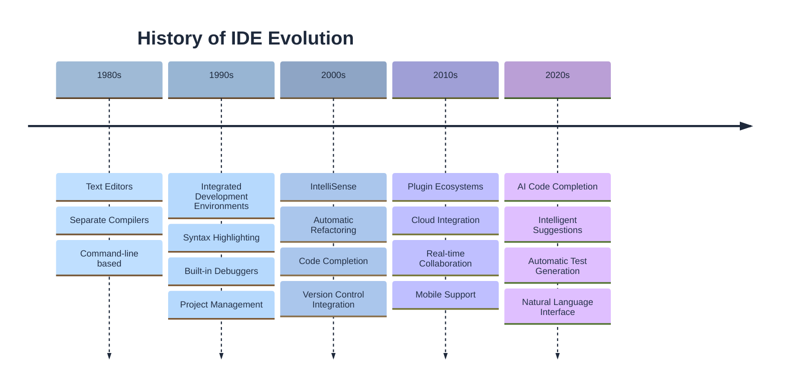
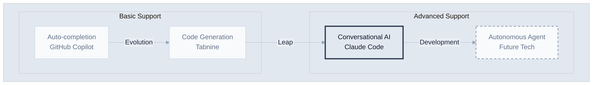
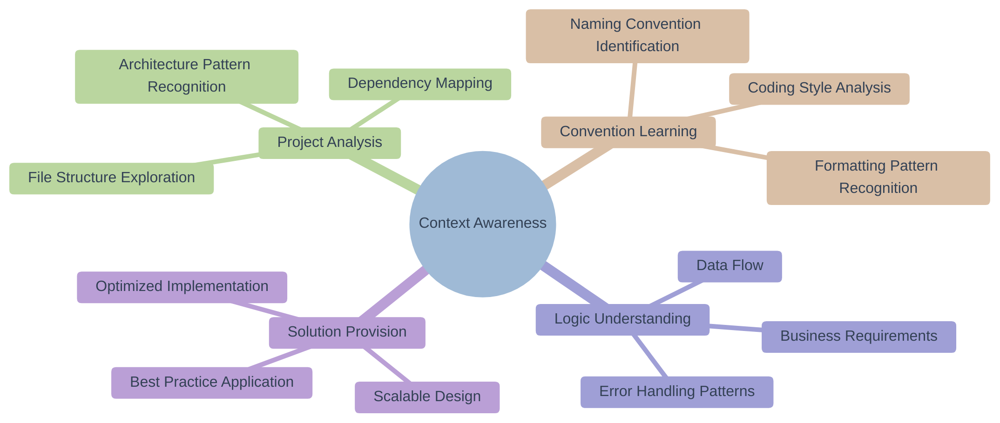
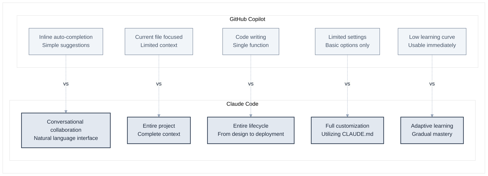
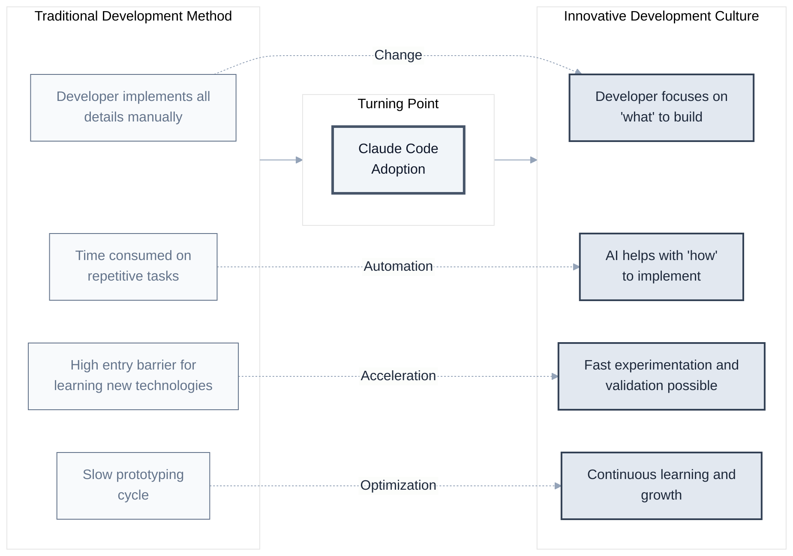

# Chapter 1: What is Claude Code?

> "The best way to predict the future is to invent it." - Alan Kay

In this chapter, we will explore what Claude Code is and why it is important.

The history of programming is a history of continuous **abstraction and tool development**. From machine language to assembly, from high-level languages to frameworks, and now we have reached a new era of writing code by conversing with AI in natural language.

Claude Code is an innovative tool that lies on this path of development. It overcomes the limitations of existing development methods and provides a more efficient and productive development environment.

## 1.1 Limitations of Traditional Development Tools

### Challenges in the Current Development Environment

First, to understand why Claude Code is necessary, let's look at the main difficulties developers currently face.

**1. Explosively Increasing Complexity**
Modern software has become truly complex. For example:

- Ordinary web applications depend on over 100 libraries.
- In a microservice environment, dozens of independent services must be managed.
- We are in the era of full-stack development, where a single developer needs to know everything from frontend, backend, database, to DevOps.

Because of this complexity, many developers feel overwhelmed about where to start when beginning a new project.

**2. Constantly Changing Technology Stack**
The speed of technological change is also very fast.

- New frameworks emerge every year in the JavaScript ecosystem.
- AWS alone offers over 200 services.
- Each programming language has its own unique philosophy and ecosystem, creating a heavy learning burden.

Continuous learning and adaptation are necessary in this rapidly changing technological environment.

**3. Repetitive and Tedious Tasks**
When developing, a lot of time is spent on repetitive tasks rather than creative parts.

- Writing boilerplate code of the same form every time
- Repetitive implementation of similar CRUD functionalities
- Tedious but necessary documentation and comment writing
- Important but boring test code writing

These tasks are necessary, but they are factors that consume a developer's creative energy.

### Evolution and Limitations of IDEs

Integrated Development Environments (IDEs) have been steadily developing over the past few decades.



However, limitations still exist.

1. **Lack of Context Understanding**: IDEs understand code syntax but not business logic or intent.

2. **Passive Tools**: They only provide help when explicitly requested by the developer.

3. **Fragmented Support**: Code writing, testing, documentation, deployment, etc., are separated.

## 1.2 Emergence of AI Pair Programming

### Redefining Pair Programming
**Traditional Pair Programming**

- Two developers sit at one computer and work
- One writes code (Driver), the other reviews (Navigator)
- Aims for knowledge sharing and code quality improvement

**AI Pair Programming**

- Developer and AI collaborate through conversation
- AI acts as a 24/7 available senior developer
- Provides instant feedback and diverse perspectives

### Spectrum of AI Development Tools



Claude Code represents the most advanced form in the 'conversational assistant' area.

## 1.3 Core Philosophy of Claude Code

### 1. Flexibility

Claude Code does not enforce specific workflows.

```bash
# All various approaches are possible
claude "Find and fix the bug"
claude "Implement a new feature using TDD"
claude "Refactor this code into a functional style"
claude "Analyze the architecture and suggest improvements"
```

### 2. Transparency

The entire work process is transparently disclosed.

```bash
# Check Claude Code's work process in real-time
> Exploring files: src/components/
> Analyzing code: UserProfile.jsx
> Applying modifications...
> Running tests...
```

### 3. Collaboration

AI is a colleague, not a tool.

- Suggests proposals and alternatives
- Warns about potential problems in advance
- Discusses better solutions
- Supports learning and growth

### 4. Context Awareness

Understands the entire project context.



## 1.4 Differentiation from Other AI Coding Tools

### Comparison with GitHub Copilot



| Feature | GitHub Copilot | Claude Code |
|------|----------------|-------------|
| Operation Method | Inline auto-completion | Conversational interaction |
| Context | Current file focused | Entire project |
| Scope of Work | Code writing | Design, implementation, testing, deployment |
| Customization | Limited | Fully customizable |
| Learning Curve | Low | Medium |

### Comparison with ChatGPT

| Feature | ChatGPT | Claude Code |
|------|---------|-------------|
| File System Access | Not possible | Full access |
| Code Execution | Limited | Direct execution possible |
| Persistence | Resets per conversation | Maintains project context |
| Tool Integration | None | Git, testing, build tools, etc. |

### Unique Features of Claude Code

**1. Project Customization via CLAUDE.md**
```markdown
# Rules for our project
- All components are written functionally
- Maintain test coverage above 80%
- Commit messages follow conventional commits
```

**2. Multimodal Input Support**

- Implement UI by looking at design screenshots
- Convert diagrams into code
- Debug with error screenshots

**3. True Full-Stack Support**
```bash
# From frontend to deployment all at once
claude "Create user authentication functionality. React frontend, Node.js backend, PostgreSQL database, and Docker containerization"
```

## Real Case: Real-time Chat App Created in 30 Minutes

Experience of a startup developer

> "I had to start a new project, and real-time chat functionality was key.
> Normally, it would have taken at least a week, starting from architecture design.
> But with Claude Code, I created a working prototype in 30 minutes.
> 
> What's more surprising is that the code quality was better than what I would have written myself.
> Error handling, security, and scalability were all considered."

Reasons why this was possible

1. Claude Code knows best practices for real-time communication
2. Automatically identifies project structure and integrates appropriately
3. Generates test code as well
4. Points out and resolves potential problems 사전

## Conclusion

Claude Code is not just a tool. It is a paradigm shift in development methods.



In the next chapter, we will actually install Claude Code and run our first command. Let's start a new journey of development with AI.