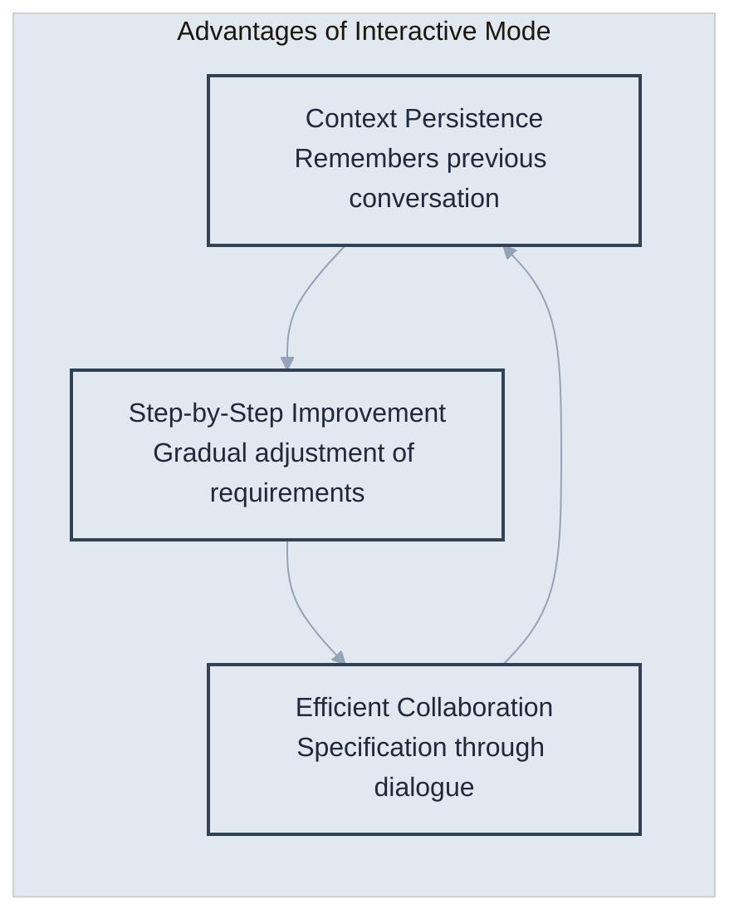
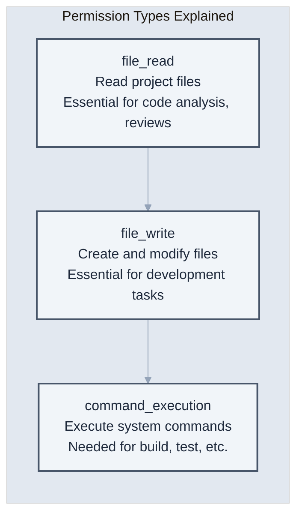
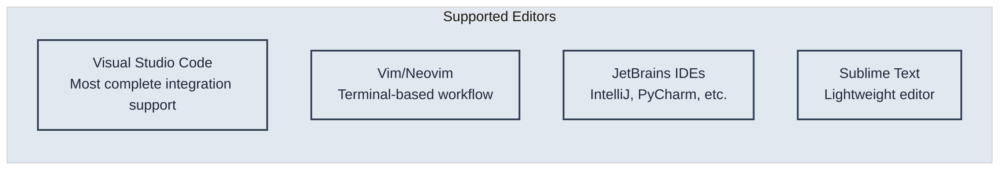
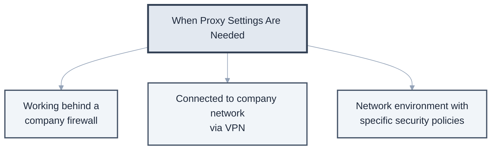
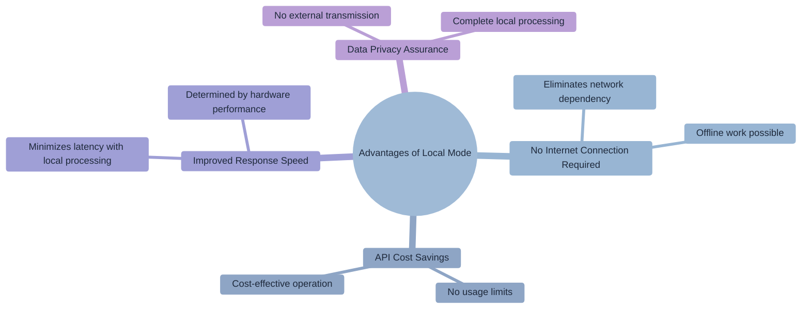

# Chapter 2: Installation and Initial Setup

> "Well begun is half done." - Korean Proverb

Now let's install Claude Code. This chapter provides **step-by-step installation guides for each operating system**, and also covers potential problems during installation and their solutions.

## 2.1 System Requirements

### Minimum Requirements

First, let's check if your system can run Claude Code. The minimum requirements are similar to a typical development environment and can run on most modern systems.

| Component | Minimum Requirement | Recommendation |
|----------|-------------|----------|
| Operating System | macOS 12+, Windows 10+, Ubuntu 20.04+ | Latest version |
| RAM | 8GB | 16GB or more |
| Storage | 2GB free space | 10GB or more |
| Internet | Stable connection required | High-speed internet |
| Node.js | 18.0 or higher | 20.0 or higher |

### Prerequisites

Let's check the system environment before installation. Open a terminal and run the following commands to check if the necessary tools are installed.

**How to Run Terminal**

- **Mac**: `Cmd + Space` → Search for "Terminal"
- **Windows**: `Win + R` → Type "cmd"
- **Linux**: `Ctrl + Alt + T`

```bash
# Check Node.js version
node --version

# Check npm version
npm --version

# Check Git installation (optional but recommended)
git --version
```

**If Node.js is not installed or the version is low**

1. Download the LTS version from the [Node.js official site](https://nodejs.org)
2. Or use a package manager
   - **Mac**: `brew install node` (Homebrew required)
   - **Windows**: `choco install nodejs` (Chocolatey required)
   - **Linux**: `sudo apt install nodejs npm` (Ubuntu/Debian)

> **Recommendation**: Using the LTS (Long Term Support) version ensures stability and compatibility.

## 2.2 Installation Guide (By OS)

Now let's install Claude Code for each operating system. We provide installation methods optimized for each OS.

### Installing on macOS

Two installation methods are provided for macOS.

**Method 1: Installation via npm (Recommended)**

This is the simplest and most stable method.

```bash
# Install Claude Code
npm install -g @anthropic-ai/claude-code

# Verify installation
claude --version
```

**Method 2: Installation via Homebrew**

```bash
# Add Homebrew tap
brew tap anthropic-ai/claude-code

# Install Claude Code
brew install claude-code

# Verify installation
claude --version
```

**macOS Specific Settings**

```bash
# Set terminal permissions (if necessary)
# System Preferences > Security & Privacy > Privacy > Full Disk Access
# Add Terminal.app or the terminal app you are using

# Exclude from Spotlight search (optional)
# Improve performance by excluding the .claude-code directory from Spotlight search
```

### Installing on Windows

On Windows, it is recommended to install Claude Code via WSL 2 (Windows Subsystem for Linux). Currently, Claude Code does not support a Windows native client, so a Linux environment is required.

**System Requirements**

| Item | Minimum Condition |
|------|-----------|
| OS | Windows 10 (21H2) or Windows 11 + WSL 2 |
| RAM | 4GB or more |
| Network | Internet connection (OAuth authentication and API calls) |
| Software | WSL 2, Node.js 18+, Git (optional) |

**Step 1: Install WSL 2**

Run PowerShell as **administrator** and enter the following command.

```powershell
# Install WSL (includes Ubuntu 22.04 LTS by default)
wsl --install

# Reboot system after installation
```

If you are using WSL 1, upgrade as follows:

```powershell
# Upgrade to WSL 2
wsl --set-version Ubuntu 2

# Check installation status
wsl --status
wsl --list --verbose
```

**Step 2: Install Node.js (Inside WSL)**

Open the WSL terminal (Ubuntu) and install Node.js via NVM.

```bash
# Install NVM
curl -o- https://raw.githubusercontent.com/nvm-sh/nvm/v0.39.7/install.sh | bash

# Apply changes
source ~/.bashrc

# Install and use Node.js 18 LTS
nvm install 18
nvm use 18

# Verify installation
node --version
npm --version
```

> **Important**: When running the `which node` command, the path should be displayed as `/home/<username>/.nvm/...`. If the path `/mnt/c/...` appears, it means there is a path conflict with Windows, so repeat the above process.

**Step 3: Install Claude Code**

```bash
# Install Claude Code
npm install -g @anthropic-ai/claude-code

# Verify installation
claude --version
```

**Troubleshooting Installation Errors**

| Error | Solution |
|------|----------|
| `OS detection failed` | Run `npm config set os linux` then `npm install -g @anthropic-ai/claude-code --force --no-os-check` |
| `exec: node: not found` | Recheck Node.js installation, check `which node` path |
| Permission error | Run `npm config set prefix '~/.npm-global'` then reinstall |

### Installing on Linux (Ubuntu/Debian)

```bash
# Update system packages
sudo apt update && sudo apt upgrade

# Install Node.js (if not already present)
curl -fsSL https://deb.nodesource.com/setup_20.x | sudo -E bash -
sudo apt install nodejs

# Install Claude Code
sudo npm install -g @anthropic-ai/claude-code

# Verify installation
claude --version

# Set permissions (if necessary)
sudo chmod +x /usr/local/bin/claude
```

## 2.3 Running Your First Command

Installation is complete. Now let's proceed with the basic setup of Claude Code.

### API Key Setup

An API key is required to use Claude Code. You can start with free usage.

**Step 1: Obtain an API Key**

1. Go to [Anthropic Console](https://console.anthropic.com)
2. Create an account or log in
3. Create a new key in the "API Keys" section

**Step 2: Set up the API Key**
```bash
# Run API key setup command
claude login

# Paste the copied API key when prompted
# (It is normal for the key not to be displayed on the screen when typing)
```

> **Security Note**: The API key is linked to your personal account, so be careful not to share it with others.

### First Conversation

Now let's start our first conversation with Claude Code.

```bash
# First greeting (Success if Claude responds!)
claude "Hello, Claude! Nice to meet you."

# Try a simple task request
claude "Please tell me the current system information"

# Try exploring a directory
claude "Show me what files are in the current folder"
```

**If the response is displayed correctly, the installation and basic setup are complete.** You are ready to use Claude Code.

### Interactive Mode vs. Command Mode

**Command Mode (One-off tasks)**
```bash
claude "Read the package.json file and summarize it"
```

**Interactive Mode (Continuous tasks)**

Command mode is suitable for single tasks, but interactive mode is more efficient for complex projects or tasks that require multiple steps.

```bash
# Start interactive mode
claude

# Now you can chat continuously
> I want to start a new React project
> Use TypeScript and set up a testing environment too
> Add Material-UI as well
```



Advantages of Interactive Mode

## 2.4 Optimizing Basic Settings

To use Claude Code more efficiently, it's important to adjust settings according to your work environment and preferences. This section will cover major configuration options and optimization methods.

### Global Configuration File

All Claude Code settings are managed in a configuration file in your home directory. You can configure a personalized work environment through this file.

**Configuration File Location**: `~/.claude-code/config.json`

```json
{
  "api_key": "sk-ant-...",              // API authentication key
  "default_model": "claude-3-opus-20240229", // Default model to use
  "theme": "dark",                       // Interface theme (dark/light)
  "editor": "vscode",                    // Preferred editor
  "auto_commit": false,                  // Whether to auto-commit
  "language": "en",                      // Default language setting
  "permissions": {
    "file_write": true,                  // File write permission
    "file_read": true,                   // File read permission
    "command_execution": true            // Command execution permission
  }
}
```

**Explanation of Major Configuration Options**

- `default_model`: Choose the appropriate model based on task type (opus: complex tasks, sonnet: general tasks, haiku: fast responses)
- `auto_commit`: Decide whether to automatically Git commit code changes
- `permissions`: Recommended to enable only necessary permissions for security

### Permission Settings

Claude Code is a powerful tool, so proper permission management is important. You can adjust permissions based on your work environment and security requirements.



**Permission Types Explained**

Permission setting strategy for balancing security and convenience

```bash
# Grant all permissions (development environment)
claude --allow-all

# Read-only mode (for code reviews)
claude --read-only

# Grant specific permissions only
claude --allow-read --allow-write --deny-execute
```

### Editor Integration

To increase development efficiency, you can integrate Claude Code with your existing editor. Editor integration allows for a seamless connection between code editing and AI support.



**Supported Editors**

Integration settings with your preferred editor

```bash
# VSCode integration
claude config set editor vscode

# Vim integration
claude config set editor vim

# Call Claude Code directly from the editor
# VSCode: Cmd+Shift+P > "Claude: Ask"
```

### Proxy Settings (Corporate Environment)

Many companies access the external internet through proxy servers for security reasons. Claude Code supports proxy settings to be usable in such environments.



**When Proxy Settings Are Needed**

How to set up proxy in a corporate environment

```bash
# HTTP proxy settings
export HTTP_PROXY=http://proxy.company.com:8080
export HTTPS_PROXY=http://proxy.company.com:8080

# Claude Code specific proxy settings
claude config set proxy http://proxy.company.com:8080
```

## 2.5 Troubleshooting Guide

This section summarizes common problems that may occur during Claude Code installation and initial use, along with their solutions. Step-by-step solutions are provided for each problem situation, so following them carefully should resolve most issues.

### Frequently Occurring Problems and Solutions

The following are the most common problems experienced by Claude Code users and their verified solutions.

**1. "command not found: claude"**

This error occurs when Claude Code is installed but not registered in the system PATH.

**Cause Analysis**

- npm global installation path not included in PATH
- Incorrect installation path
- Shell environment variable setting issue

**Solution**
```bash
# Step 1: Check npm global path
npm config get prefix

# Step 2: Add to PATH (bash/zsh)
echo 'export PATH="$PATH:$(npm config get prefix)/bin"' >> ~/.bashrc
source ~/.bashrc

# Step 3: Verify installation
claude --version
```

**Additional Solutions**

- May need to modify `.zshrc` file on macOS
- Modify PATH in system environment variables on Windows

**2. "EACCES: permission denied"**

This error occurs due to permission issues during npm global installation. It is especially common on Linux or macOS.

**Cause Analysis**

- Lack of write permission for npm global directory
- Ownership issue when installed with sudo
- Attempting to install in a system-protected directory

**Solution**
```bash
# Method 1: Modify permissions (Recommended)
sudo chown -R $(whoami) $(npm config get prefix)/{lib/node_modules,bin,share}

# Method 2: Execute via npx (Temporary solution)
npx @anthropic-ai/claude-code

# Method 3: Change npm global directory
mkdir ~/.npm-global
npm config set prefix '~/.npm-global'
echo 'export PATH=~/.npm-global/bin:$PATH' >> ~/.bashrc
source ~/.bashrc
```

**3. "API rate limit exceeded"**

This error occurs when the API usage limit is reached. The number of requests per hour is limited according to Anthropic's API policy.

**Cause Analysis**
- Too many requests in a short time
- Reached API plan usage limit
- Duplicate requests due to network problems

**Solution**
```bash
# Step 1: Check current status
claude status

# Step 2: Set auto-retry interval (milliseconds)
claude config set retry_delay 5000

# Step 3: Set maximum number of retries
claude config set max_retries 3
```

**Prevention Methods**

- Execute large tasks by dividing them into smaller units
- Adjust request speed using the `--rate-limit` option
- Monitor API usage to anticipate limits

**4. "SSL certificate problem"**

This occurs when SSL certificate verification fails due to the use of self-signed certificates in a corporate environment or network security policies.

**Cause Analysis**

- SSL inspection by company firewall
- Use of self-signed certificates
- Certificate store issues on older systems

**Solution**
```bash
# ⚠️ Temporary solution (Security risk)
export NODE_TLS_REJECT_UNAUTHORIZED=0

# ✅ Recommended solution: Install company certificate
# Step 1: Obtain certificate file from IT department
# Step 2: Register certificate with npm
npm config set cafile /path/to/company-cert.pem

# Step 3: Claude Code specific settings
claude config set tls_verify true
claude config set ca_bundle /path/to/company-cert.pem
```

**Security Considerations**

- `NODE_TLS_REJECT_UNAUTHORIZED=0` poses a security risk, use only temporarily
- If possible, collaborate with the IT department for proper certificate setup

### Performance Optimization Tips

These are settings to improve Claude Code's response speed and efficiency. Adjust appropriately based on project size and work patterns.

**1. Enable Caching**

Improves speed by caching responses to repetitive requests.

```bash
# Enable response caching
claude config set cache_enabled true

# Set cache TTL (seconds, default: 3600s = 1 hour)
claude config set cache_ttl 3600

# Set cache size limit (MB)
claude config set cache_max_size 100
```

**Cache Usage Tips**

- Useful when repeatedly analyzing the same code
- Effective for incremental work on large projects
- Clear cache: `claude cache clear`

**2. Adjust Context Size**

Adjust the context size that Claude Code can process at once, depending on the project scale.

```bash
# Increase context for large projects
claude config set max_context_length 100000

# For small projects or when fast responses are needed
claude config set max_context_length 50000

# Check current setting
claude config get max_context_length
```

**Setting Guidelines**
- **Small projects (< 50 files)**: 50,000
- **Medium projects (50-200 files)**: 100,000
- **Large projects (200+ files)**: 200,000

**Caution**: Larger context may lead to longer response times and increased API costs.

**3. Use Local Model (Beta)**

A feature under development that allows running models locally, enabling Claude Code usage without an internet connection.

```bash
# Enable local mode
claude config set local_mode true

# Download local model (Caution: Several GBs in size)
claude download-model claude-instant

# Check downloaded models
claude list-models --local

# Run with a specific model
claude --model local:claude-instant "Analyze the code"
```



**Advantages of Local Mode**

**Requirements**
- Sufficient storage space (2-8GB per model)
- Powerful hardware (GPU recommended)
- Some limitations exist as it's a beta feature

## Lab: Hello World Project

Now that we've finished the theoretical setup, let's actually use Claude Code. We'll experience the basic usage of Claude Code through a simple web server project.

**Learning Objectives**
- Learn how to use Claude Code's natural language commands
- Experience the entire process from project creation to execution
- Understand the quality and structure of the generated code

**Lab Process**

```bash
# Step 1: Create project directory
mkdir hello-claude && cd hello-claude

# Step 2: Initialize project with Claude Code
claude "Create a simple Hello World web server with Node.js.
Make it run on port 3000 and display 'Hello from Claude Code!' when accessing the '/' path.
Also, create package.json and README.md files."

# Step 3: Check generated file structure
ls -la
# Expected result
# package.json  - Project configuration file
# server.js     - Web server main file
# README.md     - Project description document

# Step 4: Install dependencies
npm install

# Step 5: Run the server
npm start

# Step 6: Test in browser
# Access http://localhost:3000 and check for "Hello from Claude Code!" message
```

**Lab Points**
- Convey complex requirements at once using natural language
- Observe the quality and structure of code generated by Claude Code
- Check the generated README.md for additional usage instructions

**Lab Completion Checklist**
- [ ] Was the project successfully created?
- [ ] Does the server start normally?
- [ ] Is the correct message displayed in the browser?
- [ ] Is the generated code structure understandable?

You have successfully created your first project with Claude Code!

## Installation Complete and Next Steps

The installation and basic setup of Claude Code are now complete. You should have experienced the power of Claude Code through the first lab.

**What You Learned in This Chapter**
- OS-specific installation methods and environment setup
- API key setup and first conversation
- Troubleshooting methods and performance optimization
- Experience creating an actual project

**Next Chapter Preview**
In Chapter 3, you will systematically learn the core features of Claude Code.
- **File System Exploration**: Understanding project structure and efficient code analysis
- **Code Writing and Modification**: Sophisticated code generation and refactoring through natural language
- **Testing and Debugging**: Verification and problem-solving for high-quality code
- **Git Integration**: Workflows for version control and collaboration

**Useful Reference Commands**
```bash
# Check help
claude help

# Start interactive tutorial
claude tutorial

# Check current configuration
claude config list

# Check version information
claude --version
```

**Troubleshooting Resources**
- Official Documentation: https://docs.anthropic.com/claude-code
- Community Forum: https://community.anthropic.com
- GitHub Issues: https://github.com/anthropic/claude-code/issues