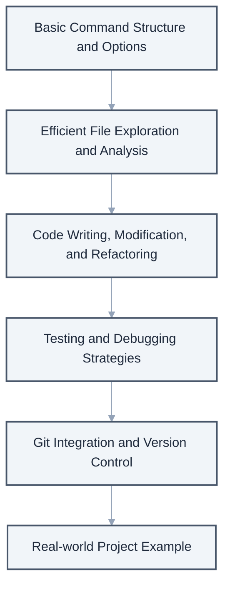
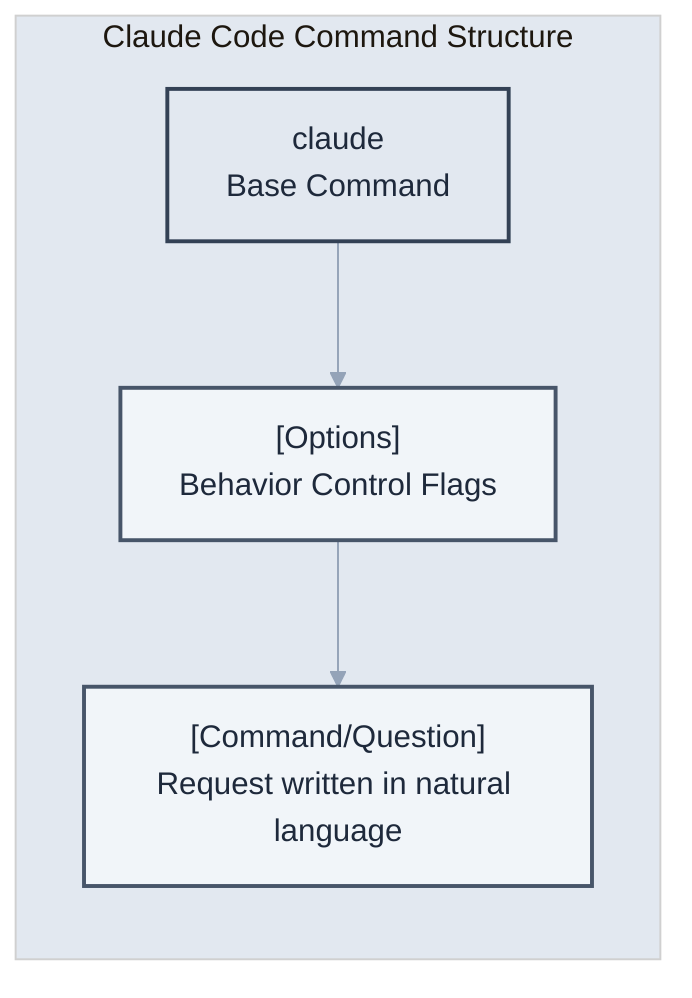
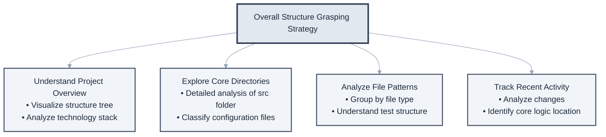
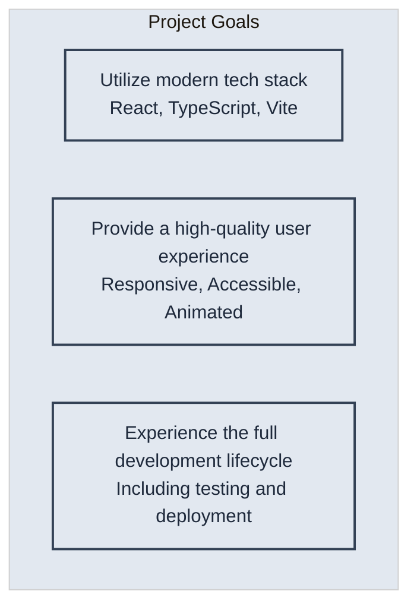
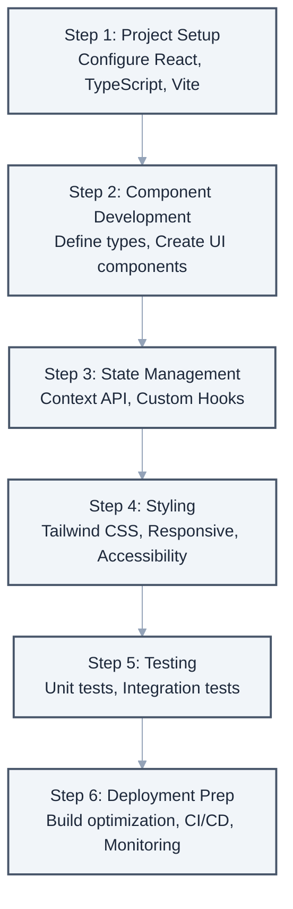

# Chapter 3: Mastering Basic Usage

> "A journey of a thousand miles begins with a single step." - Lao Tzu

In this chapter, we will systematically learn the core features of Claude Code. Through **hands-on examples**, we will learn how to effectively apply Claude Code to everyday development tasks.



Topics covered in this chapter

## 3.1 Basic Command Structure

### Command Anatomy



The structure of Claude Code commands is intuitive yet powerful.

### Key Options

Claude Code allows fine-grained control over its behavior through various options. Understanding the purpose and usage scenarios of each option will enable more effective use.

**Basic Options**
```bash
# View help - Check all available commands and options
claude --help
claude -h

# Check version - Check the currently installed Claude Code version
claude --version
claude -v

# Clear conversation history - When you want to start with a new context
claude --clear
claude -c
```

**Model Selection Options**
```bash
# Use high-performance model for complex tasks
claude --model claude-3-opus "Implement a complex algorithm"

# Simple tasks requiring quick responses
claude -m claude-3-haiku "Just give a simple explanation"

# Balanced performance and speed
claude -m claude-3-sonnet "Review the code"
```

**Output Format Control**
```bash
# Receive structured data in JSON format
claude --json "Output the project structure in JSON"

# Generate documentation in Markdown format
claude --markdown "Show the README file content in Markdown"

# Plain text output (default)
claude --plain "Show a simple explanation in text"
```

### The Power of Natural Language Commands

A key feature of Claude Code is the ability to convey intent using natural language instead of complex command syntax.

```bash
# Technical request
claude "Add an email validation method to the UserService class"

# Exploratory question
claude "How is authentication handled in this project?"

# Creative request
claude "Is there a way to make this function more efficient?"

# Complex task
claude "Find and fix the bug, write tests, and then create a commit message"
```

## 3.2 File Exploration and Reading

### Understanding Project Structure

When assigned to a new project, quickly grasping the overall structure is crucial. Claude Code can be used to efficiently explore the codebase.



**Overall Structure Grasping Strategy**

### Efficient File Reading

This is not just about opening files, but effectively extracting information relevant to your purpose.

```bash
# Read a single file
claude "Read the package.json file"

# Read multiple files simultaneously
claude "Read all configuration files (starting with config) and summarize them"

# Read only a specific part
claude "Show only the router configuration part from the app.js file"

# Compare files
claude "Compare the development and production environment configuration files"
```

### Code Analysis Requests

Useful analysis requests for understanding how existing code works or discovering potential problems.

```bash
# Function analysis
claude "Explain how the calculateTotalPrice function works"

# Dependency analysis
claude "Explain the main libraries used in this project and their purposes"

# Architecture analysis
claude "Explain the overall architecture of this project with a diagram"

# Security vulnerability scan
claude "Scan for any code that could be a security issue"
```

## 3.3 Code Writing and Modification

### Creating New Files

You can automatically generate new files that conform to the project's conventions and structure.

```bash
# Basic file creation
claude "Create date-related utility functions in the utils folder"

# Template-based generation
claude "Create a user router using the Express router template"

# Automatic test file generation
claude "Create a Jest test file for UserService"

# Document generation
claude "Create API endpoint documentation in Swagger format"
```

### Code Modification Patterns

Methods for systematically performing various modification tasks. We will introduce actual usage scenarios and best practices for each pattern.

**1. Simple Modification - Code Modernization**
```bash
# Upgrade ES5 to ES6+ syntax
claude "Change all var to const or let. Use let only for reassigned variables"

# Convert callbacks to async/await
claude "Change callback-based code to async/await pattern"

# Change string concatenation to template literals
claude "Change string concatenation operator (+) to template literals"
```

**2. Refactoring - Improving Code Structure**
```bash
# Split long functions
claude "This function is over 50 lines long, split it into logical units to improve readability"

# Remove duplicate code
claude "Find duplicate code and extract it into a reusable function"

# Simplify conditional statements
claude "Improve complex if-else chains with early return patterns or switch statements"
```

**3. Adding Features - Incremental Improvement**
```bash
# Add error handling
claude "Add appropriate error handling and retry logic to this API call function"

# Manage loading states
claude "Add logic to manage loading, success, and error states in this component"

# Add validation
claude "Add real-time validation to the user input form"
```

**4. Bug Fixing - Enhancing Stability**
```bash
# Find potential errors
claude "Find parts where null/undefined reference errors might occur and fix them with optional chaining"

# Prevent memory leaks
claude "Find and fix parts where event listeners or timers are not properly cleaned up"

# Resolve race conditions
claude "Find and fix parts where race conditions might occur in asynchronous operations"
```

### Unifying Code Style

Applying a consistent coding style across the entire project.

```bash
# Formatting
claude "Format the entire project according to Prettier rules"

# Naming conventions
claude "Change camelCase to snake_case"

# Add comments
claude "Add explanatory comments to complex logic"

# Add types
claude "Add TypeScript types to JavaScript files"
```

## 3.4 Test Execution and Debugging

### Writing Tests

Systematic test writing methods for high-quality software.

```bash
# Unit tests
claude "Write unit tests for the calculateDiscount function"

# Integration tests
claude "Write integration tests for the user registration API"

# Edge cases
claude "Find edge cases for this function and add tests"

# Test coverage
claude "Check test coverage and add tests for missing parts"
```

### Debugging Strategies

Systematic approaches to effectively identify and resolve causes when problems occur.

**1. Analyzing Error Messages**
```bash
claude "Explain what this error message means and suggest a solution
TypeError: Cannot read property 'name' of undefined"
```

**2. Adding Logs**
```bash
claude "Add debug logs to the part where the problem seems to be occurring"
```

**3. Step-by-Step Tracing**
```bash
claude "Modify the code so I can trace the execution flow of this function step by step"
```

**4. Performance Analysis**
```bash
claude "Find the performance bottleneck in this code and optimize it"
```

### Real-time Debugging Session

Examples of resolving complex problems interactively. Let's learn effective collaboration methods with Claude Code through actual debugging scenarios.

**Scenario 1: Resolving Server Start Error**
```bash
# Start interactive debugging
claude

> The server won't start. It says port 3000 is already in use.
< I'll check for processes using port 3000. I'll run the following command for you:
  lsof -i :3000

> I checked, and a previously run node process is running with PID 12345.
< I will safely terminate that process and create a script to prevent this issue in the future.
  1. Create a process termination script
  2. Add a restart script to package.json
  3. Implement graceful shutdown code

> Okay, go ahead. And I also want to know why the server didn't shut down properly.
< Analyzing the server code, I found the following issues:
  1. The process was forcibly terminated because there was no SIGTERM signal handler.
  2. Active connections were not being cleaned up.
  3. The database connection pool was not being closed.
  
  Now I will resolve these issues one by one...
```

**Scenario 2: Tracking Memory Leaks**
```bash
claude

> When the server runs for a few days, memory usage keeps increasing. I think there's a memory leak.
< To track the memory leak, I will proceed with the following steps:
  1. Search for patterns in the current code that might cause memory leaks.
  2. Set up memory profiling tools.
  3. Add monitoring to suspected code areas.

> What patterns are risky?
< I found the following patterns:
  - 3 places where event listeners are not removed.
  - A cache where data is continuously added to a global variable.
  - Object structures with circular references.
  Shall I show you how to fix each one?
```

## 3.5 Git Integration and Version Control

### Basic Git Operations

How to perform routine version control tasks with Claude Code.

```bash
# Check status
claude "Check git status and summarize the changes"

# Staging
claude "Stage only the test-related files among the modified files"

# Commit
claude "Write a meaningful commit message and commit"

# Branch management
claude "Create a new branch for a new feature and check it out"
```

### Advanced Git Operations

Even complex Git operations can be performed safely and efficiently with the help of Claude Code.

```bash
# Interactive rebase
claude "Clean up the last 3 commits and squash them into one"

# Conflict resolution
claude "Resolve the merge conflict. Keep both changes."

# History analysis
claude "Find out when this bug was introduced using git bisect"

# Cherry-pick
claude "Cherry-pick only the bug fix commit from the hotfix branch to main"
```

### Creating Pull Requests

Tasks related to Pull Requests, which are important for team collaboration.

```bash
# Create PR
claude "Create a Pull Request for this feature.
Summarize the changes and include testing methods."

# Respond to code reviews
claude "Address the points raised by the reviewer and write a response"

# Utilize PR templates
claude "Write the description according to the project's PR template"
```

## Real-world Example: Creating a Todo App

Let's build an actual project by comprehensively utilizing the basic usage methods learned so far. We will learn practical application of Claude Code by developing a Todo application step by step.



**Project Goals**



### Todo App Development Step-by-Step Guide
```

**Project Completion Checklist**
- [ ] Do all CRUD functions work correctly?
- [ ] Does the responsive design work well on all screen sizes?
- [ ] Is test coverage above 80%?
- [ ] Is the Lighthouse score above 90?
- [ ] Does it meet accessibility standards?

## Pro Tips: Maximizing Efficiency

### 1. Setting Aliases

You can increase work efficiency by setting shortened aliases for frequently used commands.

```bash
# Add to ~/.bashrc or ~/.zshrc
alias cc="claude"
alias ccc="claude --clear"
alias ccr="claude 'npm run'"
```

### 2. Utilizing Templates

Increase reusability by saving frequently used command patterns as templates.

**Creating Template Directory Structure**
```bash
# Create Claude Code template directory
mkdir -p ~/.claude-templates/{components,features,tests,docs}
```

**Practical Template Examples**

1. **React Component Template**
```bash
# Component creation template
cat > ~/.claude-templates/components/react-component.txt << 'EOF'
Create a new React component
- Component name: [COMPONENT_NAME]
- Write as a functional component
- Use TypeScript
- Define Props interface
- Include basic styles
- Also generate Storybook story file
- Include unit test file
EOF

# Usage example
COMPONENT_NAME="UserProfile" envsubst < ~/.claude-templates/components/react-component.txt | claude
```

2. **API Endpoint Template**
```bash
# API route creation template
cat > ~/.claude-templates/features/api-endpoint.txt << 'EOF'
Create a new REST API endpoint
- Resource: [RESOURCE_NAME]
- Include all CRUD operations
- Use Express.js router
- Input validation middleware
- Error handling
- Swagger documentation comments
- Include integration tests
EOF
```

3. **Bug Fix Template**
```bash
# Bug fix workflow template
cat > ~/.claude-templates/features/bugfix.txt << 'EOF'
Fix the following bug
1. First, find and analyze the related code
2. Explain the root cause of the bug
3. Suggest and implement a fix
4. Add tests to prevent recurrence
5. Summarize the changes with a commit message

Bug description: [BUG_DESCRIPTION]
EOF
```

### 3. Maintaining Context

Utilize interactive mode to maintain context when performing complex and lengthy tasks. Effective context management is key to the success of large-scale tasks.

**Large-Scale Refactoring Scenario**
```bash
# Start in interactive mode
claude

> From now on, I'm going to migrate legacy code to a modern architecture.
< Understood. I will first analyze the current codebase and create a migration plan.

> Step 1: Analyze the current architecture and identify problems.
< Analysis Results
  - Monolithic structure with high coupling between modules
  - Class-based component usage (React 16.2)
  - State management is complex due to prop drilling
  - Test coverage 30%
  
  Identified key areas needing improvement. Shall I proceed?

> Step 2: Create a migration roadmap.
< Step-by-Step Migration Roadmap
  Phase 1: Infrastructure Modernization (1-2 weeks)
  - Migrate build tool from Webpack to Vite
  - Introduce TypeScript
  
  Phase 2: Component Modernization (3-4 weeks)
  - Convert class components to functional
  - Extract logic with Custom Hooks
  
  Phase 3: State Management Improvement (1 week)
  - Introduce Context API or Zustand
  
  Phase 4: Test Enhancement (1 week)
  - Target 80% test coverage

> Okay, let's start with Phase 1. Proceed with the Vite migration first.
< Starting Phase 1: I will proceed with the Vite migration step by step...
```

**Context Maintenance Tips**

1. **Create Checkpoints**: Request a summary of progress upon completion of each step.
2. **Clear Step Demarcation**: Specify work steps with numbers or labels.
3. **Regular Verification**: Check results intermittently and adjust direction.
4. **Save Context**: Save important decisions as separate documents.

## Conclusion

In this chapter, we systematically learned the core features of Claude Code.

**Key Learnings**
- **Natural Language-Based Commands**: Clearly convey intent without complex syntax.
- **Project Exploration**: Quickly understand and analyze the codebase.
- **Code Management**: Efficient methods for writing, modifying, and refactoring.
- **Quality Management**: Ensuring stability through testing and debugging.
- **Version Control**: Systematic development workflow through Git integration.

**Practical Application Points**
- Delegate repetitive tasks to Claude Code to focus on creative work.
- Solve complex problems using interactive mode.
- Perform accurate tasks by utilizing project context.

In the next chapter, we will learn how to customize Claude Code for each project using the CLAUDE.md file. Let's learn optimization strategies tailored to the characteristics of each project.