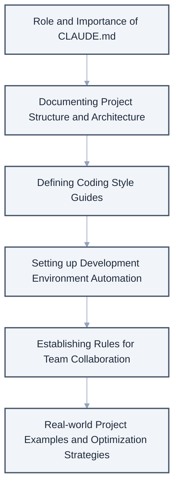
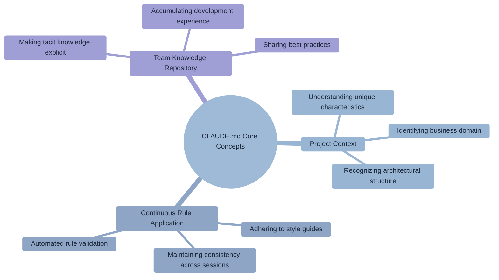
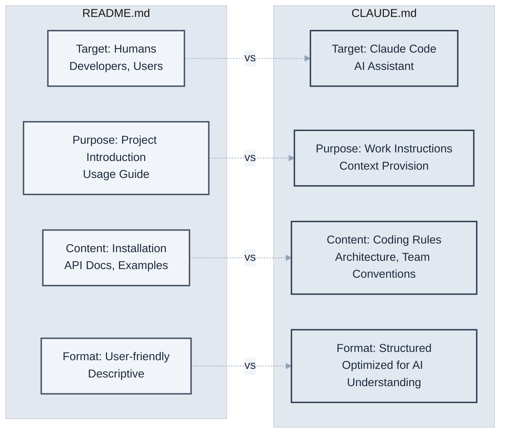
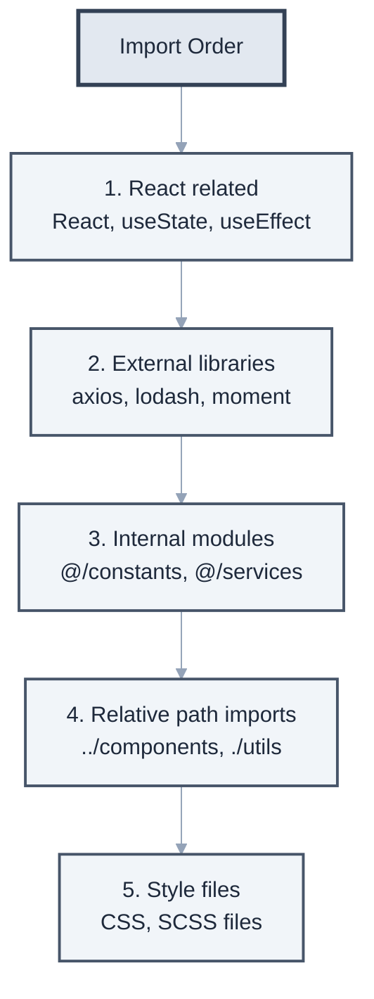
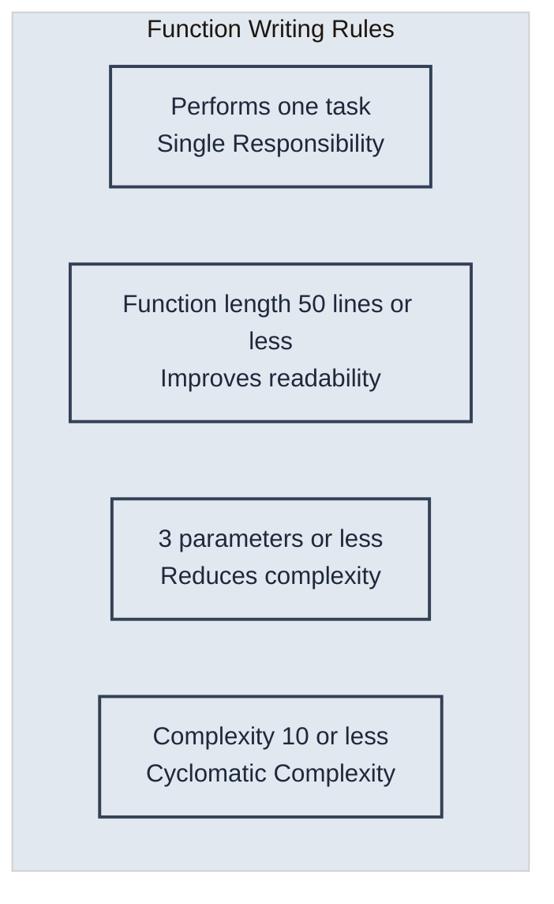

# Chapter 4: Customizing Projects with CLAUDE.md

> "Good tools adapt to the user." - Donald Norman

In this chapter, we will learn about **project customization through the CLAUDE.md file**. We will systematically learn how to optimize Claude Code according to the unique characteristics and requirements of each project.

CLAUDE.md is a core tool that helps Claude Code understand the project's context, adhere to the team's coding rules, and generate code of consistent quality.



**Topics covered in this chapter**

## 4.1 Role and Importance of CLAUDE.md

### What is CLAUDE.md?

CLAUDE.md is a special Markdown file located in the project's root directory. This file provides Claude Code with project-specific instructions and rules, enabling it to produce more accurate and consistent results.



**Core Concepts of CLAUDE.md**

Project structure example:

```
Project Root/
├── CLAUDE.md          # Claude Code configuration file
├── README.md          # General project documentation
├── package.json
└── src/
```

### Why is it Important?

Let's look at the main benefits of using CLAUDE.md with specific examples.

**1. Ensuring Consistency**

Let's compare the difference with and without CLAUDE.md.
```markdown
# CLAUDE.md
## Code Style

- All functions should be arrow functions.
- Always use semicolons.
- Indentation is 2 spaces.
```

**2. Automatic Application of Team Rules**

If you define the team's Git commit rules in CLAUDE.md, Claude Code will automatically generate commit messages that conform to these rules.

```markdown
## Git Commit Rules
- feat: Add a new feature
- fix: Fix a bug
- docs: Modify documentation
- style: Code formatting (no functional changes)
- refactor: Code refactoring (no functional changes)
- test: Add or modify tests
- chore: Changes to build process or auxiliary tools

## Commit Message Format
<type>(<scope>): <subject>

Example:
feat(auth): Add social login functionality
fix(api): Fix null reference error when querying user
```

With this definition, Claude Code automatically generates commit messages in the correct format.

**3. Project-Specific Knowledge**

Specifying the project's domain knowledge allows Claude Code to understand the business context and generate more accurate code.

```markdown
## Domain Terminology
- SKU (Stock Keeping Unit): Inventory management unit
  - Example: "SHOE-NIKE-AF1-WHT-42" (Nike Air Force 1 White Size 42)
- PDP (Product Detail Page): Product detail page
  - Key components: Image gallery, price information, stock status, reviews
- CAC (Customer Acquisition Cost): Customer acquisition cost
  - Formula: Total marketing cost / Number of new customers

## Business Rules
- Display "Low Stock" when inventory is 5 or less.
- New members automatically receive a 10% discount on their first purchase.
- Free shipping for purchases over 50,000 KRW.
```

### CLAUDE.md vs README.md



It's important to clearly understand the differences and respective roles of these two files.

**Practical Usage Example**

```markdown
# README.md (Documentation for humans)
## Project Introduction
This project is an e-commerce platform.

## Installation

1. Clone the repository.
2. Run `npm install`.
3. Start the server with `npm start`.

---

# CLAUDE.md (Documentation for Claude Code)
## Project Architecture
- Pattern: MVC + Repository Pattern
- Frontend: React 18 + TypeScript
- Backend: Node.js + Express
- Database: PostgreSQL + Redis

## Code Generation Rules
- All API responses must be wrapped with ResponseDto.
- Use CustomError class for errors.
- Asynchronous functions must include try-catch.
```

## 4.2 Documenting Project Structure

### Basic Structure Explanation

Clearly defining the project's directory structure and the role of each file allows Claude Code to perform more accurate tasks. This should go beyond a simple structure listing to include the responsibilities of each directory and file naming conventions.

```markdown
# CLAUDE.md

## Project Structure

### Directory Structure
```
src/
├── components/      # React components
│   ├── common/     # Common components
│   ├── features/   # Feature-specific components
│   └── layouts/    # Layout components
├── hooks/          # Custom React hooks
├── services/       # API communication logic
├── store/          # Redux store
├── utils/          # Utility functions
└── types/          # TypeScript type definitions
```

### Key File Locations
- Environment configuration: `.env`, `.env.example`
- API endpoints: `src/services/api.ts`
- Routing configuration: `src/routes/index.tsx`
- Global styles: `src/styles/global.css`

### File Naming Conventions
- Components: PascalCase (e.g., UserProfile.tsx)
- Utilities: camelCase (e.g., formatDate.ts)
- Constants: UPPER_SNAKE_CASE (e.g., API_ENDPOINTS.ts)
- Styles: kebab-case (e.g., user-profile.module.css)
```

### Specifying Architectural Patterns

Specifying the main architectural patterns and design principles used in the project helps generate consistent code.

```markdown
## Architectural Patterns

### State Management
- Use Redux Toolkit
- Create slice files for each feature
- Manage API state with RTK Query

### Component Structure
```typescript
// All components follow this structure
interface ComponentProps {
  // define props
}

export const ComponentName: React.FC<ComponentProps> = (props) => {
  // Hooks at the top
  // Logic
  // Return JSX
}
```

### Data Flow

1. User Action → 2. Action Dispatch → 3. Reducer Processing → 4. State Update → 5. UI Re-render


## 4.3 Defining Coding Style Guides

### Language-Specific Style Guides

Define consistent coding styles for each programming language used in the project. This goes beyond simple formatting rules and is a key element in enhancing code readability and maintainability.

````markdown
## Coding Style

### TypeScript/JavaScript
- Function names: camelCase
- Component names: PascalCase
- Constants: UPPER_SNAKE_CASE
- File names: kebab-case.ts

### Naming Convention Examples
```typescript
// Good examples
const getUserData = async (userId: string) => { }
const MAX_RETRY_COUNT = 3;
export const UserProfile: React.FC = () => { }

// Examples to avoid
const get_user_data = async (userid) => { }
const maxretrycount = 3;
export const userprofile = () => { }
```



### Import Order

```typescript
import React, { useState, useEffect } from 'react';
import { useSelector } from 'react-redux';
import axios from 'axios';

import { API_ENDPOINTS } from '@/constants';
import { UserService } from '@/services';

import { Button } from '../components';
import './styles.css';
```
````

### Code Quality Standards

Establish specific standards and rules for maintaining high-quality code. These standards can also be used as a checklist during code reviews.

```markdown
## Code Quality Standards



### Function Writing Rules

### Error Handling
```typescript
// All asynchronous functions use try-catch
try {
  const data = await fetchData();
  return { success: true, data };
} catch (error) {
  console.error('Error fetching data:', error);
  return { success: false, error: error.message };
}
```

### Commenting
- Explain 'why' the code does something, not 'what' it does.
- Document functions in JSDoc format.
- TODO comments should include an issue number.

```typescript
/**
 * Validates the user authentication token.
 * @param token - JWT token
 * @returns Whether the token is valid.
 */
const validateToken = (token: string): boolean => {
  // TODO(#123): Add token expiration validation logic
  return jwt.verify(token, SECRET_KEY);
}
```

## 4.4 Development Environment Automation

### Development Environment Setup

Specify essential tools and settings for a consistent development environment. Provide a step-by-step guide for new team members to quickly set up their development environment.

```markdown
## Development Environment

### Required Tools
- Node.js 18.0 or higher
- pnpm 8.0 or higher (use instead of npm)
- VS Code + Recommended extensions

### Initial Setup Script
# Install dependencies
pnpm install

# Set environment variables
cp .env.example .env

# Database migration
pnpm db:migrate

# Start development server
pnpm dev
```

### VS Code Settings
The `.vscode/settings.json` file will be applied automatically.
- Auto-formatting (on save)
- ESLint auto-fix
- Notification for recommended extension installation

### Code Generation Templates
When running `pnpm generate:component`:

1. Enter component name
2. Select component type (general/page/layout)
3. Files are generated automatically:
   - ComponentName.tsx
   - ComponentName.test.tsx
   - ComponentName.stories.tsx
   - index.ts

### Git Hooks

- pre-commit: Lint and formatting checks
- commit-msg: Commit message format validation
- pre-push: Run tests

## 4.5 Establishing Rules for Team Collaboration

### Code Review Guidelines

Establish systematic guidelines for effective code reviews. Provide practical guidance for both reviewers and authors, going beyond a simple checklist.

```markdown
## Code Review Guidelines

### PR Creation Rules
1. Title: `[Type] Brief description`
2. Body must include:
   - Summary of changes
   - Related issue number
   - Testing method
   - Screenshot (for UI changes)

### Review Checklist
- [ ] Does the code follow project conventions?
- [ ] Are tests sufficiently written?
- [ ] Is performance impact considered?
- [ ] Are there no security vulnerabilities?
- [ ] Is documentation updated?

### Merge Criteria
- At least 1 approval required
- All CI checks pass
- Conflicts resolved

### Branching Strategy

Define strategies and rules for systematic Git branch management. Introduce a practical branching strategy based on Git Flow.

## Git Branching Strategy

### Branch Naming Conventions
- feature/feature-name: New feature development
- fix/issue-number: Bug fix
- hotfix/description: Urgent fix
- refactor/target: Refactoring

### Branch Flow
main
  ├── develop
  │     ├── feature/user-auth
  │     ├── feature/payment
  │     └── fix/123
  └── hotfix/critical-bug

### Merge Strategy
- feature → develop: Squash merge
- develop → main: Merge commit
- hotfix → main: Cherry-pick
```


## Team Communication

### Issue Templates
Bug Report

- Steps to reproduce
- Expected behavior
- Actual behavior
- Environment information

Feature Request

- User story
- Acceptance criteria
- Technical considerations

### Daily Stand-up
Daily at 10 AM, share the following:

1. What I did yesterday
2. What I will do today
3. Blockers

### Technical Decision Log
Write Architecture Decision Records in the `docs/adr/` directory.

- Background
- Options considered
- Decision
- Outcome

## Real-world Example: Large-Scale E-commerce Project

Let's look at a systematic and comprehensive CLAUDE.md example that can be used in a real production environment.

````markdown
# E-Commerce Project Guidelines for Claude Code

## Project Overview
Large-scale e-commerce platform (1 million MAU daily)

## Core Tech Stack
- Frontend: Next.js 14, TypeScript, Tailwind CSS
- State: Zustand + React Query
- Backend: Node.js, Express, PostgreSQL
- Infrastructure: AWS, Docker, K8s

## Domain Knowledge

### Business Terminology
- SKU: Stock Keeping Unit
- GMV: Gross Merchandise Volume
- AOV: Average Order Value
- Cart Abandonment

### Core Domain Model
```typescript
interface Product {
  id: string;
  sku: string;
  name: string;
  price: Money;
  inventory: Inventory;
  category: Category;
}

interface Order {
  id: string;
  userId: string;
  items: OrderItem[];
  status: OrderStatus;
  payment: Payment;
  shipping: Shipping;
}
```

## Performance Requirements
- Page load: Within 3 seconds
- API response: Within 200ms
- 99.9% availability

## Security Rules
- Validate all user input
- Prevent SQL Injection
- Prevent XSS
- Encrypt sensitive information

## Test Strategy
- Unit tests: 80% coverage
- Integration tests: Core flows
- E2E tests: Purchase flow

## Deployment Process
1. Develop on feature branch
2. Create PR and review
3. Merge to develop branch
4. Auto-deploy to staging
5. QA verification
6. Deploy to production (approval required)

## Claude Code Special Instructions
- Always consider performance when writing code.
- Maintain a scalable architecture.
- Adhere to microservice boundaries.
- Prioritize asynchronous processing.
- Error logging is mandatory.
````

## Pro Tips: Optimizing CLAUDE.md

### 1. Section Priority

Structuring the content of CLAUDE.md by importance allows Claude Code to recognize rules more effectively.

```markdown
# CLAUDE.md

## 🚨 Critical Rules (Always Adhere)
- Never push directly to the main branch.
- All API keys must be environment variables.
- Do not commit code without tests.

## 📋 General Guidelines
- Use functional programming where possible.
- Minimize comments; explain with code.

## 💡 Recommendations
- Discuss with the team before introducing new libraries.
- Optimize performance after measurement.
```

### 2. Dynamic Updates

You can make Claude Code recognize new rules when CLAUDE.md is updated.

```bash
# Notify Claude Code when CLAUDE.md is updated
claude "The CLAUDE.md file has been updated.
Please review the new rules and summarize them."
```

### 3. Environment-Specific Configuration Management

Systematically manage different configurations for various development environments.

## Environment-Specific Settings

### Development Environment
- Log level: DEBUG
- Dummy data can be used
- Display detailed error information

### Production Environment
- Log level: ERROR
- Use only real data
- Generalize error messages


### 4. Continuous Improvement and Version Control

CLAUDE.md itself should be version-controlled and continuously improved like software.

## CLAUDE.md Version Control

### v2.1.0 (2024-03-15)
#### Added
- New security rule (SQL Injection prevention)
- React 18 hooks usage guidelines

#### Changed
- Upgraded TypeScript configuration to strict mode
- Strengthened API response time criteria to 200ms

#### Removed
- Discontinued support for legacy Internet Explorer

### v2.0.0 (2024-02-01)
#### Major Changes
- Transitioned to microservice architecture
- New branching strategy (Git Flow → GitHub Flow)


**Improvement Cycle Example**
```bash
# Monthly CLAUDE.md review
claude "Analyze our team's development patterns over the past month
and find areas for improvement in CLAUDE.md."

# Rule effectiveness analysis
claude "Analyze the codebase to see if the current CLAUDE.md rules
are actually being followed and report the compliance rate."

# Suggest new rules
claude "Analyze recently occurred bugs and suggest new rules
that could prevent them."
```

## Conclusion

In this chapter, we systematically learned how to customize projects using CLAUDE.md.

### Core Learnings

**1. Strategic Configuration Setup**
- **Priority-Based Rule Structure**: Apply rules stepwise based on importance.
- **Context Awareness**: Custom settings reflecting project characteristics and team culture.
- **Environment-Specific Optimization**: Differentiated approach for dev/staging/production environments.

**2. Practical Operation Methods**
- **Dynamic Updates**: Impact analysis and gradual application of rule changes.
- **Continuous Improvement**: Data-driven measurement and improvement of rule effectiveness.
- **Enhanced Team Collaboration**: Maintaining consistent code quality through clear guidelines.

### Practical Application Roadmap

**Step 1: Create Basic CLAUDE.md (1 week)**

- Define project structure and basic coding style.
- Set essential security rules and quality standards.
- Unify team commit message rules.

**Step 2: Separate Environment-Specific Settings (2 weeks)**

- Refine rules for dev/staging/production environments.
- Integrate automation scripts and CI/CD settings.
- Standardize code review process.

**Step 3: Advancement and Optimization (Continuous)**

- Improve rules based on team feedback.
- Adjust quality standards based on performance metrics.
- Update guidelines when introducing new technologies.

### Strategic Value of CLAUDE.md

1. **Ensures Consistency**: All team members generate code to the same quality standard.
2. **Accelerates Learning**: Faster onboarding and productivity improvement for new team members.
3. **Systematizes Knowledge**: Converts team's tacit knowledge into explicit rules.
4. **Automates Quality**: Guarantees a certain level of quality without manual review.
5. **Propagates Culture**: Reflects team's development philosophy and values in code.

**The important thing is that CLAUDE.md is not just a rule document, but a living guidebook embodying the team's development culture and philosophy.** It should be utilized as a tool that evolves with the team's growth through regular updates and continuous improvement.

In the next chapter, based on these settings, we will explore specific strategies and best practices for effectively utilizing Claude Code with various frameworks.