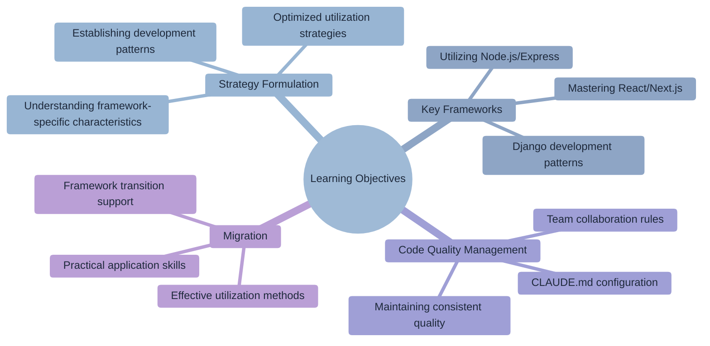
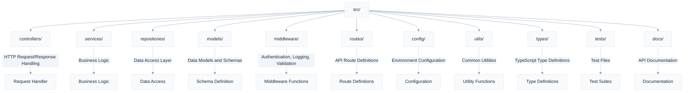
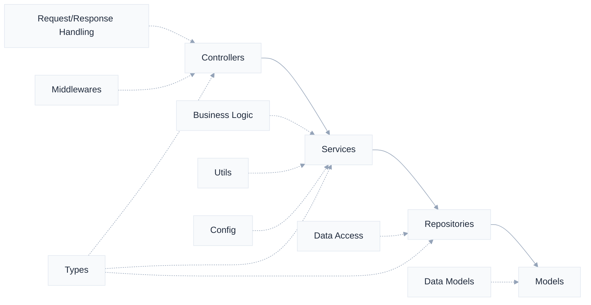
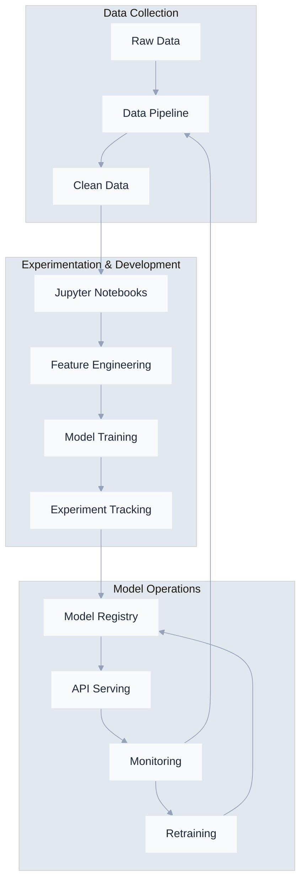
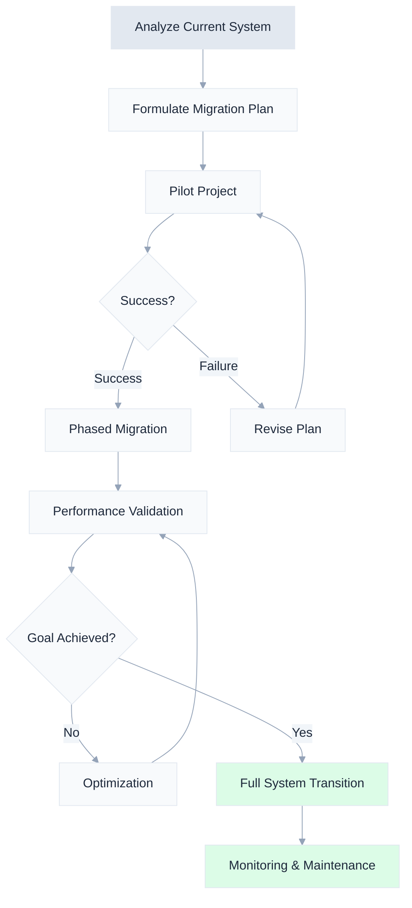
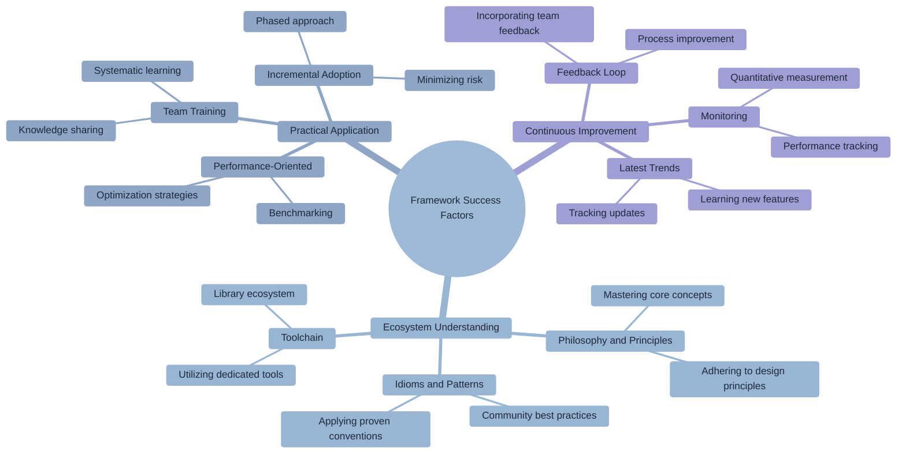

# Chapter 5: Best Practices for Each Framework

> "Use the right tool for the right job." - Programming Proverb



## Learning Objectives

## Overview

In modern software development, frameworks are key factors that determine development efficiency and code quality. Each framework has its own unique philosophy, design patterns, and best practices, requiring completely different approaches for the same functionality depending on the framework.

Claude Code deeply understands these framework-specific characteristics and can generate code that adheres to the idioms and best practices of each framework. This chapter will systematically explore strategies and practical applications for optimizing Claude Code for major frameworks.

## 5.1 React/Next.js Projects

React and Next.js are core technologies in modern frontend development, enabling efficient construction of complex user interfaces through component-based architecture and declarative programming. Claude Code fully supports React's functional component patterns, Next.js's App Router structure, and integration with modern state management libraries.

### Initial Setup for React Projects

When starting a React project, selecting tools appropriate for the project's scale and requirements is crucial. Claude Code can combine industry-standard tools to create a scalable and maintainable project structure.

```bash
# Create a React project using Vite
claude "Create a new React TypeScript project with Vite.
Include Tailwind CSS, React Router, and React Query,
and set up the folder structure according to best practices."
```

Claude Code generates the following structure:

```
src/
├── components/
│   ├── common/        # Common components like Button, Input
│   ├── features/      # Feature-specific components
│   └── layouts/       # Header, Footer, etc.
├── hooks/            # Custom hooks
├── pages/            # Page components for each route
├── services/         # API communication
├── store/            # Global state management
├── utils/            # Utility functions
└── types/            # TypeScript type definitions
```

### React Component Development Patterns

React components should be designed as reusable and testable units. Claude Code can create components that clearly separate roles and responsibilities and maintain an appropriate level of abstraction.

**1. Component Creation Request - Practical Examples**

Effective component development requires clear requirement definitions and comprehensive requests that include testing and documentation. The following are commonly used patterns in real projects.

```bash
# Basic component creation
claude "Create a UserProfile component.
It should display a profile image, name, and introduction,
and support an edit mode.
Also, write Storybook stories and test code."

# Advanced data table component
claude "Create a DataTable component.
- Support sorting, filtering, and pagination
- Selectable rows and bulk actions
- Performance optimization with virtual scrolling
- Type safety with TypeScript generics
- Accessibility (a11y) compliance"

# Complex form component
claude "Create a MultiStepForm component.
- Integrate React Hook Form and Zod validation
- Step-by-step progress display and navigation
- Auto-save and draft functionality
- Error state handling and user feedback
- Conditional field display for each step"
```

**2. State Management Patterns**

```bash
# Authentication state management
claude "Create a Context and custom hook to manage user
authentication state globally.
It needs login, logout, and token refresh functionality."

# Complex business logic state management
claude "Implement e-commerce shopping cart state management.
- Configure state store with Zustand
- Logic for adding/removing/changing quantity of products
- Apply discount coupons and calculate prices
- Synchronize with localStorage
- Handle pessimistic/optimistic updates"

# Server state and caching
claude "Set up server state management using React Query.
- API response caching strategy
- Background refetching and stale time settings
- Infinite scroll data fetching
- Error retry logic and offline support"
```

**3. Performance Optimization Strategies**

```bash
# Re-rendering optimization
claude "Apply React.memo, useMemo, and useCallback to this
component to prevent unnecessary re-renders."

# Code splitting and lazy loading
claude "Apply code splitting to this application.
- Route-level lazy loading
- Dynamic import of heavy components
- Library bundle splitting
- Add loading spinners and error boundaries"

# Large list optimization
claude "Implement a virtual scroll component that efficiently
renders 10,000 items.
- Utilize react-window library
- Support dynamic item height
- Integrate infinite scroll and pagination"

# Image optimization
claude "Optimize the performance of the image gallery.
- Lazy loading and preloading strategies
- WebP format support and fallback
- Image compression and resizing
- Implement progressive loading"
```

### Next.js Specific Features - Practical Application

**1. App Router Advanced Patterns**

```bash
# Comprehensive blog system
claude "Create a blog with Next.js 14 App Router.
Utilize dynamic routing, metadata optimization,
and ISR (Incremental Static Regeneration)."

# Multilingual support and internationalization
claude "Implement multilingual support in Next.js.
- i18n routing setup
- Translation handling in Server Components
- Dynamic translation loading and fallback
- hreflang tags for SEO optimization"

# Complex authentication system
claude "Implement a system supporting multiple authentication providers with NextAuth.js.
- OAuth (Google, GitHub), email, credential login
- Role-Based Access Control (RBAC)
- Session management and security hardening
- API route protection middleware"
```

**2. Server Components Patterns**

```bash
claude "Refactor this page into a Server Component.
Fetch data on the server and separate interactions into Client Components."
```

**3. API Routes Design**

```bash
claude "Implement a RESTful API with Next.js API routes.
Handle authentication with middleware and add request validation with Zod."
```

### React/Next.js CLAUDE.md Example

```markdown
# React/Next.js Project Guidelines

## Component Rules
- Use only functional components
- Define Props with interfaces
- One file per component

## State Management
- Local state: useState
- Server state: React Query (TanStack Query)
- Global state: Zustand

## Folder Structure
```
components/
├── Button/
│   ├── Button.tsx
│   ├── Button.test.tsx
│   ├── Button.stories.tsx
│   └── index.ts
```

## Performance Optimization
- Use next/image for images
- Code splitting with dynamic imports
- Maintain Lighthouse score 90+
```

## 5.2 Node.js/Express Backend

Node.js and Express are the most widely used backend technology stack in the JavaScript ecosystem. Leveraging the advantages of event-driven asynchronous architecture, they offer high performance and scalability, and Claude Code supports the construction of robust and maintainable server applications.

### Structuring Express Servers - Enterprise Patterns

For scalable Express applications, layered architecture and separation of concerns are key. Claude Code can generate server structures that follow industry-standard architectural patterns.

```bash
# Basic REST API server
claude "Create a scalable REST API server with Express.js.
Use a layered architecture (Controller-Service-Repository),
and include TypeScript, JWT authentication, error handling, and logging."

# Microservice pattern
claude "Implement a microservice architecture with Express.
- Inter-service communication (HTTP/gRPC)
- API Gateway pattern
- Service discovery and load balancing
- Distributed logging and tracing
- Circuit Breaker pattern"

# High-performance API server
claude "Create an Express API to handle high-volume traffic.
- Clustering and worker process management
- Session and caching with Redis
- Request limiting and DDoS protection
- Database connection pooling
- APM monitoring integration"

# GraphQL API server
claude "Create an API server integrating GraphQL with Express.
- Apollo Server setup
- Schema stitching and federation
- Prevent N+1 queries with DataLoader
- Authentication and authorization
- Query complexity limiting"
```

**Enterprise-Grade Project Structure**



**Separation of Responsibilities by Layer**



### Backend Development Patterns

**1. RESTful API Design**

```bash
claude "Design a RESTful API for user management.
Support CRUD operations, pagination, filtering, and sorting,
and automatically generate OpenAPI (Swagger) documentation."
```

**2. Database Integration**

```bash
claude "Create User, Post, and Comment models using Prisma ORM.
Include relationship setup, migrations, and seed data."
```

**3. Authentication/Authorization Implementation**

```bash
claude "Implement a JWT-based authentication system.
Use access tokens and refresh tokens,
and add Role-Based Access Control (RBAC)."
```

### Microservice Architecture

```bash
claude "Decompose this monolithic app into microservices.
Divide into User Service, Product Service, and Order Service,
and design an API Gateway and inter-service communication methods."
```

### Node.js/Express CLAUDE.md Example

```markdown
# Node.js/Express API Guidelines

## API Design Principles
- Adhere to RESTful principles
- Consistent response format
- Use appropriate HTTP status codes

## Response Format
```json
{
  "success": true,
  "data": {},
  "message": "Success",
  "timestamp": "2024-01-01T00:00:00Z"
}
```

## Error Handling
- All errors to a central error handler
- Error logging mandatory
- Generalized messages to clients

## Security
- Rate limiting for all endpoints
- SQL Injection prevention
- Input validation mandatory
```

## 5.3 Python/Django Applications

Django is a Python web framework based on the "batteries included" philosophy, featuring a powerful ORM, admin interface, and built-in security features. When used with Django REST Framework, robust API servers can be quickly built, and Claude Code supports the development of scalable applications adhering to Django's best practices.

### Django Project Setup

The success of a Django project is determined by initial setup and architectural design. Claude Code can generate project structures that follow Django's app-based modularization and configuration management best practices.

```bash
claude "Create a blog API with Django REST Framework.
Include user authentication, post CRUD, comments, and tag functionality,
and set up test code and API documentation."
```

### Django Development Patterns

**1. Model Design**

```bash
claude "Design Django models for e-commerce.
Define Product, Category, Order, and User models and their relationships,
and customize the Admin interface."
```

**2. ViewSet and Serializer**

```bash
claude "Create a ViewSet and Serializer for the Product model.
Support filtering, searching, and sorting,
and efficiently handle nested relationships."
```

**3. Asynchronous Tasks**

```bash
claude "Set up email sending and image processing
to be handled asynchronously using Celery."
```

### Python/Django CLAUDE.md Example

```markdown
# Django Project Guidelines

## App Structure
- Separate apps by feature
- Max 10 models per app
- No circular dependencies

## Model Design
- created_at, updated_at for all models
- Use soft delete (is_deleted field)
- Define relationships explicitly

## API Design
- ViewSet usage recommended
- Custom actions with @action decorator
- Default pagination 20 items

## Testing
- Test models, views, and serializers separately
- Generate test data with Factory Boy
- Coverage 80% or higher
```

## 5.4 Mobile App Development (React Native/Flutter)

In mobile app development, cross-platform solutions significantly improve development efficiency and maintainability. React Native enables native app development using JavaScript and React knowledge, while Flutter allows for high-performance UI implementation with the Dart language. Claude Code understands the characteristics of each platform and can generate platform-optimized code.

### React Native Projects

React Native is a framework that applies React's component model to the mobile environment, allowing native mobile app development using web development experience.

```bash
claude "Create a cross-platform mobile app with Expo.
Set up navigation, state management, and native feature access,
and handle iOS and Android style differences."
```

### React Native Development Patterns

**1. Navigation Structure**

```bash
claude "Implement complex navigation with React Navigation.
Combine Tab Navigator, Stack Navigator, and Drawer,
and set up deep linking."
```

**2. Native Module Integration**

```bash
claude "Implement functionality to access camera and location information.
Include permission request handling and error handling."
```

### Flutter Projects

```bash
claude "Create a Material Design app with Flutter.
Include multilingual support, dark mode, and responsive layout,
and apply the Clean Architecture pattern."
```

### Mobile App CLAUDE.md Example

```markdown
# Mobile App Guidelines

## Architecture
- Use MVVM pattern
- Business logic in ViewModel
- View displays state only

## Performance
- Virtualization mandatory for lists
- Image optimization and caching
- Maintain 60fps animations

## Platform-Specific Handling
```javascript
Platform.select({
  ios: { /* iOS styles */ },
  android: { /* Android styles */ }
})
```

## Testing
- Component tests: Jest
- E2E tests: Detox
- Platform-specific tests mandatory
```

## 5.5 Data Science Projects - MLOps Integration

Data science and machine learning fields involve complex workflows with various stages from exploratory analysis to production deployment. Claude Code understands the main tools used by data scientists and modern MLOps pipelines, supporting the entire process from experimentation to deployment.

### Modern Data Science Stack

For the success of data science projects, reproducible and scalable MLOps pipelines are needed beyond simple analysis tools.



### Jupyter Notebook Environment

Jupyter Notebook is a core tool for data science projects, allowing integrated management of code, visualizations, and documentation in a single environment. Claude Code supports the construction of reproducible and systematic analysis environments.

```bash
claude "Set up a Jupyter environment for a machine learning project.
Build data analysis, visualization, and model training pipelines,
and set up experiment tracking."
```

### Data Analysis Workflow - Industry Standard Approach

**1. Data Preprocessing Pipeline**

```bash
# Basic data preprocessing
claude "Analyze and preprocess this CSV data.
Perform missing value imputation, outlier detection, and feature engineering,
and visualize each step."

# Advanced feature engineering
claude "Implement feature engineering for time series data.
- Create time-based features (lag, rolling window)
- Decompose seasonality and trend
- Periodic features via Fourier transform
- Scaling and normalization pipeline
- Categorical variable encoding strategies"

# Large-scale data processing
claude "Create a large-scale data preprocessing pipeline using Dask.
- Chunk-wise parallel processing
- Memory-efficient data loading
- Distributed computing environment setup
- Progress monitoring"
```

**2. Model Development and Experiment Management**

```bash
# AutoML and model comparison
claude "Compare and evaluate multiple machine learning models.
Perform cross-validation, hyperparameter tuning,
and summarize results in a table."

# Deep learning model development
claude "Implement an image classification model with PyTorch.
- Utilize Transfer Learning
- Data augmentation and normalization
- Learning rate scheduling and early stopping
- Model checkpointing and resume functionality
- TensorBoard visualization"

# MLflow experiment tracking
claude "Build an experiment tracking system using MLflow.
- Log model metrics and parameters
- Version control artifacts
- Set up model registry
- A/B testing framework
- Experiment comparison dashboard"
```

**3. Model Deployment and Operations**

```bash
# API serving
claude "Create an API to serve the trained model with FastAPI.
Include input validation, prediction, and monitoring features."

# Real-time prediction system
claude "Build a real-time ML pipeline using Kafka and Redis.
- Streaming data preprocessing
- Real-time feature store
- Integrate batch and online predictions
- Model performance monitoring
- Automated retraining triggers"

# Container deployment
claude "Deploy ML models with Docker and Kubernetes.
- Multi-stage Docker build
- GPU-supported containers
- Autoscaling setup
- Health checks and log collection
- CI/CD pipeline integration"

# Model monitoring
claude "Build a production ML model monitoring system.
- Data drift detection
- Model performance degradation alerts
- Bias monitoring
- Explainable AI dashboard
- Incident response playbook"
```

### Data Science CLAUDE.md Example

Comprehensive guidelines for modern data science projects.

```markdown
# Data Science Project Guidelines

## Project Structure
```
project/
├── data/           # Raw data
├── notebooks/      # Experiment notebooks
├── src/           # Reusable code
├── models/        # Trained models
└── reports/       # Analysis results
```

## Coding Rules
- Notebooks for experimentation, production code in .py
- All experiments must be trackable
- Ensure reproducibility (fix seeds)

## Data Handling
- Do not modify original data
- Document preprocessing pipelines
- Data version control

## Model Management
- Track experiments with MLflow
- Model version control
- Support A/B testing
```

## Framework-Independent Best Practices

In addition to framework-specific approaches, there are core principles applicable to all frameworks. Understanding and applying these principles will yield consistent quality results regardless of the framework used.

### 1. Initial Exploration Strategy

Systematic exploration and understanding are key to success when joining new or existing projects. Claude Code can help grasp the overall structure and context of a project.

```bash
# When starting a new project
claude "Analyze the structure and technology stack used in this project.
Explain the roles of major files and the data flow."
```

### 2. Incremental Improvement

```bash
# Improving existing code
claude "Refactor this code.
First, write tests to ensure functionality,
then improve it step by step."
```

### 3. Documentation Automation

```bash
# Generate documentation
claude "Update the project's README.md.
Include installation instructions, usage, API documentation, and contribution guidelines."
```

### 4. Performance Profiling

```bash
# Performance analysis
claude "Profile the performance of this application,
find bottlenecks, and suggest optimization measures."
```

## Practical Tip: Framework Transition and Modernization

Framework migration is an important project for resolving technical debt and improving performance. Claude Code can help establish and execute systematic, risk-minimizing migration strategies.

### Legacy System Modernization Strategy

Transitioning an existing system to a modern architecture means more than just code conversion; it implies a complete system redesign.

### Migration Strategy Formulation - Real-world Case

A phased and incremental approach is needed when migrating an existing project to a different framework.



```bash
# 1. Dependency and Architecture Analysis
claude "Analyze the core functionality and structure of this Express app.
- Check dependency tree and circular references
- Identify business-critical modules
- Evaluate test coverage
- Identify performance bottlenecks"

# 2. Detailed Migration Roadmap
claude "Create a plan to migrate this app to Fastify.
- Apply Strangler Fig pattern
- Phased rollback plan
- Set performance benchmarks
- Include team training schedule
- Risk assessment and mitigation strategy"

# 3. Incremental Migration Execution
claude "Migrate the authentication module to Fastify first.
- Implement traffic splitting
- Set up monitoring and alerts
- Ensure data consistency
- Automated test suite
- Detect performance regressions"

# 4. Complex Frontend Migration
claude "Migrate React class components to functional components.
- Convert lifecycle methods to hooks
- Modernize state management
- Apply code splitting and lazy loading
- Enhance TypeScript type safety
- Identify performance optimization opportunities"

# 5. Database Migration
claude "Create a plan to migrate from MySQL to PostgreSQL.
- Schema conversion and data type mapping
- Zero-downtime data migration strategy
- Query optimization and performance tuning
- Backup and recovery procedures
- Validation and testing plan"
```

### Framework-Specific Success Metrics

It's crucial to set specific KPIs to measure the success of each framework transition project.

```bash
# Performance Metrics Monitoring
claude "Create a dashboard comparing performance before and after migration.
- Compare response time and throughput
- Memory usage and CPU efficiency
- Bundle size and loading time
- User experience metrics (LCP, FID, CLS)
- Developer productivity metrics"

# Quality Metrics Tracking
claude "Build a system to track code quality improvements.
- Changes in test coverage
- Reduction in code complexity
- Resolution of security vulnerabilities
- Reduction in technical debt
- Team satisfaction surveys"
```

## Conclusion

Mastering framework-specific best practices is key to effectively utilizing Claude Code. Each framework has its unique philosophy and design principles, and understanding and applying them is the foundation for successful development.

### Core Success Factors



### Practical Checklist

**Project Kick-off**

- [ ] Create framework-specific CLAUDE.md file
- [ ] Establish team coding conventions and style guides
- [ ] Standardize development environment and toolchain
- [ ] Set performance benchmarks and quality standards

**Development Process**

- [ ] Code review for adherence to framework best practices
- [ ] Regular performance profiling and optimization
- [ ] Operate automated testing and CI/CD pipelines
- [ ] Manage technical debt and plan refactoring

**Migration Projects**

- [ ] Detailed migration roadmap and risk assessment
- [ ] Bridging strategy for incremental transition
- [ ] System to prevent performance and stability regressions
- [ ] Team training and knowledge transfer program

**The true value of Claude Code lies not merely in generating code, but in helping the entire team consistently apply the philosophy and best practices of each framework.** This enables the simultaneous achievement of standardized development quality and maximized team productivity.

In the next chapter, we will explore strategies for optimizing Claude Code for specific programming languages. Let's delve into how to build a more effective development environment by understanding the unique characteristics and ecosystems of languages.