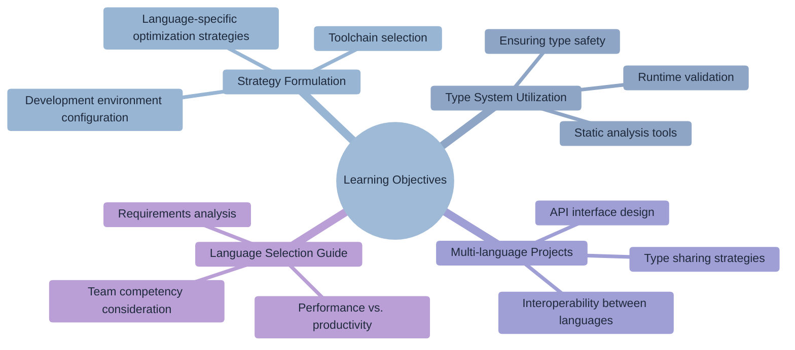
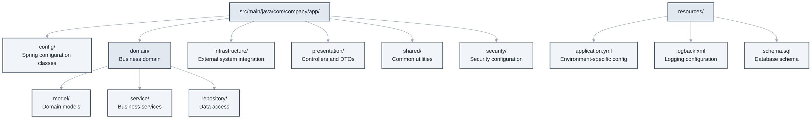
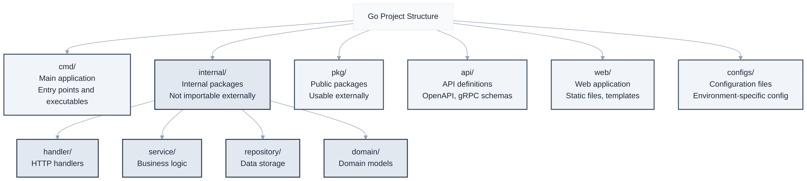
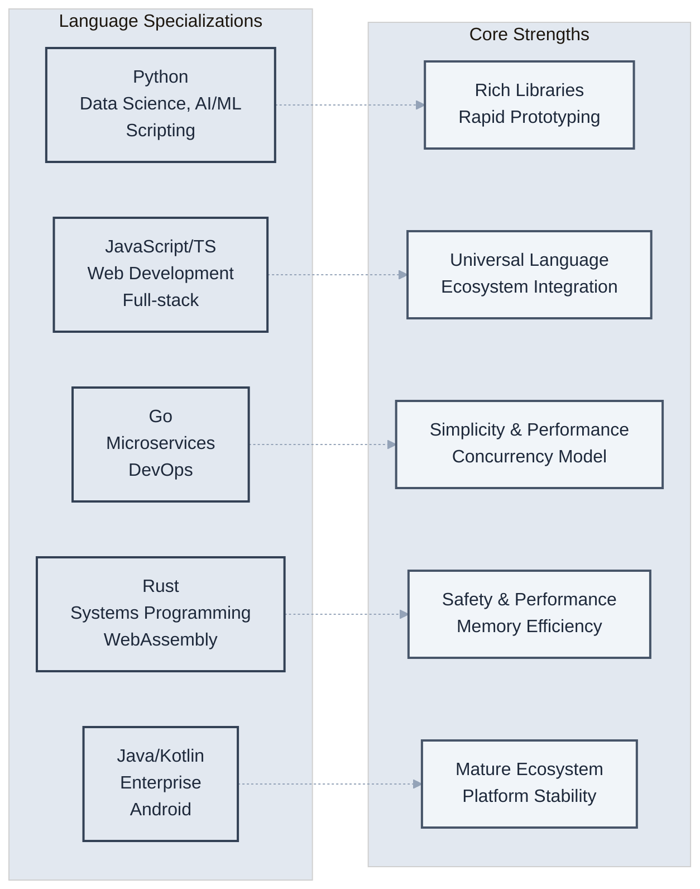
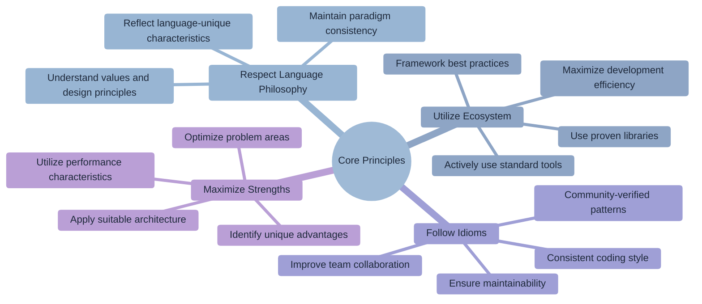

# Chapter 6: Language-Specific Utilization Strategies

> "Language shapes the way we think." - Benjamin Lee Whorf



## Learning Objectives

Upon completing this chapter, you will be able to:

- Formulate Claude Code optimization strategies for major programming languages.
- Effectively utilize language-specific type systems and safety features.
- Design multi-language projects considering interoperability between languages.
- Select the optimal programming language based on project requirements.

## Overview

Programming languages are more than just tools; they are crucial elements that shape a developer's way of thinking and problem-solving approach. Each language has its own unique philosophy, syntax, and ecosystem, and deeply understanding and utilizing these characteristics is key to successful development.

Claude Code understands the characteristics and best practices of various programming languages, enabling it to generate code that maximizes the strengths of each language. This chapter will systematically explore strategies and practical applications for optimizing Claude Code for major programming languages.

## 6.1 TypeScript/JavaScript

TypeScript and JavaScript are central to the modern web development ecosystem, offering both the flexibility of dynamic typing and the safety of static typing. Claude Code leverages TypeScript's powerful type system to generate safe and maintainable code, and can optimize JavaScript's functional programming paradigm and asynchronous processing features.

### TypeScript Enterprise Project Setup

A robust TypeScript project starts with strict type checking and integration of modern development tools. Claude Code can suggest optimal configurations tailored to the project's scale and requirements.

```bash
# Basic TypeScript project setup
claude "Set up a TypeScript project using strict type checking.
Optimize tsconfig.json, and configure ESLint and Prettier for TypeScript."

# Large-scale monorepo setup
claude "Set up a large-scale TypeScript monorepo.
- Configure Nx workspace
- Manage inter-project dependencies
- Build system for shared libraries
- Apply consistent code style
- Detect cyclic dependencies"

# Micro-frontend architecture
claude "Configure a TypeScript micro-frontend architecture.
- Set up Module Federation
- Ensure runtime type safety
- Sidecar loading and version management
- Shared state and event handling
- Testing strategy and mock setup"
```

**Enterprise-grade tsconfig.json Configuration**

```json
{
  "compilerOptions": {
    // Support for latest JavaScript standards
    "target": "ES2022",
    "module": "ESNext",
    "lib": ["ES2022", "DOM", "DOM.Iterable"],
    
    // Maximum type safety
    "strict": true,
    "noUncheckedIndexedAccess": true,
    "noImplicitOverride": true,
    "exactOptionalPropertyTypes": true,
    "noImplicitReturns": true,
    "noFallthroughCasesInSwitch": true,
    "noUncheckedSideEffectImports": true,
    
    // Additional strictness options
    "allowUnusedLabels": false,
    "allowUnreachableCode": false,
    "forceConsistentCasingInFileNames": true,
    "skipLibCheck": true,
    
    // All types and exports
    "moduleResolution": "bundler",
    "allowImportingTsExtensions": true,
    "noEmit": true,
    "isolatedModules": true,
    
    // Performance optimization
    "incremental": true,
    "tsBuildInfoFile": ".tsbuildinfo",
    
    // Path mapping
    "baseUrl": ".",
    "paths": {
      "@/*": ["./src/*"],
      "@/components/*": ["./src/components/*"],
      "@/utils/*": ["./src/utils/*"],
      "@/types/*": ["./src/types/*"]
    }
  },
  "include": [
    "src/**/*",
    "types/**/*",
    "tests/**/*"
  ],
  "exclude": [
    "node_modules",
    "dist",
    "build",
    "coverage"
  ]
}
```

### Advanced TypeScript Type Patterns

The true advantage of TypeScript lies beyond simple type checking; it's the ability to enforce complex business logic at the type level.

```bash
# Apply business rules with Branded Types
claude "Use Branded Types to ensure business logic safety.
- Define domain types like UserId, Email, PhoneNumber
- Integrate with runtime validation functions
- Ensure API response type safety
- Synchronize with database schema"

# Auto-generate API types with Conditional Types
claude "Create a system to automatically generate TypeScript types
from an OpenAPI schema using Conditional Types.
- Infer Path Parameter and Query Parameter types
- Automatically map Response types
- Differentiate types by HTTP Status Code
- Create error type unions"

# Implement DSL with Template Literal Types
claude "Use Template Literal Types to create a type-safe DSL.
- Type check CSS-in-JS
- Type safety for SQL query builder
- Autocomplete Event Names
- Validate i18n keys"
```

### Performance-Optimized TypeScript Patterns

In large-scale TypeScript applications, both compile time and runtime performance must be considered.

```bash
# Incremental type loading
claude "Optimize TypeScript compilation performance for a large project.
- Incremental builds with Project References
- Utilize Type-only imports
- Remove unused types
- Optimize type loading with dynamic imports
- Tune Watch mode performance"

# Runtime type validation optimization
claude "Implement runtime type validation without impacting performance.
- Runtime schema validation with Zod
- Optimize Type Guards
- Batch asynchronous validations
- Caching strategy and memoization
- Error boundaries and logging"

### Maximizing Type Safety

**1. Advanced Type Utilization**

```bash
claude "Migrate this JavaScript code to TypeScript.
Utilize union types, generics, and conditional types
to ensure maximum type safety."
```

**2. Improving Type Inference**

```bash
claude "The return type of this function is inferred too broadly.
Use type guards and const assertions to infer a more precise type."
```

**3. Runtime Validation with Zod**

```bash
claude "Create a system to validate API responses with Zod schemas.
Ensure TypeScript types are also generated automatically."
```

### Modern JavaScript Patterns

**1. Functional Programming**

```bash
claude "Refactor this imperative code into a functional style.
Maintain immutability, use pure functions,
and compose logic with function composition."
```

**2. Asynchronous Processing Optimization**

```bash
claude "Optimize the efficient handling of multiple API calls.
Use Promise.all and Promise.allSettled appropriately,
and add error handling and retry logic."
```

### TypeScript/JavaScript CLAUDE.md Example

```markdown
# TypeScript/JavaScript Guidelines

## Type Definition Rules
- Interface > Type Alias (if extensible)
- Prohibit `any` (use `unknown`)
- Prefer explicit return types

## Asynchronous Processing
```typescript
// Good example
const fetchData = async (): Promise<Result<Data, Error>> => {
  try {
    const data = await api.get('/data');
    return { ok: true, value: data };
  } catch (error) {
    return { ok: false, error };
  }
};
```

## Immutability
- Utilize `Object.freeze()`
- Copy with spread operator
- Consider using Immer library

## Error Handling
- Create custom errors by inheriting from `Error` class
- Utilize error boundaries
- Type-safe error handling
```

### TypeScript Practical Debugging and Monitoring

```bash
# Advanced debugging setup
claude "Set up an advanced debugging environment for a TypeScript project.
- Improve debugging performance with Source Map optimization
- Integrate with Chrome DevTools
- Track TypeScript compiler errors
- Runtime performance profiling
- Memory leak detection tools"

# Production monitoring
claude "Set up production monitoring for a TypeScript application.
- Collect runtime type errors
- Track performance bottlenecks
- Monitor bundle size
- Track TypeScript compilation time
- Code coverage reports"
```

## 6.2 Python - Enterprise Python

Python is a language with a philosophy of "readable code," enabling elegant solutions to complex problems through clear and concise syntax. Claude Code leverages Python's dynamic nature and Duck Typing advantages while supporting modern Python development patterns that enhance code stability through type hints and static analysis tools.

### Structuring Python Enterprise Projects

Scalable Python projects start with clear package structures and dependency management. Claude Code can suggest project structures adhering to PEP standards and modern development tool setups.

```bash
# Basic Python project setup
claude "Set up a Python package structure according to best practices.
Include pyproject.toml, virtual environment, type hints,
and test setup."

# Large-scale FastAPI application
claude "Build an enterprise-grade API server with FastAPI.
- Asynchronous database integration (SQLAlchemy 2.0)
- Data validation with Pydantic v2
- OAuth2/JWT authentication system
- Preparation for microservice architecture
- Monitoring and logging system"

# Data engineering pipeline
claude "Build a large-scale data pipeline with Apache Airflow.
- Automate ETL workflows
- Optimize Pandas/Polars performance
- Asynchronous processing of large data
- Error recovery and retry logic
- Monitoring and notification system"

# Machine learning production system
claude "Build an MLOps pipeline with Python.
- Experiment tracking and model versioning with MLflow
- Asynchronous batch training with Celery
- Model serving API with FastAPI
- Real-time model monitoring
- A/B testing framework"
```

**Enterprise-grade pyproject.toml Configuration**

```toml
[build-system]
requires = ["poetry-core>=1.0.0"]
build-backend = "poetry.core.masonry.api"

[tool.poetry]
name = "enterprise-python-app"
version = "0.1.0"
description = "Enterprise-grade Python application"
authors = ["Team <team@company.com>"]
readme = "README.md"
packages = [{include = "app", from = "src"}]

[tool.poetry.dependencies]
python = "^3.11"
fastapi = "^0.104.0"
uvicorn = {extras = ["standard"], version = "^0.24.0"}
sqlalchemy = "^2.0.0"
alembic = "^1.12.0"
pydantic = "^2.5.0"
celery = "^5.3.0"
redis = "^5.0.0"
structlog = "^23.2.0"
prometheus-client = "^0.19.0"

[tool.poetry.group.dev.dependencies]
pytest = "^7.4.0"
pytest-asyncio = "^0.21.0"
pytest-cov = "^4.1.0"
mypy = "^1.7.0"
black = "^23.11.0"
ruff = "^0.1.0"
pre-commit = "^3.5.0"

# Microservice tools
locust = "^2.17.0"  # Load testing
opentelemetry-api = "^1.21.0"  # Distributed tracing
jinja2 = "^3.1.0"  # Template engine

# Code quality tools
[tool.mypy]
python_version = "3.11"
strict = true
warn_return_any = true
warn_unused_configs = true
disallow_untyped_defs = true
disallow_incomplete_defs = true
check_untyped_defs = true
disallow_untyped_decorators = true
no_implicit_optional = true
warn_redundant_casts = true
warn_unused_ignores = true
warn_no_return = true
warn_unreachable = true
strict_equality = true

[tool.black]
line-length = 88
target-version = ['py311']
include = '\.pyi?$'
extend-exclude = '''
^/(
  (
      \.eggs
    | \.git
    | \.mypy_cache
    | \.tox
    | \.venv
    | _build
    | buck-out
    | build
    | dist
  )/
)
'''

[tool.ruff]
select = [
    "E",   # pycodestyle errors
    "W",   # pycodestyle warnings  
    "F",   # pyflakes
    "I",   # isort
    "B",   # flake8-bugbear
    "C4",  # flake8-comprehensions
    "UP",  # pyupgrade
    "N",   # pep8-naming
    "S",   # bandit
]
ignore = [
    "E501",  # line too long
    "B008",  # do not perform function calls in argument defaults
    "S101",  # use of assert
]
line-length = 88
target-version = "py311"

[tool.pytest.ini_options]
minversion = "7.0"
addopts = "-ra -q --cov=src --cov-report=term-missing --cov-report=html"
testpaths = ["tests"]
python_files = ["test_*.py"]
python_classes = ["Test*"]
python_functions = ["test_*"]
asyncio_mode = "auto"
```

### Advanced Type System and Static Analysis

Ensuring type safety while maintaining Python's dynamic nature is key to modern Python development.

```bash
# Advanced type hint patterns
claude "Add advanced type hints to this Python code.
- Abstraction with generics and protocols
- Precise type definitions with Union and Literal
- Runtime type checking with TypeGuard
- Create domain types with NewType
- Ensure mypy strict mode passes"

# Pydantic v2 advanced features
claude "Build an advanced data validation system with Pydantic v2.
- Field validators and model validators
- Asynchronous validators and custom serializers
- Complex data structures with Discriminated Unions
- Automatic JSON Schema generation
- Performance-optimized settings"

# Static analysis tool integration
claude "Set up static analysis tools for Python code quality.
- Maximum type checking with mypy + Pylance
- Fast linting and formatting with ruff
- Security vulnerability scanning with bandit
- Detect unused code with vulture
- Full CI/CD pipeline integration"
```

**Practical Type Hint Example**

```python
from typing import (
    AsyncGenerator, Awaitable, Callable, 
    Generic, Literal, Protocol, TypeGuard, 
    TypeVar, Union, overload
)
from dataclasses import dataclass
from pydantic import BaseModel, Field, field_validator
from datetime import datetime
from decimal import Decimal

# Domain Types with NewType
from typing import NewType
UserId = NewType('UserId', int)
Email = NewType('Email', str)
ProductId = NewType('ProductId', str)

# Protocol for dependency injection
class DatabaseProtocol(Protocol):
    async def execute(self, query: str) -> list[dict[str, any]]: ...
    async def fetch_one(self, query: str) -> dict[str, any] | None: ...

# Generic Repository Pattern
T = TypeVar('T', bound=BaseModel)

class Repository(Generic[T]):
    def __init__(self, db: DatabaseProtocol, model_class: type[T]) -> None:
        self._db = db
        self._model_class = model_class
    
    async def find_by_id(self, id_: int) -> T | None:
        result = await self._db.fetch_one(
            f"SELECT * FROM {self._model_class.__tablename__} WHERE id = {id_}"
        )
        return self._model_class(**result) if result else None

# Advanced Pydantic Models
class UserCreateRequest(BaseModel):
    email: Email = Field(..., pattern=r'^[\w\.-]+@[\w\.-]+\.\w+$')
    name: str = Field(..., min_length=1, max_length=100)
    age: int = Field(..., ge=18, le=120)
    
    @field_validator('email')
    @classmethod
    def validate_email_domain(cls, v: str) -> str:
        allowed_domains = ['company.com', 'partner.com']
        domain = v.split('@')[1]
        if domain not in allowed_domains:
            raise ValueError(f'Email domain must be one of {allowed_domains}')
        return v

# Type Guards for runtime validation
def is_valid_user_id(value: any) -> TypeGuard[UserId]:
    return isinstance(value, int) and value > 0

# Discriminated Union for complex data structures
class SuccessResponse(BaseModel):
    status: Literal['success'] = 'success'
    data: dict[str, any]
    timestamp: datetime = Field(default_factory=datetime.now)

class ErrorResponse(BaseModel):
    status: Literal['error'] = 'error'
    message: str
    error_code: int
    timestamp: datetime = Field(default_factory=datetime.now)

APIResponse = Union[SuccessResponse, ErrorResponse]

# Async Context Manager with proper typing
class AsyncDatabaseTransaction:
    def __init__(self, db: DatabaseProtocol) -> None:
        self._db = db
        self._transaction: any = None
    
    async def __aenter__(self) -> DatabaseProtocol:
        self._transaction = await self._db.begin()
        return self._db
    
    async def __aexit__(self, exc_type: type[Exception] | None, 
                       exc_val: Exception | None, 
                       exc_tb: any) -> None:
        if exc_type is None:
            await self._transaction.commit()
        else:
            await self._transaction.rollback()
```

### Python Performance Optimization - Enterprise Level

In large-scale Python applications, throughput, memory efficiency, and concurrency handling are all crucial.

```bash
# High-performance asynchronous system
claude "Build a high-volume asynchronous processing system.
- Handle large HTTP requests with asyncio + aiohttp
- Asynchronous database integration with asyncpg
- Async context managers and semaphores
- Backpressure and circuit management
- Error propagation and logging strategy"

# Memory optimization strategy
claude "Optimize large-scale data processing with Pandas/Polars.
- Chunk-wise streaming processing
- Optimize generators and iterators
- Memory-mapped files and Parquet format
- Parallel processing and multiprocessing
- Optimize garbage collection"

# Background task processing with Celery
claude "Build an enterprise-grade asynchronous task system with Celery.
- High-availability broker with Redis Sentinel
- Dynamic worker scaling
- Task priority and routing
- Failure handling and retry strategy
- Monitoring and metrics collection"

# Performance profiling and bottleneck analysis
claude "Find and optimize performance bottlenecks in a Python application.
- Profiling with cProfile and py-spy
- Memory usage analysis (memory_profiler)
- Database query optimization
- Caching strategy and memoization
- Utilize JIT compiler (Numba)"
```

**High-Performance Asynchronous Pattern Example**

```python
import asyncio
import aiohttp
import asyncpg
from typing import AsyncIterator, AsyncContextManager
from contextlib import asynccontextmanager
import structlog
from dataclasses import dataclass
from datetime import datetime

# Asynchronous database connection pool
class AsyncDatabasePool:
    def __init__(self, dsn: str, min_size: int = 10, max_size: int = 100):
        self.dsn = dsn
        self.min_size = min_size
        self.max_size = max_size
        self.pool: asyncpg.Pool | None = None
        self.logger = structlog.get_logger()
    
    async def initialize(self) -> None:
        """Initialize asynchronous connection pool"""
        self.pool = await asyncpg.create_pool(
            self.dsn,
            min_size=self.min_size,
            max_size=self.max_size,
            command_timeout=60
        )
        self.logger.info("Database pool initialized", 
                        min_size=self.min_size, max_size=self.max_size)
    
    @asynccontextmanager
    async def acquire(self) -> AsyncIterator[asyncpg.Connection]:
        """Acquire and automatically release connection"""
        if not self.pool:
            raise RuntimeError("Pool not initialized")
        
        async with self.pool.acquire() as conn:
            try:
                yield conn
            except Exception as e:
                self.logger.error("Database operation failed", error=str(e))
                raise
    
    async def close(self) -> None:
        """Close connection pool"""
        if self.pool:
            await self.pool.close()
            self.logger.info("Database pool closed")

# Asynchronous HTTP client wrapper
class AsyncHTTPClient:
    def __init__(self, timeout: int = 30, max_connections: int = 100):
        self.timeout = aiohttp.ClientTimeout(total=timeout)
        self.connector = aiohttp.TCPConnector(
            limit=max_connections,
            limit_per_host=20,
            keepalive_timeout=30
        )
        self.session: aiohttp.ClientSession | None = None
        self.logger = structlog.get_logger()
    
    async def __aenter__(self) -> 'AsyncHTTPClient':
        self.session = aiohttp.ClientSession(
            timeout=self.timeout,
            connector=self.connector
        )
        return self
    
    async def __aexit__(self, exc_type, exc_val, exc_tb) -> None:
        if self.session:
            await self.session.close()
    
    async def get_multiple(self, urls: list[str], 
                          concurrency: int = 10) -> AsyncIterator[dict]:
        """Request multiple URLs concurrently and stream results"""
        semaphore = asyncio.Semaphore(concurrency)
        
        async def fetch_one(url: str) -> dict:
            async with semaphore:
                try:
                    async with self.session.get(url) as response:
                        data = await response.json()
                        return {"url": url, "status": response.status, "data": data}
                except Exception as e:
                    self.logger.error("HTTP request failed", url=url, error=str(e))
                    return {"url": url, "status": 500, "error": str(e)}
        
        # Stream results with async generator
        tasks = [fetch_one(url) for url in urls]
        for task in asyncio.as_completed(tasks):
            result = await task
            yield result

# Generator pattern for processing large datasets
async def process_large_dataset_chunks(
    query: str, 
    db_pool: AsyncDatabasePool,
    chunk_size: int = 10000
) -> AsyncIterator[list[dict]]:
    """Process large datasets in chunks"""
    offset = 0
    
    while True:
        chunked_query = f"{query} LIMIT {chunk_size} OFFSET {offset}"
        
        async with db_pool.acquire() as conn:
            rows = await conn.fetch(chunked_query)
            
        if not rows:
            break
            
        # Convert to dict and return
        chunk = [dict(row) for row in rows]
        yield chunk
        
        offset += chunk_size
        
        # Async delay for internal processing
        await asyncio.sleep(0.01)

# Unlimited retries with exponential backoff
async def retry_with_exponential_backoff(
    func: Callable[[], Awaitable[T]],
    max_retries: int = 3,
    base_delay: float = 1.0,
    max_delay: float = 60.0
) -> T:
    """Retry with exponential backoff"""
    logger = structlog.get_logger()
    
    for attempt in range(max_retries + 1):
        try:
            return await func()
        except Exception as e:
            if attempt == max_retries:
                logger.error("Max retries exceeded", error=str(e))
                raise
            
            delay = min(base_delay * (2 ** attempt), max_delay)
            logger.warning(
                "Operation failed, retrying",
                attempt=attempt + 1,
                max_retries=max_retries,
                delay=delay,
                error=str(e)
            )
            await asyncio.sleep(delay)
    
    # This point should not be reached
    raise RuntimeError("Unexpected execution path")
```

### Python Enterprise CLAUDE.md Example

Comprehensive guidelines for large-scale Python projects.

```markdown
# Enterprise Python Guidelines

## Project Structure
```
src/
├── app/
│   ├── api/           # FastAPI routers and endpoints
│   ├── core/          # Business logic and domain models
│   ├── db/            # Database models and migrations
│   ├── services/      # Business logic services
│   └── utils/         # Utility functions
├── tests/
└── scripts/          # Migration and operational scripts
```

## Code Quality Standards
- **PEP 8 + ruff**: All code must pass ruff linter
- **Type Hints**: 100% coverage with mypy strict mode
- **Complexity**: Cyclomatic complexity per function <= 10
- **Docstrings**: High-quality docstrings mandatory (Google Style)

## Type Hint Rules
```python
from typing import TypeVar, Generic, Protocol, TypeGuard, NewType
from datetime import datetime
from decimal import Decimal

# Domain Types
UserId = NewType('UserId', int)
Email = NewType('Email', str)

# Repository Protocol
T = TypeVar('T')

class Repository(Protocol, Generic[T]):
    async def find_by_id(self, id_: int) -> T | None: ...
    async def save(self, entity: T) -> T: ...
    async def delete(self, id_: int) -> bool: ...

# Type Guards
def is_valid_email(value: str) -> TypeGuard[Email]:
    return '@' in value and '.' in value.split('@')[1]

# Pydantic Models
class UserCreate(BaseModel):
    email: Email = Field(..., description="User email")
    name: str = Field(..., min_length=1, max_length=100)
    
    @field_validator('email')
    @classmethod
    def validate_email(cls, v: str) -> str:
        if not is_valid_email(v):
            raise ValueError('Invalid email format')
        return v
```

## Asynchronous Processing Rules
- **Context Managers**: Use async context managers for all resources
- **Error Handling**: Systematic exception handling for async tasks
- **Resource Management**: Use connection pools and semaphores
- **Logging**: Structured logging with structlog

## Performance Standards
- **API Response Time**: 95% requests <= 200ms
- **Database Query**: All queries <= 100ms
- **Memory Usage**: <= 512MB per process
- **Concurrent Users**: Support 10,000 concurrent users

## Test Strategy
- **Coverage**: Unit tests >= 90%
- **Integration Tests**: 100% coverage for major API endpoints
- **E2E Tests**: Business-critical scenarios
- **Performance Tests**: Load testing with Locust

## Security Rules
- **Input Validation**: Pydantic validation for all user inputs
- **SQL Injection**: Use SQLAlchemy ORM, prohibit direct queries
- **Passwords**: Hash with bcrypt, minimum 12 characters
- **API Keys**: Manage only via environment variables, no hardcoding in code

## Logging and Monitoring
```python
import structlog

logger = structlog.get_logger()

# Business logic
logger.info(
    "User created successfully", 
    user_id=user.id,
    email=user.email,
    timestamp=datetime.now().isoformat()
)

# Error logging
logger.error(
    "Database connection failed",
    error=str(e),
    retry_count=retry_count,
    max_retries=max_retries
)
```

## CI/CD Checklist
- [ ] ruff linting passes
- [ ] mypy type checking passes
- [ ] pytest all tests pass
- [ ] bandit security scan passes
- [ ] Code coverage >= 90%
- [ ] Performance test criteria pass
```

### Python Practical Debugging and Monitoring

```bash
# Production debugging environment
claude "Set up a production debugging environment for a Python application.
- Remote debugging and log collection
- Integrate APM tools (New Relic, DataDog)
- Real-time tracking of performance bottlenecks
- Automatic collection of exceptions and errors
- Monitor asynchronous tasks"

# Large-scale system monitoring
claude "Set up comprehensive monitoring for Python microservices.
- Metrics collection with Prometheus + Grafana
- Distributed logging (ELK Stack)
- Asynchronous task dashboard
- Automated alerts and escalation
- Performance regression detection"
```

## 6.3 Java/Kotlin - Enterprise JVM

Java is the standard for enterprise application development, and Kotlin offers modern, concise syntax while maintaining perfect compatibility with Java. Claude Code leverages Java's robust ecosystem and the JVM's performance optimization features, and can generate safer, more expressive code using Kotlin's null safety and functional programming features.

### Modernizing Java Enterprise Projects

Transitioning legacy Java systems to modern architectures means more than just version upgrades; it implies a shift in the overall development paradigm. Claude Code can systematically support these complex migrations.

```bash
# Basic modernization tasks
claude "Modernize this legacy Java 8 code using Java 17+ features.
- Convert data classes with Records
- Simplify instanceof with Pattern Matching
- Improve readability with Text Blocks
- Enhance null safety with Optional
- Optimize collection processing with Stream API"

# Large-scale system migration
claude "Decompose a monolithic Spring application into microservices.
- Identify domain boundaries and separate services
- Configure API gateway with Spring Cloud Gateway
- Apply distributed transactions and Saga pattern
- Set up service mesh and distributed tracing
- Database separation strategy"

# Performance optimization
claude "Profile and optimize the performance of a Java application.
- JVM tuning and GC optimization
- Detect and resolve memory leaks
- Optimize thread pool settings
- Database connection pooling
- JIT compiler optimization"
```



**Enterprise-grade Java Project Structure**

### Spring Boot Enterprise Patterns

**1. Advanced Dependency Injection and Configuration Management**

```bash
# Optimize complex dependency graphs
claude "Optimize dependency injection in a Spring Boot application.
- Ensure immutability with constructor injection
- Detect and resolve circular dependencies
- Type-safe configuration with Configuration Properties
- Conditional Bean creation per profile
- Separate Test Configuration for testing"

# Multi-module project setup
claude "Set up a large-scale Spring Boot multi-module project.
- Separate common modules and domain-specific modules
- Manage inter-module dependencies
- Integration and unit testing strategy
- Build optimization and parallel compilation
- Docker image layering"
```

**2. Reactive Programming and Asynchronous Processing**

```bash
# WebFlux migration
claude "Migrate an existing Spring MVC REST API to Spring WebFlux.
- Non-blocking processing with Mono and Flux
- Reactive database integration with R2DBC
- Optimize external API calls with WebClient
- Backpressure handling and error recovery
- Performance benchmark and comparative analysis"

# Hybrid architecture
claude "Build a hybrid system combining Spring MVC and WebFlux.
- Handle CPU-intensive tasks with MVC
- Handle I/O-intensive tasks with WebFlux
- Common security configuration and authentication
- Monitoring and metrics integration
- Load balancing strategy"
```

### Kotlin Enterprise Development Patterns

Kotlin is a modern language that addresses Java's verbosity while being perfectly compatible with the existing Java ecosystem. In enterprise environments, null safety and concise syntax significantly improve development productivity.

```bash
# Gradual Kotlin transition for Java codebase
claude "Gradually transition an existing Java Spring Boot project to Kotlin.
- Write new features in Kotlin
- Simplify DTOs with data classes
- Manage state with sealed classes
- Organize utility functions with extension functions
- Improve asynchronous processing with coroutines"

# Utilize Kotlin DSLs
claude "Improve configuration and build scripts using Kotlin DSLs.
- Ensure build script type safety with build.gradle.kts
- Simplify security configuration with Spring Security DSL
- Write readable tests with test DSLs
- Implement domain-specific languages"
```

**Kotlin Enterprise Code Example**

```kotlin
// Type-safe configuration management
@ConfigurationProperties(prefix = "app")
data class AppProperties(
    val database: DatabaseProperties,
    val security: SecurityProperties,
    val features: FeatureFlags
) {
    data class DatabaseProperties(
        val url: String,
        val maxPoolSize: Int = 20,
        val connectionTimeout: Duration = Duration.ofSeconds(30)
    )
    
    data class SecurityProperties(
        val jwtSecret: String,
        val jwtExpiration: Duration = Duration.ofHours(24),
        val corsAllowedOrigins: List<String> = emptyList()
    )
    
    data class FeatureFlags(
        val enableNewPaymentSystem: Boolean = false,
        val enableAdvancedAnalytics: Boolean = false
    )
}

// Error handling with Result type
sealed class Result<out T> {
    data class Success<T>(val value: T) : Result<T>()
    data class Error(val exception: Throwable) : Result<Nothing>()
    
    inline fun <R> map(transform: (T) -> R): Result<R> = when (this) {
        is Success -> Success(transform(value))
        is Error -> this
    }
    
    inline fun <R> flatMap(transform: (T) -> Result<R>): Result<R> = when (this) {
        is Success -> transform(value)
        is Error -> this
    }
}

// Service layer using coroutines
@Service
class UserService(
    private val userRepository: UserRepository,
    private val emailService: EmailService,
    private val auditService: AuditService
) {
    suspend fun createUser(request: CreateUserRequest): Result<User> = runCatching {
        // Parallel validation
        val (emailExists, usernameExists) = coroutineScope {
            val emailCheck = async { userRepository.existsByEmail(request.email) }
            val usernameCheck = async { userRepository.existsByUsername(request.username) }
            emailCheck.await() to usernameCheck.await()
        }
        
        when {
            emailExists -> throw UserAlreadyExistsException("Email already exists")
            usernameExists -> throw UserAlreadyExistsException("Username already exists")
        }
        
        val user = User(
            email = request.email,
            username = request.username,
            hashedPassword = hashPassword(request.password)
        )
        
        // Parallel processing
        coroutineScope {
            val saveUser = async { userRepository.save(user) }
            val sendEmail = async { emailService.sendWelcomeEmail(user.email) }
            val audit = async { auditService.logUserCreation(user.id) }
            
            saveUser.await().also {
                sendEmail.await()
                audit.await()
            }
        }
    }.fold(
        onSuccess = { Result.Success(it) },
        onFailure = { Result.Error(it) }
    )
}

// Utility extension with extension functions
fun String.isValidEmail(): Boolean = 
    matches("""^[A-Za-z0-9+_.-]+@[A-Za-z0-9.-]+\.[A-Za-z]{2,}$""".toRegex())

fun <T> List<T>.chunkedParallel(size: Int, block: suspend (List<T>) -> Unit) = runBlocking {
    chunked(size).map { chunk ->
        async { block(chunk) }
    }.awaitAll()
}

// Type-safe query builder
class UserQueryBuilder {
    private val criteria = mutableListOf<String>()
    private val parameters = mutableMapOf<String, Any>()
    
    fun byEmail(email: String) = apply {
        criteria.add("email = :email")
        parameters["email"] = email
    }
    
    fun byAgeRange(min: Int, max: Int) = apply {
        criteria.add("age BETWEEN :minAge AND :maxAge")
        parameters["minAge"] = min
        parameters["maxAge"] = max
    }
    
    fun activeOnly() = apply {
        criteria.add("active = true")
    }
    
    fun build(): Pair<String, Map<String, Any>> {
        val query = "SELECT * FROM users" + 
            if (criteria.isNotEmpty()) " WHERE " + criteria.joinToString(" AND ")
            else ""
        return query to parameters
    }
}
```

### Java/Kotlin Performance Optimization Strategy

```bash
# JVM performance tuning
claude "Optimize JVM performance for a Java/Kotlin application.
- Compare and analyze G1GC vs ZGC vs Parallel GC
- Tune heap size and metaspace
- JIT compiler optimization options
- Configure Thread-Local Allocation Buffers (TLAB)
- Performance profiling with Flight Recorder"

# Memory optimization
claude "Optimize memory usage and reduce GC pressure.
- Object pooling and reuse strategy
- Implement off-heap caching
- Utilize WeakReference and SoftReference
- Detect and resolve memory leaks
- Process large data streams"

# Concurrency optimization
claude "Optimize concurrency features in Java/Kotlin.
- Utilize Virtual Threads (Project Loom)
- Compare CompletableFuture vs Kotlin Coroutines
- Implement lock-free data structures
- Actor model and CSP patterns
- Backpressure and flow control"
```

### Java/Kotlin Enterprise CLAUDE.md Example

Comprehensive development guidelines for large-scale enterprise environments.

```markdown
# Java/Kotlin Enterprise Guidelines

## Language Selection Criteria
- **New Development**: Kotlin first, for expressing complex business logic
- **Legacy Integration**: Maintain Java, gradual Kotlin adoption
- **Performance Critical**: Decide after profiling
- **Team Competency**: Phased adoption considering learning curve

## Java Development Rules
- **Version**: Use Java 17+ LTS version
- **Feature Utilization**: Records, Pattern Matching, Sealed Classes
- **Null Handling**: Actively use Optional, prohibit null returns
- **Streams**: Use Stream API for collection processing
- **Strings**: Improve readability with Text Blocks

## Kotlin Development Rules
- **Null Safety**: Explicitly handle nullable types
- **Immutability**: Prefer `val`, use immutable collections
- **Extension Functions**: Extend existing classes, replace utilities
- **Data Classes**: Represent DTOs and Value Objects
- **Coroutines**: Default choice for asynchronous processing

## Spring Boot Patterns
```kotlin
// Controller (RESTful API)
@RestController
@RequestMapping("/api/v1/users")
@Validated
class UserController(
    private val userService: UserService
) {
    @GetMapping("/{id}")
    suspend fun getUser(
        @PathVariable @Positive id: Long
    ): ResponseEntity<UserDto> = 
        userService.findById(id)
            .map { ResponseEntity.ok(it) }
            .getOrElse { 
                when (it) {
                    is UserNotFoundException -> ResponseEntity.notFound().build()
                    else -> ResponseEntity.internalServerError().build()
                }
            }
    
    @PostMapping
    suspend fun createUser(
        @Valid @RequestBody request: CreateUserRequest
    ): ResponseEntity<UserDto> = 
        userService.createUser(request)
            .map { ResponseEntity.status(201).body(it) }
            .getOrElse { ResponseEntity.badRequest().build() }
}

// Service Layer (Business Logic)
@Service
@Transactional
class UserService(
    private val userRepository: UserRepository,
    private val passwordEncoder: PasswordEncoder,
    private val eventPublisher: ApplicationEventPublisher
) {
    suspend fun createUser(request: CreateUserRequest): Result<UserDto> = 
        runCatching {
            validateUniqueConstraints(request)
            
            val user = User(
                email = request.email,
                username = request.username,
                password = passwordEncoder.encode(request.password)
            )
            
            userRepository.save(user).also {
                eventPublisher.publishEvent(UserCreatedEvent(it.id))
            }
        }.mapCatching { it.toDto() }
}
```

## Test Strategy
- **Frameworks**: JUnit 5 + AssertJ + MockK(Kotlin) / Mockito(Java)
- **Integration Tests**: Minimize `@SpringBootTest`, utilize TestContainers
- **Slice Tests**: Actively use `@WebMvcTest`, `@DataJpaTest`, etc.
- **Fixtures**: Object creation builder pattern, test data builders

```kotlin
// Test Example
@ExtendWith(MockKExtension::class)
class UserServiceTest {
    @MockK
    private lateinit var userRepository: UserRepository
    
    @MockK
    private lateinit var passwordEncoder: PasswordEncoder
    
    @InjectMockKs
    private lateinit var userService: UserService
    
    @Test
    fun `should create user successfully`() = runTest {
        // Given
        val request = CreateUserRequestBuilder()
            .withEmail("test@example.com")
            .withUsername("testuser")
            .build()
            
        every { passwordEncoder.encode(any()) } returns "encoded_password"
        coEvery { userRepository.save(any()) } returns UserBuilder().build()
        
        // When
        val result = userService.createUser(request)
        
        // Then
        result.isSuccess shouldBe true
        coVerify { userRepository.save(any()) }
    }
}
```

## Performance Standards
- **Response Time**: 95% of REST API requests <= 200ms
- **Throughput**: Capable of handling 1000 requests per second
- **Memory**: Maintain heap usage <= 80%
- **GC**: Full GC <= 1 minute, Stop-the-world <= 10ms

## Monitoring and Observability
- **Metrics**: Micrometer + Prometheus
- **Logging**: Logback + Structured Logging
- **Tracing**: Spring Cloud Sleuth + Zipkin
- **Profiling**: Java Flight Recorder

## Deployment and Operations
- **Containers**: Multi-stage Docker build
- **JVM Settings**: Environment-specific optimized JVM options
- **Health Checks**: Utilize Actuator endpoints
- **Graceful Shutdown**: Complete ongoing requests before termination


### Java/Kotlin Practical Debugging and Problem Solving

```bash
# Resolve complex concurrency issues
claude "Detect and resolve deadlocks occurring in a multithreaded environment.
- Analyze and interpret thread dumps
- Identify lock contention points
- Apply lock-free algorithms
- Migrate to Virtual Threads
- Performance benchmark and validation"

# Diagnose memory leaks
claude "Diagnose and resolve memory leaks in a Java application.
- Analyze heap dumps and use MAT tool
- Trace strong reference chains
- Detect listener and callback leaks
- Check for off-heap memory leaks
- Optimize memory usage patterns"

# Respond to production issues
claude "Diagnose production performance degradation in real-time.
- Identify bottlenecks with APM tools
- Analyze database query performance
- Analyze and tune GC logs
- Verify JIT compiler optimizations
- Implement automated recovery mechanisms"
```

## 6.4 Go

Go is a language that pursues both simplicity and performance, enabling the construction of scalable systems through explicit and readable code. Its strong concurrency model, compilation speed, and minimal runtime dependencies make it ideal for cloud-native applications and microservice development. Claude Code can generate efficient code utilizing Go's idiomatic patterns and concurrency primitives.

### Go Project Structure

The success of a Go project starts with clear package structure and dependency management. Claude Code can suggest structures applying Go community's standard project layout and Clean Architecture principles.



```bash
claude "Create a project structure using Go modules.
Apply Clean Architecture, and make it easy to test
using dependency injection and interfaces."
```

### Go Concurrency Patterns

**1. Goroutines and Channels**

```bash
claude "Parallelize this sequential processing code using goroutines and channels.
Implement appropriate error handling and context cancellation."
```

**2. Concurrency Patterns**

```bash
claude "Implement a Worker Pool pattern.
Include a task queue, worker goroutines, and result collection,
and support graceful shutdown."
```

### Go CLAUDE.md Example

```markdown
# Go Project Guidelines

## Project Structure
```
cmd/           # Main applications
internal/      # Internal packages
pkg/           # Public packages
api/           # API definitions
```

## Coding Rules
- Always handle errors
- Define interfaces on the consumer side
- Prevent goroutine leaks

## Error Handling
```go
if err != nil {
    return fmt.Errorf("failed to process: %w", err)
}
```

## Testing
- Table-driven tests
- Mocking with interfaces
- Include integration tests


## 6.5 Rust

Rust is a systems programming language that guarantees memory safety and performance simultaneously, preventing many bugs at compile time through its ownership system and type system. Claude Code understands Rust's unique ownership model and trait system, and can generate safe yet high-performance code.

### Utilizing Rust Safety

Rust's biggest advantage is guaranteeing memory safety without runtime cost. Claude Code can generate safe code utilizing Rust's core concepts like ownership, borrowing, and lifetimes.

```bash
claude "Rewrite this C++ code in Rust.
Utilize ownership, lifetimes, and traits
to ensure memory safety while maintaining performance."
```

### Rust Error Handling

**1. Utilizing Result Type**

```bash
claude "Improve error handling in these functions.
Use the Result type and ? operator,
and define custom error types."
```

**2. Asynchronous Rust**

```bash
claude "Create an asynchronous web server using Tokio.
Implement concurrent request handling, timeouts, and graceful shutdown."
```

### Rust CLAUDE.md Example

```markdown
# Rust Project Guidelines

## Safety Rules
- Minimize `unsafe`
- Prohibit `unwrap()` usage
- Resolve all clippy warnings

## Error Handling
```rust
use thiserror::Error;

#[derive(Error, Debug)]
pub enum AppError {
    #[error("IO error: {0}")]
    Io(#[from] std::io::Error),
    
    #[error("Parse error: {0}")]
    Parse(String),
}
```

## Performance
- Avoid unnecessary copying
- Utilize zero-cost abstractions
- Verify with benchmarks

## Dependencies
- Use minimal crates
- Pin versions
- Run security audits regularly
```

## Language Interoperability

In modern software development, multi-language architectures that combine programming languages to leverage the strengths of each are common. Claude Code can design integrated solutions that cross language boundaries and build systems composed of various languages while maintaining type safety.

### Multilingual Projects

When integrating components developed in different languages, API interface consistency and type safety are crucial. Claude Code can automate and optimize this integration process.

```bash
claude "Generate a type-safe API client connecting a Python backend
and a TypeScript frontend.
Ensure it's auto-generated based on an OpenAPI spec."
```

### FFI (Foreign Function Interface)

```bash
claude "Create bindings to use a high-performance library written in Rust
from Python.
Use PyO3 and handle type conversions safely."
```

## Language-Specific Optimization Strategies

Each programming language has different design goals and trade-offs, so optimization approaches should vary by language. Claude Code can apply optimization strategies tailored to each language's characteristics to achieve the best results.

### 1. Performance-Oriented Languages (C++, Rust, Go)

Languages where performance is a key requirement should focus on optimizing execution speed, memory usage, and throughput. Claude Code supports data-driven optimization through benchmarking and profiling.

```bash
# Benchmark-driven optimization
claude "Profile and optimize the performance of this function.
Write benchmarks, find bottlenecks, and improve them."
```

### 2. Productivity-Oriented Languages (Python, Ruby, JavaScript)

```bash
# Development speed optimization
claude "Implement this prototype quickly.
Make it work first, then optimize only necessary parts."
```

### 3. Safety-Oriented Languages (Rust, Haskell, Kotlin)

```bash
# Utilize type system
claude "Ensure this business logic with the type system.
Verify at compile time so runtime errors cannot occur."
```

## Practical Tip: Language Selection Guide

Choosing the right programming language for a project is a key factor in its success. Claude Code can help select the optimal language by comprehensively considering various factors.

### Language Selection Criteria

Effective language selection requires comprehensive consideration of not only technical requirements but also team capabilities, project timelines, and long-term maintainability.

```bash
# Project requirements analysis
claude "Analyze the requirements of this project and
recommend the most suitable programming language.
Consider performance, development speed, team competency, and ecosystem."
```

### Suitable Domains for Each Language



## Conclusion

Deeply understanding and utilizing language-specific characteristics is key to effectively using Claude Code. Each programming language has its unique philosophy and strengths, and its true value is realized when these are maximized.

### Summary of Core Principles



1. **Respect Language Philosophy**: Deeply understand the values and design principles pursued by each language and reflect them in the code.
2. **Utilize Ecosystem**: Maximize development efficiency by actively using language-specific standard tools, libraries, and frameworks.
3. **Follow Idioms**: Write consistent code by adhering to community-verified coding styles and patterns.
4. **Maximize Strengths**: Apply architectures and design patterns that leverage the unique advantages of each language.

### Practical Application Strategy

- **Project Kick-off**: Select the most suitable language for requirements and optimize initial setup.
- **During Development**: Write code adhering to language-specific best practices and continuously manage code quality.
- **Maintenance**: Continuously update and modernize in line with the evolution of the language ecosystem.
- **Team Collaboration**: Share language-specific guidelines and establish code review standards.

In the next chapter, we will explore how to build efficient development workflows by utilizing these language-specific characteristics. Let's delve into strategies for maximizing productivity by integrating Claude Code throughout the development process.