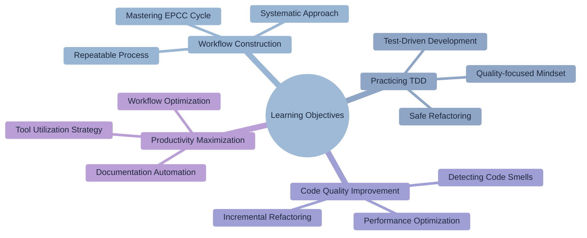
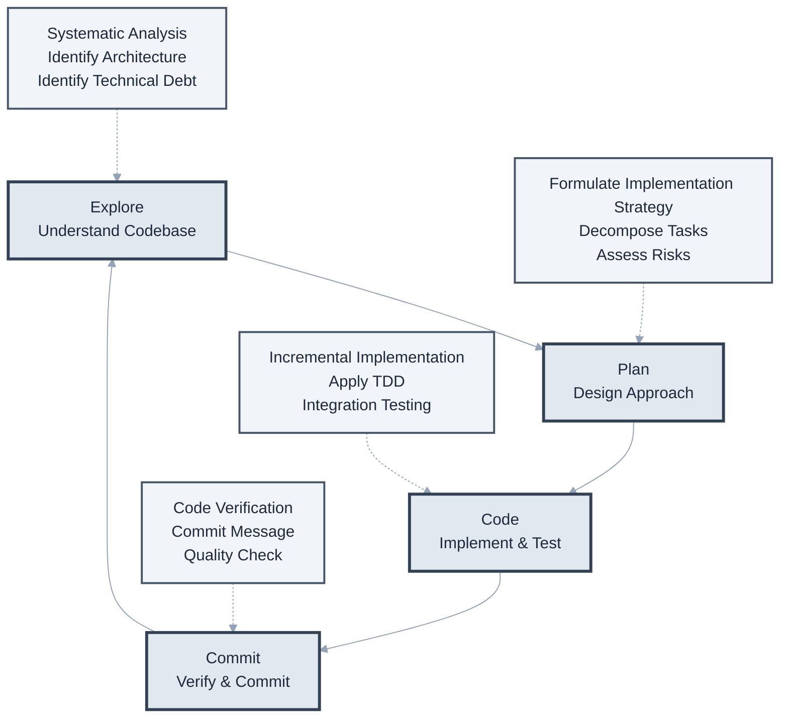
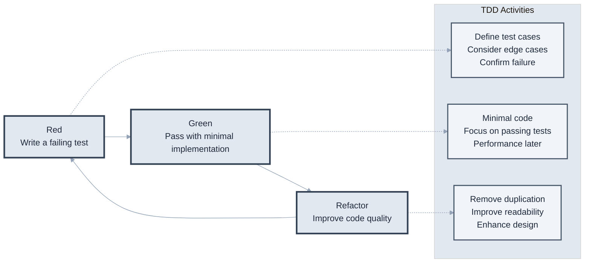
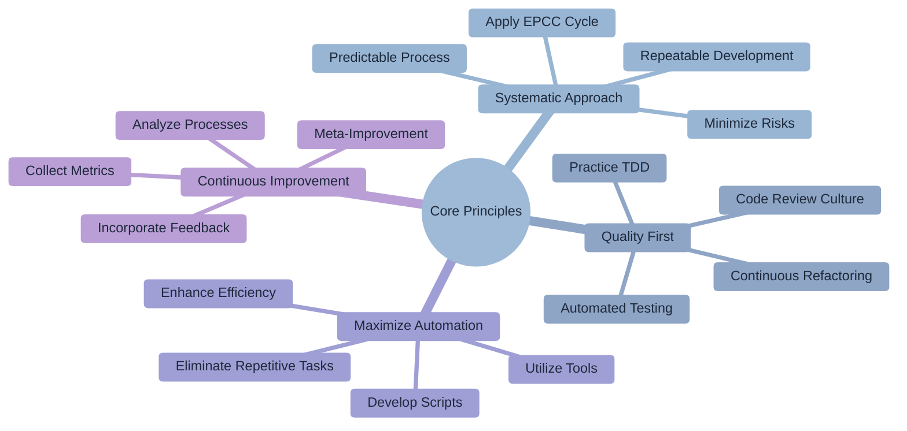

# Chapter 7: Efficient Development Workflows

> "Continuous improvement is better than delayed perfection." - Agile Principle



## Learning Objectives

Upon completing this chapter, you will be able to:

- Construct and execute an EPCC (Explore-Plan-Code-Commit) workflow.
- Effectively practice TDD (Test-Driven Development) with Claude Code.
- Establish systematic refactoring and code quality improvement processes.
- Maximize development productivity through documentation automation and workflow optimization.

## Overview

An efficient development workflow is not just about coding quickly. The key is to consistently deliver high-quality software through a systematic approach, appropriate automation, and continuous improvement.

In modern software development, workflow is a critical factor that directly influences developer productivity and code quality. Claude Code provides intelligent support at each stage of this workflow, helping developers focus more on creative tasks.

## 7.1 Explore-Plan-Code-Commit Cycle

The EPCC (Explore-Plan-Code-Commit) workflow provides a systematic and repeatable development process. This workflow enables deliberate development based on sufficient understanding and planning, instead of starting to code haphazardly.

### EPCC (Explore-Plan-Code-Commit) Workflow

Each stage has a unique purpose and deliverables, and is cyclically repeated to achieve continuous quality improvement.



### Stage 1: Explore - Systematic Codebase Understanding

The exploration stage is a crucial process that lays the foundation for successful development. Starting to code without sufficient understanding can lead to flawed designs and technical debt. Claude Code systematically analyzes complex codebases to help developers quickly grasp the overall structure.

**Project Architecture Analysis**

```bash
# Understand high-level architecture
claude "Analyze the overall architecture of this project.
- Microservices vs. Monolithic structure
- Key domains and boundaries
- Data flow and dependency directions
- Integration points with external systems
- Security boundaries and authentication methods"

# In-depth analysis of technology stack
claude "Comprehensively analyze the technology stack used.
- Frontend: Framework, state management, build tools
- Backend: Language, framework, ORM, middleware
- Database: Type, version, schema design patterns
- Infrastructure: Containerization, orchestration, monitoring
- Reasons for each technology choice and their pros/cons"

# Evaluate code quality and conventions
claude "Evaluate the project's code quality and development practices.
- Naming conventions and consistency
- File/folder structure patterns
- Test coverage and strategy
- Documentation level and quality
- CI/CD pipeline configuration
- Traces of code review process"
```

**In-depth Tracking and Analysis by Feature**

```bash
# Analyze business-critical features
claude "Comprehensively analyze the user authentication and authorization system.
- Authentication flow (login, token management, session)
- Authorization mechanism (RBAC, ABAC)
- Security considerations (encryption, validation)
- Frontend-backend integration method
- Error handling and user experience
- Scalability and improvement points"

# Data flow and state management
claude "Track and analyze the application's data flow.
- Entire path from user input to data storage
- Client-side state management patterns
- Server-side data processing logic
- Caching strategy and performance optimization
- Data consistency and concurrency handling"

# Performance and scalability analysis
claude "Analyze the system's performance characteristics and scalability.
- Identify current performance bottlenecks
- Traffic handling capacity and limits
- Database query patterns and optimization opportunities
- Memory usage patterns and garbage collection
- Scaling strategy (horizontal vs. vertical)"
```

**Identifying Technical Debt and Improvement Opportunities**

Effective exploration goes beyond simply understanding the current state; it involves proactively identifying potential problems and improvement opportunities.

```bash
# Assess technical debt
claude "Comprehensively assess the codebase's technical debt.
- Outdated libraries and security vulnerabilities
- Duplicate code and areas needing refactoring
- Modules and functions with high complexity
- Critical areas lacking tests
- Maintenance difficulties due to poor documentation
- Propose a prioritized improvement roadmap"

# Architectural evolution potential
claude "Suggest potential evolution paths for the current architecture.
- Possibility of microservice decomposition
- Opportunities to introduce new technology stacks
- Architectural changes for performance improvement
- Scalability enhancement measures
- Cost optimization opportunities"

### Stage 2: Plan

**Formulating Implementation Strategy**

```bash
claude "I want to add a shopping cart feature.
Create an implementation plan considering the current architecture.
Include necessary components, API endpoints, and data models."
```

**Task Decomposition**

```bash
claude "Break down the tasks to implement this feature step by step.
Each step should be independently testable,
and estimate the time required for each."
```

**Risk Assessment**

```bash
claude "Analyze the impact these changes will have on the existing code.
Identify potential problems and suggest solutions."
```

### Stage 3: Code

**Incremental Implementation**

```bash
# Generate skeleton code
claude "Create the basic structure according to the plan first.
Start with interfaces and empty methods so it can be implemented incrementally."

# Implement core logic
claude "Now implement the core business logic.
Write unit tests alongside to verify functionality."

# Integration and connection
claude "Integrate the implemented feature with the existing system.
Write necessary adapters or middleware as well."
```

### Stage 4: Commit

**Code Verification**

```bash
# Automated verification
claude "Before committing, please check the following:
- All tests pass
- Adherence to linting rules
- Type checks pass
- Code coverage"

# Write commit message
claude "Analyze the changes and write a meaningful commit message.
Follow conventional commits format,
and clearly explain the reason for change and its impact."
```

## 7.2 Practicing Test-Driven Development (TDD)

Test-Driven Development (TDD) is a proven methodology for writing high-quality code. Claude Code supports each stage of TDD by generating appropriate test cases, minimal implementations, and refactoring, helping developers effectively practice TDD principles.

### TDD Cycle

The Red-Green-Refactor cycle of TDD is the foundation for building robust software through incremental improvement of code quality and design.



### TDD with Claude Code

**1. Red Phase - Writing a Failing Test**

```bash
claude "Write tests for the calculateDiscount function first.
It should include the following scenarios:
- Regular discount (10%)
- VIP discount (20%)
- Maximum discount limit
- Edge cases (negative, 0, null)"
```

**2. Green Phase - Minimal Implementation**

```bash
claude "Implement the minimal code to pass the written tests.
Don't optimize yet, just focus on passing the tests."
```

**3. Refactor Phase - Improvement**

```bash
claude "Now improve the code while keeping the tests passing.
Remove duplication, improve readability, and optimize performance."
```

### TDD Practical Example

```bash
# User story
claude "User story: 'As a user, I want to be able to change my password.'
Start a TDD cycle for this."

# Claude's response process
# 1. Define test cases
# 2. Write API endpoint tests
# 3. Write service layer tests
# 4. Actual implementation
# 5. Refactoring
```

## 7.3 Visual Design Implementation Workflow

Accurately and efficiently implementing visual designs into code is a core competency in modern frontend development. Claude Code accurately grasps design intent and supports high-quality implementation considering responsive layouts and interactions.

### Design to Code

A systematic design implementation workflow streamlines collaboration between designers and developers and ensures a consistent user experience.

**1. Screenshot-Based Development**

```bash
# Provide design file
claude "Implement this Figma design screenshot as a
React component.
It should support responsive design and dark mode."
```

**2. Iterative Improvement**

```bash
# Initial implementation
claude "Implement the basic layout and styles first."

# Fine-tuning
claude "Increase padding slightly and adjust font size.
Also add hover effects and transitions."

# Add interactions
claude "Add click animations and loading states."
```

### Building a Component Library

```bash
claude "Create a component library based on the design system.
Include basic components like Button, Card, Modal,
and document it with Storybook."
```

## 7.4 Refactoring and Code Quality Improvement

Refactoring is an important activity that improves the internal structure of code without changing its external behavior. Claude Code automatically detects code smells, suggests safe refactoring strategies, and supports continuous code quality improvement.

### Systematic Refactoring

Effective refactoring goes beyond simple code cleanup; it is a strategic activity that significantly improves system maintainability and scalability.

**1. Detecting Code Smells**

```bash
claude "Find areas in this codebase that need refactoring.
Focus on checking for:
- Duplicate code
- Long functions
- Complex conditional statements
- Inappropriate names"
```

**2. Step-by-Step Refactoring**

```bash
# Step 1: Ensure tests
claude "Write tests to guarantee current functionality before refactoring."

# Step 2: Improve in small units
claude "Proceed with refactoring one step at a time.
Confirm that tests pass after each step."

# Step 3: Performance validation
claude "Compare performance before and after refactoring.
Run benchmarks and analyze the results."
```

### Code Quality Metrics

```bash
claude "Measure code quality and suggest improvements for:
- Cyclomatic complexity
- Code coverage
- Technical debt
- Dependency complexity"
```

## 7.5 Documentation Automation

Documentation is essential for ongoing code maintenance and team collaboration. Claude Code supports documentation automation by automatically generating documents from code and creating visual diagrams to make complex systems easier to understand.

### Code to Documentation

Effective documentation evolves with the code, minimizing manual effort for developers while always staying up-to-date.

**1. Auto-generating API Documentation**

```bash
claude "Analyze the code and automatically generate API documentation.
Create it in OpenAPI (Swagger) spec,
and include example requests/responses."
```

**2. Documentation from Code Comments**

```bash
claude "Parse JSDoc/TSDoc comments and generate
developer documentation.
Include function descriptions, parameters, return values, and examples."
```

### Diagram Generation

```bash
claude "Draw the system architecture as a Mermaid diagram.
Show relationships between components and data flow."
```

## Practical Workflow: Feature Addition Scenario

Let's look at a concrete example of how the EPCC workflow is applied in a real development environment. We will examine how Claude Code is used at each stage through a 3-day workflow for adding a new payment feature.

### Project Overview: Adding a New Payment Feature

Let's see how a systematic approach can reduce risks and improve quality when developing complex features.

```mermaid
%%{init: {"theme": "base", "themeVariables": {"primaryColor": "#f8fafc", "primaryTextColor": "#1e293b", "primaryBorderColor": "#e2e8f0", "lineColor": "#94a3b8", "secondaryColor": "#f1f5f9", "tertiaryColor": "#e2e8f0"}}}%%
gantt
    title 3-Day Payment Feature Addition Workflow
    dateFormat  X
    axisFormat %d
    
    section Day 1: Exploration and Planning
    Analyze Existing System     :active, d1-morning, 0, 1
    Design Payment Feature      :d1-afternoon, after d1-morning, 1
    Document Architecture     :d1-doc, after d1-afternoon, 1
    
    section Day 2: Implementation
    Develop Backend API     :d2-backend, 1, 1
    Develop Frontend UI      :d2-frontend, after d2-backend, 1
    Write Unit Tests    :d2-test, after d2-frontend, 1
    
    section Day 3: Integration and Deployment
    Integration Testing        :d3-integration, 2, 1
    E2E Testing        :d3-e2e, after d3-integration, 1
    Documentation & Deployment Prep  :d3-deploy, after d3-e2e, 1
```



### Day 1: Exploration and Planning

```bash
# Morning: Understand existing system
claude "Analyze how the current ordering system is implemented."

# Afternoon: Design payment feature
claude "Design a payment feature using Stripe.
Consider security, error handling, and retry logic."
```

### Day 2: Implementation

```bash
# Morning: Backend implementation
claude "Implement the payment API endpoint using TDD."

# Afternoon: Frontend implementation
claude "Implement the payment UI.
Include card information input, validation, and loading states."
```

### Day 3: Integration and Testing

```bash
# Morning: Integration testing
claude "Write E2E tests for the entire payment flow."

# Afternoon: Documentation and deployment
claude "Write a user guide for the payment feature,
and create a deployment checklist."
```

## Workflow Optimization Tips

### 1. Context Management

```bash
# Save context during long tasks
claude "Summarize the work done so far,
and outline what needs to be done next."

# Restore context
claude "Continue working on the payment feature implementation.
Start from where I left off."
```

### 2. Parallel Work

```bash
# Identify independent tasks
claude "Find tasks among these features that can be done concurrently."

# Utilize multi-instances
# Terminal 1: Backend development
# Terminal 2: Frontend development
# Terminal 3: Writing tests
```

### 3. Automation Scripts

```bash
claude "Create scripts to automate repetitive tasks:
- New component generation
- Test file creation
- Pre-deployment checks
- Performance measurement"
```

## Workflow CLAUDE.md Example

```markdown
# Development Workflow

## Feature Development Process
1. Create issue and branch
2. Explore: Analyze related code (30 min)
3. Plan: Formulate implementation strategy (30 min)
4. Implement: Develop with TDD (2-4 hours)
5. Review: Self code review (30 min)
6. Create PR and request review

## Daily Routine
- 09:00: Check issues and prioritize
- 09:30: Focused coding (Pomodoro technique)
- 14:00: Code review
- 16:00: Update documentation
- 17:00: Plan for next day

## Quality Checklist
- [ ] Test coverage >= 80%
- [ ] JSDoc for all functions
- [ ] Performance profiling complete
- [ ] Accessibility check passed
- [ ] Security scan passed
```

## Conclusion

An efficient development workflow is a key factor determining the productivity of developers and teams. Claude Code provides intelligent support at each stage of this workflow, helping developers focus on higher-level problem-solving.

### Summary of Core Principles



1. **Systematic Approach**: Predictable and repeatable development process through the EPCC (Explore-Plan-Code-Commit) cycle.
2. **Quality First**: Continuous improvement of code quality through TDD and continuous refactoring.
3. **Maximize Automation**: Efficient use of developer time through automation of repetitive tasks.
4. **Continuous Improvement**: A meta-process of continuously measuring and improving the workflow itself.

### Practical Application Strategy

- **Individual Developer**: Establish a consistent development rhythm and quality standards.
- **Team Leader**: Standardize team-wide workflow and share best practices.
- **Organization**: Collect workflow metrics and continuously improve processes.
- **Project Management**: Ensure predictable development speed and quality.

In the next chapter, we will explore multitasking and parallel processing strategies using multiple Claude Code instances. Let's delve into advanced utilization methods for maximizing development speed in complex projects.