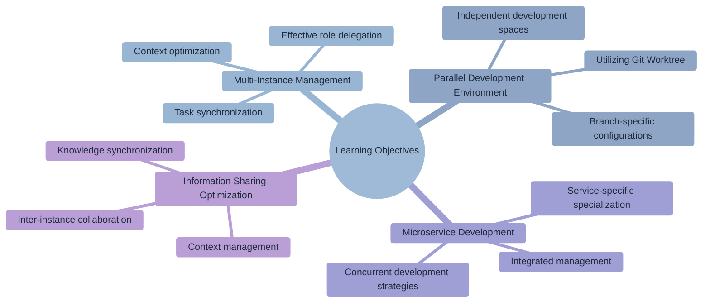
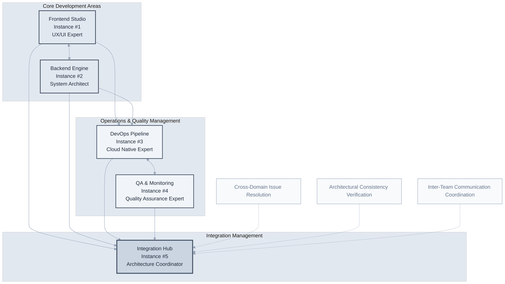
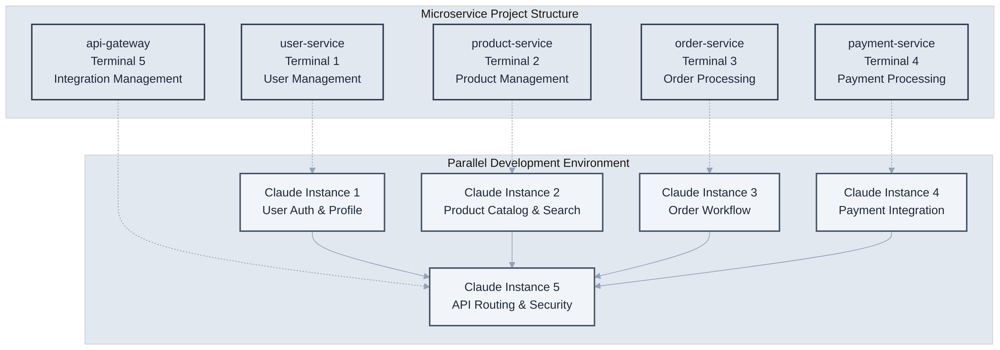
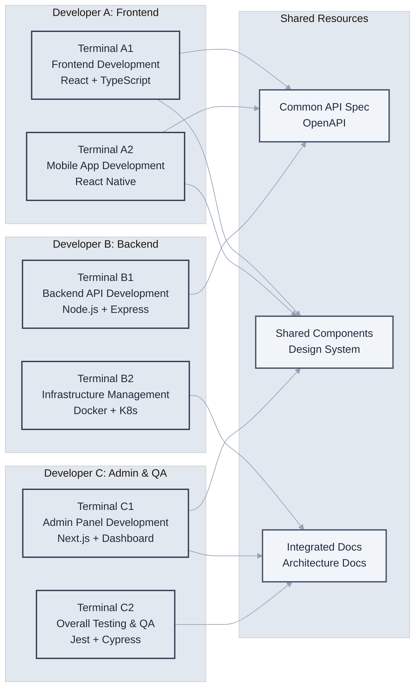

# Chapter 8: Multitasking and Parallel Processing

> "Work in parallel, but think concurrently." - Software Architecture Principle



## Learning Objectives

Upon completing this chapter, you will be able to:

- Effectively manage and utilize multiple Claude Code instances.
- Build a parallel development environment integrated with Git Worktree.
- Perform concurrent development in a microservice environment.
- Optimize context management and information sharing between instances.

## Overview

Modern software development inevitably requires multitasking due to the demand for rapid construction of complex systems. Utilizing multiple Claude Code instances is an advanced development strategy that goes beyond simply performing multiple tasks simultaneously; it involves each instance performing specialized roles to create synergy.

This chapter covers methods for systematically managing multiple Claude Code instances and assigning roles tailored to their specific characteristics to maximize development efficiency.

## 8.1 Utilizing Multiple Claude Instances

The core of a multi-instance strategy is to have each instance specialize in a specific domain to generate consistent results. This reduces context switching costs and ensures expertise in each area.

In modern software development, utilizing multiple instances should be approached from a strategic architectural perspective, rather than just parallel task execution. Each instance, like a specialized team member, has unique roles and responsibilities, optimized for different technical contexts and business domains.

### Enterprise-Grade Multi-Instance Architecture

An effective multi-instance strategy requires systematic design that considers the expertise and complementarity of each instance, going beyond simple task division.



### Role Delegation per Instance

**Frontend Studio (Instance #1) - User Experience Expert**

A dedicated frontend instance acts as an expert responsible for all aspects of user experience, beyond simple UI development.

```bash
# Terminal 1 (Frontend Studio)
cd frontend/
claude "You are a frontend UX expert.
Focus on the following roles:
- Designing React/Vue/Angular component architecture
- Optimizing responsive design and accessibility
- Implementing performance-focused state management
- Browser compatibility and Progressive Web App features
- Optimizing user interaction patterns and animations

Current Project: [Project Name]
Tech Stack: React 18 + TypeScript + Vite
Quality Standard: Maintain Lighthouse score 95+"
```

**Advanced Frontend Pattern Examples**

```bash
# Component architecture design
claude "Build an enterprise-grade design system.
- Apply Atomic Design methodology
- Type-safe theming system
- Automated Storybook documentation
- Component performance benchmarking
- Visual regression testing integration"

# State management optimization
claude "Efficiently manage complex application state.
- Separate server state and client state
- Optimistic update patterns
- Background synchronization strategy
- Offline mode support
- Real-time data binding"
```

**Backend Engine (Instance #2) - System Architecture Master**

The backend instance operates as an expert in building scalable and secure server systems.

```bash
# Terminal 2 (Backend Engine)
cd backend/
claude "You are a backend system architect.
Demonstrate expertise in the following areas:
- Microservice architecture and Domain-Driven Design
- RESTful/GraphQL API design and versioning
- Database optimization and caching strategies
- Security, authentication, and authorization systems
- Asynchronous processing and message queue architecture
- Monitoring, logging, and alerting systems

Current Environment: Node.js/Python + PostgreSQL + Redis
Performance Goal: 99.9% availability, <200ms response time
Security Standard: Full OWASP Top 10 compliance"
```

**Enterprise Backend Patterns**

```bash
# Microservice design
claude "Design a scalable microservice architecture.
- Define service boundaries and data ownership
- Configure API Gateway and service mesh
- Distributed transactions and Saga pattern
- Circuit Breaker and Bulkhead patterns
- Apply Event Sourcing and CQRS"

# High-performance data processing
claude "Build a high-volume data processing pipeline.
- Streaming data processing (Kafka/RabbitMQ)
- Optimize and parallelize batch processing
- Database sharding and replication
- Cache layering strategy (L1/L2/L3)
- Real-time analytics and metrics collection"
```

**DevOps Pipeline (Instance #3) - Cloud Native Expert**

The infrastructure instance is dedicated to building and operating modern cloud-native environments.

```bash
# Terminal 3 (DevOps Pipeline)
cd infrastructure/
claude "You are a DevOps and Cloud Architecture expert.
Handle the following areas:
- Infrastructure as Code (Terraform/Pulumi)
- Container orchestration (Kubernetes/Docker Swarm)
- CI/CD pipeline automation (GitLab CI/GitHub Actions)
- Cloud platform optimization (AWS/GCP/Azure)
- Security hardening and compliance management
- Performance monitoring and auto-scaling
- Disaster recovery and backup strategy

Target Environment: Production-Ready Kubernetes Cluster
Availability Goal: 99.99% uptime
Security Standard: SOC 2 Type II compliance"
```

**Advanced DevOps Patterns**

```bash
# Build GitOps pipeline
claude "Implement a fully automated GitOps pipeline.
- Multi-environment deployment strategy (dev/staging/prod)
- Blue-green deployment and canary releases
- Automated rollback and health check system
- Secret management and encryption (Vault/Sealed Secrets)
- Code quality gates and security scans
- Automated performance testing"

# Observability platform
claude "Build a comprehensive observability platform.
- Metrics collection and visualization (Prometheus/Grafana)
- Distributed tracing (Jaeger/Zipkin)
- Structured logging (ELK/Fluentd)
- Alerting and incident management (PagerDuty/Slack)
- SLI/SLO definition and error budget management"
```

**QA & Monitoring (Instance #4) - Quality Assurance Expert**

The QA instance is an expert responsible for all aspects of software quality.

```bash
# Terminal 4 (QA & Monitoring)
claude "You are a Quality Assurance and Test Automation expert.
Handle the following quality areas:
- Test pyramid strategy (Unit/Integration/E2E)
- Performance testing and load testing (JMeter/k6)
- Security testing and vulnerability scanning (OWASP ZAP)
- Accessibility testing and usability evaluation
- Browser compatibility and cross-platform testing
- Test data management and environment configuration
- Quality metrics collection and reporting

Quality Goal: Test coverage 90%+
Performance Standard: Response time <200ms
Security Level: Zero known vulnerabilities"
```

**Advanced QA Automation Patterns**

```bash
# Intelligent test automation
claude "Build an AI-based test automation system.
- Visual regression testing (Applitools/Percy)
- Automated test case generation and maintenance
- Flaky test detection and resolution
- Test execution optimization and parallelization
- Failure analysis and automated bug reporting"

# Production monitoring
claude "Implement a real-time quality monitoring system.
- Real User Monitoring (RUM)
- Synthetic transaction monitoring
- Error tracking and crash reporting
- A/B testing platform
- User feedback collection and analysis"
```

### Context Specialization

CLAUDE.md settings specialized for each instance.

**frontend/CLAUDE.md**
```markdown
# Frontend Development Context

## Key Tech Stack
- React 18 + TypeScript
- Tailwind CSS
- React Query + Zustand

## Component Rules
- Use only functional components
- Define Props with interfaces
- Storybook stories mandatory

## Performance Optimization
- Actively use React.memo
- Optimize bundle size
- Image optimization
```

**backend/CLAUDE.md**
```markdown
# Backend Development Context

## Key Tech Stack
- Node.js + Express + TypeScript
- PostgreSQL + Prisma
- Redis for caching

## API Design Principles
- RESTful design
- Consistent error responses
- Apply rate limiting

## Security Requirements
- JWT token authentication
- Input validation mandatory
- SQL Injection prevention
```

**Integration Hub (Instance #5) - Architecture Coordinator**

The integration hub plays a central coordination role, ensuring consistency and collaboration among all instances.

```bash
# Terminal 5 (Integration Hub)
claude "You are a System Integration and Architecture Coordination expert.
Handle the following integration areas:
- Cross-domain issue resolution and decision-making
- Architectural consistency verification and guideline application
- Inter-team communication and knowledge sharing
- Technical debt management and refactoring planning
- Performance bottleneck analysis and optimization direction
- Project roadmap and priority adjustment

Scope of Responsibility: Overall System Architecture
Goal: Consistent User Experience and Developer Experience
Principles: Simplicity, Scalability, Maintainability"
```

## 8.2 Advanced Integration Strategy with Git Worktree

### Enterprise-Grade Worktree Architecture

Parallel development using Git Worktree requires a strategic approach that ensures the independence and safety of each work area, going beyond simple branch separation.

```bash
# Configure enterprise-grade worktree architecture
# 1. Isolated development environment per feature
git worktree add ../project-auth-service feature/auth-microservice
git worktree add ../project-payment-gateway feature/payment-integration
git worktree add ../project-user-dashboard feature/dashboard-redesign
git worktree add ../project-mobile-api feature/mobile-optimization
git worktree add ../project-security-audit hotfix/security-vulnerabilities

# 2. Claude settings specialized for each worktree
cd ../project-auth-service
echo "# Authentication Service Context" > CLAUDE.md
echo "Focus: OAuth2/JWT implementation, security best practices" >> CLAUDE.md
echo "Tech Stack: Node.js + Express + Passport" >> CLAUDE.md
echo "Security Level: CRITICAL - all inputs must be validated" >> CLAUDE.md
claude "You are a security authentication systems expert.
Build an enterprise-grade authentication system using OAuth2 and JWT.
Strictly adhere to security best practices and OWASP guidelines."

cd ../project-payment-gateway
echo "# Payment Gateway Context" > CLAUDE.md
echo "Focus: PCI DSS compliance, payment processing" >> CLAUDE.md
echo "Tech Stack: Python + FastAPI + Stripe/PayPal" >> CLAUDE.md
echo "Compliance: PCI DSS Level 1, SOX compliance required" >> CLAUDE.md
claude "You are a payment systems expert.
Implement a secure and scalable payment gateway that meets
PCI DSS compliance and financial security requirements."

cd ../project-user-dashboard
echo "# User Dashboard Context" > CLAUDE.md
echo "Focus: React performance, user experience" >> CLAUDE.md
echo "Tech Stack: React 18 + TypeScript + Tailwind" >> CLAUDE.md
echo "Performance: Lighthouse 95+, Core Web Vitals optimized" >> CLAUDE.md
claude "You are a frontend UX expert.
Design and implement a user-centric dashboard.
Prioritize performance optimization and accessibility."
```

### Intelligent Worktree Management System

Automate Worktree management to reduce developers' cognitive load and ensure a consistent development environment.

```bash
# Advanced Worktree Management Automation
claude "Build an enterprise-grade Git Worktree management system.

Key Features:
1. Template-based Worktree creation per feature
2. Automated CLAUDE.md setup per environment
3. Dependency conflict detection and resolution
4. Task progress tracking and reporting
5. Automated cleanup and archiving
6. Worktree sharing for team collaboration

Technical Requirements:
- Shell scripting with error handling
- Support for JSON/YAML configuration files
- Cross-platform compatibility (Linux/macOS/Windows)
- Logging and audit trails
- Backup and recovery mechanisms"
```

Example of generated script:

```bash
#!/bin/bash
# new-feature.sh

FEATURE_NAME=$1
WORKTREE_PATH="../project-$FEATURE_NAME"

# Create branch
git checkout -b "feature/$FEATURE_NAME"

# Add Worktree
git worktree add "$WORKTREE_PATH" "feature/$FEATURE_NAME"

# Start Claude in a new terminal
cd "$WORKTREE_PATH"
osascript -e "tell app \"Terminal\" to do script \"cd $WORKTREE_PATH && claude\""

echo "Feature branch 'feature/$FEATURE_NAME' created in $WORKTREE_PATH"
```

## 8.3 Microservice Concurrent Development

### Separating Development Environments per Service



### Inter-Service Communication Management

**API Gateway Development**

```bash
# Terminal 1 (API Gateway)
claude "Implement an API Gateway.
Include routing, authentication, load balancing, and monitoring."
```

**Individual Service Development**

```bash
# Terminal 2 (User Service)
claude "Develop a user management microservice.
Include sign-up, login, and profile management features."

# Terminal 3 (Product Service)  
claude "Develop a product management microservice.
Include product CRUD, inventory management, and search functionality."
```

### Inter-Service Contract Management

```bash
# OpenAPI spec synchronization
claude "Generate OpenAPI specs for each service,
and create integrated documentation in the API Gateway."
```

## 8.4 Frontend-Backend Parallel Work

### API-First Development

**Step 1: Define API Spec**

```bash
# Common task
claude "Define the OpenAPI spec for the user management API.
Include endpoints, request/response schemas, and error codes."
```

**Step 2: Parallel Development**

```bash
# Terminal 1 (Backend)
claude "Implement the backend according to the defined API spec.
Make it work with mock data first."

# Terminal 2 (Frontend)  
claude "Implement the frontend based on the API spec.
Mock the API using MSW."
```

### Type Sharing Strategy

```bash
# Define common types
claude "Create type definitions to be shared between backend and frontend.
Auto-generate TypeScript types from Zod schemas."
```

### Real-time Synchronization

```bash
# Auto-update on API changes
claude "Build a system to automatically update frontend types
when the backend API changes."
```

## 8.5 Efficient Context Management

### Optimizing Context Switching

**Saving Task Context**

```bash
# When pausing work in Terminal 1
claude "Summarize the current work status.
Include information needed to resume next time."
```

**Restoring Context**

```bash
# When resuming work
claude "Continue working on the user authentication feature I was previously working on.
Proceed from the last state."
```

### Branch-Specific Context Management

```bash
# Auto-load context on branch switch
claude "Load the context for the current branch (feature/user-auth).
Check related files and work history."
```

### Information Sharing Between Instances

**Utilizing Common Documents**

```markdown
# shared/context.md
## Current Progress
- Frontend: Login component 50% complete
- Backend: Auth API 80% complete
- Database: Schema complete, migration needed
- Testing: Writing unit tests

## Common Decisions
- JWT token expiration time: 1 hour
- API response format: { success, data, message }
- Error code system: HTTP status code + custom code
```

## 8.6 Parallel Processing Practical Example

### Scenario: Building an E-commerce Platform

**Project Structure**

```
ecommerce/
├── frontend/          # React app
├── backend/           # Node.js API  
├── admin-panel/       # Admin page
├── mobile-app/        # React Native
└── infrastructure/    # Docker, K8s
```

**Team Composition and Instance Deployment**



### Week 1: Project Setup

**Day 1-2: Infrastructure**

```bash
# Terminal A1 (Frontend)
claude "Set up a React + TypeScript + Vite project.
Include state management, routing, and UI library."

# Terminal B1 (Backend)
claude "Set up an Express + TypeScript + Prisma project.
Include authentication, logging, and error handling."

# Terminal B2 (Infrastructure)
claude "Configure a development environment with Docker Compose.
Include PostgreSQL, Redis, and Nginx."
```

**Day 3-5: Core Features**

```bash
# Start parallel development
# Terminal A1: Product list component
# Terminal A2: Mobile navigation
# Terminal B1: Product API
# Terminal B2: Authentication system
# Terminal C1: Admin dashboard
```

### Week 2: Integration and Testing

```bash
# Terminal A1: Frontend integration tests
claude "Test core flows with React Testing Library."

# Terminal B1: API integration tests
claude "Test API endpoints with Jest + Supertest."

# Terminal C2: E2E tests
claude "Test overall user flows with Playwright."
```

## Multitasking Optimization Tips

### 1. Task Priority Management

```bash
# Priority matrix
claude "Organize the priorities of ongoing tasks.
Create a matrix based on urgency and importance."
```

### 2. Dependency Management

```bash
# Generate dependency graph
claude "Analyze inter-task dependencies and suggest an optimal order.
Identify tasks that can be processed in parallel."
```

### 3. Resource Monitoring

```bash
# Check system resources
claude "Check how much system resources are being used
by currently running Claude instances."
```

### 4. Setting Synchronization Points

```bash
# Regular synchronization
claude "Summarize team task progress and
plan for the next milestone."
```

## Multitasking CLAUDE.md Example

```markdown
# Multi-Instance Development

## Instance Role Delegation
- Terminal 1: Frontend (React/Next.js)
- Terminal 2: Backend (Node.js/Python)  
- Terminal 3: Mobile (React Native/Flutter)
- Terminal 4: DevOps (Docker/K8s)
- Terminal 5: Testing (Jest/Cypress)

## Context Switching Rules
- Mandatory state saving when pausing work
- Share progress every 30 minutes
- Propagate important decisions to all instances

## Synchronization Points
- Daily 9 AM: Share daily plan
- Daily 5 PM: Summarize progress
- Twice a week: Architecture review

## Conflict Resolution Procedure
1. Apply priority rules for Git conflicts
2. Notify relevant teams immediately of API changes
3. Use locking mechanism for common file modifications
```

## Conclusion

Multitasking and parallel processing are essential competencies in modern development, and utilizing multiple Claude Code instances is a powerful strategy that can revolutionize development productivity.

### Summary of Core Principles

1. **Maximize Efficiency**: Improve development speed through concurrent execution of multiple tasks.
2. **Context Separation**: Ensure quality consistency by configuring specialized environments for each task.
3. **Flexible Collaboration**: Establish efficient division of labor and synchronization systems among team members.
4. **Rapid Iteration**: Swift development cycles and immediate feedback systems.

### Practical Application Guide

- **Project Kick-off**: Decompose tasks and define roles for each instance.
- **During Development**: Regularly synchronize and share progress.
- **Integration Phase**: Systematic merge strategy and conflict resolution.
- **Optimization**: Monitor resources and improve workflow.

In the next chapter, we will explore how to automate this parallel processing environment and integrate it into CI/CD pipelines to build a continuous development process.