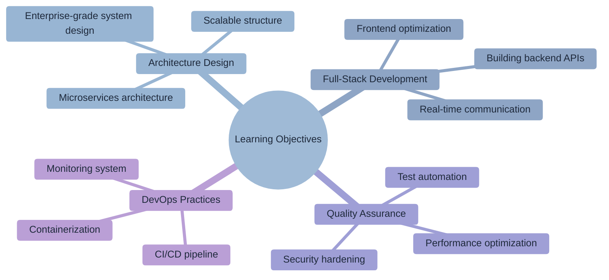
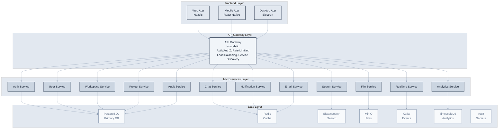

# Chapter 10: Building a Web Application

> "Practice makes theory reality." - Benjamin Franklin



## Learning Objectives

Upon completing this chapter, you will be able to:

- Design and implement a comprehensive web application architecture.
- Systematically develop backend and frontend components using Claude Code.
- Implement and optimize real-time features and interactive UIs.
- Manage the entire development lifecycle, including testing, deployment, and monitoring.

## Overview

In this chapter, we will conduct a comprehensive practical exercise applying all the theories and techniques learned so far to a real project. By building 'CollabSpace', a collaboration tool with real-time chat, from scratch using Claude Code, we will experience the entire process of professional web application development.

Through this project, we will experience the entire development lifecycle from architecture design to deployment and monitoring, and cultivate practical skills that can be directly applied in real-world scenarios.

## 10.1 Enterprise Project Design and Architecture

Successful web application development begins with systematic design and a clear architecture. Especially in complex systems like real-time collaboration platforms, initial design decisions determine the success or failure of the entire project.

Enterprise-grade applications must consider not only functional implementation but also scalability, stability, security, and maintainability. Claude Code comprehensively analyzes these multi-dimensional requirements and proposes validated architectural patterns to minimize the project's technical risks.

**Key Principles of Architectural Design**

1.  **Domain-Driven Design (DDD)**: Defining service boundaries centered on business logic.
2.  **Separation of Concerns**: Clearly distinguishing the responsibilities and roles of each component.
3.  **Loose Coupling**: Minimizing dependencies between services to enable independent development and deployment.
4.  **High Cohesion**: Logically grouping related functionalities to improve code quality.
5.  **Scalability Consideration**: Flexible structure to prepare for user growth and feature expansion.

### Project Overview: "CollabSpace" - An Enterprise-Grade Collaboration Platform

CollabSpace is a comprehensive collaboration platform that meets all the requirements of a modern remote collaboration environment. It combines the strengths of Slack and Notion while providing additional professional features for development teams.

**Core Features and Business Value**

**1. Real-time Collaboration Engine**

- WebSocket-based real-time communication (supporting 1000+ concurrent users)
- Concurrent editing and conflict resolution algorithms
- Real-time cursor tracking and user presence
- Offline synchronization and conflict resolution

**2. Intelligent Workspace Management**

- Hierarchical organizational structure (Organization > Team > Project)
- Role-Based Access Control (RBAC) system
- Dynamic permission delegation and temporary access
- Audit logs and activity tracking

**3. Integrated Communication Hub**

- Real-time chat with multimedia support
- Thread-based conversation structure
- Intelligent notification system
- Integrated search and content discovery

**4. Project Management Tools**

- Customizable Kanban boards
- Gantt charts and timeline views
- Automated workflows
- Progress tracking and reporting

**5. File and Knowledge Management**

- File system with version control
- Real-time collaborative document editor
- Wiki system and knowledge base
- Integrated code review tools

### Enterprise-Grade Architecture Design

Designing the architecture for a complex collaboration platform must consider not only functional requirements but also non-functional requirements (performance, scalability, availability, security).

**Architecture Design Methodology**

Modern web application design follows a systematic approach:

1.  **Requirements Analysis**: Clearly define business requirements and technical constraints.
2.  **Domain Modeling**: Design core business entities and their relationships.
3.  **Service Decomposition**: Define microservice boundaries and API interfaces.
4.  **Data Architecture**: Establish strategies for data storage, caching, and retrieval.
5.  **Communication Patterns**: Design synchronous/asynchronous communication and event-driven architecture.
6.  **Security Architecture**: Build strategies for authentication, authorization, and data protection.
7.  **Operational Architecture**: Design strategies for monitoring, logging, and deployment.

We will use Claude Code to proceed with this overall design process in a systematic and validated manner.

**System Requirements Definition**

```bash
claude "Design the architecture for the CollabSpace enterprise collaboration platform.

Non-functional Requirements:
- Performance: 1000+ concurrent users, API response time < 100ms
- Scalability: Horizontally scalable microservices architecture
- Availability: 99.9% uptime, multi-availability zone deployment
- Security: Zero Trust architecture, end-to-end encryption
- Data Consistency: Event sourcing and CQRS pattern application

Functional Requirements:
- Real-time Collaboration: WebSocket-based real-time communication
- Multi-tenancy: Data isolation per organization
- File System: Large file handling and CDN integration
- Search Engine: Full-text search and auto-completion
- Analytics System: User pattern analysis and insights

Technical Constraints:
- Cloud-native (Kubernetes-based)
- Container-first architecture
- API-first design
- Event-driven architecture
- Built-in observability (monitoring, logging, tracing)"
```

**Architecture Overview Proposed by Claude Code**



**Detailed Architecture Design Request**

```bash
# Define microservice boundaries
claude "Define the microservice boundaries for CollabSpace according to DDD principles.

Domain Context Analysis:
- Responsibilities and boundaries of each bounded context
- Communication patterns between services (synchronous vs. asynchronous)
- Data ownership and consistency strategies
- Reflection of event storming results

Detailed Design per Service:
1. Authentication Service: OAuth2/OIDC, JWT, multiple ID providers
2. User Management: Profile, settings, team membership
3. Workspace: Organizational structure, permission management
4. Real-time Communication: WebSocket connection management, message routing
5. File Service: Upload, storage, CDN integration
6. Search Service: Indexing, full-text search, auto-completion
7. Notification Service: Real-time notifications, email, push

Each service should:
- Be independently deployable
- Own its database
- Support API version management
- Have built-in health checks and monitoring"

# Real-time communication architecture
claude "Design a WebSocket architecture for large-scale real-time collaboration.

Requirements:
- Support 1000+ concurrent connections
- Message guarantee and order preservation
- Connection recovery and resynchronization
- Horizontal scalability

Design Elements:
1. WebSocket cluster management
2. Message broker (Redis Streams/Kafka)
3. Session management and load balancing
4. Backpressure and flow control
5. Connection status monitoring

Performance Optimization:
- Connection pooling and reuse
- Message batching and compression
- Namespace-specific isolation
- Geo-distributed deployment"

# Data architecture design
claude "Design a multi-tenant data architecture.

Isolation Strategy:
- Row-Level Security
- Schema separation vs. Database separation
- Encryption and access control

Consistency Model:
- ACID vs. BASE trade-offs
- Event sourcing application areas
- CQRS pattern implementation
- Distributed transaction management

Performance Optimization:
- Sharding strategy
- Read replica utilization
- Caching layer design
- Index optimization"
```

### Strategic Technology Stack Selection

Selecting a technology stack is a strategic decision that must consider not only technical preferences but also business goals, team capabilities, and long-term maintainability. We will systematically select the optimal technology for each layer using Claude Code.

**Comprehensive Technology Stack Evaluation Request**

```bash
claude "Recommend the optimal technology stack for the CollabSpace enterprise platform.

Evaluation Criteria:
1. Performance and Scalability: Ability to handle 1000+ concurrent users
2. Development Productivity: Team learning curve and development speed
3. Ecosystem Maturity: Library, tool, and community support
4. Operational Stability: Production validation and long-term support
5. Cost-Effectiveness: License, infrastructure, and personnel costs
6. Security: Security patches and vulnerability response
7. Talent Acquisition: Ease of acquiring developers in the market

Technology Candidates per Area:
- Frontend: React/Next.js vs. Vue/Nuxt vs. Angular vs. Svelte
- Backend Language: Node.js vs. Python vs. Java vs. Go vs. Rust
- Web Framework: Express vs. FastAPI vs. Spring Boot vs. Gin
- Database: PostgreSQL vs. MySQL vs. MongoDB vs. Cassandra
- Cache: Redis vs. Memcached vs. Hazelcast
- Message Queue: Kafka vs. RabbitMQ vs. Redis Streams vs. NATS
- Search Engine: Elasticsearch vs. Solr vs. Algolia vs. Typesense
- Container: Docker vs. Podman vs. containerd
- Orchestration: Kubernetes vs. Docker Swarm vs. Nomad
- Cloud: AWS vs. GCP vs. Azure vs. Multi-cloud

Include detailed justifications and trade-off analyses for each choice."
```

**Final Technology Stack Recommended by Claude Code**

```yaml
# Frontend Stack
frontend:
  framework: "Next.js 14"
  language: "TypeScript"
  styling: "Tailwind CSS + HeadlessUI"
  state_management: "Zustand + TanStack Query"
  ui_components: "Radix UI + shadcn/ui"
  animation: "Framer Motion"
  testing: "Vitest + Testing Library + Playwright"
  bundler: "Turbopack (Next.js built-in)"
  
  Rationale:
    - "Next.js 14: Performance optimization with App Router's server components"
    - "TypeScript: Type safety assurance in large team development"
    - "Tailwind CSS: Consistent design system and rapid prototyping"
    - "Zustand: Simple yet powerful state management, minimal boilerplate compared to Redux"
    - "Radix UI: Accessibility built-in, essential for enterprise environments"

# Backend Stack
backend:
  runtime: "Node.js 20 LTS"
  framework: "Fastify 4.x"
  language: "TypeScript"
  validation: "Zod"
  orm: "Prisma"
  authentication: "Passport.js + Auth0"
  websockets: "Socket.io 4.x"
  api_documentation: "OpenAPI 3.0 + Swagger"
  testing: "Jest + Supertest"
  
  Rationale:
    - "Node.js: Maximizes team efficiency with the same language as frontend"
    - "Fastify: Twice the performance of Express, excellent plugin ecosystem"
    - "Prisma: Type-safe database access, excellent migration management"
    - "Socket.io: Industry standard for real-time communication, built-in fallback mechanisms"

# Database Stack
database:
  primary: "PostgreSQL 15"
  cache: "Redis 7.x"
  search: "Elasticsearch 8.x"
  analytics: "TimescaleDB"
  message_queue: "Redis Streams"
  object_storage: "MinIO (S3 compatible)"
  
  Rationale:
    - "PostgreSQL: ACID compliance, JSON support, excellent scalability"
    - "Redis: Supports high-performance caching, pub/sub, and stream processing"
    - "Elasticsearch: Optimized for full-text search, real-time analytics, auto-completion"
    - "TimescaleDB: PostgreSQL extension specialized for time-series data processing"

# Infrastructure Stack
infrastructure:
  containerization: "Docker + Docker Compose"
  orchestration: "Kubernetes 1.28+"
  ingress: "Istio Service Mesh"
  api_gateway: "Kong Gateway"
  monitoring: "Prometheus + Grafana + Jaeger"
  logging: "Fluentd + Elasticsearch + Kibana"
  secrets: "HashiCorp Vault"
  ci_cd: "GitLab CI + ArgoCD"
  cloud: "AWS (multi-AZ deployment)"
  
  Rationale:
    - "Kubernetes: Container orchestration standard, multi-cloud support"
    - "Istio: Integrates security, observability, and traffic management with service mesh"
    - "Kong: Enterprise-grade API gateway, plugin ecosystem"
    - "Prometheus: Cloud-native monitoring standard"

# Development Tools
development:
  package_manager: "pnpm"
  monorepo: "Turborepo"
  code_quality: "ESLint + Prettier + Husky"
  type_checking: "TypeScript strict mode"
  testing: "Jest + Playwright + k6"
  documentation: "Storybook + Docusaurus"
  
  Rationale:
    - "pnpm: 3x faster installation speed than npm, saves disk space"
    - "Turborepo: Monorepo build optimization, reduces CI time with caching"

# Security Stack
security:
  authentication: "OAuth 2.0 + OpenID Connect"
  authorization: "RBAC + ABAC hybrid"
  secrets_management: "HashiCorp Vault"
  encryption: "TLS 1.3 + AES-256"
  vulnerability_scanning: "Snyk + OWASP ZAP"
  compliance: "SOC 2 Type II ready"
```

**Technology Stack Decision Matrix**

```bash
claude "Transparently document the decision-making process for the selected technology stack.

Create Comparison Matrix:
- Score for each technology option (1-10 points)
- Apply weights (Performance 30%, Development Productivity 25%, Operational Stability 20%, Cost 15%, Learning Curve 10%)
- Total score and ranking
- Reasons for excluding unselected technologies

Risk Analysis:
- Key risks and mitigation strategies for each technology
- Upgrade paths and migration plans
- Vendor lock-in and alternative technologies
- Team training plans and schedules

Performance Benchmarks:
- Expected performance metrics
- Predicted bottleneck points
- Scalability scenarios
- Monitoring points"
```

**Prototype Validation**

```bash
claude "Create a prototype to validate the technology stack.

Validation Objectives:
1. Performance Benchmark: Concurrent users, response time, throughput
2. Development Productivity: Feature development speed, debugging ease
3. Operational Complexity: Deployment, monitoring, problem-solving
4. Integration: Inter-service communication, data consistency

Prototype Scope:
- User authentication and session management
- Real-time chat (100 concurrent connections)
- File upload and download
- Search functionality
- Basic monitoring and logging

Success Criteria:
- API response time < 100ms (95%)
- WebSocket message latency < 50ms
- File upload throughput > 10MB/s
- Search response time < 200ms
- System resource utilization < 70%"
```

## 10.2 엔터프라이즈급 프로젝트 초기 설정

프로젝트 초기 설정은 전체 개발 라이프사이클의 효율성을 결정하는 중요한 단계입니다. 엔터프라이즈 환경에서는 단순한 프로젝트 생성을 넘어서 확장 가능한 아키텍처, 팀 협업 체계, 자동화된 품질 관리 시스템을 모두 고려해야 합니다.

**엔터프라이즈급 프로젝트 설정의 핵심 요소**

1. **모노레포 아키텍처**: 여러 서비스와 패키지를 효율적으로 관리
2. **자동화된 개발 환경**: 새로운 팀원의 빠른 온보딩 지원
3. **코드 품질 관리**: 일관된 코딩 스타일과 품질 기준 적용
4. **CI/CD 기반 구축**: 자동화된 테스트와 배포 파이프라인
5. **모니터링 및 로깅**: 운영 단계를 고려한 관찰 가능성 시스템
6. **보안 정책**: 개발 단계부터 적용되는 보안 가이드라인

잘 구조화된 모노레포와 자동화된 개발 환경은 팀 생산성을 크게 향상시키고 코드 품질을 보장합니다. 특히 마이크로서비스 아키텍처에서는 서비스 간 의존성 관리와 공통 라이브러리 공유가 프로젝트 성공의 핵심 요소입니다.

### 고급 모노레포 아키텍처

모노레포는 여러 관련 프로젝트를 하나의 저장소에서 관리하는 소프트웨어 개발 전략입니다. 엔터프라이즈 환경에서 모노레포는 코드 공유, 의존성 관리, 버전 동기화를 크게 단순화하며 개발팀 간의 협업을 향상시킵니다.

**모노레포의 핵심 장점**

1. **코드 공유**: 공통 라이브러리와 유틸리티를 여러 프로젝트에서 쉽게 재사용
2. **의존성 관리**: 전체 프로젝트의 의존성을 중앙에서 일관되게 관리
3. **빌드 최적화**: 변경된 부분만 빌드하는 증분 빌드로 시간 단축
4. **타입 안전성**: TypeScript를 통한 전체 프로젝트의 타입 안전성 보장
5. **일관된 도구**: 린팅, 테스팅, 포매팅 도구의 통일된 설정

**Turborepo 선택 이유**
Turborepo는 현재 가장 진보된 모노레포 도구 중 하나로, 다음과 같은 특징을 제공합니다.

- **지능형 캐싱**: 이전 빌드 결과를 캐시하여 빌드 시간 대폭 단축
- **병렬 실행**: 독립적인 작업들을 병렬로 처리하여 효율성 극대화
- **원격 캐싱**: 팀원 간 빌드 캐시 공유로 전체 팀 생산성 향상
- **의존성 그래프**: 패키지 간 의존성을 자동으로 분석하여 최적 빌드 순서 결정

```bash
claude "CollabSpace를 위한 엔터프라이즈급 모노레포를 구성해줘.

요구사항
- Turborepo 기반 고성능 빌드 시스템
- 서비스별 독립적 배포 가능
- 공통 라이브러리 효율적 공유
- 타입 안전성 전체 프로젝트 보장
- 개발 도구 통합 (린팅, 테스팅, 포매팅)
- Docker 기반 컨테이너화 준비

프로젝트 구조

```mermaid
%%{init: {"theme": "base", "themeVariables": {"primaryColor": "#f8fafc", "primaryTextColor": "#1e293b", "primaryBorderColor": "#e2e8f0", "lineColor": "#94a3b8", "secondaryColor": "#f1f5f9", "tertiaryColor": "#e2e8f0"}}}%%
graph TD
    A[collab-space/] --> B[apps/<br/>애플리케이션]
    A --> C[packages/<br/>공유 라이브러리]
    A --> D[tools/<br/>개발 도구]
    A --> E[infrastructure/<br/>인프라 코드]
    A --> F[docs/<br/>문서]
    A --> G[.github/<br/>GitHub 설정]
    
    B --> B1[web/<br/>Next.js 14]
    B --> B2[mobile/<br/>React Native]
    B --> B3[api-gateway/<br/>Fastify]
    B --> B4[auth-service/<br/>인증]
    B --> B5[chat-service/<br/>채팅]
    B --> B6[file-service/<br/>파일 관리]
    
    C --> C1[ui/<br/>공통 UI 컴포넌트]
    C --> C2[types/<br/>TypeScript 타입]
    C --> C3[config/<br/>설정 관리]
    C --> C4[utils/<br/>공통 유틸리티]
    C --> C5[database/<br/>DB 관련]
    C --> C6[monitoring/<br/>모니터링]
    
    D --> D1[build/<br/>빌드 스크립트]
    D --> D2[scripts/<br/>자동화]
    D --> D3[generators/<br/>코드 생성]
    D --> D4[testing/<br/>테스트 유틸]
    
    E --> E1[docker/<br/>컨테이너 설정]
    E --> E2[kubernetes/<br/>K8s 매니페스트]
    E --> E3[terraform/<br/>인프라 프로비저닝]
    E --> E4[monitoring/<br/>모니터링 설정]
    
    F --> F1[architecture/<br/>아키텍처]
    F --> F2[api/<br/>API 문서]
    F --> F3[deployment/<br/>배포 가이드]
    F --> F4[development/<br/>개발 가이드]
    
    classDef rootStyle fill:#e2e8f0,stroke:#334155,stroke-width:3px,color:#1e293b
    classDef categoryStyle fill:#f1f5f9,stroke:#475569,stroke-width:2px,color:#1e293b
    classDef itemStyle fill:#f8fafc,stroke:#94a3b8,stroke-width:1px,color:#64748b
    
    class A rootStyle
    class B,C,D,E,F,G categoryStyle
    class B1,B2,B3,B4,B5,B6,C1,C2,C3,C4,C5,C6,D1,D2,D3,D4,E1,E2,E3,E4,F1,F2,F3,F4 itemStyle
```



추가 설정 요구사항
- 각 서비스는 독립적인 Dockerfile과 CI/CD 파이프라인
- 공통 패키지 변경 시 영향받는 앱만 재빌드
- 타입 체크, 린팅, 테스트 병렬 실행
- 의존성 그래프 최적화로 빌드 시간 최소화
- 개발 환경 Hot Reload 지원
- 프로덕션 빌드 최적화 (트리 쉐이킹, 코드 분할)"
```

**Turborepo 고급 설정**

```json
{
  "name": "collabspace",
  "version": "0.1.0",
  "private": true,
  "workspaces": [
    "apps/*",
    "packages/*",
    "tools/*"
  ],
  "scripts": {
    "build": "turbo run build",
    "dev": "turbo run dev --parallel",
    "test": "turbo run test",
    "test:e2e": "turbo run test:e2e",
    "lint": "turbo run lint",
    "type-check": "turbo run type-check",
    "clean": "turbo run clean && rm -rf node_modules",
    "format": "prettier --write .",
    "docker:dev": "docker-compose -f docker-compose.dev.yml up",
    "docker:prod": "docker-compose -f docker-compose.prod.yml up",
    "k8s:deploy": "kubectl apply -k infrastructure/kubernetes/overlays/dev",
    "seed": "turbo run seed",
    "migrate": "turbo run migrate",
    "generate": "turbo run generate"
  },
  "devDependencies": {
    "@turbo/gen": "^1.10.0",
    "turbo": "^1.10.0",
    "prettier": "^3.0.0",
    "husky": "^8.0.3",
    "lint-staged": "^14.0.0"
  },
  "engines": {
    "node": ">=20.0.0",
    "pnpm": ">=8.0.0"
  },
  "packageManager": "pnpm@8.10.0"
}
```

**turbo.json 엔터프라이즈 설정**

```json
{
  "$schema": "https://turbo.build/schema.json",
  "globalDependencies": ["**/.env.*local"],
  "pipeline": {
    "build": {
      "dependsOn": ["^build"],
      "outputs": [".next/**", "!.next/cache/**", "dist/**"],
      "env": ["NODE_ENV", "API_URL", "DATABASE_URL"]
    },
    "test": {
      "dependsOn": ["^build"],
      "outputs": ["coverage/**"],
      "inputs": ["src/**/*.tsx", "src/**/*.ts", "test/**/*.ts", "**/*.test.*"]
    },
    "test:e2e": {
      "dependsOn": ["build"],
      "cache": false
    },
    "lint": {
      "outputs": []
    },
    "type-check": {
      "dependsOn": ["^build"],
      "outputs": []
    },
    "dev": {
      "cache": false,
      "persistent": true
    },
    "clean": {
      "cache": false
    },
    "migrate": {
      "cache": false
    },
    "seed": {
      "dependsOn": ["migrate"],
      "cache": false
    },
    "generate": {
      "outputs": ["generated/**"]
    }
  },
  "remoteCache": {
    "signature": true
  }
}
```

### 개발 환경 자동화

개발 환경 자동화는 새로운 팀원이 최소한의 수동 작업으로 개발을 시작할 수 있도록 하는 중요한 투자입니다. 자동화된 환경 설정은 인적 오류를 줄이고, 일관된 개발 환경을 보장하며, 팀의 전반적인 생산성을 향상시킵니다.

**자동화의 핵심 목표**

1. **제로 설정 온보딩**: 저장소 클론 후 한 번의 명령으로 개발 시작 가능
2. **환경 일관성**: 모든 개발자가 동일한 환경에서 작업
3. **의존성 자동 관리**: 필요한 도구와 서비스 자동 설치 및 설정
4. **검증 시스템**: 설정 완료 후 자동 검증으로 문제 조기 발견
5. **문서 동기화**: 설정 과정과 문서의 자동 동기화

**개발 환경 구성 요소**

- **런타임 환경**: Node.js, 패키지 매니저, 개발 도구
- **데이터베이스**: 로컬 개발용 데이터베이스와 시드 데이터
- **외부 서비스**: Redis, Elasticsearch 등 필수 인프라
- **개발 도구**: IDE 설정, 디버거, 린터, 포매터
- **테스트 환경**: 단위 테스트 및 통합 테스트 실행 환경

```bash
claude "개발자 온보딩을 위한 완전 자동화된 개발 환경을 구성해줘.

자동화 범위
1. 환경 요구사항 자동 확인 및 설치
   - Node.js 20+ LTS
   - pnpm 8+
   - Docker & Docker Compose
   - VS Code 확장 프로그램

2. 프로젝트 초기 설정
   - 의존성 설치 (pnpm install)
   - 환경 변수 설정 (.env 파일 생성)
   - 데이터베이스 초기화 (Docker Compose)
   - 시드 데이터 삽입

3. 개발 도구 설정
   - Git 훅 설정 (Husky)
   - VS Code 설정 동기화
   - 디버깅 설정 구성
   - 테스트 데이터베이스 준비

4. 검증 프로세스
   - 모든 서비스 빌드 테스트
   - 기본 E2E 테스트 실행
   - 코드 품질 검사
   - 성능 벤치마크 기준 확인

스크립트 구현
- setup.sh (Linux/macOS)
- setup.ps1 (Windows PowerShell)
- Makefile (크로스 플랫폼 명령)
- GitHub Codespaces 설정
- Docker 개발 컨테이너"
```

**자동화 설정 스크립트**

```bash
#!/bin/bash
# setup.sh - 개발 환경 자동 설정

set -e

echo "🚀 CollabSpace 개발 환경 설정 시작..."

# 1. 시스템 요구사항 확인
echo "📋 시스템 요구사항 확인 중..."

check_command() {
    if ! command -v $1 &> /dev/null; then
        echo "❌ $1이 설치되지 않았습니다. 설치 가이드: $2"
        exit 1
    else
        echo "✅ $1 확인됨"
    fi
}

check_command "node" "https://nodejs.org/"
check_command "pnpm" "npm install -g pnpm"
check_command "docker" "https://docs.docker.com/get-docker/"
check_command "docker-compose" "https://docs.docker.com/compose/install/"

# Node.js 버전 확인
NODE_VERSION=$(node --version | cut -d'v' -f2 | cut -d'.' -f1)
if [ "$NODE_VERSION" -lt 20 ]; then
    echo "❌ Node.js 20+ 필요. 현재 버전: $(node --version)"
    exit 1
fi

# 2. 의존성 설치
echo "📦 의존성 설치 중..."
pnpm install

# 3. 환경 변수 설정
echo "⚙️ 환경 변수 설정 중..."
if [ ! -f .env.local ]; then
    cp .env.example .env.local
    echo "📝 .env.local 파일이 생성되었습니다. 필요한 값들을 설정해주세요."
fi

# 4. 데이터베이스 초기화
echo "🗄️ 개발 데이터베이스 초기화 중..."
docker-compose -f docker-compose.dev.yml up -d db redis elasticsearch

# 데이터베이스 준비 대기
echo "⏳ 데이터베이스 준비 대기 중..."
sleep 30

# 5. Prisma 마이그레이션 및 시드
echo "🔄 데이터베이스 마이그레이션 실행 중..."
pnpm run migrate:dev
pnpm run seed

# 6. Git 훅 설정
echo "🔧 Git 훅 설정 중..."
pnpm run prepare

# 7. VS Code 설정
echo "💻 VS Code 설정 동기화 중..."
if command -v code &> /dev/null; then
    # 추천 확장 프로그램 설치
    code --install-extension bradlc.vscode-tailwindcss
    code --install-extension prisma.prisma
    code --install-extension ms-vscode.vscode-typescript-next
    code --install-extension esbenp.prettier-vscode
    code --install-extension ms-vscode.vscode-eslint
    echo "✅ VS Code 확장 프로그램 설치 완료"
fi

# 8. 개발 서버 시작 가능 여부 확인
echo "🧪 설정 검증 중..."
pnpm run build

# 9. 개발 서버 시작
echo "🎉 설정 완료! 개발 서버를 시작합니다..."
echo ""
echo "다음 명령어로 개발을 시작할 수 있습니다:"
echo "  pnpm dev          - 모든 서비스 개발 모드 시작"
echo "  pnpm test         - 테스트 실행"
echo "  pnpm lint         - 코드 품질 검사"
echo "  pnpm type-check   - TypeScript 타입 검사"
echo ""
echo "📚 문서: http://localhost:3001/docs"
echo "🔍 API: http://localhost:3000/api"
echo "💻 웹 앱: http://localhost:3000"
echo ""

# 선택적으로 개발 서버 시작
read -p "지금 개발 서버를 시작하시겠습니까? (y/N): " -n 1 -r
echo
if [[ $REPLY =~ ^[Yy]$ ]]; then
    pnpm dev
fi
```

### 포괄적인 CLAUDE.md 작성

프로젝트의 CLAUDE.md는 Claude Code가 프로젝트의 맥락을 완전히 이해하고 일관된 품질의 코드를 생성할 수 있도록 하는 핵심 문서입니다. 이 문서는 단순한 설정 파일을 넘어서 프로젝트의 지식 베이스 역할을 수행합니다.

**CLAUDE.md의 전략적 중요성**

1. **컨텍스트 제공**: AI가 프로젝트의 비즈니스 로직과 기술적 맥락을 이해
2. **일관성 보장**: 모든 생성되는 코드가 프로젝트 표준을 준수
3. **지식 보존**: 팀의 암묵적 지식을 명문화하여 보존
4. **온보딩 가속화**: 새로운 팀원이 프로젝트를 빠르게 이해
5. **품질 향상**: 코드 리뷰 기준과 모범 사례를 명확히 정의

**엔터프라이즈급 CLAUDE.md 구성 요소**

- **비즈니스 맥락**: 프로젝트 목표, 사용자, 핵심 가치 제안
- **기술 아키텍처**: 시스템 설계, 패턴, 제약사항
- **코딩 표준**: 네이밍 규칙, 코드 스타일, 모범 사례
- **보안 가이드라인**: 인증, 데이터 보호, 취약점 방지
- **성능 기준**: 응답 시간, 처리량, 리소스 사용량 목표
- **테스트 전략**: 테스트 유형, 커버리지, 자동화 정책

엔터프라이즈급 프로젝트에서는 특히 상세하고 체계적인 가이드라인이 필요합니다. 이는 대규모 팀에서 일관된 코드 품질을 유지하고, 복잡한 비즈니스 요구사항을 정확히 반영하기 위해서입니다.

```bash
claude "CollabSpace 프로젝트를 위한 포괄적인 CLAUDE.md를 작성해줘.

포함 내용
1. 프로젝트 개요와 비즈니스 목표
2. 기술 아키텍처 요약
3. 코딩 표준과 컨벤션
4. 서비스별 특화 가이드라인
5. 보안 및 성능 요구사항
6. 테스트 전략
7. 배포 프로세스
8. 트러블슈팅 가이드

각 섹션은 구체적인 예시와 함께 실무에서 바로 적용 가능한 수준으로 작성해줘."
```

**생성된 포괄적인 CLAUDE.md**

````markdown
# CollabSpace 엔터프라이즈 협업 플랫폼 개발 가이드

## 프로젝트 개요

CollabSpace는 1000+ 동시 사용자를 지원하는 엔터프라이즈급 실시간 협업 플랫폼입니다.
Slack의 실시간 커뮤니케이션과 Notion의 구조화된 정보 관리를 결합한 차세대 협업 도구입니다.

### 핵심 가치 제안
- **실시간 협업**: WebSocket 기반 즉각적인 커뮤니케이션
- **통합 워크플로우**: 채팅, 프로젝트 관리, 파일 공유를 하나의 플랫폼에서
- **엔터프라이즈 보안**: 제로 트러스트, 종단간 암호화, SOC 2 준수
- **무한 확장성**: 마이크로서비스 아키텍처로 수평적 확장 가능

### 타겟 사용자
- 중대형 기업의 개발팀 (50-5000명)
- 원격 우선 조직
- 애자일/DevOps 문화를 가진 팀

## 기술 아키텍처

### 시스템 아키텍처

```mermaid
%%{init: {"theme": "base", "themeVariables": {"primaryColor": "#f8fafc", "primaryTextColor": "#1e293b", "primaryBorderColor": "#e2e8f0", "lineColor": "#94a3b8", "secondaryColor": "#f1f5f9", "tertiaryColor": "#e2e8f0"}}}%%
graph TB
    subgraph clients [클라이언트 계층]
        A[Web<br/>Next.js]
        B[Mobile<br/>React Native]  
        C[Desktop<br/>Electron]
    end
    
    subgraph gateway [API Gateway 계층]
        D[API Gateway<br/>Kong/Istio<br/>인증 | 라우팅 | 로드밸런싱 | 모니터링]
    end
    
    subgraph services [마이크로서비스 계층]
        E[Auth]
        F[User]
        G[Workspace]
        H[Chat]
        I[File]
        J[Notification]
    end
    
    subgraph data [데이터 계층]
        K[PostgreSQL]
        L[Redis]
        M[Elasticsearch]
        N[MinIO]
        O[Kafka]
    end
    
    A --> D
    B --> D
    C --> D
    
    D --> E
    D --> F
    D --> G
    D --> H
    D --> I
    D --> J
    
    E --> K
    F --> K
    G --> K
    H --> L
    I --> N
    J --> O
    
    classDef clientStyle fill:#e2e8f0,stroke:#334155,stroke-width:2px,color:#1e293b
    classDef gatewayStyle fill:#f1f5f9,stroke:#475569,stroke-width:2px,color:#1e293b
    classDef serviceStyle fill:#cbd5e1,stroke:#475569,stroke-width:1px,color:#1e293b
    classDef dataStyle fill:#f8fafc,stroke:#94a3b8,stroke-width:2px,color:#64748b
    
    class A,B,C clientStyle
    class D gatewayStyle
    class E,F,G,H,I,J serviceStyle
    class K,L,M,N,O dataStyle
```

### 기술 스택
- **Frontend**: Next.js 14, TypeScript, Tailwind CSS, Zustand
- **Backend**: Node.js 20, Fastify, Prisma, Socket.io
- **Database**: PostgreSQL 15, Redis 7, Elasticsearch 8
- **Infrastructure**: Docker, Kubernetes, AWS
- **Monitoring**: Prometheus, Grafana, Jaeger

## 코딩 표준과 컨벤션

### TypeScript 규칙
```typescript
// ✅ 좋은 예: 명시적 타입, 인터페이스 우선
interface UserCreateInput {
  email: string;
  name: string;
  role: UserRole;
}

async function createUser(input: UserCreateInput): Promise<User> {
  // 구현
}

// ❌ 나쁜 예: any 타입, 암시적 반환
function createUser(input: any) {
  // 구현
}
```

### 에러 처리 패턴
```typescript
// 커스텀 에러 클래스 사용
export class BusinessError extends Error {
  constructor(
    public code: string,
    message: string,
    public statusCode: number = 400
  ) {
    super(message);
    this.name = 'BusinessError';
  }
}

// Result 타입 패턴
type Result<T, E = Error> = 
  | { ok: true; value: T }
  | { ok: false; error: E };

// 사용 예시
async function updateUser(id: string, data: UpdateUserInput): Promise<Result<User>> {
  try {
    const user = await prisma.user.update({ where: { id }, data });
    return { ok: true, value: user };
  } catch (error) {
    return { ok: false, error: new BusinessError('USER_NOT_FOUND', 'User not found', 404) };
  }
}
```

### 네이밍 컨벤션
- **파일명**: kebab-case (`user-service.ts`, `auth-middleware.ts`)
- **컴포넌트**: PascalCase (`UserProfile.tsx`, `ChatWindow.tsx`)
- **함수/변수**: camelCase (`getUserById`, `isAuthenticated`)
- **상수**: SCREAMING_SNAKE_CASE (`MAX_FILE_SIZE`, `API_TIMEOUT`)
- **타입/인터페이스**: PascalCase (`UserDto`, `AuthPayload`)

### 폴더 구조 규칙
```
src/
├── controllers/    # HTTP 요청 처리 (얇은 계층)
├── services/       # 비즈니스 로직
├── repositories/   # 데이터 액세스
├── models/         # 도메인 모델
├── dto/           # Data Transfer Objects
├── middleware/     # Express/Fastify 미들웨어
├── utils/         # 공통 유틸리티
└── types/         # TypeScript 타입 정의
```

## 서비스별 특화 가이드라인

### 인증 서비스 (auth-service)
// JWT 토큰 처리
- Access Token: 15분 만료
- Refresh Token: 7일 만료
- 토큰 로테이션 정책 적용
- Redis에 블랙리스트 관리

// 보안 요구사항
- bcrypt rounds: 12
- 비밀번호 정책: 최소 12자, 대소문자+숫자+특수문자
- 2FA 지원 (TOTP)
- 계정 잠금: 5회 실패 시 15분 잠금

### 실시간 통신 서비스 (chat-service)
// Socket.io 이벤트 네이밍
- 서버 → 클라이언트: `<entity>:<action>` (예: `message:created`)
- 클라이언트 → 서버: `<action>:<entity>` (예: `create:message`)

// 네임스페이스 구조
/workspace/:workspaceId
  ├── /channel/:channelId
  ├── /direct/:userId
  └── /presence

// 메시지 처리
- 메시지 큐잉: Redis Streams
- 배치 처리: 100ms 디바운싱
- 최대 메시지 크기: 10KB
- 파일 첨부: 별도 업로드 후 참조

### 파일 서비스 (file-service)
// 업로드 제한
- 최대 파일 크기: 100MB
- 허용 확장자 화이트리스트
- 바이러스 스캔 필수
- 이미지 자동 리사이징

// 저장 전략
- 원본: MinIO/S3
- 썸네일: CDN 캐시
- 메타데이터: PostgreSQL
- 임시 파일: 24시간 후 자동 삭제

## 보안 요구사항

### 인증/인가
- OAuth 2.0 + OpenID Connect
- Role-Based Access Control (RBAC)
- Attribute-Based Access Control (ABAC)
- API Key 관리 (해싱, 만료, 회전)

### 데이터 보호
- 전송 중 암호화: TLS 1.3
- 저장 시 암호화: AES-256-GCM
- PII 필드 마스킹
- 감사 로그 (불변성 보장)

### 보안 헤더
```typescript
// 필수 보안 헤더
app.use(helmet({
  contentSecurityPolicy: {
    directives: {
      defaultSrc: ["'self'"],
      styleSrc: ["'self'", "'unsafe-inline'"],
      scriptSrc: ["'self'"],
      imgSrc: ["'self'", "data:", "https:"],
    },
  },
  hsts: {
    maxAge: 31536000,
    includeSubDomains: true,
    preload: true,
  },
}));
```

## 성능 요구사항

### API 응답 시간
- P50: < 50ms
- P95: < 200ms
- P99: < 500ms

### 처리량
- 일반 API: 10,000 RPS
- 검색 API: 1,000 RPS
- WebSocket: 100,000 동시 연결

### 캐싱 전략
// Redis 캐싱 계층
- 사용자 세션: 15분
- 권한 정보: 5분
- 자주 조회되는 데이터: 1시간
- 검색 결과: 10분

// 캐시 무효화
- Write-through 패턴
- 이벤트 기반 무효화
- TTL 기반 만료

## 테스트 전략

### 테스트 피라미드
```
         E2E (10%)
      통합 테스트 (30%)
   단위 테스트 (60%)
```

### 테스트 커버리지 목표
- 전체: 80% 이상
- 핵심 비즈니스 로직: 95% 이상
- 유틸리티 함수: 100%

### 테스트 작성 규칙
```typescript
// 테스트 구조: AAA 패턴
describe('UserService', () => {
  describe('createUser', () => {
    it('should create a new user with valid input', async () => {
      // Arrange
      const input = { email: 'test@example.com', name: 'Test User' };
      
      // Act
      const result = await userService.createUser(input);
      
      // Assert
      expect(result.ok).toBe(true);
      expect(result.value.email).toBe(input.email);
    });
    
    it('should return error for duplicate email', async () => {
      // 구현
    });
  });
});
```

## 모니터링과 로깅

### 구조화된 로깅
```typescript
// 로그 레벨과 컨텍스트
logger.info('User created', {
  userId: user.id,
  email: user.email,
  timestamp: new Date().toISOString(),
  traceId: context.traceId,
});

// 에러 로깅
logger.error('Failed to create user', {
  error: error.message,
  stack: error.stack,
  input: sanitizeInput(input),
  traceId: context.traceId,
});
```

### 메트릭 수집
```typescript
// Prometheus 메트릭
- API 응답 시간 히스토그램
- 동시 사용자 수 게이지
- 에러율 카운터
- 비즈니스 메트릭 (가입, 활성 사용자 등)
```

## 배포 프로세스

### 환경별 설정
- **개발**: 자동 배포, 디버깅 활성화
- **스테이징**: 프로덕션 미러링, 성능 테스트
- **프로덕션**: 블루-그린 배포, 자동 롤백

### 배포 체크리스트
1. [ ] 모든 테스트 통과
2. [ ] 보안 스캔 완료
3. [ ] 성능 벤치마크 기준 충족
4. [ ] 문서 업데이트
5. [ ] 데이터베이스 마이그레이션 검증
6. [ ] 롤백 계획 수립

## 트러블슈팅 가이드

### 일반적인 문제 해결
1. **메모리 누수**: 힙 덤프 분석, 이벤트 리스너 확인
2. **느린 쿼리**: EXPLAIN ANALYZE, 인덱스 최적화
3. **WebSocket 연결 끊김**: 하트비트 확인, 네트워크 정책
4. **높은 CPU 사용률**: 프로파일링, 동기 작업 확인

### 디버깅 도구
- **로컬**: Chrome DevTools, VS Code 디버거
- **원격**: Node.js Inspector, 원격 디버깅
- **프로덕션**: APM 도구, 분산 추적

## 팀 협업 규칙

### 코드 리뷰
- PR은 200줄 이하로 유지
- 최소 2명의 승인 필요
- 24시간 내 리뷰 완료
- 건설적이고 구체적인 피드백

### 커밋 메시지
```
<type>(<scope>): <subject>

<body>

<footer>

예시
feat(auth): implement JWT refresh token rotation

- Add refresh token rotation logic
- Update token validation middleware
- Add tests for edge cases

Closes #123
```

### 브랜치 전략
- `main`: 프로덕션 배포
- `develop`: 개발 통합
- `feature/*`: 기능 개발
- `hotfix/*`: 긴급 수정
- `release/*`: 릴리스 준비

이 가이드는 지속적으로 업데이트되며, 모든 개발자는 이를 숙지하고 준수해야 합니다.
최신 버전은 항상 프로젝트 루트의 CLAUDE.md 파일을 참조하세요.
````

## 10.3 Backend Development

Backend development is a crucial area responsible for the application's core business logic and data management. CollabSpace's backend must reliably provide various functions such as user authentication, real-time communication, and data storage.

### Authentication System Implementation

User authentication is a core function that forms the basis of all collaboration tools. An authentication system using JWT (JSON Web Token) is a modern approach that offers both scalability and security.

```bash
claude "Implement a JWT-based authentication system.
Include sign-up, login, token refresh, and authorization middleware,
and apply security best practices."
```

**Key Implementation Elements**

1.  **Token-Based Authentication**: Ensures server scalability with a stateless approach.
2.  **Role-Based Access Control**: Manages different permission levels per workspace.
3.  **Token Refresh Mechanism**: Balances security and user convenience.
4.  **Password Hashing**: Secure password storage using bcrypt.
5.  **Input Validation**: Protects the system from malicious input.

### Database Design

The database schema is a core design that reflects the application's data structure and business rules. Due to the nature of collaboration tools, complex relationships between users, workspaces, and projects must be clearly defined.

```bash
claude "Design the database schema using Prisma.
Define User, Workspace, Project, Message, and Task entities and their relationships."
```

Generated Schema:
```prisma
// schema.prisma
model User {
  id        String   @id @default(cuid())
  email     String   @unique
  name      String
  avatar    String?
  createdAt DateTime @default(now())
  updatedAt DateTime @updatedAt

  memberships WorkspaceMember[]
  messages    Message[]
  tasks       Task[]
}

model Workspace {
  id          String   @id @default(cuid())
  name        String
  description String?
  createdAt   DateTime @default(now())
  updatedAt   DateTime @updatedAt

  members  WorkspaceMember[]
  projects Project[]
  channels Channel[]
}

model WorkspaceMember {
  id          String    @id @default(cuid())
  role        Role      @default(MEMBER)
  joinedAt    DateTime  @default(now())
  
  user        User      @relation(fields: [userId], references: [id])
  userId      String
  workspace   Workspace @relation(fields: [workspaceId], references: [id])
  workspaceId String

  @@unique([userId, workspaceId])
}

enum Role {
  OWNER
  ADMIN
  MEMBER
}
```

**Schema Design Principles**

1.  **Normalization**: Minimize data redundancy to ensure consistency.
2.  **Relationship Definition**: Efficient join operations through foreign keys and indexes.
3.  **Scalability**: Flexible structure considering future requirements.
4.  **Performance**: Appropriate indexing for frequently queried fields.

### Real-time Communication Implementation

Real-time communication is a core element of collaboration tools. Socket.io enables instant information exchange and collaboration between users.

```bash
claude "Implement real-time chat using Socket.io.
Include namespace-specific room management, message storage, online user display,
and typing indicators."
```

**Core Real-time Communication Features**

1.  **Connection Management**: Track and manage user connection/disconnection status.
2.  **Room-Based Messaging**: Independent chat spaces per workspace.
3.  **Event Handling**: Manage various events like messages, typing, status changes.
4.  **Error Handling**: Implement connection failure and reconnection logic.
5.  **Performance Optimization**: Message batch processing and bandwidth efficiency.

### API Endpoint Development

RESTful APIs provide a standardized communication interface between frontend and backend. Systematic API design significantly improves maintainability and scalability.

```bash
claude "Systematically implement RESTful APIs.
Include router structure, middleware, error handling, input validation,
and ensure OpenAPI specs are auto-generated."
```

**API Design Principles**

1.  **Consistent Naming Conventions**: Intuitive and predictable endpoint structure.
2.  **Appropriate HTTP Methods**: Semantic use of GET, POST, PUT, DELETE.
3.  **Error Handling**: Standardized error response format and appropriate HTTP status codes.
4.  **Input Validation**: Thorough validation for security and data integrity.
5.  **Documentation**: Improve development efficiency with auto-generated API documentation.

## 10.4 Frontend Development

The frontend is the interface users directly interact with. Modern web applications are complex systems that require both responsiveness and performance, going beyond simple static pages.

### Project Setup

Next.js 14 is one of the most mature full-stack frameworks in the React ecosystem. It offers excellent performance and developer experience by utilizing the latest web technologies such as App Router, server components, and streaming.

```bash
claude "Set up a Next.js 14 project.
Include App Router, TypeScript, Tailwind CSS,
state management (Zustand), and UI library (shadcn/ui)."
```

**Technology Stack Selection Rationale**

1.  **Next.js 14**: Optimized performance with server-side rendering and static generation.
2.  **TypeScript**: Prevents runtime errors with compile-time type checking.
3.  **Tailwind CSS**: Fast and consistent styling with utility-based CSS.
4.  **Zustand**: Lightweight yet powerful state management library.
5.  **shadcn/ui**: Component library considering both accessibility and design.

### Authentication Implementation

Frontend authentication is an important element that balances user experience and security. NextAuth.js simplifies integration with various authentication providers and automatically applies security best practices.

```bash
claude "Implement frontend authentication using NextAuth.js.
Include social login (Google, GitHub), session management,
and protected routes."
```

**Core Authentication System Elements**

1.  **Social Login**: Simple and secure authentication via OAuth 2.0.
2.  **Session Management**: State persistence using JWT and cookies.
3.  **Protected Routes**: Restrict access for unauthenticated users.
4.  **Token Refresh**: Seamless user experience with automatic token refresh.

### Real-time Feature Implementation

Real-time features are core to collaboration tools. The Socket.io client enables instant data synchronization through bidirectional communication with the server.

```bash
claude "Implement the Socket.io client.
Include connection management, event listeners, reconnection logic,
and integration with React components."
```

**Real-time Communication Client Design**

1.  **Connection Management**: Adaptive connection handling based on network status.
2.  **Event System**: Type-safe event listeners and emitters.
3.  **Reconnection Logic**: Automatic recovery mechanism for network failures.
4.  **State Synchronization**: Ensure data consistency between server and client.

### UI Component Development

The user interface must satisfy both functional requirements and user experience. Chat interfaces, in particular, require careful design considering real-time aspects and accessibility.

```bash
claude "Implement the chat interface.
Include message list, input field, file upload, emoji picker,
and responsive design."
```

**UI Design Considerations**

1.  **Performance Optimization**: Handle large message volumes with virtualized lists.
2.  **Accessibility**: Support keyboard navigation and screen readers.
3.  **Responsive Design**: Consistent experience across various devices.
4.  **User Experience**: Intuitive interactions and clear feedback.

### State Management

In complex applications, state management is a key element that determines the predictability of data flow and debugging ease. Zustand provides a simple yet powerful state management solution.

```bash
claude "Manage global state using Zustand.
Include user information, workspace, chat messages,
and real-time connection status."
```

**State Management Strategy**

1.  **Modularization**: Store structure separated by feature.
2.  **Type Safety**: Perfect integration with TypeScript.
3.  **Performance**: Selective subscription that only re-renders necessary components.
4.  **Persistence**: State persistence integrated with local storage.

## 10.5 Adding Real-time Features

Real-time features are core elements that transform collaboration tools from simple information sharing tools into true teamwork platforms. Instant interaction between users enables efficient collaboration regardless of physical distance.

### Chat System

The chat system is the central hub for team communication. It must support various communication needs beyond simple message exchange, such as file sharing, mentions, and read receipts.

```bash
claude "Complete the real-time chat system.
Include message sending/receiving, read receipts, message editing/deletion,
file attachments, and mention functionality."
```

**Core Chat System Features**

1.  **Message Management**: Balance real-time sending/receiving with permanent storage.
2.  **Read Receipts**: Track information sharing status among team members.
3.  **Rich Media**: Support for files, images, and link previews.
4.  **Mention System**: Feature to draw specific users' attention.
5.  **Message Editing**: Support for typo correction and content updates.

### Collaboration Features

Real-time collaboration features are advanced functions that make team members feel as if they are working in the same space. Productivity is greatly enhanced through concurrent editing and real-time feedback.

```bash
claude "Add real-time collaboration features.
Implement concurrent editing display, cursor position sharing,
real-time notifications, and activity feeds."
```

**Collaboration Feature Design Principles**

1.  **Visual Feedback**: Intuitively display other users' activities.
2.  **Conflict Prevention**: Ensure data integrity during concurrent editing.
3.  **Context Preservation**: Minimize disruption to users' workflow.
4.  **Selective Notifications**: Differentiated notification system based on importance.

### Kanban Board

Kanban boards are core tools for visual task management. Drag-and-drop interfaces and real-time synchronization allow teams to intuitively grasp and manage task status.

```bash
claude "Implement a drag-and-drop enabled Kanban board.
Support real-time synchronization, card movement, status changes,
and multi-user editing."
```

**Core Kanban Board Features**

1.  **Intuitive Interaction**: Natural task management with drag-and-drop.
2.  **Real-time Synchronization**: Changes instantly reflected for all team members.
3.  **Status Tracking**: Visual representation of task progress.
4.  **Multi-User Support**: Concurrent editing and conflict resolution mechanisms.

## 10.6 Implementing Tests

Software testing is an essential process to ensure code quality and stability. A systematic test strategy is even more crucial for collaboration tools with real-time features and complex interactions.

### Backend Testing

Backend testing is a core process for verifying API accuracy, security, and performance. A multi-layered testing approach is needed to ensure business logic integrity and data consistency.

```bash
claude "Write comprehensive tests for the backend API.
Include unit tests, integration tests, Socket.io tests,
and set up a test database."
```

**Backend Test Strategy**

1.  **Unit Tests**: Verify the correctness of individual functions and modules.
2.  **Integration Tests**: Verify API endpoint and database interactions.
3.  **Real-time Communication Tests**: Verify Socket.io events and connection status.
4.  **Test Isolation**: Ensure independence between each test.
5.  **Mocking and Stubbing**: Stable testing through control of external dependencies.

### Frontend Testing

Frontend testing verifies application behavior from the user's perspective. The entire user experience, including component rendering, user interactions, and state changes, must be tested.

```bash
claude "Write React component tests.
Use React Testing Library, Jest, and
test user interactions, real-time features, and state changes."
```

**Core Frontend Testing Areas**

1.  **Component Rendering**: Verify correct display of UI elements.
2.  **User Interaction**: Event handling for clicks, inputs, drag-and-drop, etc.
3.  **State Management**: Correct updates of global and local state.
4.  **Asynchronous Behavior**: Verification of API calls and real-time data updates.
5.  **Error Handling**: Appropriate user feedback in exceptional situations.

### E2E Testing

End-to-End testing verifies the integration of the entire system through real user scenarios. It confirms that individual components and services work correctly in a complete workflow.

```bash
claude "Write E2E tests using Playwright.
Comprehensively test user scenarios (sign-up, login, chat, collaboration)."
```

**E2E Test Scenarios**

1.  **User Journey**: Complete flow from sign-up to main feature usage.
2.  **Cross-Browser**: Behavior verification in various browser environments.
3.  **Real-time Features**: Concurrent task scenarios among multiple users.
4.  **Error Recovery**: Recovery capability in case of network or server errors.
5.  **Performance Baseline**: Baseline verification of response time and loading performance.

## 10.7 Performance Optimization

Performance optimization is a core element that directly impacts user experience. Loading time, responsiveness, and memory efficiency must be improved to provide a pleasant environment for all users.

### Frontend Optimization

Frontend performance directly affects the application's perceived responsiveness. Overall user experience can be improved through bundle size optimization, rendering performance improvement, and network request optimization.

```bash
claude "Optimize frontend performance.
Apply code splitting, image optimization, memoization,
and virtual scrolling."
```

**Frontend Optimization Strategy**

1.  **Code Splitting**: Reduce initial loading time by loading only necessary code.
2.  **Image Optimization**: Apply WebP format, lazy loading, and responsive images.
3.  **Memoization**: Prevent unnecessary re-renders with React.memo, useMemo, useCallback.
4.  **Virtual Scrolling**: Optimize rendering performance when displaying large amounts of data.
5.  **Cache Utilization**: Resource caching through browser cache and service workers.

### Backend Optimization

Backend performance determines system throughput and response time. Server efficiency can be maximized through database query optimization, caching strategies, and connection management.

```bash
claude "Optimize backend performance.
Apply database query optimization, caching (Redis),
connection pooling, and response compression."
```

**Core Backend Optimization Elements**

1.  **Query Optimization**: Index utilization, N+1 problem resolution, query plan analysis.
2.  **Caching Strategy**: Build a multi-layer cache system using Redis.
3.  **Connection Pooling**: Reduce overhead by reusing database connections.
4.  **Response Compression**: Optimize network traffic with gzip, brotli compression.
5.  **Asynchronous Processing**: Improve responsiveness by processing heavy tasks in the background.

### Real-time Communication Optimization

Real-time communication requires special optimization approaches due to many concurrent connections and frequent message exchanges. Memory efficiency and network bandwidth management are key.

```bash
claude "Optimize Socket.io performance.
Implement namespace management, memory usage optimization,
connection count limits, and message queuing."
```

**Real-time Communication Optimization Strategy**

1.  **Namespace Management**: Efficient event routing through logical separation.
2.  **Memory Optimization**: Efficient management of connection information and message buffers.
3.  **Connection Limits**: Control concurrent connection count according to server capacity.
4.  **Message Queuing**: Backpressure control and sequential processing assurance.
5.  **Load Balancing**: Distribute connections among multiple server instances.

## 10.8 Security Hardening

Security is one of the most important elements in collaboration tools. A reliable service must be built through user data protection, authentication/authorization systems, and malicious attack prevention.

### Authentication/Authorization Security

Web application security must be built through a multi-layered defense system. The overall security level of the system is improved by preparing appropriate countermeasures for each security threat.

```bash
claude "Enhance security.
Implement CSRF prevention, rate limiting,
input validation, SQL Injection prevention,
and XSS prevention."
```

**Core Security Elements**

1.  **CSRF Prevention**: Block cross-site request forgery attacks.
2.  **Rate Limiting**: Prevent brute-force and DDoS attacks.
3.  **Input Validation**: Strict validation and sanitization for all user inputs.
4.  **SQL Injection Prevention**: Parameterized queries and ORM utilization.
5.  **XSS Prevention**: Output encoding and Content Security Policy application.

**Additional Security Considerations**

-   **HTTPS Enforcement**: Apply encryption to all communications.
-   **Session Management**: Secure session creation and expiration handling.
-   **Permission Separation**: Principle of least privilege and role-based access control.
-   **Security Headers**: Set security headers like HSTS, X-Frame-Options.

### Real-time Communication Security

Real-time communication requires special security considerations due to persistent connections and frequent data exchange. A secure real-time environment is built through connection authentication, message validation, and abuse prevention.

```bash
claude "Enhance Socket.io security.
Implement namespace-specific permission checks, message validation,
spam prevention, and malicious user blocking."
```

**Real-time Communication Security Strategy**

1.  **Connection Authentication**: JWT token validation upon Socket.io connection.
2.  **Permission Checks**: Access permission verification per namespace and room.
3.  **Message Validation**: Validation of real-time message format and content.
4.  **Spam Prevention**: Message frequency limits and pattern analysis.
5.  **Malicious User Blocking**: Real-time monitoring and automatic blocking system.

## 10.9 Deployment and Infrastructure

Modern application deployment requires a systematic approach that considers automation, scalability, and stability, going beyond simple server uploads. An efficient deployment environment is built through containerization and cloud-native architecture.

### Docker Containerization

Containerization ensures a consistent execution environment for the application and significantly reduces deployment complexity. Efficient container images can be created through multi-stage builds and optimization.

```bash
claude "Containerize the application with Docker.
Apply multi-stage builds, optimized image size,
and separation of development/production environments."
```

**Core Containerization Principles**

1.  **Multi-Stage Builds**: Separate build dependencies and runtime environment.
2.  **Image Optimization**: Minimize image size by including only necessary files.
3.  **Security Hardening**: Run as non-privileged user and scan for vulnerabilities.
4.  **Environment Separation**: Optimization per development, staging, and production environment.
5.  **Health Checks**: Container status monitoring and automatic recovery.

### CI/CD Pipeline

Continuous Integration and Deployment automates the entire process from code changes to production deployment. Stable releases are ensured through systematic management of testing, security checks, and deployment.

```bash
claude "Build a CI/CD pipeline using GitHub Actions.
Include test automation, security scanning,
automatic deployment, and rollback procedures."
```

**CI/CD Pipeline Components**

1.  **Source Code Management**: Git-based version control and branching strategy.
2.  **Automatic Builds**: Instant build and test execution upon code changes.
3.  **Quality Gates**: Verification of code quality standards and security requirements.
4.  **Deployment Automation**: Automatic deployment and configuration management per environment.
5.  **Monitoring and Rollback**: Post-deployment monitoring and automatic rollback if needed.

### AWS Deployment

Cloud infrastructure requires an architecture that considers scalability, availability, and cost-effectiveness. Operational burden is reduced and stability is ensured by utilizing AWS managed services.

```bash
claude "Configure AWS deployable infrastructure.
Include ECS, RDS, ElastiCache, CloudFront,
load balancer, and auto-scaling."
```

**AWS Infrastructure Architecture**

1.  **Container Orchestration**: Container management via ECS/EKS.
2.  **Database**: High availability with RDS Multi-AZ deployment.
3.  **Caching**: Performance optimization with ElastiCache.
4.  **CDN**: Global content delivery via CloudFront.
5.  **Load Balancing**: Application Load Balancer and auto-scaling.

## 10.10 모니터링과 로깅

프로덕션 환경에서 애플리케이션의 건강 상태를 실시간으로 파악하고 문제를 조기에 발견하는 것은 서비스 안정성의 핵심입니다. 종합적인 관찰 가능성(Observability) 시스템을 통해 운영팀이 시스템을 완벽하게 이해하고 관리할 수 있는 환경을 구축해야 합니다.

### 애플리케이션 모니터링

현대적인 모니터링은 단순한 서버 상태 확인을 넘어서 비즈니스 메트릭과 사용자 경험까지 포괄하는 종합적인 접근이 필요합니다. 시스템의 건강도를 다각적으로 분석하여 문제를 사전에 예방할 수 있습니다.

```bash
# 기본 모니터링 설정
claude "종합적인 모니터링 시스템을 구축해줘.
성능 메트릭, 에러 추적, 
사용자 행동 분석, 실시간 알림을 포함해줘"

# 고급 모니터링 시스템 구축
claude "CollabSpace를 위한 엔터프라이즈급 모니터링 시스템을 구축해줘.

1. 인프라 모니터링 (Prometheus + Grafana)
   - 서버 리소스 (CPU, 메모리, 디스크, 네트워크)
   - 컨테이너 메트릭 (Docker, Kubernetes)
   - 데이터베이스 성능 (쿼리 시간, 커넥션 풀)
   - 캐시 히트율과 메모리 사용량

2. 애플리케이션 성능 모니터링 (APM)
   - API 응답 시간 분포 (P50, P95, P99)
   - 처리량과 에러율
   - 느린 쿼리와 N+1 문제 탐지
   - 메모리 누수와 CPU 스파이크

3. 비즈니스 메트릭 추적
   - 활성 사용자 수 (DAU, MAU)
   - 기능별 사용률
   - 전환율과 이탈률
   - 수익 관련 지표

4. 사용자 경험 모니터링 (RUM)
   - 페이지 로드 시간
   - Core Web Vitals (LCP, FID, CLS)
   - JavaScript 에러
   - 사용자 세션 재생

5. 알림과 에스컬레이션
   - 임계값 기반 알림
   - 이상 탐지 (Anomaly Detection)
   - 다단계 에스컬레이션
   - 자동 복구 스크립트"
```

**Prometheus와 Grafana 설정**

```yaml
# prometheus.yml
global:
  scrape_interval: 15s
  evaluation_interval: 15s

alerting:
  alertmanagers:
    - static_configs:
        - targets: ['alertmanager:9093']

rule_files:
  - 'alerts/*.yml'

scrape_configs:
  - job_name: 'collabspace-api'
    static_configs:
      - targets: ['api:3000']
    metrics_path: '/metrics'
    
  - job_name: 'node-exporter'
    static_configs:
      - targets: ['node-exporter:9100']
      
  - job_name: 'postgres'
    static_configs:
      - targets: ['postgres-exporter:9187']
```

**커스텀 메트릭 구현**

```typescript
// metrics.ts
import { Counter, Histogram, Gauge, register } from 'prom-client';

// HTTP 요청 카운터
export const httpRequestTotal = new Counter({
  name: 'http_requests_total',
  help: 'Total number of HTTP requests',
  labelNames: ['method', 'route', 'status']
});

// 응답 시간 히스토그램
export const httpRequestDuration = new Histogram({
  name: 'http_request_duration_seconds',
  help: 'Duration of HTTP requests in seconds',
  labelNames: ['method', 'route', 'status'],
  buckets: [0.001, 0.005, 0.01, 0.05, 0.1, 0.5, 1, 5]
});

// 활성 사용자 게이지
export const activeUsers = new Gauge({
  name: 'active_users',
  help: 'Number of active users',
  labelNames: ['workspace']
});

// WebSocket 연결 수
export const websocketConnections = new Gauge({
  name: 'websocket_connections',
  help: 'Number of active WebSocket connections',
  labelNames: ['namespace']
});

// 비즈니스 메트릭
export const businessMetrics = {
  messagesSent: new Counter({
    name: 'messages_sent_total',
    help: 'Total number of messages sent',
    labelNames: ['workspace', 'channel']
  }),
  
  filesUploaded: new Counter({
    name: 'files_uploaded_total',
    help: 'Total number of files uploaded',
    labelNames: ['workspace', 'type']
  }),
  
  tasksCompleted: new Counter({
    name: 'tasks_completed_total',
    help: 'Total number of tasks completed',
    labelNames: ['workspace', 'project']
  })
};

// 메트릭 미들웨어
export const metricsMiddleware = () => {
  return (req: Request, res: Response, next: NextFunction) => {
    const start = Date.now();
    
    res.on('finish', () => {
      const duration = (Date.now() - start) / 1000;
      const labels = {
        method: req.method,
        route: req.route?.path || 'unknown',
        status: res.statusCode.toString()
      };
      
      httpRequestTotal.inc(labels);
      httpRequestDuration.observe(labels, duration);
    });
    
    next();
  };
};
```

### 로깅 시스템 - 문제 해결의 열쇠

효과적인 로깅은 단순한 print 문을 넘어서 구조화되고 검색 가능하며 상관관계를 추적할 수 있는 시스템이어야 합니다.

```bash
# 기본 로깅 시스템
claude "구조화된 로깅 시스템을 구현해줘.
로그 레벨, 상관 관계 ID,
중앙 집중식 로그 수집을 포함해줘"

# 엔터프라이즈 로깅 아키텍처
claude "분산 시스템을 위한 중앙 집중식 로깅 시스템을 구축해줘.

1. 로그 수집과 전송
   - Fluentd/Fluent Bit 에이전트 설정
   - 로그 파싱과 필터링
   - 버퍼링과 재시도 메커니즘
   - 다중 대상 전송 (Elasticsearch, S3)

2. 구조화된 로깅
   - JSON 형식 로그
   - 상관관계 ID (Correlation ID)
   - 요청 추적 (Request Tracing)
   - 메타데이터 자동 추가

3. 로그 레벨과 필터링
   - 환경별 로그 레벨 설정
   - 동적 로그 레벨 변경
   - 민감 정보 마스킹
   - 샘플링과 성능 최적화

4. 로그 저장과 검색
   - Elasticsearch 인덱싱 전략
   - 로그 보존 정책
   - Kibana 대시보드
   - 알림과 이상 탐지"
```

**구조화된 로깅 구현**

```typescript
// logger.ts
import winston from 'winston';
import { v4 as uuidv4 } from 'uuid';

// 로그 포맷 정의
const logFormat = winston.format.combine(
  winston.format.timestamp(),
  winston.format.errors({ stack: true }),
  winston.format.json(),
  winston.format.printf(({ timestamp, level, message, ...meta }) => {
    return JSON.stringify({
      timestamp,
      level,
      message,
      ...meta,
      service: process.env.SERVICE_NAME || 'collabspace',
      environment: process.env.NODE_ENV,
      version: process.env.APP_VERSION
    });
  })
);

// Winston 로거 생성
export const logger = winston.createLogger({
  level: process.env.LOG_LEVEL || 'info',
  format: logFormat,
  defaultMeta: { service: 'collabspace' },
  transports: [
    new winston.transports.Console({
      format: winston.format.combine(
        winston.format.colorize(),
        winston.format.simple()
      )
    }),
    new winston.transports.File({
      filename: 'logs/error.log',
      level: 'error',
      maxsize: 10485760, // 10MB
      maxFiles: 5
    }),
    new winston.transports.File({
      filename: 'logs/combined.log',
      maxsize: 10485760,
      maxFiles: 10
    })
  ]
});

// 요청 컨텍스트 관리
export class RequestContext {
  private static storage = new Map<string, any>();
  
  static create(req: Request): string {
    const correlationId = req.headers['x-correlation-id'] || uuidv4();
    const context = {
      correlationId,
      userId: req.user?.id,
      sessionId: req.session?.id,
      ip: req.ip,
      userAgent: req.headers['user-agent'],
      requestId: uuidv4()
    };
    
    this.storage.set(correlationId, context);
    return correlationId;
  }
  
  static get(correlationId: string): any {
    return this.storage.get(correlationId) || {};
  }
  
  static clear(correlationId: string): void {
    this.storage.delete(correlationId);
  }
}

// 로깅 미들웨어
export const loggingMiddleware = () => {
  return (req: Request, res: Response, next: NextFunction) => {
    const correlationId = RequestContext.create(req);
    const startTime = Date.now();
    
    // 요청 로깅
    logger.info('Incoming request', {
      correlationId,
      method: req.method,
      url: req.url,
      headers: req.headers,
      body: req.body // 민감 정보 마스킹 필요
    });
    
    // 응답 로깅
    const originalSend = res.send;
    res.send = function(data: any) {
      const duration = Date.now() - startTime;
      
      logger.info('Outgoing response', {
        correlationId,
        statusCode: res.statusCode,
        duration,
        responseSize: Buffer.byteLength(data)
      });
      
      RequestContext.clear(correlationId);
      return originalSend.call(this, data);
    };
    
    next();
  };
};

// 비즈니스 로직 로깅
export const auditLog = (action: string, details: any) => {
  logger.info('Audit log', {
    action,
    details,
    timestamp: new Date().toISOString(),
    actor: getCurrentUser()
  });
};
```

**로그 집계와 분석**

```yaml
# fluentd.conf
<source>
  @type tail
  path /var/log/collabspace/*.log
  pos_file /var/log/td-agent/collabspace.pos
  tag collabspace.*
  <parse>
    @type json
    time_key timestamp
    time_format %Y-%m-%dT%H:%M:%S.%L%z
  </parse>
</source>

# 로그 필터링과 변환
<filter collabspace.**>
  @type record_transformer
  <record>
    hostname ${hostname}
    environment ${ENV["NODE_ENV"]}
  </record>
</filter>

# 민감 정보 마스킹
<filter collabspace.**>
  @type record_modifier
  <replace>
    key password
    expression /./
    replace *
  </replace>
  <replace>
    key credit_card
    expression /\d{4}/
    replace ****
  </replace>
</filter>

# Elasticsearch 전송
<match collabspace.**>
  @type elasticsearch
  host elasticsearch
  port 9200
  logstash_format true
  logstash_prefix collabspace
  <buffer>
    @type file
    path /var/log/td-agent/buffer/elasticsearch
    flush_mode interval
    flush_interval 10s
    chunk_limit_size 5M
    retry_type exponential_backoff
    retry_forever false
    retry_max_times 5
  </buffer>
</match>
```

## 실전 개발 시나리오 - 4주 완성 로드맵

이제 지금까지 학습한 모든 기술과 전략을 실제 프로젝트에 적용해보겠습니다. CollabSpace를 4주 만에 MVP(Minimum Viable Product)로 완성하는 현실적인 개발 계획을 통해 Claude Code와 함께하는 실전 개발을 경험해봅시다.

### 프로젝트 개요와 목표

CollabSpace MVP는 다음과 같은 핵심 기능을 포함해야 합니다.

- 사용자 인증과 워크스페이스 관리
- 실시간 채팅과 파일 공유
- 기본적인 프로젝트 관리 (칸반 보드)
- 모바일 반응형 UI
- 안정적인 배포와 모니터링

### 주차별 개발 계획

**1주차: 기반 구조 - 튼튼한 토대 만들기**

첫 주는 전체 프로젝트의 성패를 좌우하는 중요한 시기입니다. 서두르지 말고 체계적으로 기반을 다져야 합니다.

```bash
# Day 1-2: 프로젝트 설정과 개발 환경
claude "모노레포 구조와 기본 설정을 완료해줘.
다음을 포함해서 설정해줘
- Turborepo 설정과 워크스페이스 구성
- TypeScript, ESLint, Prettier 설정
- Git hooks와 커밋 규칙
- Docker 개발 환경
- VS Code 설정 공유

개발자가 'git clone' 후 바로 시작할 수 있도록
setup 스크립트도 만들어줘"

# Day 3-4: 인증 시스템 구축
claude "백엔드 인증과 프론트엔드 로그인을 구현해줘.
보안을 최우선으로 고려해서
- JWT 기반 인증 (Access + Refresh Token)
- OAuth 소셜 로그인 (Google, GitHub)
- 이메일 인증과 비밀번호 재설정
- Rate limiting과 브루트포스 방어
- 프론트엔드 인증 상태 관리

테스트 코드도 함께 작성해서 안정성을 보장해줘"

# Day 5: 데이터베이스 설계와 API 기반
claude "Prisma 스키마와 기본 API를 완성해줘.
확장 가능한 구조로 설계해서
- User, Workspace, Project, Task 모델
- 다대다 관계와 소프트 삭제
- 타임스탬프와 감사 로그
- 시드 데이터와 마이그레이션
- RESTful API 엔드포인트

주말에 리뷰할 수 있도록 문서도 생성해줘"

# 1주차 체크포인트
claude "1주차 개발 내용을 정리하고 다음 주 계획을 세워줘.
- 완료된 작업 요약
- 발견된 이슈와 해결 방안
- 2주차 상세 계획
- 팀원들과 공유할 데모 준비"
```

**2주차: 핵심 기능 - 실시간 협업의 심장**

두 번째 주는 CollabSpace의 핵심 가치를 구현하는 시기입니다. 실시간 기능의 안정성이 전체 서비스의 신뢰도를 결정합니다.

```bash
# Day 1-3: 실시간 채팅 시스템
claude "Socket.io 기반 채팅 시스템을 구현해줘.
단계별로 구현해서 안정성을 확보해줘

Day 1: 기본 인프라
- Socket.io 서버 설정과 클러스터링
- Redis 어댑터로 수평 확장 준비
- 연결 관리와 재연결 로직
- 네임스페이스와 룸 구조

Day 2: 메시징 기능
- 실시간 메시지 전송/수신
- 메시지 영구 저장과 히스토리
- 읽음 확인과 타이핑 인디케이터
- 멘션과 알림 시스템

Day 3: 고급 기능
- 파일/이미지 전송
- 메시지 수정/삭제
- 스레드와 답글
- 이모지 반응

성능 테스트도 진행해서 1000명 동시 접속을 검증해줘"

# Day 4-5: 워크스페이스 관리
claude "워크스페이스 CRUD와 멤버 관리를 구현해줘.
기업 환경을 고려해서
- 워크스페이스 생성과 설정
- 멤버 초대와 권한 관리 (Owner, Admin, Member)
- 팀과 채널 구조
- 게스트 사용자 지원
- 사용 통계와 대시보드

프론트엔드 UI도 직관적으로 만들어줘"

# 2주차 스프린트 리뷰
claude "2주차 스프린트를 마무리하고 데모를 준비해줘.
- 실시간 기능 시연 시나리오
- 성능 메트릭과 부하 테스트 결과
- 사용자 피드백 수집 계획
- 3주차 백로그 우선순위 조정"
```

**3주차: 고급 기능 - 차별화 요소 구현**

세 번째 주는 CollabSpace만의 독특한 가치를 추가하는 시기입니다. 기본 기능을 넘어서 사용자 경험을 한 단계 높입니다.

```bash
# Day 1-3: 칸반 보드 프로젝트 관리
claude "드래그 앤 드롭 칸반 보드를 구현해줘.
생산성 도구로서의 완성도를 높여줘

Day 1: 기본 칸반 기능
- 보드, 리스트, 카드 CRUD
- 드래그 앤 드롭 (react-beautiful-dnd)
- 실시간 동기화
- 낙관적 업데이트

Day 2: 카드 상세 기능
- 설명, 체크리스트, 첨부파일
- 담당자 할당과 멘션
- 마감일과 알림
- 라벨과 필터링

Day 3: 고급 프로젝트 기능
- 타임라인/간트 차트 뷰
- 번다운 차트
- 템플릿과 자동화
- 작업 히스토리

모바일에서도 사용하기 편하게 터치 최적화해줘"

# Day 4-5: 파일 관리와 검색
claude "파일 업로드와 공유 기능을 구현해줘.
클라우드 스토리지 수준의 기능을 제공해줘

Day 4: 파일 시스템
- 대용량 파일 업로드 (청크 업로드)
- 미리보기 생성 (이미지, PDF)
- 폴더 구조와 권한 관리
- 버전 관리와 히스토리
- 공유 링크와 만료 설정

Day 5: 검색과 인덱싱
- Elasticsearch 통합
- 전문 검색 (파일 내용 포함)
- 필터와 고급 검색
- 검색 결과 하이라이팅
- 자동 완성과 추천

성능과 보안을 모두 고려해서 구현해줘"

# 3주차 마일스톤 검토
claude "MVP 기능이 완성되었는지 점검해줘.
- 기능 완성도 체크리스트
- 통합 테스트 실행
- 사용자 시나리오 검증
- 4주차 배포 준비 사항 정리"
```

**4주차: 최적화와 배포 - 프로덕션 준비**

마지막 주는 그동안 개발한 기능을 안정적으로 배포하고 운영할 수 있도록 마무리하는 시기입니다.

```bash
# Day 1-2: 성능 최적화와 보안 강화
claude "프론트엔드와 백엔드 성능을 최적화해줘.
프로덕션 레벨의 성능을 달성해줘

성능 최적화
- 프론트엔드 번들 크기 최소화
- 이미지 최적화와 CDN 설정
- API 응답 캐싱 전략
- 데이터베이스 쿼리 최적화
- WebSocket 연결 풀링

보안 강화
- 보안 헤더 설정 (Helmet.js)
- SQL Injection 방어
- XSS/CSRF 보호
- Rate limiting 고도화
- 보안 감사 로그

목표: Lighthouse 90+, 응답시간 200ms 이하"

# Day 3-4: 테스트와 문서화
claude "종합적인 테스트 스위트를 작성해줘.
QA 팀 없이도 품질을 보장할 수 있도록

테스트 커버리지
- 단위 테스트 80% 이상
- 통합 테스트 (API, DB)
- E2E 테스트 시나리오
- 부하 테스트 (k6)
- 보안 취약점 스캔

문서화
- API 문서 자동 생성
- 사용자 가이드
- 개발자 온보딩 문서
- 운영 매뉴얼
- 트러블슈팅 가이드"

# Day 5: 프로덕션 배포
claude "프로덕션 배포를 완료해줘.
무중단 배포와 롤백 계획을 포함해서

배포 체크리스트
- 환경 변수와 시크릿 관리
- 데이터베이스 마이그레이션
- Docker 이미지 빌드와 푸시
- Kubernetes 배포 매니페스트
- 헬스체크와 롤백 설정

모니터링 설정
- Prometheus + Grafana
- 로그 수집 (ELK Stack)
- 에러 추적 (Sentry)
- 업타임 모니터링
- 알림 설정

배포 후 스모크 테스트와 모니터링을 진행해줘"

# 프로젝트 완료 보고서
claude "4주 프로젝트를 마무리하고 회고를 작성해줘.
- 달성한 목표와 주요 성과
- 기술적 도전과 해결 방법
- 개선이 필요한 부분
- 향후 로드맵 제안
- 팀원들의 기여도와 감사 인사

이해관계자들과 공유할 발표 자료도 준비해줘"
```

## 개발 과정에서 배운 교훈 - 실전의 지혜

4주간의 집중적인 개발을 통해 얻은 인사이트는 향후 프로젝트에서 귀중한 자산이 됩니다. 실제 개발 과정에서 마주친 도전과 해결 과정을 통해 얻은 교훈을 공유합니다.

### 1. 점진적 개발의 중요성 - 작은 성공의 누적

처음부터 완벽한 시스템을 만들려는 욕심은 오히려 프로젝트를 위험에 빠뜨립니다. MVP 접근법의 진정한 가치를 이해해봅시다.

```bash
claude "MVP부터 시작해서 점진적으로 기능을 추가하는 방식이
왜 효과적인지 설명해줘"

# 실제 경험을 바탕으로 한 분석
claude "CollabSpace 개발 과정에서 점진적 개발이 어떻게 도움이 되었는지 분석해줘.

1. 빠른 피드백 사이클
   - 1주차 MVP로 핵심 가치 검증
   - 실제 사용자 피드백 기반 우선순위 조정
   - 잘못된 방향으로 가는 것을 조기에 발견

2. 기술적 리스크 관리
   - 복잡한 기능을 작은 단위로 분해
   - 각 단계마다 안정성 확보
   - 롤백 가능한 배포 단위

3. 팀 모티베이션 유지
   - 매주 가시적인 성과 달성
   - 성공 경험의 누적
   - 지속 가능한 개발 속도

4. 비즈니스 가치 조기 실현
   - 4주 만에 사용 가능한 제품 출시
   - 경쟁사 대비 빠른 시장 진입
   - 실제 데이터 기반 의사결정

구체적인 예시와 함께 설명해줘"
```

**점진적 개발의 실제 적용**

```typescript
// Week 1: 최소 기능 (로그인만)
const mvpAuth = {
  login: async (email: string, password: string) => {
    // 기본 JWT 인증만 구현
    return { token: 'jwt-token' };
  }
};

// Week 2: 소셜 로그인 추가
const enhancedAuth = {
  ...mvpAuth,
  googleLogin: async (googleToken: string) => {
    // OAuth 통합
    return { token: 'jwt-token', provider: 'google' };
  }
};

// Week 3: 2FA 추가
const secureAuth = {
  ...enhancedAuth,
  enableTwoFactor: async (userId: string) => {
    // TOTP 기반 2FA
    return { qrCode: 'base64-qr' };
  }
};

// Week 4: 엔터프라이즈 기능
const enterpriseAuth = {
  ...secureAuth,
  ssoLogin: async (samlResponse: string) => {
    // SAML SSO 지원
    return { token: 'jwt-token', provider: 'saml' };
  }
};
```

### 2. 실시간 기능의 복잡성 - 숨겨진 도전들

실시간 기능은 데모에서는 멋져 보이지만, 프로덕션 환경에서는 수많은 엣지 케이스와 싸워야 합니다.

```bash
claude "실시간 기능 구현 시 주의해야 할 점들과
해결 방법을 정리해줘"

# 실전에서 마주친 문제들
claude "CollabSpace의 실시간 채팅 구현 중 발생한 실제 문제들과 해결책을 정리해줘.

1. 연결 안정성 문제
   - 문제: 모바일 네트워크에서 빈번한 연결 끊김
   - 해결: 지수 백오프 재연결, 오프라인 큐
   - 교훈: 완벽한 네트워크는 없다.

2. 메시지 순서 보장
   - 문제: 동시 전송 시 메시지 순서 뒤바뀜
   - 해결: 타임스탬프 + 벡터 클록
   - 교훈: 분산 시스템의 본질적 한계 이해

3. 메모리 누수
   - 문제: 장시간 연결 시 서버 메모리 증가
   - 해결: 이벤트 리스너 정리, 주기적 가비지 컬렉션
   - 교훈: 리소스 관리의 중요성

4. 스케일링 이슈
   - 문제: 사용자 증가 시 단일 서버 한계
   - 해결: Redis Pub/Sub, 스티키 세션
   - 교훈: 처음부터 수평 확장 고려

각 문제에 대한 구체적인 코드 예시도 보여줘"
```

**실시간 기능 베스트 프랙티스**

```typescript
// 연결 복원력 패턴
class ResilientSocketConnection {
  private socket: Socket;
  private reconnectAttempts = 0;
  private maxReconnectAttempts = 5;
  private messageQueue: Message[] = [];
  
  constructor(private url: string) {
    this.connect();
  }
  
  private connect() {
    this.socket = io(this.url, {
      transports: ['websocket'],
      reconnection: false // 수동 제어
    });
    
    this.socket.on('connect', () => {
      console.log('Connected, flushing message queue');
      this.reconnectAttempts = 0;
      this.flushMessageQueue();
    });
    
    this.socket.on('disconnect', (reason) => {
      console.log(`Disconnected: ${reason}`);
      if (reason === 'io server disconnect') {
        // 서버가 의도적으로 연결을 끊음
        this.socket.connect();
      } else {
        // 네트워크 문제 등
        this.attemptReconnect();
      }
    });
  }
  
  private attemptReconnect() {
    if (this.reconnectAttempts >= this.maxReconnectAttempts) {
      console.error('Max reconnection attempts reached');
      this.emit('connection_failed');
      return;
    }
    
    const delay = Math.min(1000 * Math.pow(2, this.reconnectAttempts), 30000);
    this.reconnectAttempts++;
    
    setTimeout(() => {
      console.log(`Reconnection attempt ${this.reconnectAttempts}`);
      this.socket.connect();
    }, delay);
  }
  
  send(message: Message) {
    if (this.socket.connected) {
      this.socket.emit('message', message);
    } else {
      // 오프라인 큐에 저장
      this.messageQueue.push(message);
    }
  }
  
  private flushMessageQueue() {
    while (this.messageQueue.length > 0) {
      const message = this.messageQueue.shift()!;
      this.socket.emit('message', message);
    }
  }
}
```

### 3. 확장 가능한 아키텍처 - 미래를 위한 투자

초기 설계의 품질이 프로젝트의 장기적 성공을 결정합니다.

```bash
claude "처음부터 확장성을 고려한 설계가
어떤 이점을 가져다주는지 분석해줘"

# 아키텍처 결정의 장기적 영향
claude "CollabSpace의 초기 아키텍처 결정이 어떻게 도움이 되었는지 구체적으로 분석해줘.

1. 마이크로서비스 준비
   - 초기: 모듈식 모놀리스로 시작
   - 현재: 필요한 부분만 분리 가능
   - 이점: 복잡도 관리와 점진적 전환

2. 이벤트 기반 아키텍처
   - 초기: 간단한 이벤트 에미터
   - 현재: Kafka로 쉽게 전환 가능
   - 이점: 느슨한 결합과 확장성

3. 데이터베이스 추상화
   - 초기: Repository 패턴 적용
   - 현재: DB 변경 시 영향 최소화
   - 이점: 기술 선택의 유연성

4. API 우선 설계
   - 초기: OpenAPI 스펙 작성
   - 현재: 다양한 클라이언트 지원
   - 이점: 플랫폼 독립성

실제 확장 시나리오와 비용 절감 효과도 포함해줘"
```

**확장 가능한 설계의 실제 효과**


핵심 포인트: 각 단계 전환 시 코드 변경 최소화

### 4. 팀 협업과 지식 공유 - 함께 성장하기

혼자서는 한계가 있습니다. Claude Code와 함께하는 개발에서도 팀워크는 필수입니다.

```bash
claude "4주 프로젝트 동안 효과적인 팀 협업을 위해 어떤 프로세스와 도구를 사용했는지 정리해줘.

1. 일일 스탠드업과 진행 상황 공유
2. 코드 리뷰와 페어 프로그래밍
3. 문서화와 지식 베이스 구축
4. 자동화된 테스트와 CI/CD
5. 회고와 지속적 개선

각 항목에 대한 구체적인 실천 방법과 효과를 설명해줘"
```

## 마치며 - 실전에서 얻은 통찰

4주간의 집중적인 개발 여정을 통해 Claude Code를 활용한 전체적인 웹 애플리케이션 개발 과정을 경험했습니다. 이는 단순한 코딩 연습을 넘어서 실무에 직접 적용 가능한 종합적 역량을 배양하는 과정이었습니다.

### 핵심 교훈 요약 - 프로젝트의 지혜

#### 1. 체계적 접근의 가치
**설계 → 구현 → 테스트 → 최적화 → 배포**의 순차적 진행은 단순한 프로세스가 아닌 리스크를 최소화하는 전략입니다.

- **초기 설계 투자**: 1주일의 설계가 4주의 재작업을 방지
- **점진적 복잡도 증가**: 간단한 것부터 시작하여 자신감 구축
- **지속적 검증**: 매 단계마다 가정을 검증하고 방향 조정

#### 2. Claude Code와의 효과적인 협업
AI 페어 프로그래밍의 진정한 가치는 코드 생성이 아닌 **사고의 확장**에 있습니다.

- **명확한 요구사항 전달**: 구체적일수록 더 나은 결과
- **반복적 개선**: 한 번에 완벽을 기대하지 말고 점진적 개선
- **컨텍스트 관리**: 큰 그림을 잃지 않으면서 세부사항 처리

#### 3. 품질과 속도의 균형
빠른 개발과 높은 품질은 상충하지 않습니다.

- **자동화 투자**: 초기 자동화 설정이 후반부 속도 향상
- **기술 부채 관리**: 의도적인 부채와 즉시 해결할 부분 구분
- **지속 가능한 페이스**: 마라톤이지 스프린트가 아님

#### 4. 실패에서 배우기
모든 버그와 장애는 학습의 기회입니다.

- **포스트모템 문화**: 비난 없는 원인 분석
- **실패 자동화**: 같은 실수를 반복하지 않는 시스템
- **지식 공유**: 개인의 경험을 팀의 자산으로

### 실무 적용 가이드 - 당신의 프로젝트에서

#### 프로젝트 시작 전
```bash
# 체크리스트
claude "새 프로젝트를 시작하기 전 준비사항 체크리스트를 만들어줘.
- [ ] 비즈니스 요구사항 명확화
- [ ] 기술 스택 선정과 검증
- [ ] 팀 역량과 학습 계획
- [ ] 리스크 평가와 대응 계획
- [ ] 성공 지표 정의"
```

#### 개발 진행 중
```bash
# 일일 루틴
claude "효과적인 일일 개발 루틴을 수립해줘.
- 오전: 집중 개발 시간 (Deep Work)
- 점심 후: 코드 리뷰와 협업
- 오후: 테스트와 문서화
- 퇴근 전: 내일 계획과 정리"
```

#### 프로젝트 완료 후
```bash
# 회고와 개선
claude "프로젝트 회고를 진행하고 개선사항을 도출해줘.
- 잘한 점 (Keep)
- 개선할 점 (Improve)
- 시도할 점 (Try)
- 교훈과 인사이트"
```

### CollabSpace를 넘어서 - 더 큰 도전

CollabSpace 프로젝트는 끝이 아닌 시작입니다. 이제 여러분은

1. **더 복잡한 시스템 구축 능력**: 마이크로서비스, 분산 시스템, 글로벌 서비스
2. **기술적 리더십**: 아키텍처 결정, 기술 선택, 팀 가이드
3. **비즈니스 이해**: 기술과 비즈니스 가치의 연결
4. **지속적 학습 mindset**: 새로운 기술과 패러다임 수용

### 마지막 조언 - 개발자로서의 성장

> "훌륭한 개발자는 코드를 작성하는 사람이 아니라, 문제를 해결하는 사람입니다."

Claude Code는 강력한 도구이지만, 결국 도구일 뿐입니다. 진정한 가치는 여러분이 이 도구를 활용하여 **사용자에게 가치를 전달**하는 데 있습니다.

**기억하세요**

- 기술은 수단이지 목적이 아닙니다.
- 완벽한 코드보다 작동하는 제품이 중요합니다.
- 혼자 가면 빨리 가지만, 함께 가면 멀리 갑니다.
- 매일 조금씩 나아지는 것이 혁명보다 가치 있습니다.

### 다음 단계로

이제 여러분은 Claude Code를 활용하여 실제 제품을 구축할 수 있는 모든 지식과 경험을 갖추었습니다. 하지만 개인의 역량만으로는 한계가 있습니다.

**다음 장 미리보기 - 제11장: GitHub Actions와 Claude Code Action**

다음 장에서는 개발 프로세스 자동화의 새로운 차원을 탐구합니다.

- **Claude Code Action 활용**: PR에서 `@claude` 멘션만으로 AI 기반 코드 리뷰와 자동 수정
- **워크플로우 자동화**: GitHub Actions와 Claude의 완벽한 통합으로 CI/CD 파이프라인 지능화
- **보안 운영**: AWS Bedrock, Google Vertex AI 등 엔터프라이즈급 클라우드 연동
- **커스텀 자동화**: 팀 특화 워크플로우 설계와 성능 최적화 전략

개인 개발을 넘어서 팀 전체의 생산성을 혁신하는 방법을 함께 살펴보겠습니다.

**당신의 다음 프로젝트는 무엇인가요?** 🚀