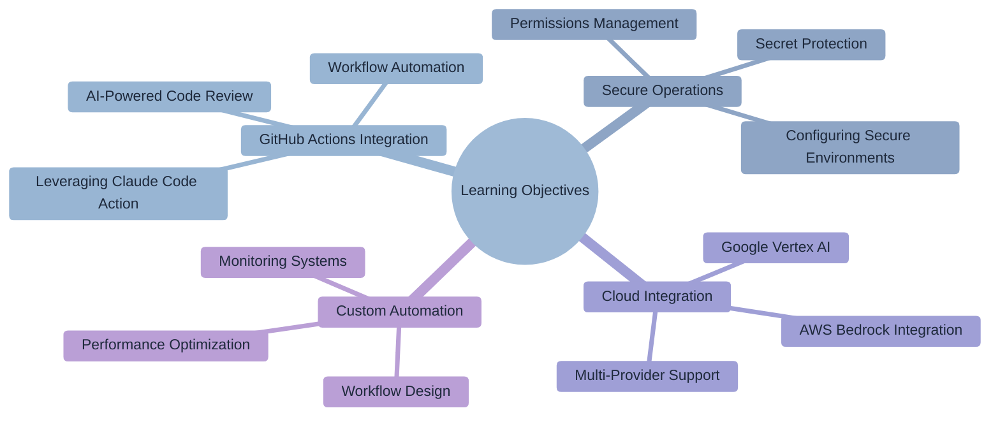
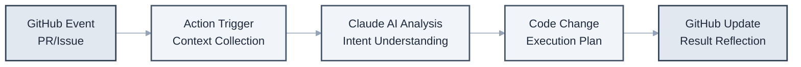
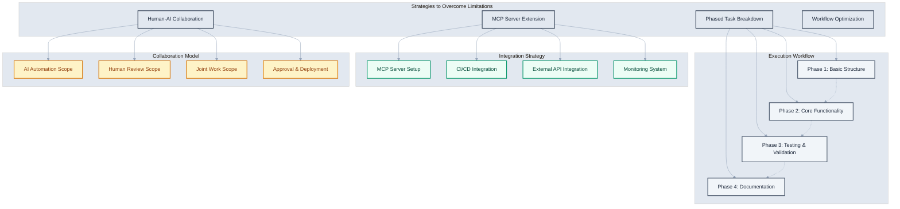
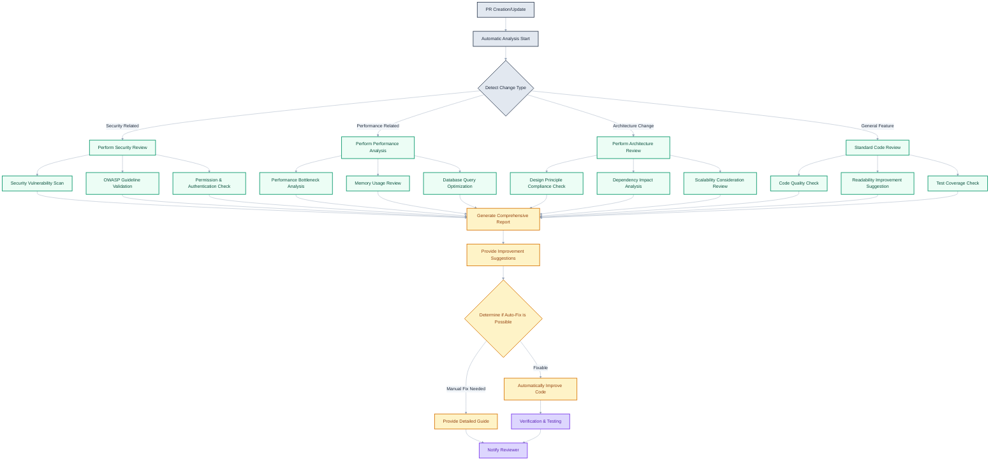
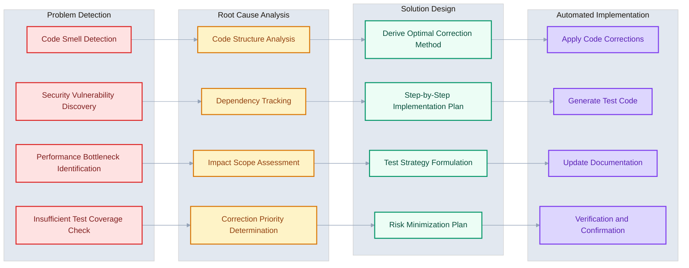
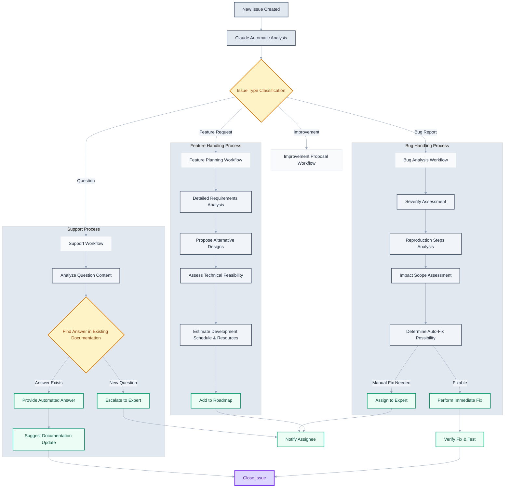
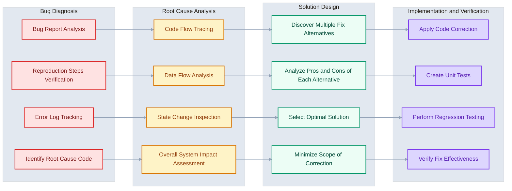

# Chapter 11: GitHub Actions and Claude Code Action

> "Automation frees developers from repetitive tasks, allowing them to focus on creative problem-solving." - DevOps Philosophy



## Learning Objectives

Upon completing this chapter, you will be able to:

- Build GitHub workflow automation using Claude Code Action.
- Automate AI-powered code reviews and improvements in pull requests and issues.
- Securely operate Claude Code in a security-conscious GitHub Actions environment.
- Integrate with various cloud providers (AWS Bedrock, Google Vertex AI).
- Design and optimize custom automation workflows.

## Overview

Continuous Integration and Deployment (CI/CD) have become essential in software development, and GitHub Actions is at the center of this automation. Claude Code Action integrates AI's intelligence into this ecosystem, revolutionizing the entire development process, from code reviews to automated fixes and documentation.

Claude Code Action is more than just an automation tool; it's an intelligent collaboration partner for development teams. Mentioning `@claude` in a Pull Request instantly analyzes the code, suggests improvements, and, if necessary, directly modifies the code and even creates commits. This allows developers to concentrate on higher-level architectural design and business logic.

## 11.1 Claude Code Action Overview and Architecture

Claude Code Action is an advanced automation platform that connects GitHub's event-driven system with Claude AI. It goes beyond simple code generation to understand context, provide context-aware solutions, and seamlessly integrate into a team's development workflow.

### Core Architecture and Operating Principles

Claude Code Action is an intelligent automation system that combines GitHub's webhook system with Claude AI's reasoning capabilities.



**System Components**

```bash
# System Architecture Analysis
claude "Explain the overall architecture of Claude Code Action.
Include the role and interaction of each stage in the entire pipeline,
from GitHub event processing to AI analysis, code changes, and result reflection."
```

### Intelligent Event Processing System

**Various GitHub Events and Trigger Patterns**

```yaml
# Comprehensive Event Handling Configuration
name: Claude AI Assistant - Enterprise
on:
  # Pull Request events
  pull_request:
    types: [opened, synchronize, reopened]
    paths:
      - 'src/**'
      - 'docs/**'
      - '*.md'

  # Comment-based interaction
  issue_comment:
    types: [created, edited]

  pull_request_review_comment:
    types: [created, edited]

  # Review process integration
  pull_request_review:
    types: [submitted, edited]

  # Issue management automation
  issues:
    types: [opened, assigned, labeled]

  # Scheduled tasks (e.g., weekly code audit)
  schedule:
    - cron: '0 9 * * 1'  # Every Monday at 9 AM

  # Manual execution support
  workflow_dispatch:
    inputs:
      action_type:
        description: 'Action type to perform'
        required: true
        default: 'code_review'
        type: choice
        options:
        - code_review
        - documentation_update
        - security_audit
        - performance_analysis
```

### Context-Aware AI Interaction

Claude Code Action goes beyond simple keyword matching to understand context and determine appropriate actions.

```bash
# Various Interaction Patterns
claude "Explain how to handle various requests in a Pull Request like the following:

Contextual Request Examples:
1. '@claude review this PR' - Full code review
2. '@claude improve the performance of this function' - Specific code optimization
3. '@claude increase test coverage' - Test code generation
4. '@claude find security vulnerabilities' - Security analysis
5. '@claude update the documentation' - Automatic documentation
6. '@claude fix this bug [screenshot]' - Image-based problem solving

Explain how Claude understands the context and decides on the appropriate action in each situation."
```

## 11.2 Capabilities and Limitations of Claude Code Action

To effectively use Claude Code Action, it's crucial to clearly understand what it can and cannot do. Based on this understanding, you can set appropriate expectations and optimize your workflows.

### What Claude Can Do

Claude Code Action can automate and support various development tasks.

```mermaid
%%{init: {"theme": "base", "themeVariables": {"primaryColor": "#f8fafc", "primaryTextColor": "#1e293b", "primaryBorderColor": "#e2e8f0", "lineColor": "#94a3b8", "secondaryColor": "#f1f5f9", "tertiaryColor": "#e2e8f0"}}}%%
graph TD
    A[Claude Code Action Capabilities] --> B[Code Analysis]
    A --> C[Code Implementation]
    A --> D[Branch Management]
    A --> E[Code Review]
    A --> F[Progress Tracking]

    B --> B1[Time Complexity Analysis]
    B --> B2[Security Vulnerability Check]
    B --> B3[Schema Normalization Assessment]

    C --> C1[Bug Fixing]
    C --> C2[Feature Implementation]
    C --> C3[Code Refactoring]
    C --> C4[Test Writing]
    C --> C5[Documentation]

    D --> D1[Issue → New Branch]
    D --> D2[Open PR → Direct Push]
    D --> D3[Closed PR → New Branch]

    E --> E1[Performance Analysis]
    E --> E2[Security Review]
    E --> E3[Readability Assessment]
    E --> E4[Impact Analysis]

    F --> F1[Real-time Updates]
    F --> F2[Checkbox Progress]
    F --> F3[Final Result Summary]

    classDef mainStyle fill:#e2e8f0,stroke:#334155,stroke-width:3px,color:#1e293b
    classDef categoryStyle fill:#f1f5f9,stroke:#475569,stroke-width:2px,color:#1e293b
    classDef itemStyle fill:#f8fafc,stroke:#94a3b8,stroke-width:1px,color:#64748b

    class A mainStyle
    class B,C,D,E,F categoryStyle
    class B1,B2,B3,C1,C2,C3,C4,C5,D1,D2,D3,E1,E2,E3,E4,F1,F2,F3 itemStyle
```



**1. Code Analysis and Question Answering**
```bash
# Code Analysis Request Examples
"@claude analyze the time complexity of this function and suggest optimization methods"
"@claude check for security vulnerabilities in this API endpoint"
"@claude assess the normalization level of this database schema"
```

**2. Code Modification and Implementation**

- From simple bug fixes to medium-scale feature implementation
- Refactoring and code improvement
- Test code writing
- Documentation and comment addition

```bash
# Implementation Request Examples
"@claude add error handling to this function"
"@claude migrate this component to TypeScript"
"@claude write unit tests for this API"
```

**3. Smart Branch Management**

- **Triggered from an issue**: Always creates a new branch
- **Triggered from an open PR**: Pushes directly to the existing PR branch
- **Triggered from a closed PR**: Creates a new branch (as the original is no longer active)

**4. Comprehensive Code Review**
```bash
# Review Request Examples
"@claude comprehensively review this PR. Check performance, security, and readability"
"@claude analyze the impact of these changes on the existing code"
```

**5. Single Comment Updates**

- Real-time updates on all task progress in a single comment
- Progress visualization with checkboxes
- Provision of final results and summary

### What Claude Cannot Do

For security and system stability, Claude Code Action has the following limitations:

```mermaid
%%{init: {"theme": "base", "themeVariables": {"primaryColor": "#f8fafc", "primaryTextColor": "#1e293b", "primaryBorderColor": "#e2e8f0", "lineColor": "#94a3b8", "secondaryColor": "#f1f5f9", "tertiaryColor": "#e2e8f0"}}}%%
graph TD
    A[Claude Code Action Limitations] --> B[GitHub System Restrictions]
    A --> C[Security Boundaries]
    A --> D[Execution Permission Limits]
    A --> E[Context Scope Limits]

    B --> B1[Cannot Approve PRs<br/>No approval authority for security reasons]
    B --> B2[Cannot Submit Official Reviews<br/>GitHub review system limitation]
    B --> B3[Cannot Create Multiple Comments<br/>Only single comment updates possible]

    C --> C1[Cannot Access Other Repositories<br/>Access only to the triggered repository]
    C --> C2[Cannot Access Organization Info<br/>Organization-wide permission restriction]
    C --> C3[External System Integration Restricted<br/>MCP server configuration required]

    D --> D1[Cannot Execute Arbitrary Commands<br/>`allowed_tools` must be specified]
    D --> D2[System-Level Changes Blocked<br/>Sensitive operations restricted]
    D --> D3[Cannot Force Push<br/>Git history protection]

    E --> E1[Cannot Access CI/CD Logs<br/>Separate integration setup needed]
    E --> E2[Build Status Check Limited<br/>Workaround via MCP needed]
    E --> E3[No Real-time Monitoring<br/>Snapshot-based operations]

    classDef limitStyle fill:#fee2e2,stroke:#dc2626,stroke-width:2px,color:#7f1d1d
    classDef categoryStyle fill:#f1f5f9,stroke:#475569,stroke-width:2px,color:#1e293b
    classDef mainStyle fill:#e2e8f0,stroke:#334155,stroke-width:3px,color:#1e293b

    class B1,B2,B3,C1,C2,C3,D1,D2,D3,E1,E2,E3 limitStyle
    class B,C,D,E categoryStyle
    class A mainStyle
```



**1. GitHub PR Review System Limitations**

- Cannot submit official GitHub PR reviews
- No PR approval authority (for security reasons)
- Cannot create multiple separate comments

```yaml
# These operations are not possible
- name: "Claude PR Approval"  # ❌ Not possible
- name: "Claude Review Submission"  # ❌ Not possible
```

**2. Context Scope Limitation**

- Work scope is limited to the triggered repository and PR/issue context
- Cannot access other repositories or external systems
- Cannot access organization-wide information

**3. Command Execution Limitation**

- Cannot execute arbitrary Bash commands by default
- Must be explicitly allowed via `allowed_tools` setting
- System-level changes or sensitive operations are blocked

```yaml
# Explicit permission required for command execution
- uses: anthropics/claude-code-action@beta
  with:
    allowed_tools: "Bash(npm install),Bash(npm test),Edit,Replace"
    disallowed_tools: "Bash(rm),Bash(sudo)"
```

**4. CI/CD System Integration Limitation**

- Cannot directly access build logs or test results
- Cannot check CI system status
- External system integration is limited without separate MCP server configuration

**5. Advanced Git Operation Limitation**

- Cannot perform complex Git operations like branch merging or rebasing
- Cannot manipulate branches beyond commit pushes
- Cannot modify Git history or force push

### Strategies to Overcome Limitations

These limitations can be overcome with creative workflow design.



**1. Phased Task Breakdown**
```bash
# Break down large tasks into smaller units
"@claude Phase 1: Implement only the basic structure first"
# After the first task is complete
"@claude Phase 2: Add error handling"
# After the second task is complete
"@claude Phase 3: Write test code"
```

**2. Feature Extension via MCP Server**
```yaml
# MCP server configuration for CI/CD integration
mcp_config: |
  {
    "mcpServers": {
      "ci-integration": {
        "command": "node",
        "args": ["./scripts/ci-mcp-server.js"],
        "env": {
          "CI_API_TOKEN": "${{ secrets.CI_API_TOKEN }}"
        }
      }
    }
  }
allowed_tools: "mcp__ci-integration__get-build-status,mcp__ci-integration__trigger-deployment"
```

**3. Human-AI Collaborative Workflow**
```bash
# Pattern where AI prepares and human finalizes
"@claude Prepare the PR. I'll do the final review."
"@claude Make the code changes, I'll deploy manually."
```

### Effective Usage Guidelines

**1. Write Clear Requests**
```bash
# ✅ Good example: Specific and clear request
"@claude add rate limiting to the user authentication API.
Limit to 5 login attempts per minute and implement using Redis."

# ❌ Bad example: Vague and broad request
"@claude improve security"
```

**2. Incremental Improvement Approach**
```bash
# 1st: Implement basic functionality
"@claude implement basic login functionality"

# 2nd: Enhance security
"@claude add 2FA to the login implemented just now"

# 3rd: Improve user experience
"@claude add user-friendly error messages for login failures"
```

**3. Provide Contextual Information**
```bash
# Include project context
"@claude This project uses React + TypeScript + Next.js.
Add a user profile editing feature. Utilize the existing UserService."
```

Understanding and appropriately utilizing these capabilities and limitations can significantly enhance development productivity through Claude Code Action.

## 11.3 Installation and Initial Setup

Systematic setup and security considerations are crucial for the successful adoption of Claude Code Action. Customized settings tailored to your organization's security policies and development workflows can ensure optimal performance and safety.

### Quick Start: Automated Setup via Claude CLI

The most efficient setup method is to use the Claude CLI's automatic installation feature.

```bash
# One-click setup via Claude CLI
claude "/install-github-app"

# This command automatically performs the following:
# 1. GitHub App permission settings
# 2. Repository secrets creation
# 3. Workflow file generation
# 4. Initial test execution
```

**Tasks Completed by Automated Setup**

```bash
# Detailed analysis of the automated setup process
claude "Explain step-by-step the tasks performed by the Claude CLI /install-github-app command.
- GitHub App permission request and approval process
- Automatic creation of Repository secrets
- Workflow file template selection and customization
- Initial testing and validation procedures
- Rollback and reset methods in case of issues"
```

### Manual Setup: Fine-grained Control for Enterprise Environments

For organizations with high security requirements or special configuration needs, manual setup allows for more detailed control.

**Step 1: GitHub App Installation and Permission Configuration**

```bash
# GitHub App permission analysis and optimization
claude "Analyze the permissions of the Claude Code GitHub App and propose settings based on the principle of least privilege.
Required Permissions:
- Pull requests: read & write
- Issues: read & write
- Contents: read & write
- Metadata: read

Security Considerations:
- Restrict access to sensitive files
- Configure protection for specific branches
- Apply organization-level policies
- Set up audit logs"
```

**Step 2: Repository Secrets Security Configuration**

```bash
# Advanced secret management strategy
claude "Establish a secret management strategy for Claude Code Action in an enterprise environment.
Include the following:

Secret Hierarchy:
- ANTHROPIC_API_KEY: Claude API access
- CUSTOM_API_KEYS: Integration with additional services
- ENVIRONMENT_VARS: Environment-specific settings

Security Best Practices:
- Secret rotation policy
- Minimization of access rights
- Audit trail setup
- Backup and recovery procedures
- Compliance requirements"
```

**Step 3: Workflow File Enterprise Template**

```yaml
# .github/workflows/claude-enterprise.yml
name: Claude AI Assistant - Enterprise Edition
on:
  issue_comment:
    types: [created]
  pull_request_review_comment:
    types: [created]
  issues:
    types: [opened, assigned]
  pull_request:
    types: [opened, synchronize]
    paths-ignore:
      - '**.md'
      - 'docs/**'
  schedule:
    - cron: '0 2 * * 1'  # Every Monday at 2 AM for regular checks

permissions:
  contents: write
  pull-requests: write
  issues: write
  id-token: write  # Permission for OIDC

jobs:
  security-check:
    runs-on: ubuntu-latest
    outputs:
      approved: ${{ steps.security.outputs.approved }}
    steps:
      - name: Security validation
        id: security
        run: |
          # Security policy check
          if [[ "${{ github.actor }}" == "dependabot[bot]" ]]; then
            echo "approved=false" >> $GITHUB_OUTPUT
            exit 0
          fi

          # Check allowed users/teams
          echo "approved=true" >> $GITHUB_OUTPUT

  claude-assistant:
    needs: security-check
    if: needs.security-check.outputs.approved == 'true'
    runs-on: ubuntu-latest
    environment: production  # Apply Environment protection rules

    steps:
      - name: Rate limiting check
        id: rate-limit
        run: |
          # API usage monitoring
          echo "Checking API usage limits..."

      - name: Claude Code Action
        uses: anthropics/claude-code-action@beta
        with:
          anthropic_api_key: ${{ secrets.ANTHROPIC_API_KEY }}

          # Enterprise settings
          timeout_minutes: 45
          model: "claude-3-5-sonnet-20241022" # Using a hypothetical future model name for illustration

          # Enhanced security settings
          allowed_tools: "Edit,Replace,GitLog,GitDiff"
          disallowed_tools: "Bash,WebFetch,FileDelete"

          # Custom instructions
          custom_instructions: |
            You must adhere to our organization's enterprise development standards.
            - All changes must include unit tests.
            - Security best practices must be applied.
            - Performance impact must be considered.
            - Code review guidelines must be followed.

          # Environment variables
          claude_env: |
            NODE_ENV: production
            CI: true
            SECURITY_SCAN: enabled

      - name: Post-action validation
        if: always()
        run: |
          echo "Validating action results..."
          # Result validation logic
```

### Multi-Environment Configuration and Deployment Strategy

**Configuration for Development/Staging/Production Environments**

```bash
# Environment-specific configuration strategy
claude "Develop a strategy for operating Claude Code Action in multiple environments (dev/staging/prod).
Characteristics of each environment:

Development Environment:
- Allow rapid feedback and experimentation
- Permissive rights and tool access
- Detailed logging and debugging information

Staging Environment:
- Constraints similar to production
- Performance and security testing
- Support for user acceptance testing

Production Environment:
- Highest level of security and stability
- Least privilege and strict validation
- Comprehensive monitoring and alerting

Also include methods for managing and synchronizing configurations between environments."
```

## 11.4 Pull Request Automation

Pull Requests are key points for code quality and team collaboration. PR automation through Claude Code Action acts as an intelligent development assistant beyond simple code review, enhancing both development efficiency and code quality.

### Intelligent Code Review System

Claude Code Action is an advanced code reviewer that understands context and provides meaningful feedback.



**Comprehensive Code Analysis and Review**

```bash
# Multi-dimensional code review request
"@claude Review this PR comprehensively. Consider all the following perspectives:
- Code quality and readability
- Performance and memory efficiency
- Security vulnerabilities and risk factors
- Architectural consistency and design principles
- Test coverage and quality
- Documentation completeness
- Compliance with team coding standards

Provide specific improvement suggestions and priorities for each area."
```

**Specialized Review Request Patterns**

```bash
# Performance-focused review
"@claude Analyze the performance impact of this PR.
Focus particularly on database queries, memory usage,
and the impact on user experience."

# Security-focused review
"@claude Review this PR from a security perspective.
Check OWASP Top 10, input validation, authorization,
and data exposure risks."

# Architecture review
"@claude Analyze the impact of these changes on the overall system architecture.
Consider dependency changes, coupling, and scalability."
```

### Automated Code Improvement and Correction

Claude can go beyond finding problems to implementing solutions directly.



**Requests for Immediately Applicable Corrections**

```bash
# Error handling improvement
"@claude Add comprehensive error handling to this function.
Include try-catch blocks, meaningful error messages,
and appropriate logging."

# Performance optimization
"@claude Optimize this data processing logic.
Reduce memory usage and improve processing speed."

# Test code generation
"@claude Write unit tests and integration tests for this new feature.
Include edge cases and error scenarios."

# Automated documentation generation
"@claude Generate OpenAPI documentation for these API endpoints
and update the README."
```

### Advanced Automation Workflows

**Conditional Execution and Smart Triggers**

```yaml
# Advanced PR Automation Workflow
name: Intelligent PR Processing
on:
  pull_request:
    types: [opened, synchronize]

jobs:
  smart-analysis:
    runs-on: ubuntu-latest
    outputs:
      requires_security_review: ${{ steps.analysis.outputs.security }}
      requires_performance_review: ${{ steps.analysis.outputs.performance }}
      complexity_score: ${{ steps.analysis.outputs.complexity }}

    steps:
      - uses: actions/checkout@v4
        with:
          fetch-depth: 0 # Required to compare with HEAD^

      - name: Analyze PR complexity
        id: analysis
        run: |
          # Analyze changed files
          FILES_CHANGED=$(git diff --name-only HEAD^ HEAD | wc -l)
          LINES_CHANGED=$(git diff --stat HEAD^ HEAD | tail -1 | awk '{print $4+$6}') # Sum of added and deleted lines

          # Detect changes in security-related files
          SECURITY_FILES=$(git diff --name-only HEAD^ HEAD | grep -E "(auth|security|login|password)" | wc -l)

          # Detect changes in performance-critical files
          PERFORMANCE_FILES=$(git diff --name-only HEAD^ HEAD | grep -E "(query|database|cache|index)" | wc -l)

          echo "security=$([[ $SECURITY_FILES -gt 0 ]] && echo true || echo false)" >> $GITHUB_OUTPUT
          echo "performance=$([[ $PERFORMANCE_FILES -gt 0 ]] && echo true || echo false)" >> $GITHUB_OUTPUT
          echo "complexity=$(( FILES_CHANGED * 10 + LINES_CHANGED / 10 ))" >> $GITHUB_OUTPUT

  security-review:
    needs: smart-analysis
    if: needs.smart-analysis.outputs.requires_security_review == 'true'
    runs-on: ubuntu-latest
    steps:
      - uses: anthropics/claude-code-action@beta
        with:
          anthropic_api_key: ${{ secrets.ANTHROPIC_API_KEY }}
          direct_prompt: |
            Security-related changes have been detected in this PR.
            Please perform a comprehensive security review:

            1. Validate authentication and authorization logic.
            2. Check input validation and SQL injection prevention.
            3. Assess data exposure and information leakage risks.
            4. Review the appropriateness of encryption and hashing.
            5. Verify compliance with security best practices.

            Please fix any identified issues immediately.

  performance-review:
    needs: smart-analysis
    if: needs.smart-analysis.outputs.requires_performance_review == 'true'
    runs-on: ubuntu-latest
    steps:
      - uses: anthropics/claude-code-action@beta
        with:
          anthropic_api_key: ${{ secrets.ANTHROPIC_API_KEY }}
          direct_prompt: |
            Changes that may affect performance have been detected in this PR.
            Please perform performance analysis and optimization:

            1. Analyze database query efficiency.
            2. Evaluate algorithm complexity.
            3. Review memory usage patterns.
            4. Suggest improvements to caching strategies.
            5. Identify and resolve bottlenecks.

            Please provide optimized code along with performance benchmarks.

  comprehensive-review:
    needs: smart-analysis
    if: needs.smart-analysis.outputs.complexity_score > 100 # Example threshold
    runs-on: ubuntu-latest
    steps:
      - uses: anthropics/claude-code-action@beta
        with:
          anthropic_api_key: ${{ secrets.ANTHROPIC_API_KEY }}
          custom_instructions: |
            This is a complex PR (complexity: ${{ needs.smart-analysis.outputs.complexity_score }}).
            A particularly careful review is required.
          direct_prompt: |
            Please comprehensively review this PR, which includes complex changes.

            Priority Analysis:
            1. Impact of architectural changes on the system.
            2. Maintaining compatibility with existing features.
            3. Adequacy of test coverage.
            4. Need for documentation updates.
            5. Proposal for a phased deployment strategy.

            Point out high-risk changes separately and
            suggest mitigation measures.
```

### Automation for Enhanced Team Collaboration

**Mention-Based Expert Review Requests**

```bash
# Automatically mention reviewers by area of expertise
"@claude review this database schema change and
automatically mention @database-team."

# Cross-team impact analysis
"@claude analyze the impact of this API change on other teams and
send notifications to the affected teams."

# Documentation collaboration
"@claude find the parts that need documentation updates due to this feature change and
send an update request to @docs-team."
```

## 11.5 Issue Management Automation

GitHub Issues are central to project management and bug tracking. Issue automation through Claude Code Action accelerates the problem-solving process, provides consistently high-quality solutions, and significantly improves team productivity.

### Intelligent Issue Classification and Routing

Claude can analyze issue content to automatically classify it and assign it to the appropriate person.



**Automated Issue Analysis and Classification**

```yaml
# Automated Issue Handling Workflow
name: Intelligent Issue Management
on:
  issues:
    types: [opened, edited]

jobs:
  issue-analysis:
    runs-on: ubuntu-latest
    steps:
      - uses: anthropics/claude-code-action@beta
        with:
          anthropic_api_key: ${{ secrets.ANTHROPIC_API_KEY }}
          assignee_trigger: "claude-assistant" # Example: assign if 'claude-assistant' is mentioned or assigned
          direct_prompt: |
            Analyze the new issue and perform the following tasks:

            1. Classify the issue (Bug, Feature Request, Improvement, Question).
            2. Assess severity (Critical, High, Medium, Low).
            3. Estimate the time required.
            4. Identify relevant tech stack and components.
            5. Add appropriate labels.
            6. Recommend a responsible team or developer.

            Add the analysis results as a comment to the issue,
            and set appropriate labels and milestones.
```

**Automated Bug Report Enhancement**

```bash
# Improve incomplete bug report
"@claude Analyze this bug report and find missing information.
Systematically organize reproduction steps, expected behavior, actual behavior, environment information, etc.,
to complete the template."

# Screenshot-based bug analysis
"@claude Analyze the attached screenshot and identify possible causes.
Find relevant code files and suggest a fix."
```

### Automated Bug Fixing and Resolution

Claude can go beyond simply analyzing issues to implementing solutions directly.



**Handling Immediately Fixable Bugs**

```bash
# Specific bug fix request
"@claude Fix the bug where user sessions sometimes expire upon login.
Find the relevant code, diagnose the problem, and generate a patch."

# Performance issue resolution
"@claude Resolve the issue of slow loading on the main page.
Find the bottleneck, optimize it, and include performance test results."

# Compatibility issue resolution
"@claude Resolve the issue causing deprecated warnings in the new React version.
Migrate all components to the latest API."
```

### Feature Request Processing Automation

**Requirements Analysis and Implementation Planning**

```bash
# Feature request analysis
"@claude Analyze this feature request and provide the following:
1. Write a requirements specification document.
2. Review technical implementation methods.
3. Estimate development time and resources.
4. Analyze system impact.
5. Create a phased implementation plan."

# Prototype generation
"@claude Create a prototype for the requested feature.
Implement the basic structure and core logic,
and specify areas requiring further development."
```

### Issue Template Automation

**Dynamic Issue Template Generation**

```yaml
# Context-aware Issue Template
name: Smart Issue Templates
on:
  issues:
    types: [opened]

jobs:
  template-enhancement:
    if: contains(github.event.issue.body, 'bug') || contains(github.event.issue.title, 'bug') # Basic check for bug reports
    runs-on: ubuntu-latest
    steps:
      - uses: anthropics/claude-code-action@beta
        with:
          anthropic_api_key: ${{ secrets.ANTHROPIC_API_KEY }}
          direct_prompt: |
            This issue appears to be a bug report.
            Please supplement the information to match the standard bug report template:

            ## Bug Description
            [Brief and clear description]

            ## Reproduction Steps
            1. ...
            2. ...
            3. ...

            ## Expected Behavior
            [Describe what should happen]

            ## Actual Behavior
            [Describe what actually happens]

            ## Environment Information
            - OS:
            - Browser:
            - Version:

            ## Additional Context
            [Screenshots, logs, other useful information]

            Analyze the existing content and automatically fill in the missing parts.
```

## 11.6 Security and Permission Management

Thorough security design and permission management are essential for operating Claude Code Action safely. Especially in enterprise environments, protecting sensitive data, access control, and audit trails are critical requirements.

### API Key Security and Secret Management

**Layered Secret Management Strategy**

```bash
# Enterprise secret management strategy
claude "Design a comprehensive secret management strategy for Claude Code Action.
Include the following elements:

Secret Hierarchy Structure:
- Organization level secrets (Enterprise-wide common)
- Repository level secrets (Per-project)
- Environment level secrets (Per-environment)

Security Best Practices:
- Secret rotation policy (30-90 days)
- Principle of least privilege for access
- Encryption and transport security
- Audit logs and monitoring
- Incident response procedures

Regulatory Compliance:
- SOC 2 Type II requirements
- GDPR personal data protection
- HIPAA healthcare regulations
- Industry-specific special requirements"
```

**API Key Security Enhancement**

```yaml
# Advanced secret security configuration
name: Secure Claude Action
on:
  issue_comment:
    types: [created]

jobs:
  security-validation:
    runs-on: ubuntu-latest
    environment: production # Example: environment with stricter rules
    steps:
      - name: API Key Validation
        env:
          ANTHROPIC_API_KEY: ${{ secrets.ANTHROPIC_API_KEY }}
        run: |
          # API key format validation
          if [[ ! "$ANTHROPIC_API_KEY" =~ ^sk-ant-api03- ]]; then # Example format
            echo "Invalid API key format"
            exit 1
          fi

          # API key activation status check (example, actual endpoint may vary)
          response=$(curl -s -H "x-api-key: $ANTHROPIC_API_KEY" \
                     https://api.anthropic.com/v1/models) # Example API call
          if [[ $? -ne 0 ]]; then # Check if curl command failed
            echo "API key validation failed"
            exit 1
          fi

      - name: Rate Limiting Check
        run: |
          # API usage monitoring
          echo "Checking current API usage..."
          # Abort if usage exceeds threshold

      - name: Security Context Validation
        run: |
          # Requester permission check
          if [[ "${{ github.actor }}" == "dependabot[bot]" ]]; then # Example: disallow bot users
            echo "Bot users not allowed"
            exit 1
          fi

          # Detect sensitive file changes (example)
          # This requires checking out the code and diffing
          # if git diff --name-only origin/${{ github.base_ref }}...origin/${{ github.head_ref }} | grep -E "(secrets|keys|config)" > /dev/null; then
          #   echo "Sensitive files detected - additional approval required"
          #   # Trigger additional approval process
          # fi
          echo "Security context validation placeholder"


      - uses: anthropics/claude-code-action@beta
        with:
          anthropic_api_key: ${{ secrets.ANTHROPIC_API_KEY }}
          timeout_minutes: 30  # Execution time limit
          disallowed_tools: "WebFetch,FileDelete,Bash(rm),Bash(curl)" # Example disallowed tools
```

### Access Control and Least Privilege

**Fine-grained Permission Control System**

```bash
# Role-Based Access Control (RBAC) design
claude "Design an RBAC system for Claude Code Action.
Define the following roles and permissions:

Role Definitions:
- Admin: Manages overall settings and secrets
- Senior Developer: Full code change permissions
- Developer: Limited code change permissions
- Reviewer: Read-only review permissions
- External Contributor: Minimal interaction

Permission Matrix:
- File read/write permissions
- Branch-specific access control
- Protection of sensitive directories
- System command execution rights
- External API call rights

Implementation Methods:
- GitHub Team-based permission mapping
- Dynamic permission validation logic
- Automatic audit log generation
- Permission escalation process"
```

**Protection of Sensitive Files and Data**

```yaml
# Sensitive data protection settings
- uses: anthropics/claude-code-action@beta
  with:
    anthropic_api_key: ${{ secrets.ANTHROPIC_API_KEY }}

    # Disallowed file access patterns
    disallowed_paths: |
      - "**/.env*"
      - "**/secrets/**"
      - "**/keys/**"
      - "**/*password*"
      - "**/*secret*"
      - "**/config/production.yaml"

    # Use only allowed tools
    allowed_tools: "Edit,Replace,GitLog,GitDiff" # Example allowed tools
    disallowed_tools: "Bash,WebFetch,FileDelete,NetworkAccess" # Example disallowed tools

    # Custom security instructions
    custom_instructions: |
      Security Guidelines:
      1. Never hardcode secrets or passwords in the code.
      2. All external input must be validated.
      3. Do not log sensitive information.
      4. Security-related changes require separate approval.
      5. Manage database connection information only through environment variables.
```

### Auditing and Monitoring

**Comprehensive Audit Trail System**

```bash
# Audit log system design
claude "Design an audit system to track all activities of Claude Code Action.
Include the following elements:

Log Collection Targets:
- All API calls and responses
- File changes and commit history
- Permission requests and approvals/denials
- Errors and exception situations
- Performance and resource usage

Log Format and Structure:
- Structured JSON logs
- Timestamps and correlation IDs
- User and action context
- Business impact classification
- Security event marking

Storage and Analysis:
- Centralized log collection (e.g., ELK Stack)
- Real-time alerts and dashboards
- Automatic detection of anomalous patterns
- Compliance reporting
- Long-term retention policy"
```

**Real-time Security Monitoring**

```yaml
# Security Monitoring Workflow
name: Security Monitoring
on:
  workflow_run:
    workflows: ["Claude AI Assistant"] # Name of the main Claude workflow
    types: [completed]

jobs:
  security-audit:
    runs-on: ubuntu-latest
    steps:
      - name: Audit Log Collection
        # This step would ideally download artifacts or use an API to get logs
        run: |
          # Collect Claude Action execution logs (placeholder)
          echo "Collecting audit logs..."

          # Security event detection (example: search for keywords in logs)
          # Actual log content and path will depend on how Claude Code Action outputs logs
          # if grep -i "security\|password\|secret" workflow_logs.txt; then # Assuming logs are in workflow_logs.txt
          #  echo "Security-related activity detected"
          #  # Send alert
          # fi
          echo "Security audit placeholder"

      - name: Anomaly Detection
        run: |
          # Detect anomalous patterns (placeholder)
          # - Unusually large number of file changes
          # - Attempts to access sensitive files
          # - Activity at unusual times
          echo "Anomaly detection placeholder"

      - name: Compliance Reporting
        run: |
          # Generate compliance report (placeholder)
          echo "Generating compliance report..."
```

## 11.7 Multi-Cloud Environment Configuration

In modern enterprise environments, flexible infrastructure using various cloud providers is important. Claude Code Action supports access not only through the direct Anthropic API but also via AWS Bedrock and Google Vertex AI, enabling optimal deployment tailored to an organization's cloud strategy.

### AWS Bedrock Integration

Accessing Claude via AWS Bedrock allows leveraging AWS's security and compliance features.

**OIDC-based Bedrock Configuration**

```yaml
# Claude Code Action via AWS Bedrock
name: Claude via AWS Bedrock
on:
  issue_comment:
    types: [created]
  pull_request_review_comment:
    types: [created]

permissions:
  id-token: write  # Required for OIDC token generation
  contents: write
  pull-requests: write
  issues: write

jobs:
  claude-bedrock:
    runs-on: ubuntu-latest
    environment: production # Example environment

    steps:
      - name: Configure AWS Credentials (OIDC)
        uses: aws-actions/configure-aws-credentials@v4
        with:
          role-to-assume: ${{ secrets.AWS_ROLE_TO_ASSUME }} # ARN of the IAM role
          role-session-name: claude-code-action
          aws-region: us-west-2 # Example region

      - name: Validate AWS Permissions
        run: |
          # Verify Bedrock access permissions (example commands)
          aws bedrock list-foundation-models --region us-west-2

          # Verify cross-region inference permissions (if applicable)
          # aws bedrock list-inference-profiles --region us-west-2
          echo "AWS permission validation placeholder"

      - name: Generate GitHub App Token
        id: app-token
        uses: actions/create-github-app-token@v2 # Ensure this action version is current
        with:
          app-id: ${{ secrets.APP_ID }}
          private-key: ${{ secrets.APP_PRIVATE_KEY }}

      - uses: anthropics/claude-code-action@beta
        with:
          github_token: ${{ steps.app-token.outputs.token }}
          model: "anthropic.claude-3-7-sonnet-20250219-beta:0"  # Example model, ensure it's a valid Bedrock model ID. The date part is hypothetical.
          use_bedrock: "true"
          timeout_minutes: 45

          custom_instructions: |
            Running in AWS Bedrock environment.
            Please apply the following AWS-specific considerations:
            - Adhere to AWS security best practices.
            - Consider CloudTrail logging.
            - Be aware of VPC network policies.
            - Apply AWS resource tagging standards.
```

**AWS IAM Role and Policy Configuration**

```bash
# AWS IAM configuration optimization
claude "Optimize AWS IAM settings for Claude Code Action.
Include the following:

IAM Role Definition:
- OIDC trust relationship for GitHub Actions
- Bedrock model access permissions
- CloudWatch logging permissions
- Application of the principle of least privilege

Enhanced Security Settings:
- Conditional access control
- Resource-based policies
- Time-based access restrictions
- IP address whitelisting

Cross-region inference settings (if applicable):
- Access to multi-region models
- Latency optimization
- Availability enhancement strategy
- Cost optimization considerations"
```

### Google Vertex AI Integration

Configuration for accessing Claude via Google Cloud's AI/ML platform, Vertex AI.

**Vertex AI OIDC Configuration**

```yaml
# Claude Code Action via Google Vertex AI
name: Claude via Google Vertex AI
on:
  issue_comment:
    types: [created]
  pull_request_review_comment:
    types: [created]

permissions:
  id-token: write  # Required for OIDC token generation
  contents: write
  pull-requests: write
  issues: write

jobs:
  claude-vertex:
    runs-on: ubuntu-latest
    environment: production # Example environment

    steps:
      - name: Authenticate to Google Cloud
        uses: google-github-actions/auth@v2 # Ensure this action version is current
        with:
          workload_identity_provider: ${{ secrets.GCP_WORKLOAD_IDENTITY_PROVIDER }} # e.g., projects/123/locations/global/workloadIdentityPools/my-pool/providers/my-provider
          service_account: ${{ secrets.GCP_SERVICE_ACCOUNT }} # e.g., my-service-account@my-project.iam.gserviceaccount.com

      - name: Set up Cloud SDK
        uses: google-github-actions/setup-gcloud@v2 # Ensure this action version is current

      - name: Validate GCP Permissions
        run: |
          # Verify Vertex AI access permissions (example commands)
          gcloud ai models list --region=us-central1

          # Verify project settings
          gcloud config list project

      - name: Generate GitHub App Token
        id: app-token
        uses: actions/create-github-app-token@v2 # Ensure this action version is current
        with:
          app-id: ${{ secrets.APP_ID }}
          private-key: ${{ secrets.APP_PRIVATE_KEY }}

      - uses: anthropics/claude-code-action@beta
        with:
          github_token: ${{ steps.app-token.outputs.token }}
          model: "claude-3-7-sonnet@20250219" # Example model, ensure it's a valid Vertex AI model ID. The date part is hypothetical.
          use_vertex: "true"
          timeout_minutes: 45

          custom_instructions: |
            Running in Google Vertex AI environment.
            Please apply the following GCP-specific considerations:
            - Adhere to Google Cloud security best practices.
            - Be aware of Cloud Audit Logs.
            - Consider VPC and firewall policies.
            - Apply Google Cloud resource labeling standards.
```

### Multi-Cloud Strategy and Failover

**Intelligent Cloud Selection and Failover Measures**

```bash
# Multi-cloud architecture design
claude "Design a multi-cloud strategy for Claude Code Action.
Include the following elements:

Cloud Selection Criteria:
- Regional availability and latency
- Cost efficiency and budget management
- Compliance requirements
- Performance and throughput characteristics
- Disaster recovery capabilities

Failover Scenarios:
- Primary: Direct Anthropic API
- Secondary: AWS Bedrock (if primary fails)
- Tertiary: Google Vertex AI (if both fail)

Automatic Switchover Logic:
- Status monitoring and health checks
- Intelligent routing algorithms
- Performance-based dynamic selection
- Cost optimization considerations
- User experience priority"
```

**Dynamic Cloud Selection Workflow**

```yaml
# Intelligent Cloud Selection System
name: Smart Cloud Selection
on:
  issue_comment:
    types: [created]

jobs:
  cloud-selection:
    runs-on: ubuntu-latest
    outputs:
      selected_cloud: ${{ steps.selector.outputs.cloud }}

    steps:
      - name: Cloud Status Check
        id: selector
        run: |
          # Check status of each cloud service (example URLs/methods, actual checks will vary)
          ANTHROPIC_STATUS=$(curl -s https://status.anthropic.com/api/v2/status.json | jq -r '.status.indicator') # "none" means operational
          # For AWS and GCP, checking specific service health is more complex and might involve API calls or parsing status pages.
          # The following are simplified placeholders.
          AWS_STATUS=$(curl -s https://status.aws.amazon.com/ | grep -c "Bedrock is operating normally" || echo 0) # Highly simplified
          GCP_STATUS=$(curl -s https://status.cloud.google.com/ | grep -c "Vertex AI is operating normally" || echo 0) # Highly simplified

          # Measure latency to regional endpoints (example)
          ANTHROPIC_LATENCY=$(curl -w "%{time_total}" -s -o /dev/null https://api.anthropic.com/v1/models || echo 999)

          # Cost considerations (e.g., time-of-day pricing differences - hypothetical)
          HOUR=$(date +%H)
          if [[ $HOUR -ge 9 && $HOUR -le 17 ]]; then
            COST_FACTOR="peak"
          else
            COST_FACTOR="off-peak"
          fi

          # Intelligent selection logic (example)
          if [[ "$ANTHROPIC_STATUS" == "none" && $(echo "$ANTHROPIC_LATENCY < 2.0" | bc -l) -eq 1 ]]; then # Assuming latency is in seconds
            echo "cloud=anthropic" >> $GITHUB_OUTPUT
          elif [[ $AWS_STATUS -gt 0 ]]; then # If "Bedrock is operating normally" is found
            echo "cloud=bedrock" >> $GITHUB_OUTPUT
          elif [[ $GCP_STATUS -gt 0 ]]; then # If "Vertex AI is operating normally" is found
            echo "cloud=vertex" >> $GITHUB_OUTPUT
          else
            echo "cloud=anthropic" >> $GITHUB_OUTPUT  # Fallback
          fi

  claude-anthropic:
    needs: cloud-selection
    if: needs.cloud-selection.outputs.selected_cloud == 'anthropic'
    runs-on: ubuntu-latest
    steps:
      - uses: anthropics/claude-code-action@beta
        with:
          anthropic_api_key: ${{ secrets.ANTHROPIC_API_KEY }}
          # ... other parameters

  claude-bedrock:
    needs: cloud-selection
    if: needs.cloud-selection.outputs.selected_cloud == 'bedrock'
    runs-on: ubuntu-latest
    steps:
      - name: Configure AWS Credentials
        uses: aws-actions/configure-aws-credentials@v4
        with:
          role-to-assume: ${{ secrets.AWS_ROLE_TO_ASSUME }}
          aws-region: us-west-2 # Example region

      - uses: anthropics/claude-code-action@beta
        with:
          model: "anthropic.claude-3-7-sonnet-20250219-beta:0" # Example Bedrock model ID
          use_bedrock: "true"
          # ... other parameters

  claude-vertex:
    needs: cloud-selection
    if: needs.cloud-selection.outputs.selected_cloud == 'vertex'
    runs-on: ubuntu-latest
    steps:
      - name: Authenticate to Google Cloud
        uses: google-github-actions/auth@v2
        with:
          workload_identity_provider: ${{ secrets.GCP_WORKLOAD_IDENTITY_PROVIDER }}
          service_account: ${{ secrets.GCP_SERVICE_ACCOUNT }}

      - uses: anthropics/claude-code-action@beta
        with:
          model: "claude-3-7-sonnet@20250219" # Example Vertex AI model ID
          use_vertex: "true"
          # ... other parameters
```

## 11.8 Advanced Customization

The true value of Claude Code Action is realized through in-depth customization tailored to an organization's specific needs. By integrating MCP (Model Context Protocol) servers, developing custom tools, and optimizing organization-specific workflows, Claude can be transformed into a dedicated AI assistant for your team.

### MCP Server Integration and Extension

MCP (Model Context Protocol) is a standardized way to extend Claude's capabilities. Integrating with an organization's internal systems, databases, and APIs allows Claude to work with richer context.

**Basic MCP Server Integration**

```yaml
# Sequential Thinking MCP server integration
- uses: anthropics/claude-code-action@beta
  with:
    anthropic_api_key: ${{ secrets.ANTHROPIC_API_KEY }}
    mcp_config: |
      {
        "mcpServers": {
          "sequential-thinking": {
            "command": "npx",
            "args": [
              "-y", # Assume yes to prompts
              "@modelcontextprotocol/server-sequential-thinking" # Example package
            ]
          }
        }
      }
    allowed_tools: "mcp__sequential-thinking__sequentialthinking" # Example tool name
```

**Advanced MCP Server Configuration - Internal System Integration**

```bash
# Organization-specific MCP server design
claude "Design custom MCP servers for our organization.
Integration with the following systems is required:

Internal System Integration:
- JIRA API: Issue tracking and project management
- Confluence: Access to documentation and knowledge base
- Slack API: Team communication and notifications
- Jenkins: CI/CD pipeline status
- DataDog: Monitoring and performance metrics

External Service Integration:
- AWS API: Infrastructure status and resource management
- Kubernetes API: Container orchestration
- Database connections: Schema information and query execution
- Security scanners: Vulnerability scan results

Include implementation methods and security settings for each MCP server."
```

**Enterprise MCP Server Configuration Example**

```yaml
# Comprehensive MCP server configuration
- uses: anthropics/claude-code-action@beta
  with:
    anthropic_api_key: ${{ secrets.ANTHROPIC_API_KEY }}
    mcp_config: |
      {
        "mcpServers": {
          "jira-integration": {
            "command": "node",
            "args": ["./scripts/mcp-jira-server.js"], # Path to your custom MCP server script
            "env": {
              "JIRA_URL": "${{ secrets.JIRA_URL }}",
              "JIRA_TOKEN": "${{ secrets.JIRA_TOKEN }}",
              "JIRA_PROJECT_KEY": "${{ vars.JIRA_PROJECT_KEY }}" # Using GitHub variables
            }
          },
          "database-inspector": {
            "command": "python",
            "args": ["./scripts/mcp-db-server.py"], # Path to your custom MCP server script
            "env": {
              "DB_CONNECTION_STRING": "${{ secrets.DB_READ_ONLY_CONNECTION }}",
              "DB_TYPE": "postgresql"
            }
          },
          "security-scanner": {
            "command": "npx", # Assuming a published package
            "args": ["-y", "@company/security-mcp-server"], # Example company-specific package
            "env": {
              "SCANNER_API_KEY": "${{ secrets.SECURITY_SCANNER_API_KEY }}",
              "SCAN_LEVEL": "comprehensive"
            }
          },
          "monitoring-integration": {
            "command": "node",
            "args": ["./scripts/mcp-monitoring-server.js"], # Path to custom script
            "env": {
              "DATADOG_API_KEY": "${{ secrets.DATADOG_API_KEY }}",
              "GRAFANA_URL": "${{ secrets.GRAFANA_URL }}",
              "GRAFANA_TOKEN": "${{ secrets.GRAFANA_TOKEN }}"
            }
          }
        }
      }
    allowed_tools: | # Example tool names, must match what MCP servers expose
      mcp__jira-integration__create-issue,
      mcp__jira-integration__update-issue,
      mcp__jira-integration__search-issues,
      mcp__database-inspector__query-schema,
      mcp__database-inspector__explain-query,
      mcp__security-scanner__scan-code,
      mcp__security-scanner__check-vulnerabilities,
      mcp__monitoring-integration__get-metrics,
      mcp__monitoring-integration__create-alert
```

### Organization-Specific Custom Tool Development

**Code Quality Check Tool**

```bash
# Organization-specific code quality tool
claude "Create a custom tool to automatically check our team's coding standards.
Include the following checks:

Coding Standard Checks:
- Function naming conventions (camelCase, starts with a verb)
- File structure rules (feature/component-based)
- Comment writing rules (JSDoc, docstring)
- Error handling pattern consistency
- Logging format standardization

Performance Checks:
- Memory leak pattern detection
- Inefficient loops and queries
- Unnecessary rendering detection
- Bundle size optimization opportunities

Security Checks:
- Hardcoded secret detection
- SQL injection vulnerabilities
- XSS attack vectors
- Missing authorization"
```

**Automated Documentation Tool**

```yaml
# Custom documentation automation
- uses: anthropics/claude-code-action@beta
  with:
    anthropic_api_key: ${{ secrets.ANTHROPIC_API_KEY }}
    custom_instructions: |
      You are a documentation specialist for our organization.
      Please adhere to the following documentation standards:

      API Documentation:
      - Comply with OpenAPI 3.0 specification.
      - Include request/response examples.
      - Explain error codes and messages.
      - Version management information.

      Code Documentation:
      - JSDoc/docstring for each function.
      - Inline comments for complex logic.
      - README updates.
      - Architecture diagrams.

      User Documentation:
      - Installation and setup guides.
      - Usage examples and tutorials.
      - Troubleshooting guides.
      - FAQ section.
    allowed_tools: | # Example tool names
      Edit,Replace,GitLog,GitDiff,
      mcp__docs-generator__create-api-docs,
      mcp__docs-generator__update-readme,
      mcp__docs-generator__generate-diagrams
```

### Workflow Optimization and Automation

**Intelligent Workflow Routing**

```bash
# Context-based workflow automation
claude "Create a system that analyzes PR content to automatically select the appropriate workflow.
Use the following classification criteria:

Change Type Analysis:
- Feature addition (feature): Implementation of new functionality
- Bug fix (bugfix): Correction of errors in existing functionality
- Refactoring (refactor): Improvement of code structure
- Documentation (docs): Document updates
- Configuration (config): Changes to configuration files
- Test (test): Test code related

Impact Analysis:
- Critical: Changes to core business logic
- High: Direct impact on user experience
- Medium: Internal logic improvements
- Low: Document or comment updates

Automated workflow for each classification:
- Automatically assign necessary reviewers.
- Select appropriate test strategies.
- Determine deployment approval processes.
- Set monitoring levels."
```

**Dynamic Quality Gates**

```yaml
# Intelligent Quality Gate System
name: Adaptive Quality Gates
on:
  pull_request:
    types: [opened, synchronize]

jobs:
  analyze-changes:
    runs-on: ubuntu-latest
    outputs:
      risk_level: ${{ steps.analysis.outputs.risk_level }}
      test_strategy: ${{ steps.analysis.outputs.test_strategy }}
      review_requirements: ${{ steps.analysis.outputs.review_requirements }}

    steps:
      - uses: actions/checkout@v4
        with:
          fetch-depth: 0 # Required for diffing against base

      - uses: anthropics/claude-code-action@beta
        id: analysis
        with:
          anthropic_api_key: ${{ secrets.ANTHROPIC_API_KEY }}
          direct_prompt: |
            Analyze the changes in this PR and determine the following:

            1. Risk assessment (low/medium/high/critical).
            2. Required test strategy (unit/integration/e2e/performance).
            3. Review requirements (standard/senior/architect/security).

            Analysis Criteria:
            - Number and importance of changed files.
            - Whether business logic was changed.
            - Security-related code modifications.
            - Database schema changes.
            - API interface changes.
            - Changes that could affect performance.

            Set the results in GitHub Actions output in the following format:
            echo "risk_level=medium" >> $GITHUB_OUTPUT
            echo "test_strategy=integration,e2e" >> $GITHUB_OUTPUT
            echo "review_requirements=senior,security" >> $GITHUB_OUTPUT

  quality-gate-low:
    needs: analyze-changes
    if: needs.analyze-changes.outputs.risk_level == 'low'
    runs-on: ubuntu-latest
    steps:
      - name: Fast Track Review
        run: echo "Low risk changes - fast track approved"

  quality-gate-high:
    needs: analyze-changes
    # Using fromJson to create an array for `contains`
    if: contains(fromJson('["high", "critical"]'), needs.analyze-changes.outputs.risk_level)
    runs-on: ubuntu-latest
    steps:
      - uses: anthropics/claude-code-action@beta
        with:
          anthropic_api_key: ${{ secrets.ANTHROPIC_API_KEY }}
          direct_prompt: |
            These are high-risk changes.
            Please perform the following enhanced review:

            1. Detailed code review.
            2. Full security vulnerability scan.
            3. Performance impact analysis.
            4. Develop a rollback plan.
            5. Propose a monitoring plan.

            Additionally, include the following teams in the review:
            @security-team @architecture-team @senior-engineers
```

## 11.9 Monitoring and Performance Optimization

Comprehensive monitoring and continuous performance optimization are essential for the stable operation of Claude Code Action. A systematic approach is needed to track system health in real-time, identify bottlenecks proactively, and continuously improve the user experience.

### Comprehensive Monitoring System

**Multi-layered Monitoring Architecture**

```bash
# Enterprise monitoring strategy
claude "Design a comprehensive monitoring system for Claude Code Action.
Include monitoring for the following layers:

Infrastructure Layer:
- GitHub Actions runner resource usage
- API response time and throughput
- Network latency and packet loss
- Storage I/O performance
- Memory and CPU usage patterns

Application Layer:
- Claude API call success rate and latency
- Workflow execution time and success rate
- Error occurrence frequency and patterns
- User request processing status
- Cache hit rate and efficiency

Business Layer:
- User satisfaction and feedback
- Code quality improvement metrics
- Measurement of development productivity enhancement
- Cost efficiency and ROI
- Team collaboration effectiveness

Monitoring Tool Integration:
- Prometheus + Grafana dashboards
- DataDog APM and log analysis
- AWS CloudWatch (when using Bedrock)
- Google Cloud Monitoring (when using Vertex)
- Custom metric collection and alerting"
```

**Real-time Dashboard and Alerting System**

```yaml
# Monitoring Workflow
name: Claude Action Monitoring
on:
  schedule:
    - cron: '*/5 * * * *'  # Runs every 5 minutes
  workflow_run:
    workflows: ["Claude AI Assistant"] # Name of the main Claude workflow
    types: [completed, requested, in_progress] # Monitor various stages

jobs:
  health-check:
    runs-on: ubuntu-latest
    steps:
      - name: API Health Check
        id: health
        run: |
          # Check Anthropic API status (example)
          ANTHROPIC_STATUS_CODE=$(curl -s -w "%{http_code}" -H "x-api-key: ${{ secrets.ANTHROPIC_API_KEY }}" \
                            https://api.anthropic.com/v1/models -o /dev/null)

          # Measure API response time
          RESPONSE_TIME=$(curl -w "%{time_total}" -s -o /dev/null \
                         -H "x-api-key: ${{ secrets.ANTHROPIC_API_KEY }}" \
                         https://api.anthropic.com/v1/models)

          echo "api_status=$ANTHROPIC_STATUS_CODE" >> $GITHUB_OUTPUT
          echo "response_time=$RESPONSE_TIME" >> $GITHUB_OUTPUT

      - name: Usage Metrics Collection
        env:
          GH_TOKEN: ${{ secrets.GITHUB_TOKEN }} # For GitHub CLI
        run: |
          # Collect API usage (placeholder - actual collection depends on provider)
          echo "Collecting usage metrics..."

          # Check GitHub Actions usage
          WORKFLOW_FILE_NAME="claude-ai-assistant.yml" # Example workflow file name
          # Get workflow ID (this might need adjustment based on your workflow naming)
          WORKFLOW_ID=$(gh api /repos/${{ github.repository }}/actions/workflows | jq --arg NAME "$WORKFLOW_FILE_NAME" '.workflows[] | select(.name == $NAME or .path | endswith("/" + $NAME)) | .id' | head -n 1)

          if [ -z "$WORKFLOW_ID" ]; then
            echo "Workflow '$WORKFLOW_FILE_NAME' not found."
          else
            # Collect recent run statistics
            gh api "/repos/${{ github.repository }}/actions/workflows/$WORKFLOW_ID/runs?per_page=100" \
              --jq '.workflow_runs | group_by(.conclusion) | map({conclusion: (.[0].conclusion // "unknown"), count: length})'
          fi

      - name: Performance Analysis
        run: |
          # Performance metrics analysis (placeholder)
          echo "Analyzing performance metrics..."

          # Calculate average execution time
          # Calculate success rate
          # Analyze error patterns

      - name: Alert on Issues
        # Ensure RESPONSE_TIME is treated as a number for comparison
        if: steps.health.outputs.api_status != '200' || (steps.health.outputs.response_time != '' && $(echo "${{ steps.health.outputs.response_time }} > 2.0" | bc -l))
        run: |
          # Send Slack alert (example)
          curl -X POST -H 'Content-type: application/json' \
            --data '{"text":"🚨 Claude Code Action Alert: API issues detected in ${{ github.repository }}"}' \
            ${{ secrets.SLACK_WEBHOOK_URL }} # Store webhook URL in secrets
```

### Performance Optimization Strategy

**Intelligent Caching and Request Optimization**

```bash
# Performance optimization methods
claude "Establish a strategy to optimize the performance of Claude Code Action.
Include optimization for the following areas:

API Call Optimization:
- Request batching and parallel processing
- Result caching strategy (e.g., Redis, Memcached)
- Intelligent retry logic
- Partial responses and streaming
- Context compression and optimization

Workflow Optimization:
- Conditional execution and skip logic
- Dependency optimization and parallelization
- Artifact caching and reuse
- Reduction of environment setup time
- Efficient resource allocation

Code Analysis Optimization:
- Incremental analysis (only changed parts)
- Intelligent filtering (only relevant files)
- Utilization of pre-compiled analysis results
- Background preprocessing
- Predictive prefetching

Model Utilization Optimization:
- Appropriate model selection (per task)
- Prompt optimization and compression
- Context window management
- Token usage optimization
- Balancing response quality vs. speed"
```

**Smart Resource Management**

```yaml
# Adaptive Resource Management
name: Adaptive Resource Management
on:
  schedule:
    - cron: '0 */6 * * *'  # Every 6 hours

jobs:
  resource-optimization:
    runs-on: ubuntu-latest
    env:
      GH_TOKEN: ${{ secrets.GITHUB_TOKEN }} # For GitHub CLI
    steps:
      - name: Analyze Usage Patterns
        id: analysis
        run: |
          # Analyze usage patterns (example: find peak hours)
          WORKFLOW_FILE_NAME="Claude AI Assistant" # Adjust to your main workflow name
          PEAK_HOURS=$(gh api "/repos/${{ github.repository }}/actions/workflows" \
                      --jq --arg NAME "$WORKFLOW_FILE_NAME" '.workflows[] | select(.name == $NAME) | .id' | \
                      xargs -I {} gh api "/repos/${{ github.repository }}/actions/workflows/{}/runs?per_page=50" \
                      --jq '[.workflow_runs[] | .created_at[11:13]] | group_by(.) | map({hour: .[0], count: length}) | sort_by(.count) | reverse | .[0:3] | map(.hour) | join(",")')

          echo "peak_hours=${PEAK_HOURS:-"N/A"}" >> $GITHUB_OUTPUT # Provide default if empty

      - name: Optimize Configuration
        run: |
          # Optimize settings based on usage patterns (placeholder)
          echo "Peak hours: ${{ steps.analysis.outputs.peak_hours }}"

          # Adjust runner type
          # Optimize timeout settings
          # Update model selection strategy

      - name: Update Scaling Policy
        run: |
          # Update auto-scaling policies (placeholder - depends on your infrastructure)
          echo "Updating scaling policies based on usage patterns..."
```

### Cost Monitoring and Optimization

**Intelligent Cost Management**

```bash
# Cost optimization strategy
claude "Create a system to monitor and optimize the operational costs of Claude Code Action.
Include the following elements:

Cost Tracking:
- API call costs (based on token usage)
- GitHub Actions runtime costs
- Cloud infrastructure costs (Bedrock/Vertex)
- Storage and network costs
- Monitoring tool costs

Cost Optimization:
- Token-efficient prompt design
- Prevention of duplicate calls through caching
- Smart model selection (cost vs. performance)
- Utilization of reserved instances and discounts
- Auto-scaling and resource deallocation

Budget Management:
- Cost allocation per team/project
- Budget thresholds and alert settings
- Monthly cost forecasting and planning
- Measurement of cost-effectiveness
- Budget overrun prevention mechanisms

Reporting and Analysis:
- Real-time cost dashboards
- Cost analysis by usage pattern
- ROI calculation and business value
- Cost trends and forecasts
- Identification of optimization opportunities"
```

## 11.10 Troubleshooting and Debugging

The ability to systematically diagnose and resolve various issues that may arise while operating Claude Code Action is key to stable service operation. A comprehensive approach, from proactive monitoring to real-time problem solving, is necessary.

### Common Problem Types and Solutions

**API Connection and Authentication Issues**

```bash
# Diagnosing and resolving API authentication issues
claude "Create a guide to systematically diagnose and resolve API authentication-related issues in Claude Code Action.
Include the following scenarios:

Common Authentication Errors:
- Invalid API key (401 Unauthorized)
- Rate limit exceeded (429 Too Many Requests)
- API key expired or revoked
- Insufficient permissions
- Network connectivity issues

Diagnostic Checklist:
1. Verify API key format and validity.
2. Validate GitHub Secrets configuration.
3. Test network connectivity.
4. Check rate limiting status.
5. Verify permissions and scopes.

Solutions:
- API key regeneration and update procedures.
- Rate limiting avoidance strategies.
- Utilization of backup authentication methods.
- Network issue workarounds.
- Permission escalation process.

Preventive Measures:
- Implement an early warning system.
- Automate key rotation.
- Set up monitoring and alerts.
- Automate failover procedures.
- Document and train the team."
```

**Workflow Execution Errors**

```yaml
# Workflow with Enhanced Debugging
name: Claude Action with Enhanced Debugging
on:
  issue_comment:
    types: [created]

jobs:
  debug-environment:
    runs-on: ubuntu-latest
    steps:
      - name: Environment Diagnosis
        run: |
          echo "=== Environment Information ==="
          echo "Runner: $(uname -a)"
          echo "GitHub Context: ${{ toJSON(github) }}"
          echo "Secrets Available (ANTHROPIC_API_KEY): ${{ secrets.ANTHROPIC_API_KEY != '' }}"
          echo "Event: ${{ github.event_name }}"
          echo "Actor: ${{ github.actor }}"

      - name: API Connectivity Test
        env:
          ANTHROPIC_API_KEY: ${{ secrets.ANTHROPIC_API_KEY }} # Make secret available
        run: |
          echo "=== API Connectivity Test ==="
          # Test API endpoint (ensure API key is available if needed for this endpoint)
          if curl -s -f -H "x-api-key: $ANTHROPIC_API_KEY" \
             https://api.anthropic.com/v1/models > /dev/null; then # Example endpoint
            echo "✅ API connection successful"
          else
            echo "❌ API connection failed"
            # Consider exiting if this is critical, or just logging the failure
            # exit 1
          fi

      - name: Rate Limit Check
        env:
          ANTHROPIC_API_KEY: ${{ secrets.ANTHROPIC_API_KEY }} # Make secret available
        run: |
          echo "=== Rate Limit Status ==="
          # Check rate limit headers (example)
          curl -s -I -H "x-api-key: $ANTHROPIC_API_KEY" \
               https://api.anthropic.com/v1/models | grep -i "x-ratelimit" || echo "Rate limit headers not found."

      - uses: anthropics/claude-code-action@beta
        id: claude
        continue-on-error: true # Allow workflow to continue even if this step fails
        with:
          anthropic_api_key: ${{ secrets.ANTHROPIC_API_KEY }}
          timeout_minutes: 45
          # Add other necessary parameters

      - name: Failure Analysis
        if: failure() || steps.claude.outcome == 'failure' # Check overall job failure or specific step failure
        env:
          GH_TOKEN: ${{ secrets.GITHUB_TOKEN }} # For GitHub CLI
        run: |
          echo "=== Failure Analysis ==="
          echo "Claude step outcome: ${{ steps.claude.outcome }}"
          echo "Claude step conclusion: ${{ steps.claude.conclusion }}"

          # Collect diagnostic information (placeholder)
          echo "Collecting diagnostic information..."

          # Check GitHub API rate limit for the runner
          gh api rate_limit

          # Network diagnostics (example)
          ping -c 3 api.anthropic.com || echo "Ping failed"

      - name: Send Alert
        if: failure() || steps.claude.outcome == 'failure'
        run: |
          # Send failure alert (example: Slack)
          curl -X POST -H 'Content-type: application/json' \
            --data "{\"text\":\"🚨 Claude Code Action failed in ${{ github.repository }} for event ${{ github.event_name }}\"}" \
            ${{ secrets.SLACK_WEBHOOK_URL }} # Ensure SLACK_WEBHOOK_URL is set in secrets
```

### Advanced Debugging Techniques

**Log Analysis and Problem Tracking**

```bash
# Comprehensive log analysis system
claude "Design an advanced logging and analysis system for diagnosing Claude Code Action issues.
Include the following elements:

Structured Logging:
- JSON formatted structured logs.
- Correlation IDs and trace tokens.
- Timestamps and execution context.
- Error classification and severity.
- Performance metrics and resource usage.

Log Collection and Storage:
- Centralized log collection (e.g., ELK Stack, Splunk).
- Real-time log streaming.
- Long-term retention and archiving.
- Search and indexing optimization.
- PII masking and security.

Analysis and Insights:
- Pattern recognition and anomaly detection.
- Root Cause Analysis (RCA).
- Performance bottleneck identification.
- User behavior analysis.
- Predictive problem detection.

Dashboards and Alerts:
- Real-time monitoring dashboards.
- Intelligent alerting system.
- Escalation procedures.
- SLA tracking and reporting.
- Trend analysis and forecasting."
```

**Performance Profiling and Optimization**

```yaml
# Performance Profiling Workflow
name: Performance Profiling
on:
  schedule:
    - cron: '0 2 * * 1'  # Every Monday at 2 AM
  workflow_dispatch:
    inputs:
      profile_depth:
        description: 'Profiling depth (basic, detailed, comprehensive)'
        required: true
        default: 'basic'
        type: choice
        options:
          - basic
          - detailed
          - comprehensive

jobs:
  performance-analysis:
    runs-on: ubuntu-latest
    steps:
      - name: Setup Profiling Tools
        run: |
          # Install profiling tools (example)
          # sudo apt-get update && sudo apt-get install -y nodejs npm python3-pip
          # npm install -g clinic # Example Node.js profiler
          # pip3 install py-spy # Example Python profiler
          echo "Profiling tools setup placeholder"

      - name: Baseline Performance Test
        env:
          ANTHROPIC_API_KEY: ${{ secrets.ANTHROPIC_API_KEY }}
        run: |
          echo "=== Baseline Performance Test ==="
          # Measure API response time (example)
          for i in {1..10}; do
            time curl -s -H "x-api-key: $ANTHROPIC_API_KEY" \
                 https://api.anthropic.com/v1/models > /dev/null # Example endpoint
          done

      - name: Memory Usage Analysis
        run: |
          echo "=== Memory Usage Analysis ==="
          # Analyze memory usage patterns (example commands)
          free -h
          df -h

      - uses: anthropics/claude-code-action@beta
        id: claude_profile_run # Give it a unique ID
        with:
          anthropic_api_key: ${{ secrets.ANTHROPIC_API_KEY }}
          direct_prompt: |
            Please execute tests for performance analysis.
            Perform the following tasks:
            1. Simple code review (measure response time).
            2. Complex code generation (measure resource usage).
            3. Document update (measure I/O performance).

            Report execution time and resource usage for each task.
          # Add other necessary parameters

      - name: Performance Report
        run: |
          echo "=== Performance Report ==="
          # Generate performance report (placeholder)
          echo "Performance analysis completed at $(date)"

          # Collect and compare metrics
          # Detect performance regressions
          # Identify optimization opportunities
          # Potentially use outputs from the claude_profile_run step if it provides metrics
```

### User Support and FAQ

**Frequently Asked Questions and Solutions**

```bash
# User support guide
claude "Create a comprehensive FAQ for common issues faced by Claude Code Action users and their solutions.
Categorize as follows:

Installation and Setup
Q: I get a permission error when installing the GitHub App.
A: Repository admin rights are required. Please check your permissions and...

Q: I added the workflow file, but it's not running.
A: Please check the following: 1) Is the file path correct (.github/workflows/yourfile.yml)? ...

Usage and Features
Q: I mentioned @claude, but there's no response.
A: Check the trigger conditions: 1) Comment format...

Q: Code changes are not reflected in the PR.
A: Claude often creates a new branch or pushes to the existing one. Check...

Error Resolution
Q: I'm getting an API rate limit error.
A: Check your usage and try the following...

Q: I'm getting a permission-related error.
A: Check your GitHub token permissions...

Performance and Optimization
Q: The response is too slow.
A: Try these optimization methods...

Q: Token usage is too high.
A: Prompt optimization techniques...

Include specific resolution steps and example code in each answer."
```

## Conclusion

The integration of GitHub Actions and Claude Code Action has brought revolutionary changes to modern software development workflows. It presents a new paradigm where Claude, as an intelligent collaboration partner beyond simple automation, provides value at every stage of the development process.

### Key Success Factors

**1. Strategic Adoption and Gradual Expansion**
- **Pilot Projects**: Start with small teams to build success stories.
- **Phased Rollout**: Expand proven patterns to the entire organization.
- **Continuous Improvement**: Ongoing workflow optimization based on feedback.

**2. Prioritizing Security and Governance**
- **Layered Security**: Multi-layered security system from API key management to access control.
- **Least Privilege**: Zero-trust approach granting only necessary minimum permissions.
- **Auditing and Tracking**: Comprehensive logging and monitoring for all activities.

**3. Customized Workflow Design**
- **Organization-Specific**: Customization to fit each organization's development culture and processes.
- **Automation Balance**: Appropriate balance between automation convenience and human control.
- **Scalability Consideration**: Architecture design considering team growth and project expansion.

### Future Outlook and Development Direction

**Claude Code Action is not just a tool but a catalyst driving changes in development culture.**

**Technological Evolution**
- **More Sophisticated Context Understanding**: AI learning project history and team culture.
- **Predictive Development Support**: Ability to predict problems and propose solutions proactively.
- **Multimodal Integration**: Comprehensive support integrating code, documents, images, and voice.

**Organizational Change**
- **AI-Native Development Culture**: A new development paradigm based on collaboration with AI.
- **Evolution of Roles**: Developers focusing on higher-level design and creative problem-solving.
- **Continuous Learning**: Learning capabilities of individuals and organizations growing with AI.

### Practical Application Guidelines

**Recommended Steps for Starting Organizations**

1. **Basic Setup** (1-2 weeks)
   - Quick installation via Claude CLI.
   - Testing and validation of basic workflows.
   - Initial user training within the team.

2. **Gradual Expansion** (1-2 months)
   - Rollout to more repositories.
   - Application of organization-specific customizations.
   - Analysis and optimization of usage patterns.

3. **Advanced Implementation** (3-6 months)
   - MCP server integration and internal system linkage.
   - Construction of advanced automation workflows.
   - Performance monitoring and cost optimization.

4. **Optimization** (Continuous)
   - Workflow improvement based on usage data.
   - Integration of new features and technologies.
   - Team capability enhancement and cultural development.

**Key Tips for Successful Adoption**

- **Start small, but think big**: Begin with simple use cases and expand gradually.
- **Don't compromise on security**: Maintain the principle of not sacrificing security for convenience.
- **Grow with the team**: Approach it as a change in team culture, not just tool adoption.
- **Continuous learning and adaptation**: An open mind towards rapidly changing AI technology.

The GitHub workflow revolution through Claude Code Action is just beginning. We look forward to your team playing a leading role in the new development paradigm where AI and humans collaborate.

**In the next chapter, we will explore strategies for effectively using Claude Code in a team environment.** Let's delve into methods for maximizing team synergy beyond individual productivity enhancement.
```
