# Chapter 13: Case Studies of Claude Code Usage by Organization

> "The best learning comes from real experience." - John Dewey

```mermaid
%%{init: {"theme": "base", "themeVariables": {"primaryColor": "#f8fafc", "primaryTextColor": "#1e293b", "primaryBorderColor": "#e2e8f0", "lineColor": "#94a3b8", "secondaryColor": "#f1f5f9", "tertiaryColor": "#e2e8f0"}, "flowchart": {"htmlLabels": false, "useMaxWidth": false}}}%%
mindmap
  root((Use Cases by Organization))
    Development Organization
      Data Infrastructure Team
        Intelligent Fault Diagnosis
        Natural Language Workflow
        Rapid Onboarding
      Backend Development Team
        API Design and Optimization
        Microservice Architecture
        Performance and Security Enhancement
      Frontend Team
        Component Library
        User Experience Optimization
        Performance Monitoring
    Business Organization
      Marketing Team
        Automated Content Generation
        Data Analysis and Insights
        Personalized Campaigns
      Sales Team
        Customer Data Analysis
        Sales Process Automation
        Lead Scoring
      Operations Team
        Business Process Optimization
        Resource Planning and Analysis
        Cost Optimization
    Professional Services
      Legal Team
        Contract Review and Analysis
        Compliance Monitoring
        Risk Management
      Design Team
        Design System 구축
        Prototyping Automation
        User Research
      HR Team
        Talent Acquisition Optimization
        Employee Performance Analysis
        Training Program Design
    New Roles
      AI Trainer
        AI Adoption within Organization
        Dissemination of Best Practices
        Education and Cultural Leadership
      Product AI Manager
        AI Feature Product Planning
        Bridge between Technology and Business
        User Experience Optimization
      AI Governance Manager
        AI Ethics and Compliance
        Risk Management and Audit
        Policy Establishment and Execution
```



## Learning Objectives

Upon completing this chapter, you will be able to:

- Understand how to effectively utilize Claude Code in various roles and teams.
- Establish utilization strategies tailored to your organization's context.
- Create synergistic effects through inter-team collaboration and knowledge sharing.
- Enable non-developers to improve productivity using Claude Code.

## Overview

Claude Code is more than just a development tool; it is a **multi-role agent** that enables problem-solving and task automation across the entire organization. Through Anthropic's real-world use cases, we will explore how each team optimizes and utilizes Claude Code according to their specific work characteristics.

This chapter analyzes actual use cases not only from development teams but also from various departments such as data science, marketing, design, and legal, providing concrete methods for introducing and disseminating Claude Code within your organization.

## 13.1 Data Infrastructure Team - Pioneers of Operational Automation

The Data Infrastructure Team is responsible for building and operating enterprise-wide data pipelines. They have révolutionized complex infrastructure management through Claude Code, achieving remarkable results, especially in fault response and operational automation.


### Core Use Cases

**1. Intelligent Fault Diagnosis and Recovery**

The Data Infrastructure Team's most impressive achievement is a system that diagnoses and resolves Kubernetes cluster failures using only screenshots.

```bash
# Claude utilization in a fault scenario
claude "Analyze the attached Kubernetes dashboard screenshot.
Identify any warnings and provide specific commands for resolution."

# Claude's analysis and solution proposal
"Analysis of the screenshot reveals the following issues:
1. Pod IP pool exhaustion (Available IPs: 0/256)
2. Node memory pressure warning
3. Increased Ingress controller 503 errors

Solutions:
1. Expand IP pool
   kubectl patch node-config --type='merge' -p='{\"spec\":{\"podCIDR\":\"10.244.0.0/22\"}}'

2. Clean up memory
   kubectl delete pods --field-selector=status.phase=Failed

3. Check traffic distribution
   kubectl get endpoints -n ingress-nginx"
```

**2. Natural Language-Based Workflow Execution**

Non-developers can request complex data processing tasks using natural language.

```bash
# Non-developer's request
claude "Analyze last week's user login patterns to find peak times.
Create a report with visualized charts."

# Claude's automated processing
"The analysis will proceed with the following steps:

1. Extract login data from BigQuery
2. Perform time-based aggregation analysis
3. Generate visualizations using Python
4. Create a report including insights

Shall I proceed?"
```

**3. Rapid Onboarding and Knowledge Transfer**

CLAUDE.md helps new team members quickly understand complex data pipelines.

```markdown
# CLAUDE.md Example
## Data Infrastructure Team Guide

### Key System Configuration
- Data Ingestion: Kafka Cluster (3 brokers)
- Processing: Apache Spark on Kubernetes
- Storage: BigQuery + Cloud Storage
- Monitoring: Prometheus + Grafana

### Common Task Patterns
1. Pipeline failure: First, check the Grafana dashboard
2. Performance issues: Analyze stage-specific durations in Spark UI
3. Data quality: Check dbt test results and Great Expectations reports

### Frequently Used Commands
```bash
# Check pipeline status
kubectl get pods -n data-pipeline

# Check logs
kubectl logs -f deployment/spark-driver -n data-pipeline

# Scaling
kubectl scale deployment data-processor --replicas=5
```
```

### Team Performance and Impact

**Quantitative Achievements**
- Fault response time: Average 30 mins → 5 mins (83% reduction)
- New team member onboarding: 2 weeks → 3 days (78% reduction)
- Automated monitoring targets: Over 200 dashboards
- 95% of cluster issues resolved internally without network expert intervention

**Qualitative Effects**
- Improved team satisfaction due to reduced 24/7 operational burden
- Establishment of standardized problem-solving processes
- Active participation of non-developers in data analysis

### Practical Tips

```bash
# 1. Create a detailed CLAUDE.md
claude "Document our team's data pipeline architecture.
Write it at a level that new team members can understand immediately."

# 2. Enhance security through MCP server
claude "Set up an MCP server for BigQuery access.
Ensure sensitive data is not directly exposed and can be queried securely."

# 3. Disseminate knowledge through session sharing
claude "Summarize the fault resolution process so far
and create it in a format suitable for our team wiki."
```

## 13.2 Product Development Team - Innovation in Meta-Development

The Product Development Team, which develops Claude Code itself, has pioneered creative applications that transcend the tool's limitations. From auto-accept mode to pair programming, they have innovated the entire development process.

### Innovative Development Patterns

**1. Autonomous Iterative Prototyping (Shift+Tab Mode)**

```bash
# Rapid prototyping using auto-accept mode
claude "Create a prototype for a new code editor feature.
Include vim mode support, syntax highlighting, and auto-completion."

# After activating auto-accept mode
# Claude automatically applies all suggested changes
# Developers only review results and adjust direction
```

**2. Synchronous Pair Programming**

Quality is ensured for core business logic through real-time collaboration.

```bash
# Real-time pair programming session
claude "Let's implement user authentication logic,
considering both security and performance, step by step.
Proceed to the next step only after my confirmation at each stage."

# Step-by-step progress
"Step 1: Shall we start with the JWT token generation logic?
To enhance security, we will consider the following:
- Setting token expiration time
- Refresh token rotation
- Selecting a signing algorithm

Which part would you like to implement first?"
```

**3. Large-Scale Monorepo Exploration and Learning**

```bash
# Quick understanding of complex codebases
claude "Analyze the overall structure of this monorepo.
Explain the role of each package and their dependency relationships with visualizations."

# Tracing specific features
claude "Explain how the user login feature is implemented
by tracing the entire flow."
```

### Automated Quality Management

**Reinforcing Test-Driven Development**

```bash
# Automated test generation and validation
claude "Write comprehensive tests for the authentication API just implemented.
Include unit tests, integration tests, and security tests."

# GitHub Actions integration
claude "Create a workflow that automatically creates an issue
and notifies relevant developers when tests fail."
```

### Team Performance

- **Development Speed**: 50% reduction in implementation time for complex features
- **Code Quality**: Maintained test coverage above 90%
- **Release Stability**: 80% reduction in production bugs

### Practical Know-How

```bash
# Include verification processes in autonomous loops
claude "Develop with the following automated checks:
1. Confirm linting passes
2. Run unit tests
3. Verify successful build
4. Pass type checks

Proceed to the next step only after passing each stage."

# Mode selection based on task importance
# Critical logic: Synchronous pair programming
# Peripheral features: Asynchronous autonomous development
```

## 13.3 Security Engineering Team - Automation of Security Enhancement

The Security Team has dramatically reduced incident response times and automated security review processes using Claude Code. They have shown outstanding performance, especially in complex stack trace analysis and infrastructure security reviews.

### Core Security Automation

**1. Incident Response Automation**

```bash
# Automated stack trace analysis
claude "Analyze the following security incident stack trace.
Include the attack vector, scope of impact, and immediate actions to take."

[Attach stack trace]

# Claude's analysis results
"Security Analysis Results

🔴 Risk Level: HIGH
📍 Attack Type: SQL Injection via user input validation bypass
🎯 Scope of Impact: Entire user_accounts table
⚡ Immediate Actions:
1. Immediately block the affected API endpoint
2. Invalidate user sessions
3. Analyze database access logs

🔧 Fundamental Solution:
1. Modify to parameterized queries
2. Strengthen input validation
3. Update WAF rules"
```

**2. Terraform Security Review Automation**

```bash
# Automated review of infrastructure changes
claude "Review these Terraform changes from a security perspective.
Evaluate them based on OWASP cloud security principles."

# Automated security checklist
claude "Automatically verify the following security checklist:
- Adherence to the principle of least privilege
- Confirmation of encryption settings
- Network access control
- Logging and monitoring settings
- Backup and recovery plans"
```

**3. Automated Security Runbook Generation**

```bash
# Documenting response procedures for each incident type
claude "Create a runbook for responding to SQL Injection attacks.
Include step-by-step checklists and necessary commands."

# Example of a generated runbook
```markdown
# SQL Injection Incident Response Runbook

## 1. Immediate Response (1-5 minutes)
- [ ] Identify the compromised service
- [ ] Block the relevant API endpoint
- [ ] Immediately convene security and development teams

## 2. Damage Assessment (5-30 minutes)
- [ ] Collect database access logs
- [ ] Identify affected data
- [ ] Trace attacker's IP

## 3. Recovery Operations (30 minutes - 2 hours)
- [ ] Apply vulnerability patch
- [ ] Verify data integrity
- [ ] Restart system

## 4. Post-Incident Response (After 2 hours)
- [ ] Forensic analysis
- [ ] Customer notification
- [ ] Report generation
```
```

### Custom Automation Tools

**Security-Specific Slash Commands**

```bash
# Custom commands used over 50% of the time in the monorepo
/security-scan [filepath]      # Security vulnerability scan
/threat-model [feature_name]     # Automated threat modeling
/compliance-check [standard]   # Regulatory compliance check
/incident-response [log]      # Incident response guide
/pentest-report [result_file] # Penetration test result analysis
```

### Team Performance

- **Incident Response Time**: Average 10 mins → 5 mins (50% reduction)
- **Security Review Cycle**: 2-3 days → 4-6 hours (75% reduction)
- **Automation Rate**: Achieved 90% automation of repetitive security checks

### Security Team Best Practices

```bash
# "Let Claude Talk First" strategy
claude "Analyze this security log. Before I provide additional information,
explain everything you can identify on your own."

# Document generation automation
claude "Summarize today's security check results
for an executive report."

# Continuous learning and improvement
claude "Analyze what might have been missed in this incident,
and suggest improvements for future prevention."
```

## 13.4 Inference Team - Acceleration of AI Development

The Inference Team, responsible for developing AI models' memory systems and inference capabilities, has streamlined complex ML concept learning and multi-language code conversion using Claude Code.

### ML Development-Specific Utilization

**1. Instant Codebase Structure Comprehension**

```bash
# Quick understanding of complex ML codebases
claude "Analyze the architecture of this neural network model.
Explain the role of each layer and the data flow with visualizations."

# Forward pass tracing
claude "Explain the entire process of input data passing through this model,
step by step."
```

**2. Automated Test Generation and Edge Case Discovery**

```bash
# ML model test automation
claude "Write comprehensive tests for this transformer model.
Include the following:
- Tests for different input types (text, tokens, embeddings)
- Boundary value tests (max/min sequence length)
- Performance tests (inference time, memory usage)
- Accuracy regression tests"

# Discovering missed edge cases
claude "Analyze if there are any missed edge cases in the current tests.
Especially consider the following situations:
- Special character input
- Multilingual text
- Empty input values
- Low memory situations"
```

**3. ML Concept Explanation and Learning Support**

```bash
# Simple explanations of complex ML concepts
claude "Explain the working principle of the Attention mechanism.
Include formulas and intuitive examples."

# Paper implementation support
claude "Implement the core algorithm of this paper in PyTorch.
Focus on the Multi-Head Attention part in section 3.2 of the paper."
```

**4. Multi-Language Code Conversion**

```bash
# Python to Rust conversion (performance optimization)
claude "Convert this Python inference code to Rust.
Consider both memory safety and performance."

# CUDA kernel optimization
claude "Optimize this matrix multiplication operation into a CUDA kernel.
Include optimization considering memory access patterns."
```

### Kubernetes Operations Automation

```bash
# ML workload scheduling
claude "Schedule this training job on the GPU cluster.
Consider resource efficiency and cost."

# Model serving automation
claude "Write a Kubernetes manifest to deploy this model to production.
Include autoscaling and health checks."
```

### Team Performance

- **Learning Time Reduction**: 80% decrease in ML concept learning time
- **Code Quality**: Achieved 95% test coverage
- **Development Speed**: 60% reduction in prototype development time

### AI Development Team Know-How

```bash
# Google search vs. Claude utilization criteria
# Quick reference: Prioritize Claude
# Latest paper information: Google Scholar
# Implementation examples: Prototype with Claude, then verify

# Trust-building process
claude "Verify the correctness of the generated code step by step:
1. Confirm theoretical accuracy
2. Run unit tests
3. Perform benchmark tests
4. Compare with existing implementations"
```

## 13.5 Data Science and Visualization Team - Dashboard Revolution

The team developing visualizations and dashboards for model performance analysis achieved astounding productivity gains, such as fully automating the implementation of a 5,000-line React dashboard using Claude Code.

### Innovative Dashboard Development

**1. Large-Scale Automated Code Generation**

```bash
# Automated generation of a 5,000-line dashboard
claude "Create a model performance monitoring dashboard.
Include the following features:

Key Components:
- Real-time metric charts (accuracy, loss, throughput)
- Model comparison table
- Error analysis heatmap
- User-specific performance statistics
- Notification settings panel

Tech Stack:
- React + TypeScript
- Chart.js for visualization
- Material-UI components
- WebSocket for real-time updates
- Redux for state management

Create fully functional code."
```

**2. Slot Machine-Style Refactoring**

Gradually improve completeness by automating repetitive improvement tasks.

```bash
# Round 1: Basic structure generation
claude "Create the basic layout and component structure of the dashboard."

# Round 2: Styling improvement
claude "Improve the design. Make it a modern and intuitive UI."

# Round 3: Performance optimization
claude "Optimize rendering performance. Apply memoization and lazy loading."

# Round 4: Accessibility improvement
claude "Improve it according to web accessibility standards."
```

**3. Transitioning from Notebooks to Production Dashboards**

```bash
# Converting Jupyter notebook analysis to a dashboard
claude "Convert this data analysis notebook into a web dashboard.
Include interactive filtering and real-time data integration."

# Including automated deployment pipeline
claude "Also create a CI/CD pipeline
that automatically deploys the developed dashboard."
```

### Zero-Dependency Development

Achieve immediate productivity even with unfamiliar tech stacks using Claude Code.

```bash
# Immediate utilization of new frameworks
claude "I'm new to Vue.js. Convert this React component
to Vue.js, implementing the same functionality."

# Utilizing complex chart libraries
claude "Create a network topology visualization using D3.js.
Animate the connection strength between nodes."
```

### Advanced Data Visualization

```bash
# Creating custom chart components
claude "Create a custom chart component that visualizes
the model training process in real-time.
- Real-time update of loss function curve
- Gradient flow heatmap
- Weight distribution histogram
- Learning rate scheduling visualization"

# Interactive filtering
claude "Create an advanced filter component
that allows users to filter data with various conditions."
```

### Team Performance

- **Development Time**: 2-4x reduction (compared to typical dashboard development)
- **Technological Scope**: Capable of implementing complex applications even in non-specialized languages/frameworks
- **Quality**: Ensured maintainability and scalability of auto-generated code

### Data Visualization Team Strategy

```bash
# Rollback strategy for failures
# When complex requirements are not implemented as expected
claude "Roll back to the previous version and try again with a different approach.
Let's start with a simpler structure and gradually increase complexity."

# Regular simplification requests
claude "The current code seems too complex.
Is there a way to implement the same functionality more simply?"

# Performance-first development
claude "The chart needs to handle over 1000 data points.
Optimize for performance first."
```

## 13.6 API Knowledge Team - Innovation in Knowledge Expansion

The team developing knowledge expansion features like PDF processing, citation management, and web search significantly improved work efficiency and developer satisfaction using Claude Code.

### Efficient Development Workflow

**1. Smart Task Initiation**

```bash
# Context gathering by identifying files before starting work
claude "I'm trying to improve the PDF processing feature.
First, find the relevant files to understand the current structure."

# Claude's automated file exploration
"Analyzed files related to PDF processing.

Core Files:
- src/pdf/parser.py (PDF text extraction)
- src/pdf/indexer.py (Search index creation)
- src/pdf/annotations.py (Annotation processing)
- tests/pdf/ (Test files)

Current Architecture:
1. PDF Upload → 2. Text Extraction → 3. Embedding Generation → 4. Vector Storage

Areas for Improvement:
- Performance for large PDF processing
- OCR accuracy enhancement
- Metadata extraction strengthening"
```

**2. Independent Problem Solving**

```bash
# Increased self-sufficiency in debugging other codebases
claude "Diagnose the problem by looking at this error log.
Start with what can be identified from the log alone, even without knowing the codebase."

# Dogfooding research models
claude "Let's test the new embedding model.
Compare its performance with the current model to find areas for improvement."
```

**3. Minimizing Context Switching**

Handle all tasks without leaving the development tools.

```bash
# Instant code explanation
claude "Explain what this function does with a comment."

# Real-time debugging support
claude "Analyze why this API call is failing."

# Instant performance optimization
claude "This query is slow. Is there a way to optimize it?"
```

### Accelerating Knowledge-Based Development

**Advancing Document Processing Systems**

```bash
# Advanced PDF analysis system
claude "Create a system that analyzes academic paper PDFs.
- Automatic extraction of title, authors, abstract
- Parsing of references
- Recognition of formulas and graphs
- Structuring content by section
- Automatic keyword tagging"

# Citation management system
claude "Implement a system that automatically manages paper citations.
- Duplicate citation removal
- Citation format standardization (APA, MLA, Chicago)
- Citation network visualization
- Impact factor calculation"
```

### Team Performance

- **Development Confidence**: Ability to solve problems independently even in unfamiliar areas
- **Onboarding Speed**: 70% reduction in learning time for new codebases
- **Developer Satisfaction**: Significant reduction in stress from tool switching

### Knowledge Team Development Philosophy

```bash
# Emphasize iterative collaboration over one-off solutions
claude "Don't just solve this problem,
but explain the process so I can solve similar problems
on my own in the future."

# Expand guidance after minimal information input
claude "I want to improve the PDF processing feature."
# Claude: "Which part do you want to improve? Performance, accuracy, usability..."

# Learning-oriented approach
claude "Explain the background and reasons why this code was written this way."
```

## 13.7 Growth Marketing Team - Engineering-Level Automation for Solo Marketing

The Growth Marketing Team, with just one member, achieved engineering-team level automation using Claude Code, revolutionizing marketing efficiency.

### Advertising Creative Automation

**1. Bulk Generation of Google Ads Creatives**

```bash
# Automated ad variation generation based on CSV data
claude "Analyze Google Ads performance data and generate improved variations for low-performing ads.

Data to Analyze:
- Ads with CTR < 2%
- Keywords with conversion rate < 3%
- Campaigns with low cost-effectiveness

Items to Generate:
- 20 headline variations
- 15 description variations
- 10 call-to-action variations
- A/B testing plan"

# Result: Reduced from 2 hours → 15 minutes
```

**2. Mass Production of Image Assets via Figma Plugin**

```bash
# Automated marketing asset generation
claude "Develop a Figma plugin to implement the following features:
- Generate 100 types of social media posts adhering to brand guidelines
- Automatically generate ad banners in various sizes (Facebook, Instagram, LinkedIn)
- Create color/layout variations for A/B testing
- Automatically apply brand fonts and colors"

# Outcome: 10x increase in creative production volume
```

**3. Campaign Analysis via Meta Ads MCP Server**

```bash
# Marketing automation MCP server construction
claude "Create an MCP server that integrates with the Meta Ads API.

Features:
- Real-time campaign performance monitoring
- Automatic detection and notification of abnormal metrics
- Budget optimization recommendations
- Target audience analysis and expansion suggestions
- Competitor insight collection

Automation Workflow:
1. Collect performance data hourly
2. Immediately notify upon anomaly detection
3. Suggest budget reallocation
4. Execute optimization"
```

### Experiment Management via Memory System

```bash
# Marketing experiment history management
claude "Store A/B test results in memory
so they can be used for future campaign planning.

Information to Store:
- Test hypotheses and results
- Characteristics of winning variations
- Responses by target audience
- Seasonal/event-specific trends
- Failed approaches and reasons

Utilization Methods:
- Automatically suggest past insights when planning new campaigns
- Recommend strategies proven in similar situations
- Warn about failure patterns in advance"
```

### Advanced Marketing Automation

**1. Customer Journey Optimization**

```bash
# Analysis and optimization of the entire customer journey
claude "Analyze and optimize the entire customer journey.

Scope of Analysis:
- Entire path from first visit to purchase
- Conversion and churn rates at each touchpoint
- Channel attribution analysis
- Cohort-based lifetime value

Optimization Measures:
- Suggestions for improving bottleneck points
- Advanced retargeting strategies
- Automated generation of personalized messages
- Optimal timing prediction"
```

**2. Cross-Platform Campaign Management**

```bash
# Integrated campaign management dashboard
claude "Create a system that centrally manages all advertising platforms.

Integrated Platforms:
- Google Ads, Facebook Ads, LinkedIn Ads
- TikTok, Twitter, YouTube
- Email marketing, Push notifications

Features:
- Integrated performance dashboard
- Cross-platform A/B testing
- Integrated attribution analysis
- Automated budget optimization"
```

### Team Performance

- **Work Time**: Ad copy creation 2 hours → 15 minutes (87% reduction)
- **Productivity**: 10x increase in creative production volume
- **Automation Level**: Achieved engineering resource-level automation despite being a one-person team
- **ROI**: 300% improvement in marketing investment return

### Marketing Automation Strategy

```bash
# Prioritize automation of API-based tools
# Identify repetitive tasks and set automation priorities
claude "Find repetitive tasks in our marketing workflow
that can be automated via API and prioritize them."

# Utilize sub-agents
claude "Handle complex campaign planning by dividing it into the following sub-tasks:
1. Target audience analysis
2. Competitor benchmarking
3. Creative concept development
4. Budget allocation optimization
5. Performance prediction modeling"

# Idea → Execution Pipeline
claude "Automate the process of systematically
validating and executing marketing ideas."
```

## 13.8 Product Design Team - Expanding Designers' Development Capabilities

The Product Design Team enabled designers to directly perform frontend development and independently handle complex interface changes using Claude Code.

### Direct Development by Designers

**1. Frontend Visual and State Management Modifications**

```bash
# Designers directly modifying React components
claude "Make visual improvements to this login page:
- Add button hover effect
- Improve loading spinner animation
- Enhance error message styling
- Adjust responsive layout

I'll attach the current code."

# Including state management logic
claude "Also modify the state management logic
to show different UIs based on user authentication status."
```

**2. Automated Development Based on GitHub Actions**

```bash
# Automating code changes based solely on issues
# GitHub Issue Content:
"Change the login button color to the brand color,
and add a subtle animation effect on click."

# GitHub Actions automatically:
# 1. Analyzes issue content
# 2. Finds relevant files
# 3. Changes code
# 4. Creates a PR
# 5. Deploys a preview
```

**3. Image-Based Prototype Generation**

```bash
# Screenshot/Mockup → Working Prototype
claude "Create an interactive prototype based on this Figma design.
Ensure all buttons work and state changes are animated."

[Attach Figma screenshot]

# Result: Generation of a fully functional React component
```

### Managing Complex Systems

**1. Mapping System States and Error Flows**

```bash
# Automated analysis of user experience flows
claude "Map all error scenarios in our app and
propose user-friendly solutions for each.

Scenarios to Analyze:
- Network connection failure
- Server error (5xx)
- Unauthorized (403)
- Session expired
- Payment failure
- File upload error

For each scenario:
- Analyze current UX
- Propose improvements
- Generate implementation code"
```

**2. Large-Scale Content Management**

```bash
# Automated bulk text changes
claude "Globally change 'Sign Up' to '회원가입' (Join) throughout the app.
However, exclude the following:
- API endpoint names
- Database field names
- Log messages
- Comments

Also, let me know how many files will be changed."

# Result: Completed 1 week of work within 1 hour
```

### Advanced Design System Management

**1. Dynamic Design Token System**

```bash
# Automated design system updates
claude "Create a system where all components
are automatically updated whenever design tokens change.

Token Types:
- Colors (Primary, Secondary, Accent)
- Typography (Font Size, Line Height, Weight)
- Spacing (Margin, Padding)
- Shadows and Borders
- Animations (Duration, Easing)

Automation:
- Detect Figma token changes
- Automatically update CSS variables
- Regenerate component Storybook
- Visual regression testing"
```

**2. Automated Accessibility Validation**

```bash
# Comprehensive accessibility checks
claude "Create a system that automatically validates
the accessibility of all UI components.

Validation Items:
- Color contrast ratio (WCAG AA/AAA)
- Keyboard navigation
- Screen reader compatibility
- Focus indication
- Meaningful alt text

Automatic Corrections:
- Auto-adjust colors for insufficient contrast
- Add missing ARIA labels
- Auto-bind keyboard events"
```

### Team Performance

- **Development Speed**: 2-3x speed improvement as designers perform developer-level tasks
- **Independence**: Handle simple frontend changes without relying on the development team
- **Quality**: Ensured consistency and accuracy in large-scale UI changes

### Design Team Success Strategy

```bash
# Initial setup requires engineer collaboration
claude "Summarize the minimal setup process
for designers to access the development environment.
Include permission settings, tool installation, and workflow understanding."

# Specify roles in memory file
"# Product Designer Context
- Approach from a UI/UX design perspective
- Prioritize design terminology over developer-specific technical terms
- Request feedback centered on visual outcomes
- Always consider accessibility and usability"

# Screenshot-centric workflow
claude "I'll show you the current screen as a screenshot.
Find areas for improvement in this design and modify the code accordingly."
```

## 13.9 Reinforcement Learning Team - Innovation in Experiment-Driven Development

The Reinforcement Learning Team, developing large-scale sampling and weight transfer systems, established a 'try then rollback' experimentation culture and accelerated complex ML system development using Claude Code.

### Experiment-Based Development Workflow

**1. Supervised Autonomous Code Writing**

```bash
# Experimental implementation of RL algorithms
claude "Implement the PPO (Proximal Policy Optimization) algorithm.
However, proceed only after my confirmation at each step.

Step 1: Design policy network architecture
Step 2: Implement value network
Step 3: Advantage calculation logic
Step 4: Clipped objective function
Step 5: Implement training loop

After each step, let's review the code and run tests before moving on."
```

**2. Automated Test and Review System**

```bash
# Automated validation of RL experiments
claude "Create a system to automatically validate reinforcement learning experiments.

Validation Items:
- Check policy network gradient magnitudes
- Analyze reward signal distribution
- Measure exploration/exploitation balance
- Learning stability metrics
- Convergence checks

Automatic Notifications:
- If learning diverges
- If rewards stagnate
- For sudden increases in memory usage
- For abnormal GPU utilization"
```

**3. Understanding Complex System Structures**

```bash
# Automated call stack summarization
claude "Analyze the call stack of this distributed reinforcement learning system
and summarize the data flow.

Areas to Analyze:
- Agent → Environment interaction
- Experience buffer → Learner transmission
- Weight synchronization mechanism
- Distributed sampling process

Visualization:
- Data flow diagram between components
- Identification of bottleneck points
- Memory usage patterns
- Communication overhead analysis"
```

### Kubernetes-Based ML Operations

**1. Distributed Training Scheduling**

```bash
# RL experiment cluster management
claude "Write a Kubernetes manifest for reinforcement learning experiments.

Requirements:
- Utilize multiple GPU nodes
- Dynamic scaling (adjust number of workers)
- Resource isolation per experiment
- Automatic checkpoint saving
- Automatic recovery on failure

Optimization:
- GPU memory efficiency
- Minimize network I/O
- Manage storage bandwidth"
```

**2. Experiment Tracking and Reproducibility**

```bash
# MLOps pipeline construction
claude "Create a system to ensure the reproducibility of reinforcement learning experiments.

Items to Track:
- Hyperparameter combinations
- Network architecture
- Environment settings
- Random seeds
- Dataset versions

Automation:
- Automatic saving of experiment results
- Model checkpoint management
- Visualization of performance metrics
- Analysis of failed experiment causes"
```

### Safe Experimentation Environment

**1. Checkpoint-Based Rollback**

```bash
# Ensuring experimental safety
claude "Add the following experimental safety rules to CLAUDE.md:

Checkpoint Policy:
- Commit mandatory before all code changes
- Automatic checkpoint creation every 30 minutes
- Immediate rollback on experiment failure
- Store successful configurations in a separate branch

Error Prevention:
- Hyperparameter range validation
- Pre-check memory usage
- GPU availability check
- Dependency conflict prevention"
```

**2. Gradual Complexity Increase**

```bash
# Safe experiment progression strategy
claude "Devise a strategy for safely experimenting with complex RL algorithms.

Step 1: Minimum viable version (Toy Environment)
Step 2: Verify operation in a basic environment
Step 3: Expand to a complex environment
Step 4: Apply distributed learning
Step 5: Deploy to production environment

Specify success criteria and rollback conditions for each step."
```

### Team Performance

- **Experimentation Culture**: Established a safe 'try then rollback' experimentation environment
- **Documentation Burden**: 80% reduction in documentation time due to automatic comment generation
- **Learning Speed**: 60% reduction in time to understand and implement complex RL concepts

### RL Team Experimentation Strategy

```bash
# Accumulating and learning from failure experiences
claude "Analyze the cause of this experiment's failure,
and add it to the 'Patterns to Avoid' section in CLAUDE.md."

# Prioritize full implementation, then collaboration
claude "Let's implement the whole thing and verify it works first,
then discuss detailed optimizations together."

# Systematic experiment logging
claude "Create a template for systematically recording experiment results:
- Hypothesis and motivation
- Experiment setup
- Results and observations
- Next steps plan"
```

## 13.10 Legal Team - Tool Development by Non-Developers

The Legal Team, despite having no prior development experience, dramatically improved work efficiency by directly developing custom legal tools using Claude Code.

### Legal-Specific Tool Development


**1. Personal Accessibility Tools**

```bash
# Prototype completed in 1 hour
claude "Create a predictive text app to assist with legal document drafting.

Features:
- Autocomplete for legal terms
- Template suggestions for contract clauses
- Automatic formatting for case law citations
- Document version control
- Collaborative commenting feature

Tech Stack:
- Simple web app (HTML, CSS, JavaScript)
- Utilize local storage
- Works offline

Create a basic working prototype within 1 hour."
```

**2. Phone Tree Simulation System**

```bash
# Automated matching to the appropriate lawyer
claude "Create a system that routes legal inquiries to the appropriate lawyer.

Routing Logic:
- Classify inquiry type (Contract, Intellectual Property, Labor, Compliance)
- Assess urgency (Immediate, Same Day, Weekly)
- Match lawyer expertise
- Assign based on workload

Interface:
- Simple question tree
- Drag-and-drop document upload
- Automatic email notifications
- Progress tracking"
```

**3. G Suite Automation Tools**

```bash
# Automated legal review process
claude "Create a legal review tracking system using Google Workspace.

Google Sheets Integration:
- Automatically log review requests
- Real-time progress updates
- Visualize workload by assignee
- Automate deadline reminders

Google Drive Integration:
- Document version control
- Collect feedback via comments
- Final approval workflow
- Automated archiving

Gmail Automation:
- Automatic notification upon review completion
- Escalation for delays
- Automatic dispatch of weekly/monthly reports"
```

### Visual-Centric Prototyping


**1. Wireframe → Working App**

```bash
# From sketch to app
claude "Create a working web app based on this hand-drawn wireframe.

[Attach hand-drawn sketch]

Requirements:
- All buttons actually work
- Data entry and storage functionality
- Mobile-friendly layout
- Apply Legal Team branding

Step-by-Step Confirmation:
1. Confirm layout structure
2. Test functional behavior
3. Improve styling
4. Final review"
```

**2. Iterative Improvement Process**

```bash
# Improvement based on user feedback
claude "Team members used it and provided the following feedback:
- Buttons are too small to click easily on mobile
- Can't see progress after document upload
- Email notifications are too frequent

Reflect this feedback and make improvements."
```

### Digitizing Legal Workflows

**1. Contract Review Automation**

```bash
# AI-based contract analysis tool
claude "Create a tool that automatically reviews uploaded contract drafts.

Review Items:
- Missing standard clauses
- Identification of risk clauses
- Consistency check for amounts/dates
- Legal requirements compliance check

Output Results:
- Issues classified by risk level
- Suggested modifications
- References to similar contracts
- Prioritization of review"
```

**2. Regulatory Compliance Monitoring**

```bash
# Compliance dashboard
claude "Create a dashboard to monitor the company's regulatory compliance status.

Tracking Areas:
- Data Protection (GDPR, CCPA)
- Financial Regulations (SOX, PCI-DSS)
- Labor Law Compliance
- Environmental Regulations

Automation Features:
- Monitor regulatory changes
- Real-time compliance status check
- Visualize risk levels
- Automatically generate action items"
```

### Team Performance

- **Digital Competency**: Demonstrated that non-developers can develop job-specific tools
- **Work Efficiency**: Focus on high-value tasks by automating repetitive work
- **Innovation Culture**: 활성화된 아이디어 검증 및 공유를 통한 프로토타이핑 (Prototyping through active idea verification and sharing)

### Legal Team Success Know-How

```bash
# Design in Claude.ai, then implement in Claude Code
# Step 1: Solidify idea in Claude.ai
"Analyze the most repetitive and time-consuming tasks in legal work
and find areas that can be automated."

# Step 2: Implement in Claude Code
"Actually implement the contract review process discussed earlier."

# Step-by-step feedback loop
claude "I'll show you a screenshot to confirm if this feature works correctly.
What feature should we add next?"

# Prioritize sharing over perfection
claude "It's not perfect yet, but create a demo version
that can be shared with team members. I want to get feedback and improve it."
```

## 13.11 Analysis of Utilization Patterns by Organization

A comprehensive analysis of cases from various teams reveals common patterns and differentiation strategies in Claude Code utilization.

### Patterns by Utilization Maturity


**1. Beginner (Tool Utilization) → Intermediate (Workflow Integration) → Advanced (Organizational Innovation)**

```bash
# Beginner: Automate one-off tasks
claude "Automate this repetitive task."

# Intermediate: Redesign workflow
claude "Analyze our team's entire work process and
find areas that can be optimized with Claude Code."

# Advanced: Change organizational culture
claude "Design a new way of working where AI and humans collaborate.
In a way that leverages each team member's strengths and maximizes overall productivity."
```

**2. Utilization Characteristics by Job Area**

| Job Area  | Primary Use                               | Key Outcome                            | Specialization Strategy        |
|-----------|-------------------------------------------|----------------------------------------|--------------------------------|
| **Dev**   | Code gen, testing, review                 | 2-3x dev speed increase                | Pair programming, TDD          |
| **Data**  | Analysis automation, visualization        | 80% reduction in insight derivation time | Pipeline automation            |
| **Sec**   | Incident response, review                 | 50% reduction in response time         | Runbook automation             |
| **Mktg**  | Creative generation, analysis             | 10x increase in production volume      | MCP server utilization         |
| **Design**| Prototyping, UI implementation            | Independent development by designers   | Visual-based workflow          |
| **Legal** | Document analysis, process automation     | Tool development by non-developers     | Gradual digitalization         |

### Success Factor Analysis

**1. CLAUDE.md Utilization Level**

```markdown
# Characteristics of High-Performing Teams' CLAUDE.md

## Detailed Contextual Information
- Team's work domain and specialized terminology
- Frequently used tools and workflows
- Past failure experiences and precautions
- Team-specific rules and preferences

## Dynamic Updates
- Continuous addition of new experiences and insights
- Temporary guidelines for seasonality/projects
- Specification of individual team members' areas of expertise

## Practical Guide
- Specific commands and examples
- Frequently occurring problems and solutions
- Recommended work order and checklists
```

**2. Intra-Team Diffusion Strategy**


```bash
# Effective intra-team diffusion patterns
claude "Devise a strategy to spread Claude Code adoption throughout the team.

Stage 1: Secure Early Adopters (1-2 people)
- Team members who are curious and proactive with new tools
- Create small success stories
- Document user experiences and know-how

Stage 2: Gradual Diffusion (50% of team)
- Share success stories and demos
- Peer mentoring system
- Present use cases at team meetings

Stage 3: Full Adoption (100% of team)
- Mandatorily integrate Claude Code into workflows
- Establish a team standard CLAUDE.md
- Regular know-how sharing sessions"
```

**3. Measurement and Improvement**

```bash
# Utilization performance measurement system
claude "Design KPIs to measure the effectiveness of Claude Code adoption.

Quantitative Metrics:
- Task completion time (Before/After)
- Error occurrence frequency
- Code quality metrics
- Changes in customer satisfaction

Qualitative Metrics:
- Team member satisfaction surveys
- Increase in creative work time
- Learning effects and competency improvement
- Reduction in work stress

Improvement Methods:
- Analyze usage patterns through monthly retrospectives
- Identify and resolve bottlenecks
- Discover and share new utilization methods"
```

## Conclusion - A New Paradigm for Organizational Innovation

Through the diverse team cases at Anthropic, we can see that Claude Code is more than just a development tool; it is a **platform that innovates work methods across the entire organization**. The achievements of each team, by leveraging the tool according to their specific work characteristics, demonstrate the infinite possibilities of Claude Code.

### Core Insights

**1. Domain Expertise + AI Tool = Innovation**
- Maximum synergy is created when each team's domain knowledge is combined with Claude Code's technical capabilities.
- Non-developers can also develop custom tools in their areas of expertise.

**2. Gradual Adoption and Cultural Change**
- A strategy of starting with small successes and gradually expanding is effective.
- Sustainability requires approaching it as a change in work culture, not just tool adoption.

**3. Importance of Collaboration and Knowledge Sharing**
- Systematic knowledge management that turns individual experiences into team assets.
- Accumulation of organizational knowledge through CLAUDE.md and memory systems.

### Practical Application Guide

**Finding the Right Utilization Method for Your Team**

```bash
claude "Analyze our team's work characteristics and
prioritize Claude Code utilization.

Team Information:
- Work Domain: [Describe specifically]
- Key Repetitive Tasks: [List]
- Current Tools: [Tools currently in use]
- Team Size: [Number of team members and roles]
- Technical Proficiency: [Level of development experience]

Recommend:
1. Three utilization methods applicable immediately
2. Adoption plan目標 within 3 months
3. Long-term innovation direction"
```

**Organizational-Level Diffusion Plan**

```bash
claude "Create a roadmap for gradually diffusing Claude Code
within our organization.

Organizational Status:
- Departments: [Development, Marketing, Design, Sales, etc.]
- Size: [Total number of employees]
- Technical Maturity: [Organization's digital transformation level]
- Budget: [Budget size for tool adoption]

Include:
1. Departmental priorities and adoption timing
2. Training and onboarding plan
3. Performance measurement and feedback system
4. Incentives to promote diffusion"
```

Claude Code has now proven to be a universal productivity tool that **every role, every team** can utilize. We encourage your team to join this wave of innovation and embark on a new experience that enhances both work efficiency and creativity.

This concludes our review of the key contents of the Claude Code Best Practices Guide.

**Now it's your turn.** We hope you become a better developer and build a more innovative team with Claude Code. We look forward to you playing a leading role in the new development paradigm where AI and humans collaborate! 🚀
```
