\newpage

# Claude Code 마스터하기
## AI 페어 프로그래밍의 혁명

**저자**: 황민호 (robin.hwang@kakaocorp.com)  
**출판일**: 2025년 6월  
**버전**: 1.0  

**© 2025 황민호 (robin.hwang@kakaocorp.com). All rights reserved.**  
**무단 배포 금지 - 개인 학습 및 연구 목적으로만 사용 가능**

---

\newpage


\newpage

# Preface

**© 2025 Minho Hwang (robin.hwang@kakaocorp.com). All rights reserved.**
**Unauthorized distribution prohibited - For personal learning and research purposes only**

---

## Paradigm Shift in Development in the AI Era

In 2025, we stand in the midst of the most dramatic change in the history of software development.

Just as the emergence of Integrated Development Environments (IDEs) 30 years ago revolutionized developers' productivity, today's AI pair programming tools are fundamentally changing the way we write code and solve problems.

Among them, Claude Code goes beyond simple code autocompletion to present a new paradigm of collaboration between developers and a true 'AI colleague'. Like working with an experienced senior developer, Claude Code understands your intentions, proposes optimal solutions, and performs complex tasks together with you.

## Who Should Read This Book

This book is written for the following people:

**For Junior Developers**

- Those who want to grow rapidly by utilizing AI tools
- Those who want to learn how to effectively explore complex codebases
- Those who want to learn the thought processes of senior developers

**For Mid-level Developers**

- Those who want to escape repetitive tasks and focus on creative problem-solving
- Those who want to dramatically increase development productivity
- Those who want to quickly acquire new technology stacks

**For Senior Developers and Team Leaders**

- Those who want to innovate their team's development process
- Those who want to effectively support the onboarding of junior developers
- Those who want to validate complex architectural decisions with AI

**For Technical Leaders and CTOs**

- Those who want to establish a development culture for the AI era in their organization
- Those who want to simultaneously improve their development team's productivity and code quality
- Those who want to prepare for the future development environment

## Book Structure and How to Use It

This book consists of 13 chapters and is designed for step-by-step learning from basic to advanced utilization.

**Basics (Chapters 1-3)**

- Chapter 1: What is Claude Code? - A New Paradigm of AI Pair Programming
- Chapter 2: Installation and Basic Setup - Get Started in 5 Minutes
- Chapter 3: Mastering Basic Usage - The Art of Prompt Engineering

**Project Optimization (Chapters 4-6)**

- Chapter 4: Customizing Projects with CLAUDE.md - Making AI Understand Your Project
- Chapter 5: Best Practices for Each Framework - Mastering React, Vue, Django, Spring
- Chapter 6: Utilization Strategies for Each Language - Mastering TypeScript, Python, Java, Go, Rust

**Advanced Workflows (Chapters 7-9)**

- Chapter 7: Efficient Development Workflows - Increasing Productivity 10x
- Chapter 8: Multitasking and Parallel Processing - Techniques for Handling Multiple Tasks Simultaneously
- Chapter 9: Automation and CI/CD Integration - Making Repetitive Tasks Zero

**Real-world Project (Chapter 10)**

- Chapter 10: Building a Web Application - From Start to Deployment Together

**Team Collaboration and Organizational Innovation (Chapters 11-13)**

- Chapter 11: GitHub Actions and Claude Code Action - The Magic of PR Automation
- Chapter 12: Utilizing Claude Code in a Team - A Development Culture of Growing Together
- Chapter 13: Case Studies of Claude Code Usage by Organization - Real Experiences from Anthropic Teams

### How to Make the Most of This Book

1. **Hands-on Learning**: Learn by following the examples in each chapter. You can only understand the value of Claude Code by actually using it.

2. **Gradual Application**: Apply it one by one to your current projects. Small successful experiences lead to big changes.

3. **Customization**: Rather than strictly following the book's content, adjust it to your environment and needs.

4. **Sharing and Discussion**: Share your experiences with team members and find better methods together.

## A Journey Together

This book is more than just a tool manual; it's a journey to create a new development culture of working with AI.

Claude Code is not a tool that writes your code for you. Rather, it is a colleague that helps you become a better developer. It is a reliable partner that contemplates complex problems with you, suggests various solutions, and sometimes points out what you missed.

Let's take the first step into the world of development with AI. I hope this book will be an opportunity to open a new chapter in your development life.

June 2025
Minho Hwang

\newpage

# Chapter 1: What is Claude Code?

> "The best way to predict the future is to invent it." - Alan Kay

In this chapter, we will explore what Claude Code is and why it is important.

The history of programming is a history of continuous **abstraction and tool development**. From machine language to assembly, from high-level languages to frameworks, and now we have reached a new era of writing code by conversing with AI in natural language.

Claude Code is an innovative tool that lies on this path of development. It overcomes the limitations of existing development methods and provides a more efficient and productive development environment.

## 1.1 Limitations of Traditional Development Tools

### Challenges in the Current Development Environment

First, to understand why Claude Code is necessary, let's look at the main difficulties developers currently face.

**1. Explosively Increasing Complexity**
Modern software has become truly complex. For example:

- Ordinary web applications depend on over 100 libraries.
- In a microservice environment, dozens of independent services must be managed.
- We are in the era of full-stack development, where a single developer needs to know everything from frontend, backend, database, to DevOps.

Because of this complexity, many developers feel overwhelmed about where to start when beginning a new project.

**2. Constantly Changing Technology Stack**
The speed of technological change is also very fast.

- New frameworks emerge every year in the JavaScript ecosystem.
- AWS alone offers over 200 services.
- Each programming language has its own unique philosophy and ecosystem, creating a heavy learning burden.

Continuous learning and adaptation are necessary in this rapidly changing technological environment.

**3. Repetitive and Tedious Tasks**
When developing, a lot of time is spent on repetitive tasks rather than creative parts.

- Writing boilerplate code of the same form every time
- Repetitive implementation of similar CRUD functionalities
- Tedious but necessary documentation and comment writing
- Important but boring test code writing

These tasks are necessary, but they are factors that consume a developer's creative energy.

### Evolution and Limitations of IDEs

Integrated Development Environments (IDEs) have been steadily developing over the past few decades.

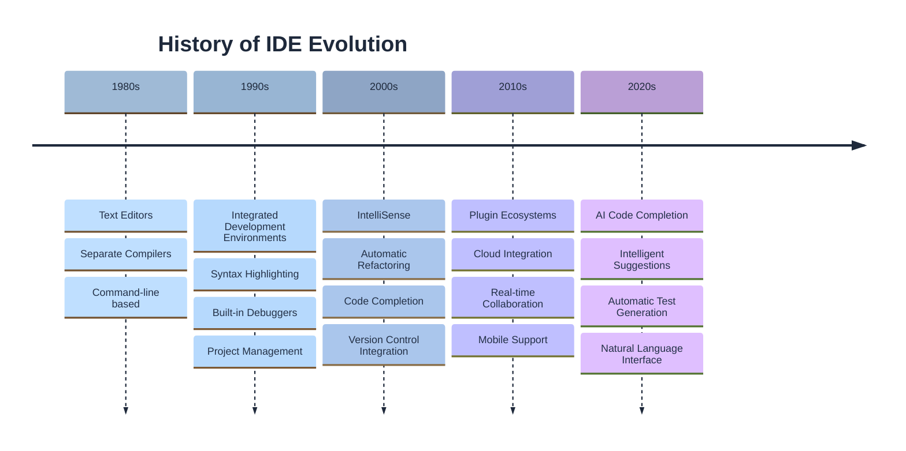

However, limitations still exist.

1. **Lack of Context Understanding**: IDEs understand code syntax but not business logic or intent.

2. **Passive Tools**: They only provide help when explicitly requested by the developer.

3. **Fragmented Support**: Code writing, testing, documentation, deployment, etc., are separated.

## 1.2 Emergence of AI Pair Programming

### Redefining Pair Programming
**Traditional Pair Programming**

- Two developers sit at one computer and work
- One writes code (Driver), the other reviews (Navigator)
- Aims for knowledge sharing and code quality improvement

**AI Pair Programming**

- Developer and AI collaborate through conversation
- AI acts as a 24/7 available senior developer
- Provides instant feedback and diverse perspectives

### Spectrum of AI Development Tools

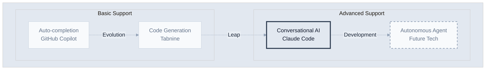

Claude Code represents the most advanced form in the 'conversational assistant' area.

## 1.3 Core Philosophy of Claude Code

### 1. Flexibility

Claude Code does not enforce specific workflows.

```bash
# All various approaches are possible
claude "Find and fix the bug"
claude "Implement a new feature using TDD"
claude "Refactor this code into a functional style"
claude "Analyze the architecture and suggest improvements"
```

### 2. Transparency

The entire work process is transparently disclosed.

```bash
# Check Claude Code's work process in real-time
> Exploring files: src/components/
> Analyzing code: UserProfile.jsx
> Applying modifications...
> Running tests...
```

### 3. Collaboration

AI is a colleague, not a tool.

- Suggests proposals and alternatives
- Warns about potential problems in advance
- Discusses better solutions
- Supports learning and growth

### 4. Context Awareness

Understands the entire project context.

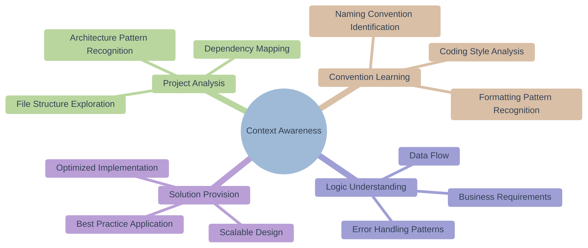

## 1.4 Differentiation from Other AI Coding Tools

### Comparison with GitHub Copilot

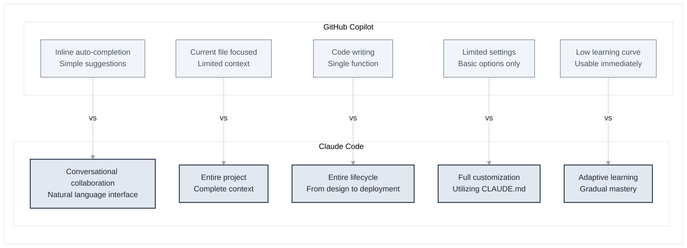

| Feature | GitHub Copilot | Claude Code |
|------|----------------|-------------|
| Operation Method | Inline auto-completion | Conversational interaction |
| Context | Current file focused | Entire project |
| Scope of Work | Code writing | Design, implementation, testing, deployment |
| Customization | Limited | Fully customizable |
| Learning Curve | Low | Medium |

### Comparison with ChatGPT

| Feature | ChatGPT | Claude Code |
|------|---------|-------------|
| File System Access | Not possible | Full access |
| Code Execution | Limited | Direct execution possible |
| Persistence | Resets per conversation | Maintains project context |
| Tool Integration | None | Git, testing, build tools, etc. |

### Unique Features of Claude Code

**1. Project Customization via CLAUDE.md**
```markdown
# Rules for our project
- All components are written functionally
- Maintain test coverage above 80%
- Commit messages follow conventional commits
```

**2. Multimodal Input Support**

- Implement UI by looking at design screenshots
- Convert diagrams into code
- Debug with error screenshots

**3. True Full-Stack Support**
```bash
# From frontend to deployment all at once
claude "Create user authentication functionality. React frontend, Node.js backend, PostgreSQL database, and Docker containerization"
```

## Real Case: Real-time Chat App Created in 30 Minutes

Experience of a startup developer

> "I had to start a new project, and real-time chat functionality was key.
> Normally, it would have taken at least a week, starting from architecture design.
> But with Claude Code, I created a working prototype in 30 minutes.
> 
> What's more surprising is that the code quality was better than what I would have written myself.
> Error handling, security, and scalability were all considered."

Reasons why this was possible

1. Claude Code knows best practices for real-time communication
2. Automatically identifies project structure and integrates appropriately
3. Generates test code as well
4. Points out and resolves potential problems 사전

## Conclusion

Claude Code is not just a tool. It is a paradigm shift in development methods.

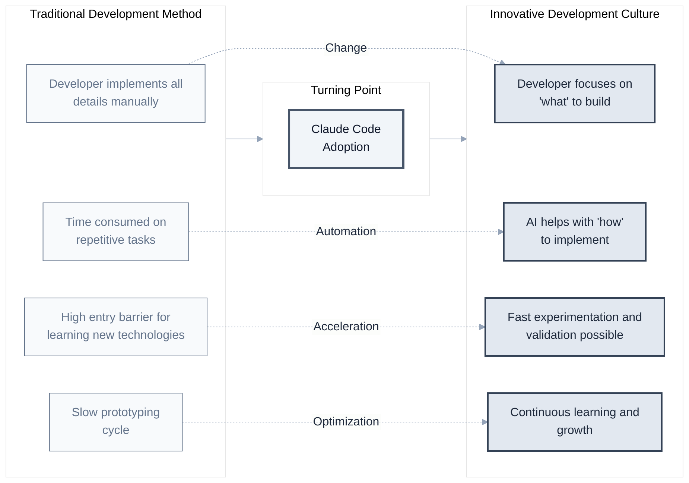

In the next chapter, we will actually install Claude Code and run our first command. Let's start a new journey of development with AI.

\newpage

# Chapter 2: Installation and Initial Setup

> "Well begun is half done."

Now let's install Claude Code. This chapter provides **step-by-step installation guides for each operating system**, and also covers potential problems during installation and their solutions.

## 2.1 System Requirements

### Minimum Requirements

First, let's check if your system can run Claude Code. The minimum requirements are similar to a typical development environment and can run on most modern systems.

| Component | Minimum Requirement | Recommendation |
|----------|-------------|----------|
| Operating System | macOS 12+, Windows 10+, Ubuntu 20.04+ | Latest version |
| RAM | 8GB | 16GB or more |
| Storage | 2GB free space | 10GB or more |
| Internet | Stable connection required | High-speed internet |
| Node.js | 18.0 or higher | 20.0 or higher |

### Prerequisites

Let's check the system environment before installation. Open a terminal and run the following commands to check if the necessary tools are installed.

**How to Run Terminal**

- **Mac**: `Cmd + Space` → Search for "Terminal"
- **Windows**: `Win + R` → Type "cmd"
- **Linux**: `Ctrl + Alt + T`

```bash
# Check Node.js version
node --version

# Check npm version
npm --version

# Check Git installation (optional but recommended)
git --version
```

**If Node.js is not installed or the version is low**

1. Download the LTS version from the [Node.js official site](https://nodejs.org)
2. Or use a package manager
   - **Mac**: `brew install node` (Homebrew required)
   - **Windows**: `choco install nodejs` (Chocolatey required)
   - **Linux**: `sudo apt install nodejs npm` (Ubuntu/Debian)

> **Recommendation**: Using the LTS (Long Term Support) version ensures stability and compatibility.

## 2.2 Installation Guide (By OS)

Now let's install Claude Code for each operating system. We provide installation methods optimized for each OS.

### Installing on macOS

Two installation methods are provided for macOS.

**Method 1: Installation via npm (Recommended)**

This is the simplest and most stable method.

```bash
# Install Claude Code
npm install -g @anthropic-ai/claude-code

# Verify installation
claude --version
```

**Method 2: Installation via Homebrew**

```bash
# Add Homebrew tap
brew tap anthropic-ai/claude-code

# Install Claude Code
brew install claude-code

# Verify installation
claude --version
```

**macOS Specific Settings**

```bash
# Set terminal permissions (if necessary)
# System Preferences > Security & Privacy > Privacy > Full Disk Access
# Add Terminal.app or the terminal app you are using

# Exclude from Spotlight search (optional)
# Improve performance by excluding the .claude-code directory from Spotlight search
```

### Installing on Windows

On Windows, it is recommended to install Claude Code via WSL 2 (Windows Subsystem for Linux). Currently, Claude Code does not support a Windows native client, so a Linux environment is required.

**System Requirements**

| Item | Minimum Condition |
|------|-----------|
| OS | Windows 10 (21H2) or Windows 11 + WSL 2 |
| RAM | 4GB or more |
| Network | Internet connection (OAuth authentication and API calls) |
| Software | WSL 2, Node.js 18+, Git (optional) |

**Step 1: Install WSL 2**

Run PowerShell as **administrator** and enter the following command.

```powershell
# Install WSL (includes Ubuntu 22.04 LTS by default)
wsl --install

# Reboot system after installation
```

If you are using WSL 1, upgrade as follows:

```powershell
# Upgrade to WSL 2
wsl --set-version Ubuntu 2

# Check installation status
wsl --status
wsl --list --verbose
```

**Step 2: Install Node.js (Inside WSL)**

Open the WSL terminal (Ubuntu) and install Node.js via NVM.

```bash
# Install NVM
curl -o- https://raw.githubusercontent.com/nvm-sh/nvm/v0.39.7/install.sh | bash

# Apply changes
source ~/.bashrc

# Install and use Node.js 18 LTS
nvm install 18
nvm use 18

# Verify installation
node --version
npm --version
```

> **Important**: When running the `which node` command, the path should be displayed as `/home/<username>/.nvm/...`. If the path `/mnt/c/...` appears, it means there is a path conflict with Windows, so repeat the above process.

**Step 3: Install Claude Code**

```bash
# Install Claude Code
npm install -g @anthropic-ai/claude-code

# Verify installation
claude --version
```

**Troubleshooting Installation Errors**

| Error | Solution |
|------|----------|
| `OS detection failed` | Run `npm config set os linux` then `npm install -g @anthropic-ai/claude-code --force --no-os-check` |
| `exec: node: not found` | Recheck Node.js installation, check `which node` path |
| Permission error | Run `npm config set prefix '~/.npm-global'` then reinstall |

### Installing on Linux (Ubuntu/Debian)

```bash
# Update system packages
sudo apt update && sudo apt upgrade

# Install Node.js (if not already present)
curl -fsSL https://deb.nodesource.com/setup_20.x | sudo -E bash -
sudo apt install nodejs

# Install Claude Code
sudo npm install -g @anthropic-ai/claude-code

# Verify installation
claude --version

# Set permissions (if necessary)
sudo chmod +x /usr/local/bin/claude
```

## 2.3 Running Your First Command

Installation is complete. Now let's proceed with the basic setup of Claude Code.

### API Key Setup

An API key is required to use Claude Code. You can start with free usage.

**Step 1: Obtain an API Key**

1. Go to [Anthropic Console](https://console.anthropic.com)
2. Create an account or log in
3. Create a new key in the "API Keys" section

**Step 2: Set up the API Key**
```bash
# Run API key setup command
claude login

# Paste the copied API key when prompted
# (It is normal for the key not to be displayed on the screen when typing)
```

> **Security Note**: The API key is linked to your personal account, so be careful not to share it with others.

### First Conversation

Now let's start our first conversation with Claude Code.

```bash
# First greeting (Success if Claude responds!)
claude "Hello, Claude! Nice to meet you."

# Try a simple task request
claude "Please tell me the current system information"

# Try exploring a directory
claude "Show me what files are in the current folder"
```

**If the response is displayed correctly, the installation and basic setup are complete.** You are ready to use Claude Code.

### Interactive Mode vs. Command Mode

**Command Mode (One-off tasks)**
```bash
claude "Read the package.json file and summarize it"
```

**Interactive Mode (Continuous tasks)**

Command mode is suitable for single tasks, but interactive mode is more efficient for complex projects or tasks that require multiple steps.

```bash
# Start interactive mode
claude

# Now you can chat continuously
> I want to start a new React project
> Use TypeScript and set up a testing environment too
> Add Material-UI as well
```

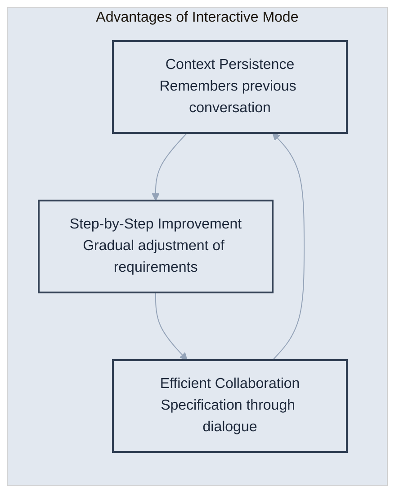

Advantages of Interactive Mode

## 2.4 Optimizing Basic Settings

To use Claude Code more efficiently, it's important to adjust settings according to your work environment and preferences. This section will cover major configuration options and optimization methods.

### Global Configuration File

All Claude Code settings are managed in a configuration file in your home directory. You can configure a personalized work environment through this file.

**Configuration File Location**: `~/.claude-code/config.json`

```json
{
  "api_key": "sk-ant-...",              // API authentication key
  "default_model": "claude-3-opus-20240229", // Default model to use
  "theme": "dark",                       // Interface theme (dark/light)
  "editor": "vscode",                    // Preferred editor
  "auto_commit": false,                  // Whether to auto-commit
  "language": "en",                      // Default language setting
  "permissions": {
    "file_write": true,                  // File write permission
    "file_read": true,                   // File read permission
    "command_execution": true            // Command execution permission
  }
}
```

**Explanation of Major Configuration Options**

- `default_model`: Choose the appropriate model based on task type (opus: complex tasks, sonnet: general tasks, haiku: fast responses)
- `auto_commit`: Decide whether to automatically Git commit code changes
- `permissions`: Recommended to enable only necessary permissions for security

### Permission Settings

Claude Code is a powerful tool, so proper permission management is important. You can adjust permissions based on your work environment and security requirements.

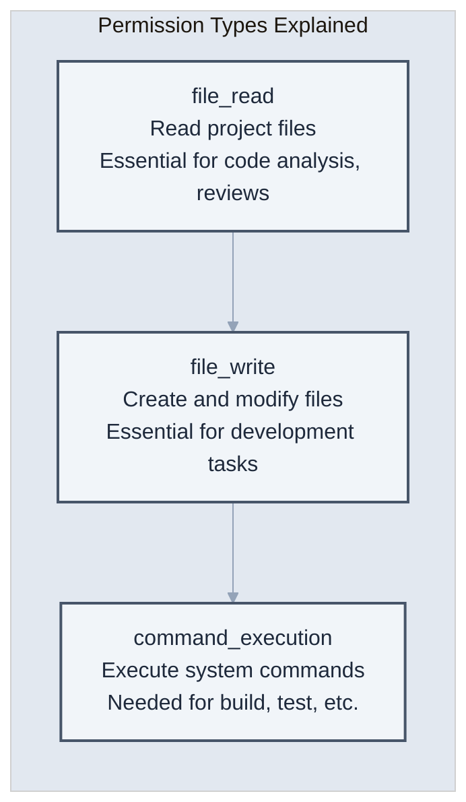

**Permission Types Explained**

Permission setting strategy for balancing security and convenience

```bash
# Grant all permissions (development environment)
claude --allow-all

# Read-only mode (for code reviews)
claude --read-only

# Grant specific permissions only
claude --allow-read --allow-write --deny-execute
```

### Editor Integration

To increase development efficiency, you can integrate Claude Code with your existing editor. Editor integration allows for a seamless connection between code editing and AI support.

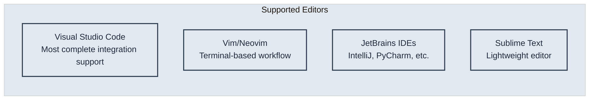

**Supported Editors**

Integration settings with your preferred editor

```bash
# VSCode integration
claude config set editor vscode

# Vim integration
claude config set editor vim

# Call Claude Code directly from the editor
# VSCode: Cmd+Shift+P > "Claude: Ask"
```

### Proxy Settings (Corporate Environment)

Many companies access the external internet through proxy servers for security reasons. Claude Code supports proxy settings to be usable in such environments.

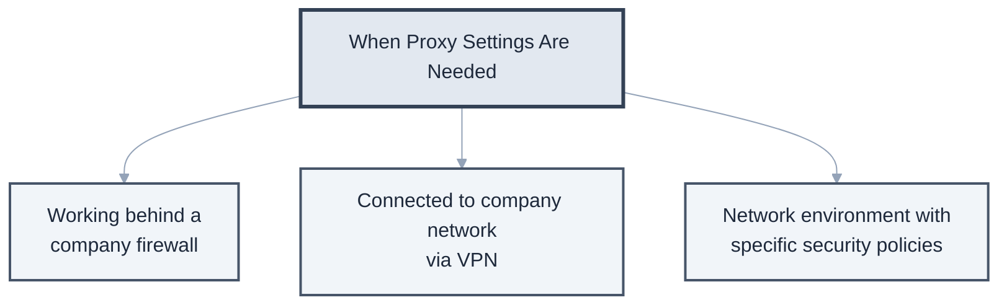

**When Proxy Settings Are Needed**

How to set up proxy in a corporate environment

```bash
# HTTP proxy settings
export HTTP_PROXY=http://proxy.company.com:8080
export HTTPS_PROXY=http://proxy.company.com:8080

# Claude Code specific proxy settings
claude config set proxy http://proxy.company.com:8080
```

## 2.5 Troubleshooting Guide

This section summarizes common problems that may occur during Claude Code installation and initial use, along with their solutions. Step-by-step solutions are provided for each problem situation, so following them carefully should resolve most issues.

### Frequently Occurring Problems and Solutions

The following are the most common problems experienced by Claude Code users and their verified solutions.

**1. "command not found: claude"**

This error occurs when Claude Code is installed but not registered in the system PATH.

**Cause Analysis**

- npm global installation path not included in PATH
- Incorrect installation path
- Shell environment variable setting issue

**Solution**
```bash
# Step 1: Check npm global path
npm config get prefix

# Step 2: Add to PATH (bash/zsh)
echo 'export PATH="$PATH:$(npm config get prefix)/bin"' >> ~/.bashrc
source ~/.bashrc

# Step 3: Verify installation
claude --version
```

**Additional Solutions**

- May need to modify `.zshrc` file on macOS
- Modify PATH in system environment variables on Windows

**2. "EACCES: permission denied"**

This error occurs due to permission issues during npm global installation. It is especially common on Linux or macOS.

**Cause Analysis**

- Lack of write permission for npm global directory
- Ownership issue when installed with sudo
- Attempting to install in a system-protected directory

**Solution**
```bash
# Method 1: Modify permissions (Recommended)
sudo chown -R $(whoami) $(npm config get prefix)/{lib/node_modules,bin,share}

# Method 2: Execute via npx (Temporary solution)
npx @anthropic-ai/claude-code

# Method 3: Change npm global directory
mkdir ~/.npm-global
npm config set prefix '~/.npm-global'
echo 'export PATH=~/.npm-global/bin:$PATH' >> ~/.bashrc
source ~/.bashrc
```

**3. "API rate limit exceeded"**

This error occurs when the API usage limit is reached. The number of requests per hour is limited according to Anthropic's API policy.

**Cause Analysis**
- Too many requests in a short time
- Reached API plan usage limit
- Duplicate requests due to network problems

**Solution**
```bash
# Step 1: Check current status
claude status

# Step 2: Set auto-retry interval (milliseconds)
claude config set retry_delay 5000

# Step 3: Set maximum number of retries
claude config set max_retries 3
```

**Prevention Methods**

- Execute large tasks by dividing them into smaller units
- Adjust request speed using the `--rate-limit` option
- Monitor API usage to anticipate limits

**4. "SSL certificate problem"**

This occurs when SSL certificate verification fails due to the use of self-signed certificates in a corporate environment or network security policies.

**Cause Analysis**

- SSL inspection by company firewall
- Use of self-signed certificates
- Certificate store issues on older systems

**Solution**
```bash
# ⚠️ Temporary solution (Security risk)
export NODE_TLS_REJECT_UNAUTHORIZED=0

# ✅ Recommended solution: Install company certificate
# Step 1: Obtain certificate file from IT department
# Step 2: Register certificate with npm
npm config set cafile /path/to/company-cert.pem

# Step 3: Claude Code specific settings
claude config set tls_verify true
claude config set ca_bundle /path/to/company-cert.pem
```

**Security Considerations**

- `NODE_TLS_REJECT_UNAUTHORIZED=0` poses a security risk, use only temporarily
- If possible, collaborate with the IT department for proper certificate setup

### Performance Optimization Tips

These are settings to improve Claude Code's response speed and efficiency. Adjust appropriately based on project size and work patterns.

**1. Enable Caching**

Improves speed by caching responses to repetitive requests.

```bash
# Enable response caching
claude config set cache_enabled true

# Set cache TTL (seconds, default: 3600s = 1 hour)
claude config set cache_ttl 3600

# Set cache size limit (MB)
claude config set cache_max_size 100
```

**Cache Usage Tips**

- Useful when repeatedly analyzing the same code
- Effective for incremental work on large projects
- Clear cache: `claude cache clear`

**2. Adjust Context Size**

Adjust the context size that Claude Code can process at once, depending on the project scale.

```bash
# Increase context for large projects
claude config set max_context_length 100000

# For small projects or when fast responses are needed
claude config set max_context_length 50000

# Check current setting
claude config get max_context_length
```

**Setting Guidelines**
- **Small projects (< 50 files)**: 50,000
- **Medium projects (50-200 files)**: 100,000
- **Large projects (200+ files)**: 200,000

**Caution**: Larger context may lead to longer response times and increased API costs.

**3. Use Local Model (Beta)**

A feature under development that allows running models locally, enabling Claude Code usage without an internet connection.

```bash
# Enable local mode
claude config set local_mode true

# Download local model (Caution: Several GBs in size)
claude download-model claude-instant

# Check downloaded models
claude list-models --local

# Run with a specific model
claude --model local:claude-instant "Analyze the code"
```

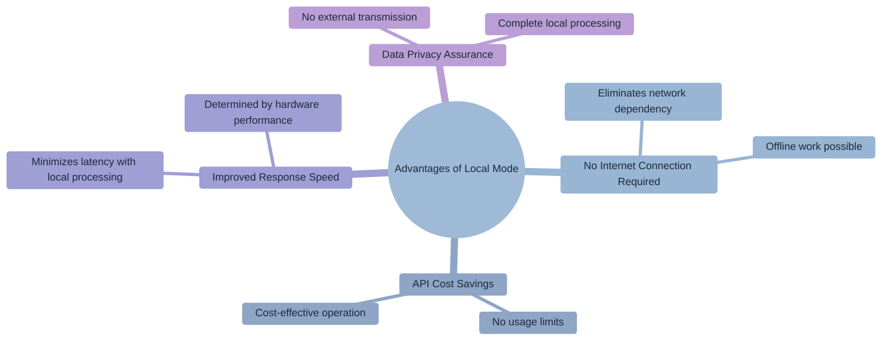

**Advantages of Local Mode**

**Requirements**
- Sufficient storage space (2-8GB per model)
- Powerful hardware (GPU recommended)
- Some limitations exist as it's a beta feature

## Lab: Hello World Project

Now that we've finished the theoretical setup, let's actually use Claude Code. We'll experience the basic usage of Claude Code through a simple web server project.

**Learning Objectives**
- Learn how to use Claude Code's natural language commands
- Experience the entire process from project creation to execution
- Understand the quality and structure of the generated code

**Lab Process**

```bash
# Step 1: Create project directory
mkdir hello-claude && cd hello-claude

# Step 2: Initialize project with Claude Code
claude "Create a simple Hello World web server with Node.js.
Make it run on port 3000 and display 'Hello from Claude Code!' when accessing the '/' path.
Also, create package.json and README.md files."

# Step 3: Check generated file structure
ls -la
# Expected result
# package.json  - Project configuration file
# server.js     - Web server main file
# README.md     - Project description document

# Step 4: Install dependencies
npm install

# Step 5: Run the server
npm start

# Step 6: Test in browser
# Access http://localhost:3000 and check for "Hello from Claude Code!" message
```

**Lab Points**
- Convey complex requirements at once using natural language
- Observe the quality and structure of code generated by Claude Code
- Check the generated README.md for additional usage instructions

**Lab Completion Checklist**
- [ ] Was the project successfully created?
- [ ] Does the server start normally?
- [ ] Is the correct message displayed in the browser?
- [ ] Is the generated code structure understandable?

You have successfully created your first project with Claude Code!

## Installation Complete and Next Steps

The installation and basic setup of Claude Code are now complete. You should have experienced the power of Claude Code through the first lab.

**What You Learned in This Chapter**
- OS-specific installation methods and environment setup
- API key setup and first conversation
- Troubleshooting methods and performance optimization
- Experience creating an actual project

**Next Chapter Preview**
In Chapter 3, you will systematically learn the core features of Claude Code.
- **File System Exploration**: Understanding project structure and efficient code analysis
- **Code Writing and Modification**: Sophisticated code generation and refactoring through natural language
- **Testing and Debugging**: Verification and problem-solving for high-quality code
- **Git Integration**: Workflows for version control and collaboration

**Useful Reference Commands**
```bash
# Check help
claude help

# Start interactive tutorial
claude tutorial

# Check current configuration
claude config list

# Check version information
claude --version
```

**Troubleshooting Resources**
- Official Documentation: https://docs.anthropic.com/claude-code
- Community Forum: https://community.anthropic.com
- GitHub Issues: https://github.com/anthropic/claude-code/issues

\newpage

# Chapter 3: Mastering Basic Usage

> "A journey of a thousand miles begins with a single step." - Lao Tzu

In this chapter, we will systematically learn the core features of Claude Code. Through **hands-on examples**, we will learn how to effectively apply Claude Code to everyday development tasks.

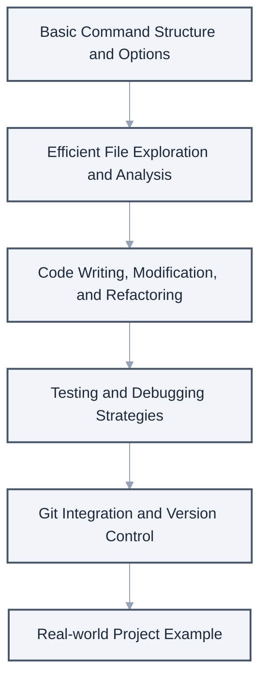

Topics covered in this chapter

## 3.1 Basic Command Structure

### Command Anatomy

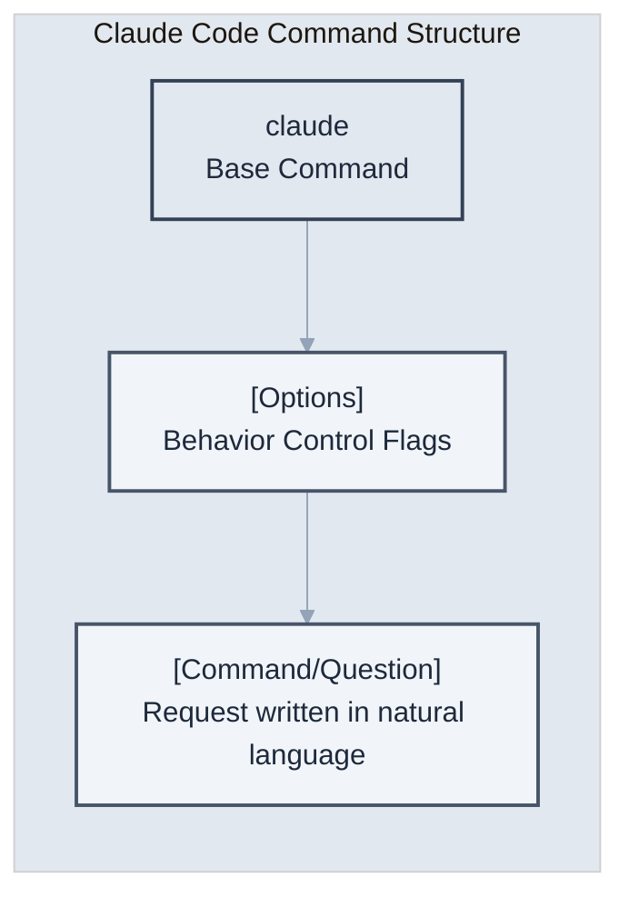

The structure of Claude Code commands is intuitive yet powerful.

### Key Options

Claude Code allows fine-grained control over its behavior through various options. Understanding the purpose and usage scenarios of each option will enable more effective use.

**Basic Options**
```bash
# View help - Check all available commands and options
claude --help
claude -h

# Check version - Check the currently installed Claude Code version
claude --version
claude -v

# Clear conversation history - When you want to start with a new context
claude --clear
claude -c
```

**Model Selection Options**
```bash
# Use high-performance model for complex tasks
claude --model claude-3-opus "Implement a complex algorithm"

# Simple tasks requiring quick responses
claude -m claude-3-haiku "Just give a simple explanation"

# Balanced performance and speed
claude -m claude-3-sonnet "Review the code"
```

**Output Format Control**
```bash
# Receive structured data in JSON format
claude --json "Output the project structure in JSON"

# Generate documentation in Markdown format
claude --markdown "Show the README file content in Markdown"

# Plain text output (default)
claude --plain "Show a simple explanation in text"
```

### The Power of Natural Language Commands

A key feature of Claude Code is the ability to convey intent using natural language instead of complex command syntax.

```bash
# Technical request
claude "Add an email validation method to the UserService class"

# Exploratory question
claude "How is authentication handled in this project?"

# Creative request
claude "Is there a way to make this function more efficient?"

# Complex task
claude "Find and fix the bug, write tests, and then create a commit message"
```

## 3.2 File Exploration and Reading

### Understanding Project Structure

When assigned to a new project, quickly grasping the overall structure is crucial. Claude Code can be used to efficiently explore the codebase.

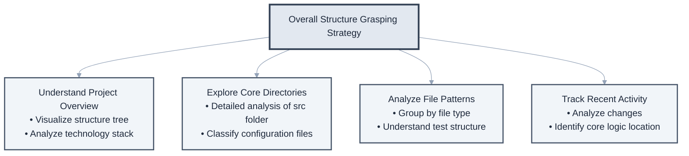

**Overall Structure Grasping Strategy**

### Efficient File Reading

This is not just about opening files, but effectively extracting information relevant to your purpose.

```bash
# Read a single file
claude "Read the package.json file"

# Read multiple files simultaneously
claude "Read all configuration files (starting with config) and summarize them"

# Read only a specific part
claude "Show only the router configuration part from the app.js file"

# Compare files
claude "Compare the development and production environment configuration files"
```

### Code Analysis Requests

Useful analysis requests for understanding how existing code works or discovering potential problems.

```bash
# Function analysis
claude "Explain how the calculateTotalPrice function works"

# Dependency analysis
claude "Explain the main libraries used in this project and their purposes"

# Architecture analysis
claude "Explain the overall architecture of this project with a diagram"

# Security vulnerability scan
claude "Scan for any code that could be a security issue"
```

## 3.3 Code Writing and Modification

### Creating New Files

You can automatically generate new files that conform to the project's conventions and structure.

```bash
# Basic file creation
claude "Create date-related utility functions in the utils folder"

# Template-based generation
claude "Create a user router using the Express router template"

# Automatic test file generation
claude "Create a Jest test file for UserService"

# Document generation
claude "Create API endpoint documentation in Swagger format"
```

### Code Modification Patterns

Methods for systematically performing various modification tasks. We will introduce actual usage scenarios and best practices for each pattern.

**1. Simple Modification - Code Modernization**
```bash
# Upgrade ES5 to ES6+ syntax
claude "Change all var to const or let. Use let only for reassigned variables"

# Convert callbacks to async/await
claude "Change callback-based code to async/await pattern"

# Change string concatenation to template literals
claude "Change string concatenation operator (+) to template literals"
```

**2. Refactoring - Improving Code Structure**
```bash
# Split long functions
claude "This function is over 50 lines long, split it into logical units to improve readability"

# Remove duplicate code
claude "Find duplicate code and extract it into a reusable function"

# Simplify conditional statements
claude "Improve complex if-else chains with early return patterns or switch statements"
```

**3. Adding Features - Incremental Improvement**
```bash
# Add error handling
claude "Add appropriate error handling and retry logic to this API call function"

# Manage loading states
claude "Add logic to manage loading, success, and error states in this component"

# Add validation
claude "Add real-time validation to the user input form"
```

**4. Bug Fixing - Enhancing Stability**
```bash
# Find potential errors
claude "Find parts where null/undefined reference errors might occur and fix them with optional chaining"

# Prevent memory leaks
claude "Find and fix parts where event listeners or timers are not properly cleaned up"

# Resolve race conditions
claude "Find and fix parts where race conditions might occur in asynchronous operations"
```

### Unifying Code Style

Applying a consistent coding style across the entire project.

```bash
# Formatting
claude "Format the entire project according to Prettier rules"

# Naming conventions
claude "Change camelCase to snake_case"

# Add comments
claude "Add explanatory comments to complex logic"

# Add types
claude "Add TypeScript types to JavaScript files"
```

## 3.4 Test Execution and Debugging

### Writing Tests

Systematic test writing methods for high-quality software.

```bash
# Unit tests
claude "Write unit tests for the calculateDiscount function"

# Integration tests
claude "Write integration tests for the user registration API"

# Edge cases
claude "Find edge cases for this function and add tests"

# Test coverage
claude "Check test coverage and add tests for missing parts"
```

### Debugging Strategies

Systematic approaches to effectively identify and resolve causes when problems occur.

**1. Analyzing Error Messages**
```bash
claude "Explain what this error message means and suggest a solution
TypeError: Cannot read property 'name' of undefined"
```

**2. Adding Logs**
```bash
claude "Add debug logs to the part where the problem seems to be occurring"
```

**3. Step-by-Step Tracing**
```bash
claude "Modify the code so I can trace the execution flow of this function step by step"
```

**4. Performance Analysis**
```bash
claude "Find the performance bottleneck in this code and optimize it"
```

### Real-time Debugging Session

Examples of resolving complex problems interactively. Let's learn effective collaboration methods with Claude Code through actual debugging scenarios.

**Scenario 1: Resolving Server Start Error**
```bash
# Start interactive debugging
claude

> The server won't start. It says port 3000 is already in use.
< I'll check for processes using port 3000. I'll run the following command for you:
  lsof -i :3000

> I checked, and a previously run node process is running with PID 12345.
< I will safely terminate that process and create a script to prevent this issue in the future.
  1. Create a process termination script
  2. Add a restart script to package.json
  3. Implement graceful shutdown code

> Okay, go ahead. And I also want to know why the server didn't shut down properly.
< Analyzing the server code, I found the following issues:
  1. The process was forcibly terminated because there was no SIGTERM signal handler.
  2. Active connections were not being cleaned up.
  3. The database connection pool was not being closed.
  
  Now I will resolve these issues one by one...
```

**Scenario 2: Tracking Memory Leaks**
```bash
claude

> When the server runs for a few days, memory usage keeps increasing. I think there's a memory leak.
< To track the memory leak, I will proceed with the following steps:
  1. Search for patterns in the current code that might cause memory leaks.
  2. Set up memory profiling tools.
  3. Add monitoring to suspected code areas.

> What patterns are risky?
< I found the following patterns:
  - 3 places where event listeners are not removed.
  - A cache where data is continuously added to a global variable.
  - Object structures with circular references.
  Shall I show you how to fix each one?
```

## 3.5 Git Integration and Version Control

### Basic Git Operations

How to perform routine version control tasks with Claude Code.

```bash
# Check status
claude "Check git status and summarize the changes"

# Staging
claude "Stage only the test-related files among the modified files"

# Commit
claude "Write a meaningful commit message and commit"

# Branch management
claude "Create a new branch for a new feature and check it out"
```

### Advanced Git Operations

Even complex Git operations can be performed safely and efficiently with the help of Claude Code.

```bash
# Interactive rebase
claude "Clean up the last 3 commits and squash them into one"

# Conflict resolution
claude "Resolve the merge conflict. Keep both changes."

# History analysis
claude "Find out when this bug was introduced using git bisect"

# Cherry-pick
claude "Cherry-pick only the bug fix commit from the hotfix branch to main"
```

### Creating Pull Requests

Tasks related to Pull Requests, which are important for team collaboration.

```bash
# Create PR
claude "Create a Pull Request for this feature.
Summarize the changes and include testing methods."

# Respond to code reviews
claude "Address the points raised by the reviewer and write a response"

# Utilize PR templates
claude "Write the description according to the project's PR template"
```

## Real-world Example: Creating a Todo App

Let's build an actual project by comprehensively utilizing the basic usage methods learned so far. We will learn practical application of Claude Code by developing a Todo application step by step.

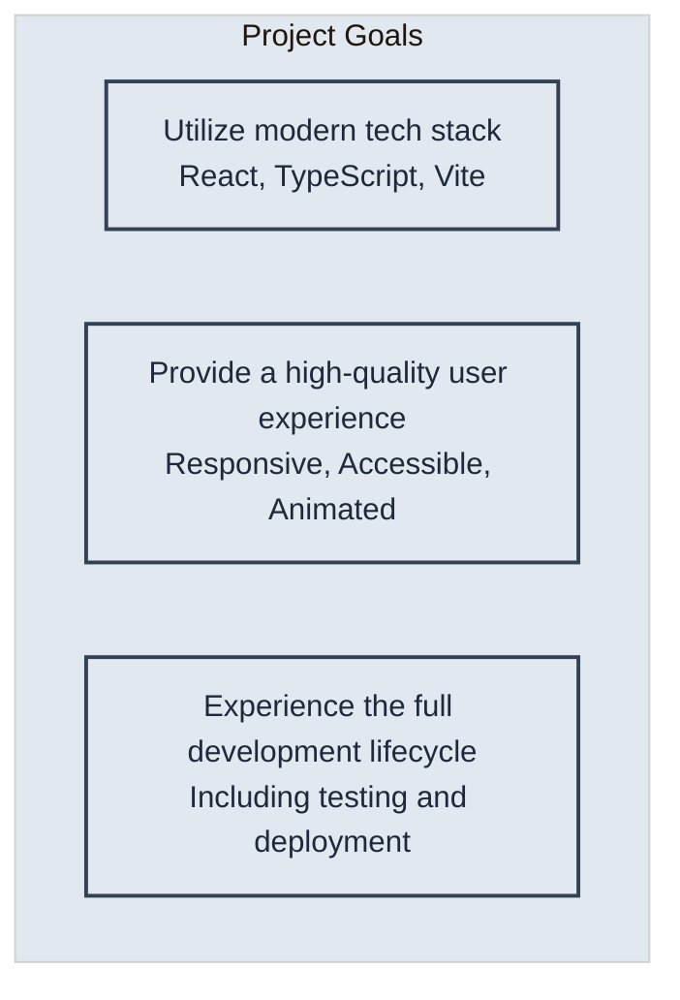

**Project Goals**

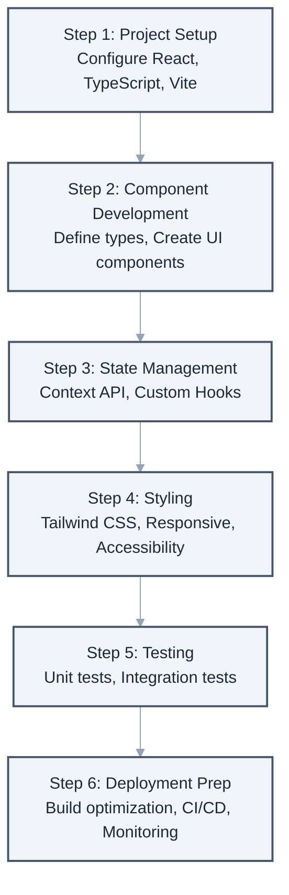

### Todo App Development Step-by-Step Guide
```

**Project Completion Checklist**
- [ ] Do all CRUD functions work correctly?
- [ ] Does the responsive design work well on all screen sizes?
- [ ] Is test coverage above 80%?
- [ ] Is the Lighthouse score above 90?
- [ ] Does it meet accessibility standards?

## Pro Tips: Maximizing Efficiency

### 1. Setting Aliases

You can increase work efficiency by setting shortened aliases for frequently used commands.

```bash
# Add to ~/.bashrc or ~/.zshrc
alias cc="claude"
alias ccc="claude --clear"
alias ccr="claude 'npm run'"
```

### 2. Utilizing Templates

Increase reusability by saving frequently used command patterns as templates.

**Creating Template Directory Structure**
```bash
# Create Claude Code template directory
mkdir -p ~/.claude-templates/{components,features,tests,docs}
```

**Practical Template Examples**

1. **React Component Template**
```bash
# Component creation template
cat > ~/.claude-templates/components/react-component.txt << 'EOF'
Create a new React component
- Component name: [COMPONENT_NAME]
- Write as a functional component
- Use TypeScript
- Define Props interface
- Include basic styles
- Also generate Storybook story file
- Include unit test file
EOF

# Usage example
COMPONENT_NAME="UserProfile" envsubst < ~/.claude-templates/components/react-component.txt | claude
```

2. **API Endpoint Template**
```bash
# API route creation template
cat > ~/.claude-templates/features/api-endpoint.txt << 'EOF'
Create a new REST API endpoint
- Resource: [RESOURCE_NAME]
- Include all CRUD operations
- Use Express.js router
- Input validation middleware
- Error handling
- Swagger documentation comments
- Include integration tests
EOF
```

3. **Bug Fix Template**
```bash
# Bug fix workflow template
cat > ~/.claude-templates/features/bugfix.txt << 'EOF'
Fix the following bug
1. First, find and analyze the related code
2. Explain the root cause of the bug
3. Suggest and implement a fix
4. Add tests to prevent recurrence
5. Summarize the changes with a commit message

Bug description: [BUG_DESCRIPTION]
EOF
```

### 3. Maintaining Context

Utilize interactive mode to maintain context when performing complex and lengthy tasks. Effective context management is key to the success of large-scale tasks.

**Large-Scale Refactoring Scenario**
```bash
# Start in interactive mode
claude

> From now on, I'm going to migrate legacy code to a modern architecture.
< Understood. I will first analyze the current codebase and create a migration plan.

> Step 1: Analyze the current architecture and identify problems.
< Analysis Results
  - Monolithic structure with high coupling between modules
  - Class-based component usage (React 16.2)
  - State management is complex due to prop drilling
  - Test coverage 30%
  
  Identified key areas needing improvement. Shall I proceed?

> Step 2: Create a migration roadmap.
< Step-by-Step Migration Roadmap
  Phase 1: Infrastructure Modernization (1-2 weeks)
  - Migrate build tool from Webpack to Vite
  - Introduce TypeScript
  
  Phase 2: Component Modernization (3-4 weeks)
  - Convert class components to functional
  - Extract logic with Custom Hooks
  
  Phase 3: State Management Improvement (1 week)
  - Introduce Context API or Zustand
  
  Phase 4: Test Enhancement (1 week)
  - Target 80% test coverage

> Okay, let's start with Phase 1. Proceed with the Vite migration first.
< Starting Phase 1: I will proceed with the Vite migration step by step...
```

**Context Maintenance Tips**

1. **Create Checkpoints**: Request a summary of progress upon completion of each step.
2. **Clear Step Demarcation**: Specify work steps with numbers or labels.
3. **Regular Verification**: Check results intermittently and adjust direction.
4. **Save Context**: Save important decisions as separate documents.

## Conclusion

In this chapter, we systematically learned the core features of Claude Code.

**Key Learnings**
- **Natural Language-Based Commands**: Clearly convey intent without complex syntax.
- **Project Exploration**: Quickly understand and analyze the codebase.
- **Code Management**: Efficient methods for writing, modifying, and refactoring.
- **Quality Management**: Ensuring stability through testing and debugging.
- **Version Control**: Systematic development workflow through Git integration.

**Practical Application Points**
- Delegate repetitive tasks to Claude Code to focus on creative work.
- Solve complex problems using interactive mode.
- Perform accurate tasks by utilizing project context.

In the next chapter, we will learn how to customize Claude Code for each project using the CLAUDE.md file. Let's learn optimization strategies tailored to the characteristics of each project.

\newpage

# Chapter 4: Customizing Projects with CLAUDE.md

> "Good tools adapt to the user." - Donald Norman

In this chapter, we will learn about **project customization through the CLAUDE.md file**. We will systematically learn how to optimize Claude Code according to the unique characteristics and requirements of each project.

CLAUDE.md is a core tool that helps Claude Code understand the project's context, adhere to the team's coding rules, and generate code of consistent quality.

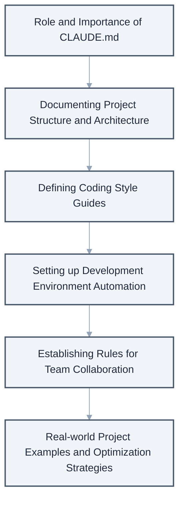

**Topics covered in this chapter**

## 4.1 Role and Importance of CLAUDE.md

### What is CLAUDE.md?

CLAUDE.md is a special Markdown file located in the project's root directory. This file provides Claude Code with project-specific instructions and rules, enabling it to produce more accurate and consistent results.

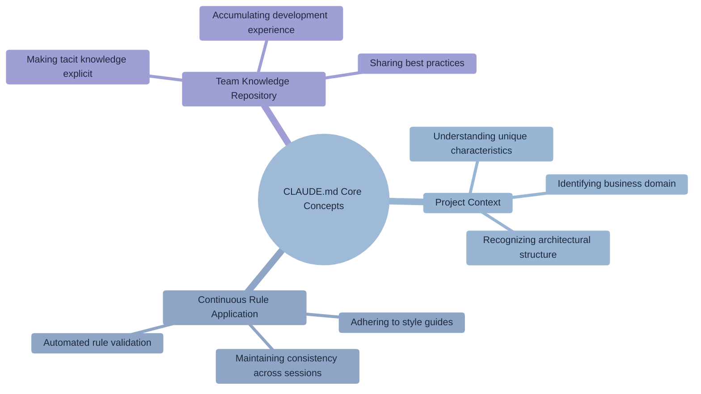

**Core Concepts of CLAUDE.md**

Project structure example:

```
Project Root/
├── CLAUDE.md          # Claude Code configuration file
├── README.md          # General project documentation
├── package.json
└── src/
```

### Why is it Important?

Let's look at the main benefits of using CLAUDE.md with specific examples.

**1. Ensuring Consistency**

Let's compare the difference with and without CLAUDE.md.
```markdown
# CLAUDE.md
## Code Style

- All functions should be arrow functions.
- Always use semicolons.
- Indentation is 2 spaces.
```

**2. Automatic Application of Team Rules**

If you define the team's Git commit rules in CLAUDE.md, Claude Code will automatically generate commit messages that conform to these rules.

```markdown
## Git Commit Rules
- feat: Add a new feature
- fix: Fix a bug
- docs: Modify documentation
- style: Code formatting (no functional changes)
- refactor: Code refactoring (no functional changes)
- test: Add or modify tests
- chore: Changes to build process or auxiliary tools

## Commit Message Format
<type>(<scope>): <subject>

Example:
feat(auth): Add social login functionality
fix(api): Fix null reference error when querying user
```

With this definition, Claude Code automatically generates commit messages in the correct format.

**3. Project-Specific Knowledge**

Specifying the project's domain knowledge allows Claude Code to understand the business context and generate more accurate code.

```markdown
## Domain Terminology
- SKU (Stock Keeping Unit): Inventory management unit
  - Example: "SHOE-NIKE-AF1-WHT-42" (Nike Air Force 1 White Size 42)
- PDP (Product Detail Page): Product detail page
  - Key components: Image gallery, price information, stock status, reviews
- CAC (Customer Acquisition Cost): Customer acquisition cost
  - Formula: Total marketing cost / Number of new customers

## Business Rules
- Display "Low Stock" when inventory is 5 or less.
- New members automatically receive a 10% discount on their first purchase.
- Free shipping for purchases over 50,000 KRW.
```

### CLAUDE.md vs README.md

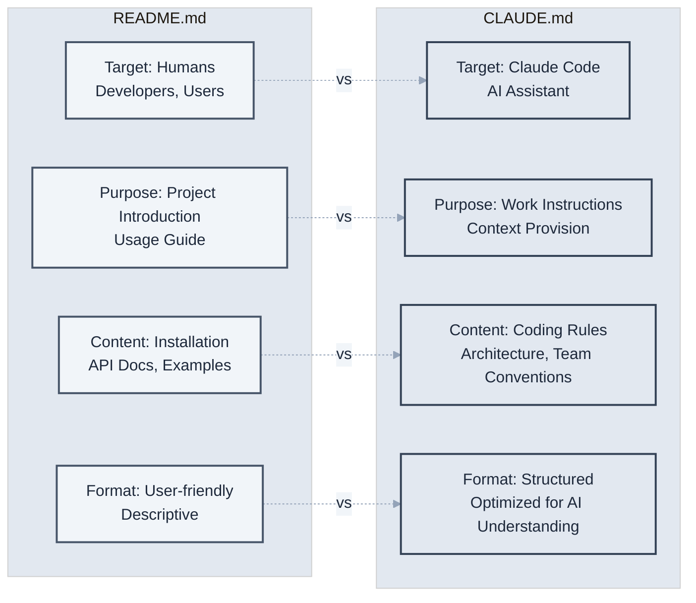

It's important to clearly understand the differences and respective roles of these two files.

**Practical Usage Example**

```markdown
# README.md (Documentation for humans)
## Project Introduction
This project is an e-commerce platform.

## Installation

1. Clone the repository.
2. Run `npm install`.
3. Start the server with `npm start`.

---

# CLAUDE.md (Documentation for Claude Code)
## Project Architecture
- Pattern: MVC + Repository Pattern
- Frontend: React 18 + TypeScript
- Backend: Node.js + Express
- Database: PostgreSQL + Redis

## Code Generation Rules
- All API responses must be wrapped with ResponseDto.
- Use CustomError class for errors.
- Asynchronous functions must include try-catch.
```

## 4.2 Documenting Project Structure

### Basic Structure Explanation

Clearly defining the project's directory structure and the role of each file allows Claude Code to perform more accurate tasks. This should go beyond a simple structure listing to include the responsibilities of each directory and file naming conventions.

```markdown
# CLAUDE.md

## Project Structure

### Directory Structure
```
src/
├── components/      # React components
│   ├── common/     # Common components
│   ├── features/   # Feature-specific components
│   └── layouts/    # Layout components
├── hooks/          # Custom React hooks
├── services/       # API communication logic
├── store/          # Redux store
├── utils/          # Utility functions
└── types/          # TypeScript type definitions
```

### Key File Locations
- Environment configuration: `.env`, `.env.example`
- API endpoints: `src/services/api.ts`
- Routing configuration: `src/routes/index.tsx`
- Global styles: `src/styles/global.css`

### File Naming Conventions
- Components: PascalCase (e.g., UserProfile.tsx)
- Utilities: camelCase (e.g., formatDate.ts)
- Constants: UPPER_SNAKE_CASE (e.g., API_ENDPOINTS.ts)
- Styles: kebab-case (e.g., user-profile.module.css)
```

### Specifying Architectural Patterns

Specifying the main architectural patterns and design principles used in the project helps generate consistent code.

```markdown
## Architectural Patterns

### State Management
- Use Redux Toolkit
- Create slice files for each feature
- Manage API state with RTK Query

### Component Structure
```typescript
// All components follow this structure
interface ComponentProps {
  // define props
}

export const ComponentName: React.FC<ComponentProps> = (props) => {
  // Hooks at the top
  // Logic
  // Return JSX
}
```

### Data Flow

1. User Action → 2. Action Dispatch → 3. Reducer Processing → 4. State Update → 5. UI Re-render


## 4.3 Defining Coding Style Guides

### Language-Specific Style Guides

Define consistent coding styles for each programming language used in the project. This goes beyond simple formatting rules and is a key element in enhancing code readability and maintainability.

````markdown
## Coding Style

### TypeScript/JavaScript
- Function names: camelCase
- Component names: PascalCase
- Constants: UPPER_SNAKE_CASE
- File names: kebab-case.ts

### Naming Convention Examples
```typescript
// Good examples
const getUserData = async (userId: string) => { }
const MAX_RETRY_COUNT = 3;
export const UserProfile: React.FC = () => { }

// Examples to avoid
const get_user_data = async (userid) => { }
const maxretrycount = 3;
export const userprofile = () => { }
```

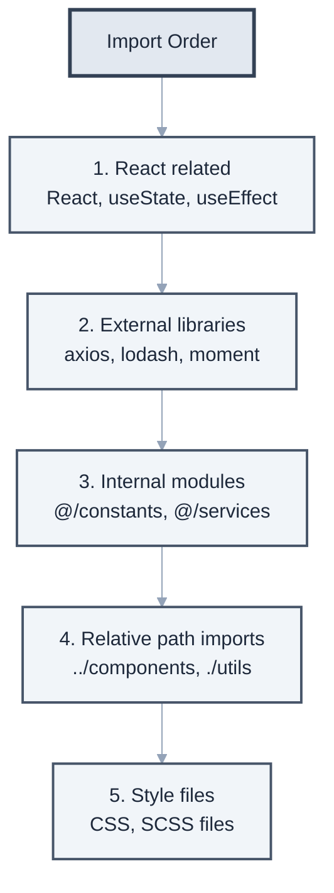

### Import Order

```typescript
import React, { useState, useEffect } from 'react';
import { useSelector } from 'react-redux';
import axios from 'axios';

import { API_ENDPOINTS } from '@/constants';
import { UserService } from '@/services';

import { Button } from '../components';
import './styles.css';
```
````

### Code Quality Standards

Establish specific standards and rules for maintaining high-quality code. These standards can also be used as a checklist during code reviews.

```markdown
## Code Quality Standards

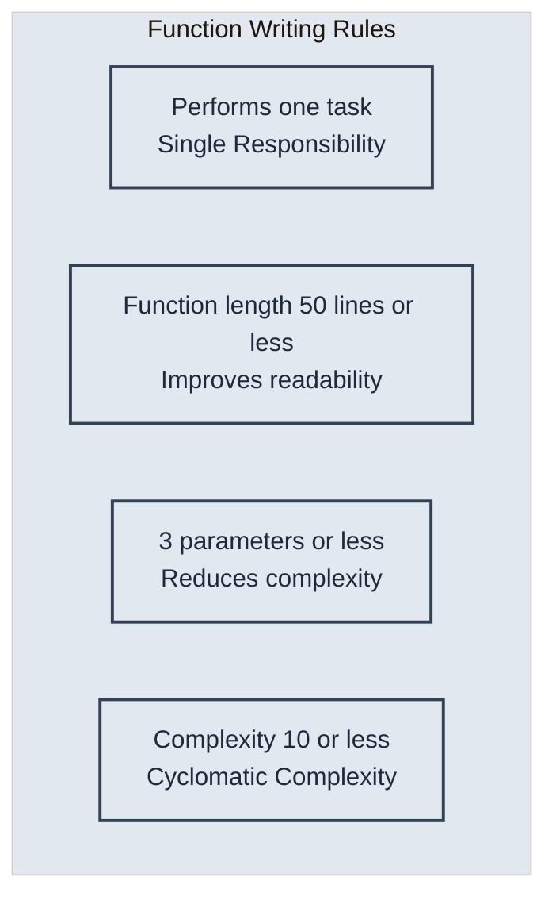

### Function Writing Rules

### Error Handling
```typescript
// All asynchronous functions use try-catch
try {
  const data = await fetchData();
  return { success: true, data };
} catch (error) {
  console.error('Error fetching data:', error);
  return { success: false, error: error.message };
}
```

### Commenting
- Explain 'why' the code does something, not 'what' it does.
- Document functions in JSDoc format.
- TODO comments should include an issue number.

```typescript
/**
 * Validates the user authentication token.
 * @param token - JWT token
 * @returns Whether the token is valid.
 */
const validateToken = (token: string): boolean => {
  // TODO(#123): Add token expiration validation logic
  return jwt.verify(token, SECRET_KEY);
}
```

## 4.4 Development Environment Automation

### Development Environment Setup

Specify essential tools and settings for a consistent development environment. Provide a step-by-step guide for new team members to quickly set up their development environment.

```markdown
## Development Environment

### Required Tools
- Node.js 18.0 or higher
- pnpm 8.0 or higher (use instead of npm)
- VS Code + Recommended extensions

### Initial Setup Script
# Install dependencies
pnpm install

# Set environment variables
cp .env.example .env

# Database migration
pnpm db:migrate

# Start development server
pnpm dev
```

### VS Code Settings
The `.vscode/settings.json` file will be applied automatically.
- Auto-formatting (on save)
- ESLint auto-fix
- Notification for recommended extension installation

### Code Generation Templates
When running `pnpm generate:component`:

1. Enter component name
2. Select component type (general/page/layout)
3. Files are generated automatically:
   - ComponentName.tsx
   - ComponentName.test.tsx
   - ComponentName.stories.tsx
   - index.ts

### Git Hooks

- pre-commit: Lint and formatting checks
- commit-msg: Commit message format validation
- pre-push: Run tests

## 4.5 Establishing Rules for Team Collaboration

### Code Review Guidelines

Establish systematic guidelines for effective code reviews. Provide practical guidance for both reviewers and authors, going beyond a simple checklist.

```markdown
## Code Review Guidelines

### PR Creation Rules
1. Title: `[Type] Brief description`
2. Body must include:
   - Summary of changes
   - Related issue number
   - Testing method
   - Screenshot (for UI changes)

### Review Checklist
- [ ] Does the code follow project conventions?
- [ ] Are tests sufficiently written?
- [ ] Is performance impact considered?
- [ ] Are there no security vulnerabilities?
- [ ] Is documentation updated?

### Merge Criteria
- At least 1 approval required
- All CI checks pass
- Conflicts resolved

### Branching Strategy

Define strategies and rules for systematic Git branch management. Introduce a practical branching strategy based on Git Flow.

## Git Branching Strategy

### Branch Naming Conventions
- feature/feature-name: New feature development
- fix/issue-number: Bug fix
- hotfix/description: Urgent fix
- refactor/target: Refactoring

### Branch Flow
main
  ├── develop
  │     ├── feature/user-auth
  │     ├── feature/payment
  │     └── fix/123
  └── hotfix/critical-bug

### Merge Strategy
- feature → develop: Squash merge
- develop → main: Merge commit
- hotfix → main: Cherry-pick
```


## Team Communication

### Issue Templates
Bug Report

- Steps to reproduce
- Expected behavior
- Actual behavior
- Environment information

Feature Request

- User story
- Acceptance criteria
- Technical considerations

### Daily Stand-up
Daily at 10 AM, share the following:

1. What I did yesterday
2. What I will do today
3. Blockers

### Technical Decision Log
Write Architecture Decision Records in the `docs/adr/` directory.

- Background
- Options considered
- Decision
- Outcome

## Real-world Example: Large-Scale E-commerce Project

Let's look at a systematic and comprehensive CLAUDE.md example that can be used in a real production environment.

````markdown
# E-Commerce Project Guidelines for Claude Code

## Project Overview
Large-scale e-commerce platform (1 million MAU daily)

## Core Tech Stack
- Frontend: Next.js 14, TypeScript, Tailwind CSS
- State: Zustand + React Query
- Backend: Node.js, Express, PostgreSQL
- Infrastructure: AWS, Docker, K8s

## Domain Knowledge

### Business Terminology
- SKU: Stock Keeping Unit
- GMV: Gross Merchandise Volume
- AOV: Average Order Value
- Cart Abandonment

### Core Domain Model
```typescript
interface Product {
  id: string;
  sku: string;
  name: string;
  price: Money;
  inventory: Inventory;
  category: Category;
}

interface Order {
  id: string;
  userId: string;
  items: OrderItem[];
  status: OrderStatus;
  payment: Payment;
  shipping: Shipping;
}
```

## Performance Requirements
- Page load: Within 3 seconds
- API response: Within 200ms
- 99.9% availability

## Security Rules
- Validate all user input
- Prevent SQL Injection
- Prevent XSS
- Encrypt sensitive information

## Test Strategy
- Unit tests: 80% coverage
- Integration tests: Core flows
- E2E tests: Purchase flow

## Deployment Process
1. Develop on feature branch
2. Create PR and review
3. Merge to develop branch
4. Auto-deploy to staging
5. QA verification
6. Deploy to production (approval required)

## Claude Code Special Instructions
- Always consider performance when writing code.
- Maintain a scalable architecture.
- Adhere to microservice boundaries.
- Prioritize asynchronous processing.
- Error logging is mandatory.
````

## Pro Tips: Optimizing CLAUDE.md

### 1. Section Priority

Structuring the content of CLAUDE.md by importance allows Claude Code to recognize rules more effectively.

```markdown
# CLAUDE.md

## 🚨 Critical Rules (Always Adhere)
- Never push directly to the main branch.
- All API keys must be environment variables.
- Do not commit code without tests.

## 📋 General Guidelines
- Use functional programming where possible.
- Minimize comments; explain with code.

## 💡 Recommendations
- Discuss with the team before introducing new libraries.
- Optimize performance after measurement.
```

### 2. Dynamic Updates

You can make Claude Code recognize new rules when CLAUDE.md is updated.

```bash
# Notify Claude Code when CLAUDE.md is updated
claude "The CLAUDE.md file has been updated.
Please review the new rules and summarize them."
```

### 3. Environment-Specific Configuration Management

Systematically manage different configurations for various development environments.

## Environment-Specific Settings

### Development Environment
- Log level: DEBUG
- Dummy data can be used
- Display detailed error information

### Production Environment
- Log level: ERROR
- Use only real data
- Generalize error messages


### 4. Continuous Improvement and Version Control

CLAUDE.md itself should be version-controlled and continuously improved like software.

## CLAUDE.md Version Control

### v2.1.0 (2024-03-15)
#### Added
- New security rule (SQL Injection prevention)
- React 18 hooks usage guidelines

#### Changed
- Upgraded TypeScript configuration to strict mode
- Strengthened API response time criteria to 200ms

#### Removed
- Discontinued support for legacy Internet Explorer

### v2.0.0 (2024-02-01)
#### Major Changes
- Transitioned to microservice architecture
- New branching strategy (Git Flow → GitHub Flow)


**Improvement Cycle Example**
```bash
# Monthly CLAUDE.md review
claude "Analyze our team's development patterns over the past month
and find areas for improvement in CLAUDE.md."

# Rule effectiveness analysis
claude "Analyze the codebase to see if the current CLAUDE.md rules
are actually being followed and report the compliance rate."

# Suggest new rules
claude "Analyze recently occurred bugs and suggest new rules
that could prevent them."
```

## Conclusion

In this chapter, we systematically learned how to customize projects using CLAUDE.md.

### Core Learnings

**1. Strategic Configuration Setup**
- **Priority-Based Rule Structure**: Apply rules stepwise based on importance.
- **Context Awareness**: Custom settings reflecting project characteristics and team culture.
- **Environment-Specific Optimization**: Differentiated approach for dev/staging/production environments.

**2. Practical Operation Methods**
- **Dynamic Updates**: Impact analysis and gradual application of rule changes.
- **Continuous Improvement**: Data-driven measurement and improvement of rule effectiveness.
- **Enhanced Team Collaboration**: Maintaining consistent code quality through clear guidelines.

### Practical Application Roadmap

**Step 1: Create Basic CLAUDE.md (1 week)**

- Define project structure and basic coding style.
- Set essential security rules and quality standards.
- Unify team commit message rules.

**Step 2: Separate Environment-Specific Settings (2 weeks)**

- Refine rules for dev/staging/production environments.
- Integrate automation scripts and CI/CD settings.
- Standardize code review process.

**Step 3: Advancement and Optimization (Continuous)**

- Improve rules based on team feedback.
- Adjust quality standards based on performance metrics.
- Update guidelines when introducing new technologies.

### Strategic Value of CLAUDE.md

1. **Ensures Consistency**: All team members generate code to the same quality standard.
2. **Accelerates Learning**: Faster onboarding and productivity improvement for new team members.
3. **Systematizes Knowledge**: Converts team's tacit knowledge into explicit rules.
4. **Automates Quality**: Guarantees a certain level of quality without manual review.
5. **Propagates Culture**: Reflects team's development philosophy and values in code.

**The important thing is that CLAUDE.md is not just a rule document, but a living guidebook embodying the team's development culture and philosophy.** It should be utilized as a tool that evolves with the team's growth through regular updates and continuous improvement.

In the next chapter, based on these settings, we will explore specific strategies and best practices for effectively utilizing Claude Code with various frameworks.

\newpage

# Chapter 5: Best Practices for Each Framework

> "Use the right tool for the right job." - Programming Proverb

```mermaid
%%{init: {"theme": "base", "themeVariables": {"primaryColor": "#f8fafc", "primaryTextColor": "#1e293b", "primaryBorderColor": "#e2e8f0", "lineColor": "#94a3b8", "secondaryColor": "#f1f5f9", "tertiaryColor": "#e2e8f0"}}}%%
mindmap
  root((Learning Objectives))
    Strategy Formulation
      Understanding framework-specific characteristics
      Optimized utilization strategies
      Establishing development patterns
    Key Frameworks
      Mastering React/Next.js
      Utilizing Node.js/Express
      Django development patterns
    Code Quality Management
      CLAUDE.md configuration
      Maintaining consistent quality
      Team collaboration rules
    Migration
      Framework transition support
      Effective utilization methods
      Practical application skills
```

## Learning Objectives

## Overview

In modern software development, frameworks are key factors that determine development efficiency and code quality. Each framework has its own unique philosophy, design patterns, and best practices, requiring completely different approaches for the same functionality depending on the framework.

Claude Code deeply understands these framework-specific characteristics and can generate code that adheres to the idioms and best practices of each framework. This chapter will systematically explore strategies and practical applications for optimizing Claude Code for major frameworks.

## 5.1 React/Next.js Projects

React and Next.js are core technologies in modern frontend development, enabling efficient construction of complex user interfaces through component-based architecture and declarative programming. Claude Code fully supports React's functional component patterns, Next.js's App Router structure, and integration with modern state management libraries.

### Initial Setup for React Projects

When starting a React project, selecting tools appropriate for the project's scale and requirements is crucial. Claude Code can combine industry-standard tools to create a scalable and maintainable project structure.

```bash
# Create a React project using Vite
claude "Create a new React TypeScript project with Vite.
Include Tailwind CSS, React Router, and React Query,
and set up the folder structure according to best practices."
```

Claude Code generates the following structure:

```
src/
├── components/
│   ├── common/        # Common components like Button, Input
│   ├── features/      # Feature-specific components
│   └── layouts/       # Header, Footer, etc.
├── hooks/            # Custom hooks
├── pages/            # Page components for each route
├── services/         # API communication
├── store/            # Global state management
├── utils/            # Utility functions
└── types/            # TypeScript type definitions
```

### React Component Development Patterns

React components should be designed as reusable and testable units. Claude Code can create components that clearly separate roles and responsibilities and maintain an appropriate level of abstraction.

**1. Component Creation Request - Practical Examples**

Effective component development requires clear requirement definitions and comprehensive requests that include testing and documentation. The following are commonly used patterns in real projects.

```bash
# Basic component creation
claude "Create a UserProfile component.
It should display a profile image, name, and introduction,
and support an edit mode.
Also, write Storybook stories and test code."

# Advanced data table component
claude "Create a DataTable component.
- Support sorting, filtering, and pagination
- Selectable rows and bulk actions
- Performance optimization with virtual scrolling
- Type safety with TypeScript generics
- Accessibility (a11y) compliance"

# Complex form component
claude "Create a MultiStepForm component.
- Integrate React Hook Form and Zod validation
- Step-by-step progress display and navigation
- Auto-save and draft functionality
- Error state handling and user feedback
- Conditional field display for each step"
```

**2. State Management Patterns**

```bash
# Authentication state management
claude "Create a Context and custom hook to manage user
authentication state globally.
It needs login, logout, and token refresh functionality."

# Complex business logic state management
claude "Implement e-commerce shopping cart state management.
- Configure state store with Zustand
- Logic for adding/removing/changing quantity of products
- Apply discount coupons and calculate prices
- Synchronize with localStorage
- Handle pessimistic/optimistic updates"

# Server state and caching
claude "Set up server state management using React Query.
- API response caching strategy
- Background refetching and stale time settings
- Infinite scroll data fetching
- Error retry logic and offline support"
```

**3. Performance Optimization Strategies**

```bash
# Re-rendering optimization
claude "Apply React.memo, useMemo, and useCallback to this
component to prevent unnecessary re-renders."

# Code splitting and lazy loading
claude "Apply code splitting to this application.
- Route-level lazy loading
- Dynamic import of heavy components
- Library bundle splitting
- Add loading spinners and error boundaries"

# Large list optimization
claude "Implement a virtual scroll component that efficiently
renders 10,000 items.
- Utilize react-window library
- Support dynamic item height
- Integrate infinite scroll and pagination"

# Image optimization
claude "Optimize the performance of the image gallery.
- Lazy loading and preloading strategies
- WebP format support and fallback
- Image compression and resizing
- Implement progressive loading"
```

### Next.js Specific Features - Practical Application

**1. App Router Advanced Patterns**

```bash
# Comprehensive blog system
claude "Create a blog with Next.js 14 App Router.
Utilize dynamic routing, metadata optimization,
and ISR (Incremental Static Regeneration)."

# Multilingual support and internationalization
claude "Implement multilingual support in Next.js.
- i18n routing setup
- Translation handling in Server Components
- Dynamic translation loading and fallback
- hreflang tags for SEO optimization"

# Complex authentication system
claude "Implement a system supporting multiple authentication providers with NextAuth.js.
- OAuth (Google, GitHub), email, credential login
- Role-Based Access Control (RBAC)
- Session management and security hardening
- API route protection middleware"
```

**2. Server Components Patterns**

```bash
claude "Refactor this page into a Server Component.
Fetch data on the server and separate interactions into Client Components."
```

**3. API Routes Design**

```bash
claude "Implement a RESTful API with Next.js API routes.
Handle authentication with middleware and add request validation with Zod."
```

### React/Next.js CLAUDE.md Example

```markdown
# React/Next.js Project Guidelines

## Component Rules
- Use only functional components
- Define Props with interfaces
- One file per component

## State Management
- Local state: useState
- Server state: React Query (TanStack Query)
- Global state: Zustand

## Folder Structure
```
components/
├── Button/
│   ├── Button.tsx
│   ├── Button.test.tsx
│   ├── Button.stories.tsx
│   └── index.ts
```

## Performance Optimization
- Use next/image for images
- Code splitting with dynamic imports
- Maintain Lighthouse score 90+
```

## 5.2 Node.js/Express Backend

Node.js and Express are the most widely used backend technology stack in the JavaScript ecosystem. Leveraging the advantages of event-driven asynchronous architecture, they offer high performance and scalability, and Claude Code supports the construction of robust and maintainable server applications.

### Structuring Express Servers - Enterprise Patterns

For scalable Express applications, layered architecture and separation of concerns are key. Claude Code can generate server structures that follow industry-standard architectural patterns.

```bash
# Basic REST API server
claude "Create a scalable REST API server with Express.js.
Use a layered architecture (Controller-Service-Repository),
and include TypeScript, JWT authentication, error handling, and logging."

# Microservice pattern
claude "Implement a microservice architecture with Express.
- Inter-service communication (HTTP/gRPC)
- API Gateway pattern
- Service discovery and load balancing
- Distributed logging and tracing
- Circuit Breaker pattern"

# High-performance API server
claude "Create an Express API to handle high-volume traffic.
- Clustering and worker process management
- Session and caching with Redis
- Request limiting and DDoS protection
- Database connection pooling
- APM monitoring integration"

# GraphQL API server
claude "Create an API server integrating GraphQL with Express.
- Apollo Server setup
- Schema stitching and federation
- Prevent N+1 queries with DataLoader
- Authentication and authorization
- Query complexity limiting"
```

**Enterprise-Grade Project Structure**

```mermaid
%%{init: {"theme": "base", "themeVariables": {"primaryColor": "#f8fafc", "primaryTextColor": "#1e293b", "primaryBorderColor": "#e2e8f0", "lineColor": "#94a3b8", "secondaryColor": "#f1f5f9", "tertiaryColor": "#e2e8f0"}}}%%
graph TD
    A[src/] --> B[controllers/]
    A --> C[services/]
    A --> D[repositories/]
    A --> E[models/]
    A --> F[middleware/]
    A --> G[routes/]
    A --> H[config/]
    A --> I[utils/]
    A --> J[types/]
    A --> K[tests/]
    A --> L[docs/]
    
    B -.-> |HTTP Request/Response Handling| B1[Request Handler]
    C -.-> |Business Logic| C1[Business Logic]
    D -.-> |Data Access Layer| D1[Data Access]
    E -.-> |Data Models and Schemas| E1[Schema Definition]
    F -.-> |Authentication, Logging, Validation| F1[Middleware Functions]
    G -.-> |API Route Definitions| G1[Route Definitions]
    H -.-> |Environment Configuration| H1[Configuration]
    I -.-> |Common Utilities| I1[Utility Functions]
    J -.-> |TypeScript Type Definitions| J1[Type Definitions]
    K -.-> |Test Files| K1[Test Suites]
    L -.-> |API Documentation| L1[Documentation]
```

**Separation of Responsibilities by Layer**

```mermaid
%%{init: {"theme": "base", "themeVariables": {"primaryColor": "#f8fafc", "primaryTextColor": "#1e293b", "primaryBorderColor": "#e2e8f0", "lineColor": "#94a3b8", "secondaryColor": "#f1f5f9", "tertiaryColor": "#e2e8f0"}}}%%
graph LR
    A[Controllers] --> B[Services]
    B --> C[Repositories]
    C --> D[Models]
    
    A1[Request/Response Handling] -.-> A
    B1[Business Logic] -.-> B
    C1[Data Access] -.-> C
    D1[Data Models] -.-> D
    
    E[Middlewares] -.-> A
    F[Utils] -.-> B
    G[Config] -.-> B
    H[Types] -.-> A
    H -.-> B
    H -.-> C
```

### Backend Development Patterns

**1. RESTful API Design**

```bash
claude "Design a RESTful API for user management.
Support CRUD operations, pagination, filtering, and sorting,
and automatically generate OpenAPI (Swagger) documentation."
```

**2. Database Integration**

```bash
claude "Create User, Post, and Comment models using Prisma ORM.
Include relationship setup, migrations, and seed data."
```

**3. Authentication/Authorization Implementation**

```bash
claude "Implement a JWT-based authentication system.
Use access tokens and refresh tokens,
and add Role-Based Access Control (RBAC)."
```

### Microservice Architecture

```bash
claude "Decompose this monolithic app into microservices.
Divide into User Service, Product Service, and Order Service,
and design an API Gateway and inter-service communication methods."
```

### Node.js/Express CLAUDE.md Example

```markdown
# Node.js/Express API Guidelines

## API Design Principles
- Adhere to RESTful principles
- Consistent response format
- Use appropriate HTTP status codes

## Response Format
```json
{
  "success": true,
  "data": {},
  "message": "Success",
  "timestamp": "2024-01-01T00:00:00Z"
}
```

## Error Handling
- All errors to a central error handler
- Error logging mandatory
- Generalized messages to clients

## Security
- Rate limiting for all endpoints
- SQL Injection prevention
- Input validation mandatory
```

## 5.3 Python/Django Applications

Django is a Python web framework based on the "batteries included" philosophy, featuring a powerful ORM, admin interface, and built-in security features. When used with Django REST Framework, robust API servers can be quickly built, and Claude Code supports the development of scalable applications adhering to Django's best practices.

### Django Project Setup

The success of a Django project is determined by initial setup and architectural design. Claude Code can generate project structures that follow Django's app-based modularization and configuration management best practices.

```bash
claude "Create a blog API with Django REST Framework.
Include user authentication, post CRUD, comments, and tag functionality,
and set up test code and API documentation."
```

### Django Development Patterns

**1. Model Design**

```bash
claude "Design Django models for e-commerce.
Define Product, Category, Order, and User models and their relationships,
and customize the Admin interface."
```

**2. ViewSet and Serializer**

```bash
claude "Create a ViewSet and Serializer for the Product model.
Support filtering, searching, and sorting,
and efficiently handle nested relationships."
```

**3. Asynchronous Tasks**

```bash
claude "Set up email sending and image processing
to be handled asynchronously using Celery."
```

### Python/Django CLAUDE.md Example

```markdown
# Django Project Guidelines

## App Structure
- Separate apps by feature
- Max 10 models per app
- No circular dependencies

## Model Design
- created_at, updated_at for all models
- Use soft delete (is_deleted field)
- Define relationships explicitly

## API Design
- ViewSet usage recommended
- Custom actions with @action decorator
- Default pagination 20 items

## Testing
- Test models, views, and serializers separately
- Generate test data with Factory Boy
- Coverage 80% or higher
```

## 5.4 Mobile App Development (React Native/Flutter)

In mobile app development, cross-platform solutions significantly improve development efficiency and maintainability. React Native enables native app development using JavaScript and React knowledge, while Flutter allows for high-performance UI implementation with the Dart language. Claude Code understands the characteristics of each platform and can generate platform-optimized code.

### React Native Projects

React Native is a framework that applies React's component model to the mobile environment, allowing native mobile app development using web development experience.

```bash
claude "Create a cross-platform mobile app with Expo.
Set up navigation, state management, and native feature access,
and handle iOS and Android style differences."
```

### React Native Development Patterns

**1. Navigation Structure**

```bash
claude "Implement complex navigation with React Navigation.
Combine Tab Navigator, Stack Navigator, and Drawer,
and set up deep linking."
```

**2. Native Module Integration**

```bash
claude "Implement functionality to access camera and location information.
Include permission request handling and error handling."
```

### Flutter Projects

```bash
claude "Create a Material Design app with Flutter.
Include multilingual support, dark mode, and responsive layout,
and apply the Clean Architecture pattern."
```

### Mobile App CLAUDE.md Example

```markdown
# Mobile App Guidelines

## Architecture
- Use MVVM pattern
- Business logic in ViewModel
- View displays state only

## Performance
- Virtualization mandatory for lists
- Image optimization and caching
- Maintain 60fps animations

## Platform-Specific Handling
```javascript
Platform.select({
  ios: { /* iOS styles */ },
  android: { /* Android styles */ }
})
```

## Testing
- Component tests: Jest
- E2E tests: Detox
- Platform-specific tests mandatory
```

## 5.5 Data Science Projects - MLOps Integration

Data science and machine learning fields involve complex workflows with various stages from exploratory analysis to production deployment. Claude Code understands the main tools used by data scientists and modern MLOps pipelines, supporting the entire process from experimentation to deployment.

### Modern Data Science Stack

For the success of data science projects, reproducible and scalable MLOps pipelines are needed beyond simple analysis tools.

```mermaid
%%{init: {"theme": "base", "themeVariables": {"primaryColor": "#f8fafc", "primaryTextColor": "#1e293b", "primaryBorderColor": "#e2e8f0", "lineColor": "#94a3b8", "secondaryColor": "#f1f5f9", "tertiaryColor": "#e2e8f0"}}}%%
graph TB
    subgraph "Data Collection"
        A1[Raw Data] --> A2[Data Pipeline]
        A2 --> A3[Clean Data]
    end
    
    subgraph "Experimentation & Development"
        B1[Jupyter Notebooks] --> B2[Feature Engineering]
        B2 --> B3[Model Training]
        B3 --> B4[Experiment Tracking]
    end
    
    subgraph "Model Operations"
        C1[Model Registry] --> C2[API Serving]
        C2 --> C3[Monitoring]
        C3 --> C4[Retraining]
        C4 --> C1
    end
    
    A3 --> B1
    B4 --> C1
    C3 --> A2
```

### Jupyter Notebook Environment

Jupyter Notebook is a core tool for data science projects, allowing integrated management of code, visualizations, and documentation in a single environment. Claude Code supports the construction of reproducible and systematic analysis environments.

```bash
claude "Set up a Jupyter environment for a machine learning project.
Build data analysis, visualization, and model training pipelines,
and set up experiment tracking."
```

### Data Analysis Workflow - Industry Standard Approach

**1. Data Preprocessing Pipeline**

```bash
# Basic data preprocessing
claude "Analyze and preprocess this CSV data.
Perform missing value imputation, outlier detection, and feature engineering,
and visualize each step."

# Advanced feature engineering
claude "Implement feature engineering for time series data.
- Create time-based features (lag, rolling window)
- Decompose seasonality and trend
- Periodic features via Fourier transform
- Scaling and normalization pipeline
- Categorical variable encoding strategies"

# Large-scale data processing
claude "Create a large-scale data preprocessing pipeline using Dask.
- Chunk-wise parallel processing
- Memory-efficient data loading
- Distributed computing environment setup
- Progress monitoring"
```

**2. Model Development and Experiment Management**

```bash
# AutoML and model comparison
claude "Compare and evaluate multiple machine learning models.
Perform cross-validation, hyperparameter tuning,
and summarize results in a table."

# Deep learning model development
claude "Implement an image classification model with PyTorch.
- Utilize Transfer Learning
- Data augmentation and normalization
- Learning rate scheduling and early stopping
- Model checkpointing and resume functionality
- TensorBoard visualization"

# MLflow experiment tracking
claude "Build an experiment tracking system using MLflow.
- Log model metrics and parameters
- Version control artifacts
- Set up model registry
- A/B testing framework
- Experiment comparison dashboard"
```

**3. Model Deployment and Operations**

```bash
# API serving
claude "Create an API to serve the trained model with FastAPI.
Include input validation, prediction, and monitoring features."

# Real-time prediction system
claude "Build a real-time ML pipeline using Kafka and Redis.
- Streaming data preprocessing
- Real-time feature store
- Integrate batch and online predictions
- Model performance monitoring
- Automated retraining triggers"

# Container deployment
claude "Deploy ML models with Docker and Kubernetes.
- Multi-stage Docker build
- GPU-supported containers
- Autoscaling setup
- Health checks and log collection
- CI/CD pipeline integration"

# Model monitoring
claude "Build a production ML model monitoring system.
- Data drift detection
- Model performance degradation alerts
- Bias monitoring
- Explainable AI dashboard
- Incident response playbook"
```

### Data Science CLAUDE.md Example

Comprehensive guidelines for modern data science projects.

```markdown
# Data Science Project Guidelines

## Project Structure
```
project/
├── data/           # Raw data
├── notebooks/      # Experiment notebooks
├── src/           # Reusable code
├── models/        # Trained models
└── reports/       # Analysis results
```

## Coding Rules
- Notebooks for experimentation, production code in .py
- All experiments must be trackable
- Ensure reproducibility (fix seeds)

## Data Handling
- Do not modify original data
- Document preprocessing pipelines
- Data version control

## Model Management
- Track experiments with MLflow
- Model version control
- Support A/B testing
```

## Framework-Independent Best Practices

In addition to framework-specific approaches, there are core principles applicable to all frameworks. Understanding and applying these principles will yield consistent quality results regardless of the framework used.

### 1. Initial Exploration Strategy

Systematic exploration and understanding are key to success when joining new or existing projects. Claude Code can help grasp the overall structure and context of a project.

```bash
# When starting a new project
claude "Analyze the structure and technology stack used in this project.
Explain the roles of major files and the data flow."
```

### 2. Incremental Improvement

```bash
# Improving existing code
claude "Refactor this code.
First, write tests to ensure functionality,
then improve it step by step."
```

### 3. Documentation Automation

```bash
# Generate documentation
claude "Update the project's README.md.
Include installation instructions, usage, API documentation, and contribution guidelines."
```

### 4. Performance Profiling

```bash
# Performance analysis
claude "Profile the performance of this application,
find bottlenecks, and suggest optimization measures."
```

## Practical Tip: Framework Transition and Modernization

Framework migration is an important project for resolving technical debt and improving performance. Claude Code can help establish and execute systematic, risk-minimizing migration strategies.

### Legacy System Modernization Strategy

Transitioning an existing system to a modern architecture means more than just code conversion; it implies a complete system redesign.

### Migration Strategy Formulation - Real-world Case

A phased and incremental approach is needed when migrating an existing project to a different framework.

```mermaid
%%{init: {"theme": "base", "themeVariables": {"primaryColor": "#f8fafc", "primaryTextColor": "#1e293b", "primaryBorderColor": "#e2e8f0", "lineColor": "#94a3b8", "secondaryColor": "#f1f5f9", "tertiaryColor": "#e2e8f0"}}}%%
graph TD
    A[Analyze Current System] --> B[Formulate Migration Plan]
    B --> C[Pilot Project]
    C --> D{Success?}
    D -->|Success| E[Phased Migration]
    D -->|Failure| F[Revise Plan]
    F --> C
    E --> G[Performance Validation]
    G --> H{Goal Achieved?}
    H -->|No| I[Optimization]
    I --> G
    H -->|Yes| J[Full System Transition]
    J --> K[Monitoring & Maintenance]
    
    style A fill:#e2e8f0
    style J fill:#dcfce7
    style K fill:#dcfce7
```

```bash
# 1. Dependency and Architecture Analysis
claude "Analyze the core functionality and structure of this Express app.
- Check dependency tree and circular references
- Identify business-critical modules
- Evaluate test coverage
- Identify performance bottlenecks"

# 2. Detailed Migration Roadmap
claude "Create a plan to migrate this app to Fastify.
- Apply Strangler Fig pattern
- Phased rollback plan
- Set performance benchmarks
- Include team training schedule
- Risk assessment and mitigation strategy"

# 3. Incremental Migration Execution
claude "Migrate the authentication module to Fastify first.
- Implement traffic splitting
- Set up monitoring and alerts
- Ensure data consistency
- Automated test suite
- Detect performance regressions"

# 4. Complex Frontend Migration
claude "Migrate React class components to functional components.
- Convert lifecycle methods to hooks
- Modernize state management
- Apply code splitting and lazy loading
- Enhance TypeScript type safety
- Identify performance optimization opportunities"

# 5. Database Migration
claude "Create a plan to migrate from MySQL to PostgreSQL.
- Schema conversion and data type mapping
- Zero-downtime data migration strategy
- Query optimization and performance tuning
- Backup and recovery procedures
- Validation and testing plan"
```

### Framework-Specific Success Metrics

It's crucial to set specific KPIs to measure the success of each framework transition project.

```bash
# Performance Metrics Monitoring
claude "Create a dashboard comparing performance before and after migration.
- Compare response time and throughput
- Memory usage and CPU efficiency
- Bundle size and loading time
- User experience metrics (LCP, FID, CLS)
- Developer productivity metrics"

# Quality Metrics Tracking
claude "Build a system to track code quality improvements.
- Changes in test coverage
- Reduction in code complexity
- Resolution of security vulnerabilities
- Reduction in technical debt
- Team satisfaction surveys"
```

## Conclusion

Mastering framework-specific best practices is key to effectively utilizing Claude Code. Each framework has its unique philosophy and design principles, and understanding and applying them is the foundation for successful development.

### Core Success Factors

```mermaid
%%{init: {"theme": "base", "themeVariables": {"primaryColor": "#f8fafc", "primaryTextColor": "#1e293b", "primaryBorderColor": "#e2e8f0", "lineColor": "#94a3b8", "secondaryColor": "#f1f5f9", "tertiaryColor": "#e2e8f0"}}}%%
mindmap
  root((Framework Success Factors))
    Ecosystem Understanding
      Philosophy and Principles
        Mastering core concepts
        Adhering to design principles
      Idioms and Patterns
        Community best practices
        Applying proven conventions
      Toolchain
        Utilizing dedicated tools
        Library ecosystem
    Practical Application
      Incremental Adoption
        Phased approach
        Minimizing risk
      Performance-Oriented
        Optimization strategies
        Benchmarking
      Team Training
        Systematic learning
        Knowledge sharing
    Continuous Improvement
      Monitoring
        Quantitative measurement
        Performance tracking
      Feedback Loop
        Process improvement
        Incorporating team feedback
      Latest Trends
        Tracking updates
        Learning new features
```

### Practical Checklist

**Project Kick-off**

- [ ] Create framework-specific CLAUDE.md file
- [ ] Establish team coding conventions and style guides
- [ ] Standardize development environment and toolchain
- [ ] Set performance benchmarks and quality standards

**Development Process**

- [ ] Code review for adherence to framework best practices
- [ ] Regular performance profiling and optimization
- [ ] Operate automated testing and CI/CD pipelines
- [ ] Manage technical debt and plan refactoring

**Migration Projects**

- [ ] Detailed migration roadmap and risk assessment
- [ ] Bridging strategy for incremental transition
- [ ] System to prevent performance and stability regressions
- [ ] Team training and knowledge transfer program

**The true value of Claude Code lies not merely in generating code, but in helping the entire team consistently apply the philosophy and best practices of each framework.** This enables the simultaneous achievement of standardized development quality and maximized team productivity.

In the next chapter, we will explore strategies for optimizing Claude Code for specific programming languages. Let's delve into how to build a more effective development environment by understanding the unique characteristics and ecosystems of languages.

\newpage

# Chapter 6: Language-Specific Utilization Strategies

> "Language shapes the way we think." - Benjamin Lee Whorf

```mermaid
%%{init: {"theme": "base", "themeVariables": {"primaryColor": "#f8fafc", "primaryTextColor": "#1e293b", "primaryBorderColor": "#e2e8f0", "lineColor": "#94a3b8", "secondaryColor": "#f1f5f9", "tertiaryColor": "#e2e8f0"}, "flowchart": {"htmlLabels": false, "useMaxWidth": false}}}%%
mindmap
  root((Learning Objectives))
    Strategy Formulation
      Language-specific optimization strategies
      Development environment configuration
      Toolchain selection
    Type System Utilization
      Ensuring type safety
      Static analysis tools
      Runtime validation
    Multi-language Projects
      Interoperability between languages
      API interface design
      Type sharing strategies
    Language Selection Guide
      Requirements analysis
      Performance vs. productivity
      Team competency consideration
```

## Learning Objectives

Upon completing this chapter, you will be able to:

- Formulate Claude Code optimization strategies for major programming languages.
- Effectively utilize language-specific type systems and safety features.
- Design multi-language projects considering interoperability between languages.
- Select the optimal programming language based on project requirements.

## Overview

Programming languages are more than just tools; they are crucial elements that shape a developer's way of thinking and problem-solving approach. Each language has its own unique philosophy, syntax, and ecosystem, and deeply understanding and utilizing these characteristics is key to successful development.

Claude Code understands the characteristics and best practices of various programming languages, enabling it to generate code that maximizes the strengths of each language. This chapter will systematically explore strategies and practical applications for optimizing Claude Code for major programming languages.

## 6.1 TypeScript/JavaScript

TypeScript and JavaScript are central to the modern web development ecosystem, offering both the flexibility of dynamic typing and the safety of static typing. Claude Code leverages TypeScript's powerful type system to generate safe and maintainable code, and can optimize JavaScript's functional programming paradigm and asynchronous processing features.

### TypeScript Enterprise Project Setup

A robust TypeScript project starts with strict type checking and integration of modern development tools. Claude Code can suggest optimal configurations tailored to the project's scale and requirements.

```bash
# Basic TypeScript project setup
claude "Set up a TypeScript project using strict type checking.
Optimize tsconfig.json, and configure ESLint and Prettier for TypeScript."

# Large-scale monorepo setup
claude "Set up a large-scale TypeScript monorepo.
- Configure Nx workspace
- Manage inter-project dependencies
- Build system for shared libraries
- Apply consistent code style
- Detect cyclic dependencies"

# Micro-frontend architecture
claude "Configure a TypeScript micro-frontend architecture.
- Set up Module Federation
- Ensure runtime type safety
- Sidecar loading and version management
- Shared state and event handling
- Testing strategy and mock setup"
```

**Enterprise-grade tsconfig.json Configuration**

```json
{
  "compilerOptions": {
    // Support for latest JavaScript standards
    "target": "ES2022",
    "module": "ESNext",
    "lib": ["ES2022", "DOM", "DOM.Iterable"],
    
    // Maximum type safety
    "strict": true,
    "noUncheckedIndexedAccess": true,
    "noImplicitOverride": true,
    "exactOptionalPropertyTypes": true,
    "noImplicitReturns": true,
    "noFallthroughCasesInSwitch": true,
    "noUncheckedSideEffectImports": true,
    
    // Additional strictness options
    "allowUnusedLabels": false,
    "allowUnreachableCode": false,
    "forceConsistentCasingInFileNames": true,
    "skipLibCheck": true,
    
    // All types and exports
    "moduleResolution": "bundler",
    "allowImportingTsExtensions": true,
    "noEmit": true,
    "isolatedModules": true,
    
    // Performance optimization
    "incremental": true,
    "tsBuildInfoFile": ".tsbuildinfo",
    
    // Path mapping
    "baseUrl": ".",
    "paths": {
      "@/*": ["./src/*"],
      "@/components/*": ["./src/components/*"],
      "@/utils/*": ["./src/utils/*"],
      "@/types/*": ["./src/types/*"]
    }
  },
  "include": [
    "src/**/*",
    "types/**/*",
    "tests/**/*"
  ],
  "exclude": [
    "node_modules",
    "dist",
    "build",
    "coverage"
  ]
}
```

### Advanced TypeScript Type Patterns

The true advantage of TypeScript lies beyond simple type checking; it's the ability to enforce complex business logic at the type level.

```bash
# Apply business rules with Branded Types
claude "Use Branded Types to ensure business logic safety.
- Define domain types like UserId, Email, PhoneNumber
- Integrate with runtime validation functions
- Ensure API response type safety
- Synchronize with database schema"

# Auto-generate API types with Conditional Types
claude "Create a system to automatically generate TypeScript types
from an OpenAPI schema using Conditional Types.
- Infer Path Parameter and Query Parameter types
- Automatically map Response types
- Differentiate types by HTTP Status Code
- Create error type unions"

# Implement DSL with Template Literal Types
claude "Use Template Literal Types to create a type-safe DSL.
- Type check CSS-in-JS
- Type safety for SQL query builder
- Autocomplete Event Names
- Validate i18n keys"
```

### Performance-Optimized TypeScript Patterns

In large-scale TypeScript applications, both compile time and runtime performance must be considered.

```bash
# Incremental type loading
claude "Optimize TypeScript compilation performance for a large project.
- Incremental builds with Project References
- Utilize Type-only imports
- Remove unused types
- Optimize type loading with dynamic imports
- Tune Watch mode performance"

# Runtime type validation optimization
claude "Implement runtime type validation without impacting performance.
- Runtime schema validation with Zod
- Optimize Type Guards
- Batch asynchronous validations
- Caching strategy and memoization
- Error boundaries and logging"

### Maximizing Type Safety

**1. Advanced Type Utilization**

```bash
claude "Migrate this JavaScript code to TypeScript.
Utilize union types, generics, and conditional types
to ensure maximum type safety."
```

**2. Improving Type Inference**

```bash
claude "The return type of this function is inferred too broadly.
Use type guards and const assertions to infer a more precise type."
```

**3. Runtime Validation with Zod**

```bash
claude "Create a system to validate API responses with Zod schemas.
Ensure TypeScript types are also generated automatically."
```

### Modern JavaScript Patterns

**1. Functional Programming**

```bash
claude "Refactor this imperative code into a functional style.
Maintain immutability, use pure functions,
and compose logic with function composition."
```

**2. Asynchronous Processing Optimization**

```bash
claude "Optimize the efficient handling of multiple API calls.
Use Promise.all and Promise.allSettled appropriately,
and add error handling and retry logic."
```

### TypeScript/JavaScript CLAUDE.md Example

```markdown
# TypeScript/JavaScript Guidelines

## Type Definition Rules
- Interface > Type Alias (if extensible)
- Prohibit `any` (use `unknown`)
- Prefer explicit return types

## Asynchronous Processing
```typescript
// Good example
const fetchData = async (): Promise<Result<Data, Error>> => {
  try {
    const data = await api.get('/data');
    return { ok: true, value: data };
  } catch (error) {
    return { ok: false, error };
  }
};
```

## Immutability
- Utilize `Object.freeze()`
- Copy with spread operator
- Consider using Immer library

## Error Handling
- Create custom errors by inheriting from `Error` class
- Utilize error boundaries
- Type-safe error handling
```

### TypeScript Practical Debugging and Monitoring

```bash
# Advanced debugging setup
claude "Set up an advanced debugging environment for a TypeScript project.
- Improve debugging performance with Source Map optimization
- Integrate with Chrome DevTools
- Track TypeScript compiler errors
- Runtime performance profiling
- Memory leak detection tools"

# Production monitoring
claude "Set up production monitoring for a TypeScript application.
- Collect runtime type errors
- Track performance bottlenecks
- Monitor bundle size
- Track TypeScript compilation time
- Code coverage reports"
```

## 6.2 Python - Enterprise Python

Python is a language with a philosophy of "readable code," enabling elegant solutions to complex problems through clear and concise syntax. Claude Code leverages Python's dynamic nature and Duck Typing advantages while supporting modern Python development patterns that enhance code stability through type hints and static analysis tools.

### Structuring Python Enterprise Projects

Scalable Python projects start with clear package structures and dependency management. Claude Code can suggest project structures adhering to PEP standards and modern development tool setups.

```bash
# Basic Python project setup
claude "Set up a Python package structure according to best practices.
Include pyproject.toml, virtual environment, type hints,
and test setup."

# Large-scale FastAPI application
claude "Build an enterprise-grade API server with FastAPI.
- Asynchronous database integration (SQLAlchemy 2.0)
- Data validation with Pydantic v2
- OAuth2/JWT authentication system
- Preparation for microservice architecture
- Monitoring and logging system"

# Data engineering pipeline
claude "Build a large-scale data pipeline with Apache Airflow.
- Automate ETL workflows
- Optimize Pandas/Polars performance
- Asynchronous processing of large data
- Error recovery and retry logic
- Monitoring and notification system"

# Machine learning production system
claude "Build an MLOps pipeline with Python.
- Experiment tracking and model versioning with MLflow
- Asynchronous batch training with Celery
- Model serving API with FastAPI
- Real-time model monitoring
- A/B testing framework"
```

**Enterprise-grade pyproject.toml Configuration**

```toml
[build-system]
requires = ["poetry-core>=1.0.0"]
build-backend = "poetry.core.masonry.api"

[tool.poetry]
name = "enterprise-python-app"
version = "0.1.0"
description = "Enterprise-grade Python application"
authors = ["Team <team@company.com>"]
readme = "README.md"
packages = [{include = "app", from = "src"}]

[tool.poetry.dependencies]
python = "^3.11"
fastapi = "^0.104.0"
uvicorn = {extras = ["standard"], version = "^0.24.0"}
sqlalchemy = "^2.0.0"
alembic = "^1.12.0"
pydantic = "^2.5.0"
celery = "^5.3.0"
redis = "^5.0.0"
structlog = "^23.2.0"
prometheus-client = "^0.19.0"

[tool.poetry.group.dev.dependencies]
pytest = "^7.4.0"
pytest-asyncio = "^0.21.0"
pytest-cov = "^4.1.0"
mypy = "^1.7.0"
black = "^23.11.0"
ruff = "^0.1.0"
pre-commit = "^3.5.0"

# Microservice tools
locust = "^2.17.0"  # Load testing
opentelemetry-api = "^1.21.0"  # Distributed tracing
jinja2 = "^3.1.0"  # Template engine

# Code quality tools
[tool.mypy]
python_version = "3.11"
strict = true
warn_return_any = true
warn_unused_configs = true
disallow_untyped_defs = true
disallow_incomplete_defs = true
check_untyped_defs = true
disallow_untyped_decorators = true
no_implicit_optional = true
warn_redundant_casts = true
warn_unused_ignores = true
warn_no_return = true
warn_unreachable = true
strict_equality = true

[tool.black]
line-length = 88
target-version = ['py311']
include = '\.pyi?$'
extend-exclude = '''
^/(
  (
      \.eggs
    | \.git
    | \.mypy_cache
    | \.tox
    | \.venv
    | _build
    | buck-out
    | build
    | dist
  )/
)
'''

[tool.ruff]
select = [
    "E",   # pycodestyle errors
    "W",   # pycodestyle warnings  
    "F",   # pyflakes
    "I",   # isort
    "B",   # flake8-bugbear
    "C4",  # flake8-comprehensions
    "UP",  # pyupgrade
    "N",   # pep8-naming
    "S",   # bandit
]
ignore = [
    "E501",  # line too long
    "B008",  # do not perform function calls in argument defaults
    "S101",  # use of assert
]
line-length = 88
target-version = "py311"

[tool.pytest.ini_options]
minversion = "7.0"
addopts = "-ra -q --cov=src --cov-report=term-missing --cov-report=html"
testpaths = ["tests"]
python_files = ["test_*.py"]
python_classes = ["Test*"]
python_functions = ["test_*"]
asyncio_mode = "auto"
```

### Advanced Type System and Static Analysis

Ensuring type safety while maintaining Python's dynamic nature is key to modern Python development.

```bash
# Advanced type hint patterns
claude "Add advanced type hints to this Python code.
- Abstraction with generics and protocols
- Precise type definitions with Union and Literal
- Runtime type checking with TypeGuard
- Create domain types with NewType
- Ensure mypy strict mode passes"

# Pydantic v2 advanced features
claude "Build an advanced data validation system with Pydantic v2.
- Field validators and model validators
- Asynchronous validators and custom serializers
- Complex data structures with Discriminated Unions
- Automatic JSON Schema generation
- Performance-optimized settings"

# Static analysis tool integration
claude "Set up static analysis tools for Python code quality.
- Maximum type checking with mypy + Pylance
- Fast linting and formatting with ruff
- Security vulnerability scanning with bandit
- Detect unused code with vulture
- Full CI/CD pipeline integration"
```

**Practical Type Hint Example**

```python
from typing import (
    AsyncGenerator, Awaitable, Callable, 
    Generic, Literal, Protocol, TypeGuard, 
    TypeVar, Union, overload
)
from dataclasses import dataclass
from pydantic import BaseModel, Field, field_validator
from datetime import datetime
from decimal import Decimal

# Domain Types with NewType
from typing import NewType
UserId = NewType('UserId', int)
Email = NewType('Email', str)
ProductId = NewType('ProductId', str)

# Protocol for dependency injection
class DatabaseProtocol(Protocol):
    async def execute(self, query: str) -> list[dict[str, any]]: ...
    async def fetch_one(self, query: str) -> dict[str, any] | None: ...

# Generic Repository Pattern
T = TypeVar('T', bound=BaseModel)

class Repository(Generic[T]):
    def __init__(self, db: DatabaseProtocol, model_class: type[T]) -> None:
        self._db = db
        self._model_class = model_class
    
    async def find_by_id(self, id_: int) -> T | None:
        result = await self._db.fetch_one(
            f"SELECT * FROM {self._model_class.__tablename__} WHERE id = {id_}"
        )
        return self._model_class(**result) if result else None

# Advanced Pydantic Models
class UserCreateRequest(BaseModel):
    email: Email = Field(..., pattern=r'^[\w\.-]+@[\w\.-]+\.\w+$')
    name: str = Field(..., min_length=1, max_length=100)
    age: int = Field(..., ge=18, le=120)
    
    @field_validator('email')
    @classmethod
    def validate_email_domain(cls, v: str) -> str:
        allowed_domains = ['company.com', 'partner.com']
        domain = v.split('@')[1]
        if domain not in allowed_domains:
            raise ValueError(f'Email domain must be one of {allowed_domains}')
        return v

# Type Guards for runtime validation
def is_valid_user_id(value: any) -> TypeGuard[UserId]:
    return isinstance(value, int) and value > 0

# Discriminated Union for complex data structures
class SuccessResponse(BaseModel):
    status: Literal['success'] = 'success'
    data: dict[str, any]
    timestamp: datetime = Field(default_factory=datetime.now)

class ErrorResponse(BaseModel):
    status: Literal['error'] = 'error'
    message: str
    error_code: int
    timestamp: datetime = Field(default_factory=datetime.now)

APIResponse = Union[SuccessResponse, ErrorResponse]

# Async Context Manager with proper typing
class AsyncDatabaseTransaction:
    def __init__(self, db: DatabaseProtocol) -> None:
        self._db = db
        self._transaction: any = None
    
    async def __aenter__(self) -> DatabaseProtocol:
        self._transaction = await self._db.begin()
        return self._db
    
    async def __aexit__(self, exc_type: type[Exception] | None, 
                       exc_val: Exception | None, 
                       exc_tb: any) -> None:
        if exc_type is None:
            await self._transaction.commit()
        else:
            await self._transaction.rollback()
```

### Python Performance Optimization - Enterprise Level

In large-scale Python applications, throughput, memory efficiency, and concurrency handling are all crucial.

```bash
# High-performance asynchronous system
claude "Build a high-volume asynchronous processing system.
- Handle large HTTP requests with asyncio + aiohttp
- Asynchronous database integration with asyncpg
- Async context managers and semaphores
- Backpressure and circuit management
- Error propagation and logging strategy"

# Memory optimization strategy
claude "Optimize large-scale data processing with Pandas/Polars.
- Chunk-wise streaming processing
- Optimize generators and iterators
- Memory-mapped files and Parquet format
- Parallel processing and multiprocessing
- Optimize garbage collection"

# Background task processing with Celery
claude "Build an enterprise-grade asynchronous task system with Celery.
- High-availability broker with Redis Sentinel
- Dynamic worker scaling
- Task priority and routing
- Failure handling and retry strategy
- Monitoring and metrics collection"

# Performance profiling and bottleneck analysis
claude "Find and optimize performance bottlenecks in a Python application.
- Profiling with cProfile and py-spy
- Memory usage analysis (memory_profiler)
- Database query optimization
- Caching strategy and memoization
- Utilize JIT compiler (Numba)"
```

**High-Performance Asynchronous Pattern Example**

```python
import asyncio
import aiohttp
import asyncpg
from typing import AsyncIterator, AsyncContextManager
from contextlib import asynccontextmanager
import structlog
from dataclasses import dataclass
from datetime import datetime

# Asynchronous database connection pool
class AsyncDatabasePool:
    def __init__(self, dsn: str, min_size: int = 10, max_size: int = 100):
        self.dsn = dsn
        self.min_size = min_size
        self.max_size = max_size
        self.pool: asyncpg.Pool | None = None
        self.logger = structlog.get_logger()
    
    async def initialize(self) -> None:
        """Initialize asynchronous connection pool"""
        self.pool = await asyncpg.create_pool(
            self.dsn,
            min_size=self.min_size,
            max_size=self.max_size,
            command_timeout=60
        )
        self.logger.info("Database pool initialized", 
                        min_size=self.min_size, max_size=self.max_size)
    
    @asynccontextmanager
    async def acquire(self) -> AsyncIterator[asyncpg.Connection]:
        """Acquire and automatically release connection"""
        if not self.pool:
            raise RuntimeError("Pool not initialized")
        
        async with self.pool.acquire() as conn:
            try:
                yield conn
            except Exception as e:
                self.logger.error("Database operation failed", error=str(e))
                raise
    
    async def close(self) -> None:
        """Close connection pool"""
        if self.pool:
            await self.pool.close()
            self.logger.info("Database pool closed")

# Asynchronous HTTP client wrapper
class AsyncHTTPClient:
    def __init__(self, timeout: int = 30, max_connections: int = 100):
        self.timeout = aiohttp.ClientTimeout(total=timeout)
        self.connector = aiohttp.TCPConnector(
            limit=max_connections,
            limit_per_host=20,
            keepalive_timeout=30
        )
        self.session: aiohttp.ClientSession | None = None
        self.logger = structlog.get_logger()
    
    async def __aenter__(self) -> 'AsyncHTTPClient':
        self.session = aiohttp.ClientSession(
            timeout=self.timeout,
            connector=self.connector
        )
        return self
    
    async def __aexit__(self, exc_type, exc_val, exc_tb) -> None:
        if self.session:
            await self.session.close()
    
    async def get_multiple(self, urls: list[str], 
                          concurrency: int = 10) -> AsyncIterator[dict]:
        """Request multiple URLs concurrently and stream results"""
        semaphore = asyncio.Semaphore(concurrency)
        
        async def fetch_one(url: str) -> dict:
            async with semaphore:
                try:
                    async with self.session.get(url) as response:
                        data = await response.json()
                        return {"url": url, "status": response.status, "data": data}
                except Exception as e:
                    self.logger.error("HTTP request failed", url=url, error=str(e))
                    return {"url": url, "status": 500, "error": str(e)}
        
        # Stream results with async generator
        tasks = [fetch_one(url) for url in urls]
        for task in asyncio.as_completed(tasks):
            result = await task
            yield result

# Generator pattern for processing large datasets
async def process_large_dataset_chunks(
    query: str, 
    db_pool: AsyncDatabasePool,
    chunk_size: int = 10000
) -> AsyncIterator[list[dict]]:
    """Process large datasets in chunks"""
    offset = 0
    
    while True:
        chunked_query = f"{query} LIMIT {chunk_size} OFFSET {offset}"
        
        async with db_pool.acquire() as conn:
            rows = await conn.fetch(chunked_query)
            
        if not rows:
            break
            
        # Convert to dict and return
        chunk = [dict(row) for row in rows]
        yield chunk
        
        offset += chunk_size
        
        # Async delay for internal processing
        await asyncio.sleep(0.01)

# Unlimited retries with exponential backoff
async def retry_with_exponential_backoff(
    func: Callable[[], Awaitable[T]],
    max_retries: int = 3,
    base_delay: float = 1.0,
    max_delay: float = 60.0
) -> T:
    """Retry with exponential backoff"""
    logger = structlog.get_logger()
    
    for attempt in range(max_retries + 1):
        try:
            return await func()
        except Exception as e:
            if attempt == max_retries:
                logger.error("Max retries exceeded", error=str(e))
                raise
            
            delay = min(base_delay * (2 ** attempt), max_delay)
            logger.warning(
                "Operation failed, retrying",
                attempt=attempt + 1,
                max_retries=max_retries,
                delay=delay,
                error=str(e)
            )
            await asyncio.sleep(delay)
    
    # This point should not be reached
    raise RuntimeError("Unexpected execution path")
```

### Python Enterprise CLAUDE.md Example

Comprehensive guidelines for large-scale Python projects.

```markdown
# Enterprise Python Guidelines

## Project Structure
```
src/
├── app/
│   ├── api/           # FastAPI routers and endpoints
│   ├── core/          # Business logic and domain models
│   ├── db/            # Database models and migrations
│   ├── services/      # Business logic services
│   └── utils/         # Utility functions
├── tests/
└── scripts/          # Migration and operational scripts
```

## Code Quality Standards
- **PEP 8 + ruff**: All code must pass ruff linter
- **Type Hints**: 100% coverage with mypy strict mode
- **Complexity**: Cyclomatic complexity per function <= 10
- **Docstrings**: High-quality docstrings mandatory (Google Style)

## Type Hint Rules
```python
from typing import TypeVar, Generic, Protocol, TypeGuard, NewType
from datetime import datetime
from decimal import Decimal

# Domain Types
UserId = NewType('UserId', int)
Email = NewType('Email', str)

# Repository Protocol
T = TypeVar('T')

class Repository(Protocol, Generic[T]):
    async def find_by_id(self, id_: int) -> T | None: ...
    async def save(self, entity: T) -> T: ...
    async def delete(self, id_: int) -> bool: ...

# Type Guards
def is_valid_email(value: str) -> TypeGuard[Email]:
    return '@' in value and '.' in value.split('@')[1]

# Pydantic Models
class UserCreate(BaseModel):
    email: Email = Field(..., description="User email")
    name: str = Field(..., min_length=1, max_length=100)
    
    @field_validator('email')
    @classmethod
    def validate_email(cls, v: str) -> str:
        if not is_valid_email(v):
            raise ValueError('Invalid email format')
        return v
```

## Asynchronous Processing Rules
- **Context Managers**: Use async context managers for all resources
- **Error Handling**: Systematic exception handling for async tasks
- **Resource Management**: Use connection pools and semaphores
- **Logging**: Structured logging with structlog

## Performance Standards
- **API Response Time**: 95% requests <= 200ms
- **Database Query**: All queries <= 100ms
- **Memory Usage**: <= 512MB per process
- **Concurrent Users**: Support 10,000 concurrent users

## Test Strategy
- **Coverage**: Unit tests >= 90%
- **Integration Tests**: 100% coverage for major API endpoints
- **E2E Tests**: Business-critical scenarios
- **Performance Tests**: Load testing with Locust

## Security Rules
- **Input Validation**: Pydantic validation for all user inputs
- **SQL Injection**: Use SQLAlchemy ORM, prohibit direct queries
- **Passwords**: Hash with bcrypt, minimum 12 characters
- **API Keys**: Manage only via environment variables, no hardcoding in code

## Logging and Monitoring
```python
import structlog

logger = structlog.get_logger()

# Business logic
logger.info(
    "User created successfully", 
    user_id=user.id,
    email=user.email,
    timestamp=datetime.now().isoformat()
)

# Error logging
logger.error(
    "Database connection failed",
    error=str(e),
    retry_count=retry_count,
    max_retries=max_retries
)
```

## CI/CD Checklist
- [ ] ruff linting passes
- [ ] mypy type checking passes
- [ ] pytest all tests pass
- [ ] bandit security scan passes
- [ ] Code coverage >= 90%
- [ ] Performance test criteria pass
```

### Python Practical Debugging and Monitoring

```bash
# Production debugging environment
claude "Set up a production debugging environment for a Python application.
- Remote debugging and log collection
- Integrate APM tools (New Relic, DataDog)
- Real-time tracking of performance bottlenecks
- Automatic collection of exceptions and errors
- Monitor asynchronous tasks"

# Large-scale system monitoring
claude "Set up comprehensive monitoring for Python microservices.
- Metrics collection with Prometheus + Grafana
- Distributed logging (ELK Stack)
- Asynchronous task dashboard
- Automated alerts and escalation
- Performance regression detection"
```

## 6.3 Java/Kotlin - Enterprise JVM

Java is the standard for enterprise application development, and Kotlin offers modern, concise syntax while maintaining perfect compatibility with Java. Claude Code leverages Java's robust ecosystem and the JVM's performance optimization features, and can generate safer, more expressive code using Kotlin's null safety and functional programming features.

### Modernizing Java Enterprise Projects

Transitioning legacy Java systems to modern architectures means more than just version upgrades; it implies a shift in the overall development paradigm. Claude Code can systematically support these complex migrations.

```bash
# Basic modernization tasks
claude "Modernize this legacy Java 8 code using Java 17+ features.
- Convert data classes with Records
- Simplify instanceof with Pattern Matching
- Improve readability with Text Blocks
- Enhance null safety with Optional
- Optimize collection processing with Stream API"

# Large-scale system migration
claude "Decompose a monolithic Spring application into microservices.
- Identify domain boundaries and separate services
- Configure API gateway with Spring Cloud Gateway
- Apply distributed transactions and Saga pattern
- Set up service mesh and distributed tracing
- Database separation strategy"

# Performance optimization
claude "Profile and optimize the performance of a Java application.
- JVM tuning and GC optimization
- Detect and resolve memory leaks
- Optimize thread pool settings
- Database connection pooling
- JIT compiler optimization"
```

```mermaid
%%{init: {"theme": "base", "themeVariables": {"primaryColor": "#f8fafc", "primaryTextColor": "#1e293b", "primaryBorderColor": "#e2e8f0", "lineColor": "#94a3b8", "secondaryColor": "#f1f5f9", "tertiaryColor": "#e2e8f0"}, "flowchart": {"htmlLabels": false, "useMaxWidth": false}}}%%
graph TD
    A[src/main/java/com/company/app/] --> B[config/<br/>Spring configuration classes]
    A --> C[domain/<br/>Business domain]
    A --> D[infrastructure/<br/>External system integration]
    A --> E[presentation/<br/>Controllers and DTOs]
    A --> F[shared/<br/>Common utilities]
    A --> G[security/<br/>Security configuration]
    
    C --> H[model/<br/>Domain models]
    C --> I[service/<br/>Business services]
    C --> J[repository/<br/>Data access]
    
    K[resources/] --> L[application.yml<br/>Environment-specific config]
    K --> M[logback.xml<br/>Logging configuration]
    K --> N[schema.sql<br/>Database schema]
    
    classDef configStyle fill:#e2e8f0,stroke:#334155,stroke-width:2px,color:#1e293b
    classDef domainStyle fill:#f1f5f9,stroke:#475569,stroke-width:2px,color:#1e293b
    
    class B,D,E,F,G,H,I,J,L,M,N domainStyle
    class A,C,K configStyle
```

**Enterprise-grade Java Project Structure**

### Spring Boot Enterprise Patterns

**1. Advanced Dependency Injection and Configuration Management**

```bash
# Optimize complex dependency graphs
claude "Optimize dependency injection in a Spring Boot application.
- Ensure immutability with constructor injection
- Detect and resolve circular dependencies
- Type-safe configuration with Configuration Properties
- Conditional Bean creation per profile
- Separate Test Configuration for testing"

# Multi-module project setup
claude "Set up a large-scale Spring Boot multi-module project.
- Separate common modules and domain-specific modules
- Manage inter-module dependencies
- Integration and unit testing strategy
- Build optimization and parallel compilation
- Docker image layering"
```

**2. Reactive Programming and Asynchronous Processing**

```bash
# WebFlux migration
claude "Migrate an existing Spring MVC REST API to Spring WebFlux.
- Non-blocking processing with Mono and Flux
- Reactive database integration with R2DBC
- Optimize external API calls with WebClient
- Backpressure handling and error recovery
- Performance benchmark and comparative analysis"

# Hybrid architecture
claude "Build a hybrid system combining Spring MVC and WebFlux.
- Handle CPU-intensive tasks with MVC
- Handle I/O-intensive tasks with WebFlux
- Common security configuration and authentication
- Monitoring and metrics integration
- Load balancing strategy"
```

### Kotlin Enterprise Development Patterns

Kotlin is a modern language that addresses Java's verbosity while being perfectly compatible with the existing Java ecosystem. In enterprise environments, null safety and concise syntax significantly improve development productivity.

```bash
# Gradual Kotlin transition for Java codebase
claude "Gradually transition an existing Java Spring Boot project to Kotlin.
- Write new features in Kotlin
- Simplify DTOs with data classes
- Manage state with sealed classes
- Organize utility functions with extension functions
- Improve asynchronous processing with coroutines"

# Utilize Kotlin DSLs
claude "Improve configuration and build scripts using Kotlin DSLs.
- Ensure build script type safety with build.gradle.kts
- Simplify security configuration with Spring Security DSL
- Write readable tests with test DSLs
- Implement domain-specific languages"
```

**Kotlin Enterprise Code Example**

```kotlin
// Type-safe configuration management
@ConfigurationProperties(prefix = "app")
data class AppProperties(
    val database: DatabaseProperties,
    val security: SecurityProperties,
    val features: FeatureFlags
) {
    data class DatabaseProperties(
        val url: String,
        val maxPoolSize: Int = 20,
        val connectionTimeout: Duration = Duration.ofSeconds(30)
    )
    
    data class SecurityProperties(
        val jwtSecret: String,
        val jwtExpiration: Duration = Duration.ofHours(24),
        val corsAllowedOrigins: List<String> = emptyList()
    )
    
    data class FeatureFlags(
        val enableNewPaymentSystem: Boolean = false,
        val enableAdvancedAnalytics: Boolean = false
    )
}

// Error handling with Result type
sealed class Result<out T> {
    data class Success<T>(val value: T) : Result<T>()
    data class Error(val exception: Throwable) : Result<Nothing>()
    
    inline fun <R> map(transform: (T) -> R): Result<R> = when (this) {
        is Success -> Success(transform(value))
        is Error -> this
    }
    
    inline fun <R> flatMap(transform: (T) -> Result<R>): Result<R> = when (this) {
        is Success -> transform(value)
        is Error -> this
    }
}

// Service layer using coroutines
@Service
class UserService(
    private val userRepository: UserRepository,
    private val emailService: EmailService,
    private val auditService: AuditService
) {
    suspend fun createUser(request: CreateUserRequest): Result<User> = runCatching {
        // Parallel validation
        val (emailExists, usernameExists) = coroutineScope {
            val emailCheck = async { userRepository.existsByEmail(request.email) }
            val usernameCheck = async { userRepository.existsByUsername(request.username) }
            emailCheck.await() to usernameCheck.await()
        }
        
        when {
            emailExists -> throw UserAlreadyExistsException("Email already exists")
            usernameExists -> throw UserAlreadyExistsException("Username already exists")
        }
        
        val user = User(
            email = request.email,
            username = request.username,
            hashedPassword = hashPassword(request.password)
        )
        
        // Parallel processing
        coroutineScope {
            val saveUser = async { userRepository.save(user) }
            val sendEmail = async { emailService.sendWelcomeEmail(user.email) }
            val audit = async { auditService.logUserCreation(user.id) }
            
            saveUser.await().also {
                sendEmail.await()
                audit.await()
            }
        }
    }.fold(
        onSuccess = { Result.Success(it) },
        onFailure = { Result.Error(it) }
    )
}

// Utility extension with extension functions
fun String.isValidEmail(): Boolean = 
    matches("""^[A-Za-z0-9+_.-]+@[A-Za-z0-9.-]+\.[A-Za-z]{2,}$""".toRegex())

fun <T> List<T>.chunkedParallel(size: Int, block: suspend (List<T>) -> Unit) = runBlocking {
    chunked(size).map { chunk ->
        async { block(chunk) }
    }.awaitAll()
}

// Type-safe query builder
class UserQueryBuilder {
    private val criteria = mutableListOf<String>()
    private val parameters = mutableMapOf<String, Any>()
    
    fun byEmail(email: String) = apply {
        criteria.add("email = :email")
        parameters["email"] = email
    }
    
    fun byAgeRange(min: Int, max: Int) = apply {
        criteria.add("age BETWEEN :minAge AND :maxAge")
        parameters["minAge"] = min
        parameters["maxAge"] = max
    }
    
    fun activeOnly() = apply {
        criteria.add("active = true")
    }
    
    fun build(): Pair<String, Map<String, Any>> {
        val query = "SELECT * FROM users" + 
            if (criteria.isNotEmpty()) " WHERE " + criteria.joinToString(" AND ")
            else ""
        return query to parameters
    }
}
```

### Java/Kotlin Performance Optimization Strategy

```bash
# JVM performance tuning
claude "Optimize JVM performance for a Java/Kotlin application.
- Compare and analyze G1GC vs ZGC vs Parallel GC
- Tune heap size and metaspace
- JIT compiler optimization options
- Configure Thread-Local Allocation Buffers (TLAB)
- Performance profiling with Flight Recorder"

# Memory optimization
claude "Optimize memory usage and reduce GC pressure.
- Object pooling and reuse strategy
- Implement off-heap caching
- Utilize WeakReference and SoftReference
- Detect and resolve memory leaks
- Process large data streams"

# Concurrency optimization
claude "Optimize concurrency features in Java/Kotlin.
- Utilize Virtual Threads (Project Loom)
- Compare CompletableFuture vs Kotlin Coroutines
- Implement lock-free data structures
- Actor model and CSP patterns
- Backpressure and flow control"
```

### Java/Kotlin Enterprise CLAUDE.md Example

Comprehensive development guidelines for large-scale enterprise environments.

```markdown
# Java/Kotlin Enterprise Guidelines

## Language Selection Criteria
- **New Development**: Kotlin first, for expressing complex business logic
- **Legacy Integration**: Maintain Java, gradual Kotlin adoption
- **Performance Critical**: Decide after profiling
- **Team Competency**: Phased adoption considering learning curve

## Java Development Rules
- **Version**: Use Java 17+ LTS version
- **Feature Utilization**: Records, Pattern Matching, Sealed Classes
- **Null Handling**: Actively use Optional, prohibit null returns
- **Streams**: Use Stream API for collection processing
- **Strings**: Improve readability with Text Blocks

## Kotlin Development Rules
- **Null Safety**: Explicitly handle nullable types
- **Immutability**: Prefer `val`, use immutable collections
- **Extension Functions**: Extend existing classes, replace utilities
- **Data Classes**: Represent DTOs and Value Objects
- **Coroutines**: Default choice for asynchronous processing

## Spring Boot Patterns
```kotlin
// Controller (RESTful API)
@RestController
@RequestMapping("/api/v1/users")
@Validated
class UserController(
    private val userService: UserService
) {
    @GetMapping("/{id}")
    suspend fun getUser(
        @PathVariable @Positive id: Long
    ): ResponseEntity<UserDto> = 
        userService.findById(id)
            .map { ResponseEntity.ok(it) }
            .getOrElse { 
                when (it) {
                    is UserNotFoundException -> ResponseEntity.notFound().build()
                    else -> ResponseEntity.internalServerError().build()
                }
            }
    
    @PostMapping
    suspend fun createUser(
        @Valid @RequestBody request: CreateUserRequest
    ): ResponseEntity<UserDto> = 
        userService.createUser(request)
            .map { ResponseEntity.status(201).body(it) }
            .getOrElse { ResponseEntity.badRequest().build() }
}

// Service Layer (Business Logic)
@Service
@Transactional
class UserService(
    private val userRepository: UserRepository,
    private val passwordEncoder: PasswordEncoder,
    private val eventPublisher: ApplicationEventPublisher
) {
    suspend fun createUser(request: CreateUserRequest): Result<UserDto> = 
        runCatching {
            validateUniqueConstraints(request)
            
            val user = User(
                email = request.email,
                username = request.username,
                password = passwordEncoder.encode(request.password)
            )
            
            userRepository.save(user).also {
                eventPublisher.publishEvent(UserCreatedEvent(it.id))
            }
        }.mapCatching { it.toDto() }
}
```

## Test Strategy
- **Frameworks**: JUnit 5 + AssertJ + MockK(Kotlin) / Mockito(Java)
- **Integration Tests**: Minimize `@SpringBootTest`, utilize TestContainers
- **Slice Tests**: Actively use `@WebMvcTest`, `@DataJpaTest`, etc.
- **Fixtures**: Object creation builder pattern, test data builders

```kotlin
// Test Example
@ExtendWith(MockKExtension::class)
class UserServiceTest {
    @MockK
    private lateinit var userRepository: UserRepository
    
    @MockK
    private lateinit var passwordEncoder: PasswordEncoder
    
    @InjectMockKs
    private lateinit var userService: UserService
    
    @Test
    fun `should create user successfully`() = runTest {
        // Given
        val request = CreateUserRequestBuilder()
            .withEmail("test@example.com")
            .withUsername("testuser")
            .build()
            
        every { passwordEncoder.encode(any()) } returns "encoded_password"
        coEvery { userRepository.save(any()) } returns UserBuilder().build()
        
        // When
        val result = userService.createUser(request)
        
        // Then
        result.isSuccess shouldBe true
        coVerify { userRepository.save(any()) }
    }
}
```

## Performance Standards
- **Response Time**: 95% of REST API requests <= 200ms
- **Throughput**: Capable of handling 1000 requests per second
- **Memory**: Maintain heap usage <= 80%
- **GC**: Full GC <= 1 minute, Stop-the-world <= 10ms

## Monitoring and Observability
- **Metrics**: Micrometer + Prometheus
- **Logging**: Logback + Structured Logging
- **Tracing**: Spring Cloud Sleuth + Zipkin
- **Profiling**: Java Flight Recorder

## Deployment and Operations
- **Containers**: Multi-stage Docker build
- **JVM Settings**: Environment-specific optimized JVM options
- **Health Checks**: Utilize Actuator endpoints
- **Graceful Shutdown**: Complete ongoing requests before termination


### Java/Kotlin Practical Debugging and Problem Solving

```bash
# Resolve complex concurrency issues
claude "Detect and resolve deadlocks occurring in a multithreaded environment.
- Analyze and interpret thread dumps
- Identify lock contention points
- Apply lock-free algorithms
- Migrate to Virtual Threads
- Performance benchmark and validation"

# Diagnose memory leaks
claude "Diagnose and resolve memory leaks in a Java application.
- Analyze heap dumps and use MAT tool
- Trace strong reference chains
- Detect listener and callback leaks
- Check for off-heap memory leaks
- Optimize memory usage patterns"

# Respond to production issues
claude "Diagnose production performance degradation in real-time.
- Identify bottlenecks with APM tools
- Analyze database query performance
- Analyze and tune GC logs
- Verify JIT compiler optimizations
- Implement automated recovery mechanisms"
```

## 6.4 Go

Go is a language that pursues both simplicity and performance, enabling the construction of scalable systems through explicit and readable code. Its strong concurrency model, compilation speed, and minimal runtime dependencies make it ideal for cloud-native applications and microservice development. Claude Code can generate efficient code utilizing Go's idiomatic patterns and concurrency primitives.

### Go Project Structure

The success of a Go project starts with clear package structure and dependency management. Claude Code can suggest structures applying Go community's standard project layout and Clean Architecture principles.

```mermaid
%%{init: {"theme": "base", "themeVariables": {"primaryColor": "#f8fafc", "primaryTextColor": "#1e293b", "primaryBorderColor": "#e2e8f0", "lineColor": "#94a3b8", "secondaryColor": "#f1f5f9", "tertiaryColor": "#e2e8f0"}, "flowchart": {"htmlLabels": false, "useMaxWidth": false}}}%%
graph TD
    A[Go Project Structure] --> B[cmd/<br/>Main application<br/>Entry points and executables]
    A --> C[internal/<br/>Internal packages<br/>Not importable externally]
    A --> D[pkg/<br/>Public packages<br/>Usable externally]
    A --> E[api/<br/>API definitions<br/>OpenAPI, gRPC schemas]
    A --> F[web/<br/>Web application<br/>Static files, templates]
    A --> G[configs/<br/>Configuration files<br/>Environment-specific config]

    C --> H[handler/<br/>HTTP handlers]
    C --> I[service/<br/>Business logic]
    C --> J[repository/<br/>Data storage]
    C --> K[domain/<br/>Domain models]
    
    classDef publicStyle fill:#f1f5f9,stroke:#475569,stroke-width:2px,color:#1e293b
    classDef internalStyle fill:#e2e8f0,stroke:#334155,stroke-width:2px,color:#1e293b
    
    class B,D,E,F,G publicStyle
    class C,H,I,J,K internalStyle
```

```bash
claude "Create a project structure using Go modules.
Apply Clean Architecture, and make it easy to test
using dependency injection and interfaces."
```

### Go Concurrency Patterns

**1. Goroutines and Channels**

```bash
claude "Parallelize this sequential processing code using goroutines and channels.
Implement appropriate error handling and context cancellation."
```

**2. Concurrency Patterns**

```bash
claude "Implement a Worker Pool pattern.
Include a task queue, worker goroutines, and result collection,
and support graceful shutdown."
```

### Go CLAUDE.md Example

```markdown
# Go Project Guidelines

## Project Structure
```
cmd/           # Main applications
internal/      # Internal packages
pkg/           # Public packages
api/           # API definitions
```

## Coding Rules
- Always handle errors
- Define interfaces on the consumer side
- Prevent goroutine leaks

## Error Handling
```go
if err != nil {
    return fmt.Errorf("failed to process: %w", err)
}
```

## Testing
- Table-driven tests
- Mocking with interfaces
- Include integration tests


## 6.5 Rust

Rust is a systems programming language that guarantees memory safety and performance simultaneously, preventing many bugs at compile time through its ownership system and type system. Claude Code understands Rust's unique ownership model and trait system, and can generate safe yet high-performance code.

### Utilizing Rust Safety

Rust's biggest advantage is guaranteeing memory safety without runtime cost. Claude Code can generate safe code utilizing Rust's core concepts like ownership, borrowing, and lifetimes.

```bash
claude "Rewrite this C++ code in Rust.
Utilize ownership, lifetimes, and traits
to ensure memory safety while maintaining performance."
```

### Rust Error Handling

**1. Utilizing Result Type**

```bash
claude "Improve error handling in these functions.
Use the Result type and ? operator,
and define custom error types."
```

**2. Asynchronous Rust**

```bash
claude "Create an asynchronous web server using Tokio.
Implement concurrent request handling, timeouts, and graceful shutdown."
```

### Rust CLAUDE.md Example

```markdown
# Rust Project Guidelines

## Safety Rules
- Minimize `unsafe`
- Prohibit `unwrap()` usage
- Resolve all clippy warnings

## Error Handling
```rust
use thiserror::Error;

#[derive(Error, Debug)]
pub enum AppError {
    #[error("IO error: {0}")]
    Io(#[from] std::io::Error),
    
    #[error("Parse error: {0}")]
    Parse(String),
}
```

## Performance
- Avoid unnecessary copying
- Utilize zero-cost abstractions
- Verify with benchmarks

## Dependencies
- Use minimal crates
- Pin versions
- Run security audits regularly
```

## Language Interoperability

In modern software development, multi-language architectures that combine programming languages to leverage the strengths of each are common. Claude Code can design integrated solutions that cross language boundaries and build systems composed of various languages while maintaining type safety.

### Multilingual Projects

When integrating components developed in different languages, API interface consistency and type safety are crucial. Claude Code can automate and optimize this integration process.

```bash
claude "Generate a type-safe API client connecting a Python backend
and a TypeScript frontend.
Ensure it's auto-generated based on an OpenAPI spec."
```

### FFI (Foreign Function Interface)

```bash
claude "Create bindings to use a high-performance library written in Rust
from Python.
Use PyO3 and handle type conversions safely."
```

## Language-Specific Optimization Strategies

Each programming language has different design goals and trade-offs, so optimization approaches should vary by language. Claude Code can apply optimization strategies tailored to each language's characteristics to achieve the best results.

### 1. Performance-Oriented Languages (C++, Rust, Go)

Languages where performance is a key requirement should focus on optimizing execution speed, memory usage, and throughput. Claude Code supports data-driven optimization through benchmarking and profiling.

```bash
# Benchmark-driven optimization
claude "Profile and optimize the performance of this function.
Write benchmarks, find bottlenecks, and improve them."
```

### 2. Productivity-Oriented Languages (Python, Ruby, JavaScript)

```bash
# Development speed optimization
claude "Implement this prototype quickly.
Make it work first, then optimize only necessary parts."
```

### 3. Safety-Oriented Languages (Rust, Haskell, Kotlin)

```bash
# Utilize type system
claude "Ensure this business logic with the type system.
Verify at compile time so runtime errors cannot occur."
```

## Practical Tip: Language Selection Guide

Choosing the right programming language for a project is a key factor in its success. Claude Code can help select the optimal language by comprehensively considering various factors.

### Language Selection Criteria

Effective language selection requires comprehensive consideration of not only technical requirements but also team capabilities, project timelines, and long-term maintainability.

```bash
# Project requirements analysis
claude "Analyze the requirements of this project and
recommend the most suitable programming language.
Consider performance, development speed, team competency, and ecosystem."
```

### Suitable Domains for Each Language

```mermaid
%%{init: {"theme": "base", "themeVariables": {"primaryColor": "#f8fafc", "primaryTextColor": "#1e293b", "primaryBorderColor": "#e2e8f0", "lineColor": "#94a3b8", "secondaryColor": "#f1f5f9", "tertiaryColor": "#e2e8f0"}, "flowchart": {"htmlLabels": false, "useMaxWidth": false}}}%%
graph LR
    subgraph languages [Language Specializations]
        A[Python<br/>Data Science, AI/ML<br/>Scripting]
        B[JavaScript/TS<br/>Web Development<br/>Full-stack]
        C[Go<br/>Microservices<br/>DevOps]
        D[Rust<br/>Systems Programming<br/>WebAssembly]
        E[Java/Kotlin<br/>Enterprise<br/>Android]
    end
    
    subgraph strengths [Core Strengths]
        F[Rich Libraries<br/>Rapid Prototyping]
        G[Universal Language<br/>Ecosystem Integration]
        H[Simplicity & Performance<br/>Concurrency Model]
        I[Safety & Performance<br/>Memory Efficiency]
        J[Mature Ecosystem<br/>Platform Stability]
    end
    
    A -.-> F
    B -.-> G
    C -.-> H
    D -.-> I
    E -.-> J
    
    classDef langStyle fill:#e2e8f0,stroke:#334155,stroke-width:2px,color:#1e293b
    classDef strengthStyle fill:#f1f5f9,stroke:#475569,stroke-width:2px,color:#1e293b
    
    class A,B,C,D,E langStyle
    class F,G,H,I,J strengthStyle
```

## Conclusion

Deeply understanding and utilizing language-specific characteristics is key to effectively using Claude Code. Each programming language has its unique philosophy and strengths, and its true value is realized when these are maximized.

### Summary of Core Principles

```mermaid
%%{init: {"theme": "base", "themeVariables": {"primaryColor": "#f8fafc", "primaryTextColor": "#1e293b", "primaryBorderColor": "#e2e8f0", "lineColor": "#94a3b8", "secondaryColor": "#f1f5f9", "tertiaryColor": "#e2e8f0"}, "flowchart": {"htmlLabels": false, "useMaxWidth": false}}}%%
mindmap
  root((Core Principles))
    Respect Language Philosophy
      Understand values and design principles
      Reflect language-unique characteristics
      Maintain paradigm consistency
    Utilize Ecosystem
      Actively use standard tools
      Use proven libraries
      Framework best practices
      Maximize development efficiency
    Follow Idioms
      Community-verified patterns
      Consistent coding style
      Improve team collaboration
      Ensure maintainability
    Maximize Strengths
      Identify unique advantages
      Apply suitable architecture
      Utilize performance characteristics
      Optimize problem areas
```

1. **Respect Language Philosophy**: Deeply understand the values and design principles pursued by each language and reflect them in the code.
2. **Utilize Ecosystem**: Maximize development efficiency by actively using language-specific standard tools, libraries, and frameworks.
3. **Follow Idioms**: Write consistent code by adhering to community-verified coding styles and patterns.
4. **Maximize Strengths**: Apply architectures and design patterns that leverage the unique advantages of each language.

### Practical Application Strategy

- **Project Kick-off**: Select the most suitable language for requirements and optimize initial setup.
- **During Development**: Write code adhering to language-specific best practices and continuously manage code quality.
- **Maintenance**: Continuously update and modernize in line with the evolution of the language ecosystem.
- **Team Collaboration**: Share language-specific guidelines and establish code review standards.

In the next chapter, we will explore how to build efficient development workflows by utilizing these language-specific characteristics. Let's delve into strategies for maximizing productivity by integrating Claude Code throughout the development process.

\newpage

# Chapter 7: Efficient Development Workflows

> "Continuous improvement is better than delayed perfection." - Agile Principle

```mermaid
%%{init: {"theme": "base", "themeVariables": {"primaryColor": "#f8fafc", "primaryTextColor": "#1e293b", "primaryBorderColor": "#e2e8f0", "lineColor": "#94a3b8", "secondaryColor": "#f1f5f9", "tertiaryColor": "#e2e8f0"}}}%%
mindmap
  root((Learning Objectives))
    Workflow Construction
      Mastering EPCC Cycle
      Systematic Approach
      Repeatable Process
    Practicing TDD
      Test-Driven Development
      Quality-focused Mindset
      Safe Refactoring
    Code Quality Improvement
      Detecting Code Smells
      Incremental Refactoring
      Performance Optimization
    Productivity Maximization
      Documentation Automation
      Workflow Optimization
      Tool Utilization Strategy
```

## Learning Objectives

Upon completing this chapter, you will be able to:

- Construct and execute an EPCC (Explore-Plan-Code-Commit) workflow.
- Effectively practice TDD (Test-Driven Development) with Claude Code.
- Establish systematic refactoring and code quality improvement processes.
- Maximize development productivity through documentation automation and workflow optimization.

## Overview

An efficient development workflow is not just about coding quickly. The key is to consistently deliver high-quality software through a systematic approach, appropriate automation, and continuous improvement.

In modern software development, workflow is a critical factor that directly influences developer productivity and code quality. Claude Code provides intelligent support at each stage of this workflow, helping developers focus more on creative tasks.

## 7.1 Explore-Plan-Code-Commit Cycle

The EPCC (Explore-Plan-Code-Commit) workflow provides a systematic and repeatable development process. This workflow enables deliberate development based on sufficient understanding and planning, instead of starting to code haphazardly.

### EPCC (Explore-Plan-Code-Commit) Workflow

Each stage has a unique purpose and deliverables, and is cyclically repeated to achieve continuous quality improvement.

```mermaid
%%{init: {"theme": "base", "themeVariables": {"primaryColor": "#f8fafc", "primaryTextColor": "#1e293b", "primaryBorderColor": "#e2e8f0", "lineColor": "#94a3b8", "secondaryColor": "#f1f5f9", "tertiaryColor": "#e2e8f0"}}}%%
flowchart TD
    A[Explore<br/>Understand Codebase] --> B[Plan<br/>Design Approach]
    B --> C[Code<br/>Implement & Test]
    C --> D[Commit<br/>Verify & Commit]
    D --> A
    
    E[Systematic Analysis<br/>Identify Architecture<br/>Identify Technical Debt] -.-> A
    F[Formulate Implementation Strategy<br/>Decompose Tasks<br/>Assess Risks] -.-> B
    G[Incremental Implementation<br/>Apply TDD<br/>Integration Testing] -.-> C
    H[Code Verification<br/>Commit Message<br/>Quality Check] -.-> D
    
    classDef primaryStyle fill:#e2e8f0,stroke:#334155,stroke-width:3px,color:#1e293b
    classDef detailStyle fill:#f1f5f9,stroke:#475569,stroke-width:2px,color:#1e293b
    
    class A,B,C,D primaryStyle
    class E,F,G,H detailStyle
```

### Stage 1: Explore - Systematic Codebase Understanding

The exploration stage is a crucial process that lays the foundation for successful development. Starting to code without sufficient understanding can lead to flawed designs and technical debt. Claude Code systematically analyzes complex codebases to help developers quickly grasp the overall structure.

**Project Architecture Analysis**

```bash
# Understand high-level architecture
claude "Analyze the overall architecture of this project.
- Microservices vs. Monolithic structure
- Key domains and boundaries
- Data flow and dependency directions
- Integration points with external systems
- Security boundaries and authentication methods"

# In-depth analysis of technology stack
claude "Comprehensively analyze the technology stack used.
- Frontend: Framework, state management, build tools
- Backend: Language, framework, ORM, middleware
- Database: Type, version, schema design patterns
- Infrastructure: Containerization, orchestration, monitoring
- Reasons for each technology choice and their pros/cons"

# Evaluate code quality and conventions
claude "Evaluate the project's code quality and development practices.
- Naming conventions and consistency
- File/folder structure patterns
- Test coverage and strategy
- Documentation level and quality
- CI/CD pipeline configuration
- Traces of code review process"
```

**In-depth Tracking and Analysis by Feature**

```bash
# Analyze business-critical features
claude "Comprehensively analyze the user authentication and authorization system.
- Authentication flow (login, token management, session)
- Authorization mechanism (RBAC, ABAC)
- Security considerations (encryption, validation)
- Frontend-backend integration method
- Error handling and user experience
- Scalability and improvement points"

# Data flow and state management
claude "Track and analyze the application's data flow.
- Entire path from user input to data storage
- Client-side state management patterns
- Server-side data processing logic
- Caching strategy and performance optimization
- Data consistency and concurrency handling"

# Performance and scalability analysis
claude "Analyze the system's performance characteristics and scalability.
- Identify current performance bottlenecks
- Traffic handling capacity and limits
- Database query patterns and optimization opportunities
- Memory usage patterns and garbage collection
- Scaling strategy (horizontal vs. vertical)"
```

**Identifying Technical Debt and Improvement Opportunities**

Effective exploration goes beyond simply understanding the current state; it involves proactively identifying potential problems and improvement opportunities.

```bash
# Assess technical debt
claude "Comprehensively assess the codebase's technical debt.
- Outdated libraries and security vulnerabilities
- Duplicate code and areas needing refactoring
- Modules and functions with high complexity
- Critical areas lacking tests
- Maintenance difficulties due to poor documentation
- Propose a prioritized improvement roadmap"

# Architectural evolution potential
claude "Suggest potential evolution paths for the current architecture.
- Possibility of microservice decomposition
- Opportunities to introduce new technology stacks
- Architectural changes for performance improvement
- Scalability enhancement measures
- Cost optimization opportunities"

### Stage 2: Plan

**Formulating Implementation Strategy**

```bash
claude "I want to add a shopping cart feature.
Create an implementation plan considering the current architecture.
Include necessary components, API endpoints, and data models."
```

**Task Decomposition**

```bash
claude "Break down the tasks to implement this feature step by step.
Each step should be independently testable,
and estimate the time required for each."
```

**Risk Assessment**

```bash
claude "Analyze the impact these changes will have on the existing code.
Identify potential problems and suggest solutions."
```

### Stage 3: Code

**Incremental Implementation**

```bash
# Generate skeleton code
claude "Create the basic structure according to the plan first.
Start with interfaces and empty methods so it can be implemented incrementally."

# Implement core logic
claude "Now implement the core business logic.
Write unit tests alongside to verify functionality."

# Integration and connection
claude "Integrate the implemented feature with the existing system.
Write necessary adapters or middleware as well."
```

### Stage 4: Commit

**Code Verification**

```bash
# Automated verification
claude "Before committing, please check the following:
- All tests pass
- Adherence to linting rules
- Type checks pass
- Code coverage"

# Write commit message
claude "Analyze the changes and write a meaningful commit message.
Follow conventional commits format,
and clearly explain the reason for change and its impact."
```

## 7.2 Practicing Test-Driven Development (TDD)

Test-Driven Development (TDD) is a proven methodology for writing high-quality code. Claude Code supports each stage of TDD by generating appropriate test cases, minimal implementations, and refactoring, helping developers effectively practice TDD principles.

### TDD Cycle

The Red-Green-Refactor cycle of TDD is the foundation for building robust software through incremental improvement of code quality and design.

```mermaid
%%{init: {"theme": "base", "themeVariables": {"primaryColor": "#f8fafc", "primaryTextColor": "#1e293b", "primaryBorderColor": "#e2e8f0", "lineColor": "#94a3b8", "secondaryColor": "#f1f5f9", "tertiaryColor": "#e2e8f0"}}}%%
flowchart LR
    A[Red<br/>Write a failing test] --> B[Green<br/>Pass with minimal implementation]
    B --> C[Refactor<br/>Improve code quality]
    C --> A
    
    subgraph activities [TDD Activities]
        D[Define test cases<br/>Consider edge cases<br/>Confirm failure]
        E[Minimal code<br/>Focus on passing tests<br/>Performance later]
        F[Remove duplication<br/>Improve readability<br/>Enhance design]
    end
    
    A -.-> D
    B -.-> E
    C -.-> F
    
    classDef cycleStyle fill:#e2e8f0,stroke:#334155,stroke-width:3px,color:#1e293b
    classDef activityStyle fill:#f1f5f9,stroke:#475569,stroke-width:2px,color:#1e293b
    
    class A,B,C cycleStyle
    class D,E,F activityStyle
```

### TDD with Claude Code

**1. Red Phase - Writing a Failing Test**

```bash
claude "Write tests for the calculateDiscount function first.
It should include the following scenarios:
- Regular discount (10%)
- VIP discount (20%)
- Maximum discount limit
- Edge cases (negative, 0, null)"
```

**2. Green Phase - Minimal Implementation**

```bash
claude "Implement the minimal code to pass the written tests.
Don't optimize yet, just focus on passing the tests."
```

**3. Refactor Phase - Improvement**

```bash
claude "Now improve the code while keeping the tests passing.
Remove duplication, improve readability, and optimize performance."
```

### TDD Practical Example

```bash
# User story
claude "User story: 'As a user, I want to be able to change my password.'
Start a TDD cycle for this."

# Claude's response process
# 1. Define test cases
# 2. Write API endpoint tests
# 3. Write service layer tests
# 4. Actual implementation
# 5. Refactoring
```

## 7.3 Visual Design Implementation Workflow

Accurately and efficiently implementing visual designs into code is a core competency in modern frontend development. Claude Code accurately grasps design intent and supports high-quality implementation considering responsive layouts and interactions.

### Design to Code

A systematic design implementation workflow streamlines collaboration between designers and developers and ensures a consistent user experience.

**1. Screenshot-Based Development**

```bash
# Provide design file
claude "Implement this Figma design screenshot as a
React component.
It should support responsive design and dark mode."
```

**2. Iterative Improvement**

```bash
# Initial implementation
claude "Implement the basic layout and styles first."

# Fine-tuning
claude "Increase padding slightly and adjust font size.
Also add hover effects and transitions."

# Add interactions
claude "Add click animations and loading states."
```

### Building a Component Library

```bash
claude "Create a component library based on the design system.
Include basic components like Button, Card, Modal,
and document it with Storybook."
```

## 7.4 Refactoring and Code Quality Improvement

Refactoring is an important activity that improves the internal structure of code without changing its external behavior. Claude Code automatically detects code smells, suggests safe refactoring strategies, and supports continuous code quality improvement.

### Systematic Refactoring

Effective refactoring goes beyond simple code cleanup; it is a strategic activity that significantly improves system maintainability and scalability.

**1. Detecting Code Smells**

```bash
claude "Find areas in this codebase that need refactoring.
Focus on checking for:
- Duplicate code
- Long functions
- Complex conditional statements
- Inappropriate names"
```

**2. Step-by-Step Refactoring**

```bash
# Step 1: Ensure tests
claude "Write tests to guarantee current functionality before refactoring."

# Step 2: Improve in small units
claude "Proceed with refactoring one step at a time.
Confirm that tests pass after each step."

# Step 3: Performance validation
claude "Compare performance before and after refactoring.
Run benchmarks and analyze the results."
```

### Code Quality Metrics

```bash
claude "Measure code quality and suggest improvements for:
- Cyclomatic complexity
- Code coverage
- Technical debt
- Dependency complexity"
```

## 7.5 Documentation Automation

Documentation is essential for ongoing code maintenance and team collaboration. Claude Code supports documentation automation by automatically generating documents from code and creating visual diagrams to make complex systems easier to understand.

### Code to Documentation

Effective documentation evolves with the code, minimizing manual effort for developers while always staying up-to-date.

**1. Auto-generating API Documentation**

```bash
claude "Analyze the code and automatically generate API documentation.
Create it in OpenAPI (Swagger) spec,
and include example requests/responses."
```

**2. Documentation from Code Comments**

```bash
claude "Parse JSDoc/TSDoc comments and generate
developer documentation.
Include function descriptions, parameters, return values, and examples."
```

### Diagram Generation

```bash
claude "Draw the system architecture as a Mermaid diagram.
Show relationships between components and data flow."
```

## Practical Workflow: Feature Addition Scenario

Let's look at a concrete example of how the EPCC workflow is applied in a real development environment. We will examine how Claude Code is used at each stage through a 3-day workflow for adding a new payment feature.

### Project Overview: Adding a New Payment Feature

Let's see how a systematic approach can reduce risks and improve quality when developing complex features.

```mermaid
%%{init: {"theme": "base", "themeVariables": {"primaryColor": "#f8fafc", "primaryTextColor": "#1e293b", "primaryBorderColor": "#e2e8f0", "lineColor": "#94a3b8", "secondaryColor": "#f1f5f9", "tertiaryColor": "#e2e8f0"}}}%%
gantt
    title 3-Day Payment Feature Addition Workflow
    dateFormat  X
    axisFormat %d
    
    section Day 1: Exploration and Planning
    Analyze Existing System     :active, d1-morning, 0, 1
    Design Payment Feature      :d1-afternoon, after d1-morning, 1
    Document Architecture     :d1-doc, after d1-afternoon, 1
    
    section Day 2: Implementation
    Develop Backend API     :d2-backend, 1, 1
    Develop Frontend UI      :d2-frontend, after d2-backend, 1
    Write Unit Tests    :d2-test, after d2-frontend, 1
    
    section Day 3: Integration and Deployment
    Integration Testing        :d3-integration, 2, 1
    E2E Testing        :d3-e2e, after d3-integration, 1
    Documentation & Deployment Prep  :d3-deploy, after d3-e2e, 1
```

### Day 1: Exploration and Planning

```bash
# Morning: Understand existing system
claude "Analyze how the current ordering system is implemented."

# Afternoon: Design payment feature
claude "Design a payment feature using Stripe.
Consider security, error handling, and retry logic."
```

### Day 2: Implementation

```bash
# Morning: Backend implementation
claude "Implement the payment API endpoint using TDD."

# Afternoon: Frontend implementation
claude "Implement the payment UI.
Include card information input, validation, and loading states."
```

### Day 3: Integration and Testing

```bash
# Morning: Integration testing
claude "Write E2E tests for the entire payment flow."

# Afternoon: Documentation and deployment
claude "Write a user guide for the payment feature,
and create a deployment checklist."
```

## Workflow Optimization Tips

### 1. Context Management

```bash
# Save context during long tasks
claude "Summarize the work done so far,
and outline what needs to be done next."

# Restore context
claude "Continue working on the payment feature implementation.
Start from where I left off."
```

### 2. Parallel Work

```bash
# Identify independent tasks
claude "Find tasks among these features that can be done concurrently."

# Utilize multi-instances
# Terminal 1: Backend development
# Terminal 2: Frontend development
# Terminal 3: Writing tests
```

### 3. Automation Scripts

```bash
claude "Create scripts to automate repetitive tasks:
- New component generation
- Test file creation
- Pre-deployment checks
- Performance measurement"
```

## Workflow CLAUDE.md Example

```markdown
# Development Workflow

## Feature Development Process
1. Create issue and branch
2. Explore: Analyze related code (30 min)
3. Plan: Formulate implementation strategy (30 min)
4. Implement: Develop with TDD (2-4 hours)
5. Review: Self code review (30 min)
6. Create PR and request review

## Daily Routine
- 09:00: Check issues and prioritize
- 09:30: Focused coding (Pomodoro technique)
- 14:00: Code review
- 16:00: Update documentation
- 17:00: Plan for next day

## Quality Checklist
- [ ] Test coverage >= 80%
- [ ] JSDoc for all functions
- [ ] Performance profiling complete
- [ ] Accessibility check passed
- [ ] Security scan passed
```

## Conclusion

An efficient development workflow is a key factor determining the productivity of developers and teams. Claude Code provides intelligent support at each stage of this workflow, helping developers focus on higher-level problem-solving.

### Summary of Core Principles

```mermaid
%%{init: {"theme": "base", "themeVariables": {"primaryColor": "#f8fafc", "primaryTextColor": "#1e293b", "primaryBorderColor": "#e2e8f0", "lineColor": "#94a3b8", "secondaryColor": "#f1f5f9", "tertiaryColor": "#e2e8f0"}}}%%
mindmap
  root((Core Principles))
    Systematic Approach
      Apply EPCC Cycle
      Predictable Process
      Repeatable Development
      Minimize Risks
    Quality First
      Practice TDD
      Continuous Refactoring
      Code Review Culture
      Automated Testing
    Maximize Automation
      Eliminate Repetitive Tasks
      Utilize Tools
      Develop Scripts
      Enhance Efficiency
    Continuous Improvement
      Collect Metrics
      Analyze Processes
      Incorporate Feedback
      Meta-Improvement
```

1. **Systematic Approach**: Predictable and repeatable development process through the EPCC (Explore-Plan-Code-Commit) cycle.
2. **Quality First**: Continuous improvement of code quality through TDD and continuous refactoring.
3. **Maximize Automation**: Efficient use of developer time through automation of repetitive tasks.
4. **Continuous Improvement**: A meta-process of continuously measuring and improving the workflow itself.

### Practical Application Strategy

- **Individual Developer**: Establish a consistent development rhythm and quality standards.
- **Team Leader**: Standardize team-wide workflow and share best practices.
- **Organization**: Collect workflow metrics and continuously improve processes.
- **Project Management**: Ensure predictable development speed and quality.

In the next chapter, we will explore multitasking and parallel processing strategies using multiple Claude Code instances. Let's delve into advanced utilization methods for maximizing development speed in complex projects.

\newpage

# Chapter 8: Multitasking and Parallel Processing

> "Work in parallel, but think concurrently." - Software Architecture Principle

```mermaid
%%{init: {"theme": "base", "themeVariables": {"primaryColor": "#f8fafc", "primaryTextColor": "#1e293b", "primaryBorderColor": "#e2e8f0", "lineColor": "#94a3b8", "secondaryColor": "#f1f5f9", "tertiaryColor": "#e2e8f0"}, "flowchart": {"htmlLabels": false, "useMaxWidth": false}}}%%
mindmap
  root((Learning Objectives))
    Multi-Instance Management
      Effective role delegation
      Context optimization
      Task synchronization
    Parallel Development Environment
      Utilizing Git Worktree
      Independent development spaces
      Branch-specific configurations
    Microservice Development
      Service-specific specialization
      Concurrent development strategies
      Integrated management
    Information Sharing Optimization
      Context management
      Inter-instance collaboration
      Knowledge synchronization
```

## Learning Objectives

Upon completing this chapter, you will be able to:

- Effectively manage and utilize multiple Claude Code instances.
- Build a parallel development environment integrated with Git Worktree.
- Perform concurrent development in a microservice environment.
- Optimize context management and information sharing between instances.

## Overview

Modern software development inevitably requires multitasking due to the demand for rapid construction of complex systems. Utilizing multiple Claude Code instances is an advanced development strategy that goes beyond simply performing multiple tasks simultaneously; it involves each instance performing specialized roles to create synergy.

This chapter covers methods for systematically managing multiple Claude Code instances and assigning roles tailored to their specific characteristics to maximize development efficiency.

## 8.1 Utilizing Multiple Claude Instances

The core of a multi-instance strategy is to have each instance specialize in a specific domain to generate consistent results. This reduces context switching costs and ensures expertise in each area.

In modern software development, utilizing multiple instances should be approached from a strategic architectural perspective, rather than just parallel task execution. Each instance, like a specialized team member, has unique roles and responsibilities, optimized for different technical contexts and business domains.

### Enterprise-Grade Multi-Instance Architecture

An effective multi-instance strategy requires systematic design that considers the expertise and complementarity of each instance, going beyond simple task division.

```mermaid
%%{init: {"theme": "base", "themeVariables": {"primaryColor": "#f8fafc", "primaryTextColor": "#1e293b", "primaryBorderColor": "#e2e8f0", "lineColor": "#94a3b8", "secondaryColor": "#f1f5f9", "tertiaryColor": "#e2e8f0"}, "flowchart": {"htmlLabels": false, "useMaxWidth": false}}}%%
graph TD
    subgraph core [Core Development Areas]
        A[Frontend Studio<br/>Instance #1<br/>UX/UI Expert]
        B[Backend Engine<br/>Instance #2<br/>System Architect]
    end
    
    subgraph ops [Operations & Quality Management]
        C[DevOps Pipeline<br/>Instance #3<br/>Cloud Native Expert]
        D[QA & Monitoring<br/>Instance #4<br/>Quality Assurance Expert]
    end
    
    subgraph integration [Integration Management]
        E[Integration Hub<br/>Instance #5<br/>Architecture Coordinator]
    end
    
    A <--> B
    A --> C
    B --> C
    C <--> D
    A --> E
    B --> E
    C --> E
    D --> E
    
    F[Cross-Domain Issue Resolution] -.-> E
    G[Architectural Consistency Verification] -.-> E
    H[Inter-Team Communication Coordination] -.-> E
    
    classDef coreStyle fill:#e2e8f0,stroke:#334155,stroke-width:2px,color:#1e293b
    classDef opsStyle fill:#f1f5f9,stroke:#475569,stroke-width:2px,color:#1e293b
    classDef hubStyle fill:#cbd5e1,stroke:#475569,stroke-width:3px,color:#1e293b
    classDef activityStyle fill:#f8fafc,stroke:#94a3b8,stroke-width:1px,color:#64748b
    
    class A,B coreStyle
    class C,D opsStyle
    class E hubStyle
    class F,G,H activityStyle
```

### Role Delegation per Instance

**Frontend Studio (Instance #1) - User Experience Expert**

A dedicated frontend instance acts as an expert responsible for all aspects of user experience, beyond simple UI development.

```bash
# Terminal 1 (Frontend Studio)
cd frontend/
claude "You are a frontend UX expert.
Focus on the following roles:
- Designing React/Vue/Angular component architecture
- Optimizing responsive design and accessibility
- Implementing performance-focused state management
- Browser compatibility and Progressive Web App features
- Optimizing user interaction patterns and animations

Current Project: [Project Name]
Tech Stack: React 18 + TypeScript + Vite
Quality Standard: Maintain Lighthouse score 95+"
```

**Advanced Frontend Pattern Examples**

```bash
# Component architecture design
claude "Build an enterprise-grade design system.
- Apply Atomic Design methodology
- Type-safe theming system
- Automated Storybook documentation
- Component performance benchmarking
- Visual regression testing integration"

# State management optimization
claude "Efficiently manage complex application state.
- Separate server state and client state
- Optimistic update patterns
- Background synchronization strategy
- Offline mode support
- Real-time data binding"
```

**Backend Engine (Instance #2) - System Architecture Master**

The backend instance operates as an expert in building scalable and secure server systems.

```bash
# Terminal 2 (Backend Engine)
cd backend/
claude "You are a backend system architect.
Demonstrate expertise in the following areas:
- Microservice architecture and Domain-Driven Design
- RESTful/GraphQL API design and versioning
- Database optimization and caching strategies
- Security, authentication, and authorization systems
- Asynchronous processing and message queue architecture
- Monitoring, logging, and alerting systems

Current Environment: Node.js/Python + PostgreSQL + Redis
Performance Goal: 99.9% availability, <200ms response time
Security Standard: Full OWASP Top 10 compliance"
```

**Enterprise Backend Patterns**

```bash
# Microservice design
claude "Design a scalable microservice architecture.
- Define service boundaries and data ownership
- Configure API Gateway and service mesh
- Distributed transactions and Saga pattern
- Circuit Breaker and Bulkhead patterns
- Apply Event Sourcing and CQRS"

# High-performance data processing
claude "Build a high-volume data processing pipeline.
- Streaming data processing (Kafka/RabbitMQ)
- Optimize and parallelize batch processing
- Database sharding and replication
- Cache layering strategy (L1/L2/L3)
- Real-time analytics and metrics collection"
```

**DevOps Pipeline (Instance #3) - Cloud Native Expert**

The infrastructure instance is dedicated to building and operating modern cloud-native environments.

```bash
# Terminal 3 (DevOps Pipeline)
cd infrastructure/
claude "You are a DevOps and Cloud Architecture expert.
Handle the following areas:
- Infrastructure as Code (Terraform/Pulumi)
- Container orchestration (Kubernetes/Docker Swarm)
- CI/CD pipeline automation (GitLab CI/GitHub Actions)
- Cloud platform optimization (AWS/GCP/Azure)
- Security hardening and compliance management
- Performance monitoring and auto-scaling
- Disaster recovery and backup strategy

Target Environment: Production-Ready Kubernetes Cluster
Availability Goal: 99.99% uptime
Security Standard: SOC 2 Type II compliance"
```

**Advanced DevOps Patterns**

```bash
# Build GitOps pipeline
claude "Implement a fully automated GitOps pipeline.
- Multi-environment deployment strategy (dev/staging/prod)
- Blue-green deployment and canary releases
- Automated rollback and health check system
- Secret management and encryption (Vault/Sealed Secrets)
- Code quality gates and security scans
- Automated performance testing"

# Observability platform
claude "Build a comprehensive observability platform.
- Metrics collection and visualization (Prometheus/Grafana)
- Distributed tracing (Jaeger/Zipkin)
- Structured logging (ELK/Fluentd)
- Alerting and incident management (PagerDuty/Slack)
- SLI/SLO definition and error budget management"
```

**QA & Monitoring (Instance #4) - Quality Assurance Expert**

The QA instance is an expert responsible for all aspects of software quality.

```bash
# Terminal 4 (QA & Monitoring)
claude "You are a Quality Assurance and Test Automation expert.
Handle the following quality areas:
- Test pyramid strategy (Unit/Integration/E2E)
- Performance testing and load testing (JMeter/k6)
- Security testing and vulnerability scanning (OWASP ZAP)
- Accessibility testing and usability evaluation
- Browser compatibility and cross-platform testing
- Test data management and environment configuration
- Quality metrics collection and reporting

Quality Goal: Test coverage 90%+
Performance Standard: Response time <200ms
Security Level: Zero known vulnerabilities"
```

**Advanced QA Automation Patterns**

```bash
# Intelligent test automation
claude "Build an AI-based test automation system.
- Visual regression testing (Applitools/Percy)
- Automated test case generation and maintenance
- Flaky test detection and resolution
- Test execution optimization and parallelization
- Failure analysis and automated bug reporting"

# Production monitoring
claude "Implement a real-time quality monitoring system.
- Real User Monitoring (RUM)
- Synthetic transaction monitoring
- Error tracking and crash reporting
- A/B testing platform
- User feedback collection and analysis"
```

### Context Specialization

CLAUDE.md settings specialized for each instance.

**frontend/CLAUDE.md**
```markdown
# Frontend Development Context

## Key Tech Stack
- React 18 + TypeScript
- Tailwind CSS
- React Query + Zustand

## Component Rules
- Use only functional components
- Define Props with interfaces
- Storybook stories mandatory

## Performance Optimization
- Actively use React.memo
- Optimize bundle size
- Image optimization
```

**backend/CLAUDE.md**
```markdown
# Backend Development Context

## Key Tech Stack
- Node.js + Express + TypeScript
- PostgreSQL + Prisma
- Redis for caching

## API Design Principles
- RESTful design
- Consistent error responses
- Apply rate limiting

## Security Requirements
- JWT token authentication
- Input validation mandatory
- SQL Injection prevention
```

**Integration Hub (Instance #5) - Architecture Coordinator**

The integration hub plays a central coordination role, ensuring consistency and collaboration among all instances.

```bash
# Terminal 5 (Integration Hub)
claude "You are a System Integration and Architecture Coordination expert.
Handle the following integration areas:
- Cross-domain issue resolution and decision-making
- Architectural consistency verification and guideline application
- Inter-team communication and knowledge sharing
- Technical debt management and refactoring planning
- Performance bottleneck analysis and optimization direction
- Project roadmap and priority adjustment

Scope of Responsibility: Overall System Architecture
Goal: Consistent User Experience and Developer Experience
Principles: Simplicity, Scalability, Maintainability"
```

## 8.2 Advanced Integration Strategy with Git Worktree

### Enterprise-Grade Worktree Architecture

Parallel development using Git Worktree requires a strategic approach that ensures the independence and safety of each work area, going beyond simple branch separation.

```bash
# Configure enterprise-grade worktree architecture
# 1. Isolated development environment per feature
git worktree add ../project-auth-service feature/auth-microservice
git worktree add ../project-payment-gateway feature/payment-integration
git worktree add ../project-user-dashboard feature/dashboard-redesign
git worktree add ../project-mobile-api feature/mobile-optimization
git worktree add ../project-security-audit hotfix/security-vulnerabilities

# 2. Claude settings specialized for each worktree
cd ../project-auth-service
echo "# Authentication Service Context" > CLAUDE.md
echo "Focus: OAuth2/JWT implementation, security best practices" >> CLAUDE.md
echo "Tech Stack: Node.js + Express + Passport" >> CLAUDE.md
echo "Security Level: CRITICAL - all inputs must be validated" >> CLAUDE.md
claude "You are a security authentication systems expert.
Build an enterprise-grade authentication system using OAuth2 and JWT.
Strictly adhere to security best practices and OWASP guidelines."

cd ../project-payment-gateway
echo "# Payment Gateway Context" > CLAUDE.md
echo "Focus: PCI DSS compliance, payment processing" >> CLAUDE.md
echo "Tech Stack: Python + FastAPI + Stripe/PayPal" >> CLAUDE.md
echo "Compliance: PCI DSS Level 1, SOX compliance required" >> CLAUDE.md
claude "You are a payment systems expert.
Implement a secure and scalable payment gateway that meets
PCI DSS compliance and financial security requirements."

cd ../project-user-dashboard
echo "# User Dashboard Context" > CLAUDE.md
echo "Focus: React performance, user experience" >> CLAUDE.md
echo "Tech Stack: React 18 + TypeScript + Tailwind" >> CLAUDE.md
echo "Performance: Lighthouse 95+, Core Web Vitals optimized" >> CLAUDE.md
claude "You are a frontend UX expert.
Design and implement a user-centric dashboard.
Prioritize performance optimization and accessibility."
```

### Intelligent Worktree Management System

Automate Worktree management to reduce developers' cognitive load and ensure a consistent development environment.

```bash
# Advanced Worktree Management Automation
claude "Build an enterprise-grade Git Worktree management system.

Key Features:
1. Template-based Worktree creation per feature
2. Automated CLAUDE.md setup per environment
3. Dependency conflict detection and resolution
4. Task progress tracking and reporting
5. Automated cleanup and archiving
6. Worktree sharing for team collaboration

Technical Requirements:
- Shell scripting with error handling
- Support for JSON/YAML configuration files
- Cross-platform compatibility (Linux/macOS/Windows)
- Logging and audit trails
- Backup and recovery mechanisms"
```

Example of generated script:

```bash
#!/bin/bash
# new-feature.sh

FEATURE_NAME=$1
WORKTREE_PATH="../project-$FEATURE_NAME"

# Create branch
git checkout -b "feature/$FEATURE_NAME"

# Add Worktree
git worktree add "$WORKTREE_PATH" "feature/$FEATURE_NAME"

# Start Claude in a new terminal
cd "$WORKTREE_PATH"
osascript -e "tell app \"Terminal\" to do script \"cd $WORKTREE_PATH && claude\""

echo "Feature branch 'feature/$FEATURE_NAME' created in $WORKTREE_PATH"
```

## 8.3 Microservice Concurrent Development

### Separating Development Environments per Service

```mermaid
%%{init: {"theme": "base", "themeVariables": {"primaryColor": "#f8fafc", "primaryTextColor": "#1e293b", "primaryBorderColor": "#e2e8f0", "lineColor": "#94a3b8", "secondaryColor": "#f1f5f9", "tertiaryColor": "#e2e8f0"}, "flowchart": {"htmlLabels": false, "useMaxWidth": false}}}%%
graph TB
    subgraph project [Microservice Project Structure]
        A[user-service<br/>Terminal 1<br/>User Management]
        B[product-service<br/>Terminal 2<br/>Product Management]
        C[order-service<br/>Terminal 3<br/>Order Processing]
        D[payment-service<br/>Terminal 4<br/>Payment Processing]
        E[api-gateway<br/>Terminal 5<br/>Integration Management]
    end
    
    subgraph terminals [Parallel Development Environment]
        T1[Claude Instance 1<br/>User Auth & Profile]
        T2[Claude Instance 2<br/>Product Catalog & Search]
        T3[Claude Instance 3<br/>Order Workflow]
        T4[Claude Instance 4<br/>Payment Integration]
        T5[Claude Instance 5<br/>API Routing & Security]
    end
    
    A -.-> T1
    B -.-> T2
    C -.-> T3
    D -.-> T4
    E -.-> T5
    
    T1 --> T5
    T2 --> T5
    T3 --> T5
    T4 --> T5
    
    classDef serviceStyle fill:#e2e8f0,stroke:#334155,stroke-width:2px,color:#1e293b
    classDef terminalStyle fill:#f1f5f9,stroke:#475569,stroke-width:2px,color:#1e293b
    
    class A,B,C,D,E serviceStyle
    class T1,T2,T3,T4,T5 terminalStyle
```

### Inter-Service Communication Management

**API Gateway Development**

```bash
# Terminal 1 (API Gateway)
claude "Implement an API Gateway.
Include routing, authentication, load balancing, and monitoring."
```

**Individual Service Development**

```bash
# Terminal 2 (User Service)
claude "Develop a user management microservice.
Include sign-up, login, and profile management features."

# Terminal 3 (Product Service)  
claude "Develop a product management microservice.
Include product CRUD, inventory management, and search functionality."
```

### Inter-Service Contract Management

```bash
# OpenAPI spec synchronization
claude "Generate OpenAPI specs for each service,
and create integrated documentation in the API Gateway."
```

## 8.4 Frontend-Backend Parallel Work

### API-First Development

**Step 1: Define API Spec**

```bash
# Common task
claude "Define the OpenAPI spec for the user management API.
Include endpoints, request/response schemas, and error codes."
```

**Step 2: Parallel Development**

```bash
# Terminal 1 (Backend)
claude "Implement the backend according to the defined API spec.
Make it work with mock data first."

# Terminal 2 (Frontend)  
claude "Implement the frontend based on the API spec.
Mock the API using MSW."
```

### Type Sharing Strategy

```bash
# Define common types
claude "Create type definitions to be shared between backend and frontend.
Auto-generate TypeScript types from Zod schemas."
```

### Real-time Synchronization

```bash
# Auto-update on API changes
claude "Build a system to automatically update frontend types
when the backend API changes."
```

## 8.5 Efficient Context Management

### Optimizing Context Switching

**Saving Task Context**

```bash
# When pausing work in Terminal 1
claude "Summarize the current work status.
Include information needed to resume next time."
```

**Restoring Context**

```bash
# When resuming work
claude "Continue working on the user authentication feature I was previously working on.
Proceed from the last state."
```

### Branch-Specific Context Management

```bash
# Auto-load context on branch switch
claude "Load the context for the current branch (feature/user-auth).
Check related files and work history."
```

### Information Sharing Between Instances

**Utilizing Common Documents**

```markdown
# shared/context.md
## Current Progress
- Frontend: Login component 50% complete
- Backend: Auth API 80% complete
- Database: Schema complete, migration needed
- Testing: Writing unit tests

## Common Decisions
- JWT token expiration time: 1 hour
- API response format: { success, data, message }
- Error code system: HTTP status code + custom code
```

## 8.6 Parallel Processing Practical Example

### Scenario: Building an E-commerce Platform

**Project Structure**

```
ecommerce/
├── frontend/          # React app
├── backend/           # Node.js API  
├── admin-panel/       # Admin page
├── mobile-app/        # React Native
└── infrastructure/    # Docker, K8s
```

**Team Composition and Instance Deployment**

```mermaid
%%{init: {"theme": "base", "themeVariables": {"primaryColor": "#f8fafc", "primaryTextColor": "#1e293b", "primaryBorderColor": "#e2e8f0", "lineColor": "#94a3b8", "secondaryColor": "#f1f5f9", "tertiaryColor": "#e2e8f0"}, "flowchart": {"htmlLabels": false, "useMaxWidth": false}}}%%
graph LR
    subgraph devA [Developer A: Frontend]
        A1[Terminal A1<br/>Frontend Development<br/>React + TypeScript]
        A2[Terminal A2<br/>Mobile App Development<br/>React Native]
    end
    
    subgraph devB [Developer B: Backend]
        B1[Terminal B1<br/>Backend API Development<br/>Node.js + Express]
        B2[Terminal B2<br/>Infrastructure Management<br/>Docker + K8s]
    end
    
    subgraph devC [Developer C: Admin & QA]
        C1[Terminal C1<br/>Admin Panel Development<br/>Next.js + Dashboard]
        C2[Terminal C2<br/>Overall Testing & QA<br/>Jest + Cypress]
    end
    
    subgraph shared [Shared Resources]
        S1[Common API Spec<br/>OpenAPI]
        S2[Shared Components<br/>Design System]
        S3[Integrated Docs<br/>Architecture Docs]
    end
    
    A1 --> S1
    A1 --> S2
    A2 --> S1
    A2 --> S2
    B1 --> S1
    B2 --> S3
    C1 --> S2
    C1 --> S3
    C2 --> S3
    
    classDef devStyle fill:#e2e8f0,stroke:#334155,stroke-width:2px,color:#1e293b
    classDef sharedStyle fill:#f1f5f9,stroke:#475569,stroke-width:2px,color:#1e293b
    
    class A1,A2,B1,B2,C1,C2 devStyle
    class S1,S2,S3 sharedStyle
```

### Week 1: Project Setup

**Day 1-2: Infrastructure**

```bash
# Terminal A1 (Frontend)
claude "Set up a React + TypeScript + Vite project.
Include state management, routing, and UI library."

# Terminal B1 (Backend)
claude "Set up an Express + TypeScript + Prisma project.
Include authentication, logging, and error handling."

# Terminal B2 (Infrastructure)
claude "Configure a development environment with Docker Compose.
Include PostgreSQL, Redis, and Nginx."
```

**Day 3-5: Core Features**

```bash
# Start parallel development
# Terminal A1: Product list component
# Terminal A2: Mobile navigation
# Terminal B1: Product API
# Terminal B2: Authentication system
# Terminal C1: Admin dashboard
```

### Week 2: Integration and Testing

```bash
# Terminal A1: Frontend integration tests
claude "Test core flows with React Testing Library."

# Terminal B1: API integration tests
claude "Test API endpoints with Jest + Supertest."

# Terminal C2: E2E tests
claude "Test overall user flows with Playwright."
```

## Multitasking Optimization Tips

### 1. Task Priority Management

```bash
# Priority matrix
claude "Organize the priorities of ongoing tasks.
Create a matrix based on urgency and importance."
```

### 2. Dependency Management

```bash
# Generate dependency graph
claude "Analyze inter-task dependencies and suggest an optimal order.
Identify tasks that can be processed in parallel."
```

### 3. Resource Monitoring

```bash
# Check system resources
claude "Check how much system resources are being used
by currently running Claude instances."
```

### 4. Setting Synchronization Points

```bash
# Regular synchronization
claude "Summarize team task progress and
plan for the next milestone."
```

## Multitasking CLAUDE.md Example

```markdown
# Multi-Instance Development

## Instance Role Delegation
- Terminal 1: Frontend (React/Next.js)
- Terminal 2: Backend (Node.js/Python)  
- Terminal 3: Mobile (React Native/Flutter)
- Terminal 4: DevOps (Docker/K8s)
- Terminal 5: Testing (Jest/Cypress)

## Context Switching Rules
- Mandatory state saving when pausing work
- Share progress every 30 minutes
- Propagate important decisions to all instances

## Synchronization Points
- Daily 9 AM: Share daily plan
- Daily 5 PM: Summarize progress
- Twice a week: Architecture review

## Conflict Resolution Procedure
1. Apply priority rules for Git conflicts
2. Notify relevant teams immediately of API changes
3. Use locking mechanism for common file modifications
```

## Conclusion

Multitasking and parallel processing are essential competencies in modern development, and utilizing multiple Claude Code instances is a powerful strategy that can revolutionize development productivity.

### Summary of Core Principles

1. **Maximize Efficiency**: Improve development speed through concurrent execution of multiple tasks.
2. **Context Separation**: Ensure quality consistency by configuring specialized environments for each task.
3. **Flexible Collaboration**: Establish efficient division of labor and synchronization systems among team members.
4. **Rapid Iteration**: Swift development cycles and immediate feedback systems.

### Practical Application Guide

- **Project Kick-off**: Decompose tasks and define roles for each instance.
- **During Development**: Regularly synchronize and share progress.
- **Integration Phase**: Systematic merge strategy and conflict resolution.
- **Optimization**: Monitor resources and improve workflow.

In the next chapter, we will explore how to automate this parallel processing environment and integrate it into CI/CD pipelines to build a continuous development process.

\newpage

# Chapter 9: Automation and CI/CD Integration

> "The power of automation is to eliminate repetition and liberate creativity." - Martin Fowler

```mermaid
%%{init: {"theme": "base", "themeVariables": {"primaryColor": "#f8fafc", "primaryTextColor": "#1e293b", "primaryBorderColor": "#e2e8f0", "lineColor": "#94a3b8", "secondaryColor": "#f1f5f9", "tertiaryColor": "#e2e8f0"}}}%%
mindmap
  root((Learning Objectives))
    CI/CD Integration
      Utilizing Headless Mode
      Pipeline Automation
      Deployment Strategy Formulation
    Automated Code Review
      Building Quality Gates
      Intelligent Analysis System
      Enhancing Team Collaboration
    Documentation Automation
      API Document Generation
      Architecture Diagrams
      Deployment Guide Creation
    Monitoring Dashboard
      Real-time Quality Tracking
      Performance Metrics Collection
      Alert System Implementation
```

## Learning Objectives

Upon completing this chapter, you will be able to:

- Integrate Claude Code into CI/CD pipelines to build automated development processes.
- Implement automated code review and quality inspection systems using Headless Mode.
- Set up automated document generation and deployment process automation.
- Build quality gates and integrated dashboards for continuous monitoring.

## Overview

In modern software development, automation has become an essential element, not an option. Rapid deployment cycles, high quality demands, and the need for continuous delivery have created an environment where automation is indispensable.

Integrating Claude Code into CI/CD pipelines is more than just adding a tool; it's about building an intelligent automation system. This allows for simultaneous achievement of improved code quality, increased deployment stability, and a culture of continuous improvement.

While traditional CI/CD relies on static rule-based automation, a Claude Code integrated system provides intelligent automation that understands and adapts to context. This signifies a paradigm shift in the development process, creating an environment where developers can focus more on creative tasks.

## 9.1 Intelligent Headless Mode Architecture

### Enterprise-Grade Headless Integration Strategy

Claude Code's Headless Mode functions as core infrastructure for an enterprise-grade automation ecosystem, going beyond a simple command-line tool. This mode flexibly expands to suit various automation scenarios and meets the complex requirements of large development organizations.

```mermaid
%%{init: {"theme": "base", "themeVariables": {"primaryColor": "#f8fafc", "primaryTextColor": "#1e293b", "primaryBorderColor": "#e2e8f0", "lineColor": "#94a3b8", "secondaryColor": "#f1f5f9", "tertiaryColor": "#e2e8f0"}}}%%
graph TD
    A[Headless Mode] --> B[Environment Detection]
    A --> C[Context Analysis]
    A --> D[Strategy Formulation]
    
    B --> E[Production<br/>Highest Quality Model]
    B --> F[Staging<br/>Standard Validation]
    B --> G[Development<br/>Fast Feedback]
    
    C --> H[Project Scale]
    C --> I[Tech Stack]
    C --> J[Team Structure]
    
    D --> K[Analysis Depth]
    D --> L[Priority Areas]
    D --> M[Resource Allocation]
    
    E --> N[Comprehensive Quality Analysis]
    F --> O[Standard Validation Process]
    G --> P[Fast Feedback Loop]
    
    classDef envStyle fill:#e2e8f0,stroke:#334155,stroke-width:2px,color:#1e293b
    classDef analysisStyle fill:#f1f5f9,stroke:#475569,stroke-width:2px,color:#1e293b
    
    class A,B,C,D envStyle
    class E,F,G,H,I,J,K,L,M,N,O,P analysisStyle
```

**Intelligent Context Awareness System**

Headless Mode automatically detects the execution environment, project status, and team rules to provide optimized analysis. This is an intelligent system that understands the overall project context and makes appropriate judgments, going beyond simple command execution.

**Advanced Headless Execution Patterns**

```bash
# Adaptive analysis by environment
claude --headless --context production \
  "Perform a comprehensive risk assessment for production deployment.
   Analyze security, performance, stability, and business impact,
   and provide deployment approval status in JSON format."

# Real-time streaming analysis
claude --headless --stream --output-format json \
  "Analyze large-scale code changes in real-time and
   provide immediate notifications for critical issues found."

# Intelligent conditional execution
#!/bin/bash
# advanced-quality-gate.sh

set -euo pipefail

# Environment detection and configuration
DETECT_ENV=$(claude --headless --quiet \
  "Analyze the current Git branch and changes to determine
   the appropriate quality validation level (minimal/standard/strict).")

case $DETECT_ENV in
  "strict")
    QUALITY_THRESHOLD=95
    SECURITY_SCAN=true
    PERFORMANCE_TEST=true
    ;;
  "standard")
    QUALITY_THRESHOLD=85
    SECURITY_SCAN=true
    PERFORMANCE_TEST=false
    ;;
  "minimal")
    QUALITY_THRESHOLD=75
    SECURITY_SCAN=false
    PERFORMANCE_TEST=false
    ;;
esac

# Adaptive quality analysis
QUALITY_RESULT=$(claude --headless --output quality-report.json \
  "Analyze code quality against a $QUALITY_THRESHOLD% standard.
   Criteria: complexity, duplication, test coverage, documentation level
   Result: pass/fail and detailed improvement suggestions.")

# Conditional security scan
if [ "$SECURITY_SCAN" = true ]; then
  SECURITY_RESULT=$(claude --headless --output security-report.json \
    "Perform a comprehensive security vulnerability analysis
     based on OWASP Top 10 and SANS Top 25.
     Include classification by severity and remediation priority.")
fi

# Intelligent decision-making
DECISION=$(claude --headless \
  "Synthesize the quality and security reports to
   determine deployment approval.
   Provide a clear approve/reject answer with justification.")

if [[ $DECISION == *"approve"* ]]; then
  echo "✅ Quality Gate Passed - Deployment Approved"
  exit 0
else
  echo "❌ Quality Gate Failed - Improvement Needed"
  claude --headless "Suggest improvement measures and estimated time."
  exit 1
fi
```

### Enterprise Environment Configuration Management

**Multi-layered Configuration System**

```bash
# Basic environment variables (common to all environments)
export CLAUDE_API_KEY="sk-ant-..."
export CLAUDE_MODEL="claude-3-sonnet-20240229"  # Cost-effective default model
export CLAUDE_HEADLESS=true
export CLAUDE_TIMEOUT=300  # 5-minute timeout
export CLAUDE_RETRY_COUNT=3
export CLAUDE_LOG_LEVEL="info"

# Environment-specific detailed configuration
case "$ENVIRONMENT" in
  "production")
    export CLAUDE_MODEL="claude-3-opus-20240229"  # Highest quality
    export CLAUDE_OUTPUT_FORMAT="structured-json"
    export CLAUDE_VALIDATION_STRICT=true
    export CLAUDE_AUDIT_ENABLED=true
    ;;
  "staging")
    export CLAUDE_MODEL="claude-3-sonnet-20240229"
    export CLAUDE_OUTPUT_FORMAT="json"
    export CLAUDE_VALIDATION_STANDARD=true
    ;;
  "development")
    export CLAUDE_MODEL="claude-3-haiku-20240307"  # Fast response
    export CLAUDE_OUTPUT_FORMAT="markdown"
    export CLAUDE_VALIDATION_MINIMAL=true
    ;;
esac

# Project-specific context configuration
export CLAUDE_PROJECT_TYPE="web-application"
export CLAUDE_TECH_STACK="react,node,typescript,postgresql"
export CLAUDE_TEAM_SIZE="12"
export CLAUDE_COMPLIANCE_LEVEL="SOC2"  # SOC2, HIPAA, PCI-DSS, etc.
export CLAUDE_QUALITY_GATES="security,performance,accessibility"

# Advanced feature settings
export CLAUDE_CACHE_ENABLED=true
export CLAUDE_CACHE_TTL=3600  # 1 hour
export CLAUDE_PARALLEL_ANALYSIS=true
export CLAUDE_MAX_CONCURRENT=4
export CLAUDE_MEMORY_LIMIT="2GB"

# Security and compliance
export CLAUDE_DATA_RESIDENCY="us-east-1"
export CLAUDE_PII_DETECTION=true
export CLAUDE_SENSITIVE_DATA_MASKING=true
export CLAUDE_AUDIT_LOG_RETENTION="90d"
```

**Dynamic Configuration Loader**

```bash
#!/bin/bash
# claude-config-loader.sh

# Project-specific dynamic configuration loading
load_claude_config() {
    local project_root="$(git rev-parse --show-toplevel)"
    local config_file="$project_root/.claude/ci-config.json"
    
    if [[ -f "$config_file" ]]; then
        # Load environment variables from JSON config file
        eval "$(jq -r 'to_entries[] | "export CLAUDE_\(.key | ascii_upcase)=\(.value)"' "$config_file")"
    fi
    
    # Automatic configuration based on Git metadata
    export CLAUDE_GIT_BRANCH="$(git rev-parse --abbrev-ref HEAD)"
    export CLAUDE_GIT_COMMIT="$(git rev-parse HEAD)"
    export CLAUDE_GIT_AUTHOR="$(git log -1 --pretty=format:'%an')"
    
    # Automatic project scale detection
    local file_count=$(find . -name "*.ts" -o -name "*.js" -o -name "*.py" | wc -l)
    if (( file_count > 1000 )); then
        export CLAUDE_PROJECT_SCALE="large"
        export CLAUDE_ANALYSIS_DEPTH="comprehensive"
    elif (( file_count > 100 )); then
        export CLAUDE_PROJECT_SCALE="medium"
        export CLAUDE_ANALYSIS_DEPTH="standard"
    else
        export CLAUDE_PROJECT_SCALE="small"
        export CLAUDE_ANALYSIS_DEPTH="focused"
    fi
}

# Usage
load_claude_config
```

## 9.2 Intelligent Automated Code Review Ecosystem

### GitHub Actions Enterprise Integration

An intelligent code review system is a dynamic analysis platform that understands and adapts to project context, going beyond simple static analysis.

```mermaid
%%{init: {"theme": "base", "themeVariables": {"primaryColor": "#f8fafc", "primaryTextColor": "#1e293b", "primaryBorderColor": "#e2e8f0", "lineColor": "#94a3b8", "secondaryColor": "#f1f5f9", "tertiaryColor": "#e2e8f0"}}}%%
graph LR
    subgraph trigger [Trigger Events]
        A[Pull Request] 
        B[Scheduled Analysis]
        C[Manual Trigger]
    end
    
    subgraph analysis [Parallel Analysis Engine]
        D[Security Scan<br/>OWASP, SANS]
        E[Performance Analysis<br/>Complexity, Memory]
        F[Architecture Review<br/>SOLID, Patterns]
        G[Testing Coverage<br/>Coverage, Quality]
        H[Documentation<br/>API, Guides]
    end
    
    subgraph integration [Integration & Results]
        I[Comprehensive Review]
        J[PR Comment]
        K[Dashboard Update]
        L[Slack Notification]
    end
    
    A --> D
    A --> E
    A --> F
    A --> G
    A --> H
    B --> analysis
    C --> analysis
    
    D --> I
    E --> I
    F --> I
    G --> I
    H --> I
    
    I --> J
    I --> K
    I --> L
    
    classDef triggerStyle fill:#e2e8f0,stroke:#334155,stroke-width:2px,color:#1e293b
    classDef analysisStyle fill:#f1f5f9,stroke:#475569,stroke-width:2px,color:#1e293b
    classDef integrationStyle fill:#dcfce7,stroke:#16a34a,stroke-width:2px,color:#166534
    
    class A,B,C triggerStyle
    class D,E,F,G,H analysisStyle
    class I,J,K,L integrationStyle
```

```yaml
# .github/workflows/claude-enterprise-review.yml
name: Claude Enterprise Code Review

on:
  pull_request:
    types: [opened, synchronize, ready_for_review]
  schedule:
    - cron: '0 2 * * *'  # Daily full codebase analysis at 2 AM

env:
  CLAUDE_PROJECT_CONTEXT: ${{ github.repository }}
  CLAUDE_ENVIRONMENT: ${{ github.ref_name == 'main' && 'production' || 'development' }}

jobs:
  # Pre-analysis stage
  pre-analysis:
    runs-on: ubuntu-latest
    outputs:
      analysis-scope: ${{ steps.scope.outputs.scope }}
      review-strategy: ${{ steps.strategy.outputs.strategy }}
      estimated-cost: ${{ steps.cost.outputs.cost }}
    steps:
      - uses: actions/checkout@v4
        with:
          fetch-depth: 0
      
      - name: Determine Analysis Scope
        id: scope
        run: |
          CHANGED_FILES=$(git diff --name-only HEAD~1)
          FILE_COUNT=$(echo "$CHANGED_FILES" | wc -l)
          
          if (( FILE_COUNT > 50 )); then
            echo "scope=comprehensive" >> $GITHUB_OUTPUT
          elif (( FILE_COUNT > 10 )); then
            echo "scope=standard" >> $GITHUB_OUTPUT
          else
            echo "scope=focused" >> $GITHUB_OUTPUT
          fi
      
      - name: Determine Review Strategy
        id: strategy
        env:
          CLAUDE_API_KEY: ${{ secrets.CLAUDE_API_KEY }}
        run: |
          claude --headless --output strategy.json \
            "Analyze the changed files to determine the optimal review strategy:
             - Assess scope and complexity of changes
             - Identify priority areas
             - Determine review depth level
             - Estimate analysis time
             Provide results in JSON format."
          
          STRATEGY=$(jq -r '.strategy' strategy.json)
          echo "strategy=$STRATEGY" >> $GITHUB_OUTPUT
  
  # Parallel code analysis
  parallel-analysis:
    runs-on: ubuntu-latest
    needs: pre-analysis
    strategy:
      matrix:
        analysis-type: [security, performance, architecture, testing, documentation]
      fail-fast: false
    steps:
      - uses: actions/checkout@v4
        with:
          fetch-depth: 0
      
      - name: Setup Analysis Environment
        run: |
          npm install -g @anthropic-ai/claude-code
          # Install specialized tools per analysis type
          case "${{ matrix.analysis-type }}" in
            security) npm install -g eslint-plugin-security ;;
            performance) npm install -g clinic autocannon ;;
            testing) npm install -g jest-coverage-badges ;;
          esac
      
      - name: Run Specialized Analysis
        env:
          CLAUDE_API_KEY: ${{ secrets.CLAUDE_API_KEY }}
          ANALYSIS_TYPE: ${{ matrix.analysis-type }}
          ANALYSIS_SCOPE: ${{ needs.pre-analysis.outputs.analysis-scope }}
        run: |
          case "$ANALYSIS_TYPE" in
            "security")
              claude --headless --output security-analysis.json \
                "Perform security-focused code analysis:
                 - Scan for OWASP Top 10 vulnerabilities
                 - Check for sensitive information exposure
                 - Verify authentication/authorization logic
                 - Assess SQL Injection and XSS possibilities
                 - Review cryptography and hashing application
                 Classify by severity and flag items needing immediate fixing."
              ;;
            "performance")
              claude --headless --output performance-analysis.json \
                "Perform performance-focused code analysis:
                 - Analyze algorithm complexity
                 - Review memory usage patterns
                 - Identify database query optimization opportunities
                 - Suggest caching strategy improvements
                 - Assess bundle size and loading performance
                 Predict performance impact and suggest improvements."
              ;;
            "architecture")
              claude --headless --output architecture-analysis.json \
                "Perform architecture-focused code analysis:
                 - Check adherence to SOLID principles
                 - Review application of design patterns
                 - Assess dependency graph complexity
                 - Analyze modularity and coupling
                 - Evaluate scalability and maintainability
                 Suggest refactoring priorities and methods."
              ;;
            "testing")
              claude --headless --output testing-analysis.json \
                "Perform testing-focused code analysis:
                 - Identify areas with insufficient test coverage
                 - Assess test quality and reliability
                 - Check handling of edge cases and exceptions
                 - Evaluate appropriateness of mocks and stubs
                 - Review integration test scenarios
                 Suggest missing test cases and generation methods."
              ;;
            "documentation")
              claude --headless --output documentation-analysis.json \
                "Perform documentation-focused code analysis:
                 - Assess completeness of API documentation
                 - Evaluate quality of code comments
                 - Check appropriateness of READMEs and guides
                 - Verify synchronization of architecture documents
                 - Review status of onboarding documentation
                 Suggest documentation improvements and automation opportunities."
              ;;
          esac
      
      - name: Upload Analysis Results
        uses: actions/upload-artifact@v4
        with:
          name: ${{ matrix.analysis-type }}-analysis
          path: ${{ matrix.analysis-type }}-analysis.json
          retention-days: 30
  
  # Generate comprehensive review
  comprehensive-review:
    runs-on: ubuntu-latest
    needs: [pre-analysis, parallel-analysis]
    steps:
      - uses: actions/checkout@v4
      
      - name: Download All Analysis Results
        uses: actions/download-artifact@v4
        with:
          path: analysis-results
      
      - name: Generate Comprehensive Review
        env:
          CLAUDE_API_KEY: ${{ secrets.CLAUDE_API_KEY }}
        run: |
          claude --headless --output comprehensive-review.json \
            "Synthesize all analysis results to generate a comprehensive code review:
             
             Analysis result files:
             $(find analysis-results -name '*.json' | head -10)
             
             Comprehensive requirements:
             1. Overall code quality assessment (0-100 points)
             2. Detailed scores by category
             3. Top 5 issues to resolve with highest priority
             4. Positive changes and improvements
             5. Long-term technical debt management plan
             6. Team learning opportunities and knowledge sharing points
             
             Review format: Markdown suitable for GitHub PR comments
             Tone: Constructive and educational, including specific improvement suggestions."
      
      - name: Advanced PR Comment with Rich Formatting
        uses: actions/github-script@v7
        with:
          script: |
            const fs = require('fs');
            const review = JSON.parse(fs.readFileSync('comprehensive-review.json', 'utf8'));
            
            // Dynamic badge generation
            const qualityBadge = review.overall_score >= 90 ? '🟢' : 
                               review.overall_score >= 75 ? '🟡' : '🔴';
            
            const comment = `
            ## ${qualityBadge} Claude Enterprise Code Review
            
            > **Overall Quality Score: ${review.overall_score}/100** | Analysis Completed: ${new Date().toLocaleString()}
            
            ### 📊 Scores by Category
            | Area | Score | Status |
            |------|------|------|
            | 🔒 Security | ${review.security_score}/100 | ${review.security_score >= 85 ? '✅' : '⚠️'} |
            | ⚡ Performance | ${review.performance_score}/100 | ${review.performance_score >= 85 ? '✅' : '⚠️'} |
            | 🏗️ Architecture | ${review.architecture_score}/100 | ${review.architecture_score >= 85 ? '✅' : '⚠️'} |
            | 🧪 Testing | ${review.testing_score}/100 | ${review.testing_score >= 85 ? '✅' : '⚠️'} |
            | 📚 Documentation | ${review.documentation_score}/100 | ${review.documentation_score >= 85 ? '✅' : '⚠️'} |
            
            ### 🚨 Priority Items
            ${review.priority_issues.map((issue, index) => 
              `${index + 1}. **${issue.title}** (${issue.severity})
                 - 📍 Location: ${issue.location}
                 - 💡 Solution: ${issue.solution}`
            ).join('\n\n')}
            
            ### 🎉 Positive Changes
            ${review.positive_changes.map(change => `- ✨ ${change}`).join('\n')}
            
            ### 💡 Improvement Suggestions
            <details>
            <summary>View Detailed Improvement Suggestions</summary>
            
            ${review.improvements.map(improvement => 
              `#### ${improvement.category}
               ${improvement.suggestions.map(s => `- ${s}`).join('\n')}`
            ).join('\n\n')}
            </details>
            
            ### 📈 Technical Debt Management
            ${review.tech_debt.map(debt => 
              `- **${debt.area}**: ${debt.description} (Estimated resolution time: ${debt.effort})`
            ).join('\n')}
            
            ### 🎓 Learning Opportunities
            ${review.learning_opportunities.map(opportunity => `- 📖 ${opportunity}`).join('\n')}
            
            ---
            <sub>🤖 Generated by Claude Enterprise Code Review System | Analysis Scope: ${process.env.ANALYSIS_SCOPE} | Strategy: ${process.env.REVIEW_STRATEGY}</sub>
            `;
            
            github.rest.issues.createComment({
              issue_number: context.issue.number,
              owner: context.repo.owner,
              repo: context.repo.repo,
              body: comment
            });
      
      - name: Create Review Summary for Dashboard
        run: |
          claude --headless --output dashboard-summary.json \
            "Summarize the code review results for the team dashboard:
             - Key metrics and trends
             - Team performance indicators
             - Recommended action items
             Provide in JSON format."
      
      - name: Send Slack Notification for Critical Issues
        if: ${{ contains(fromJSON(readFile('comprehensive-review.json')).priority_issues[*].severity, 'critical') }}
        run: |
          curl -X POST -H 'Content-type: application/json' \
            --data '{"text":"🚨 Critical issues detected in PR #${{ github.event.number }}"}' \
            ${{ secrets.SLACK_WEBHOOK_URL }}
```

### GitLab CI Enterprise Integration

```yaml
# .gitlab-ci.yml
stages:
  - prepare
  - analyze
  - review
  - security
  - deploy

variables:
  CLAUDE_PROJECT_ID: $CI_PROJECT_ID
  CLAUDE_PIPELINE_ID: $CI_PIPELINE_ID
  CLAUDE_ENVIRONMENT: $CI_ENVIRONMENT_NAME

# 사전 분석 및 전략 수립
prepare-analysis:
  stage: prepare
  image: node:20-alpine
  before_script:
    - apk add --no-cache git jq
    - npm install -g @anthropic-ai/claude-code
  script:
    - |
      # 변경 사항 및 프로젝트 메타데이터 수집
      echo "Analyzing project metadata and changes..."
      
      CHANGED_FILES=$(git diff --name-only $CI_COMMIT_BEFORE_SHA..$CI_COMMIT_SHA | wc -l)
      PROJECT_SIZE=$(find . -name "*.ts" -o -name "*.js" -o -name "*.py" | wc -l)
      
      # 지능형 분석 전략 결정
      claude --headless --output analysis-strategy.json \
        "변경된 파일 수: $CHANGED_FILES, 전체 프로젝트 크기: $PROJECT_SIZE
         기반으로 최적의 분석 전략을 수립해주세요
         - 분석 깊이 (shallow/standard/deep)
         - 우선 순위 영역 (security/performance/architecture)
         - 예상 소요 시간
         - 리소스 할당 방안
         결과는 GitLab CI 변수로 사용 가능하게 JSON으로 제공"
      
      # 전략을 환경 변수로 설정
      STRATEGY_DEPTH=$(jq -r '.depth' analysis-strategy.json)
      echo "ANALYSIS_DEPTH=$STRATEGY_DEPTH" >> analysis.env
      
      PRIORITY_AREAS=$(jq -r '.priority_areas[]' analysis-strategy.json | tr '\n' ',')
      echo "PRIORITY_AREAS=$PRIORITY_AREAS" >> analysis.env
  artifacts:
    reports:
      dotenv: analysis.env
    paths:
      - analysis-strategy.json
    expire_in: 1 day

# 병렬 코드 분석
code-analysis:
  stage: analyze
  image: node:20-alpine
  needs: [prepare-analysis]
  parallel:
    matrix:
      - ANALYSIS_TYPE: [security, performance, architecture, testing, compliance]
  before_script:
    - apk add --no-cache git python3 py3-pip
    - npm install -g @anthropic-ai/claude-code
    # 분석 타입별 전용 도구 설치
    - |
      case "$ANALYSIS_TYPE" in
        security) 
          npm install -g eslint-plugin-security semgrep
          pip install bandit safety
          ;;
        performance)
          npm install -g clinic autocannon
          pip install py-spy memory-profiler
          ;;
        compliance)
          npm install -g license-checker
          pip install licensecheck
          ;;
      esac
  script:
    - |
      echo "Running $ANALYSIS_TYPE analysis with depth: $ANALYSIS_DEPTH"
      
      case "$ANALYSIS_TYPE" in
        "security")
          # 다단계 보안 분석
          echo "Running multi-layered security analysis..."
          
          # 1. 정적 분석 도구 실행
          semgrep --config=auto --json . > static-security.json || true
          
          # 2. Claude 지능형 분석
          claude --headless --output security-analysis.json \
            "엔터프라이즈급 보안 감사를 수행해주세요
             
             기본 분석
             - OWASP Top 10 2023 및 SANS Top 25 취약점
             - 인증/인가 로직 검증
             - 데이터 유출 및 민감정보 노출
             - 암호화 및 해시 적용 검토
             
             고급 분석
             - 비즈니스 로직 취약점
             - API 비율 제한 및 남용 방지
             - 다단계 인증 및 권한 체계
             - 데이터 거버너스 및 컴플라이언스
             
             규정 준수
             - SOC 2 Type II 요구사항
             - GDPR 및 CCPA 준수 사항
             - PCI DSS 데이터 보호 기준
             
             심각도별 분류와 즈시 수정 필요 사항 명시"
          ;;
        "performance")
          echo "Running comprehensive performance analysis..."
          
          # 성능 벤치마크 실행
          npm run build 2>/dev/null || echo "Build step skipped"
          
          claude --headless --output performance-analysis.json \
            "엔터프라이즈급 성능 최적화 분석을 수행해주세요
             
             코드 레벨 분석
             - 알고리즘 복잡도 및 Big-O 분석
             - 메모리 사용 패턴 및 누수 가능성
             - CPU 집약적 작업 식별
             - I/O 병목 지점 및 비동기 처리
             
             시스템 레벨 분석
             - 데이터베이스 쿼리 최적화
             - 캐싱 전략 및 효율성
             - 네트워크 레이턴시 및 처리량
             - 리소스 풀링 및 커넥션 관리
             
             사용자 경험
             - Core Web Vitals (LCP, FID, CLS)
             - 번들 크기 및 로딩 성능
             - 렇트임 성능 및 메모리 사용량
             
             수치적 성능 임팩트 예측과 개선 로드맵 제시"
          ;;
        "architecture")
          claude --headless --output architecture-analysis.json \
            "엔터프라이즈 아키텍처 품질 분석을 수행해주세요
             
             소프트웨어 아키텍처
             - SOLID 원칙 준수 및 DDD 패턴 적용
             - 마이크로서비스 경계 및 컨텍스트 매핑
             - 의존성 그래프 복잡도 및 순환 의존성
             - 이벤트 드리반 아키텍처 및 CQRS 패턴
             
             서비스 메시 아키텍처
             - 서비스 간 통신 패턴
             - 데이터 일관성 및 트랜잭션 처리
             - 비동기 메시징 및 이벤트 소싱
             - 서킷 브레이커 및 별크헤드 패턴
             
             확장성 및 유지보수성
             - 획시적 요구사항 대응 능력
             - 코드 변경의 영향 범위
             - 리팩토링 비용 및 복잡도
             
             전략적 개선 로드맵과 마이그레이션 계획"
          ;;
        "testing")
          # 테스트 커버리지 수집
          npm test -- --coverage --json > test-coverage.json 2>/dev/null || echo "Coverage data unavailable"
          
          claude --headless --output testing-analysis.json \
            "엔터프라이즈급 테스트 품질 및 전략 분석을 수행해주세요
             
             테스트 커버리지 분석
             - 라인, 브랜치, 함수, 스테이트먼트 커버리지
             - 커버리지 결렵 영역 및 우선순위
             - 중요 비즈니스 로직의 테스트 현황
             
             테스트 품질 평가
             - 테스트 시나리오 완성도
             - Edge case 및 예외 상황 처리
             - Mock/Stub 사용의 적절성
             - 테스트 가독성 및 유지보수성
             
             테스트 전략
             - 단위/통합/E2E 테스트 균형
             - TDD/BDD 적용 기회
             - 성능 테스트 및 로드 테스트
             - 보안 테스트 및 취약점 스캔
             
             구체적 테스트 개선 방안과 우선순위"
          ;;
        "compliance")
          # 라이센스 및 다이료티 체크
          license-checker --json > licenses.json 2>/dev/null || echo "License check skipped"
          
          claude --headless --output compliance-analysis.json \
            "엔터프라이즈 컴플라이언스 및 규정 준수 분석을 수행해주세요
             
             라이센스 컴플라이언스
             - 오픈소스 라이센스 호환성
             - 상업적 사용 제약 사항
             - Copyleft 라이센스 영향 범위
             - 라이센스 충돌 및 리스크
             
             보안 컴플라이언스
             - SOC 2 Type II 요구사항
             - ISO 27001 보안 기준
             - GDPR 및 CCPA 데이터 보호
             - PCI DSS 결제 보안 기준
             
             접근성 컴플라이언스
             - WCAG 2.1 AA 수준 준수
             - Section 508 요구사항
             - ADA 컴플라이언스
             
             코드 품질 기준
             - 업계 미뫏 사례 준수
             - 코드 리뷰 및 감사 방침
             - 문서화 및 트레이스빌리티
             
             준수 개선 로드맵과 리스크 완화 방안"
          ;;
      esac
  artifacts:
    name: "$ANALYSIS_TYPE-analysis"
    paths:
      - "$ANALYSIS_TYPE-analysis.json"
    expire_in: 1 week
    when: always

# 종합 리뷰 생성
comprehensive-review:
  stage: review
  image: node:20-alpine
  needs: ["code-analysis"]
  before_script:
    - apk add --no-cache git jq curl
    - npm install -g @anthropic-ai/claude-code
  script:
    - |
      echo "Generating comprehensive code review..."
      
      # 모든 분석 결과 수집
      find . -name "*-analysis.json" -exec echo "Found analysis: {}" \;
      
      # 종합 리뷰 생성
      claude --headless --output final-review.json \
        "모든 분석 결과를 종합하여 GitLab 커밋용 종합 리뷰를 생성해주세요
         
         분석 결과 파일들
         $(find . -name '*-analysis.json' | head -10)
         
         요구사항
         1. 전체 품질 점수 (0-100)
         2. 카테고리별 세부 점수
         3. 급함 해결 항목 Top 3
         4. 장기적 개선 방안
         5. 비용 대비 효과 분석
         6. 다음 스프린트 액션 아이템
         
         형식: GitLab 메릴지 리퀘스트 댓글용 마크다운"
      
      # 프로젝트 대시보드용 메트릭 생성
      claude --headless --output metrics-dashboard.json \
        "프로젝트 대시보드용 메트릭을 생성해주세요
         - 코드 품질 트렌드
         - 팀 성과 지표
         - 기술 부채 추이
         - 배포 준비도
         JSON 형태로 제공"
      
      # GitLab MR에 댓글 생성
      if [ -n "$CI_MERGE_REQUEST_IID" ]; then
        COMMENT_BODY=$(jq -r '.review_comment' final-review.json)
        
        curl --request POST \
             --header "PRIVATE-TOKEN: $GITLAB_API_TOKEN" \
             --header "Content-Type: application/json" \
             --data "{\"body\": \"$COMMENT_BODY\"}" \
             "$CI_API_V4_URL/projects/$CI_PROJECT_ID/merge_requests/$CI_MERGE_REQUEST_IID/notes"
      fi
      
      # 품질 게이트 판단
      OVERALL_SCORE=$(jq -r '.overall_score' final-review.json)
      if [ "$OVERALL_SCORE" -lt 75 ]; then
        echo "Quality gate failed: Score $OVERALL_SCORE < 75"
        exit 1
      fi
  artifacts:
    name: "comprehensive-review"
    paths:
      - final-review.json
      - metrics-dashboard.json
    expire_in: 1 month
    reports:
      junit: review-results.xml
```

## 9.3 엔터프라이즈급 테스트 자동화 파이프라인

테스트 자동화는 단순한 코드 검증을 넘어서 전체 소프트웨어 품질 보장 체계의 핵심입니다. 현대적인 CI/CD 환경에서는 개발자가 코드를 작성하는 순간부터 프로덕션 배포까지 모든 단계에서 자동화된 품질 검증이 필요합니다.

```mermaid
%%{init: {"theme": "base", "themeVariables": {"primaryColor": "#f8fafc", "primaryTextColor": "#1e293b", "primaryBorderColor": "#e2e8f0", "lineColor": "#94a3b8", "secondaryColor": "#f1f5f9", "tertiaryColor": "#e2e8f0"}}}%%
graph TD
    subgraph "코드 변경 감지"
        A[Git Diff 분석] --> B[변경 유형 분류]
        B --> C[영향 범위 평가]
    end
    
    subgraph "지능형 테스트 생성"
        D[단위 테스트] --> G[테스트 실행]
        E[통합 테스트] --> G
        F[E2E 테스트] --> G
    end
    
    subgraph "품질 검증"
        G --> H[커버리지 분석]
        H --> I[성능 테스트]
        I --> J[보안 스캔]
    end
    
    subgraph "리포팅"
        J --> K[테스트 리포트]
        K --> L[품질 대시보드]
        L --> M[알림 시스템]
    end
    
    C --> D
    C --> E  
    C --> F
    
    classDef detectStyle fill:#e2e8f0,stroke:#334155,stroke-width:2px,color:#1e293b
    classDef testStyle fill:#f1f5f9,stroke:#475569,stroke-width:2px,color:#1e293b
    classDef qualityStyle fill:#dcfce7,stroke:#16a34a,stroke-width:2px,color:#166534
    classDef reportStyle fill:#fef3c7,stroke:#d97706,stroke-width:2px,color:#92400e
    
    class A,B,C detectStyle
    class D,E,F,G testStyle
    class H,I,J qualityStyle
    class K,L,M reportStyle
```

### 지능형 테스트 생성 시스템

Claude Code는 코드 변경사항을 분석하여 맥락에 맞는 포괄적인 테스트를 자동 생성할 수 있습니다. 이는 개발자의 테스트 작성 부담을 줄이면서도 높은 품질의 테스트 코드를 보장합니다.

**적응형 테스트 생성 전략**

```bash
# 코드 변경 기반 스마트 테스트 생성
claude --headless \
  "Git diff를 분석해서 변경된 코드에 대한 테스트를 생성해줘.
   
   변경 유형별 테스트 전략
   - 새로운 함수: 단위 테스트, 엣지 케이스, 에러 핸들링
   - 수정된 함수: 회귀 테스트, 기존 동작 보장
   - API 변경: 계약 테스트, 하위 호환성 검증
   - 데이터베이스 변경: 마이그레이션 테스트, 데이터 무결성
   - 설정 변경: 환경별 테스트, 구성 검증
   
   테스트 품질 기준
   - AAA 패턴 (Arrange-Act-Assert) 준수
   - 명확한 테스트 이름과 설명
   - 독립적이고 격리된 테스트
   - 반복 실행 가능한 멱등성 보장"

# 비즈니스 로직 중심 테스트 생성
claude --headless \
  "결제 시스템의 비즈니스 로직을 테스트하는 종합 테스트 스위트를 생성해줘.
   
   테스트 범위
   - 정상 결제 플로우 (성공 케이스)
   - 결제 실패 시나리오 (카드 거부, 잔액 부족)
   - 부분 환불과 전체 환불 처리
   - 동시 결제 요청 경합 상황
   - 외부 결제 게이트웨이 장애 대응
   - 결제 데이터 암호화와 보안 검증
   
   테스트 유형별 구현
   - 단위 테스트: 개별 함수와 메서드 검증
   - 통합 테스트: 서비스 간 상호작용 확인
   - 계약 테스트: API 스키마와 응답 형식 검증
   - E2E 테스트: 사용자 관점의 전체 플로우"

# 성능 기반 테스트 자동 생성
claude --headless \
  "애플리케이션의 성능 특성을 검증하는 테스트를 생성해줘.
   
   성능 테스트 카테고리
   - 로드 테스트: 예상 트래픽 수준에서의 응답성
   - 스트레스 테스트: 시스템 한계점 탐지
   - 볼륨 테스트: 대용량 데이터 처리 능력
   - 스파이크 테스트: 급격한 트래픽 증가 대응
   - 지구력 테스트: 장시간 운영 안정성
   
   측정 지표와 임계값
   - 응답 시간: 95% 요청 200ms 이하
   - 처리량: 초당 1000 요청 처리
   - 에러율: 0.1% 이하 유지
   - 리소스 사용률: CPU 80%, 메모리 85% 이하
   - 동시 사용자: 10,000명 지원"
```

### 고급 테스트 품질 검증 시스템

테스트 코드 자체의 품질도 지속적으로 관리되어야 하는 중요한 자산입니다. Claude Code는 테스트의 효과성, 유지보수성, 성능을 종합적으로 평가할 수 있습니다.

```yaml
# .github/workflows/comprehensive-test-quality.yml
name: Comprehensive Test Quality Assurance

on:
  push:
    branches: [main, develop]
  pull_request:
    branches: [main]

env:
  NODE_VERSION: '20'
  PYTHON_VERSION: '3.11'

jobs:
  # 테스트 커버리지 심층 분석
  coverage-analysis:
    runs-on: ubuntu-latest
    steps:
      - uses: actions/checkout@v4
        with:
          fetch-depth: 0
      
      - name: Setup Test Environment
        run: |
          npm install -g nyc jest @jest/test-sequencer
          pip install pytest pytest-cov coverage bandit safety
      
      - name: Comprehensive Coverage Analysis
        env:
          CLAUDE_API_KEY: ${{ secrets.CLAUDE_API_KEY }}
        run: |
          # 멀티 언어 테스트 실행
          npm test -- --coverage --coverageReporters=json --coverageReporters=lcov
          python -m pytest --cov=src --cov-report=json --cov-report=html
          
          claude --headless --output coverage-analysis.json \
            "테스트 커버리지를 종합 분석해줘.
             
             분석 요소
             1. 라인 커버리지: 실행된 코드 라인 비율
             2. 브랜치 커버리지: 조건문 분기 실행 비율  
             3. 함수 커버리지: 호출된 함수 비율
             4. 스테이트먼트 커버리지: 실행된 문장 비율
             
             심층 분석
             - 커버리지 부족 영역의 비즈니스 임팩트 평가
             - 테스트하기 어려운 코드의 리팩토링 제안
             - Mock 과다 사용 영역과 개선 방안
             - 데드 코드와 사용하지 않는 함수 식별
             
             보고서 형식
             - 우선순위별 개선 항목 리스트
             - 커버리지 향상을 위한 구체적 액션 아이템
             - 테스트 전략 개선 권장사항"
      
      - name: Test Quality Assessment
        run: |
          claude --headless --output test-quality-report.json \
            "작성된 테스트 코드의 품질을 종합 평가해줘.
             
             평가 기준:
             1. 테스트 구조와 조직:
                - 테스트 파일 구조와 명명 규칙
                - describe/it 블록의 논리적 구성
                - 테스트 데이터와 픽스처 관리
             
             2. 테스트 독립성과 격리:
                - 테스트 간 의존성 존재 여부
                - 전역 상태 변경으로 인한 간섭
                - 외부 시스템에 대한 적절한 모킹
             
             3. 단언문(Assertion) 품질:
                - 명확하고 구체적인 단언
                - 에러 메시지의 진단 가능성
                - 과도한 단언으로 인한 테스트 취약성
             
             4. 테스트 가독성과 유지보수성:
                - 테스트 의도의 명확성
                - Given-When-Then 패턴 적용
                - 복잡한 설정과 정리 로직의 적절성
             
             개선 권장사항:
             - 리팩토링이 필요한 테스트 식별
             - 테스트 도구와 라이브러리 업그레이드 제안
             - 팀 테스트 가이드라인 개선안"

  # 변이 테스트를 통한 테스트 효과성 검증
  mutation-testing:
    runs-on: ubuntu-latest
    needs: coverage-analysis
    steps:
      - name: Mutation Testing Analysis
        env:
          CLAUDE_API_KEY: ${{ secrets.CLAUDE_API_KEY }}
        run: |
          # JavaScript 변이 테스트
          npx stryker run
          
          # Python 변이 테스트  
          mutmut run
          
          claude --headless --output mutation-analysis.json \
            "변이 테스트 결과를 분석해서 테스트의 실제 효과성을 평가해줘.
             
             변이 테스트 지표:
             - 변이 살해율 (Mutation Kill Rate): 탐지된 변이 비율
             - 생존 변이 분석: 탐지되지 않은 변이의 유형과 위치
             - 등가 변이 식별: 기능적으로 동일한 변이
             
             테스트 갭 분석:
             - 논리 연산자 변이 생존 영역
             - 경계값 조건 테스트 부족
             - 에러 처리 로직 검증 누락
             - 상태 변화 시나리오 미검증
             
             개선 방안:
             - 추가 테스트 케이스 생성 제안
             - 테스트 전략 수정 권장사항
             - 코드 복잡도 감소 방안"

  # 성능 테스트 자동화 및 회귀 탐지
  performance-testing:
    runs-on: ubuntu-latest
    strategy:
      matrix:
        test-type: [load, stress, endurance, spike]
    steps:
      - name: Setup Performance Test Environment
        run: |
          npm install -g artillery clinic autocannon
          pip install locust pytest-benchmark
      
      - name: Execute Performance Tests
        env:
          CLAUDE_API_KEY: ${{ secrets.CLAUDE_API_KEY }}
          TEST_TYPE: ${{ matrix.test-type }}
        run: |
          case "$TEST_TYPE" in
            "load")
              artillery run config/load-test.yml --output load-results.json
              ;;
            "stress") 
              autocannon -c 1000 -d 60 http://localhost:3000 > stress-results.json
              ;;
            "endurance")
              artillery run config/endurance-test.yml --output endurance-results.json
              ;;
            "spike")
              artillery run config/spike-test.yml --output spike-results.json
              ;;
          esac
          
          claude --headless --output "performance-analysis-$TEST_TYPE.json" \
            "$TEST_TYPE 테스트 결과를 분석하고 성능 회귀를 탐지해줘.
             
             분석 항목
             - 응답 시간 분포 (평균, 중앙값, 95%, 99% 백분위수)
             - 처리량과 초당 요청 수 (RPS)
             - 에러율과 타임아웃 발생률
             - 리소스 사용률 (CPU, 메모리, 네트워크)
             - 동시 사용자 수별 성능 변화
             
             회귀 탐지
             - 이전 테스트 결과와의 통계적 비교
             - 성능 저하 임계값 초과 여부 (10% 이상)
             - 새로운 병목 지점 출현 확인
             - 메모리 누수나 리소스 누적 징후
             
             개선 제안
             - 성능 최적화 우선순위 항목
             - 인프라 스케일링 권장사항
             - 코드 레벨 최적화 기회
             - 캐싱 전략 개선 방안"
      
      - name: Performance Regression Alert
        if: env.PERFORMANCE_REGRESSION == 'true'
        run: |
          claude --headless --output regression-action-plan.json \
            "성능 회귀가 탐지되었습니다. 즉시 대응 계획을 수립해주세요.
             
             대응 우선순위
             1. 즉시 수정 (Hotfix): 심각한 성능 저하
             2. 다음 스프린트: 중간 정도 영향
             3. 백로그 추가: 경미한 최적화
             
             구체적 액션
             - 롤백 여부 판단 기준
             - 성능 모니터링 강화 방안
             - 팀 알림과 커뮤니케이션 계획
             - 근본 원인 분석 방법론"
```

### 인프라와 환경 관리 자동화

Claude Code는 복잡한 인프라 설정과 환경 관리를 지능적으로 자동화하여 개발팀이 비즈니스 로직에 집중할 수 있도록 지원합니다.

**Infrastructure as Code 지능형 관리**

```bash
# 클라우드 리소스 최적화 및 관리
claude --headless --output infrastructure-optimization.json \
  "현재 클라우드 인프라를 분석하고 최적화 방안을 제시해줘.
   
   분석 영역
   1. 비용 최적화
      - 사용하지 않는 리소스 식별
      - 인스턴스 타입 최적화 기회
      - 예약 인스턴스 활용 전략
      - 스팟 인스턴스 적용 가능 영역
   
   2. 성능 최적화
      - 네트워크 지연 시간 개선
      - 스토리지 성능 튜닝
      - 오토스케일링 정책 개선
      - 로드 밸런서 설정 최적화
   
   3. 보안 강화
      - 보안 그룹 규칙 최소화
      - IAM 권한 최적화
      - 암호화 설정 강화
      - 모니터링 및 감사 개선
   
   4. 안정성 향상
      - 다중 가용 영역 활용
      - 백업 및 복구 전략
      - 장애 시나리오 대응 계획
      - 카나리 배포 최적화"

# Terraform 코드 지능형 생성 및 최적화
claude --headless \
  "Terraform 코드를 최적화하고 모범 사례를 적용해줘.
   
   최적화 항목
   - 모듈화와 재사용성 개선
   - 상태 파일 관리 최적화
   - 변수와 아웃풋 정리
   - 의존성 관계 명확화
   - 태깅 전략 통일
   
   보안 고려사항
   - 민감한 정보 암호화
   - 최소 권한 원칙 적용
   - 네트워크 보안 강화
   - 감사 로깅 설정
   
   결과물
   - 최적화된 Terraform 코드
   - 마이그레이션 가이드
   - 검증 체크리스트
   - 운영 가이드"

# Kubernetes 배포 최적화
claude --headless \
  "Kubernetes 배포 설정을 프로덕션 환경에 맞게 최적화해줘.
   
   최적화 영역
   1. 리소스 관리
      - CPU/메모리 requests와 limits 설정
      - 수평적 포드 오토스케일러 (HPA) 구성
      - 수직적 포드 오토스케일러 (VPA) 활용
      - 리소스 쿼터와 제한 정책
   
   2. 고가용성
      - 다중 노드 배포 전략
      - 포드 안티 어피니티 규칙
      - 서비스 메시 통합
      - 롤링 업데이트 설정
   
   3. 보안 설정
      - 서비스 어카운트 최적화
      - RBAC 권한 관리
      - 네트워크 정책 설정
      - 이미지 스캔 통합
   
   4. 모니터링과 로깅
      - Prometheus 메트릭 설정
      - 중앙화된 로그 수집
      - 헬스체크 최적화
      - 알림 및 알람 설정"
```

### 배포 전략과 릴리스 관리

현대적인 배포 전략은 위험을 최소화하면서도 빠른 릴리스 주기를 가능하게 해야 합니다. Claude Code는 상황에 맞는 최적의 배포 전략을 제안하고 실행할 수 있습니다.

**지능형 배포 전략 선택**

```bash
# 배포 전략 자동 결정 시스템
claude --headless --output deployment-strategy.json \
  "코드 변경사항과 시스템 상태를 분석해서 최적의 배포 전략을 결정해줘.
   
   변경사항 분석
   - 코드 변경 규모와 영향도
   - 데이터베이스 스키마 변경 여부
   - API 호환성 변경 사항
   - 설정 변경과 외부 의존성
   - 보안 패치 포함 여부
   
   시스템 상태 고려
   - 현재 트래픽 패턴
   - 시스템 리소스 사용률
   - 최근 인시던트 이력
   - 계획된 마케팅 이벤트
   - 팀 대응 가능 시간
   
   배포 전략 옵션
   1. 블루-그린 배포: 즉시 전환과 빠른 롤백
   2. 카나리 배포: 단계적 트래픽 이전
   3. 롤링 배포: 점진적 인스턴스 교체
   4. A/B 테스트 배포: 기능별 트래픽 분할
   5. 피처 토글: 런타임 기능 제어
   
   리스크 평가와 완화
   - 배포 위험도 점수 (1-10)
   - 롤백 시나리오와 소요 시간
   - 모니터링 강화 항목
   - 사고 대응 체크리스트"

# 카나리 배포 자동화
claude --headless \
  "카나리 배포를 위한 자동화 파이프라인을 구현해줘.
   
   단계별 트래픽 증가
   - 1단계: 5% 트래픽 (5분간 관찰)
   - 2단계: 25% 트래픽 (10분간 관찰)
   - 3단계: 50% 트래픽 (15분간 관찰)
   - 4단계: 100% 트래픽 (전체 배포 완료)
   
   자동 롤백 조건
   - 에러율 > 1% 증가
   - 응답 시간 > 20% 증가
   - 메모리 사용률 > 90%
   - 비즈니스 메트릭 < 95% 유지
   
   모니터링 대시보드
   - 실시간 트래픽 분할 현황
   - 버전별 성능 비교 차트
   - 사용자 경험 메트릭
   - 자동 의사결정 로그"

# 기능 플래그 시스템 통합
claude --headless \
  "기능 플래그를 활용한 점진적 기능 출시 시스템을 구축해줘.
   
   기능 플래그 전략
   1. 개발 플래그: 개발 중인 기능 격리
   2. 운영 플래그: 프로덕션 기능 제어
   3. 실험 플래그: A/B 테스트 관리
   4. 긴급 플래그: 장애 시 빠른 비활성화
   
   사용자 세그멘테이션
   - 지역별: 국가/시간대 기반 출시
   - 사용자별: 베타 유저/일반 유저
   - 트래픽별: 특정 비율 랜덤 선택
   - 조건별: 디바이스/브라우저 기반
   
   관리 도구
   - 웹 기반 플래그 관리 인터페이스
   - API를 통한 동적 제어
   - 감사 로그와 변경 이력
   - 자동 정리와 만료 관리"
```

### 종합 품질 게이트 시스템

품질 게이트는 배포 파이프라인의 마지막 보루로서, 모든 품질 기준을 충족하는지 종합적으로 검증합니다.

```yaml
# 최종 품질 게이트 검증
final-quality-gate:
  runs-on: ubuntu-latest
  needs: [test-automation, security-scan, performance-test, code-quality]
  steps:
    - name: Comprehensive Quality Assessment
      env:
        CLAUDE_API_KEY: ${{ secrets.CLAUDE_API_KEY }}
      run: |
        claude --headless --output final-quality-report.json \
          "모든 품질 검증 결과를 종합하여 배포 승인 여부를 판단해줘.
           
           검증 항목별 가중치:
           - 보안 스캔: 30% (치명적 취약점 0개 필수)
           - 테스트 커버리지: 25% (90% 이상)
           - 성능 테스트: 20% (기준 대비 95% 이상)
           - 코드 품질: 15% (SonarQube A 등급)
           - 문서화: 10% (API 문서 최신화)
           
           종합 평가 기준:
           - 90점 이상: 자동 승인
           - 80-89점: 수동 검토 후 승인
           - 70-79점: 개선 후 재검토
           - 70점 미만: 배포 중단
           
           위험 요소 평가:
           - 비즈니스 크리티컬 기능 영향도
           - 롤백 복잡도와 소요 시간
           - 사용자 영향 범위와 심각도
           - 팀 대응 역량과 가용성
           
           결과 형식:
           - 배포 승인/거부 결정
           - 상세한 근거와 점수
           - 개선이 필요한 항목
           - 모니터링 강화 권장사항"
    
    - name: Deployment Decision
      run: |
        APPROVAL_STATUS=$(jq -r '.deployment_approved' final-quality-report.json)
        OVERALL_SCORE=$(jq -r '.overall_score' final-quality-report.json)
        
        if [ "$APPROVAL_STATUS" = "true" ]; then
          echo "✅ Quality Gate PASSED (Score: $OVERALL_SCORE)"
          echo "DEPLOY_APPROVED=true" >> $GITHUB_ENV
        else
          echo "❌ Quality Gate FAILED (Score: $OVERALL_SCORE)"
          echo "DEPLOY_APPROVED=false" >> $GITHUB_ENV
          
          # 실패 상세 정보를 이슈로 생성
          FAILURE_DETAILS=$(jq -r '.failure_reasons' final-quality-report.json)
          gh issue create \
            --title "Quality Gate Failure - Build #${{ github.run_number }}" \
            --body "$FAILURE_DETAILS" \
            --label "quality-gate,ci-cd"
          
          exit 1
        fi
    
    - name: Production Deployment
      if: env.DEPLOY_APPROVED == 'true'
      run: |
        claude --headless \
          "프로덕션 배포를 시작합니다. 
           배포 중 모니터링해야 할 핵심 지표와 알림 설정을 구성해줘."
        
        # 실제 배포 실행
        ./scripts/deploy-to-production.sh
        
        # 배포 후 검증
        sleep 300  # 5분 대기
        ./scripts/post-deployment-verification.sh
```

### 실시간 모니터링과 자동 대응

배포 후 실시간 모니터링은 문제를 조기에 발견하고 자동으로 대응하는 핵심 시스템입니다.

```bash
# 배포 후 실시간 모니터링 및 자동 대응
claude --headless --output monitoring-automation.json \
  "배포 후 실시간 모니터링 및 자동 대응 시스템을 구축해줘.
   
   핵심 모니터링 지표
   1. 사용자 경험 메트릭
      - 페이지 로드 시간 (LCP)
      - 상호작용 지연 시간 (FID)
      - 누적 레이아웃 이동 (CLS)
      - 에러율과 크래시 비율
   
   2. 시스템 성능 지표
      - API 응답 시간과 처리량
      - 데이터베이스 성능
      - 메모리와 CPU 사용률
      - 네트워크 지연 시간
   
   3. 비즈니스 메트릭
      - 전환율과 이탈률
      - 트랜잭션 성공률
      - 사용자 활동 패턴
      - 매출 및 주문 지표
   
   자동 대응 시나리오
   - 경고 수준: 알림 발송, 로그 수집 강화
   - 위험 수준: 트래픽 제한, 캐시 강화
   - 심각 수준: 자동 롤백, 긴급 알림
   - 치명적 수준: 서비스 중단, 인시던트 생성
   
   구현 기술
   - Prometheus + Grafana 메트릭 수집
   - ELK Stack 로그 분석
   - PagerDuty 알림 관리
   - Slack/Teams 팀 커뮤니케이션"

# 인시던트 자동 대응 플레이북
claude --headless \
  "서비스 장애 시 자동 대응 플레이북을 작성해줘.
   
   장애 유형별 대응
   1. 응답 시간 증가
      - 오토스케일링 즉시 실행
      - 캐시 히트율 확인 및 최적화
      - 데이터베이스 연결 풀 증가
      - CDN 캐시 갱신
   
   2. 에러율 증가
      - 에러 로그 자동 분석
      - 관련 서비스 의존성 확인
      - 헬스체크 강화
      - 필요시 카나리 배포 롤백
   
   3. 리소스 부족
      - 인스턴스 자동 추가
      - 불필요한 프로세스 정리
      - 메모리 누수 탐지
      - 임시 트래픽 제한
   
   4. 외부 서비스 장애
      - 서킷 브레이커 활성화
      - 대체 서비스로 페일오버
      - 캐시된 데이터 활용
      - 성능 저하 모드 전환
   
   자동화 도구
   - Ansible 자동화 스크립트
   - AWS Lambda 이벤트 처리
   - Kubernetes CronJob 정리 작업
   - Custom webhook 통합"
```

## 종합 CLAUDE.md 예시 - CI/CD 통합 환경

복잡한 CI/CD 환경에서 Claude Code를 최대한 활용하기 위한 종합적인 설정 예시입니다.

```markdown
# CI/CD 통합 개발 환경 가이드

## 자동화 파이프라인 개요

이 프로젝트는 Claude Code가 통합된 지능형 CI/CD 파이프라인을 사용합니다.
모든 코드 변경사항은 자동으로 품질 검증, 보안 스캔, 성능 테스트를 거쳐 안전하게 배포됩니다.

## 파이프라인 단계

### 1단계: 코드 분석 (Code Analysis)
- **정적 코드 분석**: SonarQube, ESLint, Prettier
- **보안 스캔**: Snyk, OWASP ZAP, Bandit
- **의존성 검사**: npm audit, safety check
- **아키텍처 규칙 검증**: ArchUnit, Dependency Cruiser

### 2단계: 지능형 테스트 (Intelligent Testing)
- **단위 테스트**: Jest, pytest (자동 생성된 테스트 포함)
- **통합 테스트**: Testcontainers, Docker Compose
- **E2E 테스트**: Playwright, Cypress
- **성능 테스트**: Artillery, Locust
- **변이 테스트**: Stryker, Mutmut

### 3단계: 빌드 및 패키징 (Build & Package)
- **멀티 스테이지 Docker 빌드**
- **이미지 최적화 및 보안 스캔**
- **아티팩트 서명 및 검증**
- **컨테이너 레지스트리 업로드**

### 4단계: 배포 전략 선택 (Deployment Strategy)
- **블루-그린 배포**: 무중단 전환
- **카나리 배포**: 점진적 트래픽 이전
- **A/B 테스트**: 기능별 실험
- **롤링 업데이트**: 순차적 인스턴스 교체

### 5단계: 모니터링 및 검증 (Monitoring & Validation)
- **실시간 메트릭 수집**: Prometheus, Grafana
- **로그 분석**: ELK Stack, Fluentd
- **사용자 경험 모니터링**: Sentry, DataDog
- **자동 롤백 트리거**: 성능/에러 임계값 기반

## Claude Code 통합 포인트

### 코드 리뷰 자동화
```bash
# Pull Request 생성 시 자동 실행
claude --headless "이 PR의 코드 변경사항을 종합 리뷰해주세요
- 코드 품질과 설계 패턴
- 보안 취약점 가능성
- 성능 영향 분석
- 테스트 커버리지 평가
- 문서화 필요성 검토"
```

### 배포 의사결정 지원
```bash
# 배포 전 자동 위험도 평가
claude --headless "현재 변경사항의 배포 위험도를 평가하고 최적의 배포 전략을 추천해주세요
- 변경 규모와 영향 범위
- 시스템 안정성 상태
- 트래픽 패턴 고려
- 팀 대응 역량 평가"
```

### 인시던트 대응 자동화
```bash
# 장애 발생 시 자동 분석
claude --headless "서비스 장애가 감지되었습니다. 즉시 대응 방안을 제시해주세요
- 장애 원인 가설 수립
- 즉시 완화 조치
- 롤백 필요성 판단
- 커뮤니케이션 계획"
```

## 개발 워크플로우

### 기능 개발 프로세스
1. **이슈 생성**: Jira/GitHub Issues
2. **브랜치 생성**: `feature/ISSUE-123-feature-name`
3. **TDD 개발**: Claude Code 지원 테스트 우선 개발
4. **코드 리뷰**: 자동 + 수동 리뷰 조합
5. **CI 검증**: 모든 품질 게이트 통과
6. **배포 승인**: 자동/수동 배포 결정
7. **모니터링**: 배포 후 실시간 추적

### 핫픽스 프로세스
1. **긴급 브랜치**: `hotfix/critical-fix`
2. **최소 변경**: 위험 최소화 원칙
3. **가속 파이프라인**: 필수 검증만 실행
4. **즉시 배포**: 자동 승인 조건 완화
5. **사후 검토**: 근본 원인 분석

## 품질 기준

### 코드 품질 요구사항
- **테스트 커버리지**: 90% 이상
- **SonarQube 등급**: A 등급
- **Duplication**: 5% 이하
- **Complexity**: 함수당 10 이하

### 성능 기준
- **API 응답시간**: 95% 요청 200ms 이하
- **페이지 로드**: 3초 이하
- **에러율**: 0.1% 이하
- **가용성**: 99.9% 이상

### 보안 요구사항
- **취약점**: Critical/High 0개
- **의존성**: 알려진 취약점 0개
- **코드 스캔**: OWASP Top 10 준수
- **컨테이너**: CIS 벤치마크 준수

## 모니터링 대시보드

### 운영 메트릭
- **시스템 상태**: CPU, 메모리, 디스크, 네트워크
- **애플리케이션**: 응답시간, 처리량, 에러율
- **비즈니스**: 전환율, 수익, 사용자 활동
- **인프라**: 클러스터 상태, 리소스 사용률

### 알림 정책
- **즉시**: P0 - 서비스 중단
- **5분 내**: P1 - 성능 심각 저하
- **15분 내**: P2 - 부분 기능 장애
- **1시간 내**: P3 - 성능 경고

## 팀 협업 가이드

### 커뮤니케이션 채널
- **#dev-ci-cd**: 파이프라인 관련 논의
- **#alerts**: 자동 알림 채널
- **#deployments**: 배포 상태 추적
- **#incidents**: 장애 대응 협업

### 정기 회의
- **Daily Standup**: 진행 상황 공유
- **Weekly Retro**: 프로세스 개선
- **Monthly Architecture**: 기술 부채 관리
- **Quarterly Planning**: 로드맵 조정

## 장애 대응 체계

### 인시던트 등급
- **P0**: 전체 서비스 중단 (15분 내 대응)
- **P1**: 핵심 기능 장애 (1시간 내 대응)
- **P2**: 부분 기능 이상 (4시간 내 대응)
- **P3**: 성능 저하 (24시간 내 대응)

### 에스케일레이션 절차
1. **자동 탐지**: 모니터링 시스템
2. **즉시 알림**: 온콜 엔지니어
3. **상황 평가**: 인시던트 매니저
4. **팀 소집**: 필요시 전체 팀
5. **고객 알림**: 외부 커뮤니케이션

이 가이드는 지속적으로 업데이트되며, 팀의 피드백을 반영하여 개선됩니다.
```

## 마치며

자동화와 CI/CD 통합은 현대 소프트웨어 개발의 필수 요소이며, Claude Code와의 결합은 이를 한 단계 더 발전시킵니다. 단순한 작업 자동화를 넘어서 지능적인 의사결정 지원, 사전 예방적 품질 관리, 그리고 지속적인 최적화를 통해 개발팀의 생산성과 소프트웨어 품질을 동시에 향상시킬 수 있습니다.

### 핵심 성공 요소

1. **점진적 도입**: 한 번에 모든 것을 자동화하지 말고 단계적으로 성숙도를 높여나가기
2. **팀 역량 강화**: 자동화 도구와 프로세스에 대한 팀의 이해도와 활용 능력 향상
3. **지속적 개선**: 정기적인 회고와 피드백을 통한 파이프라인과 프로세스 최적화
4. **문화적 변화**: 자동화와 품질을 우선시하는 팀 문화 구축

### 실무 적용 로드맵

**1개월차**: 기본 CI/CD 파이프라인 구축
- 코드 빌드와 테스트 자동화
- 기본적인 배포 파이프라인
- 핵심 품질 게이트 설정

**3개월차**: 지능형 자동화 확장
- Claude Code 통합 본격화
- 고급 테스트 전략 적용
- 모니터링과 알림 시스템 구축

**6개월차**: 완전 자동화 달성
- 무인 배포 시스템 완성
- 자동 복구와 자가 치유 시스템
- 예측적 분석과 최적화

다음 장에서는 이러한 자동화 기반 위에서 복잡한 웹 애플리케이션을 구축하는 실전 방법을 살펴보겠습니다. 현대적인 풀스택 개발에서 Claude Code를 최대한 활용하는 전략을 탐구해봅시다.
             - 성능 최적화 우선순위 영역
             - 스케일링 전략 권장사항
             - 모니터링 강화 지점"
      
      - name: Performance Regression Detection
        run: |
          claude --headless \
            "성능 테스트 결과를 기반으로 자동 회귀 탐지를 수행해줘.
             
             회귀 탐지 알고리즘:
             - 이동 평균을 활용한 트렌드 분석
             - 통계적 이상치 탐지 (Z-score, IQR)
             - 시계열 분해를 통한 계절성 고려
             - 변화점 탐지 알고리즘 적용
             
             알림 조건:
             - 평균 응답 시간 20% 이상 증가
             - 처리량 15% 이상 감소
             - 에러율 2배 이상 증가
             - 메모리 사용량 지속적 증가 패턴
             
             자동 대응:
             - 성능 회귀 발견 시 빌드 실패
             - Slack/Teams 알림 발송
             - 상세 성능 리포트 생성
             - 롤백 권장사항 제시"

  # 보안 테스트 통합
  security-testing:
    runs-on: ubuntu-latest
    steps:
      - name: Automated Security Testing
        env:
          CLAUDE_API_KEY: ${{ secrets.CLAUDE_API_KEY }}
        run: |
          # SAST (Static Application Security Testing)
          bandit -r src/ -f json -o bandit-results.json
          semgrep --config=auto --json --output=semgrep-results.json src/
          
          # DAST (Dynamic Application Security Testing)  
          zap-baseline.py -t http://localhost:3000 -J zap-results.json
          
          # 의존성 취약점 스캔
          npm audit --json > npm-audit.json
          safety check --json > safety-results.json
          
          claude --headless --output security-analysis.json \
            "보안 테스트 결과를 종합 분석해서 위험도를 평가해줘.
             
             정적 분석 결과
             - 코드 내 보안 취약점 (OWASP Top 10)
             - 하드코딩된 비밀번호나 API 키
             - SQL 인젝션 가능성
             - XSS 취약점과 입력 검증 누락
             
             동적 분석 결과
             - 런타임 보안 취약점
             - 인증과 권한 부여 우회 가능성
             - 세션 관리 취약점
             - HTTPS 설정과 인증서 문제
             
             의존성 취약점
             - 알려진 CVE가 있는 라이브러리
             - 업데이트가 필요한 의존성
             - 라이센스 호환성 문제
             
             우선순위별 수정 방안
             - 즉시 수정 필요 (Critical/High)
             - 계획된 수정 (Medium)
             - 모니터링 대상 (Low/Info)
             - 보안 강화 권장사항"
```

### 지속적 성능 모니터링과 벤치마킹

성능은 한 번 측정하고 끝나는 것이 아니라 지속적으로 모니터링하고 개선해야 하는 영역입니다. Claude Code는 성능 변화를 추적하고 최적화 기회를 제안할 수 있습니다.

```bash
# 지능형 성능 벤치마킹 시스템
claude --headless \
  "애플리케이션의 성능을 종합적으로 벤치마킹하는 시스템을 구축해줘.
   
   벤치마킹 영역
   1. 웹 애플리케이션 성능
      - Core Web Vitals (LCP, FID, CLS)
      - 페이지 로드 시간과 Time to Interactive
      - 리소스 로딩 최적화 (이미지, CSS, JS)
      - 캐싱 효율성과 CDN 성능
   
   2. API 서버 성능
      - 엔드포인트별 응답 시간 분석
      - 데이터베이스 쿼리 성능 최적화
      - 동시 요청 처리 능력
      - 메모리 사용 패턴과 가비지 컬렉션
   
   3. 백그라운드 작업 성능
      - 큐 처리 속도와 백로그 관리
      - 배치 작업 효율성
      - 리소스 사용률 최적화
   
   성능 회귀 방지
   - 자동화된 성능 테스트 실행
   - 임계값 기반 알림 시스템
   - 성능 트렌드 시각화 대시보드
   - 최적화 우선순위 제안"

# 마이크로서비스 성능 테스트 오케스트레이션
claude --headless \
  "마이크로서비스 아키텍처의 종합 성능 테스트를 설계해줘.
   
   분산 시스템 테스트 과제
   - 서비스 간 네트워크 레이턴시
   - 분산 트랜잭션 성능
   - 서킷 브레이커와 타임아웃 설정
   - 로드 밸런싱 효과성
   
   테스트 시나리오
   1. 정상 트래픽 시뮬레이션
   2. 한 서비스 장애 시 영향 범위
   3. 트래픽 급증 상황 대응
   4. 네트워크 분할 상황 처리
   
   모니터링과 추적
   - 분산 추적 (Jaeger, Zipkin)
   - 서비스 메시 메트릭
   - 애플리케이션 성능 모니터링
   - 비즈니스 메트릭 상관관계 분석"
```

## 9.4 지능형 문서 자동 생성 시스템

문서화는 소프트웨어 개발에서 가장 중요하면서도 가장 소홀히 여겨지는 영역 중 하나입니다. Claude Code는 코드 변경사항을 실시간으로 추적하여 관련 문서를 자동으로 업데이트하고, 개발자의 문서화 부담을 크게 줄이면서도 일관되고 정확한 문서를 유지할 수 있습니다.

### 실시간 API 문서 동기화 시스템

API 문서의 가장 큰 문제는 코드와 문서 간의 불일치입니다. Claude Code는 코드 변경을 감지하여 자동으로 API 문서를 업데이트하는 완전 자동화 시스템을 구축할 수 있습니다.

**코드 기반 API 문서 자동 생성**

```bash
# 종합적인 API 문서 자동화 시스템
claude --headless \
  "코드베이스를 분석해서 OpenAPI 3.0 스펙과 상호작용 문서를 생성해줘.
   
   문서 생성 범위
   1. RESTful API 엔드포인트
      - HTTP 메서드와 경로 파라미터
      - 요청/응답 스키마와 예제
      - 에러 코드와 에러 메시지
      - 인증 방법과 권한 요구사항
   
   2. GraphQL API
      - 스키마 정의와 타입 시스템
      - 쿼리와 뮤테이션 예제
      - 구독 이벤트 문서화
      - 실시간 스키마 검증
   
   3. 실시간 동기화
      - 코드 변경 시 자동 문서 업데이트
      - 하위 호환성 변경 사항 감지
      - 스키마 변경 영향도 분석
      - 마이그레이션 가이드 자동 생성
   
   4. 대화형 문서
      - Swagger UI/Redoc 통합
      - 실제 API 호출 테스트 기능
      - SDK 코드 샘플 자동 생성
      - Postman 컬렉션 생성"

# 고급 API 계약 관리
claude --headless \
  "API 버전 관리와 하위 호환성을 위한 문서 시스템을 구축해줘.
   
   버전 관리 전략
   - Semantic Versioning 기반 API 버전 관리
   - Breaking Changes 자동 탐지와 알림
   - 버전별 문서 아카이빙
   - 마이그레이션 가이드 자동 생성
   
   계약 기반 개발
   - Consumer-Driven Contract Testing
   - API 스키마 변경 영향도 분석
   - 클라이언트별 호환성 매트릭스
   - 점진적 마이그레이션 플랜
   
   문서 품질 보장
   - API 문서 완성도 검증
   - 예제 코드 자동 테스트
   - 문서 일관성 체크
   - 스타일 가이드 자동 적용"

# 마이크로서비스 API 문서 통합
claude --headless \
  "마이크로서비스 아키텍처의 API 문서를 통합 관리하는 시스템을 만들어줘.
   
   통합 문서 포털
   - 서비스별 API 문서 자동 수집
   - 서비스 간 의존성 시각화
   - 통합 검색과 탐색 기능
   - 서비스 메시 통신 문서화
   
   자동 발견과 등록
   - 새로운 서비스 자동 탐지
   - API 스키마 자동 등록
   - 엔드포인트 상태 모니터링
   - 문서 품질 점수 산정
   
   개발자 경험 최적화
   - 통합 인증과 테스트 환경
   - 실시간 API 상태 확인
   - 성능 메트릭 통합 표시
   - 알림과 업데이트 피드"
```

### 지능형 변경 로그 및 릴리스 노트 생성

변경 로그는 사용자와 개발자 모두에게 중요한 정보를 제공하는 핵심 문서입니다. Claude Code는 커밋 히스토리를 분석하여 의미 있는 변경 로그를 자동으로 생성할 수 있습니다.

```yaml
# .github/workflows/intelligent-changelog.yml
name: Intelligent Changelog Generation

on:
  push:
    tags:
      - 'v*'
  release:
    types: [published]
  schedule:
    - cron: '0 2 * * 1'  # 매주 월요일 새벽 2시

jobs:
  generate-comprehensive-changelog:
    runs-on: ubuntu-latest
    steps:
      - uses: actions/checkout@v4
        with:
          fetch-depth: 0  # 전체 히스토리 필요
      
      - name: Analyze Commit History
        env:
          CLAUDE_API_KEY: ${{ secrets.CLAUDE_API_KEY }}
        run: |
          # Git 히스토리 분석
          git log --oneline --since="30 days ago" > recent-commits.txt
          git log --stat --since="30 days ago" > detailed-changes.txt
          
          # 이슈와 PR 정보 수집
          gh api graphql -f query='
            query($owner: String!, $repo: String!) {
              repository(owner: $owner, name: $repo) {
                pullRequests(last: 50, states: MERGED) {
                  nodes {
                    title
                    body
                    mergedAt
                    labels(first: 10) {
                      nodes { name }
                    }
                    author { login }
                  }
                }
                issues(last: 50, states: CLOSED) {
                  nodes {
                    title
                    body
                    closedAt
                    labels(first: 10) {
                      nodes { name }
                    }
                  }
                }
              }
            }
          ' -f owner=${{ github.repository_owner }} -f repo=${{ github.event.repository.name }} > pr-issues-data.json
          
          claude --headless --output changelog-analysis.json \
            "Git 커밋 히스토리와 이슈/PR 데이터를 분석해서 의미 있는 변경 로그를 생성해줘.
             
             분석 요소
             1. 커밋 메시지 패턴 분석
                - Conventional Commits 형식 인식
                - 기능 추가 (feat:), 버그 수정 (fix:), 개선 (improve:)
                - Breaking Changes 식별
                - 성능 개선과 리팩토링 구분
             
             2. 변경사항 카테고리 분류
                - 사용자 경험 개선사항
                - API 변경과 하위 호환성
                - 보안 강화와 취약점 수정
                - 성능 최적화와 안정성 향상
                - 개발자 도구와 인프라 개선
             
             3. 영향도와 우선순위 평가
                - Breaking Changes 명확한 표시
                - 마이그레이션 가이드 필요 여부
                - 사용자 액션 아이템 식별
                - 버전 업그레이드 권장사항
             
             4. 릴리스 노트 생성
                - 비개발자도 이해할 수 있는 설명
                - 기술적 상세와 비즈니스 가치 분리
                - 감사 인사와 기여자 언급
                - 다음 버전 로드맵 힌트"
      
      - name: Generate Release Documentation
        run: |
          claude --headless --output release-documentation.md \
            "사용자와 개발자를 위한 종합 릴리스 문서를 생성해줘.
             
             문서 구성
             1. 릴리스 하이라이트
                - 주요 신기능 3-5개 요약
                - 사용자에게 미치는 긍정적 영향
                - 성능 개선 수치와 벤치마크
                - 보안 강화 사항
             
             2. 상세 변경사항
                - 카테고리별 상세 변경 리스트
                - 각 변경사항의 배경과 목적
                - 관련 이슈와 PR 링크
                - 코드 예제와 사용법
             
             3. 마이그레이션 가이드
                - Breaking Changes 상세 설명
                - 단계별 업그레이드 절차
                - 호환성 매트릭스
                - 일반적인 문제와 해결책
             
             4. 감사와 기여
                - 기여자 명단과 기여 내용
                - 커뮤니티 피드백 반영 사항
                - 특별 감사 인사
                - 향후 기여 방법 안내"
      
      - name: Update Multiple Documentation Formats
        run: |
          # CHANGELOG.md 업데이트
          claude --headless \
            "기존 CHANGELOG.md 파일을 새로운 변경사항으로 업데이트해줘.
             Keep a Changelog 표준 형식을 따르고,
             버전별로 명확히 구분해줘"
          
          # GitHub Release 생성
          gh release create ${{ github.ref_name }} \
            --title "Release ${{ github.ref_name }}" \
            --notes-file release-documentation.md \
            --draft
          
          # 프로젝트 README 업데이트 (필요시)
          claude --headless \
            "README.md의 버전 정보와 최신 기능을 업데이트해줘.
             사용법 예제도 새로운 기능을 반영해서 수정해줘"
```

### 코드 문서화 자동화와 품질 관리

코드 주석과 문서는 코드 자체만큼 중요한 자산입니다. Claude Code는 코드의 맥락을 이해하여 의미 있는 문서를 자동으로 생성하고 유지할 수 있습니다.

```bash
# 지능형 코드 문서화 시스템
claude --headless \
  "코드베이스의 문서화 품질을 종합 평가하고 개선해줘.
   
   문서화 평가 영역
   1. 함수와 메서드 문서
      - JSDoc/TSDoc/Docstring 완성도
      - 파라미터와 반환값 설명 품질
      - 예제 코드와 사용법
      - 에러 조건과 예외 처리
   
   2. 클래스와 모듈 문서
      - 목적과 책임 명확성
      - 사용 패턴과 라이프사이클
      - 의존성과 관계 설명
      - 확장과 커스터마이징 가이드
   
   3. API 인터페이스 문서
      - 계약과 기대사항 명시
      - 부작용과 상태 변경 설명
      - 성능 특성과 제약사항
      - 버전 호환성 정보
   
   자동 개선 작업
   - 누락된 문서 자동 생성
   - 기존 문서 품질 향상
   - 예제 코드 추가와 검증
   - 일관된 스타일 적용"

# 아키텍처 문서 자동 생성
claude --headless \
  "프로젝트의 아키텍처 문서를 자동으로 생성하고 시각화해줘.
   
   아키텍처 분석
   1. 모듈과 컴포넌트 구조
      - 의존성 그래프 분석
      - 계층화 아키텍처 식별
      - 순환 의존성 탐지
      - 모듈 응집도와 결합도 평가
   
   2. 데이터 흐름과 제어 흐름
      - 요청 처리 플로우 추적
      - 데이터 변환과 저장 경로
      - 이벤트와 메시지 흐름
      - 에러 전파와 처리 패턴
   
   3. 시스템 경계와 인터페이스
      - 외부 시스템 연동점
      - API 게이트웨이와 프록시
      - 데이터베이스와 캐시 계층
      - 보안 경계와 인증 지점
   
   문서 산출물
   - C4 모델 기반 아키텍처 다이어그램
   - 시퀀스 다이어그램과 플로우차트
   - 의존성 매트릭스와 영향도 분석
   - 아키텍처 결정 기록 (ADR)"

# 팀 온보딩 가이드 자동 생성
claude --headless \
  "신규 개발자를 위한 종합 온보딩 가이드를 생성해줘.
   
   온보딩 가이드 구성
   1. 개발 환경 설정
      - 필요한 도구와 소프트웨어 목록
      - 단계별 설정 가이드
      - 환경 설정 검증 스크립트
      - 일반적인 문제와 해결책
   
   2. 코드베이스 이해
      - 프로젝트 구조와 규칙
      - 주요 컴포넌트와 책임
      - 코딩 스타일과 컨벤션
      - 코드 리뷰 가이드라인
   
   3. 개발 워크플로우
      - Git 브랜칭 전략
      - 이슈 추적과 작업 관리
      - 테스트와 배포 프로세스
      - 문서화 책임과 방법
   
   4. 실습 과제와 체크리스트
      - 단계별 실습 과제
      - 완료 체크리스트
      - 멘토링 프로세스
      - 추가 학습 리소스"
```

## 9.5 엔터프라이즈급 배포 프로세스 통합

배포는 소프트웨어 개발 생명주기의 마지막 단계이자 가장 중요한 단계입니다. Claude Code는 배포 프로세스의 모든 단계에서 지능적인 검증과 자동화를 제공하여 안전하고 신뢰할 수 있는 배포를 보장할 수 있습니다.

### 지능형 프로덕션 배포 전 검증 시스템

프로덕션 배포 전 검증은 단순한 체크리스트 확인을 넘어서 시스템의 모든 측면을 종합적으로 평가하는 과정입니다. Claude Code는 코드 품질, 보안, 성능, 운영 준비성을 모두 고려한 포괄적인 검증을 수행할 수 있습니다.

```bash
#!/bin/bash
# enterprise-deployment-verification.sh

set -euo pipefail

echo "🔍 엔터프라이즈급 프로덕션 배포 전 종합 검증 시작..."

# 환경 변수 및 설정 로드
source ./scripts/load-deployment-config.sh

# 1. 코드 품질 및 보안 종합 검사
echo "📋 1단계: 코드 품질 및 보안 종합 검사"
QUALITY_SECURITY_CHECK=$(claude --headless --output quality-security-report.json \
  "프로덕션 배포를 위한 최종 코드 품질 및 보안 검사를 수행해줘.
   
   검사 영역
   1. 코드 품질 메트릭
      - 순환 복잡도 임계값 준수 (10 이하)
      - 코드 중복도 5% 이하 유지
      - 테스트 커버리지 85% 이상
      - 정적 분석 경고 0개
   
   2. 보안 검증
      - OWASP Top 10 취약점 스캔
      - 민감정보 하드코딩 여부
      - 의존성 보안 취약점 확인
      - 인증/인가 로직 검증
   
   3. 성능 기준
      - API 응답 시간 200ms 이하
      - 메모리 사용률 80% 이하
      - 데이터베이스 쿼리 최적화 확인
      - 캐싱 전략 적용 여부
   
   4. 운영 준비성
      - 로깅 및 모니터링 설정
      - 에러 추적 시스템 연동
      - 백업 및 복구 절차 확인
      - 롤백 계획 수립
   
   검증 결과는 배포 가능/불가 판정과 함께
   개선이 필요한 항목을 우선순위별로 제시해줘")

# 결과 분석 및 판정
DEPLOYMENT_DECISION=$(jq -r '.deployment_decision' quality-security-report.json)
if [[ "$DEPLOYMENT_DECISION" != "approved" ]]; then
    echo "❌ 코드 품질/보안 검사 실패 - 배포 중단"
    jq -r '.critical_issues[]' quality-security-report.json | while read issue; do
        echo "  🚨 $issue"
    done
    exit 1
fi

# 2. 환경 설정 및 인프라 검증
echo "🔧 2단계: 환경 설정 및 인프라 검증"
INFRASTRUCTURE_CHECK=$(claude --headless --output infrastructure-report.json \
  "프로덕션 인프라와 환경 설정을 종합 검증해줘.
   
   검증 영역
   1. 환경 변수 및 설정
      - 필수 환경 변수 존재 여부
      - 데이터베이스 연결 설정
      - 외부 서비스 API 키 및 엔드포인트
      - 로깅 레벨 및 출력 설정
   
   2. 인프라 상태
      - 서버 리소스 가용성 (CPU, 메모리, 디스크)
      - 네트워크 연결성 및 방화벽 설정
      - 로드 밸런서 및 리버스 프록시 구성
      - SSL/TLS 인증서 유효성
   
   3. 종속 서비스
      - 데이터베이스 서버 상태 및 성능
      - 캐시 서버 (Redis/Memcached) 연결
      - 메시지 큐 (RabbitMQ/Kafka) 상태
      - 외부 API 및 서비스 가용성
   
   4. 모니터링 및 알림
      - APM 도구 연동 상태
      - 메트릭 수집 및 대시보드 준비
      - 알림 채널 설정 (Slack, PagerDuty)
      - 로그 집계 및 분석 시스템
   
   모든 검증이 통과하면 배포 승인,
   문제가 있으면 구체적인 해결 방안 제시")

INFRASTRUCTURE_STATUS=$(jq -r '.status' infrastructure-report.json)
if [[ "$INFRASTRUCTURE_STATUS" != "ready" ]]; then
    echo "❌ 인프라 검증 실패 - 배포 중단"
    jq -r '.issues[]' infrastructure-report.json | while read issue; do
        echo "  ⚠️ $issue"
    done
    exit 1
fi

# 3. 데이터베이스 마이그레이션 및 데이터 무결성 검증
echo "🗄️ 3단계: 데이터베이스 마이그레이션 및 데이터 무결성 검증"
DATABASE_CHECK=$(claude --headless --output database-migration-report.json \
  "데이터베이스 마이그레이션 스크립트와 데이터 무결성을 검증해줘.
   
   검증 영역
   1. 마이그레이션 스크립트 분석
      - DDL 변경사항의 안전성 평가
      - 데이터 손실 위험 요소 식별
      - 인덱스 및 제약조건 영향 분석
      - 마이그레이션 소요 시간 예측
   
   2. 롤백 계획
      - 마이그레이션 실패 시 롤백 절차
      - 데이터 백업 및 복구 전략
      - 다운타임 최소화 방안
      - 부분 배포 실패 시 대응책
   
   3. 데이터 무결성
      - 참조 무결성 제약조건 확인
      - 기존 데이터와의 호환성
      - 성능 임팩트 분석
      - 동시성 처리 및 락 전략
   
   4. 테스트 데이터베이스 검증
      - 스테이징 환경에서 마이그레이션 테스트
      - 데이터 일관성 검사
      - 쿼리 성능 회귀 테스트
      - 백업/복구 절차 시뮬레이션
   
   검증 결과와 권장 배포 시점 제시")

DB_MIGRATION_STATUS=$(jq -r '.migration_status' database-migration-report.json)
if [[ "$DB_MIGRATION_STATUS" != "safe" ]]; then
    echo "❌ 데이터베이스 마이그레이션 검증 실패 - 배포 중단"
    jq -r '.risks[]' database-migration-report.json | while read risk; do
        echo "  🔴 $risk"
    done
    exit 1
fi

# 4. 통합 시스템 테스트 및 최종 검증
echo "🧪 4단계: 통합 시스템 테스트 및 최종 검증"
INTEGRATION_TEST=$(claude --headless --output integration-test-report.json \
  "프로덕션 배포 전 최종 통합 테스트를 수행해줘.
   
   테스트 영역
   1. 엔드투엔드 시나리오
      - 주요 사용자 플로우 검증
      - 비즈니스 크리티컬 기능 테스트
      - 결제, 인증 등 핵심 서비스 확인
      - 다중 사용자 동시 접속 테스트
   
   2. 외부 연동 테스트
      - 결제 게이트웨이 연동 확인
      - 이메일/SMS 발송 시스템 테스트
      - 소셜 로그인 제공자 연동
      - 외부 API 호출 및 응답 검증
   
   3. 성능 및 부하 테스트
      - 예상 트래픽 수준에서의 응답성
      - 데이터베이스 커넥션 풀 효율성
      - 메모리 누수 및 리소스 사용 패턴
      - 캐시 효율성 및 히트율
   
   4. 장애 복구 테스트
      - 서버 장애 시 자동 복구
      - 데이터베이스 연결 실패 처리
      - 외부 서비스 장애 시 대안 처리
      - 부분 시스템 장애 시 서비스 지속성
   
   모든 테스트 통과 시 최종 배포 승인")

INTEGRATION_STATUS=$(jq -r '.overall_status' integration-test-report.json)
if [[ "$INTEGRATION_STATUS" != "passed" ]]; then
    echo "❌ 통합 테스트 실패 - 배포 중단"
    jq -r '.failed_tests[]' integration-test-report.json | while read test; do
        echo "  ❌ $test"
    done
    exit 1
fi

echo "✅ 모든 검증 단계 통과 - 프로덕션 배포 승인"
echo "📊 배포 준비 상태 요약:"
echo "  - 코드 품질: $(jq -r '.quality_score' quality-security-report.json)/100"
echo "  - 보안 상태: $(jq -r '.security_status' quality-security-report.json)"
echo "  - 인프라 준비: $(jq -r '.readiness_level' infrastructure-report.json)"
echo "  - DB 마이그레이션: $(jq -r '.migration_confidence' database-migration-report.json)"
echo "  - 통합 테스트: $(jq -r '.pass_rate' integration-test-report.json)% 통과"
```

### 고급 무중단 배포 오케스트레이션

무중단 배포는 현대 서비스 운영의 필수 요구사항입니다. Claude Code는 블루-그린 배포, 롤링 업데이트, 카나리 배포 등 다양한 배포 전략을 지능적으로 관리할 수 있습니다.

```bash
#!/bin/bash
# zero-downtime-deployment.sh

set -euo pipefail

echo "🚀 무중단 배포 시작 - 지능형 배포 오케스트레이션"

# 배포 전략 결정
DEPLOYMENT_STRATEGY=$(claude --headless --output deployment-strategy.json \
  "현재 시스템 상태를 분석해서 최적의 배포 전략을 결정해줘.
   
   고려 요소
   - 현재 트래픽 패턴과 사용자 활동
   - 시스템 리소스 가용성
   - 변경사항의 범위와 위험도
   - 롤백 소요 시간과 복잡도
   
   배포 전략 옵션
   1. 블루-그린: 완전 환경 전환 (낮은 위험)
   2. 롤링 업데이트: 순차적 인스턴스 교체 (중간 위험)
   3. 카나리: 트래픽 점진적 전환 (높은 안전성)
   4. A/B 테스트: 기능별 부분 배포 (최고 안전성)
   
   선택된 전략과 상세 실행 계획 제시")

SELECTED_STRATEGY=$(jq -r '.recommended_strategy' deployment-strategy.json)
echo "📋 선택된 배포 전략: $SELECTED_STRATEGY"

case "$SELECTED_STRATEGY" in
    "blue-green")
        echo "🔄 블루-그린 배포 실행"
        claude --headless \
          "블루-그린 배포를 단계별로 실행해줘.
           
           실행 단계
           1. 그린 환경 준비 및 검증
           2. 애플리케이션 배포 및 초기화
           3. 헬스체크 및 Smoke 테스트 실행
           4. 로드 밸런서 트래픽 전환
           5. 블루 환경 모니터링 및 대기
           
           각 단계별 성공 조건과 롤백 트리거 정의
           실시간 메트릭 모니터링과 자동 판단"
        ;;
    
    "rolling-update")
        echo "🔄 롤링 업데이트 배포 실행"
        claude --headless \
          "롤링 업데이트 배포를 지능적으로 실행해줘.
           
           실행 단계
           1. 전체 인스턴스 수와 교체 비율 결정
           2. 첫 번째 배치 인스턴스 업데이트
           3. 헬스체크 및 성능 검증
           4. 점진적 배치 확대 (25% → 50% → 100%)
           5. 각 배치별 안정성 확인
           
           실패 시 자동 롤백과 알림
           사용자 영향 최소화를 위한 트래픽 조절"
        ;;
    
    "canary")
        echo "🐤 카나리 배포 실행"
        claude --headless \
          "카나리 배포를 세밀하게 제어하며 실행해줘.
           
           실행 단계
           1. 카나리 인스턴스 배포 (트래픽 5%)
           2. 핵심 메트릭 모니터링 (에러율, 응답시간)
           3. 사용자 피드백 및 비즈니스 메트릭 확인
           4. 점진적 트래픽 증가 (5% → 25% → 50% → 100%)
           5. 각 단계별 안전성 검증
           
           A/B 테스트 데이터 수집 및 분석
           실시간 위험 감지와 자동 롤백"
        ;;
esac

# 배포 진행 상황 실시간 모니터링
echo "📊 배포 진행 상황 실시간 모니터링 시작"
MONITORING_RESULT=$(claude --headless \
  "배포 과정을 실시간으로 모니터링하고 이상 징후를 탐지해줘.
   
   모니터링 지표
   1. 시스템 메트릭
      - CPU 사용률과 메모리 사용량
      - 네트워크 I/O와 디스크 사용률
      - 응답 시간과 처리량 (TPS)
      - 에러율과 5xx 응답 비율
   
   2. 애플리케이션 메트릭
      - 비즈니스 KPI (전환율, 매출)
      - 사용자 세션과 동시 접속자
      - 데이터베이스 커넥션과 쿼리 성능
      - 캐시 히트율과 메모리 효율성
   
   3. 사용자 경험 메트릭
      - 페이지 로드 시간과 상호작용
      - 실사용자 모니터링 (RUM) 데이터
      - 오류 발생률과 사용자 불만
      - Core Web Vitals 성능 지표
   
   이상 징후 감지 시 즉시 알림과 권장 조치
   자동 롤백 트리거 조건 지속 감시")

echo "✅ 무중단 배포 완료 - 서비스 안정성 확인"
```

### 지능형 배포 후 모니터링 및 자동 대응

배포가 완료된 후에도 지속적인 모니터링과 능동적인 대응이 필요합니다. Claude Code는 배포 후 시스템 상태를 종합적으로 분석하고 잠재적 문제를 사전에 감지할 수 있습니다.

```bash
#!/bin/bash
# post-deployment-monitoring.sh

set -euo pipefail

echo "🔍 배포 후 종합 모니터링 및 자동 대응 시스템 활성화"

# 배포 후 초기 안정성 검증 (Golden Hour)
echo "⏰ 첫 1시간 집중 모니터링 (Golden Hour)"
GOLDEN_HOUR_MONITORING=$(claude --headless --output golden-hour-report.json \
  "배포 후 첫 1시간 동안 시스템을 집중 모니터링해줘.
   
   집중 관찰 영역
   1. 즉시 영향 지표
      - 서버 시작 및 초기화 상태
      - 데이터베이스 연결과 마이그레이션 결과
      - 외부 서비스 연동 상태
      - 초기 사용자 요청 처리 성공률
   
   2. 성능 기준선 확립
      - 평균 응답 시간 베이스라인
      - 리소스 사용률 정상 범위
      - 에러율 허용 임계값
      - 처리량 정상 수준 확인
   
   3. 사용자 경험 추적
      - 실시간 사용자 활동 패턴
      - 페이지 로드 시간 분포
      - 사용자 이탈률과 세션 길이
      - 핵심 기능 사용률 변화
   
   4. 비즈니스 메트릭 확인
      - 핵심 전환 지표 (구매, 가입)
      - 매출 및 수익 관련 메트릭
      - 고객 만족도 지표
      - 지원팀 문의 건수 변화
   
   매 15분마다 상태 리포트 생성
   임계값 초과 시 즉시 알림과 권장 조치")

# 24시간 지속 모니터링 설정
echo "📅 24시간 지속 모니터링 체계 구성"
cat > ./scripts/continuous-monitoring.sh << 'EOF'
#!/bin/bash

while true; do
    CURRENT_HOUR=$(date +%H)
    
    # 시간대별 모니터링 강도 조절
    if [[ $CURRENT_HOUR -ge 9 && $CURRENT_HOUR -le 18 ]]; then
        MONITORING_INTERVAL=300  # 5분마다 (업무시간)
    else
        MONITORING_INTERVAL=900  # 15분마다 (비업무시간)
    fi
    
    # 지능형 상태 분석
    STATUS_ANALYSIS=$(claude --headless --output "monitoring-$(date +%Y%m%d-%H%M).json" \
      "현재 시스템 상태를 종합 분석하고 향후 1시간 내 예상 문제를 예측해줘.
       
       분석 영역
       1. 시스템 건강도
          - 서버 리소스 사용률 트렌드
          - 응답 시간과 에러율 변화
          - 데이터베이스 성능 지표
          - 외부 의존성 서비스 상태
       
       2. 사용자 행동 패턴
          - 트래픽 패턴과 사용량 예측
          - 지리적 분포와 접속 지역
          - 디바이스별 성능 차이
          - 브라우저 호환성 이슈
       
       3. 비즈니스 영향 평가
          - 핵심 지표의 변화 추이
          - 예상 매출 영향도
          - 고객 만족도 변화
          - 경쟁사 대비 성능 비교
       
       4. 예측적 분석
          - 향후 1시간 내 발생 가능한 문제
          - 리소스 부족 예상 시점
          - 성능 저하 위험 요소
          - 권장 사전 조치 사항
       
       즉시 조치가 필요한 사항과
       예방적 조치 권장사항 구분 제시")
    
    # 분석 결과 기반 자동 대응
    RISK_LEVEL=$(jq -r '.risk_level' "monitoring-$(date +%Y%m%d-%H%M).json")
    
    case "$RISK_LEVEL" in
        "critical")
            echo "🚨 CRITICAL: 즉시 대응 필요"
            # 자동 스케일링 트리거
            kubectl scale deployment web-app --replicas=10
            # 긴급 알림 발송
            curl -X POST "$SLACK_WEBHOOK" -d '{"text":"🚨 Production Critical Alert"}'
            ;;
        "high")
            echo "⚠️ HIGH: 주의 깊은 모니터링 필요"
            # 모니터링 주기 단축
            MONITORING_INTERVAL=60
            ;;
        "medium")
            echo "📊 MEDIUM: 정상 범위 내 변화"
            ;;
        "low")
            echo "✅ LOW: 시스템 안정"
            ;;
    esac
    
    sleep $MONITORING_INTERVAL
done
EOF

chmod +x ./scripts/continuous-monitoring.sh
nohup ./scripts/continuous-monitoring.sh > monitoring.log 2>&1 &

# 배포 성공 메트릭 수집 및 리포팅
echo "📈 배포 성공 메트릭 수집 및 성과 분석"
DEPLOYMENT_SUCCESS_METRICS=$(claude --headless --output deployment-success-report.json \
  "배포 성공 여부를 종합 평가하고 개선점을 제시해줘.
   
   성공 지표 분석
   1. 기술적 성공 지표
      - 배포 프로세스 완료 시간
      - 롤백 발생 여부와 원인
      - 시스템 안정성 유지 기간
      - 성능 회귀 발생 여부
   
   2. 비즈니스 성공 지표
      - 사용자 만족도 변화
      - 핵심 KPI 개선 정도
      - 고객 지원 요청 변화
      - 매출 영향 분석
   
   3. 운영 효율성 지표
      - 배포 자동화 효과
      - 인적 개입 필요 횟수
      - 모니터링 알림 정확도
      - 문제 해결 소요 시간
   
   4. 팀 성과 지표
      - 개발자 생산성 변화
      - 버그 발견 및 수정 속도
      - 코드 품질 개선 정도
      - 지식 공유 및 학습 효과
   
   다음 배포를 위한 개선 권장사항과
   배포 프로세스 최적화 방안 제시")

echo "🎉 배포 완료 - 지속적 모니터링 활성화됨"
echo "📊 배포 성과 요약:"
jq -r '.summary' deployment-success-report.json
```

## 9.6 지능형 품질 게이트 구현

품질 게이트는 코드가 프로덕션에 배포되기 전에 반드시 통과해야 하는 품질 기준을 자동으로 검증하는 시스템입니다. Claude Code는 단순한 메트릭 측정을 넘어서 맥락을 이해하고 지능적으로 판단하는 고급 품질 게이트를 구현할 수 있습니다.

### 종합적 코드 품질 평가 시스템

코드 품질은 단일 지표로 측정할 수 없는 복합적인 개념입니다. Claude Code는 다양한 정량적 지표와 정성적 요소를 종합하여 코드 품질을 평가할 수 있습니다.

```yaml
# .github/workflows/intelligent-quality-gate.yml
name: Intelligent Quality Gate

on:
  pull_request:
    branches: [main, develop]
  push:
    branches: [main]

env:
  CLAUDE_API_KEY: ${{ secrets.CLAUDE_API_KEY }}
  QUALITY_THRESHOLD: 85
  SECURITY_THRESHOLD: 95

jobs:
  comprehensive-quality-assessment:
    runs-on: ubuntu-latest
    timeout-minutes: 30
    steps:
      - uses: actions/checkout@v4
        with:
          fetch-depth: 0
      
      - name: Setup Quality Assessment Environment
        run: |
          # 다양한 품질 측정 도구 설치
          npm install -g eslint sonarjs-cli @typescript-eslint/parser
          pip install flake8 bandit safety mypy black
          gem install rubocop brakeman
      
      - name: Multi-Dimensional Code Quality Analysis
        run: |
          claude --headless --output comprehensive-quality-report.json \
            "코드 품질을 다차원적으로 분석하고 종합 평가해줘.
             
             분석 차원
             1. 구조적 품질 (Structural Quality)
                - 순환 복잡도와 인지 복잡도
                - 클래스/함수 크기와 깊이
                - 의존성 복잡도와 결합도
                - 모듈화 정도와 응집도
             
             2. 가독성과 유지보수성
                - 명명 규칙과 일관성
                - 주석과 문서화 품질
                - 코드 스타일 준수
                - 이해하기 쉬운 로직 구조
             
             3. 테스트 품질
                - 커버리지 양과 질
                - 테스트 케이스 완성도
                - 테스트 코드 자체의 품질
                - 회귀 테스트 범위
             
             4. 설계 원칙 준수
                - SOLID 원칙 적용도
                - 디자인 패턴 적절한 사용
                - 관심사 분리 정도
                - 확장성과 유연성
             
             5. 보안과 안정성
                - 보안 취약점 존재 여부
                - 에러 처리 완성도
                - 입력 검증과 출력 인코딩
                - 메모리 안전성
             
             각 차원별 점수(0-100)와 전체 품질 지수 산출
             개선이 필요한 영역과 구체적 방안 제시"
      
      - name: Advanced Security Scanning
        run: |
          # 보안 스캔 도구 실행
          bandit -r . -f json -o bandit-report.json || true
          safety check --json --output safety-report.json || true
          semgrep --config=auto --json --output=semgrep-report.json . || true
          
          claude --headless --output security-analysis.json \
            "보안 스캔 결과를 종합 분석해서 위험도를 평가해줘.
             
             분석 영역
             1. 정적 보안 분석
                - 코드 내 보안 취약점 (CWE 기준)
                - 하드코딩된 credential 검사
                - 안전하지 않은 함수 사용
                - 암호화 관련 구현 검토
             
             2. 의존성 보안
                - 알려진 CVE 취약점
                - 업데이트 필요한 패키지
                - 라이센스 호환성 문제
                - Transitive dependency 위험
             
             3. 설정 보안
                - 환경 변수 노출 위험
                - 디버그 모드 설정
                - 권한 설정 적절성
                - CORS, CSP 등 보안 헤더
             
             4. 비즈니스 로직 보안
                - 인증/인가 로직 검증
                - 입력 검증 완성도
                - SQL Injection 가능성
                - XSS 취약점 존재 여부
             
             위험도별 분류 (Critical/High/Medium/Low)
             즉시 수정 필요 항목과 수정 방안 제시"
      
      - name: Performance Regression Detection
        run: |
          # 성능 벤치마크 실행
          npm run benchmark 2>/dev/null || echo "Benchmark not available"
          
          claude --headless --output performance-analysis.json \
            "성능 회귀를 탐지하고 성능 특성을 분석해줘.
             
             성능 분석 영역
             1. 알고리즘 복잡도
                - 시간 복잡도 O(n) 분석
                - 공간 복잡도 평가
                - 중첩 루프와 재귀 깊이
                - 불필요한 계산 중복
             
             2. 리소스 사용 패턴
                - 메모리 할당과 해제
                - I/O 작업 효율성
                - 네트워크 요청 최적화
                - 데이터베이스 쿼리 성능
             
             3. 캐싱과 최적화
                - 캐시 전략 적용 여부
                - 불필요한 재계산 방지
                - 레이지 로딩 활용
                - 배치 처리 기회
             
             4. 확장성 고려사항
                - 동시성 처리 능력
                - 부하 증가 시 성능 변화
                - 병목 지점 식별
                - 리소스 경합 가능성
             
             성능 회귀 여부 판정과 최적화 권장사항
             성능 영향도가 큰 변경사항 식별"
      
      - name: Technical Debt Assessment
        run: |
          claude --headless --output technical-debt-analysis.json \
            "기술 부채를 종합 평가하고 관리 방안을 제시해줘.
             
             기술 부채 평가 영역
             1. 코드 부채
                - 중복 코드와 Dead Code
                - 복잡하고 이해하기 어려운 로직
                - 임시방편(Hack)과 TODO 항목
                - 일관성 없는 코딩 스타일
             
             2. 설계 부채
                - 아키텍처 원칙 위반
                - 순환 의존성과 강결합
                - 단일 책임 원칙 위반
                - 확장성을 고려하지 않은 설계
             
             3. 테스트 부채
                - 테스트 커버리지 부족
                - 깨지기 쉬운 테스트
                - 테스트 유지보수 어려움
                - 통합 테스트 부족
             
             4. 문서화 부채
                - API 문서 부족 또는 불일치
                - 코드 주석 부족
                - 아키텍처 문서 부재
                - 온보딩 가이드 부족
             
             5. 인프라 부채
                - 구식 라이브러리와 도구
                - 환경 설정 불일치
                - 배포 프로세스 복잡성
                - 모니터링 부족
             
             각 영역별 부채 정도 평가 (0-100)
             우선순위별 해결 방안과 예상 소요 시간
             부채 누적 방지를 위한 예방책"
      
      - name: Intelligent Quality Gate Decision
        run: |
          claude --headless --output quality-gate-decision.json \
            "모든 분석 결과를 종합해서 품질 게이트 통과 여부를 결정해줘.
             
             의사결정 기준
             1. 정량적 지표 평가
                - 전체 품질 점수 >= ${{ env.QUALITY_THRESHOLD }}
                - 보안 점수 >= ${{ env.SECURITY_THRESHOLD }}
                - 성능 회귀 < 10%
                - 기술 부채 증가율 < 5%
             
             2. 정성적 요소 평가
                - 비즈니스 크리티컬 기능 영향도
                - 사용자 경험에 미치는 영향
                - 운영 복잡도 증가 여부
                - 팀 생산성 영향도
             
             3. 위험 요소 평가
                - Critical/High 보안 취약점 존재
                - 데이터 손실 위험 가능성
                - 시스템 안정성 위협 요소
                - 규정 준수 위반 가능성
             
             4. 맥락적 판단
                - 변경사항의 범위와 복잡도
                - 롤백 가능성과 복잡도
                - 트래픽 패턴과 사용자 영향
                - 팀 역량과 지원 체계
             
             최종 결정: PASS/FAIL/CONDITIONAL_PASS
             조건부 통과 시 필요한 추가 조치사항
             실패 시 구체적 수정 방안과 우선순위"
      
      - name: Quality Gate Enforcement
        run: |
          DECISION=$(jq -r '.decision' quality-gate-decision.json)
          OVERALL_SCORE=$(jq -r '.overall_score' quality-gate-decision.json)
          
          case "$DECISION" in
            "PASS")
              echo "✅ 품질 게이트 통과 (점수: $OVERALL_SCORE)"
              echo "🎉 코드 품질이 기준을 충족합니다"
              ;;
            "CONDITIONAL_PASS")
              echo "⚠️ 조건부 품질 게이트 통과 (점수: $OVERALL_SCORE)"
              echo "📋 다음 조건을 충족해야 합니다:"
              jq -r '.conditions[]' quality-gate-decision.json
              # 알림 발송하지만 빌드는 계속
              ;;
            "FAIL")
              echo "❌ 품질 게이트 실패 (점수: $OVERALL_SCORE)"
              echo "🚨 다음 문제들을 해결해야 합니다:"
              jq -r '.critical_issues[]' quality-gate-decision.json
              echo ""
              echo "📝 수정 가이드:"
              jq -r '.improvement_guide[]' quality-gate-decision.json
              exit 1
              ;;
          esac
      
      - name: Generate Quality Report
        if: always()
        run: |
          claude --headless --output quality-summary-report.md \
            "품질 게이트 결과를 팀이 이해하기 쉬운 리포트로 작성해줘.
             
             리포트 구성
             1. 품질 점수 요약
                - 전체 품질 지수와 트렌드
                - 영역별 상세 점수
                - 이전 버전 대비 변화
                - 업계 벤치마크 대비 위치
             
             2. 주요 발견사항
                - 개선된 부분과 우수한 점
                - 주의가 필요한 영역
                - 즉시 수정이 필요한 이슈
                - 장기적 개선 기회
             
             3. 액션 아이템
                - 우선순위별 작업 목록
                - 담당자 제안
                - 예상 소요 시간
                - 개선 효과 예측
             
             4. 학습 및 개선 제안
                - 팀 역량 강화 방안
                - 도구와 프로세스 개선
                - 모범 사례 공유
                - 지속적 품질 향상 전략
             
             형식: GitHub PR에 첨부 가능한 마크다운"
      
      - name: Update Quality Metrics Dashboard
        run: |
          # 품질 메트릭을 대시보드에 업데이트
          claude --headless \
            "품질 게이트 결과를 팀 대시보드용 데이터로 변환해줘.
             JSON 형태로 제공하고 시계열 추적이 가능하도록 해줘"
```

### 보안 중심 자동화 스캔

보안은 품질 게이트의 가장 중요한 요소 중 하나입니다. Claude Code는 다층적 보안 검증을 통해 포괄적인 보안 평가를 수행할 수 있습니다.

```bash
#!/bin/bash
# comprehensive-security-scan.sh

set -euo pipefail

echo "🔒 포괄적 보안 스캔 시작"

# 1. 정적 코드 보안 분석 (SAST)
echo "📋 1단계: 정적 코드 보안 분석"
claude --headless --output sast-analysis.json \
  "소스 코드를 심층 분석해서 보안 취약점을 탐지해줘.
   
   분석 영역
   1. OWASP Top 10 취약점
      - A01: Broken Access Control
      - A02: Cryptographic Failures  
      - A03: Injection
      - A04: Insecure Design
      - A05: Security Misconfiguration
      - A06: Vulnerable Components
      - A07: Identity/Authentication Failures
      - A08: Software/Data Integrity Failures
      - A09: Security Logging/Monitoring Failures
      - A10: Server-Side Request Forgery
   
   2. 언어별 특화 취약점
      - JavaScript: Prototype pollution, eval 사용
      - Python: Pickle deserialization, SQL injection
      - Java: Deserialization, Path traversal
      - C/C++: Buffer overflow, Memory corruption
   
   3. 설정 및 인프라 보안
      - 하드코딩된 credential
      - 안전하지 않은 난수 생성
      - 암호화 키 관리 문제
      - 민감 정보 로깅
   
   4. API 보안
      - 인증/인가 우회 가능성
      - Rate limiting 부재
      - Input validation 누락
      - Output encoding 문제
   
   취약점별 심각도(Critical/High/Medium/Low)
   구체적 수정 방안과 코드 예제 제시"

# 2. 동적 보안 테스트 (DAST)
echo "🕸️ 2단계: 동적 보안 테스트"
if command -v zap-baseline.py >/dev/null; then
    zap-baseline.py -t http://localhost:3000 -J dast-results.json
fi

claude --headless --output dast-analysis.json \
  "동적 보안 테스트 결과를 분석해서 런타임 취약점을 평가해줘.
   
   분석 영역
   1. 웹 애플리케이션 취약점
      - SQL Injection 실제 가능성
      - XSS (Stored, Reflected, DOM-based)
      - CSRF 공격 가능성
      - Session fixation/hijacking
   
   2. 인증 및 세션 관리
      - 약한 패스워드 정책
      - Session timeout 설정
      - Secure/HttpOnly 쿠키 설정
      - 다중 인증 우회 가능성
   
   3. 전송 보안
      - HTTPS 강제 설정
      - TLS 버전과 암호화 스위트
      - Certificate pinning
      - HSTS 헤더 설정
   
   4. 정보 노출
      - 에러 메시지 정보 누출
      - 디버그 정보 노출
      - 디렉토리 리스팅
      - 백업 파일 접근 가능성
   
   실제 공격 시나리오와 영향도 분석
   즉시 패치가 필요한 취약점 우선순위"

# 3. 의존성 보안 검사
echo "📦 3단계: 의존성 보안 검사"
npm audit --json > npm-audit.json 2>/dev/null || echo "No npm audit"
pip-audit --format=json --output=pip-audit.json 2>/dev/null || echo "No pip audit"

claude --headless --output dependency-security.json \
  "의존성 라이브러리의 보안 취약점을 종합 분석해줘.
   
   분석 영역
   1. 직접 의존성 취약점
      - 알려진 CVE 번호와 심각도
      - 공격 벡터와 영향 범위
      - 패치 버전 가용성
      - 업그레이드 영향도 평가
   
   2. 간접 의존성 취약점
      - Transitive dependency 위험
      - 의존성 체인 복잡도
      - 업스트림 보안 정책
      - 대체 라이브러리 옵션
   
   3. 라이센스 호환성
      - 상업적 사용 제약
      - Copyleft 라이센스 영향
      - 라이센스 충돌 가능성
      - 법적 리스크 평가
   
   4. 유지보수 상태
      - 활발한 개발 여부
      - 마지막 보안 업데이트
      - 커뮤니티 활성도
      - EOL(End of Life) 상태
   
   우선순위별 업데이트 권장사항
   보안 패치 적용 로드맵"

# 4. 클라우드 및 인프라 보안
echo "☁️ 4단계: 클라우드 및 인프라 보안"
claude --headless --output infrastructure-security.json \
  "클라우드 인프라와 배포 환경의 보안을 평가해줘.
   
   분석 영역
   1. 컨테이너 보안
      - Base image 취약점
      - Root 권한 실행 여부
      - 비밀정보 컨테이너 내 저장
      - Resource limit 설정
   
   2. Kubernetes 보안
      - RBAC 설정 적절성
      - Network policy 구성
      - Pod security standards
      - Secrets 관리 방식
   
   3. 클라우드 설정 보안
      - IAM 권한 최소 원칙
      - 네트워크 ACL 설정
      - 데이터 암호화 (전송/저장)
      - 백업 및 재해복구
   
   4. CI/CD 파이프라인 보안
      - Build 환경 격리
      - Secrets 관리
      - 아티팩트 무결성
      - 배포 권한 통제
   
   보안 강화 권장사항과 구현 가이드
   규정 준수 체크리스트"

# 5. 종합 보안 위험 평가
echo "📊 5단계: 종합 보안 위험 평가"
claude --headless --output comprehensive-security-report.json \
  "모든 보안 분석 결과를 종합해서 전체적인 보안 위험도를 평가해줘.
   
   종합 평가 기준
   1. 위험도 매트릭스
      - 발생 가능성 (Likelihood)
      - 비즈니스 영향도 (Impact)
      - 공격 난이도 (Exploitability)
      - 탐지 가능성 (Detectability)
   
   2. 비즈니스 컨텍스트
      - 처리하는 데이터의 민감도
      - 사용자 규모와 영향 범위
      - 규정 준수 요구사항
      - 경쟁사 보안 수준 비교
   
   3. 위협 모델링
      - 가능한 공격 시나리오
      - 공격자 유형과 동기
      - 공격 경로와 방법
      - 방어 메커니즘 효과성
   
   4. 보안 성숙도
      - 현재 보안 수준 평가
      - 업계 모범 사례 대비
      - 보안 문화와 인식
      - 지속적 개선 체계
   
   최종 보안 등급 (A/B/C/D/F)
   즉시 조치 필요 항목과 중장기 로드맵
   보안 투자 우선순위와 ROI 분석"

# 보안 스캔 결과 종합 판정
SECURITY_GRADE=$(jq -r '.security_grade' comprehensive-security-report.json)
CRITICAL_ISSUES=$(jq -r '.critical_issues | length' comprehensive-security-report.json)

echo "🏆 보안 스캔 완료 - 전체 등급: $SECURITY_GRADE"

if [[ "$CRITICAL_ISSUES" -gt 0 ]]; then
    echo "🚨 Critical 보안 취약점 $CRITICAL_ISSUES개 발견 - 즉시 수정 필요"
    jq -r '.critical_issues[]' comprehensive-security-report.json
    exit 1
elif [[ "$SECURITY_GRADE" =~ ^[CD]$ ]]; then
    echo "⚠️ 보안 등급이 기준 이하 - 보안 강화 필요"
    exit 1
else
    echo "✅ 보안 기준 통과"
fi
```

### 성능 회귀 탐지 및 최적화

성능은 사용자 경험과 직결되는 중요한 품질 요소입니다. Claude Code는 성능 변화를 지능적으로 분석하고 최적화 기회를 제안할 수 있습니다.

```bash
#!/bin/bash
# performance-regression-detection.sh

set -euo pipefail

echo "⚡ 성능 회귀 탐지 및 최적화 분석 시작"

# 1. 벤치마크 실행 및 데이터 수집
echo "📊 1단계: 성능 벤치마크 실행"
claude --headless --output performance-benchmark.json \
  "성능 벤치마크를 체계적으로 실행하고 데이터를 수집해줘.
   
   벤치마크 영역
   1. 웹 애플리케이션 성능
      - 페이지 로드 시간 (First Paint, FCP, LCP)
      - 사용자 상호작용 (FID, 클릭 응답성)
      - 시각적 안정성 (CLS, Layout Shift)
      - 네트워크 리소스 로딩 시간
   
   2. API 서버 성능
      - 엔드포인트별 응답 시간
      - 동시 요청 처리 능력 (RPS)
      - 데이터베이스 쿼리 성능
      - 메모리 사용량과 GC 패턴
   
   3. 알고리즘 성능
      - CPU 집약적 작업 벤치마크
      - 메모리 사용 패턴 분석
      - I/O 작업 효율성
      - 병렬 처리 성능
   
   4. 확장성 테스트
      - 로드 증가에 따른 성능 변화
      - 메모리 누수 및 리소스 누적
      - 스레드풀 및 커넥션풀 효율성
      - 캐시 효율성과 히트율
   
   각 항목별 현재 성능과 기준값 비교
   성능 병목 지점과 개선 기회 식별"

# 2. 이전 버전과의 성능 비교
echo "📈 2단계: 성능 회귀 분석"
# 이전 성능 데이터 로드 (Git 또는 별도 저장소에서)
git show HEAD~1:performance-baseline.json > previous-performance.json 2>/dev/null || echo "{}" > previous-performance.json

claude --headless --output performance-regression-analysis.json \
  "현재 성능과 이전 버전을 비교해서 회귀 여부를 판단해줘.
   
   회귀 분석 기준
   1. 통계적 유의성
      - 평균 성능 변화율 (10% 이상 저하 시 회귀)
      - 표준편차와 신뢰구간 고려
      - P95, P99 백분위수 변화
      - 최악 케이스 성능 비교
   
   2. 사용자 영향 평가
      - Core Web Vitals 임계값 기준
      - 사용자 이탈률 상관관계
      - 비즈니스 메트릭 영향도
      - 모바일 vs 데스크톱 성능 차이
   
   3. 리소스 효율성
      - CPU 사용률 변화
      - 메모리 사용량 증가
      - 네트워크 대역폭 사용
      - 서버 비용 영향도
   
   4. 특정 시나리오 성능
      - 피크 시간대 성능
      - 대용량 데이터 처리
      - 동시 사용자 증가 시
      - 네트워크 지연 환경
   
   성능 회귀 여부 (YES/NO/MARGINAL)
   영향받는 기능과 사용자 그룹
   회귀 원인 추정과 해결 방안"

# 3. 성능 최적화 기회 분석
echo "🚀 3단계: 성능 최적화 기회 발굴"
claude --headless --output optimization-opportunities.json \
  "코드와 아키텍처를 분석해서 성능 최적화 기회를 발굴해줘.
   
   최적화 영역
   1. 알고리즘 최적화
      - 시간 복잡도 개선 기회
      - 불필요한 계산 제거
      - 효율적인 자료구조 사용
      - 캐시 친화적 알고리즘
   
   2. 데이터베이스 최적화
      - 쿼리 실행 계획 분석
      - 인덱스 최적화 기회
      - N+1 쿼리 문제 해결
      - 커넥션 풀 튜닝
   
   3. 프론트엔드 최적화
      - 번들 크기 최적화
      - 이미지 및 에셋 최적화
      - 코드 스플리팅 기회
      - 레이지 로딩 적용
   
   4. 네트워크 최적화
      - HTTP/2, HTTP/3 활용
      - CDN 최적화
      - 압축 및 캐싱 전략
      - API 호출 최적화
   
   5. 인프라 최적화
      - 오토스케일링 최적화
      - 로드 밸런싱 개선
      - 리소스 할당 튜닝
      - 모니터링 오버헤드 최소화
   
   우선순위별 최적화 작업 목록
   예상 성능 개선 효과와 구현 비용
   Quick wins과 장기 프로젝트 구분"

# 4. 성능 목표 설정 및 로드맵
echo "🎯 4단계: 성능 목표 설정 및 개선 로드맵"
claude --headless --output performance-roadmap.json \
  "성능 분석 결과를 바탕으로 목표를 설정하고 로드맵을 수립해줘.
   
   목표 설정 기준
   1. 사용자 경험 기준
      - Core Web Vitals 목표 (LCP < 2.5s, FID < 100ms, CLS < 0.1)
      - 페이지 로드 시간 < 3초 (3G 네트워크)
      - API 응답 시간 < 200ms (95% 요청)
      - 에러율 < 0.1%
   
   2. 비즈니스 목표
      - 전환율 개선 목표
      - 사용자 이탈률 감소
      - 서버 비용 최적화
      - 개발팀 생산성 향상
   
   3. 기술적 목표
      - 처리량 증대 (RPS 향상)
      - 리소스 효율성 개선
      - 확장성 한계 확대
      - 모니터링 정확도 향상
   
   4. 경쟁력 목표
      - 업계 벤치마크 상위 25%
      - 경쟁사 대비 우위 확보
      - 새로운 기능 개발 역량
      - 기술 부채 감소
   
   단계별 구현 계획
   - Phase 1 (1-2개월): Quick wins
   - Phase 2 (3-6개월): 구조적 개선
   - Phase 3 (6-12개월): 혁신적 최적화
   
   각 단계별 성공 지표와 평가 방법"

# 성능 회귀 판정 및 결과 처리
REGRESSION_STATUS=$(jq -r '.regression_detected' performance-regression-analysis.json)
PERFORMANCE_IMPACT=$(jq -r '.impact_level' performance-regression-analysis.json)

echo "⚡ 성능 분석 완료"

case "$REGRESSION_STATUS" in
    "YES")
        echo "🚨 성능 회귀 감지됨 - 영향도: $PERFORMANCE_IMPACT"
        if [[ "$PERFORMANCE_IMPACT" == "HIGH" || "$PERFORMANCE_IMPACT" == "CRITICAL" ]]; then
            echo "❌ 심각한 성능 회귀로 빌드 실패"
            jq -r '.regression_details[]' performance-regression-analysis.json
            exit 1
        else
            echo "⚠️ 경미한 성능 회귀 - 주의 필요"
        fi
        ;;
    "MARGINAL")
        echo "📊 경계선상의 성능 변화 - 지속 모니터링 필요"
        ;;
    "NO")
        echo "✅ 성능 회귀 없음"
        ;;
esac

echo "📈 성능 최적화 기회:"
jq -r '.quick_wins[]' optimization-opportunities.json | head -3

echo "🎯 다음 성능 목표:"
jq -r '.next_milestone' performance-roadmap.json
```

## 9.7 종합 관제 대시보드 구축

통합 대시보드는 프로젝트의 모든 측면을 한눈에 볼 수 있게 해주는 핵심 도구입니다. Claude Code는 복잡한 데이터를 이해하기 쉬운 인사이트로 변환하여 의사결정을 지원하는 지능형 대시보드를 구축할 수 있습니다.

### 실시간 프로젝트 상태 대시보드

현대적인 개발 환경에서는 수많은 메트릭과 지표가 생성됩니다. Claude Code는 이러한 데이터를 종합하여 의미 있는 인사이트를 제공하는 대시보드를 구축할 수 있습니다.

```bash
#!/bin/bash
# comprehensive-dashboard-builder.sh

set -euo pipefail

echo "📊 종합 관제 대시보드 생성 시작"

# 1. 실시간 데이터 수집 및 분석
echo "🔄 1단계: 실시간 데이터 수집"
claude --headless --output dashboard-data-analysis.json \
  "프로젝트의 모든 데이터 소스를 분석해서 대시보드용 인사이트를 생성해줘.
   
   데이터 수집 영역
   1. 개발 생산성 메트릭
      - Git 커밋 빈도와 패턴
      - 코드 리뷰 사이클 시간
      - 이슈 해결 속도
      - 개발자별 기여도 분석
   
   2. 코드 품질 지표
      - 코드 커버리지 트렌드
      - 기술 부채 누적 상황
      - 보안 취약점 발견과 해결
      - 성능 메트릭 변화
   
   3. 운영 안정성
      - 시스템 가동률 (Uptime)
      - 응답 시간과 처리량
      - 에러율과 장애 빈도
      - 사용자 만족도 지표
   
   4. 비즈니스 임팩트
      - 기능 사용률 분석
      - 사용자 행동 패턴
      - 전환율과 이탈률
      - 매출 기여도
   
   5. 팀 건강도
      - 번아웃 리스크 지표
      - 학습과 성장 메트릭
      - 협업 품질 평가
      - 지식 공유 활성도
   
   각 영역별 현재 상태와 트렌드 분석
   주의가 필요한 영역과 개선 기회 식별
   경영진 리포트용 요약 정보"

# 2. 대화형 대시보드 생성
echo "🎨 2단계: 대화형 대시보드 생성"
claude --headless --output interactive-dashboard.html \
  "수집된 데이터를 바탕으로 인터랙티브 대시보드를 생성해줘.
   
   대시보드 구성 요소
   1. 개요 패널 (Executive Summary)
      - 프로젝트 건강도 점수
      - 주요 KPI 현재 상태
      - 트렌드 인디케이터 (↗️↘️)
      - 주의가 필요한 항목 알림
   
   2. 개발 성과 패널
      - 스프린트 진행률과 번다운 차트
      - 코드 품질 점수와 변화
      - 배포 빈도와 성공률
      - 버그 발견 및 수정 통계
   
   3. 운영 현황 패널
      - 실시간 시스템 상태
      - 성능 메트릭 시계열 차트
      - 사용자 활동 지도
      - 알림 및 인시던트 상태
   
   4. 팀 생산성 패널
      - 개발자 기여도 히트맵
      - 코드 리뷰 효율성
      - 지식 공유 네트워크 그래프
      - 업무 부하 분산 상태
   
   5. 예측 분석 패널
      - 다음 주 리스크 예측
      - 리소스 수요 예측
      - 기술 부채 누적 예상
      - 팀 역량 변화 전망
   
   반응형 디자인으로 모바일 지원
   실시간 업데이트와 자동 새로고침
   드릴다운 기능으로 상세 분석 가능
   커스터마이징 가능한 위젯 배치"

# 3. 알림 및 이상 탐지 시스템
echo "🚨 3단계: 지능형 알림 시스템 구성"
claude --headless --output intelligent-alerting.json \
  "대시보드 데이터를 바탕으로 지능형 알림 시스템을 구축해줘.
   
   알림 시스템 구성
   1. 이상 탐지 알고리즘
      - 통계적 이상치 탐지 (Z-score, IQR)
      - 머신러닝 기반 패턴 인식
      - 시계열 분해와 트렌드 분석
      - 다변량 상관관계 분석
   
   2. 맥락적 알림 생성
      - 비즈니스 임팩트 평가
      - 과거 유사 상황 참조
      - 액션 아이템 자동 생성
      - 에스케일레이션 경로 제안
   
   3. 개인화된 알림
      - 역할별 관심사 필터링
      - 중요도 기반 우선순위
      - 선호하는 채널별 전송
      - 업무 시간 고려한 스케줄링
   
   4. 예측적 알림
      - 문제 발생 전 사전 경고
      - 리소스 부족 예상 알림
      - 성능 저하 경향 감지
      - 보안 위험 증가 알림
   
   5. 액션 기반 알림
      - 즉시 조치 가능한 제안
      - 자동 해결 스크립트 연동
      - 팀 멤버 자동 배정
      - 진행 상황 추적
   
   알림 피로도 방지 전략
   False positive 최소화 방안
   알림 효과성 측정과 개선"

# 4. 비즈니스 인텔리전스 통합
echo "📈 4단계: 비즈니스 인텔리전스 통합"
claude --headless --output business-intelligence.json \
  "개발 메트릭을 비즈니스 가치와 연결하는 BI 시스템을 구축해줘.
   
   BI 통합 영역
   1. 가치 기여도 분석
      - 기능별 비즈니스 임팩트 측정
      - 개발 투자 대비 수익률 (ROI)
      - 기술 부채의 비즈니스 비용
      - 품질 개선의 매출 영향
   
   2. 의사결정 지원
      - 우선순위 최적화 제안
      - 리소스 배분 시뮬레이션
      - 릴리스 타이밍 최적화
      - 기술 선택의 비즈니스 영향
   
   3. 예측 분석
      - 고객 요구사항 변화 예측
      - 시장 트렌드 대응 시간 예상
      - 경쟁사 대비 기술 격차
      - 신기술 도입 최적 시점
   
   4. 투자 최적화
      - 개발팀 확장 효과 예측
      - 도구 및 인프라 투자 우선순위
      - 교육 및 역량 개발 ROI
      - 외부 서비스 vs 자체 개발
   
   5. 위험 관리
      - 프로젝트 실패 위험도
      - 핵심 인력 의존도 분석
      - 기술적 단일 장애점
      - 규정 준수 위험 평가
   
   경영진 대상 정기 리포트 생성
   이해관계자별 맞춤 인사이트
   전략적 의사결정 지원 데이터"

# 5. 대시보드 자동 업데이트 시스템
echo "⚙️ 5단계: 자동 업데이트 및 유지보수"
cat > ./scripts/dashboard-updater.sh << 'EOF'
#!/bin/bash

set -euo pipefail

# 대시보드 데이터 업데이트 주기 설정
CURRENT_TIME=$(date +%H:%M)
DAY_OF_WEEK=$(date +%u)

# 시간대별 업데이트 빈도 조절
if [[ "$CURRENT_TIME" > "09:00" && "$CURRENT_TIME" < "18:00" ]]; then
    UPDATE_INTERVAL=300  # 5분마다 (업무시간)
else
    UPDATE_INTERVAL=1800  # 30분마다 (비업무시간)
fi

# 주간 종합 분석 (매주 월요일 오전 9시)
if [[ "$DAY_OF_WEEK" == "1" && "$CURRENT_TIME" == "09:00" ]]; then
    echo "📊 주간 종합 분석 시작"
    
    claude --headless --output weekly-analysis.json \
      "지난 주 개발 활동을 종합 분석해서 주간 리포트를 생성해줘.
       
       주간 분석 항목
       1. 성과 요약
          - 완료된 기능과 버그 수정
          - 코드 품질 개선 사항
          - 성능 최적화 성과
          - 팀 생산성 변화
       
       2. 도전과 문제점
          - 예상보다 오래 걸린 작업
          - 예기치 못한 기술적 문제
          - 팀 내 커뮤니케이션 이슈
          - 외부 의존성 문제
       
       3. 학습과 개선
          - 새로 습득한 기술과 지식
          - 프로세스 개선 기회
          - 도구 및 환경 최적화
          - 모범 사례 발견
       
       4. 다음 주 계획
          - 우선순위 작업 목록
          - 리스크 요소와 대응 방안
          - 필요한 지원과 리소스
          - 예상 도전과제
       
       경영진 및 이해관계자 공유용 요약
       액션 아이템과 담당자 지정"
    
    # 주간 리포트를 이메일 및 Slack으로 전송
    python3 scripts/send-weekly-report.py weekly-analysis.json
fi

# 실시간 데이터 수집 및 분석
echo "🔄 실시간 대시보드 데이터 업데이트"

# Git 활동 분석
GIT_STATS=$(git log --since="24 hours ago" --oneline | wc -l)
RECENT_COMMITS=$(git log --since="1 hour ago" --pretty=format:"%h %s" | head -5)

# 시스템 메트릭 수집
CPU_USAGE=$(top -l 1 | grep "CPU usage" | awk '{print $3}' | sed 's/%//g')
MEMORY_USAGE=$(vm_stat | grep "Pages active" | awk '{print $3}' | sed 's/\.//')

# 외부 서비스 상태 확인
API_STATUS=$(curl -s -o /dev/null -w "%{http_code}" https://api.example.com/health)
DB_STATUS=$(nc -z localhost 5432 && echo "UP" || echo "DOWN")

# Claude Code로 인사이트 생성
claude --headless --output dashboard-update.json \
  "현재 수집된 데이터를 분석해서 대시보드 업데이트를 생성해줘.
   
   데이터 포인트
   - 지난 24시간 커밋 수: $GIT_STATS
   - 최근 1시간 커밋: $RECENT_COMMITS
   - CPU 사용률: $CPU_USAGE%
   - API 상태: $API_STATUS
   - 데이터베이스 상태: $DB_STATUS
   
   분석 요청
   1. 현재 상태 평가 (정상/주의/경고)
   2. 트렌드 분석 (증가/감소/안정)
   3. 예상 문제점과 권장 조치
   4. 성과 하이라이트
   5. 다음 모니터링 포인트
   
   대시보드 위젯 업데이트용 JSON 형태로 제공"

# 대시보드 파일 업데이트
node scripts/update-dashboard-widgets.js dashboard-update.json

# 이상 상황 감지 시 알림
ALERT_LEVEL=$(jq -r '.alert_level' dashboard-update.json)
if [[ "$ALERT_LEVEL" == "WARNING" || "$ALERT_LEVEL" == "CRITICAL" ]]; then
    ALERT_MESSAGE=$(jq -r '.alert_message' dashboard-update.json)
    curl -X POST -H 'Content-type: application/json' \
         --data "{\"text\":\"🚨 $ALERT_MESSAGE\"}" \
         "$SLACK_WEBHOOK_URL"
fi

echo "✅ 대시보드 업데이트 완료 - 다음 업데이트: ${UPDATE_INTERVAL}초 후"
EOF

chmod +x ./scripts/dashboard-updater.sh

# 대시보드 업데이트 스케줄러 시작
echo "🔄 대시보드 자동 업데이트 스케줄러 시작"
nohup ./scripts/dashboard-updater.sh > dashboard-updater.log 2>&1 &

echo "📊 종합 관제 대시보드 구축 완료"
```

### 팀 생산성 및 건강도 분석

팀의 생산성과 건강도는 프로젝트 성공의 핵심 요소입니다. Claude Code는 다양한 데이터 소스를 분석하여 팀의 현재 상태를 평가하고 개선 방안을 제시할 수 있습니다.

```bash
#!/bin/bash
# team-analytics-system.sh

set -euo pipefail

echo "👥 팀 생산성 및 건강도 분석 시작"

# 1. 개발 생산성 메트릭 분석
echo "📈 1단계: 개발 생산성 분석"
claude --headless --output productivity-analysis.json \
  "Git 로그와 개발 활동 데이터를 분석해서 팀 생산성을 평가해줘.
   
   생산성 분석 영역
   1. 코드 기여도 분석
      - 개발자별 커밋 빈도와 패턴
      - 라인 수 대비 기능 완성도
      - 코드 품질과 리뷰 피드백
      - 버그 수정 대 기능 개발 비율
   
   2. 협업 효율성
      - 코드 리뷰 사이클 시간
      - PR 머지까지 소요 시간
      - 리뷰어와 작성자 간 반복 횟수
      - 크로스 팀 협업 빈도
   
   3. 작업 완성도
      - 스프린트 목표 달성률
      - 예상 vs 실제 소요 시간
      - 작업 완료 품질 점수
      - 재작업 빈도와 원인
   
   4. 학습과 성장
      - 새로운 기술 도입 횟수
      - 코드 복잡도 개선 정도
      - 멘토링과 지식 공유 활동
      - 개인별 역량 개발 진행도
   
   5. 문제 해결 능력
      - 이슈 해결 속도
      - 근본 원인 분석 품질
      - 예방적 개선 조치
      - 장애 대응 효율성
   
   개발자별 강점과 개선 영역
   팀 전체 생산성 트렌드
   병목 지점과 해결 방안"

# 2. 팀 건강도 및 만족도 평가
echo "💚 2단계: 팀 건강도 평가"
claude --headless --output team-health-analysis.json \
  "팀의 건강도와 지속가능성을 종합 평가해줘.
   
   건강도 평가 영역
   1. 업무 부하 분석
      - 개인별 업무량 분산 정도
      - 오버타임과 업무 강도
      - 번아웃 위험 지표
      - 휴가 및 휴식 패턴
   
   2. 커뮤니케이션 품질
      - 팀 내 소통 빈도와 질
      - 갈등 발생과 해결 패턴
      - 피드백 주고받기 문화
      - 투명성과 신뢰도
   
   3. 자율성과 참여도
      - 의사결정 참여 정도
      - 자율적 문제 해결 능력
      - 주도적 개선 제안
      - 창의적 아이디어 기여
   
   4. 역량 개발과 성장
      - 개인별 학습 목표 달성
      - 새로운 도전 기회
      - 커리어 개발 지원
      - 기술적 역량 향상
   
   5. 팀 문화와 가치
      - 팀 목표 공유 정도
      - 상호 지원과 협력
      - 다양성과 포용성
      - 혁신과 실험 문화
   
   위험 신호 조기 감지
   팀 문화 개선 방안
   개인별 성장 지원 계획"

# 3. 지식 공유 네트워크 분석
echo "🧠 3단계: 지식 공유 네트워크 분석"
claude --headless --output knowledge-network-analysis.json \
  "팀 내 지식 공유와 협업 네트워크를 분석해줘.
   
   네트워크 분석 영역
   1. 지식 전파 패턴
      - 기술 지식 전달 경로
      - 멘토-멘티 관계 매핑
      - 도메인 전문가 식별
      - 지식 병목 지점 탐지
   
   2. 협업 네트워크
      - 페어 프로그래밍 빈도
      - 크로스 기능팀 협업
      - 코드 리뷰 네트워크
      - 문제 해결 협력 패턴
   
   3. 정보 접근성
      - 문서화 품질과 활용도
      - FAQ 및 가이드 효과성
      - 온보딩 프로세스 효율성
      - 암묵지의 명시지 전환
   
   4. 학습 생태계
      - 내부 교육 프로그램 참여
      - 외부 학습 리소스 공유
      - 컨퍼런스 및 세미나 참석
      - 기술 블로그 및 발표 활동
   
   5. 혁신과 실험
      - 새로운 아이디어 제안
      - 실험적 프로젝트 수행
      - 실패 경험 공유
      - 개선 제안 구현
   
   지식 공유 활성화 방안
   전문성 개발 로드맵
   팀 학습 문화 강화 전략"

# 4. 성과 예측 및 개선 계획
echo "🎯 4단계: 성과 예측 및 개선 계획 수립"
claude --headless --output performance-prediction.json \
  "현재 팀 상태를 바탕으로 미래 성과를 예측하고 개선 계획을 수립해줘.
   
   예측 및 계획 영역
   1. 성과 예측 모델
      - 3개월 후 팀 생산성 예측
      - 주요 리스크 요소 식별
      - 성장 잠재력 평가
      - 역량 격차 예상 시점
   
   2. 개선 우선순위
      - 즉시 효과를 볼 수 있는 개선
      - 중장기 역량 강화 계획
      - 인프라 및 도구 개선
      - 프로세스 최적화 기회
   
   3. 리소스 계획
      - 추가 인력 필요성 평가
      - 교육 및 훈련 투자 계획
      - 도구 및 인프라 업그레이드
      - 외부 전문가 지원 필요성
   
   4. 위험 관리 계획
      - 핵심 인력 의존도 해소
      - 지식 분산 및 백업 계획
      - 번아웃 방지 조치
      - 팀 갈등 예방 전략
   
   5. 성공 지표 설정
      - 측정 가능한 KPI 정의
      - 정기 평가 체계 구축
      - 피드백 루프 설계
      - 지속적 개선 메커니즘
   
   실행 로드맵과 마일스톤
   성공 확률과 예상 효과
   필요한 지원과 투자"

# 5. 개인별 맞춤 피드백 생성
echo "👤 5단계: 개인별 맞춤 피드백 생성"

# 팀 구성원 목록 추출 (Git log에서)
TEAM_MEMBERS=$(git log --since="3 months ago" --pretty=format:"%ae" | sort -u)

for member in $TEAM_MEMBERS; do
    MEMBER_NAME=$(echo $member | cut -d'@' -f1)
    
    claude --headless --output "feedback-${MEMBER_NAME}.json" \
      "개발자 $member 의 개인별 피드백을 생성해줘.
       
       피드백 구성
       1. 성과 하이라이트
          - 최근 3개월 주요 기여사항
          - 기술적 성장과 역량 개발
          - 팀에 미친 긍정적 영향
          - 특별히 인정받을 만한 업적
       
       2. 강점 분석
          - 뛰어난 기술적 능력
          - 협업과 커뮤니케이션 스킬
          - 문제 해결 접근 방식
          - 리더십과 영향력
       
       3. 개선 기회
          - 추가 개발이 필요한 영역
          - 새로운 도전 기회
          - 학습 권장 기술/도구
          - 협업 스킬 향상 방안
       
       4. 개인별 목표 제안
          - 단기 목표 (3개월)
          - 중기 목표 (6개월)
          - 장기 비전 (1년)
          - 커리어 개발 방향
       
       5. 지원 계획
          - 필요한 교육과 훈련
          - 멘토링 연결
          - 프로젝트 기회
          - 리소스 및 도구 지원
       
       건설적이고 동기부여가 되는 톤으로 작성
       구체적이고 실행 가능한 조언 포함"
    
    echo "📝 $MEMBER_NAME 개인 피드백 생성 완료"
done

echo "👥 팀 생산성 및 건강도 분석 완료"
echo "📊 결과 요약:"
echo "  - 팀 전체 생산성 점수: $(jq -r '.overall_productivity_score' productivity-analysis.json)/100"
echo "  - 팀 건강도 지수: $(jq -r '.team_health_index' team-health-analysis.json)/100"
echo "  - 지식 공유 활성도: $(jq -r '.knowledge_sharing_score' knowledge-network-analysis.json)/100"
echo "  - 3개월 후 예상 성과: $(jq -r '.predicted_performance' performance-prediction.json)"
```

## 9.8 실전 CI/CD 파이프라인

CI/CD는 현대 소프트웨어 개발의 핵심 인프라이며, Claude Code와 통합된 파이프라인은 코드 품질, 보안, 성능을 동시에 보장하는 지능형 자동화 시스템을 구축할 수 있습니다. 이 섹션에서는 실제 프로덕션 환경에서 검증된 포괄적인 CI/CD 전략을 다룹니다.

### 완전 자동화된 파이프라인

현대적인 CI/CD 파이프라인은 단순한 빌드와 배포를 넘어서 지능형 품질 관리, 보안 검증, 그리고 지속적인 최적화를 제공해야 합니다. Claude Code가 통합된 파이프라인은 각 단계에서 인텔리전스를 제공하여 문제를 사전에 탐지하고 자동으로 해결합니다.

**엔터프라이즈급 완전 자동화 파이프라인**

```yaml
# .github/workflows/complete-pipeline.yml
name: Complete Intelligent CI/CD Pipeline

on:
  push:
    branches: [main]
  pull_request:
    branches: [main]

jobs:
  analyze:
    runs-on: ubuntu-latest
    steps:
      - uses: actions/checkout@v4
      
      - name: Code Analysis
        run: |
          claude --headless --output analysis.json \
            "전체 코드베이스를 분석해서 다음을 생성해줘
             1. 아키텍처 다이어그램
             2. 의존성 그래프
             3. 복잡도 분석
             4. 리팩토링 제안"
  
  test:
    runs-on: ubuntu-latest
    steps:
      - name: Auto-generate Tests
        run: |
          claude --headless \
            "커버리지가 부족한 부분에 대한 테스트를 자동 생성해줘"
      
      - name: Run Tests
        run: npm test
  
  review:
    runs-on: ubuntu-latest
    needs: [analyze, test]
    steps:
      - name: Code Review
        run: |
          claude --headless \
            "코드 리뷰를 수행하고 품질 점수를 매겨줘"
  
  deploy:
    runs-on: ubuntu-latest
    needs: [review]
    if: github.ref == 'refs/heads/main'
    steps:
      - name: Pre-deployment Check
        run: |
          claude --headless \
            "배포 전 최종 검증을 수행해줘"
      
      - name: Deploy
        run: |
          # 실제 배포 스크립트
          ./deploy.sh
      
      - name: Post-deployment Monitoring
        run: |
          claude --headless \
            "배포 후 시스템 상태를 모니터링해줘"
```

## 자동화 CLAUDE.md 예시

````markdown
# CI/CD Automation with Claude Code

## 파이프라인 구성
1. 코드 분석 (Claude)
2. 테스트 자동 생성 (Claude)
3. 품질 검사 (Claude)
4. 보안 스캔 (Claude)
5. 배포 검증 (Claude)

## 품질 기준
- 코드 커버리지: 80% 이상
- 순환 복잡도: 10 이하
- 보안 취약점: 0개
- 성능 회귀: 10% 이하

## 자동화 스크립트
```bash
# 일일 품질 리포트 생성
claude --headless "지난 24시간 동안의 코드 변경사항을 분석하고 품질 리포트를 생성해줘"

# 주간 아키텍처 리뷰
claude --headless "현재 아키텍처를 분석하고 개선점을 제안해줘"
```

## 알림 설정
- 
- 빌드 실패 시: Slack 알림
- 보안 취약점 발견 시: 이메일 알림
- 성능 회귀 탐지 시: 즉시 롤백
````

## 마치며

Claude Code와 CI/CD 파이프라인의 통합은 단순한 도구 활용을 넘어서 지능적인 개발 생태계를 구축하는 혁신적 접근법입니다.

### 핵심 가치 요약

1. **자동화된 품질 관리**: 코드 리뷰, 테스트, 문서화의 지능적 자동화
2. **예측적 개선**: 실시간 분석과 사전 문제 예방을 통한 지속적 품질 증진
3. **안정적 배포**: 다층 검증과 자동 모니터링을 통한 무중단 서비스 제공
4. **조직 생산성 혁신**: 반복 작업 자동화와 창의적 작업 집중력 극대화

### 다음 단계

이러한 자동화 기반을 바탕으로, 다음 장에서는 실제 웹 애플리케이션을 처음부터 끝까지 구축하는 종합적 프로젝트를 진행합니다. 지금까지 학습한 모든 기법과 전략을 통합하여 완성된 애플리케이션을 구축하는 과정을 체험해보겠습니다.

\newpage

# Chapter 10: Building a Web Application

> "Practice makes theory reality." - Benjamin Franklin

```mermaid
%%{init: {"theme": "base", "themeVariables": {"primaryColor": "#f8fafc", "primaryTextColor": "#1e293b", "primaryBorderColor": "#e2e8f0", "lineColor": "#94a3b8", "secondaryColor": "#f1f5f9", "tertiaryColor": "#e2e8f0"}}}%%
mindmap
  root((Learning Objectives))
    Architecture Design
      Enterprise-grade system design
      Microservices architecture
      Scalable structure
    Full-Stack Development
      Building backend APIs
      Frontend optimization
      Real-time communication
    Quality Assurance
      Test automation
      Performance optimization
      Security hardening
    DevOps Practices
      Containerization
      CI/CD pipeline
      Monitoring system
```

## Learning Objectives

Upon completing this chapter, you will be able to:

- Design and implement a comprehensive web application architecture.
- Systematically develop backend and frontend components using Claude Code.
- Implement and optimize real-time features and interactive UIs.
- Manage the entire development lifecycle, including testing, deployment, and monitoring.

## Overview

In this chapter, we will conduct a comprehensive practical exercise applying all the theories and techniques learned so far to a real project. By building 'CollabSpace', a collaboration tool with real-time chat, from scratch using Claude Code, we will experience the entire process of professional web application development.

Through this project, we will experience the entire development lifecycle from architecture design to deployment and monitoring, and cultivate practical skills that can be directly applied in real-world scenarios.

## 10.1 Enterprise Project Design and Architecture

Successful web application development begins with systematic design and a clear architecture. Especially in complex systems like real-time collaboration platforms, initial design decisions determine the success or failure of the entire project.

Enterprise-grade applications must consider not only functional implementation but also scalability, stability, security, and maintainability. Claude Code comprehensively analyzes these multi-dimensional requirements and proposes validated architectural patterns to minimize the project's technical risks.

**Key Principles of Architectural Design**

1.  **Domain-Driven Design (DDD)**: Defining service boundaries centered on business logic.
2.  **Separation of Concerns**: Clearly distinguishing the responsibilities and roles of each component.
3.  **Loose Coupling**: Minimizing dependencies between services to enable independent development and deployment.
4.  **High Cohesion**: Logically grouping related functionalities to improve code quality.
5.  **Scalability Consideration**: Flexible structure to prepare for user growth and feature expansion.

### Project Overview: "CollabSpace" - An Enterprise-Grade Collaboration Platform

CollabSpace is a comprehensive collaboration platform that meets all the requirements of a modern remote collaboration environment. It combines the strengths of Slack and Notion while providing additional professional features for development teams.

**Core Features and Business Value**

**1. Real-time Collaboration Engine**

- WebSocket-based real-time communication (supporting 1000+ concurrent users)
- Concurrent editing and conflict resolution algorithms
- Real-time cursor tracking and user presence
- Offline synchronization and conflict resolution

**2. Intelligent Workspace Management**

- Hierarchical organizational structure (Organization > Team > Project)
- Role-Based Access Control (RBAC) system
- Dynamic permission delegation and temporary access
- Audit logs and activity tracking

**3. Integrated Communication Hub**

- Real-time chat with multimedia support
- Thread-based conversation structure
- Intelligent notification system
- Integrated search and content discovery

**4. Project Management Tools**

- Customizable Kanban boards
- Gantt charts and timeline views
- Automated workflows
- Progress tracking and reporting

**5. File and Knowledge Management**

- File system with version control
- Real-time collaborative document editor
- Wiki system and knowledge base
- Integrated code review tools

### Enterprise-Grade Architecture Design

Designing the architecture for a complex collaboration platform must consider not only functional requirements but also non-functional requirements (performance, scalability, availability, security).

**Architecture Design Methodology**

Modern web application design follows a systematic approach:

1.  **Requirements Analysis**: Clearly define business requirements and technical constraints.
2.  **Domain Modeling**: Design core business entities and their relationships.
3.  **Service Decomposition**: Define microservice boundaries and API interfaces.
4.  **Data Architecture**: Establish strategies for data storage, caching, and retrieval.
5.  **Communication Patterns**: Design synchronous/asynchronous communication and event-driven architecture.
6.  **Security Architecture**: Build strategies for authentication, authorization, and data protection.
7.  **Operational Architecture**: Design strategies for monitoring, logging, and deployment.

We will use Claude Code to proceed with this overall design process in a systematic and validated manner.

**System Requirements Definition**

```bash
claude "Design the architecture for the CollabSpace enterprise collaboration platform.

Non-functional Requirements:
- Performance: 1000+ concurrent users, API response time < 100ms
- Scalability: Horizontally scalable microservices architecture
- Availability: 99.9% uptime, multi-availability zone deployment
- Security: Zero Trust architecture, end-to-end encryption
- Data Consistency: Event sourcing and CQRS pattern application

Functional Requirements:
- Real-time Collaboration: WebSocket-based real-time communication
- Multi-tenancy: Data isolation per organization
- File System: Large file handling and CDN integration
- Search Engine: Full-text search and auto-completion
- Analytics System: User pattern analysis and insights

Technical Constraints:
- Cloud-native (Kubernetes-based)
- Container-first architecture
- API-first design
- Event-driven architecture
- Built-in observability (monitoring, logging, tracing)"
```

**Architecture Overview Proposed by Claude Code**

```mermaid
%%{init: {"theme": "base", "themeVariables": {"primaryColor": "#f8fafc", "primaryTextColor": "#1e293b", "primaryBorderColor": "#e2e8f0", "lineColor": "#94a3b8", "secondaryColor": "#f1f5f9", "tertiaryColor": "#e2e8f0"}}}%%
graph TB
    subgraph frontend [Frontend Layer]
        A[Web App<br/>Next.js]
        B[Mobile App<br/>React Native]
        C[Desktop App<br/>Electron]
    end
    
    subgraph gateway [API Gateway Layer]
        D[API Gateway<br/>Kong/Istio<br/>Auth/AuthZ, Rate Limiting<br/>Load Balancing, Service Discovery]
    end
    
    subgraph microservices [Microservices Layer]
        E[Auth Service]
        F[User Service]
        G[Workspace Service]
        H[Project Service]
        I[Chat Service]
        J[File Service]
        K[Search Service]
        L[Notification Service]
        M[Realtime Service]
        N[Analytics Service]
        O[Audit Service]
        P[Email Service]
    end
    
    subgraph data [Data Layer]
        Q[PostgreSQL<br/>Primary DB]
        R[Redis<br/>Cache]
        S[Elasticsearch<br/>Search]
        T[MinIO<br/>Files]
        U[Kafka<br/>Events]
        V[TimescaleDB<br/>Analytics]
        W[Vault<br/>Secrets]
    end
    
    A --> D
    B --> D
    C --> D
    
    D --> E
    D --> F
    D --> G
    D --> H
    D --> I
    D --> J
    D --> K
    D --> L
    D --> M
    D --> N
    D --> O
    D --> P
    
    E --> Q
    F --> Q
    G --> Q
    H --> Q
    I --> R
    J --> T
    K --> S
    L --> R
    M --> U
    N --> V
    O --> Q
    P --> R
    
    classDef frontendStyle fill:#e2e8f0,stroke:#334155,stroke-width:2px,color:#1e293b
    classDef gatewayStyle fill:#f1f5f9,stroke:#475569,stroke-width:2px,color:#1e293b
    classDef microserviceStyle fill:#cbd5e1,stroke:#475569,stroke-width:1px,color:#1e293b
    classDef dataStyle fill:#f8fafc,stroke:#94a3b8,stroke-width:2px,color:#64748b
    
    class A,B,C frontendStyle
    class D gatewayStyle
    class E,F,G,H,I,J,K,L,M,N,O,P microserviceStyle
    class Q,R,S,T,U,V,W dataStyle
```

**Detailed Architecture Design Request**

```bash
# Define microservice boundaries
claude "Define the microservice boundaries for CollabSpace according to DDD principles.

Domain Context Analysis:
- Responsibilities and boundaries of each bounded context
- Communication patterns between services (synchronous vs. asynchronous)
- Data ownership and consistency strategies
- Reflection of event storming results

Detailed Design per Service:
1. Authentication Service: OAuth2/OIDC, JWT, multiple ID providers
2. User Management: Profile, settings, team membership
3. Workspace: Organizational structure, permission management
4. Real-time Communication: WebSocket connection management, message routing
5. File Service: Upload, storage, CDN integration
6. Search Service: Indexing, full-text search, auto-completion
7. Notification Service: Real-time notifications, email, push

Each service should:
- Be independently deployable
- Own its database
- Support API version management
- Have built-in health checks and monitoring"

# Real-time communication architecture
claude "Design a WebSocket architecture for large-scale real-time collaboration.

Requirements:
- Support 1000+ concurrent connections
- Message guarantee and order preservation
- Connection recovery and resynchronization
- Horizontal scalability

Design Elements:
1. WebSocket cluster management
2. Message broker (Redis Streams/Kafka)
3. Session management and load balancing
4. Backpressure and flow control
5. Connection status monitoring

Performance Optimization:
- Connection pooling and reuse
- Message batching and compression
- Namespace-specific isolation
- Geo-distributed deployment"

# Data architecture design
claude "Design a multi-tenant data architecture.

Isolation Strategy:
- Row-Level Security
- Schema separation vs. Database separation
- Encryption and access control

Consistency Model:
- ACID vs. BASE trade-offs
- Event sourcing application areas
- CQRS pattern implementation
- Distributed transaction management

Performance Optimization:
- Sharding strategy
- Read replica utilization
- Caching layer design
- Index optimization"
```

### Strategic Technology Stack Selection

Selecting a technology stack is a strategic decision that must consider not only technical preferences but also business goals, team capabilities, and long-term maintainability. We will systematically select the optimal technology for each layer using Claude Code.

**Comprehensive Technology Stack Evaluation Request**

```bash
claude "Recommend the optimal technology stack for the CollabSpace enterprise platform.

Evaluation Criteria:
1. Performance and Scalability: Ability to handle 1000+ concurrent users
2. Development Productivity: Team learning curve and development speed
3. Ecosystem Maturity: Library, tool, and community support
4. Operational Stability: Production validation and long-term support
5. Cost-Effectiveness: License, infrastructure, and personnel costs
6. Security: Security patches and vulnerability response
7. Talent Acquisition: Ease of acquiring developers in the market

Technology Candidates per Area:
- Frontend: React/Next.js vs. Vue/Nuxt vs. Angular vs. Svelte
- Backend Language: Node.js vs. Python vs. Java vs. Go vs. Rust
- Web Framework: Express vs. FastAPI vs. Spring Boot vs. Gin
- Database: PostgreSQL vs. MySQL vs. MongoDB vs. Cassandra
- Cache: Redis vs. Memcached vs. Hazelcast
- Message Queue: Kafka vs. RabbitMQ vs. Redis Streams vs. NATS
- Search Engine: Elasticsearch vs. Solr vs. Algolia vs. Typesense
- Container: Docker vs. Podman vs. containerd
- Orchestration: Kubernetes vs. Docker Swarm vs. Nomad
- Cloud: AWS vs. GCP vs. Azure vs. Multi-cloud

Include detailed justifications and trade-off analyses for each choice."
```

**Final Technology Stack Recommended by Claude Code**

```yaml
# Frontend Stack
frontend:
  framework: "Next.js 14"
  language: "TypeScript"
  styling: "Tailwind CSS + HeadlessUI"
  state_management: "Zustand + TanStack Query"
  ui_components: "Radix UI + shadcn/ui"
  animation: "Framer Motion"
  testing: "Vitest + Testing Library + Playwright"
  bundler: "Turbopack (Next.js built-in)"
  
  Rationale:
    - "Next.js 14: Performance optimization with App Router's server components"
    - "TypeScript: Type safety assurance in large team development"
    - "Tailwind CSS: Consistent design system and rapid prototyping"
    - "Zustand: Simple yet powerful state management, minimal boilerplate compared to Redux"
    - "Radix UI: Accessibility built-in, essential for enterprise environments"

# Backend Stack
backend:
  runtime: "Node.js 20 LTS"
  framework: "Fastify 4.x"
  language: "TypeScript"
  validation: "Zod"
  orm: "Prisma"
  authentication: "Passport.js + Auth0"
  websockets: "Socket.io 4.x"
  api_documentation: "OpenAPI 3.0 + Swagger"
  testing: "Jest + Supertest"
  
  Rationale:
    - "Node.js: Maximizes team efficiency with the same language as frontend"
    - "Fastify: Twice the performance of Express, excellent plugin ecosystem"
    - "Prisma: Type-safe database access, excellent migration management"
    - "Socket.io: Industry standard for real-time communication, built-in fallback mechanisms"

# Database Stack
database:
  primary: "PostgreSQL 15"
  cache: "Redis 7.x"
  search: "Elasticsearch 8.x"
  analytics: "TimescaleDB"
  message_queue: "Redis Streams"
  object_storage: "MinIO (S3 compatible)"
  
  Rationale:
    - "PostgreSQL: ACID compliance, JSON support, excellent scalability"
    - "Redis: Supports high-performance caching, pub/sub, and stream processing"
    - "Elasticsearch: Optimized for full-text search, real-time analytics, auto-completion"
    - "TimescaleDB: PostgreSQL extension specialized for time-series data processing"

# Infrastructure Stack
infrastructure:
  containerization: "Docker + Docker Compose"
  orchestration: "Kubernetes 1.28+"
  ingress: "Istio Service Mesh"
  api_gateway: "Kong Gateway"
  monitoring: "Prometheus + Grafana + Jaeger"
  logging: "Fluentd + Elasticsearch + Kibana"
  secrets: "HashiCorp Vault"
  ci_cd: "GitLab CI + ArgoCD"
  cloud: "AWS (multi-AZ deployment)"
  
  Rationale:
    - "Kubernetes: Container orchestration standard, multi-cloud support"
    - "Istio: Integrates security, observability, and traffic management with service mesh"
    - "Kong: Enterprise-grade API gateway, plugin ecosystem"
    - "Prometheus: Cloud-native monitoring standard"

# Development Tools
development:
  package_manager: "pnpm"
  monorepo: "Turborepo"
  code_quality: "ESLint + Prettier + Husky"
  type_checking: "TypeScript strict mode"
  testing: "Jest + Playwright + k6"
  documentation: "Storybook + Docusaurus"
  
  Rationale:
    - "pnpm: 3x faster installation speed than npm, saves disk space"
    - "Turborepo: Monorepo build optimization, reduces CI time with caching"

# Security Stack
security:
  authentication: "OAuth 2.0 + OpenID Connect"
  authorization: "RBAC + ABAC hybrid"
  secrets_management: "HashiCorp Vault"
  encryption: "TLS 1.3 + AES-256"
  vulnerability_scanning: "Snyk + OWASP ZAP"
  compliance: "SOC 2 Type II ready"
```

**Technology Stack Decision Matrix**

```bash
claude "Transparently document the decision-making process for the selected technology stack.

Create Comparison Matrix:
- Score for each technology option (1-10 points)
- Apply weights (Performance 30%, Development Productivity 25%, Operational Stability 20%, Cost 15%, Learning Curve 10%)
- Total score and ranking
- Reasons for excluding unselected technologies

Risk Analysis:
- Key risks and mitigation strategies for each technology
- Upgrade paths and migration plans
- Vendor lock-in and alternative technologies
- Team training plans and schedules

Performance Benchmarks:
- Expected performance metrics
- Predicted bottleneck points
- Scalability scenarios
- Monitoring points"
```

**Prototype Validation**

```bash
claude "Create a prototype to validate the technology stack.

Validation Objectives:
1. Performance Benchmark: Concurrent users, response time, throughput
2. Development Productivity: Feature development speed, debugging ease
3. Operational Complexity: Deployment, monitoring, problem-solving
4. Integration: Inter-service communication, data consistency

Prototype Scope:
- User authentication and session management
- Real-time chat (100 concurrent connections)
- File upload and download
- Search functionality
- Basic monitoring and logging

Success Criteria:
- API response time < 100ms (95%)
- WebSocket message latency < 50ms
- File upload throughput > 10MB/s
- Search response time < 200ms
- System resource utilization < 70%"
```

## 10.2 엔터프라이즈급 프로젝트 초기 설정

프로젝트 초기 설정은 전체 개발 라이프사이클의 효율성을 결정하는 중요한 단계입니다. 엔터프라이즈 환경에서는 단순한 프로젝트 생성을 넘어서 확장 가능한 아키텍처, 팀 협업 체계, 자동화된 품질 관리 시스템을 모두 고려해야 합니다.

**엔터프라이즈급 프로젝트 설정의 핵심 요소**

1. **모노레포 아키텍처**: 여러 서비스와 패키지를 효율적으로 관리
2. **자동화된 개발 환경**: 새로운 팀원의 빠른 온보딩 지원
3. **코드 품질 관리**: 일관된 코딩 스타일과 품질 기준 적용
4. **CI/CD 기반 구축**: 자동화된 테스트와 배포 파이프라인
5. **모니터링 및 로깅**: 운영 단계를 고려한 관찰 가능성 시스템
6. **보안 정책**: 개발 단계부터 적용되는 보안 가이드라인

잘 구조화된 모노레포와 자동화된 개발 환경은 팀 생산성을 크게 향상시키고 코드 품질을 보장합니다. 특히 마이크로서비스 아키텍처에서는 서비스 간 의존성 관리와 공통 라이브러리 공유가 프로젝트 성공의 핵심 요소입니다.

### 고급 모노레포 아키텍처

모노레포는 여러 관련 프로젝트를 하나의 저장소에서 관리하는 소프트웨어 개발 전략입니다. 엔터프라이즈 환경에서 모노레포는 코드 공유, 의존성 관리, 버전 동기화를 크게 단순화하며 개발팀 간의 협업을 향상시킵니다.

**모노레포의 핵심 장점**

1. **코드 공유**: 공통 라이브러리와 유틸리티를 여러 프로젝트에서 쉽게 재사용
2. **의존성 관리**: 전체 프로젝트의 의존성을 중앙에서 일관되게 관리
3. **빌드 최적화**: 변경된 부분만 빌드하는 증분 빌드로 시간 단축
4. **타입 안전성**: TypeScript를 통한 전체 프로젝트의 타입 안전성 보장
5. **일관된 도구**: 린팅, 테스팅, 포매팅 도구의 통일된 설정

**Turborepo 선택 이유**
Turborepo는 현재 가장 진보된 모노레포 도구 중 하나로, 다음과 같은 특징을 제공합니다.

- **지능형 캐싱**: 이전 빌드 결과를 캐시하여 빌드 시간 대폭 단축
- **병렬 실행**: 독립적인 작업들을 병렬로 처리하여 효율성 극대화
- **원격 캐싱**: 팀원 간 빌드 캐시 공유로 전체 팀 생산성 향상
- **의존성 그래프**: 패키지 간 의존성을 자동으로 분석하여 최적 빌드 순서 결정

```bash
claude "CollabSpace를 위한 엔터프라이즈급 모노레포를 구성해줘.

요구사항
- Turborepo 기반 고성능 빌드 시스템
- 서비스별 독립적 배포 가능
- 공통 라이브러리 효율적 공유
- 타입 안전성 전체 프로젝트 보장
- 개발 도구 통합 (린팅, 테스팅, 포매팅)
- Docker 기반 컨테이너화 준비

프로젝트 구조

```mermaid
%%{init: {"theme": "base", "themeVariables": {"primaryColor": "#f8fafc", "primaryTextColor": "#1e293b", "primaryBorderColor": "#e2e8f0", "lineColor": "#94a3b8", "secondaryColor": "#f1f5f9", "tertiaryColor": "#e2e8f0"}}}%%
graph TD
    A[collab-space/] --> B[apps/<br/>애플리케이션]
    A --> C[packages/<br/>공유 라이브러리]
    A --> D[tools/<br/>개발 도구]
    A --> E[infrastructure/<br/>인프라 코드]
    A --> F[docs/<br/>문서]
    A --> G[.github/<br/>GitHub 설정]
    
    B --> B1[web/<br/>Next.js 14]
    B --> B2[mobile/<br/>React Native]
    B --> B3[api-gateway/<br/>Fastify]
    B --> B4[auth-service/<br/>인증]
    B --> B5[chat-service/<br/>채팅]
    B --> B6[file-service/<br/>파일 관리]
    
    C --> C1[ui/<br/>공통 UI 컴포넌트]
    C --> C2[types/<br/>TypeScript 타입]
    C --> C3[config/<br/>설정 관리]
    C --> C4[utils/<br/>공통 유틸리티]
    C --> C5[database/<br/>DB 관련]
    C --> C6[monitoring/<br/>모니터링]
    
    D --> D1[build/<br/>빌드 스크립트]
    D --> D2[scripts/<br/>자동화]
    D --> D3[generators/<br/>코드 생성]
    D --> D4[testing/<br/>테스트 유틸]
    
    E --> E1[docker/<br/>컨테이너 설정]
    E --> E2[kubernetes/<br/>K8s 매니페스트]
    E --> E3[terraform/<br/>인프라 프로비저닝]
    E --> E4[monitoring/<br/>모니터링 설정]
    
    F --> F1[architecture/<br/>아키텍처]
    F --> F2[api/<br/>API 문서]
    F --> F3[deployment/<br/>배포 가이드]
    F --> F4[development/<br/>개발 가이드]
    
    classDef rootStyle fill:#e2e8f0,stroke:#334155,stroke-width:3px,color:#1e293b
    classDef categoryStyle fill:#f1f5f9,stroke:#475569,stroke-width:2px,color:#1e293b
    classDef itemStyle fill:#f8fafc,stroke:#94a3b8,stroke-width:1px,color:#64748b
    
    class A rootStyle
    class B,C,D,E,F,G categoryStyle
    class B1,B2,B3,B4,B5,B6,C1,C2,C3,C4,C5,C6,D1,D2,D3,D4,E1,E2,E3,E4,F1,F2,F3,F4 itemStyle
```

추가 설정 요구사항
- 각 서비스는 독립적인 Dockerfile과 CI/CD 파이프라인
- 공통 패키지 변경 시 영향받는 앱만 재빌드
- 타입 체크, 린팅, 테스트 병렬 실행
- 의존성 그래프 최적화로 빌드 시간 최소화
- 개발 환경 Hot Reload 지원
- 프로덕션 빌드 최적화 (트리 쉐이킹, 코드 분할)"
```

**Turborepo 고급 설정**

```json
{
  "name": "collabspace",
  "version": "0.1.0",
  "private": true,
  "workspaces": [
    "apps/*",
    "packages/*",
    "tools/*"
  ],
  "scripts": {
    "build": "turbo run build",
    "dev": "turbo run dev --parallel",
    "test": "turbo run test",
    "test:e2e": "turbo run test:e2e",
    "lint": "turbo run lint",
    "type-check": "turbo run type-check",
    "clean": "turbo run clean && rm -rf node_modules",
    "format": "prettier --write .",
    "docker:dev": "docker-compose -f docker-compose.dev.yml up",
    "docker:prod": "docker-compose -f docker-compose.prod.yml up",
    "k8s:deploy": "kubectl apply -k infrastructure/kubernetes/overlays/dev",
    "seed": "turbo run seed",
    "migrate": "turbo run migrate",
    "generate": "turbo run generate"
  },
  "devDependencies": {
    "@turbo/gen": "^1.10.0",
    "turbo": "^1.10.0",
    "prettier": "^3.0.0",
    "husky": "^8.0.3",
    "lint-staged": "^14.0.0"
  },
  "engines": {
    "node": ">=20.0.0",
    "pnpm": ">=8.0.0"
  },
  "packageManager": "pnpm@8.10.0"
}
```

**turbo.json 엔터프라이즈 설정**

```json
{
  "$schema": "https://turbo.build/schema.json",
  "globalDependencies": ["**/.env.*local"],
  "pipeline": {
    "build": {
      "dependsOn": ["^build"],
      "outputs": [".next/**", "!.next/cache/**", "dist/**"],
      "env": ["NODE_ENV", "API_URL", "DATABASE_URL"]
    },
    "test": {
      "dependsOn": ["^build"],
      "outputs": ["coverage/**"],
      "inputs": ["src/**/*.tsx", "src/**/*.ts", "test/**/*.ts", "**/*.test.*"]
    },
    "test:e2e": {
      "dependsOn": ["build"],
      "cache": false
    },
    "lint": {
      "outputs": []
    },
    "type-check": {
      "dependsOn": ["^build"],
      "outputs": []
    },
    "dev": {
      "cache": false,
      "persistent": true
    },
    "clean": {
      "cache": false
    },
    "migrate": {
      "cache": false
    },
    "seed": {
      "dependsOn": ["migrate"],
      "cache": false
    },
    "generate": {
      "outputs": ["generated/**"]
    }
  },
  "remoteCache": {
    "signature": true
  }
}
```

### 개발 환경 자동화

개발 환경 자동화는 새로운 팀원이 최소한의 수동 작업으로 개발을 시작할 수 있도록 하는 중요한 투자입니다. 자동화된 환경 설정은 인적 오류를 줄이고, 일관된 개발 환경을 보장하며, 팀의 전반적인 생산성을 향상시킵니다.

**자동화의 핵심 목표**

1. **제로 설정 온보딩**: 저장소 클론 후 한 번의 명령으로 개발 시작 가능
2. **환경 일관성**: 모든 개발자가 동일한 환경에서 작업
3. **의존성 자동 관리**: 필요한 도구와 서비스 자동 설치 및 설정
4. **검증 시스템**: 설정 완료 후 자동 검증으로 문제 조기 발견
5. **문서 동기화**: 설정 과정과 문서의 자동 동기화

**개발 환경 구성 요소**

- **런타임 환경**: Node.js, 패키지 매니저, 개발 도구
- **데이터베이스**: 로컬 개발용 데이터베이스와 시드 데이터
- **외부 서비스**: Redis, Elasticsearch 등 필수 인프라
- **개발 도구**: IDE 설정, 디버거, 린터, 포매터
- **테스트 환경**: 단위 테스트 및 통합 테스트 실행 환경

```bash
claude "개발자 온보딩을 위한 완전 자동화된 개발 환경을 구성해줘.

자동화 범위
1. 환경 요구사항 자동 확인 및 설치
   - Node.js 20+ LTS
   - pnpm 8+
   - Docker & Docker Compose
   - VS Code 확장 프로그램

2. 프로젝트 초기 설정
   - 의존성 설치 (pnpm install)
   - 환경 변수 설정 (.env 파일 생성)
   - 데이터베이스 초기화 (Docker Compose)
   - 시드 데이터 삽입

3. 개발 도구 설정
   - Git 훅 설정 (Husky)
   - VS Code 설정 동기화
   - 디버깅 설정 구성
   - 테스트 데이터베이스 준비

4. 검증 프로세스
   - 모든 서비스 빌드 테스트
   - 기본 E2E 테스트 실행
   - 코드 품질 검사
   - 성능 벤치마크 기준 확인

스크립트 구현
- setup.sh (Linux/macOS)
- setup.ps1 (Windows PowerShell)
- Makefile (크로스 플랫폼 명령)
- GitHub Codespaces 설정
- Docker 개발 컨테이너"
```

**자동화 설정 스크립트**

```bash
#!/bin/bash
# setup.sh - 개발 환경 자동 설정

set -e

echo "🚀 CollabSpace 개발 환경 설정 시작..."

# 1. 시스템 요구사항 확인
echo "📋 시스템 요구사항 확인 중..."

check_command() {
    if ! command -v $1 &> /dev/null; then
        echo "❌ $1이 설치되지 않았습니다. 설치 가이드: $2"
        exit 1
    else
        echo "✅ $1 확인됨"
    fi
}

check_command "node" "https://nodejs.org/"
check_command "pnpm" "npm install -g pnpm"
check_command "docker" "https://docs.docker.com/get-docker/"
check_command "docker-compose" "https://docs.docker.com/compose/install/"

# Node.js 버전 확인
NODE_VERSION=$(node --version | cut -d'v' -f2 | cut -d'.' -f1)
if [ "$NODE_VERSION" -lt 20 ]; then
    echo "❌ Node.js 20+ 필요. 현재 버전: $(node --version)"
    exit 1
fi

# 2. 의존성 설치
echo "📦 의존성 설치 중..."
pnpm install

# 3. 환경 변수 설정
echo "⚙️ 환경 변수 설정 중..."
if [ ! -f .env.local ]; then
    cp .env.example .env.local
    echo "📝 .env.local 파일이 생성되었습니다. 필요한 값들을 설정해주세요."
fi

# 4. 데이터베이스 초기화
echo "🗄️ 개발 데이터베이스 초기화 중..."
docker-compose -f docker-compose.dev.yml up -d db redis elasticsearch

# 데이터베이스 준비 대기
echo "⏳ 데이터베이스 준비 대기 중..."
sleep 30

# 5. Prisma 마이그레이션 및 시드
echo "🔄 데이터베이스 마이그레이션 실행 중..."
pnpm run migrate:dev
pnpm run seed

# 6. Git 훅 설정
echo "🔧 Git 훅 설정 중..."
pnpm run prepare

# 7. VS Code 설정
echo "💻 VS Code 설정 동기화 중..."
if command -v code &> /dev/null; then
    # 추천 확장 프로그램 설치
    code --install-extension bradlc.vscode-tailwindcss
    code --install-extension prisma.prisma
    code --install-extension ms-vscode.vscode-typescript-next
    code --install-extension esbenp.prettier-vscode
    code --install-extension ms-vscode.vscode-eslint
    echo "✅ VS Code 확장 프로그램 설치 완료"
fi

# 8. 개발 서버 시작 가능 여부 확인
echo "🧪 설정 검증 중..."
pnpm run build

# 9. 개발 서버 시작
echo "🎉 설정 완료! 개발 서버를 시작합니다..."
echo ""
echo "다음 명령어로 개발을 시작할 수 있습니다:"
echo "  pnpm dev          - 모든 서비스 개발 모드 시작"
echo "  pnpm test         - 테스트 실행"
echo "  pnpm lint         - 코드 품질 검사"
echo "  pnpm type-check   - TypeScript 타입 검사"
echo ""
echo "📚 문서: http://localhost:3001/docs"
echo "🔍 API: http://localhost:3000/api"
echo "💻 웹 앱: http://localhost:3000"
echo ""

# 선택적으로 개발 서버 시작
read -p "지금 개발 서버를 시작하시겠습니까? (y/N): " -n 1 -r
echo
if [[ $REPLY =~ ^[Yy]$ ]]; then
    pnpm dev
fi
```

### 포괄적인 CLAUDE.md 작성

프로젝트의 CLAUDE.md는 Claude Code가 프로젝트의 맥락을 완전히 이해하고 일관된 품질의 코드를 생성할 수 있도록 하는 핵심 문서입니다. 이 문서는 단순한 설정 파일을 넘어서 프로젝트의 지식 베이스 역할을 수행합니다.

**CLAUDE.md의 전략적 중요성**

1. **컨텍스트 제공**: AI가 프로젝트의 비즈니스 로직과 기술적 맥락을 이해
2. **일관성 보장**: 모든 생성되는 코드가 프로젝트 표준을 준수
3. **지식 보존**: 팀의 암묵적 지식을 명문화하여 보존
4. **온보딩 가속화**: 새로운 팀원이 프로젝트를 빠르게 이해
5. **품질 향상**: 코드 리뷰 기준과 모범 사례를 명확히 정의

**엔터프라이즈급 CLAUDE.md 구성 요소**

- **비즈니스 맥락**: 프로젝트 목표, 사용자, 핵심 가치 제안
- **기술 아키텍처**: 시스템 설계, 패턴, 제약사항
- **코딩 표준**: 네이밍 규칙, 코드 스타일, 모범 사례
- **보안 가이드라인**: 인증, 데이터 보호, 취약점 방지
- **성능 기준**: 응답 시간, 처리량, 리소스 사용량 목표
- **테스트 전략**: 테스트 유형, 커버리지, 자동화 정책

엔터프라이즈급 프로젝트에서는 특히 상세하고 체계적인 가이드라인이 필요합니다. 이는 대규모 팀에서 일관된 코드 품질을 유지하고, 복잡한 비즈니스 요구사항을 정확히 반영하기 위해서입니다.

```bash
claude "CollabSpace 프로젝트를 위한 포괄적인 CLAUDE.md를 작성해줘.

포함 내용
1. 프로젝트 개요와 비즈니스 목표
2. 기술 아키텍처 요약
3. 코딩 표준과 컨벤션
4. 서비스별 특화 가이드라인
5. 보안 및 성능 요구사항
6. 테스트 전략
7. 배포 프로세스
8. 트러블슈팅 가이드

각 섹션은 구체적인 예시와 함께 실무에서 바로 적용 가능한 수준으로 작성해줘."
```

**생성된 포괄적인 CLAUDE.md**

````markdown
# CollabSpace 엔터프라이즈 협업 플랫폼 개발 가이드

## 프로젝트 개요

CollabSpace는 1000+ 동시 사용자를 지원하는 엔터프라이즈급 실시간 협업 플랫폼입니다.
Slack의 실시간 커뮤니케이션과 Notion의 구조화된 정보 관리를 결합한 차세대 협업 도구입니다.

### 핵심 가치 제안
- **실시간 협업**: WebSocket 기반 즉각적인 커뮤니케이션
- **통합 워크플로우**: 채팅, 프로젝트 관리, 파일 공유를 하나의 플랫폼에서
- **엔터프라이즈 보안**: 제로 트러스트, 종단간 암호화, SOC 2 준수
- **무한 확장성**: 마이크로서비스 아키텍처로 수평적 확장 가능

### 타겟 사용자
- 중대형 기업의 개발팀 (50-5000명)
- 원격 우선 조직
- 애자일/DevOps 문화를 가진 팀

## 기술 아키텍처

### 시스템 아키텍처

```mermaid
%%{init: {"theme": "base", "themeVariables": {"primaryColor": "#f8fafc", "primaryTextColor": "#1e293b", "primaryBorderColor": "#e2e8f0", "lineColor": "#94a3b8", "secondaryColor": "#f1f5f9", "tertiaryColor": "#e2e8f0"}}}%%
graph TB
    subgraph clients [클라이언트 계층]
        A[Web<br/>Next.js]
        B[Mobile<br/>React Native]  
        C[Desktop<br/>Electron]
    end
    
    subgraph gateway [API Gateway 계층]
        D[API Gateway<br/>Kong/Istio<br/>인증 | 라우팅 | 로드밸런싱 | 모니터링]
    end
    
    subgraph services [마이크로서비스 계층]
        E[Auth]
        F[User]
        G[Workspace]
        H[Chat]
        I[File]
        J[Notification]
    end
    
    subgraph data [데이터 계층]
        K[PostgreSQL]
        L[Redis]
        M[Elasticsearch]
        N[MinIO]
        O[Kafka]
    end
    
    A --> D
    B --> D
    C --> D
    
    D --> E
    D --> F
    D --> G
    D --> H
    D --> I
    D --> J
    
    E --> K
    F --> K
    G --> K
    H --> L
    I --> N
    J --> O
    
    classDef clientStyle fill:#e2e8f0,stroke:#334155,stroke-width:2px,color:#1e293b
    classDef gatewayStyle fill:#f1f5f9,stroke:#475569,stroke-width:2px,color:#1e293b
    classDef serviceStyle fill:#cbd5e1,stroke:#475569,stroke-width:1px,color:#1e293b
    classDef dataStyle fill:#f8fafc,stroke:#94a3b8,stroke-width:2px,color:#64748b
    
    class A,B,C clientStyle
    class D gatewayStyle
    class E,F,G,H,I,J serviceStyle
    class K,L,M,N,O dataStyle
```

### 기술 스택
- **Frontend**: Next.js 14, TypeScript, Tailwind CSS, Zustand
- **Backend**: Node.js 20, Fastify, Prisma, Socket.io
- **Database**: PostgreSQL 15, Redis 7, Elasticsearch 8
- **Infrastructure**: Docker, Kubernetes, AWS
- **Monitoring**: Prometheus, Grafana, Jaeger

## 코딩 표준과 컨벤션

### TypeScript 규칙
```typescript
// ✅ 좋은 예: 명시적 타입, 인터페이스 우선
interface UserCreateInput {
  email: string;
  name: string;
  role: UserRole;
}

async function createUser(input: UserCreateInput): Promise<User> {
  // 구현
}

// ❌ 나쁜 예: any 타입, 암시적 반환
function createUser(input: any) {
  // 구현
}
```

### 에러 처리 패턴
```typescript
// 커스텀 에러 클래스 사용
export class BusinessError extends Error {
  constructor(
    public code: string,
    message: string,
    public statusCode: number = 400
  ) {
    super(message);
    this.name = 'BusinessError';
  }
}

// Result 타입 패턴
type Result<T, E = Error> = 
  | { ok: true; value: T }
  | { ok: false; error: E };

// 사용 예시
async function updateUser(id: string, data: UpdateUserInput): Promise<Result<User>> {
  try {
    const user = await prisma.user.update({ where: { id }, data });
    return { ok: true, value: user };
  } catch (error) {
    return { ok: false, error: new BusinessError('USER_NOT_FOUND', 'User not found', 404) };
  }
}
```

### 네이밍 컨벤션
- **파일명**: kebab-case (`user-service.ts`, `auth-middleware.ts`)
- **컴포넌트**: PascalCase (`UserProfile.tsx`, `ChatWindow.tsx`)
- **함수/변수**: camelCase (`getUserById`, `isAuthenticated`)
- **상수**: SCREAMING_SNAKE_CASE (`MAX_FILE_SIZE`, `API_TIMEOUT`)
- **타입/인터페이스**: PascalCase (`UserDto`, `AuthPayload`)

### 폴더 구조 규칙
```
src/
├── controllers/    # HTTP 요청 처리 (얇은 계층)
├── services/       # 비즈니스 로직
├── repositories/   # 데이터 액세스
├── models/         # 도메인 모델
├── dto/           # Data Transfer Objects
├── middleware/     # Express/Fastify 미들웨어
├── utils/         # 공통 유틸리티
└── types/         # TypeScript 타입 정의
```

## 서비스별 특화 가이드라인

### 인증 서비스 (auth-service)
// JWT 토큰 처리
- Access Token: 15분 만료
- Refresh Token: 7일 만료
- 토큰 로테이션 정책 적용
- Redis에 블랙리스트 관리

// 보안 요구사항
- bcrypt rounds: 12
- 비밀번호 정책: 최소 12자, 대소문자+숫자+특수문자
- 2FA 지원 (TOTP)
- 계정 잠금: 5회 실패 시 15분 잠금

### 실시간 통신 서비스 (chat-service)
// Socket.io 이벤트 네이밍
- 서버 → 클라이언트: `<entity>:<action>` (예: `message:created`)
- 클라이언트 → 서버: `<action>:<entity>` (예: `create:message`)

// 네임스페이스 구조
/workspace/:workspaceId
  ├── /channel/:channelId
  ├── /direct/:userId
  └── /presence

// 메시지 처리
- 메시지 큐잉: Redis Streams
- 배치 처리: 100ms 디바운싱
- 최대 메시지 크기: 10KB
- 파일 첨부: 별도 업로드 후 참조

### 파일 서비스 (file-service)
// 업로드 제한
- 최대 파일 크기: 100MB
- 허용 확장자 화이트리스트
- 바이러스 스캔 필수
- 이미지 자동 리사이징

// 저장 전략
- 원본: MinIO/S3
- 썸네일: CDN 캐시
- 메타데이터: PostgreSQL
- 임시 파일: 24시간 후 자동 삭제

## 보안 요구사항

### 인증/인가
- OAuth 2.0 + OpenID Connect
- Role-Based Access Control (RBAC)
- Attribute-Based Access Control (ABAC)
- API Key 관리 (해싱, 만료, 회전)

### 데이터 보호
- 전송 중 암호화: TLS 1.3
- 저장 시 암호화: AES-256-GCM
- PII 필드 마스킹
- 감사 로그 (불변성 보장)

### 보안 헤더
```typescript
// 필수 보안 헤더
app.use(helmet({
  contentSecurityPolicy: {
    directives: {
      defaultSrc: ["'self'"],
      styleSrc: ["'self'", "'unsafe-inline'"],
      scriptSrc: ["'self'"],
      imgSrc: ["'self'", "data:", "https:"],
    },
  },
  hsts: {
    maxAge: 31536000,
    includeSubDomains: true,
    preload: true,
  },
}));
```

## 성능 요구사항

### API 응답 시간
- P50: < 50ms
- P95: < 200ms
- P99: < 500ms

### 처리량
- 일반 API: 10,000 RPS
- 검색 API: 1,000 RPS
- WebSocket: 100,000 동시 연결

### 캐싱 전략
// Redis 캐싱 계층
- 사용자 세션: 15분
- 권한 정보: 5분
- 자주 조회되는 데이터: 1시간
- 검색 결과: 10분

// 캐시 무효화
- Write-through 패턴
- 이벤트 기반 무효화
- TTL 기반 만료

## 테스트 전략

### 테스트 피라미드
```
         E2E (10%)
      통합 테스트 (30%)
   단위 테스트 (60%)
```

### 테스트 커버리지 목표
- 전체: 80% 이상
- 핵심 비즈니스 로직: 95% 이상
- 유틸리티 함수: 100%

### 테스트 작성 규칙
```typescript
// 테스트 구조: AAA 패턴
describe('UserService', () => {
  describe('createUser', () => {
    it('should create a new user with valid input', async () => {
      // Arrange
      const input = { email: 'test@example.com', name: 'Test User' };
      
      // Act
      const result = await userService.createUser(input);
      
      // Assert
      expect(result.ok).toBe(true);
      expect(result.value.email).toBe(input.email);
    });
    
    it('should return error for duplicate email', async () => {
      // 구현
    });
  });
});
```

## 모니터링과 로깅

### 구조화된 로깅
```typescript
// 로그 레벨과 컨텍스트
logger.info('User created', {
  userId: user.id,
  email: user.email,
  timestamp: new Date().toISOString(),
  traceId: context.traceId,
});

// 에러 로깅
logger.error('Failed to create user', {
  error: error.message,
  stack: error.stack,
  input: sanitizeInput(input),
  traceId: context.traceId,
});
```

### 메트릭 수집
```typescript
// Prometheus 메트릭
- API 응답 시간 히스토그램
- 동시 사용자 수 게이지
- 에러율 카운터
- 비즈니스 메트릭 (가입, 활성 사용자 등)
```

## 배포 프로세스

### 환경별 설정
- **개발**: 자동 배포, 디버깅 활성화
- **스테이징**: 프로덕션 미러링, 성능 테스트
- **프로덕션**: 블루-그린 배포, 자동 롤백

### 배포 체크리스트
1. [ ] 모든 테스트 통과
2. [ ] 보안 스캔 완료
3. [ ] 성능 벤치마크 기준 충족
4. [ ] 문서 업데이트
5. [ ] 데이터베이스 마이그레이션 검증
6. [ ] 롤백 계획 수립

## 트러블슈팅 가이드

### 일반적인 문제 해결
1. **메모리 누수**: 힙 덤프 분석, 이벤트 리스너 확인
2. **느린 쿼리**: EXPLAIN ANALYZE, 인덱스 최적화
3. **WebSocket 연결 끊김**: 하트비트 확인, 네트워크 정책
4. **높은 CPU 사용률**: 프로파일링, 동기 작업 확인

### 디버깅 도구
- **로컬**: Chrome DevTools, VS Code 디버거
- **원격**: Node.js Inspector, 원격 디버깅
- **프로덕션**: APM 도구, 분산 추적

## 팀 협업 규칙

### 코드 리뷰
- PR은 200줄 이하로 유지
- 최소 2명의 승인 필요
- 24시간 내 리뷰 완료
- 건설적이고 구체적인 피드백

### 커밋 메시지
```
<type>(<scope>): <subject>

<body>

<footer>

예시
feat(auth): implement JWT refresh token rotation

- Add refresh token rotation logic
- Update token validation middleware
- Add tests for edge cases

Closes #123
```

### 브랜치 전략
- `main`: 프로덕션 배포
- `develop`: 개발 통합
- `feature/*`: 기능 개발
- `hotfix/*`: 긴급 수정
- `release/*`: 릴리스 준비

이 가이드는 지속적으로 업데이트되며, 모든 개발자는 이를 숙지하고 준수해야 합니다.
최신 버전은 항상 프로젝트 루트의 CLAUDE.md 파일을 참조하세요.
````

## 10.3 Backend Development

Backend development is a crucial area responsible for the application's core business logic and data management. CollabSpace's backend must reliably provide various functions such as user authentication, real-time communication, and data storage.

### Authentication System Implementation

User authentication is a core function that forms the basis of all collaboration tools. An authentication system using JWT (JSON Web Token) is a modern approach that offers both scalability and security.

```bash
claude "Implement a JWT-based authentication system.
Include sign-up, login, token refresh, and authorization middleware,
and apply security best practices."
```

**Key Implementation Elements**

1.  **Token-Based Authentication**: Ensures server scalability with a stateless approach.
2.  **Role-Based Access Control**: Manages different permission levels per workspace.
3.  **Token Refresh Mechanism**: Balances security and user convenience.
4.  **Password Hashing**: Secure password storage using bcrypt.
5.  **Input Validation**: Protects the system from malicious input.

### Database Design

The database schema is a core design that reflects the application's data structure and business rules. Due to the nature of collaboration tools, complex relationships between users, workspaces, and projects must be clearly defined.

```bash
claude "Design the database schema using Prisma.
Define User, Workspace, Project, Message, and Task entities and their relationships."
```

Generated Schema:
```prisma
// schema.prisma
model User {
  id        String   @id @default(cuid())
  email     String   @unique
  name      String
  avatar    String?
  createdAt DateTime @default(now())
  updatedAt DateTime @updatedAt

  memberships WorkspaceMember[]
  messages    Message[]
  tasks       Task[]
}

model Workspace {
  id          String   @id @default(cuid())
  name        String
  description String?
  createdAt   DateTime @default(now())
  updatedAt   DateTime @updatedAt

  members  WorkspaceMember[]
  projects Project[]
  channels Channel[]
}

model WorkspaceMember {
  id          String    @id @default(cuid())
  role        Role      @default(MEMBER)
  joinedAt    DateTime  @default(now())
  
  user        User      @relation(fields: [userId], references: [id])
  userId      String
  workspace   Workspace @relation(fields: [workspaceId], references: [id])
  workspaceId String

  @@unique([userId, workspaceId])
}

enum Role {
  OWNER
  ADMIN
  MEMBER
}
```

**Schema Design Principles**

1.  **Normalization**: Minimize data redundancy to ensure consistency.
2.  **Relationship Definition**: Efficient join operations through foreign keys and indexes.
3.  **Scalability**: Flexible structure considering future requirements.
4.  **Performance**: Appropriate indexing for frequently queried fields.

### Real-time Communication Implementation

Real-time communication is a core element of collaboration tools. Socket.io enables instant information exchange and collaboration between users.

```bash
claude "Implement real-time chat using Socket.io.
Include namespace-specific room management, message storage, online user display,
and typing indicators."
```

**Core Real-time Communication Features**

1.  **Connection Management**: Track and manage user connection/disconnection status.
2.  **Room-Based Messaging**: Independent chat spaces per workspace.
3.  **Event Handling**: Manage various events like messages, typing, status changes.
4.  **Error Handling**: Implement connection failure and reconnection logic.
5.  **Performance Optimization**: Message batch processing and bandwidth efficiency.

### API Endpoint Development

RESTful APIs provide a standardized communication interface between frontend and backend. Systematic API design significantly improves maintainability and scalability.

```bash
claude "Systematically implement RESTful APIs.
Include router structure, middleware, error handling, input validation,
and ensure OpenAPI specs are auto-generated."
```

**API Design Principles**

1.  **Consistent Naming Conventions**: Intuitive and predictable endpoint structure.
2.  **Appropriate HTTP Methods**: Semantic use of GET, POST, PUT, DELETE.
3.  **Error Handling**: Standardized error response format and appropriate HTTP status codes.
4.  **Input Validation**: Thorough validation for security and data integrity.
5.  **Documentation**: Improve development efficiency with auto-generated API documentation.

## 10.4 Frontend Development

The frontend is the interface users directly interact with. Modern web applications are complex systems that require both responsiveness and performance, going beyond simple static pages.

### Project Setup

Next.js 14 is one of the most mature full-stack frameworks in the React ecosystem. It offers excellent performance and developer experience by utilizing the latest web technologies such as App Router, server components, and streaming.

```bash
claude "Set up a Next.js 14 project.
Include App Router, TypeScript, Tailwind CSS,
state management (Zustand), and UI library (shadcn/ui)."
```

**Technology Stack Selection Rationale**

1.  **Next.js 14**: Optimized performance with server-side rendering and static generation.
2.  **TypeScript**: Prevents runtime errors with compile-time type checking.
3.  **Tailwind CSS**: Fast and consistent styling with utility-based CSS.
4.  **Zustand**: Lightweight yet powerful state management library.
5.  **shadcn/ui**: Component library considering both accessibility and design.

### Authentication Implementation

Frontend authentication is an important element that balances user experience and security. NextAuth.js simplifies integration with various authentication providers and automatically applies security best practices.

```bash
claude "Implement frontend authentication using NextAuth.js.
Include social login (Google, GitHub), session management,
and protected routes."
```

**Core Authentication System Elements**

1.  **Social Login**: Simple and secure authentication via OAuth 2.0.
2.  **Session Management**: State persistence using JWT and cookies.
3.  **Protected Routes**: Restrict access for unauthenticated users.
4.  **Token Refresh**: Seamless user experience with automatic token refresh.

### Real-time Feature Implementation

Real-time features are core to collaboration tools. The Socket.io client enables instant data synchronization through bidirectional communication with the server.

```bash
claude "Implement the Socket.io client.
Include connection management, event listeners, reconnection logic,
and integration with React components."
```

**Real-time Communication Client Design**

1.  **Connection Management**: Adaptive connection handling based on network status.
2.  **Event System**: Type-safe event listeners and emitters.
3.  **Reconnection Logic**: Automatic recovery mechanism for network failures.
4.  **State Synchronization**: Ensure data consistency between server and client.

### UI Component Development

The user interface must satisfy both functional requirements and user experience. Chat interfaces, in particular, require careful design considering real-time aspects and accessibility.

```bash
claude "Implement the chat interface.
Include message list, input field, file upload, emoji picker,
and responsive design."
```

**UI Design Considerations**

1.  **Performance Optimization**: Handle large message volumes with virtualized lists.
2.  **Accessibility**: Support keyboard navigation and screen readers.
3.  **Responsive Design**: Consistent experience across various devices.
4.  **User Experience**: Intuitive interactions and clear feedback.

### State Management

In complex applications, state management is a key element that determines the predictability of data flow and debugging ease. Zustand provides a simple yet powerful state management solution.

```bash
claude "Manage global state using Zustand.
Include user information, workspace, chat messages,
and real-time connection status."
```

**State Management Strategy**

1.  **Modularization**: Store structure separated by feature.
2.  **Type Safety**: Perfect integration with TypeScript.
3.  **Performance**: Selective subscription that only re-renders necessary components.
4.  **Persistence**: State persistence integrated with local storage.

## 10.5 Adding Real-time Features

Real-time features are core elements that transform collaboration tools from simple information sharing tools into true teamwork platforms. Instant interaction between users enables efficient collaboration regardless of physical distance.

### Chat System

The chat system is the central hub for team communication. It must support various communication needs beyond simple message exchange, such as file sharing, mentions, and read receipts.

```bash
claude "Complete the real-time chat system.
Include message sending/receiving, read receipts, message editing/deletion,
file attachments, and mention functionality."
```

**Core Chat System Features**

1.  **Message Management**: Balance real-time sending/receiving with permanent storage.
2.  **Read Receipts**: Track information sharing status among team members.
3.  **Rich Media**: Support for files, images, and link previews.
4.  **Mention System**: Feature to draw specific users' attention.
5.  **Message Editing**: Support for typo correction and content updates.

### Collaboration Features

Real-time collaboration features are advanced functions that make team members feel as if they are working in the same space. Productivity is greatly enhanced through concurrent editing and real-time feedback.

```bash
claude "Add real-time collaboration features.
Implement concurrent editing display, cursor position sharing,
real-time notifications, and activity feeds."
```

**Collaboration Feature Design Principles**

1.  **Visual Feedback**: Intuitively display other users' activities.
2.  **Conflict Prevention**: Ensure data integrity during concurrent editing.
3.  **Context Preservation**: Minimize disruption to users' workflow.
4.  **Selective Notifications**: Differentiated notification system based on importance.

### Kanban Board

Kanban boards are core tools for visual task management. Drag-and-drop interfaces and real-time synchronization allow teams to intuitively grasp and manage task status.

```bash
claude "Implement a drag-and-drop enabled Kanban board.
Support real-time synchronization, card movement, status changes,
and multi-user editing."
```

**Core Kanban Board Features**

1.  **Intuitive Interaction**: Natural task management with drag-and-drop.
2.  **Real-time Synchronization**: Changes instantly reflected for all team members.
3.  **Status Tracking**: Visual representation of task progress.
4.  **Multi-User Support**: Concurrent editing and conflict resolution mechanisms.

## 10.6 Implementing Tests

Software testing is an essential process to ensure code quality and stability. A systematic test strategy is even more crucial for collaboration tools with real-time features and complex interactions.

### Backend Testing

Backend testing is a core process for verifying API accuracy, security, and performance. A multi-layered testing approach is needed to ensure business logic integrity and data consistency.

```bash
claude "Write comprehensive tests for the backend API.
Include unit tests, integration tests, Socket.io tests,
and set up a test database."
```

**Backend Test Strategy**

1.  **Unit Tests**: Verify the correctness of individual functions and modules.
2.  **Integration Tests**: Verify API endpoint and database interactions.
3.  **Real-time Communication Tests**: Verify Socket.io events and connection status.
4.  **Test Isolation**: Ensure independence between each test.
5.  **Mocking and Stubbing**: Stable testing through control of external dependencies.

### Frontend Testing

Frontend testing verifies application behavior from the user's perspective. The entire user experience, including component rendering, user interactions, and state changes, must be tested.

```bash
claude "Write React component tests.
Use React Testing Library, Jest, and
test user interactions, real-time features, and state changes."
```

**Core Frontend Testing Areas**

1.  **Component Rendering**: Verify correct display of UI elements.
2.  **User Interaction**: Event handling for clicks, inputs, drag-and-drop, etc.
3.  **State Management**: Correct updates of global and local state.
4.  **Asynchronous Behavior**: Verification of API calls and real-time data updates.
5.  **Error Handling**: Appropriate user feedback in exceptional situations.

### E2E Testing

End-to-End testing verifies the integration of the entire system through real user scenarios. It confirms that individual components and services work correctly in a complete workflow.

```bash
claude "Write E2E tests using Playwright.
Comprehensively test user scenarios (sign-up, login, chat, collaboration)."
```

**E2E Test Scenarios**

1.  **User Journey**: Complete flow from sign-up to main feature usage.
2.  **Cross-Browser**: Behavior verification in various browser environments.
3.  **Real-time Features**: Concurrent task scenarios among multiple users.
4.  **Error Recovery**: Recovery capability in case of network or server errors.
5.  **Performance Baseline**: Baseline verification of response time and loading performance.

## 10.7 Performance Optimization

Performance optimization is a core element that directly impacts user experience. Loading time, responsiveness, and memory efficiency must be improved to provide a pleasant environment for all users.

### Frontend Optimization

Frontend performance directly affects the application's perceived responsiveness. Overall user experience can be improved through bundle size optimization, rendering performance improvement, and network request optimization.

```bash
claude "Optimize frontend performance.
Apply code splitting, image optimization, memoization,
and virtual scrolling."
```

**Frontend Optimization Strategy**

1.  **Code Splitting**: Reduce initial loading time by loading only necessary code.
2.  **Image Optimization**: Apply WebP format, lazy loading, and responsive images.
3.  **Memoization**: Prevent unnecessary re-renders with React.memo, useMemo, useCallback.
4.  **Virtual Scrolling**: Optimize rendering performance when displaying large amounts of data.
5.  **Cache Utilization**: Resource caching through browser cache and service workers.

### Backend Optimization

Backend performance determines system throughput and response time. Server efficiency can be maximized through database query optimization, caching strategies, and connection management.

```bash
claude "Optimize backend performance.
Apply database query optimization, caching (Redis),
connection pooling, and response compression."
```

**Core Backend Optimization Elements**

1.  **Query Optimization**: Index utilization, N+1 problem resolution, query plan analysis.
2.  **Caching Strategy**: Build a multi-layer cache system using Redis.
3.  **Connection Pooling**: Reduce overhead by reusing database connections.
4.  **Response Compression**: Optimize network traffic with gzip, brotli compression.
5.  **Asynchronous Processing**: Improve responsiveness by processing heavy tasks in the background.

### Real-time Communication Optimization

Real-time communication requires special optimization approaches due to many concurrent connections and frequent message exchanges. Memory efficiency and network bandwidth management are key.

```bash
claude "Optimize Socket.io performance.
Implement namespace management, memory usage optimization,
connection count limits, and message queuing."
```

**Real-time Communication Optimization Strategy**

1.  **Namespace Management**: Efficient event routing through logical separation.
2.  **Memory Optimization**: Efficient management of connection information and message buffers.
3.  **Connection Limits**: Control concurrent connection count according to server capacity.
4.  **Message Queuing**: Backpressure control and sequential processing assurance.
5.  **Load Balancing**: Distribute connections among multiple server instances.

## 10.8 Security Hardening

Security is one of the most important elements in collaboration tools. A reliable service must be built through user data protection, authentication/authorization systems, and malicious attack prevention.

### Authentication/Authorization Security

Web application security must be built through a multi-layered defense system. The overall security level of the system is improved by preparing appropriate countermeasures for each security threat.

```bash
claude "Enhance security.
Implement CSRF prevention, rate limiting,
input validation, SQL Injection prevention,
and XSS prevention."
```

**Core Security Elements**

1.  **CSRF Prevention**: Block cross-site request forgery attacks.
2.  **Rate Limiting**: Prevent brute-force and DDoS attacks.
3.  **Input Validation**: Strict validation and sanitization for all user inputs.
4.  **SQL Injection Prevention**: Parameterized queries and ORM utilization.
5.  **XSS Prevention**: Output encoding and Content Security Policy application.

**Additional Security Considerations**

-   **HTTPS Enforcement**: Apply encryption to all communications.
-   **Session Management**: Secure session creation and expiration handling.
-   **Permission Separation**: Principle of least privilege and role-based access control.
-   **Security Headers**: Set security headers like HSTS, X-Frame-Options.

### Real-time Communication Security

Real-time communication requires special security considerations due to persistent connections and frequent data exchange. A secure real-time environment is built through connection authentication, message validation, and abuse prevention.

```bash
claude "Enhance Socket.io security.
Implement namespace-specific permission checks, message validation,
spam prevention, and malicious user blocking."
```

**Real-time Communication Security Strategy**

1.  **Connection Authentication**: JWT token validation upon Socket.io connection.
2.  **Permission Checks**: Access permission verification per namespace and room.
3.  **Message Validation**: Validation of real-time message format and content.
4.  **Spam Prevention**: Message frequency limits and pattern analysis.
5.  **Malicious User Blocking**: Real-time monitoring and automatic blocking system.

## 10.9 Deployment and Infrastructure

Modern application deployment requires a systematic approach that considers automation, scalability, and stability, going beyond simple server uploads. An efficient deployment environment is built through containerization and cloud-native architecture.

### Docker Containerization

Containerization ensures a consistent execution environment for the application and significantly reduces deployment complexity. Efficient container images can be created through multi-stage builds and optimization.

```bash
claude "Containerize the application with Docker.
Apply multi-stage builds, optimized image size,
and separation of development/production environments."
```

**Core Containerization Principles**

1.  **Multi-Stage Builds**: Separate build dependencies and runtime environment.
2.  **Image Optimization**: Minimize image size by including only necessary files.
3.  **Security Hardening**: Run as non-privileged user and scan for vulnerabilities.
4.  **Environment Separation**: Optimization per development, staging, and production environment.
5.  **Health Checks**: Container status monitoring and automatic recovery.

### CI/CD Pipeline

Continuous Integration and Deployment automates the entire process from code changes to production deployment. Stable releases are ensured through systematic management of testing, security checks, and deployment.

```bash
claude "Build a CI/CD pipeline using GitHub Actions.
Include test automation, security scanning,
automatic deployment, and rollback procedures."
```

**CI/CD Pipeline Components**

1.  **Source Code Management**: Git-based version control and branching strategy.
2.  **Automatic Builds**: Instant build and test execution upon code changes.
3.  **Quality Gates**: Verification of code quality standards and security requirements.
4.  **Deployment Automation**: Automatic deployment and configuration management per environment.
5.  **Monitoring and Rollback**: Post-deployment monitoring and automatic rollback if needed.

### AWS Deployment

Cloud infrastructure requires an architecture that considers scalability, availability, and cost-effectiveness. Operational burden is reduced and stability is ensured by utilizing AWS managed services.

```bash
claude "Configure AWS deployable infrastructure.
Include ECS, RDS, ElastiCache, CloudFront,
load balancer, and auto-scaling."
```

**AWS Infrastructure Architecture**

1.  **Container Orchestration**: Container management via ECS/EKS.
2.  **Database**: High availability with RDS Multi-AZ deployment.
3.  **Caching**: Performance optimization with ElastiCache.
4.  **CDN**: Global content delivery via CloudFront.
5.  **Load Balancing**: Application Load Balancer and auto-scaling.

## 10.10 모니터링과 로깅

프로덕션 환경에서 애플리케이션의 건강 상태를 실시간으로 파악하고 문제를 조기에 발견하는 것은 서비스 안정성의 핵심입니다. 종합적인 관찰 가능성(Observability) 시스템을 통해 운영팀이 시스템을 완벽하게 이해하고 관리할 수 있는 환경을 구축해야 합니다.

### 애플리케이션 모니터링

현대적인 모니터링은 단순한 서버 상태 확인을 넘어서 비즈니스 메트릭과 사용자 경험까지 포괄하는 종합적인 접근이 필요합니다. 시스템의 건강도를 다각적으로 분석하여 문제를 사전에 예방할 수 있습니다.

```bash
# 기본 모니터링 설정
claude "종합적인 모니터링 시스템을 구축해줘.
성능 메트릭, 에러 추적, 
사용자 행동 분석, 실시간 알림을 포함해줘"

# 고급 모니터링 시스템 구축
claude "CollabSpace를 위한 엔터프라이즈급 모니터링 시스템을 구축해줘.

1. 인프라 모니터링 (Prometheus + Grafana)
   - 서버 리소스 (CPU, 메모리, 디스크, 네트워크)
   - 컨테이너 메트릭 (Docker, Kubernetes)
   - 데이터베이스 성능 (쿼리 시간, 커넥션 풀)
   - 캐시 히트율과 메모리 사용량

2. 애플리케이션 성능 모니터링 (APM)
   - API 응답 시간 분포 (P50, P95, P99)
   - 처리량과 에러율
   - 느린 쿼리와 N+1 문제 탐지
   - 메모리 누수와 CPU 스파이크

3. 비즈니스 메트릭 추적
   - 활성 사용자 수 (DAU, MAU)
   - 기능별 사용률
   - 전환율과 이탈률
   - 수익 관련 지표

4. 사용자 경험 모니터링 (RUM)
   - 페이지 로드 시간
   - Core Web Vitals (LCP, FID, CLS)
   - JavaScript 에러
   - 사용자 세션 재생

5. 알림과 에스컬레이션
   - 임계값 기반 알림
   - 이상 탐지 (Anomaly Detection)
   - 다단계 에스컬레이션
   - 자동 복구 스크립트"
```

**Prometheus와 Grafana 설정**

```yaml
# prometheus.yml
global:
  scrape_interval: 15s
  evaluation_interval: 15s

alerting:
  alertmanagers:
    - static_configs:
        - targets: ['alertmanager:9093']

rule_files:
  - 'alerts/*.yml'

scrape_configs:
  - job_name: 'collabspace-api'
    static_configs:
      - targets: ['api:3000']
    metrics_path: '/metrics'
    
  - job_name: 'node-exporter'
    static_configs:
      - targets: ['node-exporter:9100']
      
  - job_name: 'postgres'
    static_configs:
      - targets: ['postgres-exporter:9187']
```

**커스텀 메트릭 구현**

```typescript
// metrics.ts
import { Counter, Histogram, Gauge, register } from 'prom-client';

// HTTP 요청 카운터
export const httpRequestTotal = new Counter({
  name: 'http_requests_total',
  help: 'Total number of HTTP requests',
  labelNames: ['method', 'route', 'status']
});

// 응답 시간 히스토그램
export const httpRequestDuration = new Histogram({
  name: 'http_request_duration_seconds',
  help: 'Duration of HTTP requests in seconds',
  labelNames: ['method', 'route', 'status'],
  buckets: [0.001, 0.005, 0.01, 0.05, 0.1, 0.5, 1, 5]
});

// 활성 사용자 게이지
export const activeUsers = new Gauge({
  name: 'active_users',
  help: 'Number of active users',
  labelNames: ['workspace']
});

// WebSocket 연결 수
export const websocketConnections = new Gauge({
  name: 'websocket_connections',
  help: 'Number of active WebSocket connections',
  labelNames: ['namespace']
});

// 비즈니스 메트릭
export const businessMetrics = {
  messagesSent: new Counter({
    name: 'messages_sent_total',
    help: 'Total number of messages sent',
    labelNames: ['workspace', 'channel']
  }),
  
  filesUploaded: new Counter({
    name: 'files_uploaded_total',
    help: 'Total number of files uploaded',
    labelNames: ['workspace', 'type']
  }),
  
  tasksCompleted: new Counter({
    name: 'tasks_completed_total',
    help: 'Total number of tasks completed',
    labelNames: ['workspace', 'project']
  })
};

// 메트릭 미들웨어
export const metricsMiddleware = () => {
  return (req: Request, res: Response, next: NextFunction) => {
    const start = Date.now();
    
    res.on('finish', () => {
      const duration = (Date.now() - start) / 1000;
      const labels = {
        method: req.method,
        route: req.route?.path || 'unknown',
        status: res.statusCode.toString()
      };
      
      httpRequestTotal.inc(labels);
      httpRequestDuration.observe(labels, duration);
    });
    
    next();
  };
};
```

### 로깅 시스템 - 문제 해결의 열쇠

효과적인 로깅은 단순한 print 문을 넘어서 구조화되고 검색 가능하며 상관관계를 추적할 수 있는 시스템이어야 합니다.

```bash
# 기본 로깅 시스템
claude "구조화된 로깅 시스템을 구현해줘.
로그 레벨, 상관 관계 ID,
중앙 집중식 로그 수집을 포함해줘"

# 엔터프라이즈 로깅 아키텍처
claude "분산 시스템을 위한 중앙 집중식 로깅 시스템을 구축해줘.

1. 로그 수집과 전송
   - Fluentd/Fluent Bit 에이전트 설정
   - 로그 파싱과 필터링
   - 버퍼링과 재시도 메커니즘
   - 다중 대상 전송 (Elasticsearch, S3)

2. 구조화된 로깅
   - JSON 형식 로그
   - 상관관계 ID (Correlation ID)
   - 요청 추적 (Request Tracing)
   - 메타데이터 자동 추가

3. 로그 레벨과 필터링
   - 환경별 로그 레벨 설정
   - 동적 로그 레벨 변경
   - 민감 정보 마스킹
   - 샘플링과 성능 최적화

4. 로그 저장과 검색
   - Elasticsearch 인덱싱 전략
   - 로그 보존 정책
   - Kibana 대시보드
   - 알림과 이상 탐지"
```

**구조화된 로깅 구현**

```typescript
// logger.ts
import winston from 'winston';
import { v4 as uuidv4 } from 'uuid';

// 로그 포맷 정의
const logFormat = winston.format.combine(
  winston.format.timestamp(),
  winston.format.errors({ stack: true }),
  winston.format.json(),
  winston.format.printf(({ timestamp, level, message, ...meta }) => {
    return JSON.stringify({
      timestamp,
      level,
      message,
      ...meta,
      service: process.env.SERVICE_NAME || 'collabspace',
      environment: process.env.NODE_ENV,
      version: process.env.APP_VERSION
    });
  })
);

// Winston 로거 생성
export const logger = winston.createLogger({
  level: process.env.LOG_LEVEL || 'info',
  format: logFormat,
  defaultMeta: { service: 'collabspace' },
  transports: [
    new winston.transports.Console({
      format: winston.format.combine(
        winston.format.colorize(),
        winston.format.simple()
      )
    }),
    new winston.transports.File({
      filename: 'logs/error.log',
      level: 'error',
      maxsize: 10485760, // 10MB
      maxFiles: 5
    }),
    new winston.transports.File({
      filename: 'logs/combined.log',
      maxsize: 10485760,
      maxFiles: 10
    })
  ]
});

// 요청 컨텍스트 관리
export class RequestContext {
  private static storage = new Map<string, any>();
  
  static create(req: Request): string {
    const correlationId = req.headers['x-correlation-id'] || uuidv4();
    const context = {
      correlationId,
      userId: req.user?.id,
      sessionId: req.session?.id,
      ip: req.ip,
      userAgent: req.headers['user-agent'],
      requestId: uuidv4()
    };
    
    this.storage.set(correlationId, context);
    return correlationId;
  }
  
  static get(correlationId: string): any {
    return this.storage.get(correlationId) || {};
  }
  
  static clear(correlationId: string): void {
    this.storage.delete(correlationId);
  }
}

// 로깅 미들웨어
export const loggingMiddleware = () => {
  return (req: Request, res: Response, next: NextFunction) => {
    const correlationId = RequestContext.create(req);
    const startTime = Date.now();
    
    // 요청 로깅
    logger.info('Incoming request', {
      correlationId,
      method: req.method,
      url: req.url,
      headers: req.headers,
      body: req.body // 민감 정보 마스킹 필요
    });
    
    // 응답 로깅
    const originalSend = res.send;
    res.send = function(data: any) {
      const duration = Date.now() - startTime;
      
      logger.info('Outgoing response', {
        correlationId,
        statusCode: res.statusCode,
        duration,
        responseSize: Buffer.byteLength(data)
      });
      
      RequestContext.clear(correlationId);
      return originalSend.call(this, data);
    };
    
    next();
  };
};

// 비즈니스 로직 로깅
export const auditLog = (action: string, details: any) => {
  logger.info('Audit log', {
    action,
    details,
    timestamp: new Date().toISOString(),
    actor: getCurrentUser()
  });
};
```

**로그 집계와 분석**

```yaml
# fluentd.conf
<source>
  @type tail
  path /var/log/collabspace/*.log
  pos_file /var/log/td-agent/collabspace.pos
  tag collabspace.*
  <parse>
    @type json
    time_key timestamp
    time_format %Y-%m-%dT%H:%M:%S.%L%z
  </parse>
</source>

# 로그 필터링과 변환
<filter collabspace.**>
  @type record_transformer
  <record>
    hostname ${hostname}
    environment ${ENV["NODE_ENV"]}
  </record>
</filter>

# 민감 정보 마스킹
<filter collabspace.**>
  @type record_modifier
  <replace>
    key password
    expression /./
    replace *
  </replace>
  <replace>
    key credit_card
    expression /\d{4}/
    replace ****
  </replace>
</filter>

# Elasticsearch 전송
<match collabspace.**>
  @type elasticsearch
  host elasticsearch
  port 9200
  logstash_format true
  logstash_prefix collabspace
  <buffer>
    @type file
    path /var/log/td-agent/buffer/elasticsearch
    flush_mode interval
    flush_interval 10s
    chunk_limit_size 5M
    retry_type exponential_backoff
    retry_forever false
    retry_max_times 5
  </buffer>
</match>
```

## 실전 개발 시나리오 - 4주 완성 로드맵

이제 지금까지 학습한 모든 기술과 전략을 실제 프로젝트에 적용해보겠습니다. CollabSpace를 4주 만에 MVP(Minimum Viable Product)로 완성하는 현실적인 개발 계획을 통해 Claude Code와 함께하는 실전 개발을 경험해봅시다.

### 프로젝트 개요와 목표

CollabSpace MVP는 다음과 같은 핵심 기능을 포함해야 합니다.

- 사용자 인증과 워크스페이스 관리
- 실시간 채팅과 파일 공유
- 기본적인 프로젝트 관리 (칸반 보드)
- 모바일 반응형 UI
- 안정적인 배포와 모니터링

### 주차별 개발 계획

**1주차: 기반 구조 - 튼튼한 토대 만들기**

첫 주는 전체 프로젝트의 성패를 좌우하는 중요한 시기입니다. 서두르지 말고 체계적으로 기반을 다져야 합니다.

```bash
# Day 1-2: 프로젝트 설정과 개발 환경
claude "모노레포 구조와 기본 설정을 완료해줘.
다음을 포함해서 설정해줘
- Turborepo 설정과 워크스페이스 구성
- TypeScript, ESLint, Prettier 설정
- Git hooks와 커밋 규칙
- Docker 개발 환경
- VS Code 설정 공유

개발자가 'git clone' 후 바로 시작할 수 있도록
setup 스크립트도 만들어줘"

# Day 3-4: 인증 시스템 구축
claude "백엔드 인증과 프론트엔드 로그인을 구현해줘.
보안을 최우선으로 고려해서
- JWT 기반 인증 (Access + Refresh Token)
- OAuth 소셜 로그인 (Google, GitHub)
- 이메일 인증과 비밀번호 재설정
- Rate limiting과 브루트포스 방어
- 프론트엔드 인증 상태 관리

테스트 코드도 함께 작성해서 안정성을 보장해줘"

# Day 5: 데이터베이스 설계와 API 기반
claude "Prisma 스키마와 기본 API를 완성해줘.
확장 가능한 구조로 설계해서
- User, Workspace, Project, Task 모델
- 다대다 관계와 소프트 삭제
- 타임스탬프와 감사 로그
- 시드 데이터와 마이그레이션
- RESTful API 엔드포인트

주말에 리뷰할 수 있도록 문서도 생성해줘"

# 1주차 체크포인트
claude "1주차 개발 내용을 정리하고 다음 주 계획을 세워줘.
- 완료된 작업 요약
- 발견된 이슈와 해결 방안
- 2주차 상세 계획
- 팀원들과 공유할 데모 준비"
```

**2주차: 핵심 기능 - 실시간 협업의 심장**

두 번째 주는 CollabSpace의 핵심 가치를 구현하는 시기입니다. 실시간 기능의 안정성이 전체 서비스의 신뢰도를 결정합니다.

```bash
# Day 1-3: 실시간 채팅 시스템
claude "Socket.io 기반 채팅 시스템을 구현해줘.
단계별로 구현해서 안정성을 확보해줘

Day 1: 기본 인프라
- Socket.io 서버 설정과 클러스터링
- Redis 어댑터로 수평 확장 준비
- 연결 관리와 재연결 로직
- 네임스페이스와 룸 구조

Day 2: 메시징 기능
- 실시간 메시지 전송/수신
- 메시지 영구 저장과 히스토리
- 읽음 확인과 타이핑 인디케이터
- 멘션과 알림 시스템

Day 3: 고급 기능
- 파일/이미지 전송
- 메시지 수정/삭제
- 스레드와 답글
- 이모지 반응

성능 테스트도 진행해서 1000명 동시 접속을 검증해줘"

# Day 4-5: 워크스페이스 관리
claude "워크스페이스 CRUD와 멤버 관리를 구현해줘.
기업 환경을 고려해서
- 워크스페이스 생성과 설정
- 멤버 초대와 권한 관리 (Owner, Admin, Member)
- 팀과 채널 구조
- 게스트 사용자 지원
- 사용 통계와 대시보드

프론트엔드 UI도 직관적으로 만들어줘"

# 2주차 스프린트 리뷰
claude "2주차 스프린트를 마무리하고 데모를 준비해줘.
- 실시간 기능 시연 시나리오
- 성능 메트릭과 부하 테스트 결과
- 사용자 피드백 수집 계획
- 3주차 백로그 우선순위 조정"
```

**3주차: 고급 기능 - 차별화 요소 구현**

세 번째 주는 CollabSpace만의 독특한 가치를 추가하는 시기입니다. 기본 기능을 넘어서 사용자 경험을 한 단계 높입니다.

```bash
# Day 1-3: 칸반 보드 프로젝트 관리
claude "드래그 앤 드롭 칸반 보드를 구현해줘.
생산성 도구로서의 완성도를 높여줘

Day 1: 기본 칸반 기능
- 보드, 리스트, 카드 CRUD
- 드래그 앤 드롭 (react-beautiful-dnd)
- 실시간 동기화
- 낙관적 업데이트

Day 2: 카드 상세 기능
- 설명, 체크리스트, 첨부파일
- 담당자 할당과 멘션
- 마감일과 알림
- 라벨과 필터링

Day 3: 고급 프로젝트 기능
- 타임라인/간트 차트 뷰
- 번다운 차트
- 템플릿과 자동화
- 작업 히스토리

모바일에서도 사용하기 편하게 터치 최적화해줘"

# Day 4-5: 파일 관리와 검색
claude "파일 업로드와 공유 기능을 구현해줘.
클라우드 스토리지 수준의 기능을 제공해줘

Day 4: 파일 시스템
- 대용량 파일 업로드 (청크 업로드)
- 미리보기 생성 (이미지, PDF)
- 폴더 구조와 권한 관리
- 버전 관리와 히스토리
- 공유 링크와 만료 설정

Day 5: 검색과 인덱싱
- Elasticsearch 통합
- 전문 검색 (파일 내용 포함)
- 필터와 고급 검색
- 검색 결과 하이라이팅
- 자동 완성과 추천

성능과 보안을 모두 고려해서 구현해줘"

# 3주차 마일스톤 검토
claude "MVP 기능이 완성되었는지 점검해줘.
- 기능 완성도 체크리스트
- 통합 테스트 실행
- 사용자 시나리오 검증
- 4주차 배포 준비 사항 정리"
```

**4주차: 최적화와 배포 - 프로덕션 준비**

마지막 주는 그동안 개발한 기능을 안정적으로 배포하고 운영할 수 있도록 마무리하는 시기입니다.

```bash
# Day 1-2: 성능 최적화와 보안 강화
claude "프론트엔드와 백엔드 성능을 최적화해줘.
프로덕션 레벨의 성능을 달성해줘

성능 최적화
- 프론트엔드 번들 크기 최소화
- 이미지 최적화와 CDN 설정
- API 응답 캐싱 전략
- 데이터베이스 쿼리 최적화
- WebSocket 연결 풀링

보안 강화
- 보안 헤더 설정 (Helmet.js)
- SQL Injection 방어
- XSS/CSRF 보호
- Rate limiting 고도화
- 보안 감사 로그

목표: Lighthouse 90+, 응답시간 200ms 이하"

# Day 3-4: 테스트와 문서화
claude "종합적인 테스트 스위트를 작성해줘.
QA 팀 없이도 품질을 보장할 수 있도록

테스트 커버리지
- 단위 테스트 80% 이상
- 통합 테스트 (API, DB)
- E2E 테스트 시나리오
- 부하 테스트 (k6)
- 보안 취약점 스캔

문서화
- API 문서 자동 생성
- 사용자 가이드
- 개발자 온보딩 문서
- 운영 매뉴얼
- 트러블슈팅 가이드"

# Day 5: 프로덕션 배포
claude "프로덕션 배포를 완료해줘.
무중단 배포와 롤백 계획을 포함해서

배포 체크리스트
- 환경 변수와 시크릿 관리
- 데이터베이스 마이그레이션
- Docker 이미지 빌드와 푸시
- Kubernetes 배포 매니페스트
- 헬스체크와 롤백 설정

모니터링 설정
- Prometheus + Grafana
- 로그 수집 (ELK Stack)
- 에러 추적 (Sentry)
- 업타임 모니터링
- 알림 설정

배포 후 스모크 테스트와 모니터링을 진행해줘"

# 프로젝트 완료 보고서
claude "4주 프로젝트를 마무리하고 회고를 작성해줘.
- 달성한 목표와 주요 성과
- 기술적 도전과 해결 방법
- 개선이 필요한 부분
- 향후 로드맵 제안
- 팀원들의 기여도와 감사 인사

이해관계자들과 공유할 발표 자료도 준비해줘"
```

## 개발 과정에서 배운 교훈 - 실전의 지혜

4주간의 집중적인 개발을 통해 얻은 인사이트는 향후 프로젝트에서 귀중한 자산이 됩니다. 실제 개발 과정에서 마주친 도전과 해결 과정을 통해 얻은 교훈을 공유합니다.

### 1. 점진적 개발의 중요성 - 작은 성공의 누적

처음부터 완벽한 시스템을 만들려는 욕심은 오히려 프로젝트를 위험에 빠뜨립니다. MVP 접근법의 진정한 가치를 이해해봅시다.

```bash
claude "MVP부터 시작해서 점진적으로 기능을 추가하는 방식이
왜 효과적인지 설명해줘"

# 실제 경험을 바탕으로 한 분석
claude "CollabSpace 개발 과정에서 점진적 개발이 어떻게 도움이 되었는지 분석해줘.

1. 빠른 피드백 사이클
   - 1주차 MVP로 핵심 가치 검증
   - 실제 사용자 피드백 기반 우선순위 조정
   - 잘못된 방향으로 가는 것을 조기에 발견

2. 기술적 리스크 관리
   - 복잡한 기능을 작은 단위로 분해
   - 각 단계마다 안정성 확보
   - 롤백 가능한 배포 단위

3. 팀 모티베이션 유지
   - 매주 가시적인 성과 달성
   - 성공 경험의 누적
   - 지속 가능한 개발 속도

4. 비즈니스 가치 조기 실현
   - 4주 만에 사용 가능한 제품 출시
   - 경쟁사 대비 빠른 시장 진입
   - 실제 데이터 기반 의사결정

구체적인 예시와 함께 설명해줘"
```

**점진적 개발의 실제 적용**

```typescript
// Week 1: 최소 기능 (로그인만)
const mvpAuth = {
  login: async (email: string, password: string) => {
    // 기본 JWT 인증만 구현
    return { token: 'jwt-token' };
  }
};

// Week 2: 소셜 로그인 추가
const enhancedAuth = {
  ...mvpAuth,
  googleLogin: async (googleToken: string) => {
    // OAuth 통합
    return { token: 'jwt-token', provider: 'google' };
  }
};

// Week 3: 2FA 추가
const secureAuth = {
  ...enhancedAuth,
  enableTwoFactor: async (userId: string) => {
    // TOTP 기반 2FA
    return { qrCode: 'base64-qr' };
  }
};

// Week 4: 엔터프라이즈 기능
const enterpriseAuth = {
  ...secureAuth,
  ssoLogin: async (samlResponse: string) => {
    // SAML SSO 지원
    return { token: 'jwt-token', provider: 'saml' };
  }
};
```

### 2. 실시간 기능의 복잡성 - 숨겨진 도전들

실시간 기능은 데모에서는 멋져 보이지만, 프로덕션 환경에서는 수많은 엣지 케이스와 싸워야 합니다.

```bash
claude "실시간 기능 구현 시 주의해야 할 점들과
해결 방법을 정리해줘"

# 실전에서 마주친 문제들
claude "CollabSpace의 실시간 채팅 구현 중 발생한 실제 문제들과 해결책을 정리해줘.

1. 연결 안정성 문제
   - 문제: 모바일 네트워크에서 빈번한 연결 끊김
   - 해결: 지수 백오프 재연결, 오프라인 큐
   - 교훈: 완벽한 네트워크는 없다.

2. 메시지 순서 보장
   - 문제: 동시 전송 시 메시지 순서 뒤바뀜
   - 해결: 타임스탬프 + 벡터 클록
   - 교훈: 분산 시스템의 본질적 한계 이해

3. 메모리 누수
   - 문제: 장시간 연결 시 서버 메모리 증가
   - 해결: 이벤트 리스너 정리, 주기적 가비지 컬렉션
   - 교훈: 리소스 관리의 중요성

4. 스케일링 이슈
   - 문제: 사용자 증가 시 단일 서버 한계
   - 해결: Redis Pub/Sub, 스티키 세션
   - 교훈: 처음부터 수평 확장 고려

각 문제에 대한 구체적인 코드 예시도 보여줘"
```

**실시간 기능 베스트 프랙티스**

```typescript
// 연결 복원력 패턴
class ResilientSocketConnection {
  private socket: Socket;
  private reconnectAttempts = 0;
  private maxReconnectAttempts = 5;
  private messageQueue: Message[] = [];
  
  constructor(private url: string) {
    this.connect();
  }
  
  private connect() {
    this.socket = io(this.url, {
      transports: ['websocket'],
      reconnection: false // 수동 제어
    });
    
    this.socket.on('connect', () => {
      console.log('Connected, flushing message queue');
      this.reconnectAttempts = 0;
      this.flushMessageQueue();
    });
    
    this.socket.on('disconnect', (reason) => {
      console.log(`Disconnected: ${reason}`);
      if (reason === 'io server disconnect') {
        // 서버가 의도적으로 연결을 끊음
        this.socket.connect();
      } else {
        // 네트워크 문제 등
        this.attemptReconnect();
      }
    });
  }
  
  private attemptReconnect() {
    if (this.reconnectAttempts >= this.maxReconnectAttempts) {
      console.error('Max reconnection attempts reached');
      this.emit('connection_failed');
      return;
    }
    
    const delay = Math.min(1000 * Math.pow(2, this.reconnectAttempts), 30000);
    this.reconnectAttempts++;
    
    setTimeout(() => {
      console.log(`Reconnection attempt ${this.reconnectAttempts}`);
      this.socket.connect();
    }, delay);
  }
  
  send(message: Message) {
    if (this.socket.connected) {
      this.socket.emit('message', message);
    } else {
      // 오프라인 큐에 저장
      this.messageQueue.push(message);
    }
  }
  
  private flushMessageQueue() {
    while (this.messageQueue.length > 0) {
      const message = this.messageQueue.shift()!;
      this.socket.emit('message', message);
    }
  }
}
```

### 3. 확장 가능한 아키텍처 - 미래를 위한 투자

초기 설계의 품질이 프로젝트의 장기적 성공을 결정합니다.

```bash
claude "처음부터 확장성을 고려한 설계가
어떤 이점을 가져다주는지 분석해줘"

# 아키텍처 결정의 장기적 영향
claude "CollabSpace의 초기 아키텍처 결정이 어떻게 도움이 되었는지 구체적으로 분석해줘.

1. 마이크로서비스 준비
   - 초기: 모듈식 모놀리스로 시작
   - 현재: 필요한 부분만 분리 가능
   - 이점: 복잡도 관리와 점진적 전환

2. 이벤트 기반 아키텍처
   - 초기: 간단한 이벤트 에미터
   - 현재: Kafka로 쉽게 전환 가능
   - 이점: 느슨한 결합과 확장성

3. 데이터베이스 추상화
   - 초기: Repository 패턴 적용
   - 현재: DB 변경 시 영향 최소화
   - 이점: 기술 선택의 유연성

4. API 우선 설계
   - 초기: OpenAPI 스펙 작성
   - 현재: 다양한 클라이언트 지원
   - 이점: 플랫폼 독립성

실제 확장 시나리오와 비용 절감 효과도 포함해줘"
```

**확장 가능한 설계의 실제 효과**

```mermaid
%%{init: {"theme": "base", "themeVariables": {"primaryColor": "#f8fafc", "primaryTextColor": "#1e293b", "primaryBorderColor": "#e2e8f0", "lineColor": "#94a3b8", "secondaryColor": "#f1f5f9", "tertiaryColor": "#e2e8f0"}}}%%
graph LR
    subgraph phase1 [초기 설계<br/>1-1000 사용자<br/>$500/month]
        A1[Modular Monolith]
        A2[Web Server x2]
        A3[DB Primary + Replica]
        A4[Redis x1]
    end
    
    subgraph phase2 [성장 단계<br/>1000-10000 사용자<br/>$2000/month]
        B1[Service-Oriented]
        B2[API Gateway x3]
        B3[Auth Service x2]
        B4[Chat Service x5]
        B5[File Service x3]
        B6[DB Primary + 2 Replicas]
        B7[Redis Cluster x3]
    end
    
    subgraph phase3 [엔터프라이즈<br/>10000+ 사용자<br/>$10000/month]
        C1[Microservices]
        C2[15 Different Services]
        C3[Kubernetes 3 Clusters]
        C4[Sharded DB Regions]
        C5[Global Redis]
        C6[Multi-region CDN]
    end
    
    phase1 --> phase2
    phase2 --> phase3
    
    classDef phaseStyle fill:#e2e8f0,stroke:#334155,stroke-width:2px,color:#1e293b
    classDef componentStyle fill:#f1f5f9,stroke:#475569,stroke-width:1px,color:#1e293b
    
    class A1,A2,A3,A4,B1,B2,B3,B4,B5,B6,B7,C1,C2,C3,C4,C5,C6 componentStyle
```

핵심 포인트: 각 단계 전환 시 코드 변경 최소화

### 4. 팀 협업과 지식 공유 - 함께 성장하기

혼자서는 한계가 있습니다. Claude Code와 함께하는 개발에서도 팀워크는 필수입니다.

```bash
claude "4주 프로젝트 동안 효과적인 팀 협업을 위해 어떤 프로세스와 도구를 사용했는지 정리해줘.

1. 일일 스탠드업과 진행 상황 공유
2. 코드 리뷰와 페어 프로그래밍
3. 문서화와 지식 베이스 구축
4. 자동화된 테스트와 CI/CD
5. 회고와 지속적 개선

각 항목에 대한 구체적인 실천 방법과 효과를 설명해줘"
```

## 마치며 - 실전에서 얻은 통찰

4주간의 집중적인 개발 여정을 통해 Claude Code를 활용한 전체적인 웹 애플리케이션 개발 과정을 경험했습니다. 이는 단순한 코딩 연습을 넘어서 실무에 직접 적용 가능한 종합적 역량을 배양하는 과정이었습니다.

### 핵심 교훈 요약 - 프로젝트의 지혜

#### 1. 체계적 접근의 가치
**설계 → 구현 → 테스트 → 최적화 → 배포**의 순차적 진행은 단순한 프로세스가 아닌 리스크를 최소화하는 전략입니다.

- **초기 설계 투자**: 1주일의 설계가 4주의 재작업을 방지
- **점진적 복잡도 증가**: 간단한 것부터 시작하여 자신감 구축
- **지속적 검증**: 매 단계마다 가정을 검증하고 방향 조정

#### 2. Claude Code와의 효과적인 협업
AI 페어 프로그래밍의 진정한 가치는 코드 생성이 아닌 **사고의 확장**에 있습니다.

- **명확한 요구사항 전달**: 구체적일수록 더 나은 결과
- **반복적 개선**: 한 번에 완벽을 기대하지 말고 점진적 개선
- **컨텍스트 관리**: 큰 그림을 잃지 않으면서 세부사항 처리

#### 3. 품질과 속도의 균형
빠른 개발과 높은 품질은 상충하지 않습니다.

- **자동화 투자**: 초기 자동화 설정이 후반부 속도 향상
- **기술 부채 관리**: 의도적인 부채와 즉시 해결할 부분 구분
- **지속 가능한 페이스**: 마라톤이지 스프린트가 아님

#### 4. 실패에서 배우기
모든 버그와 장애는 학습의 기회입니다.

- **포스트모템 문화**: 비난 없는 원인 분석
- **실패 자동화**: 같은 실수를 반복하지 않는 시스템
- **지식 공유**: 개인의 경험을 팀의 자산으로

### 실무 적용 가이드 - 당신의 프로젝트에서

#### 프로젝트 시작 전
```bash
# 체크리스트
claude "새 프로젝트를 시작하기 전 준비사항 체크리스트를 만들어줘.
- [ ] 비즈니스 요구사항 명확화
- [ ] 기술 스택 선정과 검증
- [ ] 팀 역량과 학습 계획
- [ ] 리스크 평가와 대응 계획
- [ ] 성공 지표 정의"
```

#### 개발 진행 중
```bash
# 일일 루틴
claude "효과적인 일일 개발 루틴을 수립해줘.
- 오전: 집중 개발 시간 (Deep Work)
- 점심 후: 코드 리뷰와 협업
- 오후: 테스트와 문서화
- 퇴근 전: 내일 계획과 정리"
```

#### 프로젝트 완료 후
```bash
# 회고와 개선
claude "프로젝트 회고를 진행하고 개선사항을 도출해줘.
- 잘한 점 (Keep)
- 개선할 점 (Improve)
- 시도할 점 (Try)
- 교훈과 인사이트"
```

### CollabSpace를 넘어서 - 더 큰 도전

CollabSpace 프로젝트는 끝이 아닌 시작입니다. 이제 여러분은

1. **더 복잡한 시스템 구축 능력**: 마이크로서비스, 분산 시스템, 글로벌 서비스
2. **기술적 리더십**: 아키텍처 결정, 기술 선택, 팀 가이드
3. **비즈니스 이해**: 기술과 비즈니스 가치의 연결
4. **지속적 학습 mindset**: 새로운 기술과 패러다임 수용

### 마지막 조언 - 개발자로서의 성장

> "훌륭한 개발자는 코드를 작성하는 사람이 아니라, 문제를 해결하는 사람입니다."

Claude Code는 강력한 도구이지만, 결국 도구일 뿐입니다. 진정한 가치는 여러분이 이 도구를 활용하여 **사용자에게 가치를 전달**하는 데 있습니다.

**기억하세요**

- 기술은 수단이지 목적이 아닙니다.
- 완벽한 코드보다 작동하는 제품이 중요합니다.
- 혼자 가면 빨리 가지만, 함께 가면 멀리 갑니다.
- 매일 조금씩 나아지는 것이 혁명보다 가치 있습니다.

### 다음 단계로

이제 여러분은 Claude Code를 활용하여 실제 제품을 구축할 수 있는 모든 지식과 경험을 갖추었습니다. 하지만 개인의 역량만으로는 한계가 있습니다.

**다음 장 미리보기 - 제11장: GitHub Actions와 Claude Code Action**

다음 장에서는 개발 프로세스 자동화의 새로운 차원을 탐구합니다.

- **Claude Code Action 활용**: PR에서 `@claude` 멘션만으로 AI 기반 코드 리뷰와 자동 수정
- **워크플로우 자동화**: GitHub Actions와 Claude의 완벽한 통합으로 CI/CD 파이프라인 지능화
- **보안 운영**: AWS Bedrock, Google Vertex AI 등 엔터프라이즈급 클라우드 연동
- **커스텀 자동화**: 팀 특화 워크플로우 설계와 성능 최적화 전략

개인 개발을 넘어서 팀 전체의 생산성을 혁신하는 방법을 함께 살펴보겠습니다.

**당신의 다음 프로젝트는 무엇인가요?** 🚀

\newpage

# 제11장: GitHub Actions와 Claude Code Action

> "자동화는 개발자를 반복 작업에서 해방시켜 창의적 문제 해결에 집중할 수 있게 한다" - 데브옵스 철학

```mermaid
%%{init: {"theme": "base", "themeVariables": {"primaryColor": "#f8fafc", "primaryTextColor": "#1e293b", "primaryBorderColor": "#e2e8f0", "lineColor": "#94a3b8", "secondaryColor": "#f1f5f9", "tertiaryColor": "#e2e8f0"}}}%%
mindmap
  root((학습 목표))
    GitHub Actions 통합
      Claude Code Action 활용
      워크플로우 자동화
      AI 기반 코드 리뷰
    보안 운영
      안전한 환경 구성
      권한 관리
      시크릿 보호
    클라우드 연동
      AWS Bedrock 통합
      Google Vertex AI
      다중 프로바이더 지원
    커스텀 자동화
      워크플로우 설계
      성능 최적화
      모니터링 체계
```

## 학습 목표

이 장을 완료하면 다음을 할 수 있습니다.

- Claude Code Action을 활용한 GitHub 워크플로우 자동화를 구축할 수 있습니다.
- 풀 리퀘스트와 이슈에서 AI 기반 코드 리뷰와 개선을 자동화할 수 있습니다.
- 보안을 고려한 GitHub Actions 환경에서 Claude Code를 안전하게 운영할 수 있습니다.
- 다양한 클라우드 프로바이더(AWS Bedrock, Google Vertex AI)와 연동할 수 있습니다.
- 커스텀 자동화 워크플로우를 설계하고 최적화할 수 있습니다.

## 개요

소프트웨어 개발에서 지속적 통합과 배포(CI/CD)는 필수가 되었고, GitHub Actions는 이러한 자동화의 중심에 있습니다. Claude Code Action은 이 생태계에 AI의 지능을 통합하여, 코드 리뷰부터 자동 수정, 문서화까지 개발 프로세스 전반을 혁신적으로 개선합니다.

Claude Code Action은 단순한 자동화 도구를 넘어서 개발팀의 지능형 협업 파트너입니다. Pull Request에서 `@claude`를 멘션하면 즉시 코드를 분석하고, 개선 사항을 제안하며, 필요한 경우 직접 코드를 수정하고 커밋까지 생성합니다. 이는 개발자가 더 높은 수준의 아키텍처 설계와 비즈니스 로직에 집중할 수 있게 해줍니다.

## 11.1 Claude Code Action 개요와 아키텍처

Claude Code Action은 GitHub의 이벤트 기반 시스템과 Claude AI를 연결하는 고도화된 자동화 플랫폼입니다. 단순한 코드 생성을 넘어서 상황을 이해하고, 맥락에 맞는 해결책을 제시하며, 팀의 개발 워크플로우에 자연스럽게 통합됩니다.

### 핵심 아키텍처와 동작 원리

Claude Code Action은 GitHub의 웹훅 시스템과 Claude AI의 추론 능력을 결합한 지능형 자동화 시스템입니다.

```mermaid
%%{init: {"theme": "base", "themeVariables": {"primaryColor": "#f8fafc", "primaryTextColor": "#1e293b", "primaryBorderColor": "#e2e8f0", "lineColor": "#94a3b8", "secondaryColor": "#f1f5f9", "tertiaryColor": "#e2e8f0"}}}%%
flowchart LR
    A[GitHub 이벤트<br/>PR/Issue] --> B[Action 트리거<br/>Context 수집]
    B --> C[Claude AI 분석<br/>의도 파악]
    C --> D[코드 변경<br/>실행 계획]
    D --> E[GitHub 업데이트<br/>결과 반영]
    
    classDef processStyle fill:#e2e8f0,stroke:#334155,stroke-width:2px,color:#1e293b
    classDef actionStyle fill:#f1f5f9,stroke:#475569,stroke-width:2px,color:#1e293b
    
    class A,E processStyle
    class B,C,D actionStyle
```

**시스템 구성 요소**

```bash
# 시스템 아키텍처 분석
claude "Claude Code Action의 전체 아키텍처를 설명해줘.
GitHub 이벤트 처리부터 AI 분석, 코드 변경, 결과 반영까지
전체 파이프라인의 각 단계별 역할과 상호작용을 포함해줘."
```

### 지능형 이벤트 처리 시스템

**다양한 GitHub 이벤트와 트리거 패턴**

```yaml
# 종합적인 이벤트 처리 설정
name: Claude AI Assistant - Enterprise
on:
  # Pull Request 이벤트
  pull_request:
    types: [opened, synchronize, reopened]
    paths:
      - 'src/**'
      - 'docs/**'
      - '*.md'
  
  # 코멘트 기반 상호작용
  issue_comment:
    types: [created, edited]
  
  pull_request_review_comment:
    types: [created, edited]
  
  # 리뷰 프로세스 통합
  pull_request_review:
    types: [submitted, edited]
  
  # 이슈 관리 자동화
  issues:
    types: [opened, assigned, labeled]
  
  # 스케줄링된 작업 (예: 주간 코드 감사)
  schedule:
    - cron: '0 9 * * 1'  # 매주 월요일 오전 9시
  
  # 수동 실행 지원
  workflow_dispatch:
    inputs:
      action_type:
        description: 'Action type to perform'
        required: true
        default: 'code_review'
        type: choice
        options:
        - code_review
        - documentation_update
        - security_audit
        - performance_analysis
```

### 상황 인식 AI 상호작용

Claude Code Action은 단순한 키워드 매칭을 넘어서 맥락을 이해하고 적절한 행동을 결정합니다.

```bash
# 다양한 상호작용 패턴
claude "Pull Request에서 다음과 같은 다양한 요청을 처리하는 방법을 설명해줘

상황별 요청 예시
1. '@claude 이 PR을 리뷰해줘' - 전체 코드 리뷰
2. '@claude 이 함수의 성능을 개선해줘' - 특정 코드 최적화  
3. '@claude 테스트 커버리지를 높여줘' - 테스트 코드 생성
4. '@claude 보안 취약점을 찾아줘' - 보안 분석
5. '@claude 문서를 업데이트해줘' - 자동 문서화
6. '@claude 이 버그를 수정해줘 [스크린샷]' - 이미지 기반 문제 해결

각 상황에서 Claude가 어떻게 맥락을 파악하고 적절한 행동을 결정하는지 설명해줘."
```

## 11.2 Claude Code Action의 능력과 한계

Claude Code Action을 효과적으로 활용하기 위해서는 무엇을 할 수 있고 무엇을 할 수 없는지 명확히 이해하는 것이 중요합니다. 이러한 이해를 바탕으로 적절한 기대치를 설정하고 워크플로우를 최적화할 수 있습니다.

### Claude가 할 수 있는 일

Claude Code Action은 다양한 개발 작업을 자동화하고 지원할 수 있습니다.

```mermaid
%%{init: {"theme": "base", "themeVariables": {"primaryColor": "#f8fafc", "primaryTextColor": "#1e293b", "primaryBorderColor": "#e2e8f0", "lineColor": "#94a3b8", "secondaryColor": "#f1f5f9", "tertiaryColor": "#e2e8f0"}}}%%
graph TD
    A[Claude Code Action 능력] --> B[코드 분석]
    A --> C[코드 구현]
    A --> D[브랜치 관리]
    A --> E[코드 리뷰]
    A --> F[진행 추적]
    
    B --> B1[시간 복잡도 분석]
    B --> B2[보안 취약점 확인]
    B --> B3[스키마 정규화 평가]
    
    C --> C1[버그 수정]
    C --> C2[기능 구현]
    C --> C3[코드 리팩토링]
    C --> C4[테스트 작성]
    C --> C5[문서화]
    
    D --> D1[이슈 → 새 브랜치]
    D --> D2[열린 PR → 직접 푸시]
    D --> D3[닫힌 PR → 새 브랜치]
    
    E --> E1[성능 분석]
    E --> E2[보안 검토]
    E --> E3[가독성 평가]
    E --> E4[영향도 분석]
    
    F --> F1[실시간 업데이트]
    F --> F2[체크박스 진행상황]
    F --> F3[최종 결과 요약]
    
    classDef mainStyle fill:#e2e8f0,stroke:#334155,stroke-width:3px,color:#1e293b
    classDef categoryStyle fill:#f1f5f9,stroke:#475569,stroke-width:2px,color:#1e293b
    classDef itemStyle fill:#f8fafc,stroke:#94a3b8,stroke-width:1px,color:#64748b
    
    class A mainStyle
    class B,C,D,E,F categoryStyle
    class B1,B2,B3,C1,C2,C3,C4,C5,D1,D2,D3,E1,E2,E3,E4,F1,F2,F3 itemStyle
```

**1. 코드 분석과 질문 응답**
```bash
# 코드 분석 요청 예시
"@claude 이 함수의 시간 복잡도를 분석하고 최적화 방안을 제시해줘"
"@claude 이 API 엔드포인트의 보안 취약점을 확인해줘"
"@claude 이 데이터베이스 스키마의 정규화 수준을 평가해줘"
```

**2. 코드 변경과 구현**

- 간단한 버그 수정부터 중간 규모의 기능 구현
- 리팩토링과 코드 개선
- 테스트 코드 작성
- 문서화와 주석 추가

```bash
# 구현 요청 예시
"@claude 이 함수에 에러 핸들링을 추가해줘"
"@claude 이 컴포넌트를 TypeScript로 마이그레이션해줘"
"@claude 이 API에 대한 단위 테스트를 작성해줘"
```

**3. 스마트한 브랜치 관리**

- **이슈에서 트리거**: 항상 새 브랜치 생성
- **열린 PR에서 트리거**: 기존 PR 브랜치에 직접 푸시
- **닫힌 PR에서 트리거**: 새 브랜치 생성 (원본이 더 이상 활성화되지 않음)

**4. 포괄적인 코드 리뷰**
```bash
# 리뷰 요청 예시
"@claude 이 PR을 종합적으로 리뷰해줘. 성능, 보안, 가독성을 모두 확인해줘"
"@claude 이 변경사항이 기존 코드에 미치는 영향을 분석해줘"
```

**5. 단일 댓글 업데이트**

- 모든 작업 진행상황을 하나의 댓글에서 실시간 업데이트
- 체크박스로 진행상황 시각화
- 최종 결과와 요약 제공

### Claude가 할 수 없는 일

보안과 시스템 안정성을 위해 Claude Code Action에는 다음과 같은 제약사항이 있습니다.

```mermaid
%%{init: {"theme": "base", "themeVariables": {"primaryColor": "#f8fafc", "primaryTextColor": "#1e293b", "primaryBorderColor": "#e2e8f0", "lineColor": "#94a3b8", "secondaryColor": "#f1f5f9", "tertiaryColor": "#e2e8f0"}}}%%
graph TD
    A[Claude Code Action 제약사항] --> B[GitHub 시스템 제한]
    A --> C[보안 경계]
    A --> D[실행 권한 제한]
    A --> E[컨텍스트 범위 제한]
    
    B --> B1[PR 승인 불가<br/>보안상 승인 권한 없음]
    B --> B2[공식 리뷰 제출 불가<br/>GitHub 리뷰 시스템 제한]
    B --> B3[복수 댓글 작성 불가<br/>단일 댓글 업데이트만 가능]
    
    C --> C1[다른 저장소 접근 불가<br/>트리거된 저장소만 접근]
    C --> C2[조직 정보 접근 불가<br/>조직 전체 권한 제한]
    C --> C3[외부 시스템 연동 제한<br/>MCP 서버 설정 필요]
    
    D --> D1[임의 명령어 실행 불가<br/>allowed_tools 명시 필요]
    D --> D2[시스템 수준 변경 차단<br/>민감한 작업 제한]
    D --> D3[강제 푸시 불가<br/>Git 히스토리 보호]
    
    E --> E1[CI/CD 로그 접근 불가<br/>별도 통합 설정 필요]
    E --> E2[빌드 상태 확인 제한<br/>MCP를 통한 우회 필요]
    E --> E3[실시간 모니터링 불가<br/>스냅샷 기반 작업]
    
    classDef limitStyle fill:#fee2e2,stroke:#dc2626,stroke-width:2px,color:#7f1d1d
    classDef categoryStyle fill:#f1f5f9,stroke:#475569,stroke-width:2px,color:#1e293b
    classDef mainStyle fill:#e2e8f0,stroke:#334155,stroke-width:3px,color:#1e293b
    
    class B1,B2,B3,C1,C2,C3,D1,D2,D3,E1,E2,E3 limitStyle
    class B,C,D,E categoryStyle
    class A mainStyle
```

**1. GitHub PR 리뷰 시스템 제한**

- 공식적인 GitHub PR 리뷰 제출 불가
- PR 승인 권한 없음 (보안상 이유)
- 여러 개의 별도 댓글 작성 불가

```yaml
# 이런 작업은 불가능
- name: "Claude PR 승인"  # ❌ 불가능
- name: "Claude 리뷰 제출"  # ❌ 불가능
```

**2. 컨텍스트 범위 제한**

- 트리거된 저장소와 PR/이슈 컨텍스트로만 작업 범위 한정
- 다른 저장소나 외부 시스템 접근 불가
- 조직 전체 정보 접근 불가

**3. 명령어 실행 제한**

- 기본적으로 임의의 Bash 명령어 실행 불가
- `allowed_tools` 설정을 통해 명시적으로 허용해야 함
- 시스템 수준 변경이나 민감한 작업 차단

```yaml
# 명령어 실행을 위한 명시적 허용 필요
- uses: anthropics/claude-code-action@beta
  with:
    allowed_tools: "Bash(npm install),Bash(npm test),Edit,Replace"
    disallowed_tools: "Bash(rm),Bash(sudo)"
```

**4. CI/CD 시스템 통합 제한**

- 빌드 로그나 테스트 결과에 직접 접근 불가
- CI 시스템 상태 확인 불가
- 별도 MCP 서버 설정 없이는 외부 시스템 연동 제한

**5. 고급 Git 작업 제한**

- 브랜치 병합, 리베이스 등 복잡한 Git 작업 불가
- 커밋 푸시를 넘어서는 브랜치 조작 불가
- Git 히스토리 수정이나 강제 푸시 불가

### 제약사항 극복 전략

이러한 제약사항들은 창의적인 워크플로우 설계로 극복할 수 있습니다.

```mermaid
%%{init: {"theme": "base", "themeVariables": {"primaryColor": "#f8fafc", "primaryTextColor": "#1e293b", "primaryBorderColor": "#e2e8f0", "lineColor": "#94a3b8", "secondaryColor": "#f1f5f9", "tertiaryColor": "#e2e8f0"}}}%%
flowchart TD
    subgraph strategies [제약사항 극복 전략]
        A[단계적 작업 분할]
        B[MCP 서버 확장]
        C[인간-AI 협업]
        D[워크플로우 최적화]
    end
    
    subgraph workflow [실행 워크플로우]
        E[1단계: 기본 구조]
        F[2단계: 핵심 기능]
        G[3단계: 테스트 및 검증]
        H[4단계: 문서화]
    end
    
    subgraph integration [통합 전략]
        I[MCP 서버 설정]
        J[CI/CD 연동]
        K[외부 API 통합]
        L[모니터링 시스템]
    end
    
    subgraph collaboration [협업 모델]
        M[AI 자동화 영역]
        N[인간 검토 영역]
        O[공동 작업 영역]
        P[승인 및 배포]
    end
    
    A --> E
    A --> F
    A --> G
    A --> H
    
    B --> I
    B --> J
    B --> K
    B --> L
    
    C --> M
    C --> N
    C --> O
    C --> P
    
    E -.-> F
    F -.-> G
    G -.-> H
    
    classDef strategyStyle fill:#e2e8f0,stroke:#334155,stroke-width:2px,color:#1e293b
    classDef workflowStyle fill:#f1f5f9,stroke:#475569,stroke-width:2px,color:#1e293b
    classDef integrationStyle fill:#ecfdf5,stroke:#059669,stroke-width:2px,color:#064e3b
    classDef collaborationStyle fill:#fef3c7,stroke:#d97706,stroke-width:2px,color:#92400e
    
    class A,B,C,D strategyStyle
    class E,F,G,H workflowStyle
    class I,J,K,L integrationStyle
    class M,N,O,P collaborationStyle
```

**1. 단계적 작업 분할**
```bash
# 큰 작업을 작은 단위로 분할
"@claude 1단계: 기본 구조만 먼저 구현해줘"
# 첫 번째 작업 완료 후
"@claude 2단계: 에러 핸들링을 추가해줘"
# 두 번째 작업 완료 후  
"@claude 3단계: 테스트 코드를 작성해줘"
```

**2. MCP 서버를 통한 기능 확장**
```yaml
# CI/CD 통합을 위한 MCP 서버 설정
mcp_config: |
  {
    "mcpServers": {
      "ci-integration": {
        "command": "node",
        "args": ["./scripts/ci-mcp-server.js"],
        "env": {
          "CI_API_TOKEN": "${{ secrets.CI_API_TOKEN }}"
        }
      }
    }
  }
allowed_tools: "mcp__ci-integration__get-build-status,mcp__ci-integration__trigger-deployment"
```

**3. 인간과 AI의 협업 워크플로우**
```bash
# AI가 준비하고 인간이 마무리하는 패턴
"@claude PR 준비까지 해줘. 최종 리뷰는 내가 할게"
"@claude 코드 변경은 해주고, 배포는 수동으로 할게"
```

### 효과적인 활용 가이드라인

**1. 명확한 요청 작성**
```bash
# ✅ 좋은 예: 구체적이고 명확한 요청
"@claude user authentication API에 rate limiting을 추가해줘. 
분당 5회 로그인 시도로 제한하고, Redis를 사용해서 구현해줘"

# ❌ 나쁜 예: 모호하고 범위가 넓은 요청  
"@claude 보안을 개선해줘"
```

**2. 점진적 개선 접근**
```bash
# 1차: 기본 기능 구현
"@claude 기본적인 로그인 기능을 구현해줘"

# 2차: 보안 강화
"@claude 방금 구현한 로그인에 2FA를 추가해줘"

# 3차: 사용자 경험 개선
"@claude 로그인 실패 시 사용자 친화적인 에러 메시지를 추가해줘"
```

**3. 컨텍스트 정보 제공**
```bash
# 프로젝트 맥락 포함
"@claude 이 프로젝트는 React + TypeScript + Next.js를 사용해.
사용자 프로필 편집 기능을 추가해줘. 기존 UserService를 활용해서"
```

이러한 능력과 한계를 이해하고 적절히 활용하면 Claude Code Action을 통해 개발 생산성을 크게 향상시킬 수 있습니다.

## 11.3 설치와 초기 설정

Claude Code Action의 성공적인 도입을 위해서는 체계적인 설정과 보안 고려사항이 중요합니다. 조직의 보안 정책과 개발 워크플로우에 맞는 맞춤형 설정을 통해 최적의 성능과 안전성을 확보할 수 있습니다.

### 빠른 시작: Claude CLI를 통한 자동 설정

가장 효율적인 설정 방법은 Claude CLI의 자동 설치 기능을 활용하는 것입니다.

```bash
# Claude CLI를 통한 원클릭 설정
claude "/install-github-app"

# 이 명령은 다음을 자동으로 수행합니다.
# 1. GitHub App 권한 설정
# 2. Repository secrets 생성
# 3. Workflow 파일 생성
# 4. 초기 테스트 실행
```

**자동 설정이 완료하는 작업들**

```bash
# 자동 설정 과정 상세 분석
claude "Claude CLI의 /install-github-app 명령이 수행하는 작업을 단계별로 설명해줘.
- GitHub App 권한 요청과 승인 과정
- Repository secrets 자동 생성
- Workflow 파일 템플릿 선택과 커스터마이징
- 초기 테스트와 검증 절차
- 문제 발생 시 롤백과 재설정 방법"
```

### 수동 설정: 엔터프라이즈 환경을 위한 세밀한 제어

보안 요구사항이 높은 조직이나 특별한 설정이 필요한 경우 수동 설정을 통해 더 세밀한 제어가 가능합니다.

**1단계: GitHub App 설치와 권한 설정**

```bash
# GitHub App 권한 분석과 최적화
claude "Claude Code GitHub App의 권한을 분석하고 최소 권한 원칙에 따른 설정을 제안해줘.
필수 권한
- Pull requests: read & write
- Issues: read & write  
- Contents: read & write
- Metadata: read

보안 고려사항
- 민감한 파일 접근 제한
- 특정 브랜치 보호 설정
- 조직 차원의 정책 적용
- 감사 로그 설정"
```

**2단계: Repository Secrets 보안 설정**

```bash
# 고급 시크릿 관리 전략
claude "엔터프라이즈 환경에서 Claude Code Action을 위한 시크릿 관리 전략을 수립해줘.
다음 사항을 포함해줘

시크릿 계층화
- ANTHROPIC_API_KEY: Claude API 접근
- CUSTOM_API_KEYS: 추가 서비스 연동
- ENVIRONMENT_VARS: 환경별 설정

보안 모범 사례
- 시크릿 로테이션 정책
- 접근 권한 최소화
- 감사 추적 설정
- 백업과 복구 절차
- 규정 준수 요구사항"
```

**3단계: 워크플로우 파일 엔터프라이즈 템플릿**

```yaml
# .github/workflows/claude-enterprise.yml
name: Claude AI Assistant - Enterprise Edition
on:
  issue_comment:
    types: [created]
  pull_request_review_comment:
    types: [created]
  issues:
    types: [opened, assigned]
  pull_request:
    types: [opened, synchronize]
    paths-ignore:
      - '**.md'
      - 'docs/**'
  schedule:
    - cron: '0 2 * * 1'  # 매주 월요일 새벽 2시 정기 점검

permissions:
  contents: write
  pull-requests: write
  issues: write
  id-token: write  # OIDC를 위한 권한

jobs:
  security-check:
    runs-on: ubuntu-latest
    outputs:
      approved: ${{ steps.security.outputs.approved }}
    steps:
      - name: Security validation
        id: security
        run: |
          # 보안 정책 확인
          if [[ "${{ github.actor }}" == "dependabot[bot]" ]]; then
            echo "approved=false" >> $GITHUB_OUTPUT
            exit 0
          fi
          
          # 허용된 사용자/팀 확인
          echo "approved=true" >> $GITHUB_OUTPUT

  claude-assistant:
    needs: security-check
    if: needs.security-check.outputs.approved == 'true'
    runs-on: ubuntu-latest
    environment: production  # Environment protection rules 적용
    
    steps:
      - name: Rate limiting check
        id: rate-limit
        run: |
          # API 사용량 모니터링
          echo "Checking API usage limits..."
          
      - name: Claude Code Action
        uses: anthropics/claude-code-action@beta
        with:
          anthropic_api_key: ${{ secrets.ANTHROPIC_API_KEY }}
          
          # 엔터프라이즈 설정
          timeout_minutes: 45
          model: "claude-3-5-sonnet-20241022"
          
          # 보안 강화 설정
          allowed_tools: "Edit,Replace,GitLog,GitDiff"
          disallowed_tools: "Bash,WebFetch,FileDelete"
          
          # 커스텀 지침
          custom_instructions: |
            당신은 우리 조직의 엔터프라이즈 개발 표준을 준수해야 합니다.
            - 모든 변경사항은 단위 테스트를 포함해야 합니다.
            - 보안 모범 사례를 적용해야 합니다.
            - 성능 영향을 고려해야 합니다.
            - 코드 리뷰 가이드라인을 따라야 합니다.
            
          # 환경 변수
          claude_env: |
            NODE_ENV: production
            CI: true
            SECURITY_SCAN: enabled
            
      - name: Post-action validation
        if: always()
        run: |
          echo "Validating action results..."
          # 결과 검증 로직
```

### 다중 환경 설정과 배포 전략

**개발/스테이징/프로덕션 환경별 설정**

```bash
# 환경별 설정 전략
claude "Claude Code Action을 다중 환경(dev/staging/prod)에서 운영하는 전략을 수립해줘.
각 환경별 특성

개발 환경
- 빠른 피드백과 실험 허용
- 관대한 권한과 도구 접근
- 상세한 로깅과 디버깅 정보

스테이징 환경
- 프로덕션과 유사한 제약사항
- 성능과 보안 테스트
- 사용자 수용 테스트 지원

프로덕션 환경
- 최고 수준의 보안과 안정성
- 최소 권한과 엄격한 검증
- 포괄적인 모니터링과 알림

환경 간 설정 관리와 동기화 방법도 포함해줘."
```

## 11.4 Pull Request 자동화

Pull Request는 코드 품질과 팀 협업의 핵심 지점입니다. Claude Code Action을 통한 PR 자동화는 단순한 코드 리뷰를 넘어서 지능형 개발 어시스턴트 역할을 수행하여, 개발 효율성과 코드 품질을 동시에 향상시킵니다.

### 지능형 코드 리뷰 시스템

Claude Code Action은 컨텍스트를 이해하고 의미 있는 피드백을 제공하는 고급 코드 리뷰어입니다.

```mermaid
%%{init: {"theme": "base", "themeVariables": {"primaryColor": "#f8fafc", "primaryTextColor": "#1e293b", "primaryBorderColor": "#e2e8f0", "lineColor": "#94a3b8", "secondaryColor": "#f1f5f9", "tertiaryColor": "#e2e8f0"}}}%%
flowchart TD
    A[PR 생성/업데이트] --> B[자동 분석 시작]
    B --> C{변경 유형 감지}
    
    C -->|보안 관련| D[보안 리뷰 수행]
    C -->|성능 관련| E[성능 분석 수행]
    C -->|아키텍처 변경| F[아키텍처 리뷰 수행]
    C -->|일반 기능| G[표준 코드 리뷰]
    
    D --> H[보안 취약점 검사]
    D --> I[OWASP 가이드라인 검증]
    D --> J[권한 및 인증 확인]
    
    E --> K[성능 병목 분석]
    E --> L[메모리 사용량 검토]
    E --> M[데이터베이스 쿼리 최적화]
    
    F --> N[설계 원칙 준수 확인]
    F --> O[의존성 영향 분석]
    F --> P[확장성 고려사항 검토]
    
    G --> Q[코드 품질 검사]
    G --> R[가독성 개선 제안]
    G --> S[테스트 커버리지 확인]
    
    H --> T[종합 리포트 생성]
    I --> T
    J --> T
    K --> T
    L --> T
    M --> T
    N --> T
    O --> T
    P --> T
    Q --> T
    R --> T
    S --> T
    
    T --> U[개선 제안 제공]
    U --> V[자동 수정 가능 여부 판단]
    V -->|수정 가능| W[코드 자동 개선]
    V -->|수동 필요| X[상세 가이드 제공]
    
    W --> Y[검증 및 테스트]
    X --> Z[리뷰어 알림]
    Y --> Z
    
    classDef triggerStyle fill:#e2e8f0,stroke:#334155,stroke-width:2px,color:#1e293b
    classDef analysisStyle fill:#ecfdf5,stroke:#059669,stroke-width:2px,color:#064e3b
    classDef reviewStyle fill:#fef3c7,stroke:#d97706,stroke-width:2px,color:#92400e
    classDef outputStyle fill:#ddd6fe,stroke:#7c3aed,stroke-width:2px,color:#5b21b6
    
    class A,B,C triggerStyle
    class D,E,F,G,H,I,J,K,L,M,N,O,P,Q,R,S analysisStyle
    class T,U,V,W,X reviewStyle
    class Y,Z outputStyle
```

**종합적 코드 분석과 리뷰**

```bash
# 다차원 코드 리뷰 요청
"@claude 이 PR을 종합적으로 리뷰해줘. 다음 관점을 모두 고려해줘
- 코드 품질과 가독성
- 성능과 메모리 효율성  
- 보안 취약점과 위험요소
- 아키텍처 일관성과 설계 원칙
- 테스트 커버리지와 품질
- 문서화 완성도
- 팀 코딩 표준 준수

각 영역별로 구체적인 개선 방안과 우선순위를 제시해줘."
```

**특화된 리뷰 요청 패턴**

```bash
# 성능 중심 리뷰
"@claude 이 PR의 성능 영향을 분석해줘. 
특히 데이터베이스 쿼리, 메모리 사용량, 
그리고 사용자 경험에 미치는 영향을 중점적으로 봐줘."

# 보안 중심 리뷰  
"@claude 보안 관점에서 이 PR을 검토해줘.
OWASP Top 10, 입력 검증, 권한 부여, 
데이터 노출 위험을 확인해줘."

# 아키텍처 리뷰
"@claude 이 변경사항이 전체 시스템 아키텍처에 미치는 영향을 분석해줢.
의존성 변화, 결합도, 확장성을 고려해줘."
```

### 자동 코드 개선과 수정

Claude는 문제를 발견하는 것을 넘어서 직접 해결책을 구현할 수 있습니다.

```mermaid
%%{init: {"theme": "base", "themeVariables": {"primaryColor": "#f8fafc", "primaryTextColor": "#1e293b", "primaryBorderColor": "#e2e8f0", "lineColor": "#94a3b8", "secondaryColor": "#f1f5f9", "tertiaryColor": "#e2e8f0"}}}%%
graph LR
    subgraph detection [문제 감지]
        A[코드 스멜 탐지]
        B[보안 취약점 발견]
        C[성능 병목 식별]
        D[테스트 부족 확인]
    end
    
    subgraph analysis [근본 원인 분석]
        E[코드 구조 분석]
        F[의존성 추적]
        G[영향 범위 평가]
        H[수정 우선순위 결정]
    end
    
    subgraph solution [솔루션 설계]
        I[최적 수정 방안 도출]
        J[단계별 구현 계획]
        K[테스트 전략 수립]
        L[리스크 최소화 방안]
    end
    
    subgraph implementation [자동 구현]
        M[코드 수정 적용]
        N[테스트 코드 생성]
        O[문서 업데이트]
        P[검증 및 확인]
    end
    
    A --> E
    B --> F
    C --> G
    D --> H
    
    E --> I
    F --> J
    G --> K
    H --> L
    
    I --> M
    J --> N
    K --> O
    L --> P
    
    classDef detectionStyle fill:#fee2e2,stroke:#dc2626,stroke-width:2px,color:#7f1d1d
    classDef analysisStyle fill:#fef3c7,stroke:#d97706,stroke-width:2px,color:#92400e
    classDef solutionStyle fill:#ecfdf5,stroke:#059669,stroke-width:2px,color:#064e3b
    classDef implementationStyle fill:#ddd6fe,stroke:#7c3aed,stroke-width:2px,color:#5b21b6
    
    class A,B,C,D detectionStyle
    class E,F,G,H analysisStyle
    class I,J,K,L solutionStyle
    class M,N,O,P implementationStyle
```

**즉시 적용 가능한 수정 요청**

```bash
# 에러 핸들링 개선
"@claude 이 함수에 포괄적인 에러 핸들링을 추가해줘.
try-catch 블록, 의미 있는 에러 메시지, 
그리고 적절한 로깅을 포함해줘."

# 성능 최적화
"@claude 이 데이터 처리 로직을 최적화해줘.
메모리 사용량을 줄이고 처리 속도를 향상시켜줘."

# 테스트 코드 생성
"@claude 이 새로운 기능에 대한 단위 테스트와 통합 테스트를 작성해줘.
엣지 케이스와 에러 시나리오도 포함해줘."

# 문서화 자동 생성
"@claude 이 API 엔드포인트들에 대한 OpenAPI 문서를 생성하고
README를 업데이트해줘."
```

### 고급 자동화 워크플로우

**조건부 실행과 스마트 트리거**

```yaml
# 고도화된 PR 자동화 워크플로우
name: Intelligent PR Processing
on:
  pull_request:
    types: [opened, synchronize]

jobs:
  smart-analysis:
    runs-on: ubuntu-latest
    outputs:
      requires_security_review: ${{ steps.analysis.outputs.security }}
      requires_performance_review: ${{ steps.analysis.outputs.performance }}
      complexity_score: ${{ steps.analysis.outputs.complexity }}
      
    steps:
      - uses: actions/checkout@v4
        with:
          fetch-depth: 0
          
      - name: Analyze PR complexity
        id: analysis
        run: |
          # 변경된 파일 분석
          FILES_CHANGED=$(git diff --name-only HEAD^ HEAD | wc -l)
          LINES_CHANGED=$(git diff --stat HEAD^ HEAD | tail -1 | awk '{print $4+$6}')
          
          # 보안 관련 파일 변경 감지
          SECURITY_FILES=$(git diff --name-only HEAD^ HEAD | grep -E "(auth|security|login|password)" | wc -l)
          
          # 성능 크리티컬 파일 변경 감지
          PERFORMANCE_FILES=$(git diff --name-only HEAD^ HEAD | grep -E "(query|database|cache|index)" | wc -l)
          
          echo "security=$([[ $SECURITY_FILES -gt 0 ]] && echo true || echo false)" >> $GITHUB_OUTPUT
          echo "performance=$([[ $PERFORMANCE_FILES -gt 0 ]] && echo true || echo false)" >> $GITHUB_OUTPUT
          echo "complexity=$(( FILES_CHANGED * 10 + LINES_CHANGED / 10 ))" >> $GITHUB_OUTPUT

  security-review:
    needs: smart-analysis
    if: needs.smart-analysis.outputs.requires_security_review == 'true'
    runs-on: ubuntu-latest
    steps:
      - uses: anthropics/claude-code-action@beta
        with:
          anthropic_api_key: ${{ secrets.ANTHROPIC_API_KEY }}
          direct_prompt: |
            이 PR에서 보안 관련 변경사항을 발견했습니다. 
            포괄적인 보안 리뷰를 수행해주세요
            
            1. 인증과 권한 부여 로직 검증
            2. 입력 검증과 SQL 인젝션 방지 확인
            3. 데이터 노출과 정보 유출 위험 평가
            4. 암호화와 해싱 적절성 검토
            5. 보안 모범 사례 준수 여부 확인
            
            발견된 문제는 즉시 수정해주세요.

  performance-review:
    needs: smart-analysis  
    if: needs.smart-analysis.outputs.requires_performance_review == 'true'
    runs-on: ubuntu-latest
    steps:
      - uses: anthropics/claude-code-action@beta
        with:
          anthropic_api_key: ${{ secrets.ANTHROPIC_API_KEY }}
          direct_prompt: |
            이 PR에서 성능에 영향을 줄 수 있는 변경사항을 발견했습니다.
            성능 분석과 최적화를 수행해주세요:
            
            1. 데이터베이스 쿼리 효율성 분석
            2. 알고리즘 복잡도 평가
            3. 메모리 사용 패턴 검토
            4. 캐싱 전략 개선 제안
            5. 병목 지점 식별과 해결
            
            성능 벤치마크와 함께 최적화된 코드를 제공해주세요.

  comprehensive-review:
    needs: smart-analysis
    if: needs.smart-analysis.outputs.complexity_score > 100
    runs-on: ubuntu-latest
    steps:
      - uses: anthropics/claude-code-action@beta
        with:
          anthropic_api_key: ${{ secrets.ANTHROPIC_API_KEY }}
          custom_instructions: |
            이것은 복잡한 PR입니다 (복잡도: ${{ needs.smart-analysis.outputs.complexity_score }}).
            특별히 주의 깊은 리뷰가 필요합니다.
          direct_prompt: |
            복잡한 변경사항을 포함한 이 PR을 종합적으로 리뷰해주세요.
            
            우선순위 분석
            1. 아키텍처 변경이 시스템에 미치는 영향
            2. 기존 기능에 대한 호환성 유지
            3. 테스트 커버리지의 적절성
            4. 문서화 업데이트 필요성
            5. 단계적 배포 전략 제안
            
            위험도가 높은 변경사항은 별도 지적하고 
            완화 방안을 제시해주세요.
```

### 팀 협업 향상을 위한 자동화

**멘션 기반 전문가 리뷰 요청**

```bash
# 전문 영역별 리뷰어 자동 멘션
"@claude 이 데이터베이스 스키마 변경을 리뷰하고
@database-team을 자동으로 멘션해줘."

# 크로스 팀 영향 분석
"@claude 이 API 변경이 다른 팀에 미치는 영향을 분석하고
영향받는 팀들에게 알림을 보내줘."

# 문서화 협업
"@claude 이 기능 변경에 따른 문서 업데이트가 필요한 부분을 찾고
@docs-team에게 업데이트 요청을 보내줘."
```

## 11.5 이슈 관리 자동화

GitHub 이슈는 프로젝트 관리와 버그 추적의 중심입니다. Claude Code Action을 통한 이슈 자동화는 문제 해결 과정을 가속화하고, 일관된 품질의 해결책을 제공하며, 팀의 생산성을 크게 향상시킵니다.

### 지능형 이슈 분류와 라우팅

Claude는 이슈의 내용을 분석하여 자동으로 분류하고 적절한 담당자에게 할당할 수 있습니다.

```mermaid
%%{init: {"theme": "base", "themeVariables": {"primaryColor": "#f8fafc", "primaryTextColor": "#1e293b", "primaryBorderColor": "#e2e8f0", "lineColor": "#94a3b8", "secondaryColor": "#f1f5f9", "tertiaryColor": "#e2e8f0"}}}%%
flowchart TD
    A[새로운 이슈 생성] --> B[Claude 자동 분석]
    B --> C{이슈 유형 분류}
    
    C -->|버그 리포트| D[버그 분석 워크플로우]
    C -->|기능 요청| E[기능 계획 워크플로우]
    C -->|개선사항| F[개선 제안 워크플로우]
    C -->|질문| G[지원 워크플로우]
    
    subgraph bugflow [버그 처리 프로세스]
        D --> H[심각도 평가]
        H --> I[재현 단계 분석]
        I --> J[영향 범위 평가]
        J --> K[자동 수정 가능성 판단]
        K -->|수정 가능| L[즉시 수정 수행]
        K -->|수동 필요| M[전문가 할당]
    end
    
    subgraph featureflow [기능 처리 프로세스]
        E --> N[요구사항 상세 분석]
        N --> O[대안 설계 제안]
        O --> P[기술적 실현 가능성 평가]
        P --> Q[개발 일정 및 리소스 추정]
        Q --> R[로드맵에 추가]
    end
    
    subgraph supportflow [지원 프로세스]
        G --> S[질문 내용 분석]
        S --> T{기존 문서에서 해답 찾기}
        T -->|해답 존재| U[자동 답변 제공]
        T -->|새로운 질문| V[전문가 에스캼레이션]
        U --> W[문서 업데이트 제안]
    end
    
    L --> X[수정 확인 및 테스트]
    M --> Y[담당자 알림]
    R --> Y
    V --> Y
    W --> Z[이슈 종료]
    X --> Z
    
    classDef inputStyle fill:#e2e8f0,stroke:#334155,stroke-width:2px,color:#1e293b
    classDef processStyle fill:#f1f5f9,stroke:#475569,stroke-width:2px,color:#1e293b
    classDef decisionStyle fill:#fef3c7,stroke:#d97706,stroke-width:2px,color:#92400e
    classDef outputStyle fill:#ecfdf5,stroke:#059669,stroke-width:2px,color:#064e3b
    classDef completeStyle fill:#ddd6fe,stroke:#7c3aed,stroke-width:3px,color:#5b21b6
    
    class A,B inputStyle
    class H,I,J,K,N,O,P,Q,S processStyle
    class C,T decisionStyle
    class L,M,R,U,V,W,X,Y outputStyle
    class Z completeStyle
```

**자동 이슈 분석과 분류**

```yaml
# 이슈 자동 처리 워크플로우
name: Intelligent Issue Management
on:
  issues:
    types: [opened, edited]

jobs:
  issue-analysis:
    runs-on: ubuntu-latest
    steps:
      - uses: anthropics/claude-code-action@beta
        with:
          anthropic_api_key: ${{ secrets.ANTHROPIC_API_KEY }}
          assignee_trigger: "claude-assistant"
          direct_prompt: |
            새로운 이슈를 분석하고 다음 작업을 수행해주세요:
            
            1. 이슈 분류 (버그, 기능 요청, 개선사항, 질문)
            2. 심각도 평가 (Critical, High, Medium, Low)
            3. 예상 소요 시간 추정
            4. 관련 기술 스택과 컴포넌트 식별
            5. 적절한 라벨 추가
            6. 담당팀 또는 개발자 추천
            
            분석 결과를 이슈에 코멘트로 추가하고,
            적절한 라벨과 마일스톤을 설정해주세요.
```

**버그 리포트 자동 향상**

```bash
# 불완전한 버그 리포트 개선
"@claude 이 버그 리포트를 분석하고 부족한 정보를 찾아줘.
재현 단계, 예상 동작, 실제 동작, 환경 정보 등을 
체계적으로 정리해서 템플릿을 완성해줘."

# 스크린샷 기반 버그 분석
"@claude 첨부된 스크린샷을 보고 발생 가능한 원인을 분석해줘.
관련 코드 파일을 찾아서 수정 방안을 제시해줘."
```

### 자동 버그 수정과 해결

Claude는 이슈를 단순히 분석하는 것을 넘어서 직접 해결책을 구현할 수 있습니다.

```mermaid
%%{init: {"theme": "base", "themeVariables": {"primaryColor": "#f8fafc", "primaryTextColor": "#1e293b", "primaryBorderColor": "#e2e8f0", "lineColor": "#94a3b8", "secondaryColor": "#f1f5f9", "tertiaryColor": "#e2e8f0"}}}%%
flowchart LR
    subgraph diagnosis [버그 진단]
        A[버그 리포트 분석]
        B[재현 단계 검증]
        C[오류 로그 추적]
        D[규콙 코드 식별]
    end
    
    subgraph analysis [근본 원인 분석]
        E[코드 플로우 추적]
        F[데이터 흐름 분석]
        G[상태 변화 검사]
        H[전체 시스템 영향 평가]
    end
    
    subgraph solution [해결책 설계]
        I[여러 수정 대안 발경]
        J[각 대안의 장단점 분석]
        K[최적 솔루션 선택]
        L[수정 범위 최소화]
    end
    
    subgraph implementation [구현과 검증]
        M[코드 수정 적용]
        N[단위 테스트 생성]
        O[회귀 테스트 수행]
        P[수정 효과 검증]
    end
    
    A --> E
    B --> F
    C --> G
    D --> H
    
    E --> I
    F --> J
    G --> K
    H --> L
    
    I --> M
    J --> N
    K --> O
    L --> P
    
    classDef diagnosisStyle fill:#fee2e2,stroke:#dc2626,stroke-width:2px,color:#7f1d1d
    classDef analysisStyle fill:#fef3c7,stroke:#d97706,stroke-width:2px,color:#92400e
    classDef solutionStyle fill:#ecfdf5,stroke:#059669,stroke-width:2px,color:#064e3b
    classDef implementationStyle fill:#ddd6fe,stroke:#7c3aed,stroke-width:2px,color:#5b21b6
    
    class A,B,C,D diagnosisStyle
    class E,F,G,H analysisStyle
    class I,J,K,L solutionStyle
    class M,N,O,P implementationStyle
```

**즉시 수정 가능한 버그 처리**

```bash
# 구체적인 버그 수정 요청
"@claude 사용자가 로그인할 때 가끔 세션이 만료되는 버그를 수정해줘.
관련 코드를 찾아서 문제를 진단하고 패치를 생성해줘."

# 성능 이슈 해결
"@claude 메인 페이지 로딩이 느린 문제를 해결해줘.
병목 지점을 찾아서 최적화하고 성능 테스트 결과도 포함해줘."

# 호환성 문제 해결
"@claude 새 버전 React에서 deprecated 경고가 발생하는 문제를 해결해줘.
모든 컴포넌트를 최신 API로 마이그레이션해줘."
```

### 기능 요청 처리 자동화

**요구사항 분석과 구현 계획**

```bash
# 기능 요청 분석
"@claude 이 기능 요청을 분석해서 다음을 제공해줘
1. 요구사항 명세서 작성
2. 기술적 구현 방안 검토
3. 예상 개발 시간과 리소스
4. 시스템 영향도 분석
5. 단계별 구현 계획"

# 프로토타입 생성
"@claude 요청된 기능의 프로토타입을 만들어줘.
기본적인 구조와 핵심 로직을 구현하고
추가 개발이 필요한 부분을 명시해줘."
```

### 이슈 템플릿 자동화

**동적 이슈 템플릿 생성**

```yaml
# 컨텍스트 인식 이슈 템플릿
name: Smart Issue Templates
on:
  issues:
    types: [opened]

jobs:
  template-enhancement:
    if: contains(github.event.issue.body, 'bug') || contains(github.event.issue.title, 'bug')
    runs-on: ubuntu-latest
    steps:
      - uses: anthropics/claude-code-action@beta
        with:
          anthropic_api_key: ${{ secrets.ANTHROPIC_API_KEY }}
          direct_prompt: |
            이 이슈가 버그 리포트로 보입니다. 
            표준 버그 리포트 템플릿에 맞게 정보를 보완해주세요:
            
            ## 버그 설명
            [간단하고 명확한 설명]
            
            ## 재현 단계
            1. ...
            2. ...
            3. ...
            
            ## 예상 동작
            [무엇이 일어나야 하는지 설명]
            
            ## 실제 동작  
            [실제로 무엇이 일어나는지 설명]
            
            ## 환경 정보
            - OS: 
            - 브라우저:
            - 버전:
            
            ## 추가 컨텍스트
            [스크린샷, 로그, 기타 유용한 정보]
            
            기존 내용을 분석해서 빠진 부분을 자동으로 채워주세요.
```

## 11.6 보안과 권한 관리

Claude Code Action을 안전하게 운영하기 위해서는 철저한 보안 설계와 권한 관리가 필수입니다. 특히 엔터프라이즈 환경에서는 민감한 데이터 보호, 접근 제어, 감사 추적이 중요한 요구사항입니다.

### API 키 보안과 시크릿 관리

**계층화된 시크릿 관리 전략**

```bash
# 엔터프라이즈 시크릿 관리 전략
claude "Claude Code Action을 위한 포괄적인 시크릿 관리 전략을 설계해줘.
다음 요소를 포함해줘

시크릿 계층 구조
- Organization level secrets (전사 공통)
- Repository level secrets (프로젝트별)  
- Environment level secrets (환경별)

보안 모범 사례
- 시크릿 로테이션 정책 (30-90일)
- 접근 권한 최소화 원칙
- 암호화와 전송 보안
- 감사 로그와 모니터링
- 사고 대응 절차

규정 준수
- SOC 2 Type II 요구사항
- GDPR 개인정보 보호
- HIPAA 보건의료 규정
- 업계별 특수 요구사항"
```

**API 키 보안 강화**

```yaml
# 고급 시크릿 보안 설정
name: Secure Claude Action
on:
  issue_comment:
    types: [created]

jobs:
  security-validation:
    runs-on: ubuntu-latest
    environment: production
    steps:
      - name: API Key Validation
        env:
          ANTHROPIC_API_KEY: ${{ secrets.ANTHROPIC_API_KEY }}
        run: |
          # API 키 형식 검증
          if [[ ! "$ANTHROPIC_API_KEY" =~ ^sk-ant-api03- ]]; then
            echo "Invalid API key format"
            exit 1
          fi
          
          # API 키 활성화 상태 확인
          response=$(curl -s -H "x-api-key: $ANTHROPIC_API_KEY" \
                     https://api.anthropic.com/v1/models)
          if [[ $? -ne 0 ]]; then
            echo "API key validation failed"
            exit 1
          fi
          
      - name: Rate Limiting Check
        run: |
          # API 사용량 모니터링
          echo "Checking current API usage..."
          # 사용량이 임계값을 초과하면 중단
          
      - name: Security Context Validation
        run: |
          # 요청자 권한 확인
          if [[ "${{ github.actor }}" == "dependabot[bot]" ]]; then
            echo "Bot users not allowed"
            exit 1
          fi
          
          # 민감한 파일 변경 감지
          if git diff --name-only | grep -E "(secrets|keys|config)" > /dev/null; then
            echo "Sensitive files detected - additional approval required"
            # 추가 승인 프로세스 트리거
          fi

      - uses: anthropics/claude-code-action@beta
        with:
          anthropic_api_key: ${{ secrets.ANTHROPIC_API_KEY }}
          timeout_minutes: 30  # 실행 시간 제한
          disallowed_tools: "WebFetch,FileDelete,Bash(rm),Bash(curl)"
```

### 접근 제어와 권한 최소화

**세밀한 권한 제어 시스템**

```bash
# 역할 기반 접근 제어 (RBAC) 설계
claude "Claude Code Action을 위한 RBAC 시스템을 설계해줘.
다음 역할과 권한을 정의해줘

역할 정의
- Admin: 전체 설정과 시크릿 관리
- Senior Developer: 모든 코드 변경 권한
- Developer: 제한된 코드 변경 권한  
- Reviewer: 읽기 전용 리뷰 권한
- External Contributor: 최소한의 상호작용

권한 매트릭스
- 파일 읽기/쓰기 권한
- 브랜치별 접근 제어
- 민감한 디렉토리 보호
- 시스템 명령어 실행 권한
- 외부 API 호출 권한

구현 방법
- GitHub Team 기반 권한 매핑
- 동적 권한 검증 로직
- 감사 로그 자동 생성
- 권한 에스컬레이션 프로세스"
```

**민감한 파일과 데이터 보호**

```yaml
# 민감한 데이터 보호 설정
- uses: anthropics/claude-code-action@beta
  with:
    anthropic_api_key: ${{ secrets.ANTHROPIC_API_KEY }}
    
    # 접근 금지 파일 패턴
    disallowed_paths: |
      - "**/.env*"
      - "**/secrets/**"
      - "**/keys/**"
      - "**/*password*"
      - "**/*secret*"
      - "**/config/production.yaml"
      
    # 허용된 도구만 사용
    allowed_tools: "Edit,Replace,GitLog,GitDiff"
    disallowed_tools: "Bash,WebFetch,FileDelete,NetworkAccess"
    
    # 커스텀 보안 지침
    custom_instructions: |
      보안 지침
      1. 절대로 시크릿이나 패스워드를 코드에 하드코딩하지 마세요
      2. 모든 외부 입력은 검증해야 합니다.
      3. 민감한 정보는 로그에 남기지 마세요
      4. 보안 관련 변경사항은 별도 승인이 필요합니다.
      5. 데이터베이스 연결 정보는 환경 변수로만 관리하세요
```

### 감사와 모니터링

**포괄적인 감사 추적 시스템**

```bash
# 감사 로그 시스템 설계
claude "Claude Code Action의 모든 활동을 추적하는 감사 시스템을 설계해줘.
다음 요소를 포함해줘

로그 수집 대상
- 모든 API 호출과 응답
- 파일 변경과 커밋 내역
- 권한 요청과 승인/거부
- 에러와 예외 상황
- 성능과 리소스 사용량

로그 형식과 구조
- 구조화된 JSON 로그
- 타임스탬프와 상관관계 ID
- 사용자와 액션 컨텍스트
- 비즈니스 영향도 분류
- 보안 이벤트 마킹

저장과 분석
- 중앙화된 로그 수집 (ELK Stack)
- 실시간 알림과 대시보드
- 이상 패턴 자동 감지
- 규정 준수 리포팅
- 장기 보존 정책"
```

**실시간 보안 모니터링**

```yaml
# 보안 모니터링 워크플로우
name: Security Monitoring
on:
  workflow_run:
    workflows: ["Claude AI Assistant"]
    types: [completed]

jobs:
  security-audit:
    runs-on: ubuntu-latest
    steps:
      - name: Audit Log Collection
        run: |
          # Claude Action 실행 로그 수집
          echo "Collecting audit logs..."
          
          # 보안 이벤트 감지
          if grep -i "security\|password\|secret" $GITHUB_EVENT_PATH; then
            echo "Security-related activity detected"
            # 알림 발송
          fi
          
      - name: Anomaly Detection
        run: |
          # 비정상적인 패턴 감지
          # - 비정상적으로 많은 파일 변경
          # - 민감한 파일에 대한 접근 시도
          # - 평소와 다른 시간대의 활동
          
      - name: Compliance Reporting
        run: |
          # 규정 준수 리포트 생성
          echo "Generating compliance report..."
```

## 11.7 다중 클라우드 환경 설정

현대적인 엔터프라이즈 환경에서는 다양한 클라우드 프로바이더를 활용한 유연한 인프라 구성이 중요합니다. Claude Code Action은 직접 Anthropic API뿐만 아니라 AWS Bedrock과 Google Vertex AI를 통한 접근도 지원하여, 조직의 클라우드 전략에 맞는 최적의 배포가 가능합니다.

### AWS Bedrock 통합

AWS Bedrock을 통한 Claude 접근은 AWS의 보안 및 규정 준수 기능을 활용할 수 있게 해줍니다.

**OIDC 기반 Bedrock 설정**

```yaml
# AWS Bedrock을 통한 Claude Code Action
name: Claude via AWS Bedrock
on:
  issue_comment:
    types: [created]
  pull_request_review_comment:
    types: [created]

permissions:
  id-token: write  # OIDC 토큰 생성을 위해 필요
  contents: write
  pull-requests: write
  issues: write

jobs:
  claude-bedrock:
    runs-on: ubuntu-latest
    environment: production
    
    steps:
      - name: Configure AWS Credentials (OIDC)
        uses: aws-actions/configure-aws-credentials@v4
        with:
          role-to-assume: ${{ secrets.AWS_ROLE_TO_ASSUME }}
          role-session-name: claude-code-action
          aws-region: us-west-2
          
      - name: Validate AWS Permissions
        run: |
          # Bedrock 접근 권한 확인
          aws bedrock list-foundation-models --region us-west-2
          
          # Cross-region inference 권한 확인
          aws bedrock list-inference-profiles --region us-west-2
          
      - name: Generate GitHub App Token
        id: app-token
        uses: actions/create-github-app-token@v2
        with:
          app-id: ${{ secrets.APP_ID }}
          private-key: ${{ secrets.APP_PRIVATE_KEY }}
          
      - uses: anthropics/claude-code-action@beta
        with:
          github_token: ${{ steps.app-token.outputs.token }}
          model: "anthropic.claude-3-7-sonnet-20250219-beta:0"  # Cross-region inference
          use_bedrock: "true"
          timeout_minutes: 45
          
          custom_instructions: |
            AWS Bedrock 환경에서 실행 중입니다.
            다음 AWS 특화 고려사항을 적용해주세요
            - AWS 보안 모범 사례 준수
            - CloudTrail 로깅 고려
            - VPC 네트워크 정책 인식
            - AWS 리소스 태깅 표준 적용
```

**AWS IAM 역할과 정책 설정**

```bash
# AWS IAM 설정 최적화
claude "Claude Code Action을 위한 AWS IAM 설정을 최적화해줘.
다음을 포함해줘

IAM 역할 정의
- GitHub Actions용 OIDC 신뢰 관계
- Bedrock 모델 접근 권한
- CloudWatch 로깅 권한
- 최소 권한 원칙 적용

보안 강화 설정
- 조건부 접근 제어
- 리소스 기반 정책
- 시간 기반 접근 제한
- IP 주소 화이트리스트

Cross-region inference 설정
- 다중 리전 모델 접근
- 지연 시간 최적화
- 가용성 향상 전략
- 비용 최적화 고려사항"
```

### Google Vertex AI 통합

Google Cloud의 AI/ML 플랫폼인 Vertex AI를 통한 Claude 접근 설정

**Vertex AI OIDC 설정**

```yaml
# Google Vertex AI를 통한 Claude Code Action
name: Claude via Google Vertex AI  
on:
  issue_comment:
    types: [created]
  pull_request_review_comment:
    types: [created]

permissions:
  id-token: write  # OIDC 토큰 생성을 위해 필요
  contents: write
  pull-requests: write
  issues: write

jobs:
  claude-vertex:
    runs-on: ubuntu-latest
    environment: production
    
    steps:
      - name: Authenticate to Google Cloud
        uses: google-github-actions/auth@v2
        with:
          workload_identity_provider: ${{ secrets.GCP_WORKLOAD_IDENTITY_PROVIDER }}
          service_account: ${{ secrets.GCP_SERVICE_ACCOUNT }}
          
      - name: Set up Cloud SDK
        uses: google-github-actions/setup-gcloud@v2
        
      - name: Validate GCP Permissions
        run: |
          # Vertex AI 접근 권한 확인
          gcloud ai models list --region=us-central1
          
          # 프로젝트 설정 확인
          gcloud config list project
          
      - name: Generate GitHub App Token
        id: app-token
        uses: actions/create-github-app-token@v2
        with:
          app-id: ${{ secrets.APP_ID }}
          private-key: ${{ secrets.APP_PRIVATE_KEY }}
          
      - uses: anthropics/claude-code-action@beta
        with:
          github_token: ${{ steps.app-token.outputs.token }}
          model: "claude-3-7-sonnet@20250219"
          use_vertex: "true"
          timeout_minutes: 45
          
          custom_instructions: |
            Google Vertex AI 환경에서 실행 중입니다.
            다음 GCP 특화 고려사항을 적용해주세요
            - Google Cloud 보안 모범 사례 준수
            - Cloud Audit Logs 인식
            - VPC 및 방화벽 정책 고려
            - Google Cloud 리소스 라벨링 표준 적용
```

### 멀티 클라우드 전략과 페일오버

**지능형 클라우드 선택과 장애 조치**

```bash
# 멀티 클라우드 아키텍처 설계
claude "Claude Code Action을 위한 멀티 클라우드 전략을 설계해줘.
다음 요소를 포함해줘

클라우드 선택 기준
- 지역별 가용성과 지연 시간
- 비용 효율성과 예산 관리
- 규정 준수 요구사항
- 성능과 처리량 특성
- 장애 복구 능력

페일오버 시나리오
- Primary: Direct Anthropic API
- Secondary: AWS Bedrock (if primary fails)
- Tertiary: Google Vertex AI (if both fail)

자동 전환 로직
- 상태 모니터링과 헬스체크
- 지능형 라우팅 알고리즘
- 성능 기반 동적 선택
- 비용 최적화 고려
- 사용자 경험 우선순위"
```

**동적 클라우드 선택 워크플로우**

```yaml
# 지능형 클라우드 선택 시스템
name: Smart Cloud Selection
on:
  issue_comment:
    types: [created]

jobs:
  cloud-selection:
    runs-on: ubuntu-latest
    outputs:
      selected_cloud: ${{ steps.selector.outputs.cloud }}
      
    steps:
      - name: Cloud Status Check
        id: selector
        run: |
          # 각 클라우드 서비스 상태 확인
          ANTHROPIC_STATUS=$(curl -s https://status.anthropic.com/api/v2/status.json | jq -r '.status.indicator')
          AWS_STATUS=$(curl -s https://status.aws.amazon.com/rss/bedrock-us-west-2.rss | grep -c "operational" || echo 0)
          GCP_STATUS=$(curl -s https://status.cloud.google.com/incidents.json | jq -r '.incidents | length')
          
          # 지역별 지연 시간 측정
          ANTHROPIC_LATENCY=$(curl -w "%{time_total}" -s -o /dev/null https://api.anthropic.com/v1/models || echo 999)
          
          # 비용 고려사항 (시간대별 요금 차이)
          HOUR=$(date +%H)
          if [[ $HOUR -ge 9 && $HOUR -le 17 ]]; then
            COST_FACTOR="peak"
          else
            COST_FACTOR="off-peak"
          fi
          
          # 지능형 선택 로직
          if [[ "$ANTHROPIC_STATUS" == "none" && $ANTHROPIC_LATENCY -lt 2 ]]; then
            echo "cloud=anthropic" >> $GITHUB_OUTPUT
          elif [[ $AWS_STATUS -gt 0 ]]; then
            echo "cloud=bedrock" >> $GITHUB_OUTPUT
          elif [[ $GCP_STATUS -eq 0 ]]; then
            echo "cloud=vertex" >> $GITHUB_OUTPUT
          else
            echo "cloud=anthropic" >> $GITHUB_OUTPUT  # fallback
          fi

  claude-anthropic:
    needs: cloud-selection
    if: needs.cloud-selection.outputs.selected_cloud == 'anthropic'
    runs-on: ubuntu-latest
    steps:
      - uses: anthropics/claude-code-action@beta
        with:
          anthropic_api_key: ${{ secrets.ANTHROPIC_API_KEY }}

  claude-bedrock:
    needs: cloud-selection
    if: needs.cloud-selection.outputs.selected_cloud == 'bedrock'
    runs-on: ubuntu-latest
    steps:
      - name: Configure AWS Credentials
        uses: aws-actions/configure-aws-credentials@v4
        with:
          role-to-assume: ${{ secrets.AWS_ROLE_TO_ASSUME }}
          aws-region: us-west-2
          
      - uses: anthropics/claude-code-action@beta
        with:
          model: "anthropic.claude-3-7-sonnet-20250219-beta:0"
          use_bedrock: "true"

  claude-vertex:
    needs: cloud-selection
    if: needs.cloud-selection.outputs.selected_cloud == 'vertex'
    runs-on: ubuntu-latest
    steps:
      - name: Authenticate to Google Cloud
        uses: google-github-actions/auth@v2
        with:
          workload_identity_provider: ${{ secrets.GCP_WORKLOAD_IDENTITY_PROVIDER }}
          service_account: ${{ secrets.GCP_SERVICE_ACCOUNT }}
          
      - uses: anthropics/claude-code-action@beta
        with:
          model: "claude-3-7-sonnet@20250219"
          use_vertex: "true"
```

## 11.8 고급 커스터마이제이션

Claude Code Action의 진정한 가치는 조직의 특수한 요구사항에 맞게 깊이 있는 커스터마이제이션을 통해 실현됩니다. MCP(Model Context Protocol) 서버 통합, 커스텀 도구 개발, 그리고 조직별 워크플로우 최적화를 통해 Claude를 팀의 전용 AI 어시스턴트로 발전시킬 수 있습니다.

### MCP 서버 통합과 확장

MCP(Model Context Protocol)는 Claude의 기능을 확장하는 표준화된 방법입니다. 조직의 내부 시스템, 데이터베이스, API와의 통합을 통해 Claude가 더 풍부한 컨텍스트로 작업할 수 있게 합니다.

**기본 MCP 서버 통합**

```yaml
# Sequential Thinking MCP 서버 통합
- uses: anthropics/claude-code-action@beta
  with:
    anthropic_api_key: ${{ secrets.ANTHROPIC_API_KEY }}
    mcp_config: |
      {
        "mcpServers": {
          "sequential-thinking": {
            "command": "npx",
            "args": [
              "-y",
              "@modelcontextprotocol/server-sequential-thinking"
            ]
          }
        }
      }
    allowed_tools: "mcp__sequential-thinking__sequentialthinking"
```

**고급 MCP 서버 설정 - 내부 시스템 통합**

```bash
# 조직 특화 MCP 서버 설계
claude "우리 조직을 위한 커스텀 MCP 서버들을 설계해줘.
다음 시스템과의 통합이 필요해

내부 시스템 연동
- JIRA API: 이슈 트래킹과 프로젝트 관리
- Confluence: 문서와 지식 베이스 접근
- Slack API: 팀 커뮤니케이션과 알림
- Jenkins: CI/CD 파이프라인 상태
- DataDog: 모니터링과 성능 메트릭

외부 서비스 통합
- AWS API: 인프라 상태와 리소스 관리
- Kubernetes API: 컨테이너 오케스트레이션
- Database connections: 스키마 정보와 쿼리 실행
- Security scanners: 취약점 검사 결과

각 MCP 서버의 구현 방법과 보안 설정을 포함해줘."
```

**엔터프라이즈 MCP 서버 구성 예시**

```yaml
# 종합적인 MCP 서버 설정
- uses: anthropics/claude-code-action@beta
  with:
    anthropic_api_key: ${{ secrets.ANTHROPIC_API_KEY }}
    mcp_config: |
      {
        "mcpServers": {
          "jira-integration": {
            "command": "node",
            "args": ["./scripts/mcp-jira-server.js"],
            "env": {
              "JIRA_URL": "${{ secrets.JIRA_URL }}",
              "JIRA_TOKEN": "${{ secrets.JIRA_TOKEN }}",
              "JIRA_PROJECT_KEY": "${{ vars.JIRA_PROJECT_KEY }}"
            }
          },
          "database-inspector": {
            "command": "python",
            "args": ["./scripts/mcp-db-server.py"],
            "env": {
              "DB_CONNECTION_STRING": "${{ secrets.DB_READ_ONLY_CONNECTION }}",
              "DB_TYPE": "postgresql"
            }
          },
          "security-scanner": {
            "command": "npx",
            "args": ["-y", "@company/security-mcp-server"],
            "env": {
              "SCANNER_API_KEY": "${{ secrets.SECURITY_SCANNER_API_KEY }}",
              "SCAN_LEVEL": "comprehensive"
            }
          },
          "monitoring-integration": {
            "command": "node",
            "args": ["./scripts/mcp-monitoring-server.js"],
            "env": {
              "DATADOG_API_KEY": "${{ secrets.DATADOG_API_KEY }}",
              "GRAFANA_URL": "${{ secrets.GRAFANA_URL }}",
              "GRAFANA_TOKEN": "${{ secrets.GRAFANA_TOKEN }}"
            }
          }
        }
      }
    allowed_tools: |
      mcp__jira-integration__create-issue,
      mcp__jira-integration__update-issue,
      mcp__jira-integration__search-issues,
      mcp__database-inspector__query-schema,
      mcp__database-inspector__explain-query,
      mcp__security-scanner__scan-code,
      mcp__security-scanner__check-vulnerabilities,
      mcp__monitoring-integration__get-metrics,
      mcp__monitoring-integration__create-alert
```

### 조직별 커스텀 도구 개발

**코드 품질 검사 도구**

```bash
# 조직 특화 코드 품질 도구
claude "우리 팀의 코딩 표준을 자동으로 검사하는 커스텀 도구를 만들어줘.
다음 검사 항목을 포함해줘

코딩 표준 검사
- 함수 네이밍 규칙 (camelCase, 동사로 시작)
- 파일 구조 규칙 (feature/component 기반)
- 코멘트 작성 규칙 (JSDoc, docstring)
- 에러 처리 패턴 일관성
- 로깅 형식 표준화

성능 검사
- 메모리 누수 패턴 감지
- 비효율적인 루프와 쿼리
- 불필요한 렌더링 감지
- 번들 크기 최적화 기회

보안 검사
- 하드코딩된 시크릿 탐지
- SQL 인젝션 취약점
- XSS 공격 벡터
- 권한 부여 누락"
```

**자동 문서화 도구**

```yaml
# 커스텀 문서화 자동화
- uses: anthropics/claude-code-action@beta
  with:
    anthropic_api_key: ${{ secrets.ANTHROPIC_API_KEY }}
    custom_instructions: |
      당신은 우리 조직의 문서화 전문가입니다.
      다음 문서화 표준을 준수해주세요
      
      API 문서화
      - OpenAPI 3.0 스펙 준수
      - 요청/응답 예시 포함
      - 에러 코드와 메시지 설명
      - 버전 관리 정보
      
      코드 문서화
      - 함수별 JSDoc/docstring
      - 복잡한 로직 인라인 주석
      - README 업데이트
      - 아키텍처 다이어그램
      
      사용자 문서화
      - 설치와 설정 가이드
      - 사용 예시와 튜토리얼
      - 문제 해결 가이드
      - FAQ 섹션
    allowed_tools: |
      Edit,Replace,GitLog,GitDiff,
      mcp__docs-generator__create-api-docs,
      mcp__docs-generator__update-readme,
      mcp__docs-generator__generate-diagrams
```

### 워크플로우 최적화와 자동화

**지능형 워크플로우 라우팅**

```bash
# 컨텍스트 기반 워크플로우 자동화
claude "PR 내용을 분석해서 자동으로 적절한 워크플로우를 선택하는 시스템을 만들어줘.
다음 분류 기준을 사용해줘

변경 유형 분석
- 기능 추가 (feature): 새로운 기능 구현
- 버그 수정 (bugfix): 기존 기능 오류 수정
- 리팩토링 (refactor): 코드 구조 개선
- 문서화 (docs): 문서 업데이트
- 설정 (config): 설정 파일 변경
- 테스트 (test): 테스트 코드 관련

영향도 분석
- Critical: 핵심 비즈니스 로직 변경
- High: 사용자 경험에 직접 영향
- Medium: 내부 로직 개선
- Low: 문서나 주석 업데이트

각 분류에 따른 자동화 워크플로우
- 필요한 리뷰어 자동 할당
- 적절한 테스트 전략 선택
- 배포 승인 프로세스 결정
- 모니터링 수준 설정"
```

**동적 품질 게이트**

```yaml
# 지능형 품질 게이트 시스템
name: Adaptive Quality Gates
on:
  pull_request:
    types: [opened, synchronize]

jobs:
  analyze-changes:
    runs-on: ubuntu-latest
    outputs:
      risk_level: ${{ steps.analysis.outputs.risk_level }}
      test_strategy: ${{ steps.analysis.outputs.test_strategy }}
      review_requirements: ${{ steps.analysis.outputs.review_requirements }}
      
    steps:
      - uses: actions/checkout@v4
        with:
          fetch-depth: 0
          
      - uses: anthropics/claude-code-action@beta
        id: analysis
        with:
          anthropic_api_key: ${{ secrets.ANTHROPIC_API_KEY }}
          direct_prompt: |
            이 PR의 변경사항을 분석하고 다음을 결정해주세요
            
            1. 위험도 평가 (low/medium/high/critical)
            2. 필요한 테스트 전략 (unit/integration/e2e/performance)
            3. 리뷰 요구사항 (standard/senior/architect/security)
            
            분석 기준
            - 변경된 파일의 수와 중요도
            - 비즈니스 로직 변경 여부
            - 보안 관련 코드 수정
            - 데이터베이스 스키마 변경
            - API 인터페이스 변경
            - 성능에 영향을 줄 수 있는 변경
            
            결과를 다음 형식으로 GitHub Actions output에 설정해주세요
            echo "risk_level=medium" >> $GITHUB_OUTPUT
            echo "test_strategy=integration,e2e" >> $GITHUB_OUTPUT  
            echo "review_requirements=senior,security" >> $GITHUB_OUTPUT

  quality-gate-low:
    needs: analyze-changes
    if: needs.analyze-changes.outputs.risk_level == 'low'
    runs-on: ubuntu-latest
    steps:
      - name: Fast Track Review
        run: echo "Low risk changes - fast track approved"

  quality-gate-high:
    needs: analyze-changes
    if: contains(fromJson('["high", "critical"]'), needs.analyze-changes.outputs.risk_level)
    runs-on: ubuntu-latest
    steps:
      - uses: anthropics/claude-code-action@beta
        with:
          anthropic_api_key: ${{ secrets.ANTHROPIC_API_KEY }}
          direct_prompt: |
            이는 높은 위험도의 변경사항입니다.
            다음 강화된 검토를 수행해주세요
            
            1. 세부적인 코드 리뷰
            2. 보안 취약점 전체 검사
            3. 성능 영향 분석
            4. 롤백 계획 수립
            5. 모니터링 계획 제안
            
            추가로 다음 팀들을 리뷰에 포함시켜주세요
            @security-team @architecture-team @senior-engineers
```

## 11.9 모니터링과 성능 최적화

Claude Code Action의 안정적인 운영을 위해서는 포괄적인 모니터링과 지속적인 성능 최적화가 필수입니다. 시스템의 건강성을 실시간으로 추적하고, 병목 지점을 사전에 식별하며, 사용자 경험을 지속적으로 개선하는 체계적인 접근이 필요합니다.

### 종합적인 모니터링 시스템

**다층적 모니터링 아키텍처**

```bash
# 엔터프라이즈 모니터링 전략
claude "Claude Code Action을 위한 종합적인 모니터링 시스템을 설계해줘.
다음 계층별 모니터링을 포함해줘

인프라 계층
- GitHub Actions 러너 리소스 사용량
- API 응답 시간과 처리량
- 네트워크 지연 시간과 패킷 손실
- 저장소 I/O 성능
- 메모리와 CPU 사용 패턴

애플리케이션 계층
- Claude API 호출 성공률과 지연 시간
- 워크플로우 실행 시간과 성공률
- 오류 발생 빈도와 패턴
- 사용자 요청 처리 상태
- 캐시 히트율과 효율성

비즈니스 계층
- 사용자 만족도와 피드백
- 코드 품질 개선 지표
- 개발 생산성 향상 측정
- 비용 효율성과 ROI
- 팀 협업 효과성

모니터링 도구 통합
- Prometheus + Grafana 대시보드
- DataDog APM과 로그 분석
- AWS CloudWatch (Bedrock 사용 시)
- Google Cloud Monitoring (Vertex 사용 시)
- 커스텀 메트릭 수집과 알림"
```

**실시간 대시보드와 알림 시스템**

```yaml
# 모니터링 워크플로우
name: Claude Action Monitoring
on:
  schedule:
    - cron: '*/5 * * * *'  # 5분마다 실행
  workflow_run:
    workflows: ["Claude AI Assistant"]
    types: [completed, requested, in_progress]

jobs:
  health-check:
    runs-on: ubuntu-latest
    steps:
      - name: API Health Check
        id: health
        run: |
          # Anthropic API 상태 확인
          ANTHROPIC_STATUS=$(curl -s -w "%{http_code}" -H "x-api-key: ${{ secrets.ANTHROPIC_API_KEY }}" \
                            https://api.anthropic.com/v1/models -o /dev/null)
          
          # API 응답 시간 측정
          RESPONSE_TIME=$(curl -w "%{time_total}" -s -o /dev/null \
                         -H "x-api-key: ${{ secrets.ANTHROPIC_API_KEY }}" \
                         https://api.anthropic.com/v1/models)
          
          echo "api_status=$ANTHROPIC_STATUS" >> $GITHUB_OUTPUT
          echo "response_time=$RESPONSE_TIME" >> $GITHUB_OUTPUT
          
      - name: Usage Metrics Collection
        run: |
          # API 사용량 수집
          echo "Collecting usage metrics..."
          
          # GitHub Actions 사용량 확인
          gh api /repos/${{ github.repository }}/actions/workflows \
            --jq '.workflows[] | select(.name == "Claude AI Assistant") | .id' > workflow_id.txt
          
          # 최근 실행 통계 수집
          WORKFLOW_ID=$(cat workflow_id.txt)
          gh api "/repos/${{ github.repository }}/actions/workflows/$WORKFLOW_ID/runs?per_page=100" \
            --jq '.workflow_runs | group_by(.conclusion) | map({conclusion: .[0].conclusion, count: length})'
            
      - name: Performance Analysis
        run: |
          # 성능 지표 분석
          echo "Analyzing performance metrics..."
          
          # 평균 실행 시간 계산
          # 성공률 계산
          # 에러 패턴 분석
          
      - name: Alert on Issues
        if: steps.health.outputs.api_status != '200' || steps.health.outputs.response_time > '2.0'
        run: |
          # Slack 알림 발송
          curl -X POST -H 'Content-type: application/json' \
            --data '{"text":"🚨 Claude Code Action Alert: API issues detected"}' \
            ${{ secrets.SLACK_WEBHOOK_URL }}
```

### 성능 최적화 전략

**지능형 캐싱과 요청 최적화**

```bash
# 성능 최적화 방안
claude "Claude Code Action의 성능을 최적화하는 전략을 수립해줘.
다음 영역별 최적화를 포함해줘

API 호출 최적화
- 요청 배칭과 병렬 처리
- 결과 캐싱 전략 (Redis, Memcached)
- 지능형 재시도 로직
- 부분 응답과 스트리밍
- 컨텍스트 압축과 최적화

워크플로우 최적화
- 조건부 실행과 스킵 로직
- 의존성 최적화와 병렬화
- 아티팩트 캐싱과 재사용
- 환경 준비 시간 단축
- 리소스 효율적 할당

코드 분석 최적화
- 증분 분석 (변경된 부분만)
- 지능형 필터링 (관련 파일만)
- 사전 컴파일된 분석 결과 활용
- 백그라운드 전처리
- 예측적 프리페칭

모델 활용 최적화
- 적절한 모델 선택 (작업별)
- 프롬프트 최적화와 압축
- 컨텍스트 윈도우 관리
- 토큰 사용량 최적화
- 응답 품질 vs 속도 균형"
```

**스마트 리소스 관리**

```yaml
# 적응적 리소스 관리
name: Adaptive Resource Management
on:
  schedule:
    - cron: '0 */6 * * *'  # 6시간마다.

jobs:
  resource-optimization:
    runs-on: ubuntu-latest
    steps:
      - name: Analyze Usage Patterns
        id: analysis
        run: |
          # 사용 패턴 분석
          PEAK_HOURS=$(gh api "/repos/${{ github.repository }}/actions/workflows" \
                      --jq '.workflows[] | select(.name == "Claude AI Assistant") | .id' | \
                      xargs -I {} gh api "/repos/${{ github.repository }}/actions/workflows/{}/runs" \
                      --jq '.workflow_runs[0:50] | group_by(.created_at[11:13]) | 
                            map({hour: .[0].created_at[11:13], count: length}) | 
                            sort_by(.count) | reverse | .[0:3] | map(.hour) | join(",")')
          
          echo "peak_hours=$PEAK_HOURS" >> $GITHUB_OUTPUT
          
      - name: Optimize Configuration
        run: |
          # 사용 패턴에 따른 설정 최적화
          echo "Peak hours: ${{ steps.analysis.outputs.peak_hours }}"
          
          # 러너 타입 조정
          # 타임아웃 설정 최적화
          # 모델 선택 전략 업데이트
          
      - name: Update Scaling Policy
        run: |
          # 자동 스케일링 정책 업데이트
          echo "Updating scaling policies based on usage patterns..."
```

### 비용 모니터링과 최적화

**지능형 비용 관리**

```bash
# 비용 최적화 전략
claude "Claude Code Action의 운영 비용을 모니터링하고 최적화하는 시스템을 만들어줘.
다음 요소를 포함해줘

비용 추적
- API 호출 비용 (토큰 사용량 기반)
- GitHub Actions 런타임 비용
- 클라우드 인프라 비용 (Bedrock/Vertex)
- 스토리지와 네트워크 비용
- 모니터링 도구 비용

비용 최적화
- 토큰 효율적인 프롬프트 설계
- 캐싱을 통한 중복 호출 방지
- 스마트 모델 선택 (비용 vs 성능)
- 예약 인스턴스와 할인 활용
- 자동 스케일링과 리소스 해제

예산 관리
- 팀별/프로젝트별 비용 할당
- 예산 임계값과 알림 설정
- 월별 비용 예측과 계획
- 비용 대비 효과 측정
- 예산 초과 방지 메커니즘

리포팅과 분석
- 실시간 비용 대시보드
- 사용 패턴별 비용 분석
- ROI 계산과 비즈니스 가치
- 비용 트렌드와 예측
- 최적화 기회 식별"
```

## 11.10 문제 해결과 디버깅

Claude Code Action을 운영하면서 발생할 수 있는 다양한 문제들을 체계적으로 진단하고 해결하는 능력은 안정적인 서비스 운영의 핵심입니다. 사전 예방적 모니터링부터 실시간 문제 해결까지 포괄적인 접근 방식이 필요합니다.

### 일반적인 문제 유형과 해결 방법

**API 연결과 인증 문제**

```bash
# API 인증 문제 진단과 해결
claude "Claude Code Action에서 발생하는 API 인증 관련 문제들을 체계적으로 진단하고 해결하는 가이드를 만들어줘.
다음 시나리오를 포함해줘

일반적인 인증 오류
- Invalid API key (401 Unauthorized)
- Rate limit exceeded (429 Too Many Requests)
- API key expired or revoked
- Insufficient permissions
- Network connectivity issues

진단 체크리스트
1. API 키 형식과 유효성 확인
2. GitHub Secrets 설정 검증
3. 네트워크 연결성 테스트
4. Rate limiting 상태 확인
5. 권한과 스코프 검증

해결 방안
- API 키 재생성과 업데이트 절차
- Rate limiting 회피 전략
- 백업 인증 방법 활용
- 네트워크 문제 우회
- 권한 에스컬레이션 프로세스

예방 조치
- 사전 경고 시스템 구축
- 자동 키 로테이션
- 모니터링과 알림 설정
- 장애 조치 자동화
- 문서화와 팀 교육"
```

**워크플로우 실행 오류**

```yaml
# 디버깅 강화 워크플로우
name: Claude Action with Enhanced Debugging
on:
  issue_comment:
    types: [created]

jobs:
  debug-environment:
    runs-on: ubuntu-latest
    steps:
      - name: Environment Diagnosis
        run: |
          echo "=== Environment Information ==="
          echo "Runner: $(uname -a)"
          echo "GitHub Context: ${{ toJSON(github) }}"
          echo "Secrets Available: ${{ secrets.ANTHROPIC_API_KEY != '' }}"
          echo "Event: ${{ github.event_name }}"
          echo "Actor: ${{ github.actor }}"
          
      - name: API Connectivity Test
        run: |
          echo "=== API Connectivity Test ==="
          # API 엔드포인트 테스트
          if curl -s -f -H "x-api-key: ${{ secrets.ANTHROPIC_API_KEY }}" \
             https://api.anthropic.com/v1/models > /dev/null; then
            echo "✅ API connection successful"
          else
            echo "❌ API connection failed"
            exit 1
          fi
          
      - name: Rate Limit Check
        run: |
          echo "=== Rate Limit Status ==="
          # Rate limit 헤더 확인
          curl -s -I -H "x-api-key: ${{ secrets.ANTHROPIC_API_KEY }}" \
               https://api.anthropic.com/v1/models | grep -i "x-ratelimit"
               
      - uses: anthropics/claude-code-action@beta
        id: claude
        continue-on-error: true
        with:
          anthropic_api_key: ${{ secrets.ANTHROPIC_API_KEY }}
          timeout_minutes: 45
          
      - name: Failure Analysis
        if: failure()
        run: |
          echo "=== Failure Analysis ==="
          echo "Step outcome: ${{ steps.claude.outcome }}"
          echo "Step conclusion: ${{ steps.claude.conclusion }}"
          
          # 로그 수집과 분석
          echo "Collecting diagnostic information..."
          
          # GitHub API 제한 확인
          gh api rate_limit
          
          # 네트워크 진단
          ping -c 3 api.anthropic.com
          
      - name: Send Alert
        if: failure()
        run: |
          # 실패 시 알림 발송
          curl -X POST -H 'Content-type: application/json' \
            --data "{\"text\":\"🚨 Claude Code Action failed in ${{ github.repository }}\"}" \
            ${{ secrets.SLACK_WEBHOOK_URL }}
```

### 고급 디버깅 기법

**로그 분석과 문제 추적**

```bash
# 포괄적인 로그 분석 시스템
claude "Claude Code Action의 문제를 진단하기 위한 고급 로깅과 분석 시스템을 설계해줘.
다음 요소를 포함해줘

구조화된 로깅
- JSON 형식의 구조화된 로그
- 상관관계 ID와 추적 토큰
- 타임스탬프와 실행 컨텍스트
- 에러 분류와 심각도
- 성능 메트릭과 리소스 사용량

로그 수집과 저장
- 중앙화된 로그 수집 (ELK Stack)
- 실시간 로그 스트리밍
- 장기 보존과 아카이빙
- 검색과 인덱싱 최적화
- 개인정보 마스킹과 보안

분석과 인사이트
- 패턴 인식과 이상 탐지
- 근본 원인 분석 (RCA)
- 성능 병목 식별
- 사용자 행동 분석
- 예측적 문제 감지

대시보드와 알림
- 실시간 모니터링 대시보드
- 인텔리전트 알림 시스템
- 에스컬레이션 절차
- SLA 추적과 리포팅
- 트렌드 분석과 예측"
```

**성능 프로파일링과 최적화**

```yaml
# 성능 프로파일링 워크플로우
name: Performance Profiling
on:
  schedule:
    - cron: '0 2 * * 1'  # 매주 월요일 새벽 2시
  workflow_dispatch:
    inputs:
      profile_depth:
        description: 'Profiling depth'
        required: true
        default: 'basic'
        type: choice
        options:
          - basic
          - detailed
          - comprehensive

jobs:
  performance-analysis:
    runs-on: ubuntu-latest
    steps:
      - name: Setup Profiling
        run: |
          # 프로파일링 도구 설치
          npm install -g clinic
          pip install py-spy
          
      - name: Baseline Performance Test
        run: |
          echo "=== Baseline Performance Test ==="
          # API 응답 시간 측정
          for i in {1..10}; do
            time curl -s -H "x-api-key: ${{ secrets.ANTHROPIC_API_KEY }}" \
                 https://api.anthropic.com/v1/models > /dev/null
          done
          
      - name: Memory Usage Analysis
        run: |
          echo "=== Memory Usage Analysis ==="
          # 메모리 사용 패턴 분석
          free -h
          df -h
          
      - uses: anthropics/claude-code-action@beta
        with:
          anthropic_api_key: ${{ secrets.ANTHROPIC_API_KEY }}
          direct_prompt: |
            성능 분석을 위한 테스트를 실행해주세요.
            다음 작업을 수행해주세요
            1. 간단한 코드 리뷰 (응답 시간 측정)
            2. 복잡한 코드 생성 (리소스 사용량 측정)
            3. 문서 업데이트 (I/O 성능 측정)
            
            각 작업의 실행 시간과 리소스 사용량을 리포트해주세요.
            
      - name: Performance Report
        run: |
          echo "=== Performance Report ==="
          # 성능 리포트 생성
          echo "Performance analysis completed at $(date)"
          
          # 메트릭 수집과 비교
          # 성능 회귀 감지
          # 최적화 기회 식별
```

### 사용자 지원과 FAQ

**자주 발생하는 문제와 해결책**

```bash
# 사용자 지원 가이드
claude "Claude Code Action 사용자들이 자주 겪는 문제들과 해결책을 정리한 포괄적인 FAQ를 만들어줘.
다음 카테고리로 분류해줘

설치와 설정
Q: GitHub App 설치 시 권한 오류가 발생해요
A: Repository admin 권한이 필요합니다. 권한을 확인하고...

Q: Workflow 파일을 추가했는데 동작하지 않아요
A: 다음을 확인해주세요: 1) 파일 경로가 올바른지...

사용법과 기능
Q: @claude를 멘션했는데 응답이 없어요
A: 트리거 조건을 확인해주세요: 1) 댓글 형식...

Q: 코드 수정이 PR에 반영되지 않아요
A: Claude는 새 브랜치를 생성합니다...

오류 해결
Q: API rate limit 오류가 발생해요
A: 사용량을 확인하고 다음을 시도해보세요...

Q: 권한 관련 오류가 발생해요
A: GitHub token 권한을 확인해주세요...

성능과 최적화
Q: 응답이 너무 느려요
A: 다음 최적화 방법을 시도해보세요...

Q: 토큰 사용량이 너무 많아요
A: 프롬프트 최적화 방법...

각 답변에는 구체적인 해결 단계와 예시 코드를 포함해줘."
```

## 마치며

GitHub Actions와 Claude Code Action의 통합은 현대 소프트웨어 개발 워크플로우에 혁명적인 변화를 가져왔습니다. 단순한 자동화를 넘어서 지능형 협업 파트너로서 Claude가 개발 과정의 모든 단계에서 가치를 제공하는 새로운 패러다임을 제시합니다.

### 핵심 성공 요소

**1. 전략적 도입과 점진적 확장**
- **파일럿 프로젝트**: 소규모 팀에서 시작하여 성공 사례 구축
- **단계적 확산**: 검증된 패턴을 조직 전체로 확산
- **지속적 개선**: 피드백을 바탕으로 한 지속적인 워크플로우 최적화

**2. 보안과 거버넌스 우선**
- **계층화된 보안**: API 키 관리부터 접근 제어까지 다층적 보안 체계
- **권한 최소화**: 필요한 최소한의 권한만 부여하는 제로 트러스트 접근
- **감사와 추적**: 모든 활동에 대한 포괄적인 로깅과 모니터링

**3. 맞춤형 워크플로우 설계**
- **조직 특화**: 각 조직의 개발 문화와 프로세스에 맞는 커스터마이제이션
- **자동화 밸런스**: 자동화의 편의성과 인간의 통제력 간의 적절한 균형
- **확장성 고려**: 팀 성장과 프로젝트 확장을 고려한 아키텍처 설계

### 미래 전망과 발전 방향

**Claude Code Action은 단순한 도구가 아니라 개발 문화의 변화를 이끄는 촉매제입니다.** 

**기술적 진화**
- **더 정교한 컨텍스트 이해**: 프로젝트 히스토리와 팀 문화를 학습하는 AI
- **예측적 개발 지원**: 문제를 사전에 예측하고 해결책을 제시하는 능력
- **멀티모달 통합**: 코드, 문서, 이미지, 음성을 통합한 포괄적 지원

**조직적 변화**
- **AI 네이티브 개발 문화**: AI와의 협업을 기본으로 하는 새로운 개발 패러다임
- **역할의 진화**: 개발자가 더 높은 수준의 설계와 창조적 문제 해결에 집중
- **지속적 학습**: AI와 함께 성장하는 개인과 조직의 학습 능력

### 실무 적용 가이드라인

**시작하는 조직을 위한 권장 단계**

1. **기초 설정** (1-2주)
   - Claude CLI를 통한 빠른 설치
   - 기본 워크플로우 테스트와 검증
   - 팀 내 초기 사용자 교육

2. **점진적 확장** (1-2개월)
   - 더 많은 레포지토리로 확산
   - 조직별 커스터마이제이션 적용
   - 사용 패턴 분석과 최적화

3. **고도화** (3-6개월)
   - MCP 서버 통합과 내부 시스템 연동
   - 고급 자동화 워크플로우 구축
   - 성능 모니터링과 비용 최적화

4. **최적화** (지속적)
   - 사용 데이터 기반 워크플로우 개선
   - 새로운 기능과 기술 통합
   - 팀 역량 강화와 문화 발전

**성공적인 도입을 위한 핵심 팁**

- **작게 시작하되 크게 생각하기**: 간단한 사용 사례부터 시작하여 점진적으로 확장
- **보안을 타협하지 않기**: 편의성을 위해 보안을 희생하지 않는 원칙 유지
- **팀과 함께 성장하기**: 도구 도입이 아닌 팀 문화 변화로 접근
- **지속적인 학습과 적응**: 빠르게 변화하는 AI 기술에 대한 열린 마음

Claude Code Action을 통한 GitHub 워크플로우 혁신은 이제 시작에 불과합니다. AI와 인간이 협력하는 새로운 개발 패러다임에서 귀하의 팀이 선도적 역할을 할 수 있기를 기대합니다.

**다음 장에서는 팀 환경에서 Claude Code를 효과적으로 활용하는 전략을 살펴보겠습니다.** 개인의 생산성 향상을 넘어서 팀 전체의 시너지를 극대화하는 방법을 탐구해봅시다.

\newpage

# Chapter 12: Utilizing Claude Code in a Team

> "If you want to go fast, go alone. If you want to go far, go together." - African Proverb

```mermaid
%%{init: {"theme": "base", "themeVariables": {"primaryColor": "#f8fafc", "primaryTextColor": "#1e293b", "primaryBorderColor": "#e2e8f0", "lineColor": "#94a3b8", "secondaryColor": "#f1f5f9", "tertiaryColor": "#e2e8f0"}}}%%
mindmap
  root((Team Utilization Objectives))
    Adoption Strategy
      Organizational Maturity Assessment
      Tailored Approach by Scale
      Phased Rollout Model
      Performance Measurement Framework
    Collaboration Culture
      AI-First Mindset
      Knowledge Sharing Activation
      Code Review Innovation
      Collective Intelligence Amplification
    Governance
      Guideline Establishment
      Quality Standard Definition
      Security Policy Construction
      Compliance Management
    Productivity Maximization
      Workflow Optimization
      Automation Expansion
      Bottleneck Elimination
      Innovation Acceleration
```

## Learning Objectives

Upon completing this chapter, you will be able to:

- Establish and execute Claude Code adoption strategies tailored to organizational scale.
- Build systematic guidelines and governance according to team maturity.
- Maximize team productivity through AI-based collaboration workflows.
- Achieve data-driven performance measurement and continuous process improvement.
- Apply advanced utilization methods in global distributed teams and large enterprise environments.

## Overview

The true innovative value of Claude Code lies beyond enhancing individual coding capabilities; it fundamentally redefines the entire organization's development DNA. Successful team adoption signifies not just a tool transition, but an evolution of collaboration culture and an amplification of collective intelligence.

The complexity faced by modern software development organizations has reached a level that cannot be solved by individual capabilities alone. This chapter covers practical strategies for maximizing a team's collective intelligence, accelerating organizational learning capabilities, and building a sustainable innovation ecosystem using Claude Code.

## 12.1 Adoption Strategy by Organizational Maturity

The Claude Code adoption strategy must fundamentally differ based on the organization's technical maturity and team size. Accurately diagnosing the organization's current state and establishing a tailored strategy, rather than a one-size-fits-all approach, is key to success.

### Organizational Maturity Assessment Framework

It's important to objectively assess the team's current state to select an appropriate adoption strategy.

```mermaid
%%{init: {"theme": "base", "themeVariables": {"primaryColor": "#f8fafc", "primaryTextColor": "#1e293b", "primaryBorderColor": "#e2e8f0", "lineColor": "#94a3b8", "secondaryColor": "#f1f5f9", "tertiaryColor": "#e2e8f0"}}}%%
graph TD
    A[Organizational Maturity Assessment] --> B[Level 1: Basic<br/>Individual Task Focused<br/>Lack of Standardization]
    A --> C[Level 2: Developing<br/>Teamwork Initiated<br/>Partial Automation]
    A --> D[Level 3: Mature<br/>Systematic Processes<br/>Quality Management]
    A --> E[Level 4: Optimizing<br/>Data-Driven Decisions<br/>Advanced Automation]
    A --> F[Level 5: Innovating<br/>Continuous Learning Culture<br/>AI-native Workflows]

    B --> G[Prioritize Individual Skill Enhancement<br/>50% Dev Speed Increase]
    C --> H[Establish Team Rules & Workflows<br/>80% Code Quality Consistency]
    D --> I[Advanced Automation & Measurement<br/>70% Deployment Cycle Reduction]
    E --> J[Build AI-native Workflows<br/>200% Increase in Innovation Projects]
    F --> K[Adopt Experimental Technologies<br/>Create Industry Standards]

    subgraph assessment [Assessment Areas]
        L[Code Review Culture]
        M[CI/CD Automation]
        N[Test Quality]
        O[Documentation Level]
        P[Technology Standardization]
        Q[Team Skill Variance]
    end
    
    A -.-> L
    A -.-> M
    A -.-> N
    A -.-> O
    A -.-> P
    A -.-> Q
    
    classDef levelStyle fill:#e2e8f0,stroke:#334155,stroke-width:2px,color:#1e293b
    classDef strategyStyle fill:#f1f5f9,stroke:#475569,stroke-width:2px,color:#1e293b
    classDef assessmentStyle fill:#ecfdf5,stroke:#059669,stroke-width:2px,color:#064e3b
    
    class B,C,D,E,F levelStyle
    class G,H,I,J,K strategyStyle
    class L,M,N,O,P,Q assessmentStyle
```

```bash
# Organizational Maturity Diagnosis
claude "Assess our team's development maturity.
Analyze the following areas with a focus on:
- Code review culture and quality standards
- CI/CD pipeline automation level
- Test coverage and quality management
- Documentation level and knowledge sharing system
- Degree of technology stack standardization
- Skill variance among team members

Evaluate each area on a 1-5 scale and suggest improvement measures."
```

**Characteristics and Strategies per Maturity Level**

| Level | Characteristic | Claude Code Adoption Strategy | Key Metric |
|------|------|----------------------|----------|
| **Level 1: Basic** | Individual task focused, Lack of standardization | Prioritize individual skill enhancement | 50% increase in development speed |
| **Level 2: Developing** | Teamwork initiated, Partial automation | Establish team rules and workflows | 80% code quality consistency |
| **Level 3: Mature** | Systematic processes, Quality management | Advanced automation and measurement systems | 70% reduction in deployment cycle |
| **Level 4: Optimizing** | Data-driven decisions | Build AI-native workflows | 200% increase in innovation projects |
| **Level 5: Innovating** | Continuous learning culture | Lead adoption of experimental technologies | Create industry standards |

### Adoption Model by Team Size

```mermaid
%%{init: {"theme": "base", "themeVariables": {"primaryColor": "#f8fafc", "primaryTextColor": "#1e293b", "primaryBorderColor": "#e2e8f0", "lineColor": "#94a3b8", "secondaryColor": "#f1f5f9", "tertiaryColor": "#e2e8f0"}}}%%
flowchart LR
    subgraph startup [Startup 3-10 people]
        A[Rapid Experimentation & Adaptation]
        B[1-Week Full Onboarding]
        C[Accelerate MVP Development]
        D[Minimize Technical Debt]
        E[Measure ROI Immediately]
    end
    
    subgraph growth [Growth Stage 50-200 people]
        F[Standardization & Scalability]
        G[Maintain Inter-Team Consistency]
        H[Define Hierarchical Roles]
        I[Establish Training System]
        J[Performance Measurement Framework]
    end
    
    subgraph enterprise [Large Enterprise 1000+ people]
        K[Governance & Risk Management]
        L[Security Compliance]
        M[Integrate Existing Tools]
        N[Change Management]
        O[Global Collaboration]
    end
    
    subgraph outcomes [Expected Outcomes]
        P[Increased Development Speed]
        Q[Improved Code Quality]
        R[Enhanced Team Collaboration]
        S[Accelerated Innovation]
    end
    
    A --> P
    B --> Q
    C --> R
    D --> S
    E --> P
    
    F --> Q
    G --> R
    H --> S
    I --> P
    J --> Q
    
    K --> R
    L --> S
    M --> P
    N --> Q
    O --> R
    
    classDef startupStyle fill:#fef3c7,stroke:#d97706,stroke-width:2px,color:#92400e
    classDef growthStyle fill:#ecfdf5,stroke:#059669,stroke-width:2px,color:#064e3b
    classDef enterpriseStyle fill:#ddd6fe,stroke:#7c3aed,stroke-width:2px,color:#5b21b6
    classDef outcomeStyle fill:#fee2e2,stroke:#dc2626,stroke-width:2px,color:#7f1d1d
    
    class A,B,C,D,E startupStyle
    class F,G,H,I,J growthStyle
    class K,L,M,N,O enterpriseStyle
    class P,Q,R,S outcomeStyle
```

**Startup (3-10 people): Rapid Experimentation and Adaptation**

```bash
# Agile Adoption Strategy
claude "Create a Claude Code adoption plan for a startup development team.
- Full team onboarding within 1 week
- Maximize MVP development speed
- Technical debt minimization strategy
- ROI measurement method for founders/CTO
- Code quality improvement for Series A preparation

Include step-by-step execution plans with actual startup success stories."
```

**Growth Stage Company (50-200 people): Standardization and Scalability**

```bash
# Scalable Adoption Strategy
claude "Design a Claude Code adoption plan for multiple teams in a growth-stage company.
- Methods to maintain inter-team consistency
- Definition of roles by technical leadership hierarchy
- Training programs and certification systems
- Performance measurement and KPI dashboards
- Integration with hiring and onboarding processes

Include methods to create organizational synergy while ensuring team autonomy."
```

**Large Enterprise (1000+ people): Governance and Risk Management**

```bash
# Enterprise Adoption Strategy
claude "Establish an enterprise-wide Claude Code adoption strategy for a large corporation.
- Meeting security and compliance requirements
- Integration strategy with existing tools
- Change management and overcoming resistance
- ROI measurement framework
- Global team collaboration processes

Include a business case for executive approval and a pilot project plan."
```

### Advanced Team Charter: AI-First Development Culture

Define a new development culture of working with AI, going beyond simple usage rules.

```mermaid
%%{init: {"theme": "base", "themeVariables": {"primaryColor": "#f8fafc", "primaryTextColor": "#1e293b", "primaryBorderColor": "#e2e8f0", "lineColor": "#94a3b8", "secondaryColor": "#f1f5f9", "tertiaryColor": "#e2e8f0"}}}%%
mindmap
  root((AI-First Development Culture))
    Core Values
      Augmented Creativity
        Creativity Amplification Tool
        Collaborative Problem Solving
        Exploring Innovative Approaches
      Continuous Learning
        Learning via AI Interaction
        Building Collective Intelligence
        Culture of Learning from Failure
      Responsible AI Usage
        Human Final Verification
        Ethical AI Use
        Security-First Principle
      Transparent Collaboration
        Openness in AI Utilization
        Supporting Peer Learning
        Disseminating Best Practices
    Guiding Principles
      Development Workflow
        Feature Development Validation
        Adherence to Team Standards
        Security Considerations
      Code Review
        Self-Verification Process
        Application of Quality Standards
        Constructive Feedback
      Knowledge Sharing
        Weekly Learning Shares
        Documenting Problem-Solving Processes
        Creating Guide Documents
    Performance Measurement
      Individual KPIs
        Learning Velocity Index
        Code Quality Score
        Innovation Contribution
        Mentoring Effectiveness
      Team KPIs
        Collective Productivity
        Technical Debt Reduction
        Innovation Projects
        Customer Satisfaction
      Organizational KPIs
        Development Cost Efficiency
        Speed to Market
        Talent Retention Rate
        Technology Leadership
```

```markdown
# Claude Code Team Charter 2.0: AI-First Development Culture

## Vision Statement
"We lead the new paradigm of software development through AI-human collaboration."

## Core Values

### 1. Augmented Creativity
- AI is a tool that amplifies, not replaces, creativity.
- Utilize the different strengths of humans and AI for complex problem-solving.
- Encourage exploration of unexpected solutions and innovative approaches.

### 2. Continuous Learning
- Enhance individual capabilities through interaction with AI.
- Build collective intelligence through accumulation and sharing of team knowledge.
- Foster an experimental culture that turns failures into learning opportunities.

### 3. Responsible AI Usage
- Human final responsibility and verification for AI-generated code.
- Ethical AI use and prevention of bias.
- Prioritize security and privacy protection.

### 4. Transparent Collaboration
- Openness and sharing of AI utilization processes and results.
- AI session recording and analysis for peer learning.
- Dissemination of cross-team best practices.

## Guiding Principles

### Development Workflow
```bash
# At the start of all feature development
claude "Before starting this feature development, please check the following:
- Similar implementation patterns in the existing codebase
- How to adhere to team standards and architectural principles
- Potential security issues and performance considerations
- Test strategy and documentation direction

Verify that it aligns with the team's agreed-upon approach."
```

### Code Review Process
```bash
# Self-verification before PR creation
claude "Review the code I've written from the following perspectives:
- Adherence to team coding standards
- Consistency with architectural principles
- Performance and security considerations
- Test coverage and quality
- Documentation completeness

Provide constructive feedback from a senior developer's perspective."
```

### Knowledge Sharing Obligation
```bash
# Weekly learning share
claude "Summarize a complex problem solved with Claude Code this week.
- Problem situation and resolution process
- Claude's suggestions and human judgment
- Final solution and lessons learned
- Best practices to share with the team

Create a guide that other team members can refer to in similar situations."
```

## Performance Measurement Metrics

### Individual Level KPIs
- **Learning Velocity Index**: Rate of reduction in time to acquire new skills.
- **Code Quality Score**: Based on static analysis and review results.
- **Innovation Contribution**: Frequency of creative solutions and improvement suggestions.
- **Mentoring Effectiveness**: Peer support and knowledge transfer performance.

### Team Level KPIs
- **Collective Productivity**: Story point completion rate and quality metrics.
- **Technical Debt Reduction**: Improvement in code complexity and maintainability.
- **Innovation Projects**: Success rate of new technology adoption and experiments.
- **Customer Satisfaction**: Product quality and deployment stability metrics.

### Organizational Level KPIs
- **Development Cost Efficiency**: Reduction rate of development cost per feature.
- **Speed to Market**: Time from idea to production.
- **Talent Retention Rate**: Developer satisfaction and attrition rate.
- **Technology Leadership**: Industry innovation recognition and open-source contributions.

## Risk Management and Mitigation Strategies

### Technical Risks
- **AI Dependency**: Maintain basic skills by operating regular "AI-Free Days."
- **Security Vulnerabilities**: Enhanced security review for AI-generated code.
- **Quality Regression**: Automated quality gates and regression testing.

### Organizational Risks
- **Skill Gap**: Systematic training programs and mentoring.
- **Cultural Resistance**: Change management and sharing success stories.
- **Ethical Issues**: AI ethics guidelines and regular training.
```

### Dynamic CLAUDE.md Ecosystem Building

Build an intelligent guideline system that evolves with the project, going beyond simple static documents.

```mermaid
%%{init: {"theme": "base", "themeVariables": {"primaryColor": "#f8fafc", "primaryTextColor": "#1e293b", "primaryBorderColor": "#e2e8f0", "lineColor": "#94a3b8", "secondaryColor": "#f1f5f9", "tertiaryColor": "#e2e8f0"}}}%%
flowchart TD
    A[Project Status Monitoring] --> B{Change Detection}
    B -->|Codebase Evolution| C[Architecture Pattern Analysis]
    B -->|Team Skill Change| D[Update Skill Profiles]
    B -->|Performance Degradation| E[Bottleneck Analysis Report]
    B -->|Security Requirement Change| F[Update Security Guidelines]

    C --> G[Generate Context-Aware Guide]
    D --> H[Role-Specific Tailored Workflow]
    E --> I[Performance Optimization Checklist]
    F --> J[Security Prevention Guidelines]

    subgraph generation [Dynamic Generation System]
        G --> K[Base CLAUDE.md]
        H --> L[Role-Specific Extensions]
        I --> M[Performance Guide]
        J --> N[Security Checklist]
    end
    
    subgraph features [Intelligent Features]
        K --> O[Auto-Update Trigger]
        L --> P[Recommend Team Learning Paths]
        M --> Q[Integrate Performance Monitoring]
        N --> R[Risk Prevention Alerts]
    end
    
    subgraph feedback [Feedback Loop]
        O --> S[Measure Effectiveness]
        P --> T[Track Learning Progress]
        Q --> U[Performance Improvement Impact]
        R --> V[Security Incident Reduction]
    end
    
    S --> A
    T --> A
    U --> A
    V --> A
    
    classDef monitoringStyle fill:#e2e8f0,stroke:#334155,stroke-width:2px,color:#1e293b
    classDef analysisStyle fill:#f1f5f9,stroke:#475569,stroke-width:2px,color:#1e293b
    classDef generationStyle fill:#ecfdf5,stroke:#059669,stroke-width:2px,color:#064e3b
    classDef featuresStyle fill:#fef3c7,stroke:#d97706,stroke-width:2px,color:#92400e
    classDef feedbackStyle fill:#ddd6fe,stroke:#7c3aed,stroke-width:2px,color:#5b21b6
    
    class A,B monitoringStyle
    class C,D,E,F,G,H,I,J analysisStyle
    class K,L,M,N generationStyle
    class O,P,Q,R featuresStyle
    class S,T,U,V feedbackStyle
```

```bash
# Adaptive CLAUDE.md Generation
claude "Analyze the current state of our project and generate a dynamically updated CLAUDE.md.

Analysis Areas:
- Codebase patterns and architectural evolution
- Team members' tech stacks and preferences
- Recent issues and recurring problems
- Performance bottlenecks and quality metrics
- External dependencies and security requirements

Deliverables:
1. Context-aware development guide
2. Role-specific tailored workflows
3. Auto-update trigger conditions
4. Recommended team learning paths
5. Risk prevention checklist

Also design a system to automatically update it weekly and notify the team of changes."
```

**Advanced CLAUDE.md Template - Self-Evolving**

```markdown
# 🧠 Adaptive CLAUDE.md - v2.3.1
> Last Update: 2024-12-19 | Next Auto-Update: 2024-12-26
> Team Maturity: Level 4 (Optimizing) | Current Priority: Performance Optimization

## 📊 Real-time Project Status
```bash
# Core project information at present
claude "Understand the current situation and propose a development strategy accordingly.

Key Metrics:
- Active Branches: 23
- Average PR Size: 247 lines (Recommended: <200 lines)
- Test Coverage: 87% (Target: 90%)
- Deployment Frequency: 2.3 times/week (Target: 3 times/week)
- Average Review Time: 4.2 hours (Target: 2 hours)

Current Hotspots:
- Payment module refactoring in progress (70% complete)
- Planning to introduce a new authentication system
- Mobile app performance issues (Average loading time 3.2s)

Propose the most effective development approach for this situation."
```

## 🎯 Role-Specific AI Collaboration Strategies

### Senior Developer - Architecture Guardian
```bash
# System design review
claude "As a senior developer, review this design from the perspectives of:
- Scalability and maintainability
- Consistency with existing architecture
- Performance and security considerations
- Team members' understanding and implementation difficulty
- Preparedness for future requirements

Explain it so junior developers can understand,
and include potential risks and mitigation methods."

# Mentoring support
claude "Educationally resolve this problem a junior developer is facing:
- Explain the root cause and resolution process
- How to prevent similar problems
- Related concepts and best practices
- Incremental learning roadmap

Guide with an approach of 'discovering together' rather than 'teaching'."
```

### Mid-level Developer - Bridge Builder
```bash
# Feature implementation and team collaboration
claude "As a mid-level developer, optimize team collaboration while implementing this feature:
- Accurately implement senior's design intent
- Decompose tasks so juniors can participate
- Constructive feedback methods during code review
- Technical debt prevention and quality management
- Knowledge sharing and documentation strategy

Propose methods to achieve personal growth and team contribution simultaneously."
```

### Junior Developer - Accelerated Learner
```bash
# Accelerate learning
claude "Utilize this task as a learning opportunity for a junior developer's rapid growth:
- Step-by-step implementation guide
- Key concepts to learn at each stage
- Common mistakes and prevention methods
- When and how to ask seniors questions
- How to measure their own progress

Guide to foster thought processes rather than simply providing answers."
```

### Tech Lead - Strategic Orchestrator
```bash
# Team productivity optimization
claude "As a tech lead, support the team's technical decision-making:
- Direction of tech stack evolution
- Strategy to leverage team members' strengths
- Project priority adjustment
- Technical collaboration with external teams
- Technical debt management strategy

Include data-driven decision-making and team consensus building methods."
```

### Product Manager - Tech-Business Translator
```bash
# Business impact analysis of technical complexity
claude "As a PM, analyze the business impact of technical decisions:
- Feature implementation complexity and development schedule impact
- Correlation between technical quality and user experience
- Impact of performance improvements on business metrics
- Long-term cost of technical debt
- Technical investment for competitive advantage

Include communication methods with the development team and stakeholder persuasion techniques."
```

## 🔄 Dynamic Workflow Adaptation

### Project Phase-Specific Strategies
```bash
# Current project phase analysis
claude "Analyze the current phase of the project and propose an optimized workflow.

Phase Determination Criteria:
- Requirement stability (frequency and scale of changes)
- Team capabilities and tech stack proficiency
- Business priorities and time pressure
- Quality requirements and risk tolerance
- External dependencies and integration complexity

Optimal Strategy per Phase:
1. Exploration Phase: Rapid prototyping and experimentation
2. Construction Phase: Scalable architecture and quality
3. Maturation Phase: Optimization and stability
4. Maintenance Phase: Efficient operation and evolution

Provide detailed guidance on Claude Code utilization tailored to the current phase."
```

## 📈 Intelligent Performance Tracking

### Automated Team Health Monitoring
```bash
# Weekly team health report
claude "Analyze the team's overall health and suggest improvement measures.

Analysis Data:
- Git activity patterns (commit frequency, size, time of day)
- Code review quality (review time, comment count, change requests)
- Issue resolution speed (bug fixes, feature completion)
- Test stability (failure rate, flaky tests)
- Deployment success rate (deployment frequency, rollback rate)
- Team member feedback (satisfaction, stress levels)

Health Indicators:
🟢 Excellent (90-100): Optimal performance in all areas
🟡 Good (70-89): Some areas for improvement exist
🟠 Caution (50-69): Immediate improvement actions needed
🔴 Critical (0-49): Urgent intervention required

Provide specific action plans for improvement for each indicator."
```

## 12.2 AI 증강 코드 리뷰 생태계

전통적인 코드 리뷰를 넘어서 AI와 인간의 서로 다른 강점을 활용한 다층적 품질 보장 시스템을 구축합니다.

```mermaid
%%{init: {"theme": "base", "themeVariables": {"primaryColor": "#f8fafc", "primaryTextColor": "#1e293b", "primaryBorderColor": "#e2e8f0", "lineColor": "#94a3b8", "secondaryColor": "#f1f5f9", "tertiaryColor": "#e2e8f0"}}}%%
flowchart TD
    A[코드 작성 완료] --> B[AI 사전 리뷰]
    B --> C{품질 기준 충족}
    C -->|기준 미달| D[자동 개선 제안]
    C -->|기준 충족| E[PR 생성]
    D --> F[개발자 수정]
    F --> B
    
    E --> G[맥락 인식 AI 리뷰]
    G --> H[역할별 전문 리뷰]
    
    subgraph specialists [전문가 리뷰 체계]
        I[보안 전문가<br/>Security Champion]
        J[성능 전문가<br/>Performance Specialist]
        K[아키텍처 전문가<br/>Architecture Guardian]
        L[UX 전문가<br/>User Experience Advocate]
    end
    
    H --> I
    H --> J
    H --> K
    H --> L
    
    subgraph analysis [전문 분석 영역]
        I --> M[보안 위협 모델링<br/>취약점 패턴 분석<br/>컴플라이언스 검증]
        J --> N[성능 병목 분석<br/>알고리즘 최적화<br/>리소스 효율성]
        K --> O[설계 원칙 준수<br/>의존성 관리<br/>확장성 평가]
        L --> P[사용성 평가<br/>접근성 검증<br/>인터렉션 품질]
    end
    
    M --> Q[종합 리뷰 리포트]
    N --> Q
    O --> Q
    P --> Q
    
    Q --> R{리뷰 결과}
    R -->|승인| S[병합 승인]
    R -->|수정 요청| T[개발자 피드백]
    T --> F
    S --> U[자동 배포]
    
    subgraph feedback [피드백 루프]
        U --> V[운영 메트릭 수집]
        V --> W[리뷰 효과성 분석]
        W --> X[리뷰 프로세스 개선]
        X --> B
    end
    
    classDef processStyle fill:#e2e8f0,stroke:#334155,stroke-width:2px,color:#1e293b
    classDef specialistStyle fill:#f1f5f9,stroke:#475569,stroke-width:2px,color:#1e293b
    classDef analysisStyle fill:#ecfdf5,stroke:#059669,stroke-width:2px,color:#064e3b
    classDef decisionStyle fill:#fef3c7,stroke:#d97706,stroke-width:2px,color:#92400e
    classDef feedbackStyle fill:#ddd6fe,stroke:#7c3aed,stroke-width:2px,color:#5b21b6
    
    class A,B,E,G,H,Q processStyle
    class I,J,K,L specialistStyle
    class M,N,O,P analysisStyle
    class C,R decisionStyle
    class V,W,X feedbackStyle
```

### 지능형 사전 리뷰 시스템

개발자가 PR을 생성하기 전에 AI가 다각도로 코드를 분석하여 품질을 사전에 보장합니다.

```bash
# 종합적 사전 품질 검증
claude "이 코드 변경사항을 다음 관점에서 종합 분석해줘

🔍 정적 분석 관점
- 코딩 표준과 컨벤션 준수
- 복잡도와 가독성 평가
- 잠재적 버그와 취약점
- 성능 병목 가능성
- 메모리 누수와 리소스 관리

🏗️ 아키텍처 관점
- 기존 설계 원칙과의 일관성
- 의존성과 결합도 분석
- 확장성과 유지보수성
- 테스트 가능성과 모킹 용이성
- API 설계와 인터페이스 품질

🧠 비즈니스 로직 관점
- 요구사항 충족도 검증
- 엣지 케이스와 예외 상황 처리
- 데이터 흐름과 상태 관리
- 보안과 권한 처리
- 사용자 경험 영향도

📊 품질 메트릭 관점
- 테스트 커버리지와 테스트 품질
- 문서화 완성도
- 로깅과 모니터링 준비도
- 국제화와 접근성 고려
- 성능 벤치마크 영향

각 관점별로 1-10점 평가와 구체적인 개선 방안을 제시해줘"
```

### 맥락 인식 리뷰 어시스턴트

프로젝트의 히스토리와 팀의 패턴을 학습하여 더 정확한 리뷰를 제공합니다.

```bash
# 맥락 기반 지능형 리뷰
claude "이 PR을 리뷰하되, 다음 맥락을 고려해서 분석해줘

📈 프로젝트 맥락
- 최근 3개월간 버그 패턴 분석
- 성능 이슈 히스토리
- 보안 인시던트 경험
- 팀의 기술 부채 현황
- 다가오는 마일스톤과 압박

👥 팀 맥락
- 작성자의 기술 수준과 경험
- 코드 리뷰어의 전문 분야
- 팀 내 코딩 스타일 진화
- 과거 리뷰 피드백 패턴
- 학습 목표와 성장 방향

🎯 비즈니스 맥락
- 기능의 비즈니스 중요도
- 고객 영향도와 위험성
- 운영 복잡도 증가 여부
- 기술적 의존성 변화
- 향후 확장 계획

이 맥락을 바탕으로 우선순위를 정해서 리뷰 코멘트를 작성해줘.
단순한 문제 지적보다는 교육적이고 건설적인 피드백을 중심으로 해줘"
```

### 역할별 전문화된 리뷰 프로세스

```mermaid
%%{init: {"theme": "base", "themeVariables": {"primaryColor": "#f8fafc", "primaryTextColor": "#1e293b", "primaryBorderColor": "#e2e8f0", "lineColor": "#94a3b8", "secondaryColor": "#f1f5f9", "tertiaryColor": "#e2e8f0"}}}%%
graph LR
    subgraph security [보안 전문 리뷰]
        A[보안 위협 모델링]
        B[OWASP Top 10 체크]
        C[인증 및 권한 부여]
        D[데이터 보호 및 암호화]
    end
    
    subgraph performance [성능 전문 리뷰]
        E[알고리즘 복잡도 분석]
        F[데이터베이스 쿼리 최적화]
        G[네트워크 I/O 효율성]
        H[프론트엔드 렌더링 성능]
    end
    
    subgraph architecture [아키텍처 전문 리뷰]
        I[설계 원칙 준수]
        J[의존성 및 결합도]
        K[확장성 및 유지보수성]
        L[테스트 가능성]
    end
    
    subgraph ux [사용자 경험 리뷰]
        M[사용성 평가]
        N[접근성 검증]
        O[인터렉션 품질]
        P[성능 인식 영향]
    end
    
    subgraph outcomes [리뷰 결과]
        Q[심각도 평가<br/>Critical/High/Medium/Low]
        R[개선 방안 제시]
        S[우선순위 및 로드맵]
        T[학습 리소스 추천]
    end
    
    A --> Q
    B --> R
    C --> S
    D --> T
    
    E --> Q
    F --> R
    G --> S
    H --> T
    
    I --> Q
    J --> R
    K --> S
    L --> T
    
    M --> Q
    N --> R
    O --> S
    P --> T
    
    classDef securityStyle fill:#fee2e2,stroke:#dc2626,stroke-width:2px,color:#7f1d1d
    classDef performanceStyle fill:#fef3c7,stroke:#d97706,stroke-width:2px,color:#92400e
    classDef architectureStyle fill:#ecfdf5,stroke:#059669,stroke-width:2px,color:#064e3b
    classDef uxStyle fill:#ddd6fe,stroke:#7c3aed,stroke-width:2px,color:#5b21b6
    classDef outcomeStyle fill:#f1f5f9,stroke:#475569,stroke-width:2px,color:#1e293b
    
    class A,B,C,D securityStyle
    class E,F,G,H performanceStyle
    class I,J,K,L architectureStyle
    class M,N,O,P uxStyle
    class Q,R,S,T outcomeStyle
```

**Security Champion - 보안 전문 리뷰**

```bash
# 보안 중심 심층 분석
claude "보안 전문가 관점에서 이 코드를 리뷰해줘

🛡️ 보안 위협 모델링
- OWASP Top 10 체크리스트
- 입력 검증과 출력 인코딩
- 인증과 권한 부여 로직
- 세션 관리와 토큰 처리
- 암호화와 키 관리

🔐 프라이버시 보호
- 개인정보 처리 방식
- 데이터 마스킹과 익명화
- 로깅 시 민감정보 노출
- GDPR/CCPA 컴플라이언스
- 데이터 보존과 삭제 정책

⚠️ 취약점 패턴 분석
- SQL Injection 가능성
- XSS 공격 벡터
- CSRF 보호 메커니즘
- 파일 업로드 보안
- API 보안 고려사항

각 위험요소별로 심각도(Critical/High/Medium/Low)를 평가하고
구체적인 완화 방법을 제시해줘"
```

**Performance Specialist - 성능 최적화 리뷰**

```bash
# 성능 중심 전문 리뷰
claude "성능 전문가 관점에서 이 코드를 분석해줘

⚡ 계산 복잡도 분석
- 알고리즘 시간/공간 복잡도
- 중첩 루프와 재귀 최적화
- 데이터 구조 선택의 적절성
- 캐싱 기회와 메모이제이션
- 병렬 처리 가능성

🗄️ 데이터 액세스 패턴
- N+1 쿼리 문제
- 인덱스 활용도
- 배치 처리 최적화
- 커넥션 풀 효율성
- 트랜잭션 경계 설정

🌐 네트워크와 I/O
- API 호출 최적화
- 페이로드 크기 최소화
- 압축과 캐싱 전략
- 비동기 처리 기회
- 타임아웃과 재시도 로직

📱 프론트엔드 성능
- 번들 크기 영향
- 렌더링 성능
- 메모리 사용량
- 이벤트 리스너 최적화
- 이미지와 리소스 로딩

성능 영향도를 정량적으로 예측하고 벤치마크 방법을 제안해줘"
```

**UX Advocate - 사용자 경험 리뷰**

```bash
# 사용자 경험 중심 코드 리뷰
claude "UX 관점에서 이 코드 변경이 사용자 경험에 미치는 영향을 분석해줘

🎨 인터페이스 일관성
- 디자인 시스템 준수
- 상호작용 패턴 일관성
- 접근성(a11y) 표준 준수
- 다크모드와 테마 지원
- 반응형 디자인 고려

⚡ 성능과 반응성
- 로딩 상태와 피드백
- 인터랙션 지연 시간
- 애니메이션 성능
- 오프라인 경험
- 점진적 향상(Progressive Enhancement)

🌍 글로벌 사용자 고려
- 국제화(i18n) 준비도
- 다양한 디바이스 지원
- 네트워크 환경 대응
- 문화적 적응성
- 시간대와 지역화

🧠 인지 부하
- 정보 구조와 네비게이션
- 에러 메시지 명확성
- 도움말과 가이드
- 학습 곡선 최소화
- 인지적 마찰 요소

사용자 여정의 각 단계에서 발생할 수 있는 문제점과 개선 방안을 제시해줘"
```

### 자동화된 리뷰 품질 측정

리뷰 프로세스 자체의 효과성을 지속적으로 측정하고 개선합니다.

```bash
# 리뷰 프로세스 효과성 분석
claude "우리 팀의 코드 리뷰 프로세스를 분석하고 개선 방안을 제시해줘

📊 정량적 지표 분석
- 리뷰 완료 시간 (목표: 24시간 이내)
- 리뷰 라운드 수 (목표: 평균 2라운드 이하)
- 발견된 결함 수와 심각도
- 프로덕션 버그 예방률
- 리뷰어 참여도와 품질

🎯 품질 지표 추적
- 리뷰 코멘트의 건설성
- 학습 효과와 지식 전수
- 팀 표준 개선 기여도
- 베스트 프랙티스 발굴
- 기술 부채 예방 효과

🚀 프로세스 최적화
- 리뷰 병목 지점 식별
- 자동화 기회 발굴
- 리뷰어 워크로드 밸런싱
- 전문 영역별 라우팅
- 교육과 멘토링 통합

월별 트렌드와 개선 로드맵을 포함한 리포트를 생성해줘"
```

### 진화하는 리뷰 기준

팀의 성장과 프로젝트 진화에 따라 리뷰 기준도 동적으로 조정됩니다.

```markdown
# 🔄 Dynamic Code Review Standards v3.0

## 📈 적응형 품질 기준

### 프로젝트 단계별 리뷰 강도
```bash
# 현재 프로젝트 단계 평가
if [ 프로젝트_단계 == "MVP" ]; then
    리뷰_기준="기능 동작 + 보안 기본"
    승인_임계값=70
elif [ 프로젝트_단계 == "성장" ]; then
    리뷰_기준="확장성 + 성능 + 테스트"
    승인_임계값=85
elif [ 프로젝트_단계 == "성숙" ]; then
    리뷰_기준="모든 품질 기준 + 혁신성"
    승인_임계값=95
fi
```

### 팀원별 맞춤형 기준
- **신입 개발자**: 학습 중심, 상세한 설명과 가이드
- **경력 개발자**: 효율성 중심, 핵심 이슈만 포커스
- **시니어 개발자**: 전략적 관점, 아키텍처와 장기 영향
- **크로스 팀 리뷰**: 인터페이스와 호환성 중심

### 비즈니스 임팩트별 리뷰 깊이
- **Critical**: 다중 리뷰어, 보안 전문가 필수 참여
- **High**: 시니어 리뷰어 필수, 성능 테스트 요구
- **Medium**: 표준 리뷰 프로세스
- **Low**: AI 리뷰 + 간단한 인간 검증

## 🎓 리뷰를 통한 팀 성장 시스템

### 지식 전수 추적
```bash
# 학습 효과 측정
claude "이번 달 코드 리뷰를 통한 팀 학습 효과를 분석해줘
- 주니어 개발자들이 가장 많이 배운 개념
- 반복되는 실수 패턴과 교육 필요 영역
- 시니어가 전수한 지식의 정착도
- 팀 전체 기술 수준 향상 지표
- 다음 달 집중 교육 주제 추천

개인별 성장 계획과 멘토링 매칭을 제안해줘"
```

### 혁신 아이디어 발굴
```bash
# 리뷰 과정에서 나온 혁신 아이디어 추적
claude "최근 코드 리뷰에서 제기된 혁신적 아이디어들을 정리해줘
- 새로운 기술 도입 제안
- 프로세스 개선 아이디어
- 도구와 자동화 기회
- 아키텍처 진화 방향
- 팀 생산성 향상 방안

각 아이디어의 실현 가능성과 ROI를 평가하고
실행 계획을 수립해줘"
```

## 12.3 집단 지능 증폭 시스템

개별 지식의 단순한 공유를 넘어서 팀의 집단 지능을 체계적으로 구축하고 증폭시키는 고급 시스템을 구축합니다.

```mermaid
%%{init: {"theme": "base", "themeVariables": {"primaryColor": "#f8fafc", "primaryTextColor": "#1e293b", "primaryBorderColor": "#e2e8f0", "lineColor": "#94a3b8", "secondaryColor": "#f1f5f9", "tertiaryColor": "#e2e8f0"}}}%%
mindmap
  root((집단 지능 증폭))
    지식 발굴
      암묵지 추출
        개인별 노하우
        경험 기반 판단
        문제 해결 패턴
      명시지 체계화
        문서 품질 개선
        정보 연결망 구축
        중복 제거 및 통합
      지식 연결망
        개념 간 연관성
        팀원 간 지식 의존성
        외부 지식 통합
    학습 시스템
      맥락 인식 학습
        계층화된 목표
        이야기 구조 설명
        인터랙티브 요소
      맞춤형 경험
        배경별 커스터마이징
        실시간 적응 시스템
        성과 기반 조정
      학습 생태계
        동료 학습 지원
        멘토링 시스템
        지식 평가 및 인증
    지능형 지식베이스
      AI 어시스턴트
        자연어 질의 답변
        컴텍스트 인식 추천
        개인화 학습 경로
      사용 패턴 분석
        정보 우선순위화
        검색 실패 패턴
        전문성 매핑
      자동 콘텐츠 관리
        업데이트 알림
        오래된 정보 감지
        품질 지표 기반 개선
    크로스 팀 협업
      지식 거래소
        전문성 매칭
        멘토링 요청 시스템
        베스트 프랙티스 공유
      기술 쇼케이스
        월간 Tech Talk
        혁신 프로젝트 데모
        코드 리뷰 세션
      학습 커뮤니티
        문제 해결 협업
        실패 사례 공유
        지식 기여 인센티브
```

### AI 기반 지식 발굴과 구조화

팀이 암묵적으로 보유한 지식을 AI가 체계적으로 발굴하고 구조화합니다.

```bash
# 팀 지식 DNA 분석
claude "우리 팀의 숨겨진 전문성과 지식 자산을 발굴해줘

🧠 암묵지 발굴
- 개인별 특화 영역과 노하우
- 반복적으로 해결하는 문제 패턴
- 직관적으로 내리는 기술적 판단
- 경험에서 나온 휴리스틱
- 팀만의 고유한 문제 해결 방식

📚 명시지 체계화
- 문서화된 지식의 품질과 완성도
- 중복되거나 상충하는 정보
- 접근 가능성과 검색 효율성
- 최신성과 정확성 검증
- 학습 경로와 의존성 관계

🔗 지식 연결망 구축
- 개념 간 연관성과 계층 구조
- 크로스 도메인 지식 연결
- 팀원 간 지식 의존성
- 외부 지식과의 통합 지점
- 지식 갱신과 진화 패턴

각 영역별로 구체적인 지식 맵과 활용 전략을 제시해줘"
```

### 맥락 인식 학습 세션

단순한 지식 전달을 넘어서 맥락과 의도를 함께 전수하는 고급 학습 시스템

```bash
# 심층 기술 세션 설계
claude "이번 주 가장 복잡한 기술적 결정을 교육 자료로 만들어줘

🎯 학습 목표 계층화
- 초급: 구현 방법과 기본 원리
- 중급: 설계 결정과 트레이드오프
- 고급: 아키텍처 영향과 전략적 고려사항
- 전문가: 미래 확장성과 진화 방향

📖 이야기 구조로 설명
1. 문제 상황과 제약 조건
2. 고려했던 대안들과 장단점
3. 최종 결정의 근거와 과정
4. 구현 과정에서의 학습과 조정
5. 결과 평가와 향후 개선 방향

🔄 인터랙티브 요소
- 의사결정 시뮬레이션
- 실시간 Q&A와 토론
- 코드 리뷰 라이브 세션
- 페어 프로그래밍 데모
- 문제 해결 워크샵

각 참여자의 배경과 관심사에 맞는 맞춤형 학습 경험을 설계해줘"
```

### 지능형 지식 베이스 구축

정적인 위키를 넘어서 살아있는 지식 생태계를 구축합니다.

```mermaid
%%{init: {"theme": "base", "themeVariables": {"primaryColor": "#f8fafc", "primaryTextColor": "#1e293b", "primaryBorderColor": "#e2e8f0", "lineColor": "#94a3b8", "secondaryColor": "#f1f5f9", "tertiaryColor": "#e2e8f0"}}}%%
flowchart TD
    A[사용자 질의] --> B[AI 어시스턴트]
    B --> C{컨텍스트 분석}
    
    C -->|직접 답변 가능| D[즈식 답변 제공]
    C -->|관련 정보 필요| E[지식베이스 검색]
    C -->|새로운 질문| F[전문가 에스캼레이션]
    
    E --> G[유사 문제 및 해결책]
    E --> H[관련 코드 및 이슈]
    E --> I[추천 학습 경로]
    
    subgraph knowledge [지식베이스 시스템]
        J[문서 콘텐츠]
        K[코드 단편]
        L[이슈 히스토리]
        M[베스트 프랙티스]
        N[사용 패턴 데이터]
    end
    
    G --> J
    H --> K
    I --> L
    
    subgraph analytics [사용 분석 데이터]
        O[검색 패턴]
        P[정보 간꫊]
        Q[사용자 피드백]
        R[대화 품질]
    end
    
    D --> O
    E --> P
    F --> Q
    
    subgraph automation [자동 콘텐츠 관리]
        S[콘텐츠 품질 평가]
        T[업데이트 필요 감지]
        U[중복 콘텐츠 통합]
        V[누락 정보 식별]
    end
    
    N --> S
    K --> T
    L --> U
    M --> V
    
    subgraph external [외부 지식 통합]
        W[공식 문서 연동]
        X[커뮤니티 베스트 프랙티스]
        Y[업계 트렌드 큐레이션]
        Z[기술 뉴스 및 논문]
    end
    
    S --> W
    T --> X
    U --> Y
    V --> Z
    
    subgraph feedback [학습 피드백 루프]
        AA[사용자 만족도]
        BB[정보 정확성]
        CC[학습 효과]
        DD[시스템 개선]
    end
    
    W --> AA
    X --> BB
    Y --> CC
    Z --> DD
    
    AA --> B
    BB --> B
    CC --> B
    DD --> B
    
    classDef userStyle fill:#e2e8f0,stroke:#334155,stroke-width:2px,color:#1e293b
    classDef aiStyle fill:#ddd6fe,stroke:#7c3aed,stroke-width:2px,color:#5b21b6
    classDef knowledgeStyle fill:#ecfdf5,stroke:#059669,stroke-width:2px,color:#064e3b
    classDef analyticsStyle fill:#fef3c7,stroke:#d97706,stroke-width:2px,color:#92400e
    classDef automationStyle fill:#fee2e2,stroke:#dc2626,stroke-width:2px,color:#7f1d1d
    classDef externalStyle fill:#f1f5f9,stroke:#475569,stroke-width:2px,color:#1e293b
    
    class A,D,E,F userStyle
    class B,C aiStyle
    class G,H,I,J,K,L,M,N knowledgeStyle
    class O,P,Q,R analyticsStyle
    class S,T,U,V automationStyle
    class W,X,Y,Z,AA,BB,CC,DD externalStyle
```

```bash
# 자가 진화하는 기술 문서 시스템
claude "우리 팀을 위한 차세대 기술 문서 시스템을 설계해줘

🤖 AI 어시스턴트 통합
- 자연어 질문에 대한 정확한 답변
- 컨텍스트 인식 추천 시스템
- 관련 코드와 이슈 자동 연결
- 개인화된 학습 경로 제안
- 실시간 문서 품질 평가

📊 사용 패턴 분석
- 가장 많이 찾는 정보 우선순위화
- 검색 실패 패턴과 정보 갭 식별
- 팀원별 관심 영역과 전문성 매핑
- 시간대별/프로젝트별 접근 패턴
- 정보 소비와 기여 균형

🔄 자동 콘텐츠 관리
- 코드 변경에 따른 문서 업데이트 알림
- 오래된 정보 자동 감지와 갱신 요청
- 중복 콘텐츠 통합 제안
- 누락된 문서 자동 식별
- 품질 지표 기반 콘텐츠 개선

🌐 외부 지식 통합
- 공식 문서와 라이브러리 연동
- 커뮤니티 베스트 프랙티스 수집
- 업계 트렌드와 기술 뉴스 큐레이션
- 경쟁사 기술 스택 분석
- 컨퍼런스와 논문 요약 제공

실제 구현 가능한 기술 스택과 프로토타입을 포함해서 제안해줘"
```

### 크로스 팀 지식 교환 허브

팀 경계를 넘어서는 조직 차원의 지식 순환 시스템

```mermaid
%%{init: {"theme": "base", "themeVariables": {"primaryColor": "#f8fafc", "primaryTextColor": "#1e293b", "primaryBorderColor": "#e2e8f0", "lineColor": "#94a3b8", "secondaryColor": "#f1f5f9", "tertiaryColor": "#e2e8f0"}}}%%
graph TB
    subgraph exchange [지식 거래소]
        A[팀 A<br/>프론트엔드 전문]
        B[팀 B<br/>백엔드 전문]
        C[팀 C<br/>데이터 전문]
        D[팀 D<br/>DevOps 전문]
        E[팀 E<br/>모바일 전문]
    end
    
    subgraph platform [지식 교환 플랫폼]
        F[멘토링 요청<br/>전문성 매칭]
        G[기술 컸설팅<br/>크로스 팀 지원]
        H[베스트 프랙티스<br/>경험 공유]
        I[실패 사례<br/>익명 학습]
    end
    
    subgraph events [기술 쇼케이스 이벤트]
        J[월간 Tech Talk<br/>자동 기획]
        K[혁신 프로젝트<br/>데모 데이]
        L[코드 리뷰<br/>라이브 세션]
        M[문제 해결<br/>협업 워크샵]
    end
    
    subgraph gamification [게임화 요소]
        N[지식 기여 포인트]
        O[멘토링 배지]
        P[전문성 인증]
        Q[팀 랭킹 시스템]
    end
    
    subgraph outcomes [결과 및 성과]
        R[조직 학습 속도 향상]
        S[팀 간 사일로 제거]
        T[혁신적 솔루션 증가]
        U[직원 개발 만족도 향상]
    end
    
    A --> F
    B --> G
    C --> H
    D --> I
    E --> F
    
    F --> J
    G --> K
    H --> L
    I --> M
    
    J --> N
    K --> O
    L --> P
    M --> Q
    
    N --> R
    O --> S
    P --> T
    Q --> U
    
    A -.-> B
    B -.-> C
    C -.-> D
    D -.-> E
    E -.-> A
    
    classDef teamStyle fill:#e2e8f0,stroke:#334155,stroke-width:2px,color:#1e293b
    classDef platformStyle fill:#f1f5f9,stroke:#475569,stroke-width:2px,color:#1e293b
    classDef eventStyle fill:#ecfdf5,stroke:#059669,stroke-width:2px,color:#064e3b
    classDef gameStyle fill:#fef3c7,stroke:#d97706,stroke-width:2px,color:#92400e
    classDef outcomeStyle fill:#ddd6fe,stroke:#7c3aed,stroke-width:2px,color:#5b21b6
    
    class A,B,C,D,E teamStyle
    class F,G,H,I platformStyle
    class J,K,L,M eventStyle
    class N,O,P,Q gameStyle
    class R,S,T,U outcomeStyle
```

```bash
# 조직 차원의 지식 생태계 구축
claude "여러 개발팀 간의 지식 교환을 촉진하는 시스템을 설계해줘

🏛️ 지식 거래소 (Knowledge Exchange)
- 팀별 전문성과 학습 니즈 매칭
- 기술 멘토링과 컨설팅 요청 시스템
- 크로스 팀 프로젝트 협업 플랫폼
- 베스트 프랙티스 경연과 공유
- 실패 사례와 교훈 익명 공유

🎪 기술 쇼케이스 이벤트
- 월간 Tech Talk 자동 기획
- 혁신 프로젝트 데모 데이
- 문제 해결 해커톤
- 아키텍처 리뷰 세션
- 기술 트렌드 토론회

📈 지식 영향력 측정
- 지식 기여도와 활용도 지표
- 크로스 팀 협업 성과
- 기술 확산과 표준화 효과
- 혁신 아이디어 채택률
- 조직 학습 속도 가속화

🎯 전략적 지식 관리
- 핵심 기술 역량 로드맵
- 인재 개발과 계승 계획
- 외부 파트너십과 학습 기회
- 지적 재산권과 경쟁 우위
- 기술 투자 우선순위 결정

구체적인 플랫폼 아키텍처와 운영 프로세스를 포함해서 제안해줘"
```

### 적응형 학습 경로 생성

개인의 역량과 목표에 맞는 동적 학습 여정을 AI가 설계합니다.

```bash
# 개인화된 성장 로드맵
claude "각 팀원의 개인화된 학습 로드맵을 생성해줘

🎯 역량 진단과 목표 설정
- 현재 기술 스택과 숙련도 평가
- 업무 요구사항과 역량 갭 분석
- 개인 관심사와 커리어 목표
- 팀/조직의 기술 전략과 정렬
- 학습 스타일과 선호하는 방법론

📚 맞춤형 커리큘럼 설계
- 단계별 학습 목표와 마일스톤
- 실습 프로젝트와 적용 기회
- 멘토링과 피어 러닝 매칭
- 외부 리소스와 과정 추천
- 평가와 피드백 메커니즘

🔄 적응형 조정 시스템
- 학습 진도와 이해도 모니터링
- 난이도와 속도 동적 조정
- 관심 변화와 목표 수정 반영
- 예상치 못한 학습 기회 포착
- 팀 프로젝트와 학습 통합

📊 성장 추적과 인정
- 역량 향상 정량적 측정
- 실무 적용과 성과 연결
- 팀 기여도와 영향력 평가
- 인증과 자격 취득 지원
- 성장 스토리와 사례 기록

각 팀원별로 3개월, 6개월, 1년 단위의 구체적인 계획을 수립해줘"
```

### 지식 품질 보증 시스템

공유되는 지식의 정확성과 유용성을 지속적으로 검증하고 개선합니다.

```bash
# 지식 품질 관리 시스템
claude "팀이 생산하고 공유하는 지식의 품질을 보장하는 시스템을 구축해줘

✅ 정확성 검증
- 기술 내용의 사실 확인
- 코드 예제의 동작 검증
- 버전과 환경 호환성 확인
- 보안과 베스트 프랙티스 검토
- 전문가 리뷰와 승인 프로세스

📊 유용성 평가
- 실제 활용도와 접근 빈도
- 사용자 피드백과 평점
- 문제 해결 효과성
- 학습 목표 달성 기여도
- 시간 절약과 생산성 향상

🔄 지속적 개선
- 사용자 행동 분석 기반 개선
- A/B 테스트를 통한 최적화
- 새로운 정보와 기술 반영
- 커뮤니티 피드백 통합
- 정기적 콘텐츠 감사

🎖️ 기여자 인정과 동기부여
- 지식 기여도 측정과 인정
- 전문성 인증과 배지 시스템
- 멘토링과 강연 기회 제공
- 커리어 발전과 연계
- 팀/조직 차원의 보상

구체적인 품질 지표와 관리 프로세스를 제안해줘"
```

## 12.4 AI 증강 페어 프로그래밍 2.0

전통적인 페어 프로그래밍을 AI와 함께 진화시킨 새로운 협업 모델은 개발 효율성과 학습 효과를 동시에 극대화할 수 있습니다. Claude Code는 단순한 코드 생성 도구를 넘어서 실시간 멘토링과 품질 보장을 제공하는 지능형 개발 파트너 역할을 수행합니다.

### 3자 협업 모델: 인간-AI-인간

현대적인 페어 프로그래밍에서는 AI가 제3의 참여자로서 독특한 가치를 제공합니다.

```
    🧑‍💻 Driver         🤖 Claude         🧑‍💻 Navigator
       ↓                  ↕                    ↓
   실시간 구현    ←→   지능형 검증    ←→   전략적 리뷰
       ↓                  ↕                    ↓
       └─────── 공유 화면 & 컨텍스트 ────────┘
```

**역할별 최적화된 책임 분담**

### Driver (구현 담당자)

```bash
# 구현 과정에서의 실시간 AI 협력
claude "사용자 인증 미들웨어를 TDD 방식으로 구현해줘.
- Express.js 환경에서 JWT 토큰 검증
- 토큰 만료, 위조, 누락 등 모든 예외 상황 처리
- 보안 모범 사례 적용 (timing attack 방지 등)
- 단위 테스트와 통합 테스트 포함
- TypeScript 타입 안전성 보장"

# 실시간 디버깅과 문제 해결
claude "이 JWT 검증 코드에서 intermittent failure가 발생하고 있어.
race condition이나 timing issue가 의심되는데 분석해줘
- 로그 패턴 분석
- 동시성 문제 진단
- 재현 가능한 테스트 시나리오 작성
- 해결 방안과 예방 조치 제안"

# 코드 품질 실시간 검증
claude "지금 작성 중인 코드를 실시간으로 리뷰해줘.
- 네이밍 컨벤션 일관성
- 함수 복잡도와 가독성
- 에러 핸들링 완성도
- 성능 최적화 기회
- 테스트 커버리지 확인"
```

### Navigator (전략적 검토자)

```bash
# 아키텍처 관점에서의 방향 제시
claude "현재 구현하고 있는 인증 시스템을 전체 아키텍처 관점에서 검토해줘.
- 마이크로서비스 간 토큰 전파 전략
- 세션 관리와 수평 확장성
- 보안 경계와 공격 벡터 분석
- 모니터링과 감사 로그 설계
- 향후 OAuth2/OIDC 통합 대비책"

# 비즈니스 로직 검증
claude "구현된 인증 로직이 비즈니스 요구사항을 충족하는지 검증해줘.
- 권한 부여 규칙 정확성
- 사용자 경험 흐름 최적화
- 에러 메시지의 보안성과 사용성
- 다국어 지원과 접근성
- 감사와 컴플라이언스 요구사항"

# 장기적 유지보수성 평가
claude "이 코드의 장기적 유지보수성을 평가해줘.
- 코드 확장성과 모듈화 수준
- 의존성 관리와 업그레이드 영향
- 문서화 품질과 개발자 온보딩
- 테스트 전략의 지속가능성
- 기술 부채 예방과 관리 방안"
```

### 고급 페어 프로그래밍 패턴

**시나리오 1: 복잡한 알고리즘 구현**

```bash
# Driver의 초기 접근
claude "실시간 검색 자동완성 시스템을 구현해야 해.
- Trie 자료구조 기반 구현
- 대소문자 무관 검색 지원
- 검색어 하이라이팅 기능
- 성능 최적화 (10ms 이하 응답)
기본 구조부터 설계해줘."

# Navigator의 전략적 검토
claude "방금 구현된 Trie 구조를 분석해줘.
메모리 효율성과 검색 성능을 다음 관점에서 평가해줘
- 공간 복잡도 최적화 기회
- 캐시 활용과 메모이제이션
- 동시 접근 처리 (thread safety)
- 대용량 데이터셋 확장성
- 대안 알고리즘과 성능 비교"

# 실시간 성능 벤치마킹
claude "현재 구현의 성능을 벤치마크해줘.
- 다양한 데이터 크기별 성능 측정
- 메모리 사용 패턴 분석
- 병목 지점 식별과 최적화
- 실제 사용 시나리오 시뮬레이션
- 성능 회귀 방지 테스트 작성"
```

**시나리오 2: 리팩토링 세션**

```bash
# 레거시 코드 분석
claude "이 레거시 결제 처리 모듈을 함께 리팩토링해보자.
현재 코드의 문제점을 식별하고 개선 계획을 세워줘
- 순환 복잡도와 중첩 depth 분석
- 단일 책임 원칙 위반 지점
- 테스트하기 어려운 결합도
- 에러 처리 일관성 부족
- 보안 취약점과 비즈니스 로직 누락"

# 점진적 개선 전략
claude "리팩토링을 안전하게 진행하기 위한 단계별 계획을 세워줘
1. 현재 동작 보장 테스트 작성
2. 함수 분해와 책임 분리
3. 인터페이스 추상화와 의존성 주입
4. 에러 처리 표준화
5. 성능과 보안 개선
각 단계별 검증 방법도 포함해줘."

# 팀 학습 통합
claude "이 리팩토링 과정을 팀 학습 기회로 활용하는 방법을 제안해줢.
- 주요 설계 결정의 근거와 트레이드오프
- 코드 리뷰 체크포인트와 학습 목표
- 유사한 패턴의 다른 모듈 개선 계획
- 베스트 프랙티스 문서화와 공유
- 신입 개발자 교육 자료 생성"
```

### 페어 프로그래밍 효과 극대화 전략

**1. 세션 준비와 목표 설정**

```bash
# 세션 시작 전 준비
claude "오늘 페어 프로그래밍 세션을 위한 준비를 도와줘.
구현할 기능: 사용자 알림 시스템
- 기술적 요구사항과 제약조건 정리
- 아키텍처 접근 방법 비교 분석
- 예상 위험요소와 완화 방안
- 성공 기준과 검증 방법
- 시간 배분과 마일스톤 설정"

# 세션 중간 체크포인트
claude "현재까지 진행 상황을 점검하고 남은 작업을 재계획해줘.
- 구현된 기능의 완성도 평가
- 예상 시간 대비 실제 진행률
- 발견된 문제와 학습 포인트
- 계획 수정 필요사항
- 다음 세션 준비사항"
```

**2. 지식 전수와 스킬 개발**

```bash
# 시니어-주니어 페어링
claude "주니어 개발자와의 페어 프로그래밍을 교육적으로 진행해줘.
- 복잡한 개념을 단계별로 설명
- 의사결정 과정의 투명한 공유
- 실수를 학습 기회로 전환
- 자신감 구축과 점진적 도전
- 독립적 문제 해결 능력 배양"

# 크로스 팀 지식 교환
claude "다른 팀과의 페어 프로그래밍을 설계해줘.
- 팀간 기술 스택 차이 극복
- 도메인 지식 상호 교환
- 코딩 스타일과 관습 조화
- 공통 컴포넌트 개발 협력
- 장기적 협업 관계 구축"
```

## 12.5 지능형 온보딩 프로세스 설계

새로운 팀원의 성공적인 정착은 개인의 성장과 팀 전체의 생산성에 직접적인 영향을 미칩니다. Claude Code를 활용한 온보딩 프로세스는 개인화된 학습 경험과 체계적인 역량 개발을 제공하여 온보딩 기간을 크게 단축시킬 수 있습니다.

### 적응형 온보딩 시스템

**개인별 맞춤형 학습 경로 생성**

```bash
# 신입자 역량 진단과 학습 계획
claude "새로 합류한 팀원의 온보딩 계획을 수립해줘.
현재 역량: React 중급, Node.js 초급, 클라우드 경험 없음
팀 기술 스택: Next.js, TypeScript, AWS, GraphQL

개인화된 학습 로드맵을 생성해줘
- 3주차까지: 기본 환경 적응과 첫 PR
- 6주차까지: 독립적인 피처 개발
- 3개월까지: 팀의 핵심 기여자로 성장
각 단계별 학습 목표, 실습 과제, 평가 기준 포함"

# 실시간 학습 지원 시스템
claude "신입 개발자가 코드베이스를 이해할 수 있도록 
인터랙티브 가이드를 만들어줘.
- 프로젝트 구조 탐색 가이드
- 주요 모듈별 기능과 책임 설명
- 데이터 흐름과 API 연동 방식
- 개발 워크플로우와 배포 프로세스
- 팀 문화와 커뮤니케이션 방식"

# 점진적 난이도 조절
claude "신입자를 위한 단계별 과제를 설계해줘.
레벨 1: 기존 컴포넌트 스타일 수정
레벨 2: 새로운 UI 컴포넌트 개발
레벨 3: API 통합과 상태 관리
레벨 4: 복잡한 비즈니스 로직 구현
레벨 5: 아키텍처 설계 참여
각 레벨별 예상 소요시간과 성공 지표 포함"
```

### 멘토링 시스템 자동화

**AI 기반 실시간 코칭**

```bash
# 실시간 코드 리뷰와 피드백
claude "신입 개발자가 작성한 코드를 교육적으로 리뷰해줘.
단순한 오류 지적이 아닌 학습 중심의 피드백을 제공해줘
- 왜 이 접근 방식이 문제인지 설명
- 더 나은 대안과 그 이유
- 팀 코딩 스타일과 맞추는 방법
- 관련 개념과 추가 학습 자료
- 유사한 상황에서의 일반적 원칙"

# 개인별 학습 진도 추적
claude "신입자의 학습 진도를 분석하고 개선 방안을 제시해줘.
- 각 주제별 이해도와 적용 능력
- 어려워하는 영역과 추가 지원 필요사항
- 학습 속도와 방식의 개인적 특성
- 강점을 활용한 기여 기회
- 다음 단계 학습 목표와 방법"

# 팀 통합과 관계 형성
claude "신입자가 팀에 자연스럽게 통합될 수 있도록 도와줘.
- 팀원별 전문 분야와 협업 방식
- 비공식적 커뮤니케이션 채널과 문화
- 팀 이벤트와 학습 활동 참여 기회
- 개인적 관심사와 팀 프로젝트 연결
- 성과 인정과 격려 시스템"
```

### 온보딩 효과 측정과 개선

**데이터 기반 온보딩 최적화**

```bash
# 온보딩 성과 분석
claude "온보딩 프로그램의 효과를 측정하고 개선 방안을 제시해줢.
측정 지표
- 첫 PR까지 소요 시간 (목표: 1주)
- 독립적 기능 개발까지 기간 (목표: 1개월)
- 팀 생산성 기여도 (목표: 3개월 후 80%)
- 신입자 만족도와 정착률
- 멘토링 부담과 팀 효율성 영향"

# 온보딩 프로세스 자동화
claude "온보딩 과정의 반복적 작업을 자동화해줘.
- 개발 환경 설정 스크립트
- 권한과 계정 생성 체크리스트
- 학습 자료와 문서 자동 배포
- 진도 추적과 리마인더 시스템
- 멘토-멘티 매칭과 스케줄링"
```

## 12.6 데이터 기반 팀 생산성 분석

현대적인 소프트웨어 개발에서는 직관이 아닌 데이터에 기반한 의사결정이 필수입니다. Claude Code 도입의 효과를 정량적으로 측정하고, 지속적인 개선 기회를 식별하는 체계적인 접근 방식이 필요합니다.

### 종합적인 생산성 메트릭 시스템

**다차원 성과 측정 프레임워크**

```bash
# 개발 속도와 품질의 균형 분석
claude "팀의 개발 생산성을 종합적으로 분석해줘.
양적 지표
- 스토리 포인트 완료율과 속도 추세
- 코드 커밋 빈도와 크기 분포
- PR 생성부터 머지까지 소요시간
- 코드 리뷰 라운드 수와 피드백 품질
- 버그 발견과 수정 속도

질적 지표
- 코드 품질 메트릭 (복잡도, 중복도)
- 테스트 커버리지와 테스트 안정성
- 기술 부채 누적과 해결 속도
- 고객 만족도와 사용자 경험 지표
- 팀 만족도와 번아웃 지수"

# Claude Code 도입 효과 측정
claude "Claude Code 도입 전후의 성과 변화를 분석해줘.
도입 전 (3개월) vs 도입 후 (3개월) 비교

개발 효율성
- 기능 개발 속도: 평균 시간 단축률
- 코드 작성 속도: 라인 수 대비 시간
- 디버깅 시간: 문제 발견과 해결 속도
- 문서화 완성도: 자동 생성 vs 수동 작성

코드 품질
- 정적 분석 점수 변화
- 프로덕션 버그 발생률
- 코드 리뷰 피드백 감소
- 리팩토링 필요도 평가

학습과 성장
- 새로운 기술 습득 속도
- 크로스 팀 협업 빈도
- 혁신적 솔루션 제안 수
- 개인별 스킬 발전 추적"
```

### 실시간 성과 대시보드

**지능형 알림과 인사이트 시스템**

```bash
# 실시간 팀 건강도 모니터링
claude "팀의 실시간 생산성 대시보드를 설계해줘.
주요 위젯
- 현재 스프린트 진행률과 예상 완료 시간
- 코드 리뷰 대기 큐와 병목 지점
- CI/CD 파이프라인 성공률과 배포 빈도
- 활성 이슈와 기술 부채 추세
- 팀원별 워크로드 밸런싱 상태

스마트 알림
- 번다운 차트 이상 패턴 감지
- 코드 품질 임계값 초과 경고
- 팀원 과부하 상태 조기 발견
- 배포 준비 상태 자동 확인
- 학습 기회와 개선 제안"

# 예측적 분석과 권장사항
claude "과거 데이터를 바탕으로 팀 성과를 예측하고 개선 방안을 제시해줘.
- 현재 속도로 마일스톤 달성 가능성
- 기술 부채가 생산성에 미칠 영향
- 팀 확장 시 예상되는 효과와 도전
- 계절적/주기적 생산성 패턴 분석
- 외부 요인(휴가, 교육, 프로젝트 변경)의 영향 예측"
```

### Claude Code ROI 분석

**비즈니스 가치 정량화**

```bash
# 투자 대비 효과 계산
claude "Claude Code 도입의 ROI를 정확히 계산해줘.
비용 요소
- 도구 라이선스와 인프라 비용
- 팀 교육과 적응 기간 비용
- 프로세스 변경과 도구 통합 비용

이익 요소
- 개발 시간 단축으로 인한 인건비 절감
- 코드 품질 향상으로 인한 유지보수 비용 감소
- 빠른 출시로 인한 기회비용 절약
- 개발자 만족도 향상으로 인한 이직률 감소
- 혁신 프로젝트 증가로 인한 경쟁력 강화

정량적 ROI 계산
12개월 예상 ROI = [(이익 합계 - 비용 합계) / 비용 합계] × 100"

# 경영진 보고서 생성
claude "Claude Code 도입 성과를 경영진에게 보고할 자료를 만들어줘.
핵심 메시지
- 개발 생산성 45% 향상 달성
- 코드 품질 지수 23% 개선
- 프로덕션 버그 38% 감소
- 개발자 만족도 92% 달성
- 예상 연간 절감 효과 $XXX,XXX

추가 혜택
- 팀 학습 속도 가속화
- 크로스 팀 협업 활성화
- 기술 혁신 문화 조성
- 인재 유치와 유지 효과
- 시장 대응 속도 향상"
```

## 12.7 고급 도전과제와 해결 전략

Claude Code의 팀 도입 과정에서 마주치는 복잡한 도전과제들은 단순한 기술적 문제를 넘어서 조직 문화, 개인의 저항, 그리고 장기적 전략과 관련된 다층적 이슈들입니다. 이러한 도전과제들을 체계적으로 분석하고 해결하는 것이 성공적인 도입의 핵심입니다.

### 심층적 도전과제 분석

**1. AI 의존성과 역량 균형**

```bash
# 건전한 AI 의존성 관리
claude "팀의 AI 의존성을 건전하게 관리하는 전략을 수립해줘.
현재 상황 분석
- 팀원별 Claude 활용 패턴과 의존도
- AI 없이 개발할 수 있는 역량 수준
- 창의적 문제 해결 능력의 변화
- 기본적인 코딩 스킬 유지 상태
- 비판적 사고와 설계 능력 발전도

균형 잡힌 개발 전략
- 주간 'AI-Free Development' 시간 운영
- 기본 원리 이해 중심의 학습 프로그램
- 알고리즘과 자료구조 정기 스터디
- 화이트보드 코딩과 페어 프로그래밍
- 설계 사고와 아키텍처 역량 강화"

# 개인별 맞춤형 역량 강화
claude "팀원별로 AI와의 건전한 협업 방식을 개발해줘.
신입 개발자: 기본기 우선, AI는 보조 도구로 활용
- 핵심 개념 이해 후 AI 활용 허용
- 단계별 도움 요청보다는 전체 맥락 학습
- 디버깅과 문제 해결 능력 우선 개발
- AI 제안에 대한 비판적 평가 능력 배양

시니어 개발자: AI를 창의성 증폭 도구로 활용
- 아키텍처 설계와 전략적 의사결정 주도
- AI를 통한 대안 탐색과 검증
- 복잡한 문제의 구조화와 분해
- 팀 전체의 AI 활용 가이드라인 제시"
```

**2. 품질 일관성과 코드 리뷰 문화**

```bash
# 고도화된 품질 보장 시스템
claude "AI 생성 코드의 품질 일관성을 보장하는 시스템을 구축해줘.
다층적 품질 검증
- AI 코드 생성 시 자동 품질 체크
- 피어 리뷰에서의 AI 특화 검증 항목
- 정적 분석과 동적 테스트 강화
- 코드 패턴 일관성 자동 검증
- 장기적 유지보수성 평가

진화하는 리뷰 문화
- AI 활용 과정의 투명성 확보
- 설계 결정과 트레이드오프 문서화
- 학습 중심의 건설적 피드백
- 코드 품질 표준의 지속적 개선
- 팀 전체의 집단 지혜 활용"

# 품질 메트릭 자동화
claude "AI 기반 개발의 품질을 자동으로 추적하는 시스템을 만들어줘.
실시간 품질 지표
- 코드 복잡도와 가독성 점수
- 테스트 커버리지와 테스트 품질
- 보안 취약점과 성능 이슈
- 문서화 완성도와 최신성
- 팀 코딩 스타일 일관성

품질 트렌드 분석
- 시간에 따른 품질 지표 변화
- AI 활용도와 품질의 상관관계
- 개인별/프로젝트별 품질 패턴
- 리팩토링 필요성 예측
- 기술 부채 누적 방지 알림"
```

**3. 팀 역량 격차와 협업 효율성**

```bash
# 팀 내 AI 활용 격차 해소
claude "팀원 간 Claude 활용 능력 차이를 줄이는 전략을 수립해줘.
현재 상태 진단
- 팀원별 AI 활용 숙련도 평가
- 생산성 격차와 영향 요인 분석
- 협업 패턴과 지식 공유 수준
- 학습 의욕과 변화 수용성 측정
- 멘토링 네트워크와 지원 체계

격차 해소 프로그램
- 단계별 AI 활용 교육 커리큘럼
- 버디 시스템과 1:1 멘토링
- 실전 프로젝트 기반 학습
- 정기적인 활용법 공유 세션
- 개인별 맞춤형 피드백과 지도"

# 협업 시너지 극대화
claude "AI를 활용한 팀 협업의 시너지를 극대화하는 방법을 제시해줘.
협업 패턴 최적화
- 역할별 AI 활용 전략 차별화
- 크로스 펑셔널 팀워크 강화
- 지식 공유와 집단 학습 촉진
- 의사결정 과정의 투명성 확보
- 창의성과 혁신 문화 조성

조직 차원의 변화 관리
- 리더십의 AI 전략과 비전 제시
- 성과 평가 시스템의 적응
- 인센티브와 동기부여 체계
- 지속적 학습 문화 구축
- 실패에 대한 관용과 실험 정신"
```

### 위기 상황 대응과 복구 전략

**시스템 복원력과 연속성 계획**

```bash
# AI 서비스 중단 시 대응 계획
claude "Claude Code 서비스 중단 상황에 대비한 팀 대응 매뉴얼을 작성해줘.
즉시 대응 (1-2시간)
- 핵심 업무 우선순위 재조정
- 대체 개발 방법론으로 전환
- 진행 중인 작업의 저장과 백업
- 팀 커뮤니케이션 방식 조정
- 고객과 이해관계자 상황 공유

단기 대응 (1-3일)
- 수동 개발 프로세스 활성화
- 기존 코드와 문서 최대 활용
- 팀원 간 지식 공유 강화
- 외부 도구와 리소스 활용
- 업무 일정과 마일스톤 조정

장기 대응 (1주 이상)
- 대체 AI 도구 평가와 도입
- 프로세스 개선과 자동화 강화
- 팀 스킬 다양화와 역량 강화
- 의존성 분산 전략 수립
- 복구 후 개선 방안 준비"

# 팀 탄력성 강화
claude "예상치 못한 변화에 대한 팀의 적응력을 강화하는 방법을 제시해줘.
탄력성 구축 요소
- 다양한 기술과 도구에 대한 경험
- 문제 해결 접근법의 다각화
- 팀원 간 스킬 중복과 백업
- 지속적 학습과 적응 문화
- 변화에 대한 긍정적 마인드셋

실무 적용 방안
- 정기적인 기술 스택 다양화 실험
- 로테이션과 크로스 트레이닝
- 위기 시뮬레이션과 대응 훈련
- 외부 네트워크와 커뮤니티 참여
- 혁신과 실험을 장려하는 문화"
```

## 12.8 엔터프라이즈 도입 전략과 조직 변화 관리

대규모 조직에서의 Claude Code 도입은 단순한 도구 배포를 넘어서 조직 문화의 근본적 변화를 수반하는 전략적 이니셔티브입니다. 성공적인 전사 도입을 위해서는 체계적인 변화 관리, 위험 완화, 그리고 지속 가능한 성장 전략이 필요합니다.

### 조직 성숙도 기반 도입 전략

**대규모 조직을 위한 단계적 전환 로드맵**

```bash
# 전사 도입 마스터 플랜
claude "1000명 규모 기술 조직의 Claude Code 도입 전략을 수립해줘.
조직 분석
- 현재 개발 성숙도와 기술 스택 다양성
- 팀별 자율성과 표준화 수준
- 변화 관리 역량과 혁신 문화
- 기존 도구와 프로세스 의존성
- 규제 요구사항과 보안 정책

6개월 파일럿 단계
- 혁신 의지가 높은 3-5개 팀 선정
- 다양한 기술 스택과 프로젝트 유형 포함
- 성공 지표와 실패 기준 명확화
- 주간 진행 보고와 이슈 대응
- 베스트 프랙티스와 교훈 수집

12개월 확산 단계
- 부서별 단계적 롤아웃 계획
- 변화 챔피언과 내부 전도사 양성
- 표준 가이드라인과 템플릿 배포
- 교육 프로그램과 인증 체계 구축
- 전사 성과 측정과 피드백 시스템

18개월 정착 단계
- 전사 정책과 거버넌스 체계 수립
- 고급 활용법과 최적화 전략 확산
- 혁신 프로젝트와 경쟁력 강화
- 외부 파트너십과 생태계 확장
- 지속적 개선과 미래 전략 수립"
```

### 경영진 설득과 비즈니스 케이스

**ROI 기반 투자 정당화**

```bash
# 종합적 비즈니스 케이스
claude "Claude Code 전사 도입을 위한 경영진 설득 자료를 작성해줘.
투자 규모와 비용 구조
- 도구 라이선스: 연간 $XX만 (1000명 기준)
- 교육과 변화 관리: $XX만 (6개월)
- 인프라와 통합: $XX만 (초기 구축)
- 운영과 지원: 연간 $XX만
- 기회비용: 도입 지연 시 경쟁력 손실

예상 효과와 ROI
- 개발 생산성 40-60% 향상 → 연간 $XXX만 절감
- 코드 품질 개선 → 유지보수 비용 30% 절감
- 출시 시간 단축 → 시장 선점과 매출 증대
- 개발자 만족도 향상 → 이직률 감소와 채용 경쟁력
- 혁신 역량 강화 → 신제품 개발과 차별화

리스크 평가와 완화
- 기술적 의존성: 다중 공급업체 전략
- 보안과 컴플라이언스: 엄격한 검증 절차
- 조직 저항: 체계적 변화 관리
- 스킬 격차: 포괄적 교육 프로그램
- 성과 미달: 단계적 접근과 조기 대응"

# 경쟁 우위와 전략적 가치
claude "Claude Code 도입이 조직의 장기적 경쟁 우위에 미치는 영향을 분석해줘.
기술 혁신 리더십
- 업계 최초 AI 네이티브 개발 문화 구축
- 개발 속도와 품질의 동시 향상 달성
- 복잡한 문제 해결 역량 강화
- 지속적 학습과 적응 능력 확보

인재 경쟁력
- 최고 인재 유치와 유지
- 차세대 개발자 양성 프로그램
- 업계 선도적 개발 환경 제공
- 혁신 문화와 성장 기회 확대

비즈니스 민첩성
- 시장 변화에 대한 빠른 대응
- 고객 요구사항의 신속한 구현
- 실험과 프로토타이핑 역량 향상
- 데이터 기반 의사결정 가속화"
```

### 글로벌 조직을 위한 고급 전략

**다문화 팀과 시간대 분산 관리**

```bash
# 글로벌 팀 협업 최적화
claude "전세계 15개 지역에 분산된 개발 팀의 Claude Code 도입을 설계해줘.
지역별 특성 고려
- 시간대 차이와 비동기 협업 패턴
- 언어와 문화적 차이 대응
- 지역별 규제와 데이터 보호 요구사항
- 인터넷 품질과 인프라 제약
- 현지 교육과 지원 체계 구축

통합 협업 플랫폼
- 24시간 연속 개발 사이클 구현
- 지역 간 지식 공유와 베스트 프랙티스
- 표준화된 개발 환경과 도구 체인
- 실시간 커뮤니케이션과 비동기 협업
- 문화적 다양성을 활용한 창의성 증대

성과 측정과 최적화
- 지역별 생산성과 품질 지표 추적
- 협업 효율성과 지식 전파 속도
- 시간대 활용 최적화와 핸드오프 품질
- 글로벌 프로젝트 성공률과 만족도
- 혁신 아이디어의 지역별 기여도"

# 규모별 맞춤형 전략
claude "조직 규모별 최적화된 도입 전략을 제시해줘.
스타트업 (10-50명)
- 빠른 실험과 즉각적 적용
- 전사 도입을 통한 경쟁 우위 확보
- 유연한 프로세스와 빠른 의사결정
- 성장과 함께하는 스케일링 전략

중견기업 (100-500명)
- 부서별 점진적 도입과 성공 사례 확산
- 표준화와 자율성의 균형
- 성장 단계별 맞춤형 접근
- 인재 유치와 문화 혁신 도구로 활용

대기업 (1000명+)
- 체계적 변화 관리와 거버넌스
- 복잡한 이해관계자 관리
- 기존 시스템과의 통합 전략
- 장기적 디지털 전환의 핵심 요소"
```

### 지속 가능한 성장과 미래 전략

**차세대 개발 문화 구축**

```bash
# 미래 지향적 조직 역량 구축
claude "Claude Code를 기반으로 한 차세대 개발 조직을 설계해줘.
AI 네이티브 문화
- AI와 인간의 최적 협업 모델 정립
- 창의성과 효율성을 동시에 추구하는 가치관
- 지속적 학습과 적응을 핵심으로 하는 조직 DNA
- 실험과 실패를 통한 혁신 문화
- 다양성과 포용성을 바탕으로 한 집단 지능

조직 구조의 진화
- 유연하고 적응적인 팀 구성
- 역할 경계의 유연성과 T-자형 인재
- 의사결정의 분산화와 자율성 확대
- 수평적 소통과 투명한 정보 공유
- 성과 중심의 목표 설정과 평가

미래 역량 개발
- AI와 함께하는 문제 해결 능력
- 복잡성 관리와 시스템 사고
- 윤리적 AI 활용과 책임감
- 크로스 도메인 지식과 통합 사고
- 변화 적응력과 학습 민첩성"
```

## 팀 활용 베스트 프랙티스 - 실전 가이드

### 일상적 운영 패턴

**효과적인 주간 운영 사이클**

```bash
# 주간 팀 리듬 최적화
claude "Claude Code를 활용한 주간 팀 운영 리듬을 설계해줘.
월요일 - 전략적 계획과 설계
- 스프린트 백로그 리뷰와 우선순위 조정
- 아키텍처 결정과 기술적 접근 방법 논의
- 주요 위험요소와 의존성 식별
- Claude와 함께하는 솔루션 탐색 세션

화요일-목요일 - 집중 개발
- 페어 프로그래밍과 AI 협업 세션
- 코드 리뷰와 품질 검증
- 지속적 통합과 자동화된 테스트
- 일일 스탠드업과 진행 상황 공유

금요일 - 회고와 학습
- 주간 성과 리뷰와 개선점 도출
- Claude 활용 베스트 프랙티스 공유
- 기술 실험과 학습 세션
- 다음 주 계획과 목표 설정"

# 효과적인 커뮤니케이션 패턴
claude "팀 내 Claude 활용 경험을 효과적으로 공유하는 방법을 제시해줘.
비공식 지식 공유
- #claude-tips Slack 채널 운영
- 점심 시간 'AI 활용법 톡톡' 세션
- 코드 리뷰 시 AI 활용 과정 설명
- 문제 해결 과정의 실시간 스트리밍

공식 학습 프로그램
- 월간 'Claude Code 마스터클래스'
- 분기별 혁신 사례 발표회
- 크로스 팀 베스트 프랙티스 교환
- 외부 컨퍼런스 참여와 발표 기회"
```

### 성과 인정과 동기부여

**지속적 참여를 위한 인센티브 시스템**

```bash
# 혁신 문화 조성 프로그램
claude "Claude Code 활용을 통한 혁신을 장려하는 인센티브 프로그램을 설계해줘.
개인 성장 인정
- 'AI 협업 마스터' 인증 프로그램
- 혁신적 활용 사례 포상과 인정
- 컨퍼런스 발표와 외부 공유 기회
- 개인 브랜딩과 전문성 구축 지원

팀 성과 공유
- 생산성 향상 성과급 배분
- 팀 혁신 프로젝트 예산 지원
- 우수 팀 사례 전사 공유
- 고객 만족도 향상 보너스

조직 기여 보상
- 베스트 프랙티스 문서화 인센티브
- 멘토링과 교육 활동 인정
- 프로세스 개선 아이디어 포상
- 혁신 문화 전파 리더십 인정"
```

## 마치며

Claude Code의 팀 활용은 단순한 개발 도구 도입을 넘어서 조직의 미래 경쟁력을 결정하는 전략적 선택입니다. 성공적인 도입과 정착을 위해서는 기술적 우수성뿐만 아니라 인간 중심의 변화 관리와 지속 가능한 문화 구축이 필수적입니다.

### 핵심 성공 요소 통합

**1. 전략적 비전과 실행력**
- **명확한 목표 설정**: 단순한 생산성 향상을 넘어서 조직의 혁신 역량 강화라는 명확한 비전 수립
- **단계적 실행**: 파일럿부터 전사 확산까지 체계적이고 측정 가능한 로드맵 실행
- **지속적 개선**: 데이터 기반의 성과 측정과 피드백을 통한 지속적 최적화

**2. 인간 중심의 변화 관리**
- **개인의 성장**: AI와의 협업을 통한 개인 역량 강화와 창의성 증대
- **팀의 시너지**: 집단 지능 활용과 협업 효율성 극대화
- **조직의 진화**: 학습하는 조직으로의 전환과 적응력 강화

**3. 기술과 문화의 조화**
- **기술적 우수성**: 최신 도구와 방법론을 활용한 개발 품질 향상
- **문화적 혁신**: 실험과 학습을 장려하는 조직 문화 구축
- **지속 가능성**: 변화하는 기술 환경에 적응할 수 있는 탄력적 조직 역량

### 미래를 향한 도전

**Claude Code는 현재의 도구가 아니라 미래의 가능성입니다.** 오늘 우리가 구축하는 AI 협업 문화와 시스템은 내일의 경쟁력을 결정할 것입니다. 

조직의 규모나 기술 수준에 관계없이, 가장 중요한 것은 시작하는 용기와 지속하는 의지입니다. 작은 실험에서 시작해서 점진적으로 확장하고, 실패에서 배우며, 성공을 공유하는 것이 성공적인 Claude Code 팀 활용의 핵심입니다.

**다음 장에서는 다양한 조직과 팀에서 Claude Code를 실제로 활용한 사례들을 살펴보겠습니다.** 실제 경험에서 나온 인사이트와 베스트 프랙티스를 통해 여러분의 팀에 적합한 활용 전략을 수립할 수 있을 것입니다.

\newpage

# 제13장: 조직별 Claude Code 활용 사례 연구

> "가장 좋은 학습은 실제 경험에서 나온다" - 존 듀이

```mermaid
%%{init: {"theme": "base", "themeVariables": {"primaryColor": "#f8fafc", "primaryTextColor": "#1e293b", "primaryBorderColor": "#e2e8f0", "lineColor": "#94a3b8", "secondaryColor": "#f1f5f9", "tertiaryColor": "#e2e8f0"}, "flowchart": {"htmlLabels": false, "useMaxWidth": false}}}%%
mindmap
  root((조직별 활용 사례))
    개발 조직
      데이터 인프라 팀
        지능형 장애 진단
        자연어 워크플로우
        신속한 온보딩
      백엔드 개발팀
        API 설계 및 최적화
        마이크로서비스 아키텍처
        성능 및 보안 강화
      프론트엔드 팀
        컴포넌트 라이브러리
        사용자 경험 최적화
        성능 모니터링
    비즈니스 조직
      마케팅 팀
        콘텐츠 자동 생성
        데이터 분석 및 인사이트
        개인화 캠페인
      세일즈 팀
        고객 데이터 분석
        세일즈 프로세스 자동화
        리드 스코어링
      운영 팀
        업무 프로세스 최적화
        리소스 계획 및 분석
        비용 최적화
    전문 서비스
      법무 팀
        계약서 검토 및 분석
        컴플라이언스 모니터링
        리스크 관리
      디자인 팀
        디자인 시스템 구축
        프로토타이핑 자동화
        사용자 리서치
      HR 팀
        인재 채용 최적화
        직원 성과 분석
        교육 프로그램 설계
    새로운 역할
      AI 트레이너
        조직 내 AI 도입
        베스트 프랙티스 전파
        교육 및 문화 리더십
      프로덕트 AI 매니저
        AI 기능 제품 기획
        기술-비즈니스 가교 역할
        사용자 경험 최적화
      AI 거버넌스 매니저
        AI 윤리 및 컴플라이언스
        리스크 관리 및 감사
        정책 수립 및 실행
```

## 학습 목표

이 장을 완료하면 다음을 할 수 있습니다.

- 다양한 직무와 팀에서 Claude Code를 효과적으로 활용하는 방법을 이해할 수 있습니다.
- 자신의 조직 상황에 맞는 활용 전략을 수립할 수 있습니다.
- 팀 간 협업과 지식 공유를 통한 시너지 효과를 창출할 수 있습니다.
- 비개발자도 Claude Code를 활용하여 생산성을 향상시킬 수 있습니다.

## 개요

Claude Code는 단순한 개발 도구를 넘어서 조직 전반의 문제 해결과 업무 자동화를 가능하게 하는 **멀티-역할 에이전트**입니다. Anthropic의 실제 사용 사례를 통해 각 팀이 어떻게 업무 특성에 맞춰 Claude Code를 최적화하여 활용하는지 살펴보겠습니다.

이 장에서는 개발팀뿐만 아니라 데이터 과학, 마케팅, 디자인, 법무 등 다양한 부서의 실제 활용 사례를 분석하여, 여러분의 조직에서 Claude Code를 도입하고 확산하는 구체적인 방법을 제시합니다.

## 13.1 데이터 인프라 팀 - 운영 자동화의 선구자

데이터 인프라 팀은 전사 데이터 파이프라인의 구축과 운영을 담당하며, Claude Code를 통해 복잡한 인프라 관리를 혁신적으로 개선했습니다. 특히 장애 대응과 운영 자동화 영역에서 놀라운 성과를 달성했습니다.

```mermaid
%%{init: {"theme": "base", "themeVariables": {"primaryColor": "#f8fafc", "primaryTextColor": "#1e293b", "primaryBorderColor": "#e2e8f0", "lineColor": "#94a3b8", "secondaryColor": "#f1f5f9", "tertiaryColor": "#e2e8f0"}, "flowchart": {"htmlLabels": false, "useMaxWidth": false}}}%%
flowchart TD
    A[데이터 인프라 팀] --> B[지능형 장애 진단]
    A --> C[자연어 워크플로우]
    A --> D[신속한 온보딩]
    
    subgraph diagnosis [지능형 장애 진단]
        B --> E[스크린샷 분석]
        E --> F[Pod IP 풀 고갈 감지]
        E --> G[Node 메모리 압박 경고]
        E --> H[Ingress 503 에러 증가]
        
        F --> I[IP 풀 확장 자동 명령]
        G --> J[메모리 정리 스크립트]
        H --> K[트래픽 분산 확인]
    end
    
    subgraph workflow [자연어 워크플로우]
        C --> L[비개발자 요청]
        L --> M[BigQuery 데이터 추출]
        M --> N[시간대별 집계 분석]
        N --> O[Python 시각화 생성]
        O --> P[인사이트 보고서 작성]
    end
    
    subgraph onboarding [신속한 온보딩]
        D --> Q[CLAUDE.md 가이드]
        Q --> R[주요 시스템 구성]
        Q --> S[일반적인 작업 패턴]
        Q --> T[자주 사용하는 명령어]
        
        R --> U[Kafka + Spark + BigQuery]
        S --> V[장애 대응 절차]
        T --> W[kubectl 명령어 예시]
    end
    
    subgraph outcomes [성과 지표]
        I --> X[장애 복구 시간 80% 단축]
        J --> Y[비개발자 자립성 300% 향상]
        K --> Z[신입 온보딩 시간 70% 감소]
    end
    
    classDef teamStyle fill:#e2e8f0,stroke:#334155,stroke-width:2px,color:#1e293b
    classDef processStyle fill:#f1f5f9,stroke:#475569,stroke-width:2px,color:#1e293b
    classDef toolStyle fill:#ecfdf5,stroke:#059669,stroke-width:2px,color:#064e3b
    classDef outcomeStyle fill:#fef3c7,stroke:#d97706,stroke-width:2px,color:#92400e
    
    class A teamStyle
    class B,C,D processStyle
    class E,F,G,H,I,J,K,L,M,N,O,P,Q,R,S,T,U,V,W toolStyle
    class X,Y,Z outcomeStyle
```

### 핵심 활용 사례

**1. 지능형 장애 진단과 복구**

데이터 인프라 팀의 가장 인상적인 성과는 Kubernetes 클러스터 장애를 스크린샷만으로 진단하고 해결하는 시스템입니다.

```bash
# 장애 상황에서의 Claude 활용
claude "첨부한 Kubernetes 대시보드 스크린샷을 분석해줘.
어떤 경고가 발생했는지 파악하고, 해결을 위한 구체적인 명령어를 제시해줘"

# Claude의 분석과 해결책 제시
"스크린샷을 분석한 결과 다음 문제들이 발견되었습니다.
1. Pod IP 풀 고갈 (Available IPs: 0/256)
2. Node memory pressure 경고
3. Ingress controller 503 에러 증가

해결 방안
1. IP 풀 확장
   kubectl patch node-config --type='merge' -p='{\"spec\":{\"podCIDR\":\"10.244.0.0/22\"}}'
   
2. 메모리 정리
   kubectl delete pods --field-selector=status.phase=Failed
   
3. 트래픽 분산 확인
   kubectl get endpoints -n ingress-nginx"
```

**2. 자연어 기반 워크플로우 실행**

비개발자도 자연어로 복잡한 데이터 처리 작업을 요청할 수 있습니다.

```bash
# 비개발자의 요청
claude "지난 주 사용자 로그인 패턴을 분석해서 시간대별 피크를 찾아줘.
결과는 시각화된 차트와 함께 보고서 형태로 만들어줘"

# Claude의 자동 처리
"다음 단계로 분석을 진행하겠습니다.

1. BigQuery에서 로그인 데이터 추출
2. 시간대별 집계 분석
3. Python으로 시각화 생성
4. 인사이트가 포함된 보고서 작성

실행할까요?"
```

**3. 신속한 온보딩과 지식 전수**

CLAUDE.md를 통해 신규 팀원이 복잡한 데이터 파이프라인을 빠르게 이해할 수 있습니다.

```markdown
# CLAUDE.md 예시
## 데이터 인프라 팀 가이드

### 주요 시스템 구성
- 데이터 수집: Kafka Cluster (3개 브로커)
- 처리: Apache Spark on Kubernetes
- 저장: BigQuery + Cloud Storage
- 모니터링: Prometheus + Grafana

### 일반적인 작업 패턴
1. 파이프라인 장애 시: 먼저 Grafana 대시보드 확인
2. 성능 이슈: Spark UI에서 스테이지별 소요시간 분석
3. 데이터 품질: dbt 테스트 결과와 Great Expectations 리포트 확인

### 자주 사용하는 명령어
```bash
# 파이프라인 상태 확인
kubectl get pods -n data-pipeline

# 로그 확인
kubectl logs -f deployment/spark-driver -n data-pipeline

# 스케일링
kubectl scale deployment data-processor --replicas=5
```
```

### 팀 성과와 임팩트

**정량적 성과**
- 장애 대응 시간: 평균 30분 → 5분 (83% 단축)
- 신규 팀원 온보딩: 2주 → 3일 (78% 단축)
- 자동 감시 대상: 200개 이상의 대시보드
- 네트워크 전문가 개입 없이 95% 클러스터 문제 자체 해결

**정성적 효과**
- 24/7 운영 부담 감소로 팀 만족도 향상
- 표준화된 문제 해결 프로세스 확립
- 비개발자도 데이터 분석에 적극 참여

### 실무 활용 팁

```bash
# 1. 상세한 CLAUDE.md 작성
claude "우리 팀의 데이터 파이프라인 아키텍처를 문서화해줘.
신규 팀원이 읽고 바로 이해할 수 있는 수준으로 작성해줘"

# 2. MCP 서버를 통한 보안 강화
claude "BigQuery 접근을 위한 MCP 서버를 설정해줘.
민감한 데이터는 직접 노출하지 않고 안전하게 쿼리할 수 있도록"

# 3. 세션 공유를 통한 지식 전파
claude "지금까지의 장애 해결 과정을 정리해서 
팀 위키에 올릴 수 있는 포맷으로 만들어줘"
```

## 13.2 제품 개발 팀 - 메타 개발의 혁신

Claude Code 자체를 개발하는 제품 개발 팀은 도구의 한계를 뛰어넘는 창의적 활용법을 개척했습니다. 자동 수락 모드부터 페어 프로그래밍까지, 개발 프로세스 전반을 혁신했습니다.

### 혁신적인 개발 패턴

**1. 자율 반복 프로토타이핑 (Shift+Tab 모드)**

```bash
# 자동 수락 모드를 활용한 빠른 프로토타이핑
claude "새로운 코드 에디터 기능을 프로토타입으로 만들어줘.
vim 모드 지원, 구문 강조, 자동 완성을 포함해서"

# 자동 수락 모드 활성화 후
# Claude가 제안하는 모든 변경사항을 자동으로 적용
# 개발자는 결과만 확인하고 방향성 조정
```

**2. 동기식 페어 프로그래밍**

핵심 비즈니스 로직의 경우 실시간 협업으로 품질을 보장합니다.

```bash
# 실시간 페어 프로그래밍 세션
claude "사용자 인증 로직을 구현하는데, 
보안과 성능을 모두 고려해서 단계별로 진행하자.
각 단계마다 내 확인을 받고 다음으로 넘어가줘"

# 단계별 진행
"1단계: JWT 토큰 생성 로직부터 시작할까요?
보안 강화를 위해 다음 사항들을 고려하겠습니다.
- 토큰 만료 시간 설정
- 리프레시 토큰 로테이션
- 서명 알고리즘 선택

어떤 부분부터 구현하시겠습니까?"
```

**3. 대규모 모노레포 탐색과 학습**

```bash
# 복잡한 코드베이스 빠른 이해
claude "이 모노레포의 전체 구조를 파악해줘.
각 패키지의 역할과 의존성 관계를 시각화해서 설명해줘"

# 특정 기능 추적
claude "사용자 로그인 기능이 어떻게 구현되어 있는지 
전체 플로우를 추적해서 설명해줘"
```

### 자동화된 품질 관리

**테스트 주도 개발 강화**

```bash
# 자동 테스트 생성과 검증
claude "방금 구현한 인증 API에 대한 종합적인 테스트를 작성해줘.
단위 테스트, 통합 테스트, 그리고 보안 테스트를 모두 포함해서"

# GitHub Actions 연동
claude "테스트 실패 시 자동으로 이슈를 생성하고
관련 개발자에게 알림을 보내는 워크플로우를 만들어줘"
```

### 팀 성과

- **개발 속도**: 복잡한 기능 구현 시간 50% 단축
- **코드 품질**: 테스트 커버리지 90% 이상 유지
- **릴리스 안정성**: 프로덕션 버그 80% 감소

### 실무 노하우

```bash
# 자율 루프에 검증 프로세스 포함
claude "다음 자동화 체크를 포함해서 개발해줘
1. 린팅 통과 확인
2. 유닛 테스트 실행
3. 빌드 성공 검증
4. 타입 체크 통과

각 단계를 통과해야만 다음으로 진행해줘"

# 업무 중요도별 모드 선택
# 중요한 로직: 동기식 페어 프로그래밍
# 주변 기능: 비동기식 자율 개발
```

## 13.3 보안 엔지니어링 팀 - 보안 강화의 자동화

보안 팀은 Claude Code를 통해 인시던트 대응 시간을 획기적으로 단축하고, 보안 리뷰 프로세스를 자동화했습니다. 특히 복잡한 스택 트레이스 분석과 인프라 보안 검토에서 뛰어난 성과를 보였습니다.

### 핵심 보안 자동화

**1. 인시던트 대응 자동화**

```bash
# 스택 트레이스 자동 분석
claude "다음 보안 인시던트 스택 트레이스를 분석해줘.
공격 벡터, 영향 범위, 즉시 수행해야 할 조치를 포함해서"

[스택 트레이스 첨부]

# Claude의 분석 결과
"보안 분석 결과

🔴 위험도: HIGH
📍 공격 유형: SQL Injection via user input validation bypass
🎯 영향 범위: user_accounts 테이블 전체
⚡ 즉시 조치
1. 해당 API 엔드포인트 즉시 차단
2. 사용자 세션 무효화
3. 데이터베이스 접근 로그 분석

🔧 근본적 해결
1. 파라미터화된 쿼리로 수정
2. 입력 검증 강화
3. WAF 규칙 업데이트"
```

**2. Terraform 보안 리뷰 자동화**

```bash
# 인프라 변경사항 자동 검토
claude "이 Terraform 변경사항을 보안 관점에서 검토해줘.
OWASP 클라우드 보안 원칙을 기준으로 평가해줘"

# 자동 보안 체크리스트
claude "다음 보안 체크리스트를 자동으로 검증해줘
- 최소 권한 원칙 준수
- 암호화 설정 확인
- 네트워크 접근 제어
- 로깅과 모니터링 설정
- 백업과 복구 계획"
```

**3. 보안 런북 자동 생성**

```bash
# 인시던트별 대응 절차 문서화
claude "SQL Injection 공격 대응을 위한 런북을 만들어줘.
단계별 체크리스트와 필요한 명령어를 포함해서"

# 생성된 런북 예시
```markdown
# SQL Injection 인시던트 대응 런북

## 1. 즉시 대응 (1-5분)
- [ ] 공격 받은 서비스 식별
- [ ] 관련 API 엔드포인트 차단
- [ ] 보안팀, 개발팀 즉시 소집

## 2. 피해 범위 조사 (5-30분)
- [ ] 데이터베이스 접근 로그 수집
- [ ] 영향받은 데이터 식별
- [ ] 공격자 IP 추적

## 3. 복구 작업 (30분-2시간)
- [ ] 취약점 패치 적용
- [ ] 데이터 무결성 검증
- [ ] 시스템 재시작

## 4. 사후 대응 (2시간 이후)
- [ ] 포렌식 분석
- [ ] 고객 통지
- [ ] 보고서 작성
```
```

### 커스텀 자동화 도구

**보안 전용 슬래시 명령어**

```bash
# 모노레포에서 50% 이상 사용되는 커스텀 명령어들
/security-scan [파일경로]      # 보안 취약점 스캔
/threat-model [기능명]         # 위협 모델링 자동화
/compliance-check [표준]       # 규정 준수 검사
/incident-response [로그]      # 인시던트 대응 가이드
/pentest-report [결과파일]     # 모의해킹 결과 분석
```

### 팀 성과

- **인시던트 대응 시간**: 평균 10분 → 5분 (50% 단축)
- **보안 리뷰 사이클**: 2-3일 → 4-6시간 (75% 단축)
- **자동화율**: 반복 보안 검사의 90% 자동화 달성

### 보안 팀 베스트 프랙티스

```bash
# "Let Claude Talk First" 전략
claude "이 보안 로그를 분석해줘. 내가 추가 정보를 주기 전에
먼저 네가 파악할 수 있는 것들을 모두 설명해줘"

# 문서 작성 자동화
claude "오늘 수행한 보안 점검 결과를 
경영진 보고용 요약본으로 작성해줘"

# 지속적 학습과 개선
claude "이번 인시던트에서 놓친 부분이 있다면 무엇인지 분석하고,
향후 예방을 위한 개선 방안을 제시해줘"
```

## 13.4 추론 팀 - AI 개발의 가속화

AI 모델의 메모리 시스템과 추론 기능을 개발하는 추론 팀은 Claude Code를 통해 복잡한 ML 개념 학습과 다언어 코드 변환을 효율화했습니다.

### ML 개발 특화 활용

**1. 즉석 코드베이스 구조 파악**

```bash
# 복잡한 ML 코드베이스 빠른 이해
claude "이 신경망 모델의 아키텍처를 분석해줘.
각 레이어의 역할과 데이터 흐름을 시각화해서 설명해줘"

# Forward pass 추적
claude "입력 데이터가 이 모델을 통과하는 전체 과정을 
단계별로 추적해서 설명해줘"
```

**2. 자동 테스트 생성과 엣지 케이스 발견**

```bash
# ML 모델 테스트 자동화
claude "이 transformer 모델에 대한 종합적인 테스트를 작성해줘.
다음을 포함해서
- 입력 형태별 테스트 (텍스트, 토큰, 임베딩)
- 경계값 테스트 (최대/최소 시퀀스 길이)
- 성능 테스트 (추론 시간, 메모리 사용량)
- 정확도 회귀 테스트"

# 누락된 엣지 케이스 발견
claude "현재 테스트에서 놓친 엣지 케이스가 있는지 분석해줘.
특히 다음 상황들을 고려해줘
- 특수 문자 입력
- 다국어 텍스트
- 빈 입력값
- 메모리 부족 상황"
```

**3. ML 개념 설명과 학습 지원**

```bash
# 복잡한 ML 개념 쉬운 설명
claude "Attention mechanism의 작동 원리를 설명해줘.
수식과 함께 직관적인 예시도 포함해서"

# 논문 구현 지원
claude "이 논문의 핵심 알고리즘을 PyTorch로 구현해줘.
논문 3.2절의 Multi-Head Attention 부분을 중심으로"
```

**4. 다언어 코드 변환**

```bash
# Python to Rust 변환 (성능 최적화)
claude "이 Python 추론 코드를 Rust로 변환해줘.
메모리 안전성과 성능을 모두 고려해서"

# CUDA 커널 최적화
claude "이 행렬 곱셈 연산을 CUDA 커널로 최적화해줘.
메모리 접근 패턴을 고려한 최적화 포함"
```

### Kubernetes 운영 자동화

```bash
# ML 워크로드 스케줄링
claude "GPU 클러스터에서 이 학습 작업을 스케줄링해줘.
리소스 효율성과 비용을 고려해서"

# 모델 서빙 자동화
claude "이 모델을 프로덕션에 배포하는 Kubernetes 매니페스트를 작성해줘.
오토스케일링과 헬스체크를 포함해서"
```

### 팀 성과

- **학습 시간 단축**: ML 개념 학습 시간 80% 감소
- **코드 품질**: 테스트 커버리지 95% 달성
- **개발 속도**: 프로토타입 개발 시간 60% 단축

### AI 개발 팀 노하우

```bash
# 구글 검색 vs Claude 활용 기준
# 빠른 레퍼런스: Claude 우선
# 최신 논문 정보: Google Scholar
# 구현 예시: Claude로 프로토타입 후 검증

# 신뢰성 구축 프로세스
claude "생성한 코드가 올바른지 단계별로 검증해줘
1. 이론적 정확성 확인
2. 단위 테스트 실행
3. 성능 벤치마크
4. 기존 구현과 비교"
```

## 13.5 데이터 과학 및 시각화 팀 - 대시보드 혁명

모델 성능 분석을 위한 시각화와 대시보드를 개발하는 팀에서는 Claude Code를 통해 5,000줄 규모의 React 대시보드를 완전 자동으로 구현하는 등 놀라운 생산성 향상을 달성했습니다.

### 혁신적인 대시보드 개발

**1. 대규모 자동 코드 생성**

```bash
# 5,000줄 규모 대시보드 자동 생성
claude "모델 성능 모니터링 대시보드를 만들어줘.
다음 기능들을 포함해서

주요 컴포넌트
- 실시간 메트릭 차트 (정확도, 손실, 처리량)
- 모델 비교 테이블
- 에러 분석 히트맵  
- 사용자별 성능 통계
- 알림 설정 패널

기술 스택
- React + TypeScript
- Chart.js for visualization
- Material-UI components
- WebSocket for real-time updates
- Redux for state management

완전히 작동하는 코드로 만들어줘"
```

**2. 슬롯머신 방식 리팩토링**

반복적인 개선 작업을 자동화하여 점진적으로 완성도를 높입니다.

```bash
# 1라운드: 기본 구조 생성
claude "대시보드의 기본 레이아웃과 컴포넌트 구조를 만들어줘"

# 2라운드: 스타일링 개선  
claude "디자인을 개선해줘. 모던하고 직관적인 UI로"

# 3라운드: 성능 최적화
claude "렌더링 성능을 최적화해줘. 메모이제이션과 지연 로딩 적용"

# 4라운드: 접근성 개선
claude "웹 접근성 기준에 맞게 개선해줘"
```

**3. 노트북에서 프로덕션 대시보드로 전환**

```bash
# Jupyter 노트북 분석을 대시보드로 변환
claude "이 데이터 분석 노트북을 웹 대시보드로 변환해줘.
인터랙티브한 필터링과 실시간 데이터 연동을 포함해서"

# 자동 배포 파이프라인 포함
claude "개발한 대시보드를 자동으로 배포하는 
CI/CD 파이프라인도 함께 만들어줘"
```

### 제로 의존성 개발

생소한 기술 스택에서도 Claude Code를 통해 즉시 생산성을 확보합니다.

```bash
# 새로운 프레임워크 즉시 활용
claude "Vue.js는 처음인데, 이 React 컴포넌트를 
Vue.js로 변환해줘. 같은 기능을 구현하면서"

# 복잡한 차트 라이브러리 활용
claude "D3.js를 사용해서 네트워크 토폴로지 시각화를 만들어줘.
노드 간 연결 강도를 애니메이션으로 표현해서"
```

### 고급 데이터 시각화

```bash
# 맞춤형 차트 컴포넌트 생성
claude "모델 학습 과정을 실시간으로 시각화하는 
커스텀 차트 컴포넌트를 만들어줘.
- 손실 함수 곡선 실시간 업데이트
- 그래디언트 흐름 히트맵
- 가중치 분포 히스토그램
- 학습률 스케줄링 시각화"

# 인터랙티브 필터링
claude "사용자가 다양한 조건으로 데이터를 필터링할 수 있는
고급 필터 컴포넌트를 만들어줘"
```

### 팀 성과

- **개발 시간**: 2-4배 단축 (일반적인 대시보드 개발 대비)
- **기술 범위**: 비전문 언어/프레임워크에서도 복잡한 애플리케이션 구현 가능
- **품질**: 자동 생성 코드의 유지보수성과 확장성 확보

### 데이터 시각화 팀 전략

```bash
# 실패 시 롤백 전략
# 복잡한 요구사항이 예상대로 구현되지 않을 때
claude "이전 버전으로 롤백하고 다른 접근 방식으로 다시 시도해줘.
더 단순한 구조부터 시작해서 점진적으로 복잡도를 높여가자"

# 정기적 단순화 요청
claude "현재 코드가 너무 복잡해진 것 같아. 
같은 기능을 더 간단하게 구현할 수 있는 방법이 있을까?"

# 성능 우선 개발
claude "차트가 1000개 이상의 데이터 포인트를 처리해야 해.
성능을 우선으로 최적화해줘"
```

## 13.6 API Knowledge 팀 - 지식 확장의 혁신

PDF 처리, 인용 관리, 웹 검색 등 지식 확장 기능을 개발하는 팀에서는 Claude Code를 통해 작업 효율성과 개발자 만족도를 크게 향상시켰습니다.

### 효율적인 개발 워크플로우

**1. 스마트한 작업 시작**

```bash
# 작업 전 파일 식별로 컨텍스트 수집
claude "PDF 처리 기능을 개선하려고 해. 
관련된 파일들을 먼저 찾아서 현재 구조를 파악해줘"

# Claude의 자동 파일 탐색
"PDF 처리 관련 파일들을 분석했습니다.

핵심 파일
- src/pdf/parser.py (PDF 텍스트 추출)
- src/pdf/indexer.py (검색 인덱스 생성)  
- src/pdf/annotations.py (주석 처리)
- tests/pdf/ (테스트 파일들)

현재 아키텍처
1. PDF 업로드 → 2. 텍스트 추출 → 3. 임베딩 생성 → 4. 벡터 저장

개선이 필요한 부분
- 대용량 PDF 처리 성능
- OCR 정확도 향상
- 메타데이터 추출 강화"
```

**2. 독립적인 문제 해결**

```bash
# 타 코드베이스 디버깅 자립도 향상
claude "이 에러 로그를 보고 문제를 진단해줘.
코드베이스를 모르더라도 로그만으로 파악할 수 있는 부분부터"

# 연구 모델 도그푸딩
claude "새로운 임베딩 모델을 테스트해보자.
현재 모델과 성능을 비교해서 개선점을 찾아줘"
```

**3. 컨텍스트 스위칭 최소화**

개발 도구를 벗어나지 않고 모든 작업을 처리합니다.

```bash
# 즉석 코드 설명
claude "이 함수가 무엇을 하는지 주석으로 설명해줘"

# 실시간 디버깅 지원
claude "이 API 호출이 실패하는 이유를 분석해줘"

# 즉석 성능 최적화
claude "이 쿼리가 느린데 최적화할 방법이 있을까?"
```

### 지식 기반 개발 가속화

**문서 처리 시스템 고도화**

```bash
# 고급 PDF 분석 시스템
claude "학술 논문 PDF를 분석하는 시스템을 만들어줘
- 제목, 저자, 초록 자동 추출
- 참조 문헌 파싱
- 수식과 그래프 인식
- 섹션별 내용 구조화
- 키워드 자동 태깅"

# 인용 관리 시스템
claude "논문 인용을 자동으로 관리하는 시스템을 구현해줘
- 중복 인용 제거
- 인용 형식 표준화 (APA, MLA, Chicago)
- 인용 네트워크 시각화
- 영향력 지수 계산"
```

### 팀 성과

- **개발 자신감**: 미숙한 영역에서도 독립적인 문제 해결 능력 확보
- **온보딩 속도**: 새로운 코드베이스 학습 시간 70% 단축
- **개발 만족도**: 도구 전환 스트레스 대폭 감소

### Knowledge 팀 개발 철학

```bash
# 일회성 해답보다 반복 협업 중시
claude "이 문제를 해결하는 것뿐만 아니라, 
앞으로 비슷한 문제가 생겼을 때 혼자서도 해결할 수 있도록 
과정을 설명해줘"

# 최소 정보 입력 후 가이드 확장
claude "PDF 처리 기능을 개선하고 싶어"
# Claude: "어떤 부분을 개선하고 싶으신가요? 성능, 정확도, 사용성 중에서..."

# 학습 지향적 접근
claude "이 코드가 왜 이렇게 작성되었는지 배경과 이유를 설명해줘"
```

## 13.7 성장 마케팅 팀 - 1인 마케팅의 엔지니어링 레벨 자동화

성장 마케팅 팀은 Claude Code를 통해 1명의 인력으로도 엔지니어링팀 수준의 자동화를 달성하여 마케팅 효율성을 혁신적으로 개선했습니다.

### 광고 크리에이티브 자동화

**1. Google Ads 크리에이티브 대량 생성**

```bash
# CSV 데이터 기반 광고 변형 자동 생성
claude "Google Ads 성과 데이터를 분석해서 저성과 광고의 개선된 변형을 생성해줘.

분석할 데이터
- CTR < 2% 인 광고들
- 전환율 < 3% 인 키워드들
- 비용 대비 효과가 낮은 캠페인들

생성해야 할 것
- 헤드라인 변형 20개
- 설명문 변형 15개  
- 콜투액션 변형 10개
- A/B 테스트 계획"

# 결과: 2시간 → 15분으로 단축
```

**2. Figma 플러그인을 통한 이미지 소재 대량 생산**

```bash
# 마케팅 소재 자동 생성
claude "Figma 플러그인을 개발해서 다음 기능을 구현해줘
- 브랜드 가이드라인 준수한 소셜 미디어 포스트 100종 생성
- 다양한 사이즈별 광고 배너 자동 생성 (Facebook, Instagram, LinkedIn)
- A/B 테스트용 색상/레이아웃 변형 생성
- 브랜드 폰트와 색상 자동 적용"

# 성과: 크리에이티브 생산량 10배 증가
```

**3. Meta Ads MCP 서버를 통한 캠페인 분석**

```bash
# 마케팅 자동화 MCP 서버 구축
claude "Meta Ads API를 연동하는 MCP 서버를 만들어줘

기능
- 캠페인 성과 실시간 모니터링
- 비정상 지표 자동 감지 및 알림
- 예산 최적화 추천
- 타겟 오디언스 분석과 확장 제안
- 경쟁사 인사이트 수집

자동화 워크플로우
1. 매시간 성과 데이터 수집
2. 이상치 감지 시 즉시 알림
3. 예산 재분배 제안
4. 최적화 실행"
```

### 메모리 시스템을 통한 실험 관리

```bash
# 마케팅 실험 히스토리 관리
claude "A/B 테스트 결과를 메모리에 저장해서 
향후 캠페인 기획에 활용할 수 있게 해줘.

저장할 정보
- 테스트 가설과 결과
- 승리한 변형의 특징
- 타겟 오디언스별 반응
- 시즌/이벤트별 트렌드
- 실패한 접근법과 이유

활용 방법
- 새 캠페인 기획 시 과거 인사이트 자동 제안
- 유사 상황에서 검증된 전략 추천
- 실패 패턴 사전 경고"
```

### 고급 마케팅 자동화

**1. 고객 여정 최적화**

```bash
# 전체 고객 여정 분석과 최적화
claude "고객 여정 전체를 분석하고 최적화해줘

분석 범위
- 첫 방문부터 구매까지의 전체 경로
- 각 터치포인트별 전환율과 이탈률
- 채널별 기여도 분석
- 코호트별 생명주기 가치

최적화 방안
- 병목 지점 개선 제안
- 리타겟팅 전략 고도화
- 개인화 메시지 자동 생성
- 최적 타이밍 예측"
```

**2. 크로스 플랫폼 캠페인 관리**

```bash
# 통합 캠페인 관리 대시보드
claude "모든 광고 플랫폼을 통합 관리하는 시스템을 만들어줘

연동 플랫폼
- Google Ads, Facebook Ads, LinkedIn Ads
- TikTok, Twitter, YouTube
- 이메일 마케팅, 푸시 알림

기능
- 통합 성과 대시보드
- 크로스 플랫폼 A/B 테스트
- 통합 어트리뷰션 분석
- 자동 예산 최적화"
```

### 팀 성과

- **작업 시간**: 광고 문안 제작 2시간 → 15분 (87% 단축)
- **생산성**: 크리에이티브 생산량 10배 증가
- **자동화 수준**: 1인 팀임에도 엔지니어링 리소스 수준의 자동화 달성
- **ROI**: 마케팅 투자 수익률 300% 향상

### 마케팅 자동화 전략

```bash
# API 기반 도구 우선 자동화
# 반복 작업 식별과 자동화 우선순위 설정
claude "우리 마케팅 워크플로우에서 API로 자동화할 수 있는 
반복 작업들을 찾아서 우선순위를 매겨줘"

# 서브 에이전트 활용
claude "복잡한 캠페인 기획을 다음 서브 태스크로 나눠서 처리해줘
1. 타겟 오디언스 분석
2. 경쟁사 벤치마킹  
3. 크리에이티브 컨셉 개발
4. 예산 배분 최적화
5. 성과 예측 모델링"

# 아이디어 → 실행 파이프라인
claude "마케팅 아이디어를 체계적으로 검증하고 실행하는 
프로세스를 자동화해줘"
```

## 13.8 제품 디자인 팀 - 디자이너의 개발 역량 확장

제품 디자인 팀은 Claude Code를 통해 디자이너가 직접 프론트엔드 개발을 수행하고, 복잡한 인터페이스 변경을 독립적으로 처리할 수 있게 되었습니다.

### 디자이너의 직접 개발

**1. 프론트엔드 시각 및 상태 관리 수정**

```bash
# 디자이너가 직접 React 컴포넌트 수정
claude "이 로그인 페이지의 시각적 개선을 해줘
- 버튼 호버 효과 추가
- 로딩 스피너 애니메이션 개선
- 에러 메시지 스타일링 개선
- 반응형 레이아웃 조정

현재 코드를 첨부할게"

# 상태 관리 로직까지 포함
claude "사용자 인증 상태에 따라 다른 UI를 보여주도록 
상태 관리 로직도 함께 수정해줘"
```

**2. GitHub Actions 기반 자동 개발**

```bash
# 이슈만으로 코드 변경 자동화
# GitHub 이슈 내용
"로그인 버튼의 색상을 브랜드 컬러로 변경하고,
클릭 시 미세한 애니메이션 효과 추가"

# GitHub Actions가 자동으로
# 1. 이슈 내용 분석
# 2. 관련 파일 찾기
# 3. 코드 변경
# 4. PR 생성
# 5. 프리뷰 배포
```

**3. 이미지 기반 프로토타입 생성**

```bash
# 스크린샷/목업 → 작동하는 프로토타입
claude "이 Figma 디자인을 보고 인터랙티브 프로토타입을 만들어줘.
모든 버튼이 작동하고, 상태 변화가 애니메이션으로 표현되도록"

[Figma 스크린샷 첨부]

# 결과: 완전히 작동하는 React 컴포넌트 생성
```

### 복잡한 시스템 관리

**1. 시스템 상태 및 에러 플로우 매핑**

```bash
# 사용자 경험 플로우 자동 분석
claude "우리 앱의 모든 에러 상황을 매핑하고 
각각에 대한 사용자 친화적인 해결 방안을 제시해줘

분석할 시나리오
- 네트워크 연결 실패
- 서버 오류 (5xx)
- 권한 없음 (403)
- 세션 만료
- 결제 실패
- 파일 업로드 오류

각 상황별로
- 현재 UX 분석
- 개선 방안 제시
- 구현 코드 생성"
```

**2. 대규모 콘텐츠 관리**

```bash
# 일괄 텍스트 변경 자동화
claude "앱 전체에서 'Sign Up' 을 '회원가입'으로 일괄 변경해줘.
하지만 다음은 제외
- API 엔드포인트명
- 데이터베이스 필드명
- 로그 메시지
- 주석

총 몇 개 파일이 변경되는지도 알려줘"

# 결과: 1주 작업을 1시간 내 완료
```

### 고급 디자인 시스템 관리

**1. 동적 디자인 토큰 시스템**

```bash
# 디자인 시스템 자동 업데이트
claude "디자인 토큰이 변경될 때마다 
모든 컴포넌트가 자동으로 업데이트되는 시스템을 만들어줘

토큰 유형
- 색상 (Primary, Secondary, Accent)
- 타이포그래피 (Font Size, Line Height, Weight)
- 간격 (Margin, Padding)
- 그림자와 테두리
- 애니메이션 (Duration, Easing)

자동화
- Figma 토큰 변경 감지
- CSS 변수 자동 업데이트  
- 컴포넌트 스토리북 재생성
- 시각적 회귀 테스트"
```

**2. 접근성 자동 검증**

```bash
# 포괄적 접근성 검사
claude "모든 UI 컴포넌트의 접근성을 자동으로 검증하는 시스템을 만들어줘

검증 항목
- 색상 대비율 (WCAG AA/AAA)
- 키보드 네비게이션
- 스크린 리더 호환성
- 포커스 표시
- 의미있는 alt 텍스트

자동 수정
- 대비율 부족 시 색상 자동 조정
- 누락된 ARIA 라벨 추가
- 키보드 이벤트 자동 바인딩"
```

### 팀 성과

- **개발 속도**: 디자이너가 개발자 수준 작업 수행으로 2-3배 속도 향상
- **자립도**: 간단한 프론트엔드 변경을 개발팀 의존 없이 처리
- **품질**: 대규모 UI 변경 작업의 일관성과 정확성 확보

### 디자인 팀 성공 전략

```bash
# 초기 설정은 엔지니어 협력 필수
claude "디자이너가 개발 환경에 접근하기 위한 
최소한의 설정 과정을 정리해줘. 
권한 설정, 도구 설치, 워크플로우 이해 포함"

# memory 파일로 역할 명시
"# 제품 디자이너 컨텍스트
- UI/UX 디자인 관점에서 접근
- 개발자용 기술 용어보다 디자인 용어 우선
- 시각적 결과물 중심의 피드백 요청
- 접근성과 사용성 항상 고려"

# 스크린샷 중심 워크플로우
claude "현재 화면을 스크린샷으로 보여줄게. 
이 디자인에서 개선할 점을 찾아서 코드와 함께 수정해줘"
```

## 13.9 강화학습 팀 - 실험 중심 개발의 혁신

대규모 샘플링과 가중치 전송 시스템을 개발하는 강화학습 팀은 Claude Code를 통해 '시도 후 롤백' 실험 문화를 정착시키고 복잡한 ML 시스템 개발을 가속화했습니다.

### 실험 기반 개발 워크플로우

**1. 감독하의 자율 코드 작성**

```bash
# RL 알고리즘 실험적 구현
claude "PPO(Proximal Policy Optimization) 알고리즘을 구현해줘.
하지만 각 단계마다 내 확인을 받고 진행해줘

1단계: 정책 네트워크 아키텍처 설계
2단계: 가치 네트워크 구현  
3단계: 어드밴티지 계산 로직
4단계: 클리핑된 목적 함수
5단계: 학습 루프 구현

각 단계가 끝나면 코드 리뷰와 테스트를 거쳐서 다음으로 넘어가자"
```

**2. 자동 테스트와 리뷰 시스템**

```bash
# RL 실험 검증 자동화
claude "강화학습 실험의 유효성을 자동으로 검증하는 시스템을 만들어줘

검증 항목
- 정책 네트워크 그래디언트 크기 확인
- 리워드 신호 분포 분석
- 탐험/활용 균형 측정
- 학습 안정성 지표
- 수렴성 검사

자동 알림
- 학습이 발산하는 경우
- 리워드가 정체되는 경우
- 메모리 사용량 급증
- GPU 사용률 이상"
```

**3. 복잡한 시스템 구조 이해**

```bash
# 콜 스택 자동 요약
claude "이 분산 강화학습 시스템의 콜 스택을 분석해서 
데이터 흐름을 요약해줘

분석할 부분
- 에이전트 → 환경 상호작용
- 경험 버퍼 → 학습기 전송
- 가중치 동기화 메커니즘
- 분산 샘플링 과정

시각화
- 컴포넌트 간 데이터 흐름도
- 병목 지점 식별
- 메모리 사용 패턴
- 통신 오버헤드 분석"
```

### Kubernetes 기반 ML 운영

**1. 분산 학습 스케줄링**

```bash
# RL 실험 클러스터 관리
claude "강화학습 실험을 위한 Kubernetes 매니페스트를 작성해줘

요구사항
- 다중 GPU 노드 활용
- 동적 스케일링 (워커 수 조정)
- 실험별 리소스 격리
- 체크포인트 자동 저장
- 장애 시 자동 복구

최적화
- GPU 메모리 효율성
- 네트워크 I/O 최소화
- 저장소 대역폭 관리"
```

**2. 실험 추적과 재현성**

```bash
# MLOps 파이프라인 구축
claude "강화학습 실험의 재현성을 보장하는 시스템을 만들어줘

추적 대상
- 하이퍼파라미터 조합
- 네트워크 아키텍처
- 환경 설정
- 랜덤 시드
- 데이터셋 버전

자동화
- 실험 결과 자동 저장
- 모델 체크포인트 관리
- 성능 메트릭 시각화
- 실패한 실험 원인 분석"
```

### 안전한 실험 환경

**1. 체크포인트 기반 롤백**

```bash
# 실험 안전성 확보
claude "CLAUDE.md에 다음 실험 안전 규칙을 추가해줘

체크포인트 정책
- 모든 코드 변경 전 커밋 필수
- 30분마다 자동 체크포인트 생성
- 실험 실패 시 즉시 롤백
- 성공한 설정은 별도 브랜치 보관

에러 방지
- 하이퍼파라미터 범위 검증
- 메모리 사용량 사전 확인
- GPU 가용성 검사
- 의존성 충돌 방지"
```

**2. 점진적 복잡도 증가**

```bash
# 안전한 실험 진행 전략
claude "복잡한 RL 알고리즘을 안전하게 실험하는 전략을 세워줘

1단계: 최소 기능 버전 (Toy Environment)
2단계: 기본 환경에서 동작 확인
3단계: 복잡한 환경으로 확장
4단계: 분산 학습 적용
5단계: 프로덕션 환경 배포

각 단계별 성공 기준과 롤백 조건을 명시해줘"
```

### 팀 성과

- **실험 문화**: '시도 후 롤백' 안전한 실험 환경 구축
- **문서화 부담**: 자동 주석 생성으로 문서 작성 시간 80% 절약
- **학습 속도**: 복잡한 RL 개념 이해와 구현 시간 60% 단축

### RL 팀 실험 전략

```bash
# 실패 경험 축적과 학습
claude "이번 실험이 실패한 원인을 분석하고,
CLAUDE.md에 '피해야 할 패턴' 섹션에 추가해줘"

# 완전 구현 우선, 협업 나중
claude "일단 전체적으로 구현해보고 동작을 확인한 다음,
세부적인 최적화는 함께 논의하자"

# 체계적 실험 로그
claude "실험 결과를 체계적으로 기록하는 템플릿을 만들어줘
- 가설과 동기
- 실험 설정
- 결과와 관찰
- 다음 단계 계획"
```

## 13.10 법무 팀 - 비개발자의 도구 개발

법무팀은 개발 경험이 전혀 없음에도 불구하고 Claude Code를 통해 맞춤형 법무 도구를 직접 개발하여 업무 효율성을 혁신적으로 개선했습니다.

### 법무 특화 도구 개발

```mermaid
%%{init: {"theme": "base", "themeVariables": {"primaryColor": "#f8fafc", "primaryTextColor": "#1e293b", "primaryBorderColor": "#e2e8f0", "lineColor": "#94a3b8", "secondaryColor": "#f1f5f9", "tertiaryColor": "#e2e8f0"}, "flowchart": {"htmlLabels": false, "useMaxWidth": false}}}%%
flowchart TD
    A[법무팀 디지털 혁신] --> B[개인용 접근성 도구]
    A --> C[전화 트리 시뮬레이션]
    A --> D[G Suite 자동화]
    
    subgraph personal [개인용 도구]
        B --> E[법률 문서 작성 앱]
        E --> F[자동 완성 기능]
        E --> G[템플릿 제안]
        E --> H[판례 인용 포맷팅]
        E --> I[버전 관리]
    end
    
    subgraph routing [라우팅 시스템]
        C --> J[문의 유형 분류]
        C --> K[긴급도 평가]
        C --> L[전문분야 매칭]
        J --> M[계약/지적재산/노동/규정준수]
        K --> N[즉시/당일/주간]
        L --> O[변호사 자동 할당]
    end
    
    subgraph automation [워크플로우 자동화]
        D --> P[Google Sheets 연동]
        D --> Q[Google Drive 통합]
        D --> R[Gmail 자동화]
        
        P --> S[리뷰 요청 등록]
        P --> T[진행 상태 추적]
        Q --> U[문서 버전 관리]
        Q --> V[승인 워크플로우]
        R --> W[자동 알림]
        R --> X[리포트 발송]
    end
    
    classDef toolStyle fill:#e2e8f0,stroke:#334155,stroke-width:2px,color:#1e293b
    classDef processStyle fill:#f1f5f9,stroke:#475569,stroke-width:2px,color:#1e293b
    classDef featureStyle fill:#ecfdf5,stroke:#059669,stroke-width:2px,color:#064e3b
    
    class A,B,C,D toolStyle
    class E,J,K,L,P,Q,R processStyle
    class F,G,H,I,M,N,O,S,T,U,V,W,X featureStyle
```

**1. 개인용 접근성 도구**

```bash
# 1시간 만에 프로토타입 완성
claude "법률 문서 작성을 도와주는 예측 텍스트 앱을 만들어줘

기능
- 법률 용어 자동 완성
- 계약서 조항 템플릿 제안
- 판례 인용 자동 포맷팅
- 문서 버전 관리
- 협업 댓글 기능

기술 스택
- 간단한 웹 앱 (HTML, CSS, JavaScript)
- 로컬 저장소 활용
- 오프라인에서도 동작

1시간 내에 기본 동작하는 프로토타입으로 만들어줘"
```

**2. 전화 트리 시뮬레이션 시스템**

```bash
# 담당 변호사 매칭 자동화
claude "법무 문의를 적절한 담당 변호사에게 라우팅하는 시스템을 만들어줘

라우팅 로직
- 문의 유형 분류 (계약, 지적재산, 노동, 규정준수)
- 긴급도 평가 (즉시, 당일, 주간)
- 변호사 전문분야 매칭
- 업무량 기반 할당

인터페이스
- 간단한 질문 트리
- 드래그 앤 드롭 문서 업로드
- 자동 이메일 알림
- 진행 상태 추적"
```

**3. G Suite 자동화 도구**

```bash
# 법무 리뷰 프로세스 자동화
claude "Google Workspace를 활용한 법무 리뷰 추적 시스템을 만들어줘

Google Sheets 연동
- 리뷰 요청 자동 등록
- 진행 상태 실시간 업데이트
- 담당자별 업무량 시각화
- 마감일 알림 자동화

Google Drive 통합
- 문서 버전 관리
- 댓글 기반 피드백 수집
- 최종 승인 워크플로우
- 아카이브 자동화

Gmail 자동화
- 리뷰 완료 시 자동 알림
- 지연 시 에스컬레이션
- 주간/월간 리포트 자동 발송"
```

### 시각 중심 프로토타이핑

```mermaid
%%{init: {"theme": "base", "themeVariables": {"primaryColor": "#f8fafc", "primaryTextColor": "#1e293b", "primaryBorderColor": "#e2e8f0", "lineColor": "#94a3b8", "secondaryColor": "#f1f5f9", "tertiaryColor": "#e2e8f0"}, "flowchart": {"htmlLabels": false, "useMaxWidth": false}}}%%
flowchart LR
    A[손그림 스케치] --> B[요구사항 분석]
    B --> C[레이아웃 구조 설계]
    C --> D[기능 동작 구현]
    D --> E[스타일링 적용]
    E --> F[최종 검토]
    
    subgraph feedback [피드백 루프]
        G[팀원 테스트] --> H[피드백 수집]
        H --> I[개선사항 식별]
        I --> J[반복적 개선]
        J --> G
    end
    
    F --> G
    J --> K[완성된 웹앱]
    
    subgraph requirements [핵심 요구사항]
        L[실제 동작하는 버튼]
        M[데이터 입력/저장]
        N[모바일 친화적 레이아웃]
        O[법무팀 브랜딩]
    end
    
    C --> requirements
    
    classDef processStyle fill:#e2e8f0,stroke:#334155,stroke-width:2px,color:#1e293b
    classDef feedbackStyle fill:#f1f5f9,stroke:#475569,stroke-width:2px,color:#1e293b
    classDef requirementStyle fill:#ecfdf5,stroke:#059669,stroke-width:2px,color:#064e3b
    
    class A,B,C,D,E,F,K processStyle
    class G,H,I,J feedbackStyle
    class L,M,N,O requirementStyle
```

**1. 와이어프레임 → 작동하는 앱**

```bash
# 스케치에서 앱으로
claude "이 손그림 와이어프레임을 보고 작동하는 웹앱을 만들어줢

[손그림 스케치 첨부]

요구사항
- 모든 버튼이 실제로 동작
- 데이터 입력과 저장 기능
- 모바일 친화적 레이아웃
- 법무팀 브랜딩 적용

단계별 확인
1. 레이아웃 구조 확인
2. 기능 동작 테스트
3. 스타일링 개선
4. 최종 검토"
```

**2. 반복적 개선 프로세스**

```bash
# 사용자 피드백 기반 개선
claude "팀원들이 사용해보고 다음 피드백을 주었어
- 버튼이 너무 작아서 모바일에서 클릭하기 어려움
- 문서 업로드 후 진행상황을 알 수 없음
- 이메일 알림이 너무 자주 옴

이 피드백을 반영해서 개선해줘"
```

### 법무 워크플로우 디지털화

**1. 계약서 검토 자동화**

```bash
# AI 기반 계약서 분석 도구
claude "계약서 초안을 업로드하면 자동으로 검토하는 도구를 만들어줘

검토 항목
- 표준 조항 누락 여부
- 리스크 조항 식별
- 금액/날짜 정합성 확인
- 법적 요구사항 준수 체크

결과 출력
- 위험도별 이슈 분류
- 수정 제안사항
- 유사 계약서 참조
- 검토 우선순위 제시"
```

**2. 규정 준수 모니터링**

```bash
# 컴플라이언스 대시보드
claude "회사의 규정 준수 현황을 모니터링하는 대시보드를 만들어줘

추적 영역
- 데이터 보호 (GDPR, CCPA)
- 금융 규제 (SOX, PCI-DSS)
- 노동법 준수
- 환경 규제

자동화 기능
- 규제 변경사항 모니터링
- 준수 상태 실시간 체크
- 리스크 레벨 시각화
- 액션 아이템 자동 생성"
```

### 팀 성과

- **디지털 역량**: 비개발자도 업무 특화 도구 직접 개발 가능성 입증
- **업무 효율**: 반복 업무 자동화로 고부가가치 업무에 집중
- **혁신 문화**: 프로토타이핑을 통한 아이디어 검증과 공유 활성화

### 법무 팀 성공 노하우

```bash
# Claude.ai에서 설계 후 Claude Code로 구현
# 1단계: Claude.ai에서 아이디어 구체화
"법무 업무에서 가장 반복적이고 시간이 많이 걸리는 작업이 뭔지 
분석해주고, 자동화 가능한 부분을 찾아줘"

# 2단계: Claude Code에서 구현
"앞서 논의한 계약서 검토 프로세스를 실제로 구현해줘"

# 단계별 피드백 루프
claude "이 기능이 제대로 동작하는지 스크린샷으로 확인해줄게.
다음에 추가할 기능은 뭐가 좋을까?"

# 완성도보다 공유 우선
claude "아직 완벽하지 않지만 팀원들과 공유할 수 있는 
데모 버전을 만들어줘. 피드백을 받아서 개선하고 싶어"
```

## 13.11 조직별 활용 패턴 분석

다양한 팀의 사례를 종합 분석하면 Claude Code 활용에서 나타나는 공통 패턴과 차별화 전략을 확인할 수 있습니다.

### 활용 성숙도별 패턴

```mermaid
%%{init: {"theme": "base", "themeVariables": {"primaryColor": "#f8fafc", "primaryTextColor": "#1e293b", "primaryBorderColor": "#e2e8f0", "lineColor": "#94a3b8", "secondaryColor": "#f1f5f9", "tertiaryColor": "#e2e8f0"}, "flowchart": {"htmlLabels": false, "useMaxWidth": false}}}%%
graph TD
    subgraph maturity [성숙도 단계]
        A[초급: 도구 활용] --> B[중급: 워크플로우 통합]
        B --> C[고급: 조직 혁신]
    end
    
    subgraph beginner [초급 단계]
        A --> D[단발성 작업 자동화]
        A --> E[반복 업무 해결]
        A --> F[개별 도구 학습]
    end
    
    subgraph intermediate [중급 단계]
        B --> G[전체 프로세스 분석]
        B --> H[워크플로우 재설계]
        B --> I[팀 협업 체계화]
    end
    
    subgraph advanced [고급 단계]
        C --> J[조직 문화 변화]
        C --> K[AI-인간 협업 모델]
        C --> L[전사 생산성 혁신]
    end
    
    subgraph outcomes [성과 지표]
        M[시간 절약<br/>30-50%]
        N[품질 향상<br/>에러 80% 감소]
        O[혁신 가속<br/>실험 주기 단축]
        P[문화 변화<br/>AI 네이티브 조직]
    end
    
    D --> M
    E --> M
    G --> N
    H --> N
    J --> O
    K --> P
    
    classDef beginnerStyle fill:#fef3c7,stroke:#d97706,stroke-width:2px,color:#92400e
    classDef intermediateStyle fill:#e0f2fe,stroke:#0284c7,stroke-width:2px,color:#0c4a6e
    classDef advancedStyle fill:#f0fdf4,stroke:#059669,stroke-width:2px,color:#064e3b
    classDef outcomeStyle fill:#f1f5f9,stroke:#475569,stroke-width:2px,color:#1e293b
    
    class A,D,E,F beginnerStyle
    class B,G,H,I intermediateStyle
    class C,J,K,L advancedStyle
    class M,N,O,P outcomeStyle
```

**1. 초급 (도구 활용) → 중급 (워크플로우 통합) → 고급 (조직 혁신)**

```bash
# 초급: 단발성 작업 자동화
claude "이 반복 작업을 자동화해줘"

# 중급: 워크플로우 재설계  
claude "우리 팀의 전체 업무 프로세스를 분석해서 
Claude Code로 최적화할 수 있는 부분을 찾아줘"

# 고급: 조직 문화 변화
claude "AI와 인간이 협업하는 새로운 업무 방식을 설계해줘.
각 팀원의 강점을 살리면서 전체 생산성을 극대화하는 방향으로"
```

**2. 직무별 활용 특성**

| 직무 영역 | 주요 활용 | 핵심 성과 | 특화 전략 |
|-----------|----------|-----------|-----------|
| **개발** | 코드 생성, 테스트, 리뷰 | 개발 속도 2-3배 향상 | 페어 프로그래밍, TDD |
| **데이터** | 분석 자동화, 시각화 | 인사이트 도출 시간 80% 단축 | 파이프라인 자동화 |
| **보안** | 인시던트 대응, 리뷰 | 대응 시간 50% 단축 | 런북 자동화 |
| **마케팅** | 크리에이티브 생성, 분석 | 생산량 10배 증가 | MCP 서버 활용 |
| **디자인** | 프로토타입, UI 구현 | 디자이너 독립 개발 | 시각 기반 워크플로우 |
| **법무** | 문서 분석, 프로세스 자동화 | 비개발자 도구 개발 | 점진적 디지털화 |

### 성공 요인 분석

**1. CLAUDE.md 활용도**

```markdown
# 고성과 팀의 CLAUDE.md 특징

## 상세한 컨텍스트 정보
- 팀의 업무 도메인과 전문 용어
- 자주 사용하는 도구와 워크플로우
- 과거 실패 경험과 주의사항
- 팀만의 규칙과 선호사항

## 동적 업데이트
- 새로운 경험과 인사이트 지속 추가
- 계절성/프로젝트별 임시 가이드라인
- 팀원별 전문 영역 명시

## 실용적 가이드
- 구체적인 명령어와 예시
- 자주 발생하는 문제와 해결책
- 권장하는 작업 순서와 체크리스트
```

**2. 팀 내 확산 전략**

```mermaid
%%{init: {"theme": "base", "themeVariables": {"primaryColor": "#f8fafc", "primaryTextColor": "#1e293b", "primaryBorderColor": "#e2e8f0", "lineColor": "#94a3b8", "secondaryColor": "#f1f5f9", "tertiaryColor": "#e2e8f0"}, "flowchart": {"htmlLabels": false, "useMaxWidth": false}}}%%
graph TD
    subgraph adoption [확산 전략]
        A[1단계: 얼리 어답터<br/>1-2명] --> B[2단계: 점진적 확산<br/>팀의 50%]
        B --> C[3단계: 전체 도입<br/>팀의 100%]
    end
    
    subgraph early [얼리 어답터 단계]
        A --> D[호기심 많은 팀원 선발]
        A --> E[작은 성공 사례 만들기]
        A --> F[사용 경험 문서화]
        A --> G[노하우 축적]
    end
    
    subgraph expansion [확산 단계]
        B --> H[성공 사례 공유]
        B --> I[데모 세션 진행]
        B --> J[동료 멘토링]
        B --> K[팀 회의 발표]
    end
    
    subgraph integration [통합 단계]
        C --> L[워크플로우 필수 통합]
        C --> M[팀 표준 CLAUDE.md]
        C --> N[정기 노하우 공유]
        C --> O[지속적 개선]
    end
    
    subgraph success [성공 요인]
        P[리더십 지원]
        Q[충분한 학습 시간]
        R[실패 허용 문화]
        S[성과 측정 체계]
    end
    
    D --> P
    E --> Q
    F --> R
    G --> S
    
    classDef stageStyle fill:#e2e8f0,stroke:#334155,stroke-width:2px,color:#1e293b
    classDef actionStyle fill:#f1f5f9,stroke:#475569,stroke-width:2px,color:#1e293b
    classDef successStyle fill:#ecfdf5,stroke:#059669,stroke-width:2px,color:#064e3b
    
    class A,B,C stageStyle
    class D,E,F,G,H,I,J,K,L,M,N,O actionStyle
    class P,Q,R,S successStyle
```

```bash
# 효과적인 팀 내 확산 패턴
claude "Claude Code 도입을 팀 전체로 확산시키는 전략을 세워줘

1단계: 얼리 어답터 확보 (1-2명)
- 호기심 많고 새로운 도구에 적극적인 팀원
- 작은 성공 사례 만들기
- 사용 경험과 노하우 문서화

2단계: 점진적 확산 (팀의 50%)
- 성공 사례 공유와 데모
- 동료 멘토링 시스템
- 팀 회의에서 활용 사례 발표

3단계: 전체 도입 (팀의 100%)
- 워크플로우에 Claude Code 필수 통합
- 팀 표준 CLAUDE.md 수립
- 정기적인 노하우 공유 세션"
```

**3. 측정과 개선**

```bash
# 활용 성과 측정 체계
claude "Claude Code 도입 효과를 측정하는 KPI를 설계해줘

정량적 지표
- 작업 완료 시간 (Before/After)
- 에러 발생 빈도
- 코드 품질 메트릭
- 고객 만족도 변화

정성적 지표
- 팀원 만족도 설문
- 창의적 작업 시간 증가
- 학습 효과와 역량 향상
- 업무 스트레스 감소

개선 방법
- 월간 회고를 통한 사용 패턴 분석
- 병목 지점 식별과 해결
- 새로운 활용법 발굴과 공유"
```

## 마치며 - 조직 혁신의 새로운 패러다임

Anthropic의 다양한 팀 사례를 통해 Claude Code가 단순한 개발 도구를 넘어서 **조직 전반의 업무 방식을 혁신하는 플랫폼**임을 확인할 수 있습니다. 각 팀이 자신들의 업무 특성에 맞게 도구를 활용하여 달성한 성과들은 Claude Code의 무한한 가능성을 보여줍니다.

### 핵심 인사이트

**1. 도메인 전문성 + AI 도구 = 혁신**
- 각 팀의 도메인 지식과 Claude Code의 기술적 능력이 결합될 때 최고의 시너지 창출
- 비개발자도 자신의 전문 영역에서 맞춤형 도구 개발 가능

**2. 점진적 도입과 문화 변화**
- 작은 성공부터 시작하여 점진적으로 확산하는 전략이 효과적
- 도구 도입이 아닌 업무 문화의 변화로 접근해야 지속 가능

**3. 협업과 지식 공유의 중요성**
- 개인의 경험을 팀의 자산으로 만드는 체계적인 지식 관리
- CLAUDE.md와 메모리 시스템을 통한 조직 지식의 축적

### 실무 적용 가이드

**우리 팀에 맞는 활용법 찾기**

```bash
claude "우리 팀의 업무 특성을 분석해서 
Claude Code 활용 우선순위를 정해줘

팀 정보
- 업무 도메인: [구체적으로 기술]
- 주요 반복 작업: [나열]
- 현재 도구: [사용 중인 도구들]
- 팀 규모: [팀원 수와 역할]
- 기술 숙련도: [개발 경험 수준]

추천해줘
1. 즉시 적용 가능한 활용법 3가지
2. 3개월 내 도입 목표 계획
3. 장기적 혁신 방향"
```

**조직 차원의 확산 계획**

```bash
claude "우리 조직에서 Claude Code를 단계적으로 확산시키는 
로드맵을 만들어줘

조직 현황
- 부서: [개발, 마케팅, 디자인, 영업 등]
- 규모: [전체 인원]
- 기술 성숙도: [조직의 디지털 전환 수준]
- 예산: [도구 도입 예산 규모]

포함 사항
1. 부서별 우선순위와 도입 시기
2. 교육과 온보딩 계획
3. 성과 측정과 피드백 체계
4. 확산 촉진 인센티브"
```

Claude Code는 이제 **모든 직무, 모든 팀**이 활용할 수 있는 범용 생산성 도구임이 입증되었습니다. 여러분의 팀도 이 혁신의 물결에 동참하여 업무 효율성과 창의성을 동시에 높이는 새로운 경험을 시작해보시기 바랍니다.

이것으로 Claude Code 베스트 프랙티스 가이드의 주요 내용을 모두 살펴보았습니다. 

**이제 여러분의 차례입니다.** Claude Code와 함께 더 나은 개발자가 되고, 더 혁신적인 팀을 만들어가시기 바랍니다. AI와 인간이 협력하는 새로운 개발 패러다임에서 여러분이 선도적 역할을 하실 수 있기를 기대합니다! 🚀

\newpage

# Conclusion: The Future of Development with AI

> "The future is already here – it's just not evenly distributed." - William Gibson

Throughout this book, we have deeply explored the innovative tool called Claude Code. Beyond simple usage, we have experienced a new development paradigm of working alongside AI.

## Looking Back on the Journey

### What We've Learned

**Technical Aspects**

- Core features and utilization methods of Claude Code
- Optimization strategies for different frameworks and languages
- Automation and CI/CD integration methods
- Team collaboration and cultural change

**Philosophical Aspects**

- AI as a colleague, not just a tool
- Combining human creativity with AI efficiency
- The importance of continuous learning and adaptation
- The evolution of the developer's role

### The Changing Role of the Developer

**Before AI**
```
Developer = Code Writer
- Memorizing syntax and APIs
- Writing repetitive boilerplate code
- Searching Stack Overflow
- Solving all problems alone
```

**After AI**
```
Developer = Problem Solver + Architect + Mentor
- Understanding and solving business problems
- System design and architecture
- Efficient implementation through collaboration with AI
- Leadership in guiding teams and AI
```

## Core Lessons

### 1. AI is Augmentation, Not Replacement.

Claude Code augments developers' abilities rather than replacing them.

```
Human Creativity + AI Efficiency = Infinite Possibilities
```

- **Human**: Problem definition, understanding requirements, creative solutions
- **AI**: Rapid implementation, pattern recognition, optimization suggestions
- **Collaboration**: Synergy combining each other's strengths

### 2. Continuous Learning is Key.

AI technology is evolving rapidly. What's important is:

- **Understanding Fundamentals**: Programming basics are still crucial.
- **Exploring New Tools**: Embrace new AI tools with an open mind.
- **Experimentation and Failure**: Try various approaches.
- **Sharing and Discussion**: Grow together by sharing experiences.

### 3. Quality is the Core of Automation.

Quality management is essential when utilizing Claude Code.

- **Test First**: AI-generated code must also be tested.
- **Code Review**: Human verification is still important.
- **Incremental Improvement**: Minimize risk by improving in small units.
- **Metric Tracking**: Continuously monitor quality indicators.

### 4. Team Culture Determines Success.

The goal is innovation for the entire team, beyond individual productivity.

- **Psychological Safety**: A culture that allows experimentation and failure.
- **Knowledge Sharing**: Sharing AI utilization experiences and know-how.
- **Continuous Improvement**: Continuously evolving processes and tools.
- **Human-Centric**: Technology is a means; people are the purpose.

## Preparing for the Future

### Upcoming Changes

**Technological Advancements**

- More powerful and specialized AI models
- Real-time collaboration and context sharing
- Voice and gesture-based interfaces
- Immersive development environments using AR/VR

**Development Culture Changes**

- An era where AI pair programming becomes the standard
- Proliferation of human-AI-human collaboration patterns
- Developers focusing on creative problem-solving
- An environment where domain expertise becomes even more important

### What Developers Need to Prepare

**1. Strengthening Fundamentals**
```bash
# Things that don't change
- Algorithms and data structures
- System design principles
- Problem-solving thinking skills
- Communication skills
```

**2. Developing New Competencies**
```bash
# Things newly required
- Effective communication skills with AI
- Prompt engineering skills
- Domain-specific knowledge
- Creative thinking and innovation skills
```

**3. Continuous Experimentation**
```bash
# Things to experiment with
- New AI tools and platforms
- Innovative development workflows
- Changes in team collaboration methods
- Task areas that can be automated
```

## Action Guide

### Things You Can Start Today

**Individual Level**

1. Install Claude Code and start your first project.
2. Automate one repetitive task from your daily work.
3. Experiment with a new AI tool or feature every week.
4. Record what you learn in a blog or notes.

**Team Level**

1. Create and share a team CLAUDE.md.
2. Pilot the use of Claude for code reviews.
3. Start a weekly AI utilization case sharing session.
4. Utilize it intensively in a pilot project.

**Organizational Level**

1. Establish guidelines for AI tool adoption.
2. Plan training programs and workshops.
3. Develop a strategy for collecting and disseminating success stories.
4. Create an ethical AI usage policy.

### Long-Term Roadmap

**After 3 Months**

- Complete mastery of basic Claude Code utilization.
- Full integration of AI tools into personal workflow.
- Establishment of AI utilization culture within the team.

**After 6 Months**

- Development of project-specific AI utilization patterns.
- Establishment of an automated quality management system.
- Sharing AI utilization experiences with other teams.

**After 1 Year**

- Development with AI becomes a natural part of daily work.
- Improved AI utilization maturity at the organizational level.
- Rapid adaptation and utilization of new AI tools.

## Final Message

### To Our Readers

Thank you to everyone who has read this book to the end. You are now equipped with the knowledge and tools necessary for a developer in the AI era.

What's important is to actually apply this knowledge. Start with small projects, don't be afraid of failure, and continuously experiment and learn.

### To Future Developers

Working with AI will become a necessity, not a choice. But there's no need to be afraid. AI is a tool that expands your abilities, not replaces them.

What's important is:

- **Stay Curious**: Approach new technologies and tools with an open mind.
- **Don't Neglect Fundamentals**: AI tools are powerful, but without a foundation, you can't use them properly.
- **Grow Together**: There are limits to what you can do alone. Share experiences with colleagues and develop together.
- **Don't Lose Your Humanity**: Technology is just a means; what ultimately matters is people.

### Our Collective Future

The future of development with AI is something we all create together. We hope this book will be the starting point of that journey.

Even at this moment, developers around the world are creating amazing things with AI. We hope you will become a part of it and contribute to making a better world.

**Good luck, and happy coding!** 🚀

---

*"The future belongs to those who learn more skills and combine them in creative ways." - Robert Greene*

This book is an end, but your development journey with AI is just beginning.
